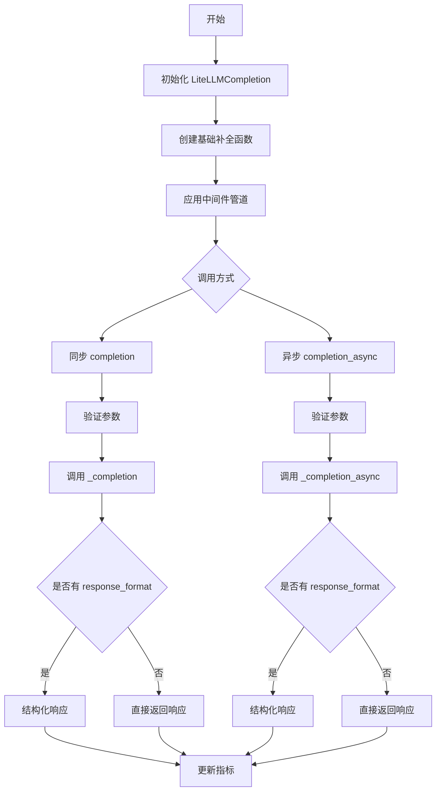
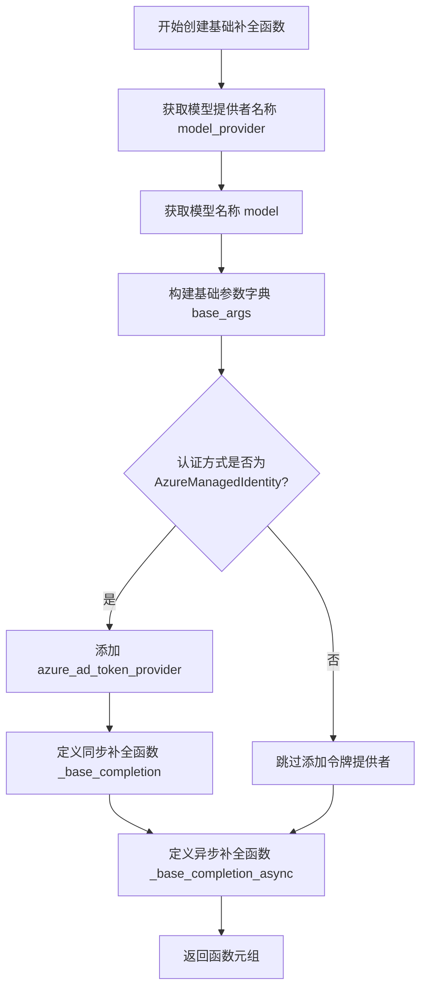
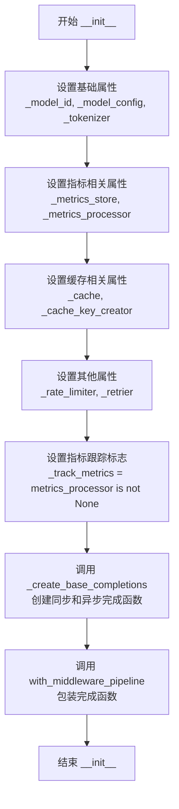
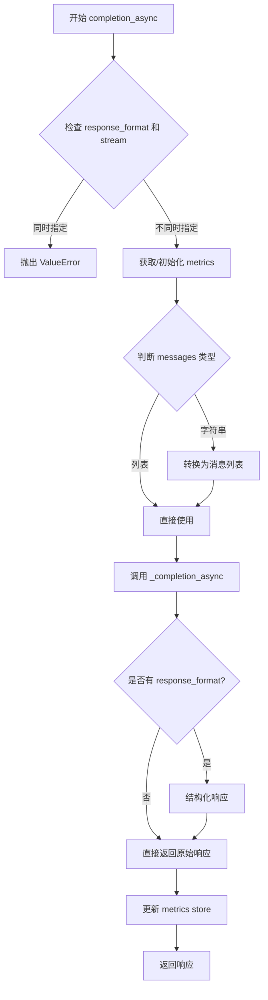
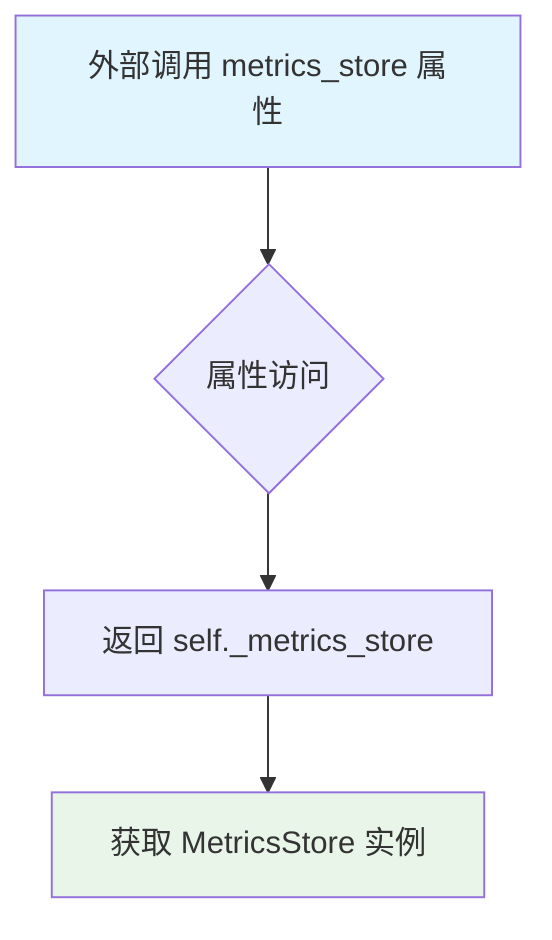
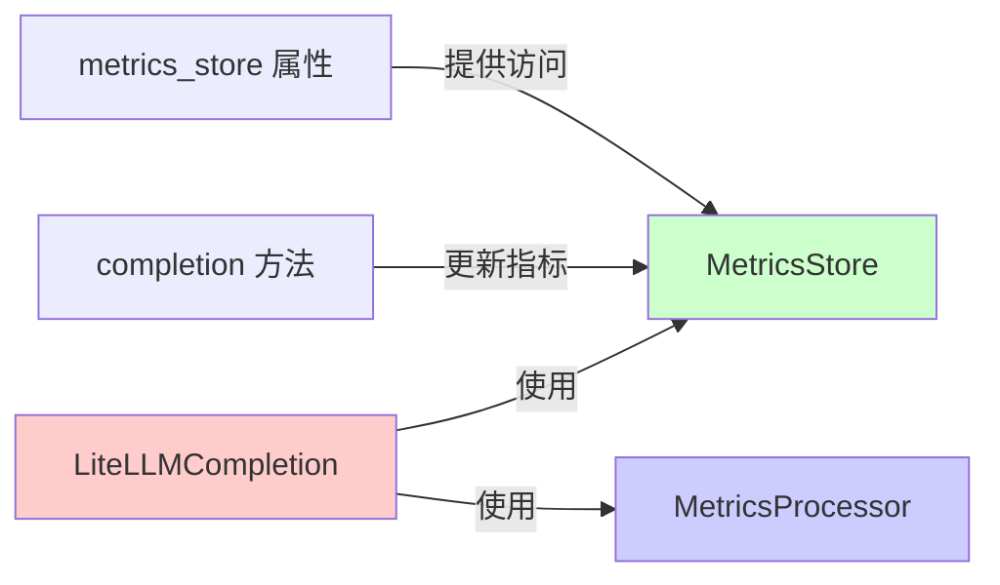
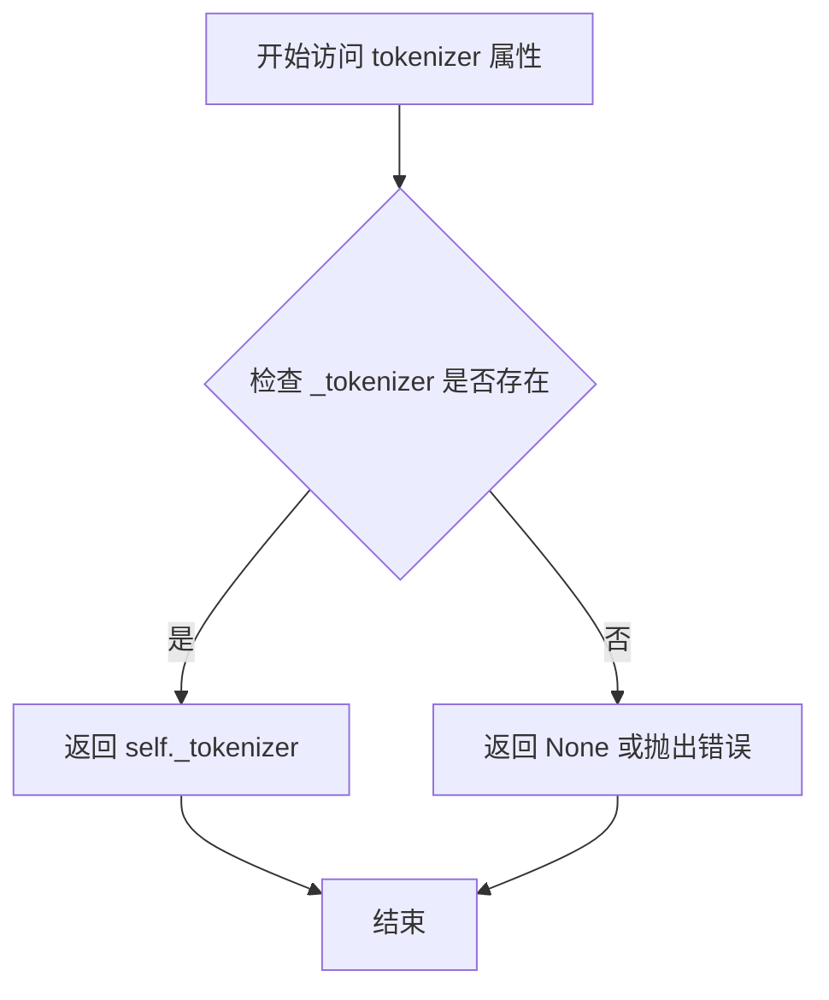

# `graphrag\packages\graphrag-llm\graphrag_llm\completion\lite_llm_completion.py` 详细设计文档

基于 litellm 库的 LLMCompletion 实现，提供同步和异步的模型补全功能，支持缓存、速率限制、重试、指标收集和中间件管道集成。

## 整体流程



## 类结构

```
LLMCompletion (抽象基类)
└── LiteLLMCompletion (实现类)
    ├── _create_base_completions (全局函数)
```

## 全局变量及字段


### `litellm.suppress_debug_info`
    
控制 litellm 调试信息输出

类型：`bool`
    


### `LiteLLMCompletion._model_config`
    
模型配置

类型：`ModelConfig`
    


### `LiteLLMCompletion._model_id`
    
模型标识符

类型：`str`
    


### `LiteLLMCompletion._track_metrics`
    
是否跟踪指标

类型：`bool`
    


### `LiteLLMCompletion._metrics_store`
    
指标存储

类型：`MetricsStore`
    


### `LiteLLMCompletion._metrics_processor`
    
指标处理器

类型：`MetricsProcessor | None`
    


### `LiteLLMCompletion._cache`
    
缓存实例

类型：`Cache | None`
    


### `LiteLLMCompletion._cache_key_creator`
    
缓存键创建器

类型：`CacheKeyCreator`
    


### `LiteLLMCompletion._tokenizer`
    
分词器

类型：`Tokenizer`
    


### `LiteLLMCompletion._rate_limiter`
    
速率限制器

类型：`RateLimiter | None`
    


### `LiteLLMCompletion._retrier`
    
重试策略

类型：`Retry | None`
    


### `LiteLLMCompletion._completion`
    
同步补全函数

类型：`LLMCompletionFunction`
    


### `LiteLLMCompletion._completion_async`
    
异步补全函数

类型：`AsyncLLMCompletionFunction`
    
    

## 全局函数及方法


### `_create_base_completions`

创建基础补全函数对（同步和异步），根据模型配置构建LiteLLM调用参数，处理认证方式（API密钥或Azure托管身份），并返回适配graphrag_llm接口的同步和异步补全函数。

参数：

- `model_config`：`ModelConfig`，模型配置对象，包含模型提供者、模型名称、API配置等信息
- `drop_unsupported_params`：`bool`，是否丢弃模型提供者不支持的参数
- `azure_cognitive_services_audience`：`str`，Azure认知服务的令牌受众，用于托管身份认证

返回值：`tuple[LLMCompletionFunction, AsyncLLMCompletionFunction]`，返回同步和异步补全函数组成的元组

#### 流程图



#### 带注释源码

```python
def _create_base_completions(
    *,
    model_config: "ModelConfig",
    drop_unsupported_params: bool,
    azure_cognitive_services_audience: str,
) -> tuple["LLMCompletionFunction", "AsyncLLMCompletionFunction"]:
    """Create base completions for LiteLLM.

    Convert litellm completion functions to graphrag_llm LLMCompletionFunction.
    LLMCompletionFunction is close to the litellm completion function signature,
    but uses a few extra params such as metrics. Remove graphrag_llm LLMCompletionFunction
    specific params before calling litellm completion functions.
    """
    # 从模型配置中获取模型提供者名称（如 "azure", "openai" 等）
    model_provider = model_config.model_provider
    # 获取模型名称，优先使用Azure部署名称，否则使用模型名称
    model = model_config.azure_deployment_name or model_config.model

    # 构建基础参数字典，包含LiteLLM调用所需的通用参数
    base_args: dict[str, Any] = {
        "drop_params": drop_unsupported_params,  # 是否丢弃不支持的参数
        "model": f"{model_provider}/{model}",    # 完整模型标识符
        "api_key": model_config.api_key,          # API密钥
        "api_base": model_config.api_base,        # API基础URL
        "api_version": model_config.api_version,  # API版本
        **model_config.call_args,                 # 额外的调用参数
    }

    # 如果使用Azure托管身份认证，设置令牌提供者函数
    if model_config.auth_method == AuthMethod.AzureManagedIdentity:
        base_args["azure_ad_token_provider"] = get_bearer_token_provider(
            DefaultAzureCredential(), azure_cognitive_services_audience
        )

    # 定义同步基础补全函数
    def _base_completion(
        **kwargs: Any,
    ) -> LLMCompletionResponse | Iterator[LLMCompletionChunk]:
        # 移除graphrag_llm特定的metrics参数，不传递给LiteLLM
        kwargs.pop("metrics", None)
        # 获取mock_response用于测试
        mock_response: str | None = kwargs.pop("mock_response", None)
        # 处理JSON对象格式请求
        json_object: bool | None = kwargs.pop("response_format_json_object", None)
        # 合并基础参数和动态传入的参数
        new_args: dict[str, Any] = {**base_args, **kwargs}

        # 如果启用了mock_responses且提供了mock_response，添加到参数中
        if model_config.mock_responses and mock_response is not None:
            new_args["mock_response"] = mock_response

        # 如果请求JSON对象格式且未指定response_format，设置JSON对象格式
        if json_object and "response_format" not in new_args:
            new_args["response_format"] = {"type": "json_object"}

        # 调用LiteLLM的同步补全接口
        response = litellm.completion(
            **new_args,
        )
        # 如果是ModelResponse（单次响应），转换为LLMCompletionResponse
        if isinstance(response, ModelResponse):
            return LLMCompletionResponse(**response.model_dump())

        # 否则返回流式响应迭代器
        def _run_iterator() -> Iterator[LLMCompletionChunk]:
            for chunk in response:
                yield LLMCompletionChunk(**chunk.model_dump())

        return _run_iterator()

    # 定义异步基础补全函数
    async def _base_completion_async(
        **kwargs: Any,
    ) -> LLMCompletionResponse | AsyncIterator[LLMCompletionChunk]:
        # 移除graphrag_llm特定的metrics参数
        kwargs.pop("metrics", None)
        # 获取mock_response用于测试
        mock_response: str | None = kwargs.pop("mock_response", None)
        # 处理JSON对象格式请求
        json_object: bool | None = kwargs.pop("response_format_json_object", None)
        # 合并基础参数和动态传入的参数
        new_args: dict[str, Any] = {**base_args, **kwargs}

        # 如果启用了mock_responses且提供了mock_response
        if model_config.mock_responses and mock_response is not None:
            new_args["mock_response"] = mock_response

        # 如果请求JSON对象格式且未指定response_format
        if json_object and "response_format" not in new_args:
            new_args["response_format"] = {"type": "json_object"}

        # 调用LiteLLM的异步补全接口
        response = await litellm.acompletion(
            **new_args,
        )
        # 如果是ModelResponse，转换为LLMCompletionResponse
        if isinstance(response, ModelResponse):
            return LLMCompletionResponse(**response.model_dump())

        # 否则返回异步流式响应迭代器
        async def _run_iterator() -> AsyncIterator[LLMCompletionChunk]:
            async for chunk in response:
                yield LLMCompletionChunk(**chunk.model_dump())  # type: ignore

        return _run_iterator()

    # 返回同步和异步补全函数元组
    return (_base_completion, _base_completion_async)
```


### `LiteLLMCompletion.__init__`

初始化 LiteLLMCompletion 实例，配置模型参数、分词器、指标存储、缓存、速率限制器和重试策略，并创建经过中间件管道包装的同步和异步完成方法。

参数：

- `model_id`：`str`，LiteLLM 模型 ID，例如 "openai/gpt-4o"
- `model_config`：`ModelConfig`，模型配置对象，包含模型提供者、部署名称、API 密钥等配置
- `tokenizer`：`Tokenizer`，用于文本分词的工具
- `metrics_store`：`MetricsStore`，指标存储对象，用于记录和更新指标数据
- `metrics_processor`：`MetricsProcessor | None`，可选的指标处理器，用于处理指标数据，默认为 None
- `rate_limiter`：`RateLimiter | None`，可选的速率限制器，用于控制请求频率，默认为 None
- `retrier`：`Retry | None`，可选的重试策略，用于处理失败的请求，默认为 None
- `cache`：`Cache | None`，可选的缓存实例，用于缓存请求结果，默认为 None
- `cache_key_creator`：`CacheKeyCreator`，缓存键创建器，用于生成缓存键
- `azure_cognitive_services_audience`：`str`，Azure 认知服务的受众 URL，默认值为 "https://cognitiveservices.azure.com/.default"，用于托管身份认证
- `drop_unsupported_params`：`bool`，是否丢弃不支持的参数，默认值为 True
- `kwargs`：`Any`，其他额外关键字参数

返回值：`None`，该方法不返回任何值，仅初始化实例状态

#### 流程图



#### 带注释源码

```python
def __init__(
    self,
    *,
    model_id: str,
    model_config: "ModelConfig",
    tokenizer: "Tokenizer",
    metrics_store: "MetricsStore",
    metrics_processor: "MetricsProcessor | None" = None,
    rate_limiter: "RateLimiter | None" = None,
    retrier: "Retry | None" = None,
    cache: "Cache | None" = None,
    cache_key_creator: "CacheKeyCreator",
    azure_cognitive_services_audience: str = "https://cognitiveservices.azure.com/.default",
    drop_unsupported_params: bool = True,
    **kwargs: Any,
) -> None:
    """Initialize LiteLLMCompletion.

    Args
    ----
        model_id: str
            The LiteLLM model ID, e.g., "openai/gpt-4o"
        model_config: ModelConfig
            The configuration for the model.
        tokenizer: Tokenizer
            The tokenizer to use.
        metrics_store: MetricsStore | None (default: None)
            The metrics store to use.
        metrics_processor: MetricsProcessor | None (default: None)
            The metrics processor to use.
        cache: Cache | None (default: None)
            An optional cache instance.
        cache_key_prefix: str | None (default: "chat")
            The cache key prefix. Required if cache is provided.
        rate_limiter: RateLimiter | None (default: None)
            The rate limiter to use.
        retrier: Retry | None (default: None)
            The retry strategy to use.
        azure_cognitive_services_audience: str (default: "https://cognitiveservices.azure.com/.default")
            The audience for Azure Cognitive Services when using Managed Identity.
        drop_unsupported_params: bool (default: True)
            Whether to drop unsupported parameters for the model provider.
    """
    # 1. 设置模型标识和配置
    self._model_id = model_id
    self._model_config = model_config
    self._tokenizer = tokenizer
    
    # 2. 设置指标存储和处理器
    self._metrics_store = metrics_store
    self._metrics_processor = metrics_processor
    self._track_metrics = metrics_processor is not None  # 仅在有处理器时启用指标跟踪
    
    # 3. 设置缓存相关属性
    self._cache = cache
    self._cache_key_creator = cache_key_creator
    
    # 4. 设置速率限制和重试策略
    self._rate_limiter = rate_limiter
    self._retrier = retrier

    # 5. 创建基础的同步和异步完成函数
    # 该函数会处理 Azure 托管身份认证、模型参数配置等
    self._completion, self._completion_async = _create_base_completions(
        model_config=model_config,
        drop_unsupported_params=drop_unsupported_params,
        azure_cognitive_services_audience=azure_cognitive_services_audience,
    )

    # 6. 使用中间件管道包装完成函数
    # 添加缓存、指标、速率限制、重试等功能
    self._completion, self._completion_async = with_middleware_pipeline(
        model_config=self._model_config,
        model_fn=self._completion,
        async_model_fn=self._completion_async,
        request_type="chat",
        cache=self._cache,
        cache_key_creator=self._cache_key_creator,
        tokenizer=self._tokenizer,
        metrics_processor=self._metrics_processor,
        rate_limiter=self._rate_limiter,
        retrier=self._retrier,
    )
```


### `LiteLLMCompletion.completion`

这是 `LiteLLMCompletion` 类的同步补全方法（Completion Method）。该方法负责接收用户的聊天消息，构建请求参数，调用底层 LiteLLM 适配器（经过中间件流水线处理），处理结构化响应，并最终返回 LLM 的补全结果。此方法支持非流式和流式两种模式。

参数：

- `self`：`LiteLLMCompletion`，当前类实例，隐含参数。
- `messages`：`LLMCompletionMessagesParam`，从 kwargs 中提取。用户输入的消息，支持字符串或消息列表格式。
- `response_format`：`ResponseFormat | None`，从 kwargs 中提取。期望的输出格式（如 JSON Schema），若为流式请求则不支持此参数。
- `stream`：`bool`，从 kwargs 中提取。是否以流式迭代器形式返回结果。
- `**kwargs`：`Unpack["LLMCompletionArgs[ResponseFormat]"]`，包含其他传递给 LLM 的可选参数（如 `temperature`, `max_tokens`, `model` 等）。

返回值：`"LLMCompletionResponse[ResponseFormat] | Iterator[LLMCompletionChunk]"`
- 当 `stream` 为 `False` 时，返回包含完整内容的 `LLMCompletionResponse` 对象。
- 当 `stream` 为 `True` 时，返回一个 `Iterator[LLMCompletionChunk]`（生成器），用于逐块处理流式输出。

#### 流程图

```mermaid
flowchart TD
    A([Start completion]) --> B[Extract messages, response_format, stream from kwargs]
    B --> C{response_format is not None and is_streaming?}
    C -->|Yes| D[Raise ValueError: response_format not supported for streaming]
    C -->|No| E[Extract request_metrics]
    E --> F{self._track_metrics is True?}
    F -->|Yes| G[Keep request_metrics]
    F -->|No| H[Set request_metrics to None]
    G --> I
    H --> I
    I{messages is string?}
    I -->|Yes| J[Convert messages to List[Dict]]
    I -->|No| K[Keep messages as is]
    J --> L[Call self._completion with messages, metrics, response_format, and kwargs]
    L --> M{Try Block}
    M --> N{response_format is not None?}
    N -->|Yes| O[Call structure_completion_response to format content]
    N -->|No| P[Skip formatting]
    O --> Q[Assign formatted_response to response]
    P --> R[Finally Block: Update metrics if needed]
    Q --> R
    K --> L
    R --> S([Return response or stream iterator])
```

#### 带注释源码

```python
def completion(
    self,
    /,
    **kwargs: Unpack["LLMCompletionArgs[ResponseFormat]"],
) -> "LLMCompletionResponse[ResponseFormat] | Iterator[LLMCompletionChunk]":
    """Sync completion method."""
    # 1. 从关键字参数中提取并弹出核心参数
    messages: LLMCompletionMessagesParam = kwargs.pop("messages")
    response_format = kwargs.pop("response_format", None)

    # 2. 判断是否为流式请求
    is_streaming = kwargs.get("stream") or False

    # 3. 校验逻辑：流式请求不支持 response_format
    if response_format is not None and is_streaming:
        msg = "response_format is not supported for streaming completions."
        raise ValueError(msg)

    # 4. 处理指标（Metrics）参数
    # 如果未启用指标跟踪，则忽略传入的 metrics
    request_metrics: Metrics | None = kwargs.pop("metrics", None) or {}
    if not self._track_metrics:
        request_metrics = None

    # 5. 消息格式规范化：如果 messages 是纯字符串，则转换为标准消息列表格式
    if isinstance(messages, str):
        messages = [{"role": "user", "content": messages}]

    try:
        # 6. 调用底层补全函数（经过中间件封装）
        # 传入处理好的 messages、metrics、response_format 以及其他 kwargs
        response = self._completion(
            messages=messages,
            metrics=request_metrics,
            response_format=response_format,
            **kwargs,  # type: ignore
        )
        
        # 7. 后处理：如果指定了 response_format，进行结构化响应处理
        if response_format is not None:
            structured_response = structure_completion_response(
                response.content, response_format
            )
            # 将结构化结果挂载到响应对象上
            response.formatted_response = structured_response
            
        # 8. 返回响应（非流式为对象，流式为迭代器）
        return response
    finally:
        # 9. 无论成功还是异常finally块都会执行，确保指标更新
        if request_metrics is not None:
            self._metrics_store.update_metrics(metrics=request_metrics)
```


### `LiteLLMCompletion.completion_async`

异步补全方法，处理聊天补全请求，支持流式和非流式响应，并集成了中间件管道（缓存、指标、重试、速率限制）。

参数：

- `self`：隐式参数，LiteLLMCompletion 实例，当前类的实例
- `**kwargs`：`Unpack["LLMCompletionArgs[ResponseFormat]"]`，可变参数，包含聊天补全请求的各种参数，如 messages、temperature、max_tokens 等

返回值：`LLMCompletionResponse[ResponseFormat] | AsyncIterator[LLMCompletionChunk]`，非流式请求返回 LLMCompletionResponse 对象，流式请求返回异步迭代器

#### 流程图



#### 带注释源码

```python
async def completion_async(
    self,
    /,
    **kwargs: Unpack["LLMCompletionArgs[ResponseFormat]"],
) -> "LLMCompletionResponse[ResponseFormat] | AsyncIterator[LLMCompletionChunk]":
    """Async completion method."""
    # 从 kwargs 中提取 messages 参数，这是必需的对话消息
    messages: LLMCompletionMessagesParam = kwargs.pop("messages")
    # 从 kwargs 中提取 response_format 参数，用于结构化输出
    response_format = kwargs.pop("response_format", None)

    # 检查是否为流式请求
    is_streaming = kwargs.get("stream") or False

    # 如果同时指定了 response_format 和 streaming，抛出错误
    # 因为结构化输出不支持流式响应
    if response_format is not None and is_streaming:
        msg = "response_format is not supported for streaming completions."
        raise ValueError(msg)

    # 获取或初始化请求指标
    # 如果没有启用指标跟踪，则设为 None
    request_metrics: Metrics | None = kwargs.pop("metrics", None) or {}
    if not self._track_metrics:
        request_metrics = None

    # 如果 messages 是字符串，转换为消息列表格式
    # 方便处理单字符串输入的情况
    if isinstance(messages, str):
        messages = [{"role": "user", "content": messages}]

    try:
        # 调用异步补全方法
        # 传入消息、指标、响应格式和其他参数
        response = await self._completion_async(
            messages=messages,
            metrics=request_metrics,
            response_format=response_format,
            **kwargs,  # type: ignore
        )
        
        # 如果指定了 response_format，对响应内容进行结构化处理
        # 将原始内容转换为指定格式
        if response_format is not None:
            structured_response = structure_completion_response(
                response.content, response_format
            )
            # 将结构化响应添加到响应对象中
            response.formatted_response = structured_response
        
        # 返回处理后的响应
        return response
    finally:
        # 在方法返回后更新指标存储
        # 确保即使发生异常也能记录指标
        if request_metrics is not None:
            self._metrics_store.update_metrics(metrics=request_metrics)
```


### `LiteLLMCompletion.metrics_store`

这是一个属性访问器方法，用于获取 `LiteLLMCompletion` 类中封装的指标存储（MetricsStore）实例。该属性返回在初始化时注入的指标存储对象，使得外部调用者可以访问当前的指标存储状态。

参数： 无

返回值：`MetricsStore`，返回指标存储实例，用于记录和更新请求指标数据。

#### 流程图



#### 带注释源码

```python
@property
def metrics_store(self) -> "MetricsStore":
    """Get metrics store.
    
    该属性方法提供对内部指标存储对象的只读访问。
    MetricsStore 用于收集和聚合 LLM 调用过程中的各种指标，
    如请求延迟、令牌使用量、错误率等。
    
    Returns
    -------
    MetricsStore
        当前配置的指标存储实例
    """
    return self._metrics_store
```

#### 相关类字段信息

| 字段名称 | 类型 | 描述 |
|---------|------|------|
| `_metrics_store` | `MetricsStore` | 内部维护的指标存储实例，用于记录 LLM 调用的各项指标数据 |
| `_metrics_processor` | `MetricsProcessor \| None` | 指标处理器，用于处理和聚合指标数据 |
| `_track_metrics` | `bool` | 布尔标志，指示是否启用指标跟踪功能 |

#### 设计意图与约束

1. **只读访问**：该属性仅提供读取权限，不允许外部修改内部指标存储，确保指标数据的一致性
2. **依赖注入**：指标存储通过构造函数注入，符合依赖注入设计原则，便于测试和替换
3. **可选性**：指标存储可以为空（`None`），但该属性总是返回有效的 `MetricsStore` 实例（构造函数中必填）

#### 与其他组件的关系



- `metrics_store` 供 `completion` 和 `completion_async` 方法在请求完成后调用 `update_metrics()` 更新指标数据
- 该属性使外部系统（如监控系统）可以查询当前的指标状态


### `LiteLLMCompletion.tokenizer`

获取 LiteLLMCompletion 实例的分词器（Tokenizer）属性。

参数：无需参数（这是一个属性访问器）

返回值：`Tokenizer`，返回当前实例配置的分词器对象，用于对文本进行分词处理。

#### 流程图



#### 带注释源码

```python
@property
def tokenizer(self) -> "Tokenizer":
    """Get tokenizer.
    
    返回当前 LiteLLMCompletion 实例关联的分词器（Tokenizer）对象。
    该分词器在初始化时传入，用于对输入文本和输出文本进行分词处理，
    特别是在缓存键创建和指标计算等场景中发挥重要作用。
    
    Returns
    -------
    Tokenizer
        当前实例配置的分词器实例
    """
    return self._tokenizer
```

## 关键组件


### LiteLLMCompletion

基于LiteLLM库实现的LLMCompletion类，提供同步和异步的对话补全功能，集成缓存、重试、速率限制和指标追踪能力。

### 同步完成方法 (completion)

处理同步请求，支持流式输出和结构化响应，处理指标追踪和错误处理。

### 异步完成方法 (completion_async)

处理异步请求，提供与同步方法相同的功能但支持异步迭代器返回流式内容。

### 基础完成函数创建器 (_create_base_completions)

创建LiteLLM的基础完成函数，将graphrag_llm特定的参数转换为LiteLLM兼容的参数，支持Azure Managed Identity认证。

### 中间件管道 (with_middleware_pipeline)

集成缓存、指标处理、速率限制和重试机制的中间件管道，统一处理请求生命周期。

### 指标追踪系统

通过MetricsStore和MetricsProcessor实现请求指标收集和存储，支持性能监控。

### 缓存机制

基于Cache和CacheKeyCreator实现请求结果缓存，支持对话历史的键值缓存。

### 速率限制器 (RateLimiter)

控制请求频率，防止API调用超出限制。

### 重试策略 (Retry)

配置失败请求的自动重试机制，提高系统可靠性。

### 结构化响应处理 (structure_completion_response)

将文本响应解析为指定格式的结构化数据，支持JSON对象输出。


## 问题及建议


### 已知问题

-   **重复代码**：completion 和 completion_async 方法中存在大量重复逻辑，包括 response_format 验证、metrics 处理、messages 转换和 response_format 结构化处理，违反了 DRY 原则
-   **中间件初始化冗余**：_create_base_completions 返回的函数被赋值给 self._completion 后，又立即被 with_middleware_pipeline 返回的结果覆盖，导致第一次调用的结果被丢弃
-   **异常处理不完善**：response_format 的结构化处理在 try-finally 块之外，若该处抛出异常，metrics 仍会被更新，可能导致状态不一致
-   **mock_response 逻辑混乱**：在 _create_base_completions 中同时检查 model_config.mock_responses 和 mock_response 是否为 None，逻辑不够直观，容易产生误解
-   **缓存键创建器未使用**：_cache_key_creator 被传入但未在初始化中直接使用，而是传递给中间件，调用方无法直观理解其用途
-   **参数校验不足**：缺少对 model_id、model_config 等关键必要参数的空值校验，可能导致运行时错误
-   **类型推断困难**：大量使用 Any 类型和 kwargs，使得 IDE 无法提供准确的类型提示和自动补全
-   **流式响应处理复杂**：同步和异步方法都返回 Iterator/AsyncIterator，调用方需要处理两种不同的迭代方式，增加了使用复杂度

### 优化建议

-   将 completion 和 completion_async 中的公共逻辑抽取为私有方法，如 _validate_request、_process_messages、_handle_response_format 等
-   移除 _create_base_completions 结果的首次赋值，直接将结果赋值给最终变量
-   将 response_format 的结构化处理移入 try-finally 块，确保与 metrics 更新的一致性
-   简化 mock_response 逻辑，明确区分"启用 mock"和"指定 mock 内容"两个概念
-   添加必要的参数校验，在 __init__ 或方法入口处检查关键参数的有效性
-   减少 Any 类型的使用，尽量为 kwargs 和内部变量指定具体类型
-   考虑使用泛型或策略模式统一流式响应的处理方式
-   为 _cache_key_creator 添加类型注解，并在类文档中说明其用途
</think>

## 其它


### 设计目标与约束

本模块旨在提供一个统一的LLMCompletion接口，基于litellm库实现对多种大语言模型（OpenAI、Azure等）的调用支持。核心设计目标包括：1）统一同步/异步completion调用；2）支持结构化输出、流式输出、缓存、指标收集、速率限制和重试等横切关注点；3）提供灵活的配置机制以适配不同模型提供商。设计约束包括：不支持流式输出与response_format同时使用；依赖litellm库进行底层模型调用；仅支持特定认证方式（API Key、Azure Managed Identity）。

### 错误处理与异常设计

本代码中的错误处理设计如下：1）参数校验错误：在completion/completion_async方法中，若同时指定stream=True和response_format，会抛出ValueError("response_format is not supported for streaming completions.")；2）metrics相关错误：通过try-finally块确保metrics在方法结束后一定会被更新，即使发生异常也能记录；3）结构化响应解析错误：structure_completion_response函数可能抛出解析异常，但该异常会直接向上传播。潜在改进：增加更多参数校验（如messages为空、model_id无效等），为不同类型的错误定义具体的异常类以便调用方进行针对性处理。

### 数据流与状态机

同步completion流程：调用方传入messages和其他参数 → 校验stream与response_format不共存 → 提取metrics → 转换为标准消息格式 → 通过middleware管道（包括缓存查找、速率限制、重试）调用_base_completion → 调用litellm.completion → 处理响应（结构化输出或流式迭代器） → 更新metrics → 返回响应。异步completion流程类似，区别在于使用async/await和异步迭代器。状态机转换：Idle（初始状态）→ Processing（处理中）→ Completed（成功）或Error（异常），但当前代码未显式管理状态。

### 外部依赖与接口契约

本模块依赖以下外部组件：1）litellm库：用于底层模型调用，接口为litellm.completion和litellm.acompletion；2）graphrag_llm.completion.LLMCompletion：抽象基类，定义接口契约；3）graphrag_llm.middleware.with_middleware_pipeline：中间件管道，封装缓存、速率限制、重试逻辑；4）graphrag_cache.Cache：缓存接口；5）graphrag_llm.rate_limit.RateLimiter：速率限制器；6）graphrag_llm.retry.Retry：重试策略；7）graphrag_llm.metrics：指标收集相关组件；8）azure.identity：用于Azure Managed Identity认证。接口契约：LLMCompletionArgs定义标准输入参数格式，LLMCompletionResponse定义标准输出格式。

### 配置管理

本模块通过ModelConfig、AuthMethod等配置类管理模型配置。关键配置项包括：model_provider（模型提供商）、azure_deployment_name或model（模型名称）、api_key、api_base、api_version、call_args（额外调用参数）、auth_method（认证方式）。初始化时通过参数传入，_create_base_completions函数将配置转换为litellm所需格式。配置生命周期：创建LiteLLMCompletion实例时一次性传入，运行时不可变。

### 性能考虑

性能相关设计包括：1）中间件管道采用装饰器模式，避免在主路径中引入额外开销；2）流式输出使用迭代器而非一次性加载所有内容，降低内存占用；3）缓存机制避免重复请求；4）metrics_processor为可选组件，默认不启用以减少开销。潜在优化点：可考虑增加请求超时配置、连接池管理、批量请求支持。

### 安全性考虑

安全相关设计：1）支持Azure Managed Identity进行无密钥认证，避免API Key泄露；2）litellm.suppress_debug_info = True抑制调试信息输出，防止敏感信息泄露；3）drop_unsupported_params=True默认丢弃不支持的参数，防止意外传递敏感配置。安全建议：增加请求/响应日志脱敏、敏感配置加密存储、API Key轮换机制。

### 测试策略

建议的测试覆盖：1）单元测试：测试completion和completion_async方法的基本功能、流式输出、错误处理；2）集成测试：测试与litellm、缓存、速率限制器、重试机制的真实交互；3）Mock测试：使用mock_response参数模拟各种响应场景；4）边界测试：测试空messages、无效response_format、同时stream和response_format等边界情况。

### 版本兼容性

本模块依赖的外部接口可能存在版本兼容性风险：1）litellm库的接口可能随版本变化；2）ModelResponse的结构可能变化；3）graphrag_llm内部模块的接口变化。维护建议：明确声明依赖版本范围，增加接口变更的迁移指南。

### 使用示例与最佳实践

基本同步调用：
```python
completion = LiteLLMCompletion(
    model_id="openai/gpt-4o",
    model_config=model_config,
    tokenizer=tokenizer,
    metrics_store=metrics_store,
    cache=cache,
    cache_key_creator=cache_key_creator,
)
response = completion.completion(messages=[{"role": "user", "content": "Hello"}])
```

带结构化输出：
```python
response = completion.completion(
    messages=[{"role": "user", "content": "Extract info"}],
    response_format={"type": "json_object", "schema": {...}}
)
```

最佳实践：1）优先使用异步接口completion_async以提高并发性能；2）合理配置cache_key_creator以提高缓存命中率；3）启用metrics监控模型调用质量；4）根据API限制配置rate_limiter。

    