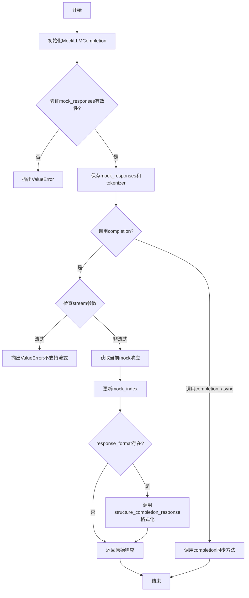
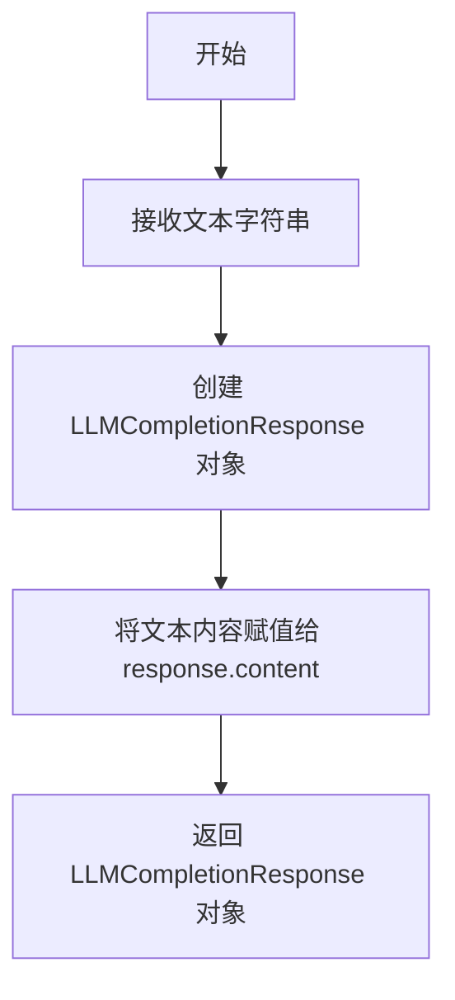
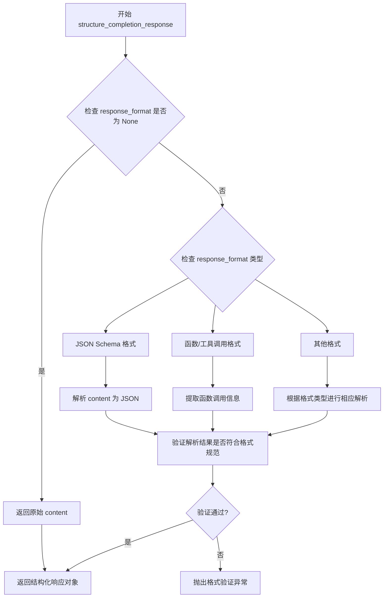
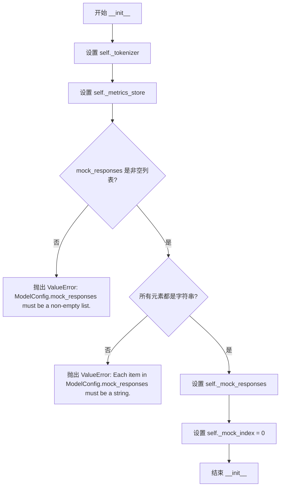
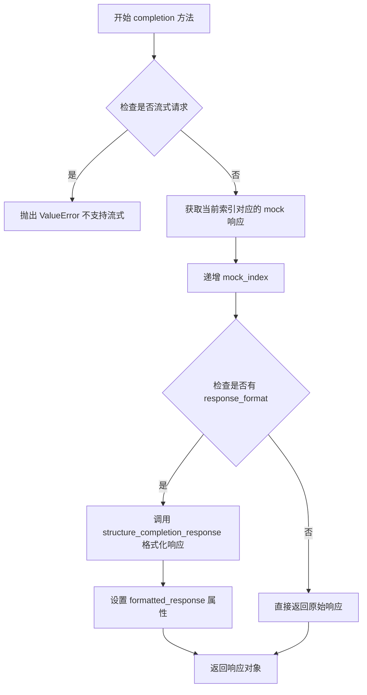
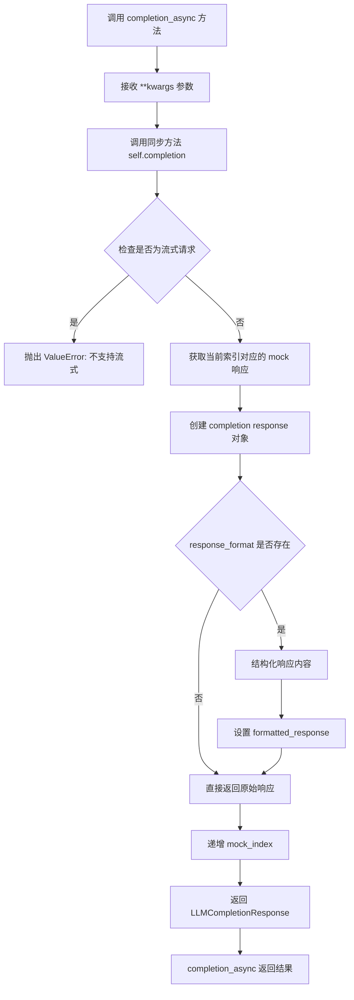
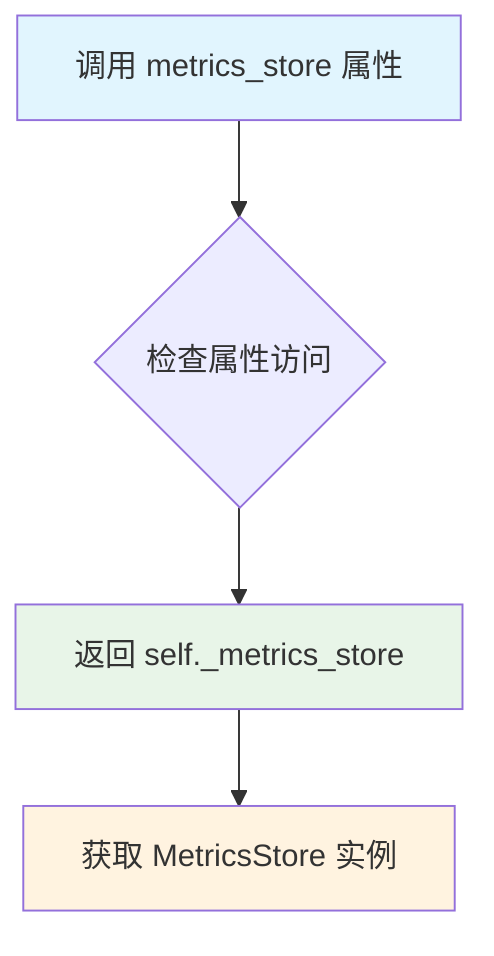
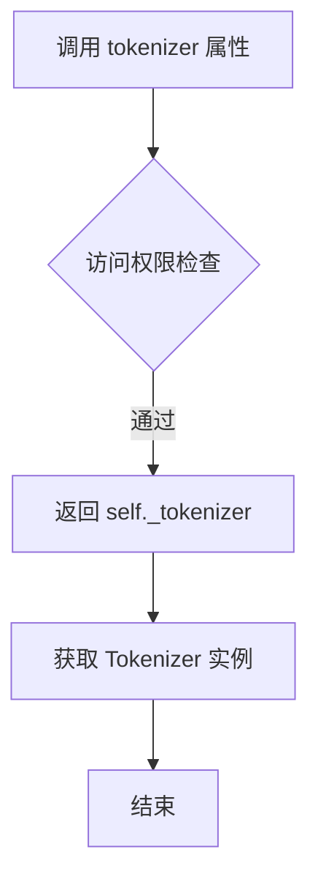

# `graphrag\packages\graphrag-llm\graphrag_llm\completion\mock_llm_completion.py` 详细设计文档

MockLLMCompletion类是一个基于litellm的LLM补全模拟器，通过预定义的mock响应列表模拟LLM调用行为，支持同步和异步补全方法，适用于测试和开发环境，避免实际调用外部LLM服务。

## 整体流程



## 类结构

```
LLMCompletion (抽象基类)
└── MockLLMCompletion (实现类)
```

## 全局变量及字段


### `litellm.suppress_debug_info`
    
全局变量，禁止litellm调试信息输出

类型：`bool`
    


### `MockLLMCompletion._metrics_store`
    
度量存储实例

类型：`MetricsStore`
    


### `MockLLMCompletion._tokenizer`
    
分词器实例

类型：`Tokenizer`
    


### `MockLLMCompletion._mock_responses`
    
Mock响应文本列表

类型：`list[str]`
    


### `MockLLMCompletion._mock_index`
    
当前使用的mock响应索引

类型：`int`
    
    

## 全局函数及方法


### `create_completion_response`

将文本字符串转换为 LLMCompletionResponse 对象，用于在 MockLLMCompletion 中将预定义的模拟响应文本包装成标准响应格式。

参数：

-  `text`：`str`，要转换的文本内容，通常来自 `_mock_responses` 列表中的模拟响应字符串

返回值：`LLMCompletionResponse`，包含原始文本内容的响应对象

#### 流程图



#### 带注释源码

```python
# 从导入语句可知 create_completion_response 来源于 graphrag_llm.utils 模块
# 该函数接收一个字符串参数并返回 LLMCompletionResponse 对象

# 在 MockLLMCompletion.completion 方法中的调用方式：
response = create_completion_response(
    self._mock_responses[self._mock_index % len(self._mock_responses)]
)
# 解释：
# 1. self._mock_responses: 模型配置中的模拟响应列表
# 2. self._mock_index % len(self._mock_responses): 轮询选择模拟响应
# 3. create_completion_response(): 将选中的文本字符串转换为 LLMCompletionResponse 对象
# 4. 转换后的 response 对象包含 .content 属性存储原始文本
# 5. 如果指定了 response_format，还会通过 structure_completion_response() 进行结构化处理
```

> **注意**：由于提供的代码片段仅包含 `create_completion_response` 函数的导入和调用，未包含其具体实现，以上信息基于代码调用方式的推断。


### `structure_completion_response`

根据代码分析，`structure_completion_response` 是从 `graphrag_llm.utils` 模块导入的全局函数，用于根据指定的响应格式（response_format）对原始响应内容进行结构化处理，将非结构化的文本响应转换为符合特定格式的结构化数据。

参数：

-  `content`：`str`，原始的 LLM 响应内容文本
-  `response_format`：`ResponseFormat`，指定的响应格式规范，定义了输出应符合的结构化格式

返回值：`Any`，结构化后的响应对象，根据 response_format 的定义进行转换，可能返回字典或其他符合格式规范的数据结构

#### 流程图



#### 带注释源码

```python
# 该函数定义在 graphrag_llm.utils 模块中
# 此处展示在 MockLLMCompletion.completion 方法中的调用方式：

# 从 utils 模块导入
from graphrag_llm.utils import (
    create_completion_response,
    structure_completion_response,
)

# 在 completion 方法中的使用：
response = create_completion_response(
    self._mock_responses[self._mock_index % len(self._mock_responses)]
)
self._mock_index += 1

# 检查是否需要格式化响应
if response_format is not None:
    # 调用 structure_completion_response 进行结构化处理
    # 参数1: response.content - 原始文本响应内容
    # 参数2: response_format - ResponseFormat 格式规范
    structured_response = structure_completion_response(
        response.content, response_format
    )
    # 将结构化响应赋值给 response 对象的 formatted_response 属性
    response.formatted_response = structured_response

# 返回响应对象（可能包含 formatted_response 属性）
return response
```

> **注意**：由于 `structure_completion_response` 函数的完整实现源代码未在提供的代码文件中展示，上述流程图和源码注释是基于其在 `MockLLMCompletion.completion` 方法中的调用方式推断得出的。该函数的主要作用是将 LLM 返回的原始文本内容根据预定义的 `ResponseFormat` 规范转换为结构化的响应格式，以便于后续处理和解析。


### `MockLLMCompletion.__init__`

初始化 MockLLMCompletion 实例，验证并设置 mock_responses、tokenizer 和 metrics_store 属性。

参数：

- `model_config`：`ModelConfig`，包含模型配置信息，必须包含 mock_responses 字段
- `tokenizer`：`Tokenizer`，用于对文本进行分词
- `metrics_store`：`MetricsStore`，用于存储指标数据
- `**kwargs`：`Any`，可选的额外关键字参数

返回值：`None`，无返回值（构造函数）

#### 流程图



#### 带注释源码

```python
def __init__(
    self,
    *,
    model_config: "ModelConfig",
    tokenizer: "Tokenizer",
    metrics_store: "MetricsStore",
    **kwargs: Any,
) -> None:
    """Initialize LiteLLMCompletion.

    Args
    ----
        model_id: str
            The LiteLLM model ID, e.g., "openai/gpt-4o"
        model_config: ModelConfig
            The configuration for the model.
        tokenizer: Tokenizer
            The tokenizer to use.
        metrics_store: MetricsStore | None (default: None)
            The metrics store to use.
        metrics_processor: MetricsProcessor | None (default: None)
            The metrics processor to use.
        cache: Cache | None (default: None)
            An optional cache instance.
        cache_key_prefix: str | None (default: "chat")
            The cache key prefix. Required if cache is provided.
        rate_limiter: RateLimiter | None (default: None)
            The rate limiter to use.
        retrier: Retry | None (default: None)
            The retry strategy to use.
        azure_cognitive_services_audience: str (default: "https://cognitiveservices.azure.com/.default")
            The audience for Azure Cognitive Services when using Managed Identity.
        drop_unsupported_params: bool (default: True)
            Whether to drop unsupported parameters for the model provider.
    """
    # 1. 设置 tokenizer 实例变量
    self._tokenizer = tokenizer
    
    # 2. 设置 metrics_store 实例变量
    self._metrics_store = metrics_store

    # 3. 从 model_config 获取 mock_responses
    mock_responses = model_config.mock_responses
    
    # 4. 验证 mock_responses 是非空列表
    if not isinstance(mock_responses, list) or len(mock_responses) == 0:
        msg = "ModelConfig.mock_responses must be a non-empty list."
        raise ValueError(msg)

    # 5. 验证列表中每个元素都是字符串
    if not all(isinstance(resp, str) for resp in mock_responses):
        msg = "Each item in ModelConfig.mock_responses must be a string."
        raise ValueError(msg)

    # 6. 设置 mock_responses 实例变量
    self._mock_responses = mock_responses  # type: ignore
    
    # 7. 初始化 mock_index 用于轮询 mock 响应
    # 注意: 类定义中已设置 _mock_index: int = 0
```


### `MockLLMCompletion.completion`

同步补全方法，接受 LLMCompletionArgs 类型的参数，根据内部维护的 mock 响应列表和索引返回模拟的 LLM 响应，支持结构化输出格式。

参数：

- `**kwargs`：`Unpack["LLMCompletionArgs[ResponseFormat]"]`，可变关键字参数，包含模型调用所需的各种参数如 messages、temperature、response_format 等

返回值：`LLMCompletionResponse[ResponseFormat] | Iterator[LLMCompletionChunk]`，返回模拟的补全响应，如果是流式请求则抛出异常

#### 流程图



#### 带注释源码

```python
def completion(
    self,
    /,
    **kwargs: Unpack["LLMCompletionArgs[ResponseFormat]"],
) -> "LLMCompletionResponse[ResponseFormat] | Iterator[LLMCompletionChunk]":
    """Sync completion method."""
    # 从 kwargs 中弹出 response_format 参数，用于后续可能的结构化响应处理
    response_format = kwargs.pop("response_format", None)

    # 检查是否为流式请求，MockLLMCompletion 不支持流式输出
    is_streaming = kwargs.get("stream", False)
    if is_streaming:
        msg = "MockLLMCompletion does not support streaming completions."
        raise ValueError(msg)

    # 根据当前索引从 mock_responses 列表中获取响应内容
    # 使用模运算实现循环轮询机制
    response = create_completion_response(
        self._mock_responses[self._mock_index % len(self._mock_responses)]
    )
    
    # 递增索引，为下一次调用准备
    self._mock_index += 1
    
    # 如果调用方指定了 response_format，则对响应内容进行结构化处理
    if response_format is not None:
        structured_response = structure_completion_response(
            response.content, response_format
        )
        # 将结构化结果挂载到响应对象的 formatted_response 属性
        response.formatted_response = structured_response
    
    # 返回最终的响应对象
    return response
```


### `MockLLMCompletion.completion_async`

异步补全方法，通过直接调用同步的 `completion` 方法实现异步执行，将异步调用桥接到同步实现上。

参数：

- `self`：`MockLLMCompletion`，隐式参数，指向当前 MockLLMCompletion 实例本身
- `/`：参数分隔符，表示其后的参数为仅位置参数
- `**kwargs`：`Unpack["LLMCompletionArgs[ResponseFormat]"]`，可变关键字参数，包含 LLM 完成请求的所有参数（如 prompt、temperature、max_tokens 等），类型由 `LLMCompletionArgs` 泛型定义

返回值：`LLMCompletionResponse[ResponseFormat] | AsyncIterator[LLMCompletionChunk]`，返回同步补全响应的结果，可能是结构化的响应对象或异步迭代器（虽然当前实现不支持流式）

#### 流程图



#### 带注释源码

```python
async def completion_async(
    self,
    /,
    **kwargs: Unpack["LLMCompletionArgs[ResponseFormat]"],
) -> "LLMCompletionResponse[ResponseFormat] | AsyncIterator[LLMCompletionChunk]":
    """Async completion method."""
    # 异步方法的核心实现：直接委托给同步的 completion 方法
    # 这里利用了 Python 异步编程的特性，在 IO 密集型场景下
    # 即使调用同步代码，事件循环也可以在等待时切换到其他任务
    #
    # 参数说明：
    # - /: 斜杠分隔符，表示其后的参数只能作为位置参数传递
    # - **kwargs: 接收任意数量的关键字参数，展开为 LLMCompletionArgs
    #
    # 返回值：
    # - 同步模式下返回 LLMCompletionResponse[ResponseFormat]
    # - 流式模式下理论上返回 AsyncIterator[LLMCompletionChunk]
    #   但当前实现不支持流式，会在同步方法中抛出异常
    return self.completion(**kwargs)  # type: ignore
```


### `MockLLMCompletion.metrics_store`

该属性方法用于获取 `MockLLMCompletion` 实例的度量存储（MetricsStore）对象，提供对内部度量数据存储的访问。

参数： 无

返回值：`MetricsStore`，返回当前 LLM Completion 实例关联的度量存储对象，用于记录和检索度量指标。

#### 流程图



#### 带注释源码

```python
@property
def metrics_store(self) -> "MetricsStore":
    """Get metrics store.
    
    返回当前 MockLLMCompletion 实例的度量存储对象。
    该属性为只读属性，提供对内部 _metrics_store 的访问。
    
    Returns
    -------
    MetricsStore
        与当前 LLM Completion 实例关联的度量存储对象
    """
    return self._metrics_store
```

#### 关联信息

| 元素 | 类型 | 描述 |
|------|------|------|
| `MockLLMCompletion` | 类 | 基于 litellm 的 LLMCompletion 模拟实现，用于测试和开发 |
| `_metrics_store` | 类字段 (私有) | `MetricsStore` 类型，存储度量数据的内部对象 |
| `LLMCompletion` | 基类 | 抽象基类，定义了 LLM 完成接口 |
| `MetricsStore` | 类型 | 度量存储接口，用于记录和检索度量指标 |


### `MockLLMCompletion.tokenizer`

该属性方法用于获取与 LLMCompletion 实例关联的分词器（Tokenizer），返回一个 `Tokenizer` 对象，供调用者使用该分词器对文本进行编码或解码操作。

参数： 无（属性方法不接受任何参数）

返回值：`Tokenizer`，返回实例初始化时注入的分词器对象，用于文本分词处理。

#### 流程图



#### 带注释源码

```python
@property
def tokenizer(self) -> "Tokenizer":
    """Get tokenizer."""
    return self._tokenizer
```

**源码注释说明：**

- `@property` 装饰器：将 `tokenizer` 方法转换为属性，使其可以通过 `instance.tokenizer` 的方式访问，而无需调用括号。
- `def tokenizer(self) -> "Tokenizer":`：定义名为 `tokenizer` 的实例方法，接收 `self` 参数，返回类型为 `Tokenizer`（字符串形式的前向引用，避免循环导入）。
- `"""Get tokenizer."""`：方法的文档字符串，简洁描述该方法的功能为"获取分词器"。
- `return self._tokenizer`：返回实例属性 `_tokenizer`，该属性在 `__init__` 方法中被初始化为传入的 `tokenizer` 参数。

## 关键组件


### MockLLMCompletion

MockLLMCompletion是一个基于litellm的LLMCompletion实现类，用于在测试或开发环境中模拟大语言模型的响应。该类通过维护一个预定义的mock响应列表，并使用索引轮循的方式依次返回响应，支持同步completion调用但不支持流式输出，同时具备响应格式化和结构化能力。

### _mock_responses

存储mock响应字符串的列表，用于在completion调用时返回预定义的响应内容。

### _mock_index

整型索引变量，用于记录当前返回到第几个mock响应，实现轮循机制。

### completion()

同步completion方法，接收LLMCompletionArgs参数，返回LLMCompletionResponse或Iterator[LLMCompletionChunk]。该方法首先检查是否支持流式输出（不支持则抛出ValueError），然后根据当前索引从_mock_responses中获取响应，若指定了response_format则调用structure_completion_response进行格式化，最后返回响应并递增索引。

### completion_async()

异步completion方法，委托给同步的completion方法执行，返回AsyncIterator或LLMCompletionResponse。

### metrics_store

只读属性，返回MetricsStore实例，用于访问指标存储功能。

### tokenizer

只读属性，返回Tokenizer实例，用于访问分词器功能。

### ModelConfig.mock_responses

从ModelConfig中获取的mock响应列表，该类在初始化时验证其必须为非空字符串列表。

### create_completion_response

从graphrag_llm.utils导入的辅助函数，用于将字符串响应转换为LLMCompletionResponse对象。

### structure_completion_response

从graphrag_llm.utils导入的辅助函数，用于根据response_format对响应内容进行结构化处理。


## 问题及建议


### 已知问题

-   **`__init__` 中的 `**kwargs` 未被使用**：构造函数接受 `**kwargs` 参数但完全未使用或存储，文档中描述的许多可选参数（如 `cache`、`rate_limiter` 等）并未实现。
-   **`_mock_index` 非线程安全**：在多线程或并发异步环境下，多个请求同时访问和修改 `_mock_index` 会导致竞态条件和不可预测的行为。
-   **`completion_async` 未实现真正的异步逻辑**：异步方法直接调用同步的 `completion` 方法，没有实现真正的异步行为，这可能导致异步上下文中的阻塞。
-   **流式输出未实现**：虽然显式抛出异常说明不支持流式输出，但对于 mock 类来说，可以实现基本的流式响应以支持更完整的测试场景。
-   **`metrics_store` 和 `tokenizer` 未被实际使用**：这两个依赖在初始化时被保存，但在 `completion` 和 `completion_async` 方法中完全没有被使用，造成资源浪费和设计意图不明确。
-   **全局状态修改**：代码直接修改 `litellm.suppress_debug_info = True`，这是一个全局配置，可能影响其他使用 litellm 的组件。
-   **`mock_responses` 类型处理**：使用 `# type: ignore` 跳过类型检查，表明类型定义可能存在问题，且缺少对响应内容格式的验证。
-   **缺少重置机制**：没有提供方法来重置 `_mock_index`，使得在测试场景中难以实现确定性的 mock 行为。
-   **父类契约可能未完全满足**：继承自 `LLMCompletion` 但可能未实现父类的所有抽象方法或完全遵守接口契约。

### 优化建议

-   实现真正的异步 `completion_async` 方法，使用 `asyncio` 或线程池来模拟异步行为。
-   使用线程锁（如 `threading.Lock`）或原子操作来保护 `_mock_index` 的并发访问。
-   移除或实现 `__init__` 中未使用的 `**kwargs`，或在文档中说明这些参数被忽略的原因。
-   为 `tokenizer` 和 `metrics_store` 实现实际的使用逻辑，或在类文档中说明它们为未来扩展保留。
-   提供 `reset()` 方法或构造函数参数来控制 mock 索引的重置行为。
-   实现基本的流式输出支持，通过将 mock 响应分割为多个 chunk 来模拟流式行为。
-   使用配置对象而非直接修改全局 `litellm` 配置，或在文档中明确说明此全局修改的影响。
-   移除 `# type: ignore` 并正确处理类型声明，或使用 `typing.cast` 明确类型转换。

## 其它


### 设计目标与约束

本模块的设计目标是为测试和开发环境提供一个轻量级的 LLM 补全模拟器，用于在无需调用真实 LLM API 的情况下验证上层逻辑。约束条件包括：仅支持同步补全（不支持流式输出），响应内容必须预先在 ModelConfig 中配置，不支持自定义系统提示词或聊天模板，且每个 MockLLMCompletion 实例只能顺序循环使用预设的响应列表。

### 错误处理与异常设计

代码中定义了两类异常情况，均抛出 ValueError：1) 当 ModelConfig.mock_responses 不是非空列表时抛出"ModelConfig.mock_responses must be a non-empty list."；2) 当列表中存在非字符串元素时抛出"Each item in ModelConfig.mock_responses must be a string."；3) 当调用流式补全时抛出"MockLLMCompletion does not support streaming completions."。异常设计遵循快速失败原则，在初始化阶段验证配置有效性，避免运行时错误。

### 数据流与状态机

数据流遵循以下路径：初始化阶段接收 ModelConfig、Tokenizer 和 MetricsStore，并将 mock_responses 列表和初始索引 0 存储为实例状态；调用 completion 方法时，根据当前索引从列表中取出响应字符串，索引自动递增（通过取模实现循环），若指定了 response_format 则调用 structure_completion_response 进行格式化，最后返回 LLMCompletionResponse 对象。状态机包含两个状态：就绪状态（等待调用）和响应已发送状态（索引已更新），每次调用后自动循环回到就绪状态。

### 外部依赖与接口契约

核心依赖包括：litellm 库（用于抑制调试信息和类型定义）、graphrag_llm.completion.completion.LLMCompletion（基类）、graphrag_llm.utils.create_completion_response（创建响应对象）、graphrag_llm.utils.structure_completion_response（结构化响应格式化）。接口契约要求：调用方必须提供包含 mock_responses 字段的 ModelConfig，且该字段为非空字符串列表；Tokenizer 和 MetricsStore 为可选依赖但会被引用；completion 方法接受任意 LLMCompletionArgs 参数但忽略大部分参数，仅处理 response_format 和 stream 参数。

### 性能考虑

当前实现性能开销极低，主要操作是列表索引访问和条件分支判断。潜在的性能问题包括：如果 mock_responses 列表极大，每次取模操作可能略微影响性能（建议预计算长度）；索引 _mock_index 为 int 类型无溢出风险（Python 自动处理大整数）。建议在高频调用场景下将 len(self._mock_responses) 缓存为实例变量以避免重复计算。

### 安全性考虑

当前模块不直接处理用户输入，安全性风险较低。需注意：1) mock_responses 内容由配置方提供，理论上可包含任意文本，建议在生产环境配置源头上进行内容审查；2) 未对 response_format 参数进行深度验证，结构化响应解析失败可能导致异常。建议添加响应内容长度限制以防止内存异常。

### 测试策略

建议覆盖以下测试用例：1) 有效配置下的初始化成功；2) 空列表和无效类型配置下的初始化失败；3) 顺序循环返回响应的行为；4) response_format 参数对输出的影响；5) 流式调用抛出预期异常；6) 多实例间索引独立性的验证。测试应使用 pytest 框架，通过 fixture 注入不同配置的 ModelConfig。

    