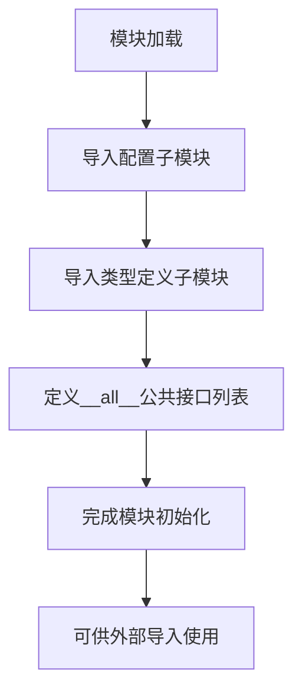

# `graphrag\packages\graphrag-llm\graphrag_llm\config\__init__.py` 详细设计文档

这是graphrag-llm的配置模块入口文件，主要负责集中管理和导出所有配置相关的类和类型定义，包括模型配置、度量配置、速率限制配置、重试配置、模板引擎配置和分词器配置，并提供统一的公共API接口。

## 整体流程



## 类结构

```
配置模块 (config package)
├── MetricsConfig (度量配置)
├── ModelConfig (模型配置)
├── RateLimitConfig (速率限制配置)
├── RetryConfig (重试配置)
├── TemplateEngineConfig (模板引擎配置)
├── TokenizerConfig (分词器配置)
└── 类型定义 (types)
    ├── AuthMethod
    ├── LLMProviderType
    ├── MetricsProcessorType
    ├── MetricsStoreType
    ├── MetricsWriterType
    ├── RateLimitType
    ├── RetryType
    ├── TemplateEngineType
    ├── TemplateManagerType
    └── TokenizerType
```

## 全局变量及字段


### `__all__`
    
定义模块的公共API，列出所有可导出的配置类和类型

类型：`list[str]`
    


    

## 全局函数及方法


## 关键组件


### 配置模块导出

该模块是graphrag-llm项目的配置统一导出模块，通过`__init__.py`文件集中导出所有配置类和类型定义，提供统一的导入接口。

### MetricsConfig

指标配置类，用于配置指标处理、存储和写入的相关参数。

### ModelConfig

模型配置类，用于配置大语言模型的相关参数。

### RateLimitConfig

速率限制配置类，用于配置API调用速率限制的相关参数。

### RetryConfig

重试配置类，用于配置API调用失败时的重试策略。

### TemplateEngineConfig

模板引擎配置类，用于配置文本模板引擎的相关参数。

### TokenizerConfig

分词器配置类，用于配置文本分词器的相关参数。

### AuthMethod

认证方法枚举类型，定义支持的认证方式。

### LLMProviderType

大语言模型提供商类型枚举，定义支持的LLM提供商。

### MetricsProcessorType

指标处理器类型枚举，定义支持的指标处理方式。

### MetricsStoreType

指标存储类型枚举，定义支持的指标存储后端。

### MetricsWriterType

指标写入器类型枚举，定义支持的指标写入方式。

### RateLimitType

速率限制类型枚举，定义支持的速率限制策略。

### RetryType

重试类型枚举，定义支持的重试策略。

### TemplateEngineType

模板引擎类型枚举，定义支持的模板引擎实现。

### TemplateManagerType

模板管理器类型枚举，定义支持的模板管理方式。

### TokenizerType

分词器类型枚举，定义支持的分词器实现。

### __all__ 导出规范

定义了模块的公共API接口，明确列出了所有可供外部导入的类和类型。


## 问题及建议


### 已知问题

-   **模块文档缺失**：该配置文件缺少模块级文档字符串（docstring），无法快速了解配置模块的职责和使用方式
-   **静态导入缺乏灵活性**：所有配置类和类型全部采用静态导入导出，缺乏动态加载机制，不利于后续扩展新配置类型
-   **无配置验证逻辑**：导入的配置类缺乏统一的验证机制，各配置类可能存在独立的验证规则，不便于集中管理配置有效性
-   **循环依赖风险**：从多个子模块同时导入，如果子模块之间存在依赖关系，可能引发循环导入问题
-   **类型冗余暴露**：导出了所有类型枚举，但未提供使用示例或类型用途说明，调用方难以理解各类型的适用场景
-   **无版本控制标识**：模块缺少版本信息或变更日志，不利于依赖管理和版本追踪

### 优化建议

-   **添加模块文档**：在文件开头添加 `"""Config module for graphrag-llm."""` 类似的模块级文档，说明配置模块的职责和主要组成
-   **实现动态导出机制**：可考虑通过 `__getattr__` 实现动态配置类型发现，避免手动维护 `__all__` 列表
-   **建立配置基类或协议**：定义配置基类或协议接口，统一配置类的结构和验证方法
-   **添加类型使用指南**：在模块文档或单独的配置使用指南中说明各类型枚举的用途和适用场景
-   **支持懒加载**：对于大型配置模块，可使用懒加载机制减少初始化时间


## 其它


### 设计目标与约束

该配置模块作为 graphrag-llm 项目的统一配置入口，目标是集中管理LLM相关的各类配置（模型、指标、重试、限流、模板、分词器等），提供清晰的导入接口和类型定义。约束包括：仅支持通过子模块导入配置，不包含运行时逻辑，所有配置类需符合项目统一的配置规范。

### 错误处理与异常设计

该模块本身为纯导入导出模块，不涉及运行时错误处理。错误处理依赖于各子模块（MetricsConfig、ModelConfig等）的实现。若配置类缺失或导入失败，将抛出标准的 ImportError 或 AttributeError。

### 数据流与状态机

该模块为静态配置定义层，不涉及运行时数据流和状态机。数据流体现在：其他模块通过导入此模块获取配置类，进而实例化配置对象传递给核心业务逻辑。

### 外部依赖与接口契约

主要外部依赖为各子模块（graphrag_llm.config 下的 metrics_config、model_config、rate_limit_config、retry_config、template_engine_config、tokenizer_config、types）。接口契约为：所有导出的配置类需支持实例化后作为配置对象使用，所有类型枚举需为标准 Python Enum 类型。

### 模块依赖关系

该模块依赖于以下内部模块：graphrag_llm.config.metrics_config、graphrag_llm.config.model_config、graphrag_llm.config.rate_limit_config、graphrag_llm.config.retry_config、graphrag_llm.config.template_engine_config、graphrag_llm.config.tokenizer_config、graphrag_llm.config.types。不包含第三方依赖。

### 配置使用示例与最佳实践

建议通过 `from graphrag_llm.config import ModelConfig, LLMProviderType` 方式导入使用，实例化时应传入对应参数。配置对象应作为只读对象使用，避免在运行时修改配置值。

### 版本兼容性说明

当前模块适用于 graphrag-llm 项目，需与各子模块版本保持一致。类型定义（AuthMethod、LLMProviderType 等）为公开接口，后续版本应保持向后兼容。

### 安全考虑

该模块不涉及敏感数据处理，但配置类中可能包含 API 密钥等敏感信息（取决于子模块实现），使用时应注意安全存储和环境变量隔离。

### 性能特性

该模块为静态导入模块，无运行时性能开销。配置对象的实例化性能取决于各子模块的实现，通常为轻量级对象。

    