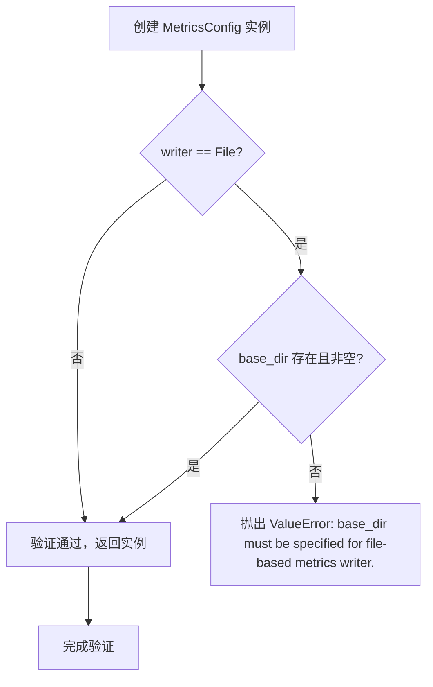
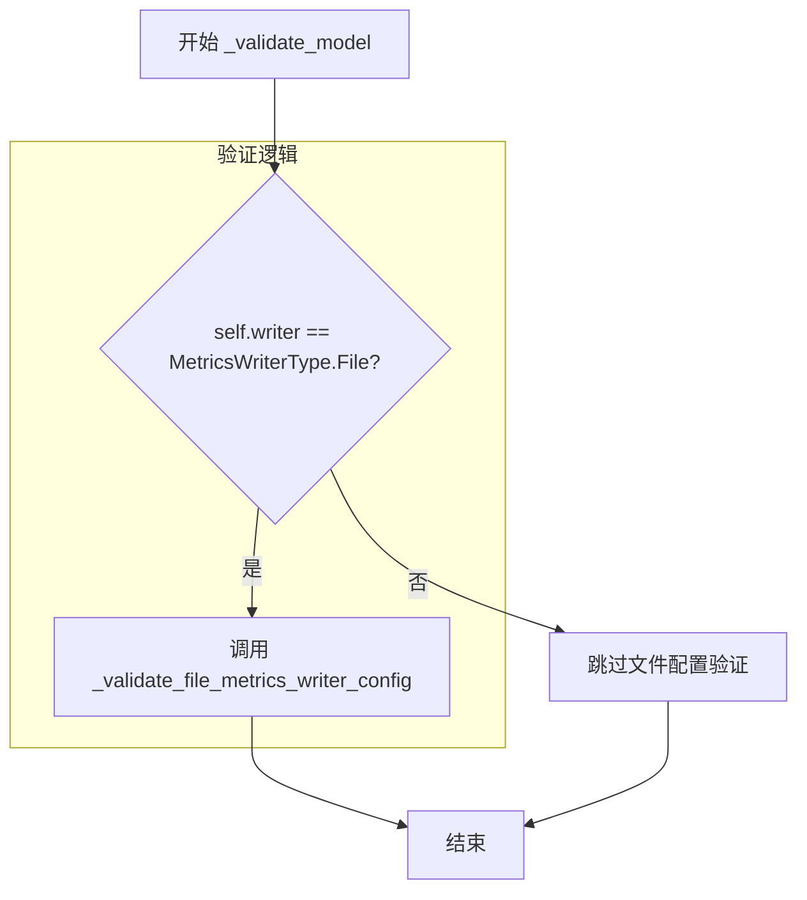

# `graphrag\packages\graphrag-llm\graphrag_llm\config\metrics_config.py` 详细设计文档

这是一个用于配置指标（Metrics）系统的Pydantic模型类，定义了指标处理器类型、存储方式、写入器、日志级别和基础目录等配置项，并提供了基于写入器类型的配置验证功能。

## 整体流程



## 类结构

```
BaseModel (Pydantic 抽象基类)
└── MetricsConfig (指标配置类)
```

## 全局变量及字段


### `MetricsProcessorType`
    
指标处理器类型枚举，定义可用的指标处理器实现

类型：`Enum`
    


### `MetricsStoreType`
    
指标存储类型枚举，定义可用的指标存储实现

类型：`Enum`
    


### `MetricsWriterType`
    
指标写入器类型枚举，定义可用的指标写入实现

类型：`Enum`
    


### `MetricsConfig.type`
    
指标处理器实现类型，默认值为 MetricsProcessorType.Default

类型：`str`
    


### `MetricsConfig.store`
    
指标存储实现类型，默认值为 MetricsStoreType.Memory

类型：`str`
    


### `MetricsConfig.writer`
    
指标写入器实现类型，默认值为 MetricsWriterType.Log

类型：`str | None`
    


### `MetricsConfig.log_level`
    
使用日志写入器时的日志级别，默认为 None（INFO）

类型：`int | None`
    


### `MetricsConfig.base_dir`
    
基于文件的指标写入器的基础目录，默认为 None（./metrics）

类型：`str | None`
    
    

## 全局函数及方法


### `MetricsConfig._validate_file_metrics_writer_config`

验证基于文件的指标写入器配置，确保 base_dir 存在且非空

参数：

- `self`：`MetricsConfig`，当前 MetricsConfig 类的实例，用于访问实例属性 base_dir

返回值：`None`，无返回值；若验证失败则抛出 `ValueError` 异常

#### 流程图


#### 带注释源码

```python
def _validate_file_metrics_writer_config(self) -> None:
    """Validate parameters for file-based metrics writer.
    
    此方法用于验证基于文件的指标写入器配置。
    仅当 base_dir 不为 None 且为空字符串时抛出异常。
    这种设计允许 base_dir 为 None（使用默认配置），
    但不允许显式设置为空字符串（可能是配置错误）。
    """
    # 检查 base_dir 是否被显式设置为空字符串
    # 注意：base_dir 为 None 是合法的（表示使用默认行为）
    if self.base_dir is not None and self.base_dir.strip() == "":
        # 构建错误消息，说明 base_dir 必须为文件写入器指定
        msg = "base_dir must be specified for file-based metrics writer."
        # 抛出 ValueError 异常，中断配置验证流程
        raise ValueError(msg)
```


### `MetricsConfig._validate_model`

模型验证器，在配置验证后根据写入器类型执行额外验证

参数：

- `self`：`MetricsConfig`，当前配置实例本身

返回值：`Self`，返回验证后的模型实例（用于链式调用）

#### 流程图



#### 带注释源码

```python
@model_validator(mode="after")
def _validate_model(self):
    """验证指标配置模型.
    
    在 Pydantic 基类验证完成后，根据写入器类型执行额外的业务逻辑验证。
    仅当写入器类型为文件类型时，才会进行文件相关配置的验证。
    
    Returns:
        Self: 验证通过后的模型实例，支持链式调用
        
    Raises:
        ValueError: 当 writer 为 'file' 但 base_dir 为空或仅包含空白字符时
    """
    # 检查写入器类型是否为文件类型
    if self.writer == MetricsWriterType.File:
        # 执行文件写入器的配置验证
        # 验证 base_dir 必须存在且非空
        self._validate_file_metrics_writer_config()
    
    # 返回 self 以支持 Pydantic 的链式验证
    return self
```

## 关键组件


### MetricsConfig

核心配置类，封装指标处理器的配置参数，支持处理器类型、存储类型、写入器类型、日志级别和文件路径等配置，并提供基于写入器类型的配置验证逻辑。

### MetricsProcessorType

指标处理器类型枚举，定义可用的指标处理器实现，用于指定使用哪种指标处理策略。

### MetricsStoreType

指标存储类型枚举，定义指标的存储方式，支持内存存储等不同的后端实现。

### MetricsWriterType

指标写入器类型枚举，定义指标的输出方式，支持日志写入器和文件写入器两种模式。

### _validate_file_metrics_writer_config

文件写入器配置验证方法，检查 base_dir 参数是否为有效的非空路径，确保文件写入器配置正确。

### _validate_model

模型验证器装饰器，作为 Pydantic 的 after 模式验证器，在所有字段解析完成后触发，根据 writer 类型调用相应的验证逻辑。


## 问题及建议


### 已知问题

-   **字段命名与关键字冲突**：使用 `type` 作为字段名，虽然在 Python 中可行，但容易与 Python 内置类型混淆，建议使用更明确的命名如 `processor_type`。
-   **缺少枚举类型约束**：`type`、`store`、`writer` 字段使用字符串类型但没有枚举约束，允许任意字符串值，可能导致运行时错误且缺乏 IDE 自动补全支持。
-   **验证逻辑分散**：文件写入器验证逻辑分散在 `_validate_file_metrics_writer_config` 和 `_validate_model` 两个方法中，增加维护成本。
-   **缺少对 `None` 值的完整处理**：当 `writer` 为 `None` 时，配置仍然有效但缺乏明确的使用说明，代码没有处理这种边界情况。
-   **路径验证缺失**：`base_dir` 字段只验证了非空字符串，未验证路径是否有效、是否可写或是否为绝对路径。
-   **日志级别类型不明确**：`log_level` 使用 `int` 类型，但未说明具体取值含义（如 DEBUG=10, INFO=20 等），缺乏对常用日志级别的常量定义。

### 优化建议

-   **引入枚举类型**：使用 `Enum` 或 `StrEnum` 定义 `MetricsProcessorType`、`MetricsStoreType`、`MetricsWriterType` 的可选值，提供类型安全和自动补全。
-   **统一验证逻辑**：将所有验证逻辑整合到单个 `@model_validator` 或使用 Pydantic v2 的 `field_validator`，提高代码可读性。
-   **添加路径验证**：使用 `pathlib.Path` 或 `os.path` 验证 `base_dir` 的有效性，确保目录存在或可创建。
-   **增强文档说明**：为 `log_level` 添加明确的取值说明，或使用 `Literal` 类型限制为标准日志级别（如 "DEBUG", "INFO", "WARNING", "ERROR"）。
-   **重构字段命名**：将 `type` 重命名为 `processor_type` 或 `metrics_type`，避免与 Python 内置类型冲突，提高代码可维护性。

## 其它


### 设计目标与约束

该 `MetricsConfig` 类的设计目标是为指标处理系统提供灵活的配置机制，支持多种处理器类型、存储方式和写入器实现。设计约束包括：使用 Pydantic v2 的 BaseModel 进行配置验证，支持自定义字段扩展（通过 `extra="allow"`），并通过模型验证器确保文件写入器配置的有效性。

### 错误处理与异常设计

错误处理采用 Pydantic 内置的验证机制，当 `writer` 设置为 `MetricsWriterType.File` 时，如果 `base_dir` 为空字符串或仅包含空格，将抛出 `ValueError` 异常，错误消息为"base_dir must be specified for file-based metrics writer."。这种设计确保了配置的有效性在对象创建时就被验证，而不是延迟到实际使用时。

### 数据流与状态机

配置对象的数据流如下：1) 用户通过构造参数或字典创建 `MetricsConfig` 实例；2) Pydantic 首先进行基础类型验证；3) `model_validator(mode="after")` 在所有字段验证完成后执行自定义验证逻辑；4) 如果验证通过，返回配置对象；5) 配置对象被传递给相应的 MetricsProcessor、MetricsStore 和 MetricsWriter 实现类。

### 外部依赖与接口契约

该模块依赖以下外部组件：1) `pydantic` 库（BaseModel, ConfigDict, Field, model_validator）；2) `graphrag_llm.config.types` 模块中的枚举类型（MetricsProcessorType, MetricsStoreType, MetricsWriterType）。接口契约方面，该类作为配置输入，为指标系统提供可插拔的组件选择，调用方需确保提供的类型字符串在对应的枚举中存在。

### 配置示例与使用场景

示例1（使用默认配置）：`config = MetricsConfig()`，将使用默认的内存存储和日志写入器。示例2（使用文件写入器）：`config = MetricsConfig(writer="file", base_dir="./metrics_data")`，配置文件写入到指定目录。示例3（自定义日志级别）：`config = MetricsConfig(log_level=10)`，设置 DEBUG 级别的日志输出。

### 版本兼容性说明

该代码基于 Pydantic v2 设计，使用了 `model_validator` 装饰器（v2 特有，v1 中为 `validator`）和 `model_config` 配置（v2 语法）。与 Python 版本的兼容性取决于 Pydantic v2 本身的要求，建议使用 Python 3.9+ 以获得最佳支持。

### 安全性考虑

1) `base_dir` 参数未做路径遍历攻击防护，建议在生产环境中对路径进行规范化验证；2) 由于允许 extra 字段（`extra="allow"`），需注意恶意配置项的注入风险；3) 文件写入路径应限制在应用允许的目录范围内。

### 性能考虑

该配置类在实例化时进行验证，对于大多数使用场景性能开销可忽略不计。但如果需要频繁创建不同配置的场景，建议缓存已验证的配置对象。配置对象的创建是同步的，不涉及异步操作。

    