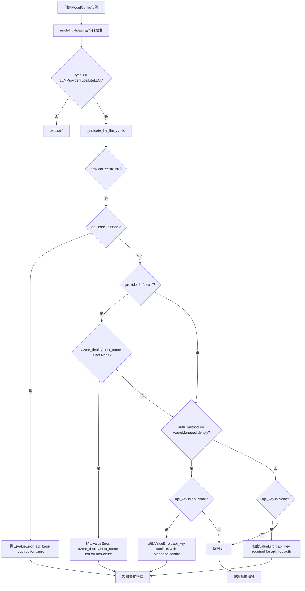
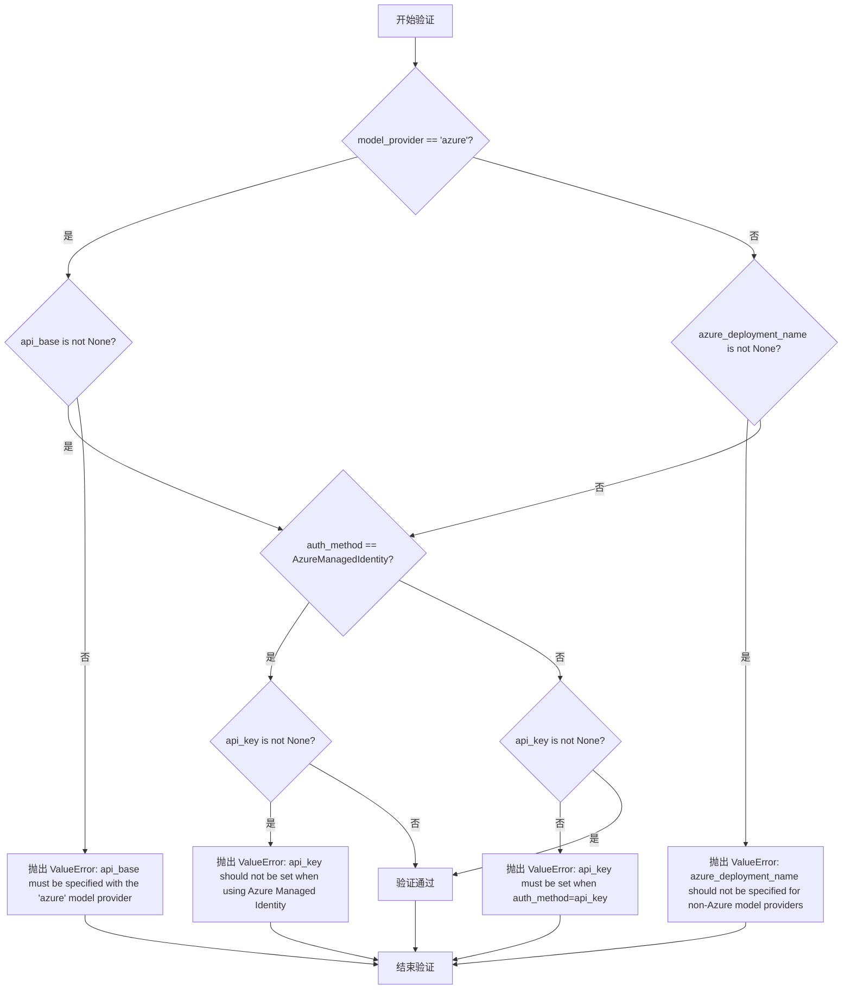
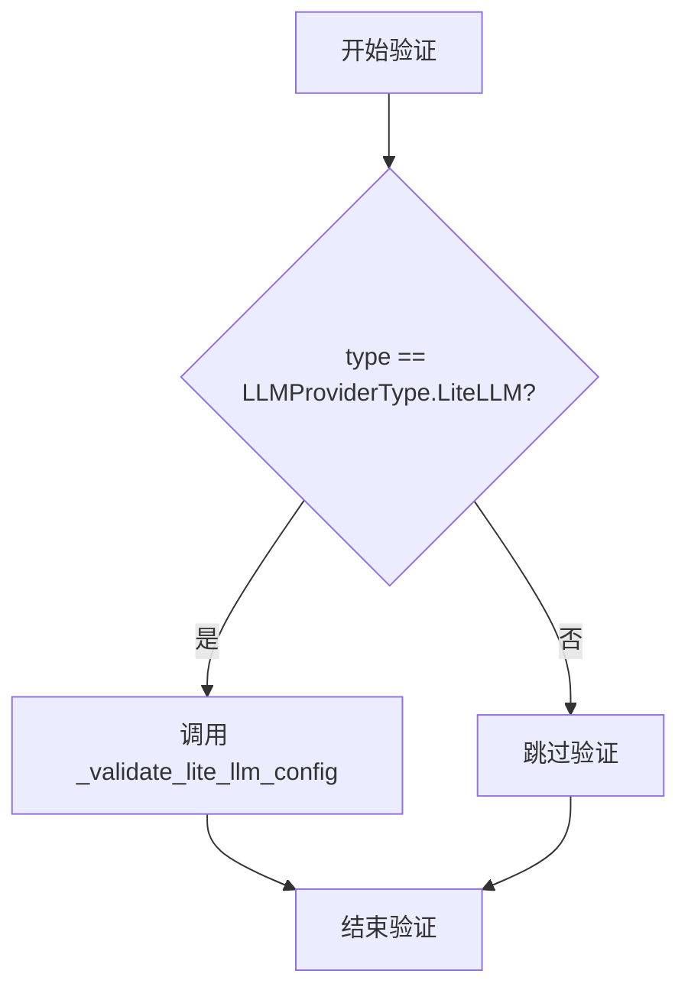
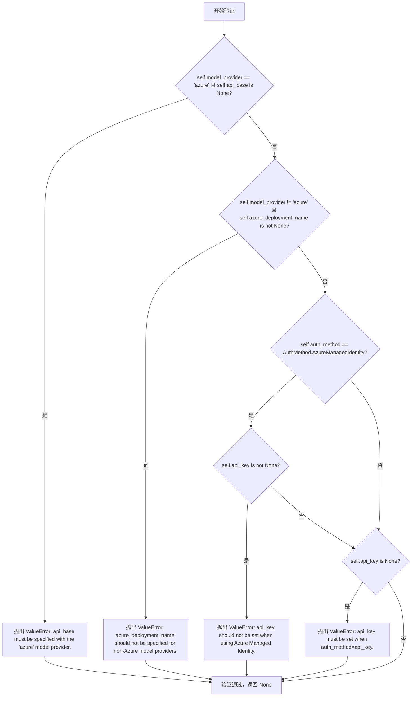
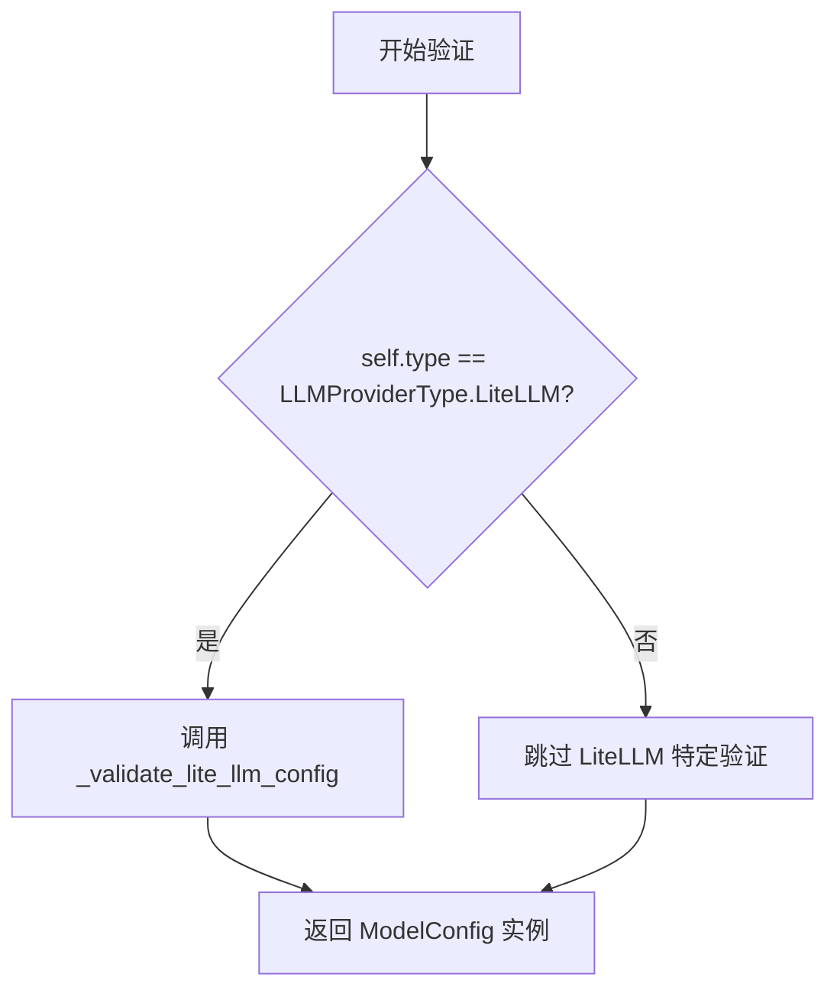

# `graphrag\packages\graphrag-llm\graphrag_llm\config\model_config.py` 详细设计文档

这是一个基于Pydantic的语言模型配置类，定义了LLM提供者（如OpenAI、Azure等）的所有配置参数，包括API设置、认证方式、重试策略、速率限制和指标监控，并提供了完整的配置验证机制。

## 整体流程



## 类结构

```
BaseModel (Pydantic抽象基类)
└── ModelConfig (语言模型配置类)
```

## 全局变量及字段


### `logger`
    
模块级日志记录器，用于记录配置验证过程中的信息

类型：`logging.Logger`
    


### `model_config`
    
ModelConfig的Pydantic配置字典，允许额外字段以支持自定义LLM提供者实现

类型：`ConfigDict`
    


### `ModelConfig.type`
    
LLM提供者类型，默认值为LiteLLM

类型：`str`
    


### `ModelConfig.model_provider`
    
模型提供者名称，如'openai'、'azure'等

类型：`str`
    


### `ModelConfig.model`
    
具体模型名称，如'gpt-4o'、'gpt-3.5-turbo'等

类型：`str`
    


### `ModelConfig.call_args`
    
传递给模型提供者API的基础关键字参数

类型：`dict[str, Any]`
    


### `ModelConfig.api_base`
    
API基础URL，部分提供商（如Azure）需要此参数

类型：`str | None`
    


### `ModelConfig.api_version`
    
API版本号

类型：`str | None`
    


### `ModelConfig.api_key`
    
API认证密钥

类型：`str | None`
    


### `ModelConfig.auth_method`
    
认证方法，默认值为ApiKey

类型：`AuthMethod`
    


### `ModelConfig.azure_deployment_name`
    
Azure模型部署名称

类型：`str | None`
    


### `ModelConfig.retry`
    
重试策略配置

类型：`RetryConfig | None`
    


### `ModelConfig.rate_limit`
    
速率限制配置

类型：`RateLimitConfig | None`
    


### `ModelConfig.metrics`
    
指标服务配置

类型：`MetricsConfig | None`
    


### `ModelConfig.mock_responses`
    
测试用模拟响应列表

类型：`list[str] | list[float]`
    
    

## 全局函数及方法


### `ModelConfig._validate_lite_llm_config`

这是一个私有验证方法，用于在模型配置初始化后验证 LiteLLM 特定配置的合法性，确保 Azure 相关配置与其他 providers 的配置不混用，并验证认证方式的正确性。

参数：

- `self`：`ModelConfig`，ModelConfig 类实例本身，用于访问实例属性

返回值：`None`，无返回值（该方法通过抛出 ValueError 来表示验证失败）

#### 流程图



#### 带注释源码

```python
def _validate_lite_llm_config(self) -> None:
    """Validate LiteLLM specific configuration.
    
    该方法验证以下配置规则：
    1. 当 model_provider 为 'azure' 时，必须提供 api_base
    2. 当 model_provider 不为 'azure' 时，不应指定 azure_deployment_name
    3. 使用 Azure Managed Identity 认证时，不应设置 api_key
    4. 使用 ApiKey 认证方式时，必须提供 api_key
    
    Raises:
        ValueError: 当配置不满足上述任一规则时抛出
    """
    # 检查 Azure provider 是否配置了 api_base
    if self.model_provider == "azure" and not self.api_base:
        msg = "api_base must be specified with the 'azure' model provider."
        raise ValueError(msg)

    # 检查非 Azure provider 是否错误地配置了 azure_deployment_name
    if self.model_provider != "azure" and self.azure_deployment_name is not None:
        msg = "azure_deployment_name should not be specified for non-Azure model providers."
        raise ValueError(msg)

    # 验证 Azure Managed Identity 认证方式与 api_key 的互斥关系
    if self.auth_method == AuthMethod.AzureManagedIdentity:
        if self.api_key is not None:
            msg = "api_key should not be set when using Azure Managed Identity."
            raise ValueError(msg)
    # 验证其他认证方式需要 api_key
    elif not self.api_key:
        msg = "api_key must be set when auth_method=api_key."
        raise ValueError(msg)
```


### `ModelConfig._validate_model`

Pydantic模型验证器装饰器方法，在模型初始化后自动调用，用于验证语言模型配置的完整性和一致性，特别是针对LiteLLM提供商的特定配置校验。

参数：

- `self`：`ModelConfig`，模型配置实例本身，包含所有配置字段

返回值：`ModelConfig`，返回验证后的模型配置实例，以支持链式调用

#### 流程图



#### 带注释源码

```python
@model_validator(mode="after")
def _validate_model(self):
    """Validate model configuration after initialization.
    
    Pydantic模型验证器，在模型实例化后自动调用。
    仅当type字段设置为LiteLLM时，才执行特定的配置校验逻辑。
    
    Returns:
        ModelConfig: 验证通过后的模型配置实例，支持链式调用
    """
    # 检查LLM提供商类型是否为LiteLLM
    if self.type == LLMProviderType.LiteLLM:
        # 调用LiteLLM特定配置验证方法
        # 验证api_base、azure_deployment_name、auth_method等字段的一致性
        self._validate_lite_llm_config()
    
    # 返回当前实例以支持Pydantic模型的链式验证和赋值
    return self
```


### `ModelConfig._validate_lite_llm_config`

验证 LiteLLM 特定配置，检查 Azure 提供商设置、API 密钥要求和 Azure 托管标识认证的合法性。

参数：

- `self`：`ModelConfig`，模型配置类的实例本身

返回值：`None`，无返回值，通过抛出 ValueError 来表示验证失败

#### 流程图



#### 带注释源码

```python
def _validate_lite_llm_config(self) -> None:
    """Validate LiteLLM specific configuration."""
    # 检查 1: 如果使用 Azure provider，则必须提供 api_base
    if self.model_provider == "azure" and not self.api_base:
        msg = "api_base must be specified with the 'azure' model provider."
        raise ValueError(msg)

    # 检查 2: 非 Azure provider 不应设置 azure_deployment_name
    if self.model_provider != "azure" and self.azure_deployment_name is not None:
        msg = "azure_deployment_name should not be specified for non-Azure model providers."
        raise ValueError(msg)

    # 检查 3: Azure Managed Identity 认证方式不应同时设置 api_key
    if self.auth_method == AuthMethod.AzureManagedIdentity:
        if self.api_key is not None:
            msg = "api_key should not be set when using Azure Managed Identity."
            raise ValueError(msg)
    # 检查 4: 非 Managed Identity 方式必须提供 api_key
    elif not self.api_key:
        msg = "api_key must be set when auth_method=api_key."
        raise ValueError(msg)
```


### ModelConfig._validate_model

模型配置验证器，在 Pydantic 模型初始化后自动调用，用于验证语言模型配置的完整性和一致性。

参数：

- `self`：自动传入的 ModelConfig 实例，当前模型配置对象

返回值：`ModelConfig`，返回 self 以支持链式调用，允许在验证后继续访问模型配置属性

#### 流程图



#### 带注释源码

```python
@model_validator(mode="after")
def _validate_model(self):
    """Validate model configuration after initialization.
    
    Pydantic model_validator 装饰器标记的验证方法，在所有字段验证完成后执行。
    mode="after" 表示在默认验证器之后运行，此时所有字段的类型和约束已验证通过。
    """
    # 检查配置类型是否为 LiteLLM，如果是则进行特定配置验证
    if self.type == LLMProviderType.LiteLLM:
        # 调用 LiteLLM 特定配置验证逻辑
        self._validate_lite_llm_config()
    
    # 返回 self 以支持链式调用和配置对象的后续使用
    return self
```

## 关键组件


### ModelConfig类

语言模型的核心配置类，基于Pydantic的BaseModel，用于定义和管理语言模型的各种配置参数，包括模型提供者、认证方式、API配置、重试策略、速率限制和指标收集等。

### type字段

指定要使用的LLM提供者类型，默认为LiteLLM，支持通过extra="allow"配置自定义LLM提供者实现。

### model_provider字段

模型提供者标识，如'openai'、'azure'等，用于确定使用哪个LLM服务提供商。

### model字段

具体使用的模型名称，如'gpt-4o'、'gpt-3.5-turbo'等。

### call_args字段

传递给模型提供者API的基础关键字参数字典，用于传递额外的API调用配置。

### api_base字段

API的基础URL，某些提供者（如Azure）必需此配置。

### api_version字段

要使用的API版本号，用于特定API版本的兼容性。

### api_key字段

用于与模型提供者进行身份验证的API密钥。

### auth_method字段

认证方法，默认为ApiKey，支持AzureManagedIdentity等多种认证方式。

### azure_deployment_name字段

Azure模型的部署名称，仅在使用Azure提供者时需要指定。

### retry字段

重试策略配置，控制请求失败时的重试行为。

### rate_limit字段

速率限制配置，控制API调用的频率和行为。

### metrics字段

指标服务配置，用于指定和配置指标收集服务。

### mock_responses字段

用于测试的模拟响应列表，支持字符串或浮点数类型。

### _validate_lite_llm_config方法

LiteLLM特定配置验证方法，检查Azure提供者的api_base必需性、非Azure提供者的azure_deployment_name不应存在、以及auth_method与api_key的一致性。

### _validate_model方法

模型配置后验证入口方法，在类型为LiteLLM时触发特定验证逻辑，确保配置完整性。

## 问题及建议


### 已知问题

- **验证逻辑过于针对特定 Provider**：`_validate_lite_llm_config` 方法仅针对 LiteLLM 和 Azure 进行验证，但 `type` 字段支持自定义 LLM provider（`extra="allow"`），验证逻辑未考虑其他 provider 的配置要求
- **认证方法验证不完整**：当前仅对 `ApiKey` 和 `AzureManagedIdentity` 两种认证方法进行了验证，缺少对其他认证方法（如 `OAuth`、`AWS IAM` 等）的支持验证
- **敏感信息硬编码风险**：`api_key` 字段直接以字符串形式存储，虽然 Pydantic 默认不会暴露敏感信息，但缺少明确的敏感字段标记（如 `Field(default=None, repr=False)`）
- **字段类型约束不够精确**：`call_args: dict[str, Any]` 使用 Any 类型，无法在静态类型检查时发现参数错误
- **默认值可能导致意外行为**：`type` 字段默认为 `LLMProviderType.LiteLLM`，但 `model_provider` 字段无默认值，若未显式设置可能导致初始化失败
- **缺少配置继承/组合机制**：复杂场景下可能需要配置复用，当前无配置继承或组合能力

### 优化建议

- 引入更通用的配置验证框架，支持插件式 Provider 验证器
- 使用 `pydantic-settings` 或自定义敏感字段装饰器标记 `api_key`，并添加环境变量加载支持
- 将 `call_args` 拆分为更具体的可选参数，或使用 `TypedDict` 定义允许的参数类型
- 为 `model_provider` 添加枚举或正则验证，确保值合法
- 考虑添加配置合并方法（如 `merge` 或 `override`），支持配置分层
- 为关键验证方法添加详细文档，说明不同 Provider 的配置要求

## 其它


### 设计目标与约束

本配置类旨在为 GraphRAG LLM 模块提供统一、灵活的语言模型配置管理机制。核心设计目标包括：支持多种 LLM 提供商（如 OpenAI、Azure、LiteLLM 等），允许自定义配置字段以适配不同的 LLM 实现，提供完整的认证和连接配置，以及内置配置验证逻辑确保运行时安全。约束方面，该类依赖 Pydantic v2，必须与 graphrag_llm.config 模块中的其他配置类（MetricsConfig、RateLimitConfig、RetryConfig、AuthMethod、LLMProviderType）配合使用，且仅支持 Pydantic BaseModel 的后置验证模式（mode="after"）。

### 错误处理与异常设计

配置验证采用 Pydantic 内置的验证机制，主要抛出 ValueError 异常。具体验证规则包括：Azure 提供商必须设置 api_base；非 Azure 提供商不应设置 azure_deployment_name；使用 Azure Managed Identity 时不应设置 api_key；使用 ApiKey 认证方式时必须设置 api_key。所有验证错误信息均包含明确的错误描述，便于开发者定位问题。验证逻辑在 _validate_lite_llm_config 和 _validate_model 两个方法中实现，分别处理 LiteLLM 特定配置和通用模型配置。

### 外部依赖与接口契约

本类依赖以下外部模块：pydantic（BaseModel、ConfigDict、Field、model_validator）用于数据验证和配置管理；graphrag_llm.config.metrics_config 中的 MetricsConfig 类；graphrag_llm.config.rate_limit_config 中的 RateLimitConfig 类；graphrag_llm.config.retry_config 中的 RetryConfig 类；graphrag_llm.config.types 中的 AuthMethod 和 LLMProviderType 枚举。接口契约方面，ModelConfig 必须作为 Pydantic BaseModel 使用，支持字典构造和模型构造两种方式；所有可选字段均提供合理的默认值；model_provider 和 model 字段为必需字段，类型为字符串；call_args 字段接受任意字典类型参数，用于传递给模型提供商的 API。

### 配置管理策略

本类采用分层配置策略：顶层必选配置包括 model_provider 和 model；中间层可选配置包括 api_base、api_version、api_key、auth_method、azure_deployment_name；底层功能配置包括 retry、rate_limit、metrics、mock_responses。默认值为 LLMProviderType.LiteLLM 提供商，认证方式默认为 ApiKey。extra="allow" 配置允许在保持核心接口不变的情况下添加自定义字段，支持扩展新的 LLM 提供商实现。call_args 字典提供了最大的灵活性，允许传递任意参数给底层 LLM API。

### 安全性考虑

敏感信息（如 api_key）采用可选字段设计，允许从环境变量或其他安全存储中获取。Azure Managed Identity 认证模式明确禁止同时设置 api_key，防止凭据混淆。日志记录使用标准 logging 模块，logger 名称为 __name__（即 graphrag_llm.config.model_config），便于统一管理和过滤。配置对象本身不应包含敏感信息的明文打印或序列化逻辑。

### 兼容性考虑

ConfigDict 配置 extra="allow" 确保向后兼容性，新增配置字段不会导致旧版本代码报错。model_validator 的 mode="after" 确保验证在所有字段解析完成后执行，与 Pydantic v2 行为一致。默认值的合理设置使得最小化配置即可运行，如不指定 type 则默认为 LiteLLM，不指定 auth_method 则默认为 ApiKey。mock_responses 字段支持 list[str] | list[float] 两种类型，兼容不同测试场景需求。

### 使用示例

```python
# 基础使用 - OpenAI
config = ModelConfig(
    model_provider="openai",
    model="gpt-4o",
    api_key="sk-xxx"
)

# Azure 使用
azure_config = ModelConfig(
    model_provider="azure",
    model="gpt-4o",
    api_base="https://xxx.openai.azure.com",
    api_version="2024-02-01",
    azure_deployment_name="gpt-4o"
)

# 带完整配置
full_config = ModelConfig(
    model_provider="openai",
    model="gpt-4o",
    api_key="sk-xxx",
    retry=RetryConfig(max_retries=3),
    rate_limit=RateLimitConfig(max_requests_per_minute=60),
    metrics=MetricsConfig(enabled=True)
)
```

### 版本迁移指南

本类为 Pydantic v2 实现，不兼容 Pydantic v1。如从 v1 迁移，需注意：field() 改为 Field()；validator() 改为 model_validator()；validate_model() 类的 @root_validator 改为类级别的 @model_validator(mode="after")；extra 配置从 ConfigDict(extra='allow') 保持一致。


    