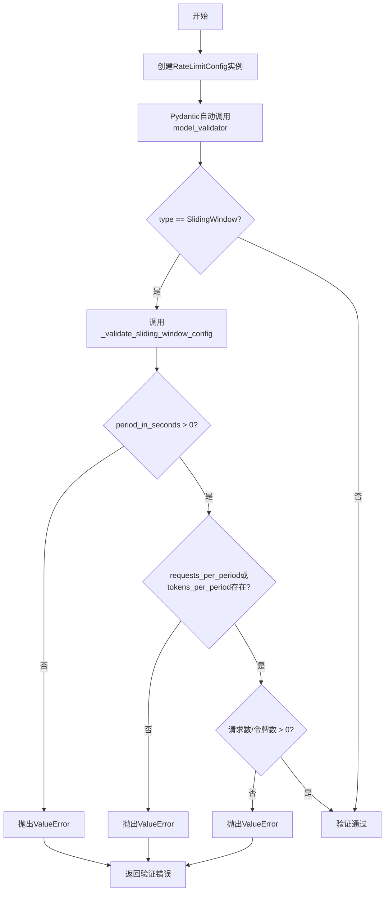
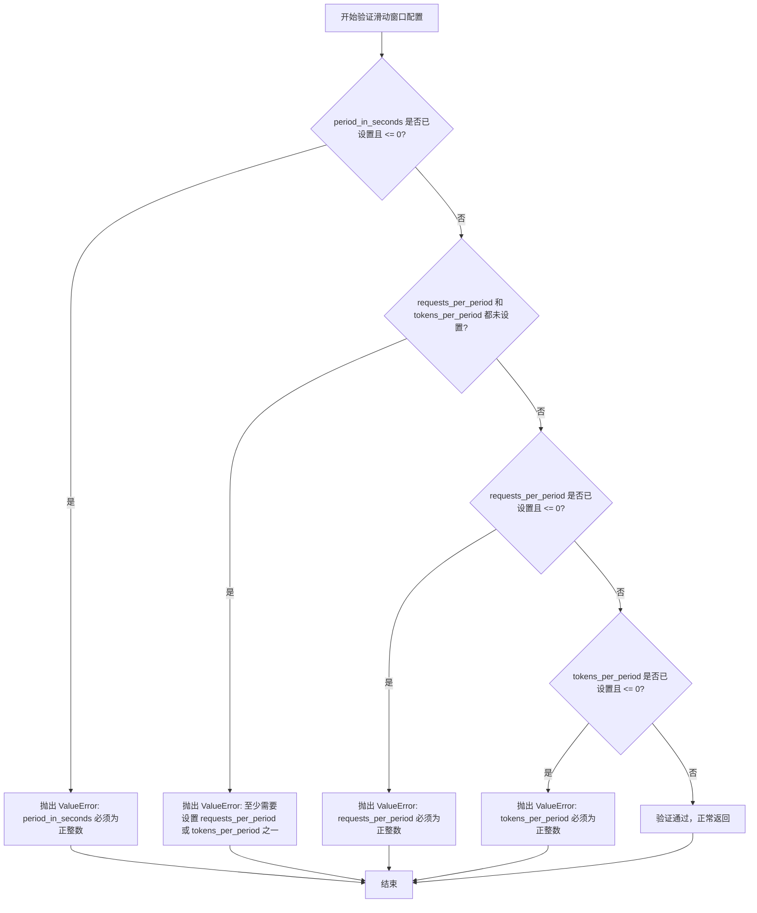
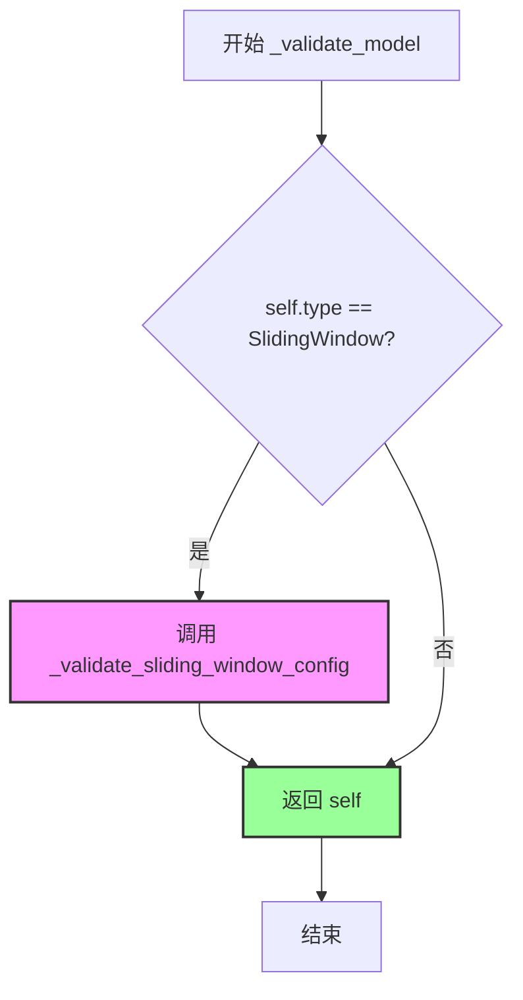

# `graphrag\packages\graphrag-llm\graphrag_llm\config\rate_limit_config.py` 详细设计文档

这是一个速率限制配置类，用于定义和管理API请求的速率限制策略，支持滑动窗口算法，可配置时间周期、请求数限制和令牌数限制。

## 整体流程



## 类结构

```
RateLimitConfig (Pydantic BaseModel)
└── 验证器方法
    ├── _validate_sliding_window_config
    └── _validate_model (model_validator)
```

## 全局变量及字段


### `RateLimitType`
    
来自 graphrag_llm.config.types 的速率限制类型枚举，定义了可用的速率限制策略

类型：`枚举类型 (Enum)`
    


### `RateLimitConfig.type`
    
速率限制策略类型，默认SlidingWindow

类型：`str`
    


### `RateLimitConfig.period_in_seconds`
    
速率限制窗口周期(秒)

类型：`int | None`
    


### `RateLimitConfig.requests_per_period`
    
每周期最大请求数

类型：`int | None`
    


### `RateLimitConfig.tokens_per_period`
    
每周期最大令牌数

类型：`int | None`
    
    

## 全局函数及方法


### `RateLimitConfig._validate_sliding_window_config`

验证滑动窗口速率限制配置的有效性，确保配置的各项参数符合业务规则和系统要求。

参数： 无（仅包含隐式参数 `self`）

返回值：`None`，无返回值。该方法通过抛出 `ValueError` 来表示验证失败，若验证通过则正常返回。

#### 流程图



#### 带注释源码

```python
def _validate_sliding_window_config(self) -> None:
    """Validate Sliding Window rate limit configuration."""
    
    # 检查时间窗口周期是否有效
    # 要求：若设置了 period_in_seconds，则必须为正整数
    if self.period_in_seconds is not None and self.period_in_seconds <= 0:
        msg = "period_in_seconds must be a positive integer for Sliding Window rate limit."
        raise ValueError(msg)

    # 检查请求限制配置是否完整
    # 要求：至少需要设置 requests_per_period 或 tokens_per_period 之一
    if not self.requests_per_period and not self.tokens_per_period:
        msg = "At least one of requests_per_period or tokens_per_period must be specified for Sliding Window rate limit."
        raise ValueError(msg)

    # 检查请求速率限制是否有效
    # 要求：若设置了 requests_per_period，则必须为正整数
    if self.requests_per_period is not None and self.requests_per_period <= 0:
        msg = "requests_per_period must be a positive integer for Sliding Window rate limit."
        raise ValueError(msg)

    # 检查令牌速率限制是否有效
    # 要求：若设置了 tokens_per_period，则必须为正整数
    if self.tokens_per_period is not None and self.tokens_per_period <= 0:
        msg = "tokens_per_period must be a positive integer for Sliding Window rate limit."
        raise ValueError(msg)
```


### `RateLimitConfig._validate_model`

该方法是一个 Pydantic 模型验证器，在模型实例化后根据配置的类型（type 字段）执行相应的验证逻辑，当前仅支持 SlidingWindow 类型的配置验证，若类型为 SlidingWindow 则调用内部验证方法进行参数校验，验证通过后返回模型实例本身。

参数：此方法无显式参数（仅包含隐式参数 `self`）

返回值：`RateLimitConfig`，返回验证后的模型实例本身，以支持链式调用

#### 流程图



#### 带注释源码

```python
@model_validator(mode="after")
def _validate_model(self):
    """Validate the rate limit configuration based on its type.
    
    此方法作为 Pydantic 的 model_validator，在模型实例化完成后自动调用。
    它根据 self.type 的值执行不同类型的配置验证，当前仅支持 SlidingWindow 类型。
    
    Returns:
        RateLimitConfig: 验证通过后的模型实例本身，支持链式调用。
        
    Raises:
        ValueError: 当配置参数不满足对应类型的要求时，由 _validate_sliding_window_config 抛出。
    """
    # 检查配置类型是否为 SlidingWindow
    if self.type == RateLimitType.SlidingWindow:
        # 调用内部验证方法，检查 period_in_seconds、requests_per_period、tokens_per_period 等参数
        self._validate_sliding_window_config()
    
    # 返回验证后的模型实例，支持链式调用
    return self
```

## 关键组件


### RateLimitConfig 类

速率限制配置的核心类，使用 Pydantic BaseModel 定义，支持滑动窗口速率限制策略的配置与验证。

### type 字段

速率限制策略类型，支持滑动窗口（Sliding Window）等多种策略，通过 RateLimitType 枚举定义，默认值为滑动窗口。

### period_in_seconds 字段

速率限制的时间窗口周期（秒），用于定义滑动窗口的时间范围，默认值为 60 秒。

### requests_per_period 字段

每个时间周期内允许的最大请求数量，用于限制请求频率，可设置为无限制（None）。

### tokens_per_period 字段

每个时间周期内允许的最大令牌数量，用于限制令牌消耗，可设置为无限制（None）。

### _validate_sliding_window_config 方法

滑动窗口速率限制配置的验证方法，确保时间周期为正整数，且至少配置了请求数或令牌数之一。

### _validate_model 方法

模型级验证器，在 Pydantic 模型验证后执行，根据配置的类型调用对应的验证逻辑，当前支持滑动窗口策略的验证。

### ConfigDict 配置

Pydantic 模型配置，允许额外的自定义字段，以支持自定义 RateLimit 实现扩展。


## 问题及建议


### 已知问题

-   **默认值与验证逻辑冲突**：type字段默认为SlidingWindow，但period_in_seconds、requests_per_period、tokens_per_period的默认值都是None，而滑动窗口验证要求这些字段必须有值（至少一个），导致即使用户不提供任何配置也会验证失败
-   **扩展性差**：model_validator中只处理了SlidingWindow类型，如果后续添加新的RateLimitType（如FixedWindow、TokenBucket等），需要手动添加新的验证分支，违反了开闭原则
-   **类型与业务语义不匹配**：字段类型声明为int | None，表示可以是整数或无，但业务上应该是正整数，应该使用更严格的类型约束
-   **缺乏默认值策略**：对于SlidingWindow类型，应该有合理的默认值（如period_in_seconds=60），而不是让用户必须手动配置
-   **错误信息缺少上下文**：验证失败时的错误信息虽然清晰，但没有包含当前的实际值，调试时不够友好

### 优化建议

-   为SlidingWindow类型提供合理的默认值：period_in_seconds=60, requests_per_period=60，避免用户必须手动配置每一项
-   使用枚举或Literal类型替代字符串类型字段：type: RateLimitType = Field(default=RateLimitType.SlidingWindow)，提供更好的类型安全和IDE支持
-   将验证逻辑抽象为策略模式：为每种RateLimitType实现独立的验证器类，支持插件式扩展
-   在错误信息中包含当前值：使用f"period_in_seconds must be positive, got {self.period_in_seconds}"格式
-   考虑使用Pydantic的field_validator进行单字段验证，将复杂的模型验证逻辑拆分到各字段级别，提高可读性和可维护性

## 其它


### 设计目标与约束

本配置类旨在为速率限制功能提供灵活的配置能力，支持不同的速率限制策略（如滑动窗口），并允许通过扩展字段支持自定义实现。设计约束包括：必须至少指定请求数或令牌数其中之一，数值必须为正整数，支持动态配置且无需修改代码即可扩展新的速率限制类型。

### 错误处理与异常设计

配置验证采用 Pydantic 的 model_validator 装饰器，在模型实例化完成后自动触发验证。验证失败时抛出 ValueError 异常，异常消息清晰描述了具体的验证失败原因（如 period_in_seconds 必须为正整数、至少需要指定 requests_per_period 或 tokens_per_period 之一等），便于调用方快速定位问题。

### 外部依赖与接口契约

依赖项包括：pydantic（BaseModel、ConfigDict、Field、model_validator）用于数据验证和配置管理；graphrag_llm.config.types 中的 RateLimitType 枚举定义了支持的速率限制类型。接口契约方面，type 字段接受字符串类型但推荐使用 RateLimitType 枚举值，period_in_seconds、requests_per_period、tokens_per_period 均为可选字段但滑动窗口策略下至少需要后两者之一。

### 配置示例

```python
# 滑动窗口速率限制配置示例
rate_limit_config = RateLimitConfig(
    type="sliding_window",
    period_in_seconds=60,
    requests_per_period=100,
    tokens_per_period=1000
)
```

### 扩展性设计

通过 model_config = ConfigDict(extra="allow") 配置允许接收额外字段，支持自定义 RateLimit 实现类传入自定义配置参数。type 字段采用字符串类型设计，便于后续添加新的速率限制策略（如固定窗口、令牌桶等）而无需修改配置类结构。

### 性能考虑

配置类在实例化时进行一次性验证，之后无需重复验证。Pydantic 的 BaseModel 实现了高效的属性访问和类型转换，无需额外的性能优化措施。

### 版本兼容性

代码基于 Python 3.10+ 的类型联合语法（int | None），依赖 pydantic v2.x 版本（使用了 model_validator 装饰器）。建议在项目依赖管理中明确 pydantic>=2.0 的版本要求。

### 序列化与反序列化

支持通过 model_dump() 和 model_dump_json() 方法导出配置，支持通过 model_validate() 或 model_validate_json() 从字典或 JSON 字符串重建配置对象，便于配置持久化和跨服务传递。

### 使用注意事项

1. 滑动窗口策略下必须设置 requests_per_period 或 tokens_per_period 至少之一
2. 所有数值参数必须为正整数
3. period_in_seconds 默认为 60 秒
4. extra="allow" 配置虽然灵活，但可能导致拼写错误的字段被静默接受，建议在生产环境中使用 extra="forbid" 或增加自定义验证

    