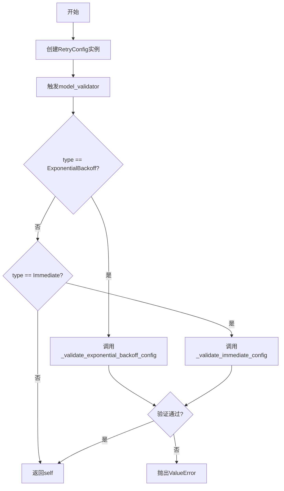
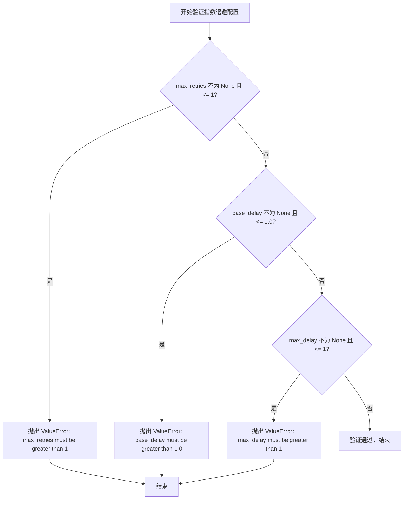
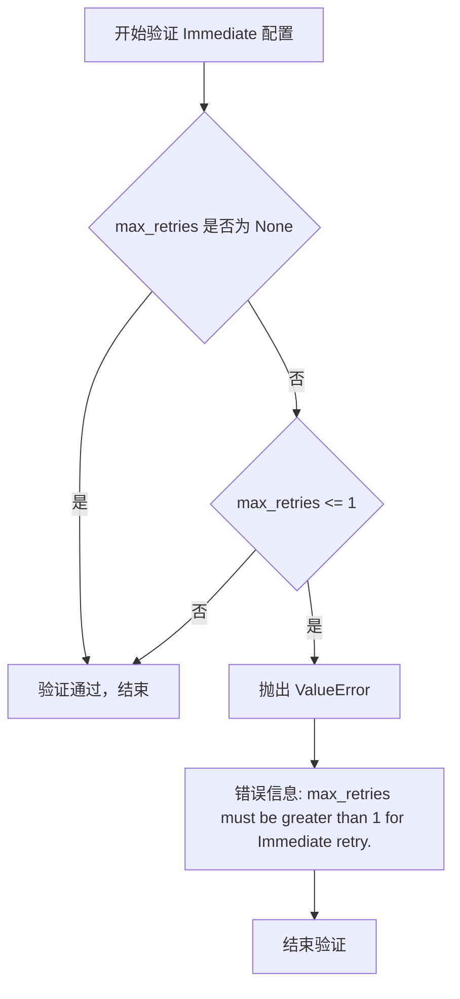
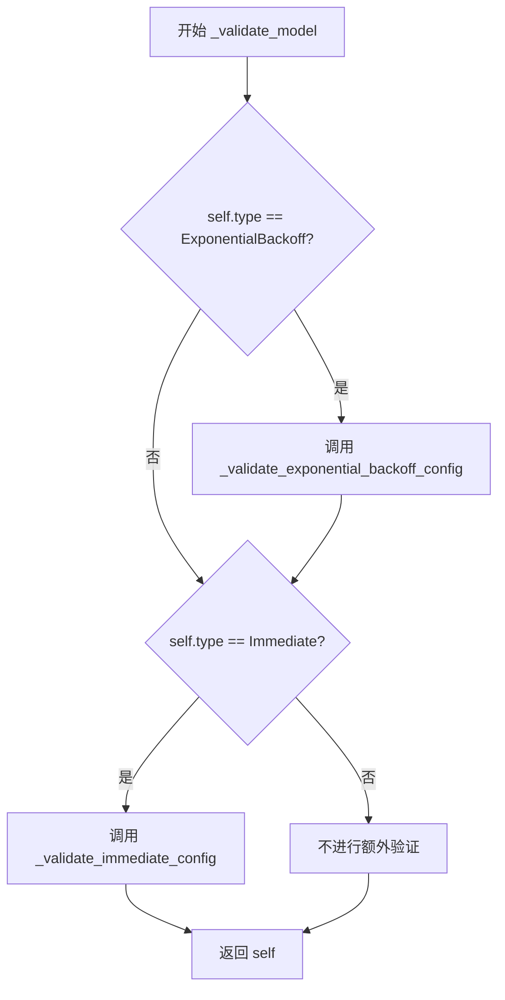

# `graphrag\packages\graphrag-llm\graphrag_llm\config\retry_config.py` 详细设计文档

这是一个重试策略配置类，用于定义和管理重试行为，支持指数退避和立即重试两种策略，并提供配置验证功能

## 整体流程



## 类结构

```
RetryConfig (Pydantic BaseModel)
└── 配置验证方法
    ├── _validate_exponential_backoff_config
    ├── _validate_immediate_config
    └── _validate_model (model_validator)
```

## 全局变量及字段


### `RetryType`
    
枚举类型，定义重试策略类型，包含ExponentialBackoff和Immediate等选项

类型：`RetryType (enum from graphrag_llm.config.types)`
    


### `RetryConfig.type`
    
重试策略类型，默认ExponentialBackoff

类型：`str`
    


### `RetryConfig.max_retries`
    
最大重试次数

类型：`int | None`
    


### `RetryConfig.base_delay`
    
指数退避基础延迟

类型：`float | None`
    


### `RetryConfig.jitter`
    
是否添加抖动

类型：`bool | None`
    


### `RetryConfig.max_delay`
    
最大延迟时间

类型：`float | None`
    
    

## 全局函数及方法


### `RetryConfig._validate_exponential_backoff_config`

验证指数退避重试配置，检查 `max_retries`、`base_delay` 和 `max_delay` 参数是否满足指数退避策略的约束条件（分别必须大于 1、大于 1.0、大于 1），不满足则抛出 `ValueError`。

参数：
- （无显式参数，隐式参数 `self` 为 `RetryConfig` 类型，表示当前实例）

返回值：`None`，无返回值，仅通过抛出异常表示验证失败

#### 流程图



#### 带注释源码

```python
def _validate_exponential_backoff_config(self) -> None:
    """Validate Exponential Backoff retry configuration."""
    # 检查 max_retries：必须大于 1（因为至少需要一次重试）
    if self.max_retries is not None and self.max_retries <= 1:
        msg = "max_retries must be greater than 1 for Exponential Backoff retry."
        raise ValueError(msg)

    # 检查 base_delay：必须大于 1.0 秒（基础延迟时间）
    if self.base_delay is not None and self.base_delay <= 1.0:
        msg = "base_delay must be greater than 1.0 for Exponential Backoff retry."
        raise ValueError(msg)

    # 检查 max_delay：必须大于 1 秒（最大延迟上限）
    if self.max_delay is not None and self.max_delay <= 1:
        msg = "max_delay must be greater than 1 for Exponential Backoff retry."
        raise ValueError(msg)
```


### `RetryConfig._validate_immediate_config`

验证立即重试（Immediate Retry）配置的有效性，确保 `max_retries` 参数大于 1，否则抛出 `ValueError` 异常。该方法在模型验证阶段被调用，用于在实例化 `RetryConfig` 对象时保证配置的正确性。

参数：

- `self`：`RetryConfig`，隐式参数，当前 RetryConfig 实例

返回值：`None`，验证通过时无返回值；验证失败时抛出 `ValueError` 异常

#### 流程图



#### 带注释源码

```python
def _validate_immediate_config(self) -> None:
    """Validate Immediate retry configuration."""
    # 检查 max_retries 是否已配置
    if self.max_retries is not None and self.max_retries <= 1:
        # 对于立即重试策略，max_retries 必须大于 1
        # 否则抛出 ValueError 异常
        msg = "max_retries must be greater than 1 for Immediate retry."
        raise ValueError(msg)
```


### `RetryConfig._validate_model`

模型验证器方法，根据 `type` 字段的值动态选择对应的配置验证逻辑，确保不同重试策略的配置参数满足业务规则要求。

参数：
- `self`：隐式参数，`RetryConfig` 实例本身，无需显式传递

返回值：`RetryConfig`，返回验证通过后的模型实例本身，支持链式调用

#### 流程图



#### 带注释源码

```python
@model_validator(mode="after")
def _validate_model(self):
    """Validate the retry configuration based on its type.
    
    在 Pydantic 模型验证完成后自动调用，根据 type 字段的值
    选择并执行对应的配置验证逻辑。
    
    Returns:
        RetryConfig: 验证通过后的模型实例本身
        
    Raises:
        ValueError: 当 ExponentialBackoff 配置不合法时
        ValueError: 当 Immediate 配置不合法时
    """
    # 根据 type 类型选择验证分支
    if self.type == RetryType.ExponentialBackoff:
        # 验证指数退避策略的配置参数
        self._validate_exponential_backoff_config()
    elif self.type == RetryType.Immediate:
        # 验证立即重试策略的配置参数
        self._validate_immediate_config()
    
    # 返回实例本身以支持链式调用
    return self
```

## 关键组件


### RetryConfig 类

核心的配置类，使用 Pydantic BaseModel 实现，用于定义重试行为的配置参数，支持指数退避和立即重试两种策略。

### 配置字段 (type)

字符串类型字段，指定重试策略类型，支持 ExponentialBackoff 和 Immediate 两种策略，默认值为指数退避。

### 配置字段 (max_retries)

可选整数类型字段，定义最大重试次数。

### 配置字段 (base_delay)

可选浮点数类型字段，定义指数退避策略的基础延迟时间（秒）。

### 配置字段 (jitter)

可选布尔类型字段，定义是否在延迟间隔中应用抖动以避免雷鸣羊群效应。

### 配置字段 (max_delay)

可选浮点数类型字段，定义重试之间的最大延迟时间（秒）。

### 指数退避验证方法 (_validate_exponential_backoff_config)

验证指数退避策略的配置参数，确保 max_retries > 1，base_delay > 1.0，max_delay > 1。

### 立即重试验证方法 (_validate_immediate_config)

验证立即重试策略的配置参数，确保 max_retries > 1。

### 模型验证器 (_validate_model)

Pydantic 模型验证器装饰器，根据配置的类型自动调用相应的验证方法进行配置校验。


## 问题及建议


### 已知问题

- **验证逻辑重复**：`_validate_immediate_config` 和 `_validate_exponential_backoff_config` 方法中对 `max_retries <= 1` 的检查重复代码
- **硬编码阈值缺乏灵活性**：验证中使用了硬编码的阈值（1.0、1），这些值应该定义为常量或可通过配置指定，降低维护成本
- **字段可选性与策略不匹配**：所有字段都允许为 `None`，但实际上根据 `type` 不同，某些字段应该是必需的（如指数退避需要 `base_delay`）
- **缺少对枚举其他值的处理**：虽然使用了 `RetryType` 枚举，但只显式验证了两种类型，对于其他可能的类型没有默认处理逻辑
- **jitter 参数验证缺失**：当 type 是 ExponentialBackoff 时，`jitter` 参数应该被验证是否设置，但当前没有相关检查
- **默认值设计不明确**：`base_delay` 等字段默认 `None`，但没有清晰的默认值逻辑文档

### 优化建议

- 提取公共的 `max_retries` 验证逻辑到单独方法，避免重复代码
- 将验证阈值定义为类常量或配置常量，提高可维护性
- 使用 Pydantic 的 `Field` 条件约束或 `model_validator` 实现字段的条件必填验证
- 在 `model_validator` 中添加对未知类型的默认处理或警告逻辑
- 为 `jitter` 参数添加条件验证，确保指数退避策略下该参数有明确值
- 补充类型注解和文档说明，明确各策略的必填字段和默认值行为

## 其它


### 设计目标与约束

该配置类旨在为LLM框架提供统一的retry机制配置能力，支持多种重试策略（指数退避立即重试），并通过Pydantic提供自动验证功能。约束方面：字段均支持null以允许使用者仅配置部分参数，未显式设置的字段将在运行时使用默认值。

### 错误处理与异常设计

代码通过model_validator装饰器在模型实例化时执行验证逻辑。针对两种重试类型分别调用_validate_exponential_backoff_config和_validate_immediate_config方法进行参数校验，不合法配置将在对象创建时抛出ValueError异常并携带明确错误信息。

### 数据流与状态机

该配置类为被动数据载体，无状态机概念。数据流为：外部调用方创建RetryConfig实例 → Pydantic执行字段类型检查 → model_validator触发验证方法 → 验证通过返回实例或抛出异常。配置实例随后传递给重试执行器使用。

### 外部依赖与接口契约

依赖graphrag_llm.config.types模块中的RetryType枚举类，用于定义支持的重试策略类型。Pydantic库提供模型验证和配置管理能力。使用方需确保RetryType.ExponentialBackoff和RetryType.Immediate枚举值与实际重试实现逻辑保持一致。

### 扩展性考虑

类字段设计为extra="allow"支持自定义Retry实现添加额外配置参数。未来可扩展支持更多重试策略（如固定延迟、指数退避抖动算法变体等），仅需添加新的验证方法并在model_validator中增加对应分支即可。

### 使用示例

```python
# 使用默认指数退避配置
config = RetryConfig()

# 自定义指数退避配置
config = RetryConfig(
    type=RetryType.ExponentialBackoff,
    max_retries=5,
    base_delay=2.0,
    jitter=True,
    max_delay=30.0
)

# 立即重试配置
config = RetryConfig(
    type=RetryType.Immediate,
    max_retries=3
)
```

### 验证规则汇总

指数退避策略要求max_retries>1、base_delay>1.0秒、max_delay>1秒。立即重试策略仅要求max_retries>1。字段为None时跳过对应验证，允许使用默认值。

    