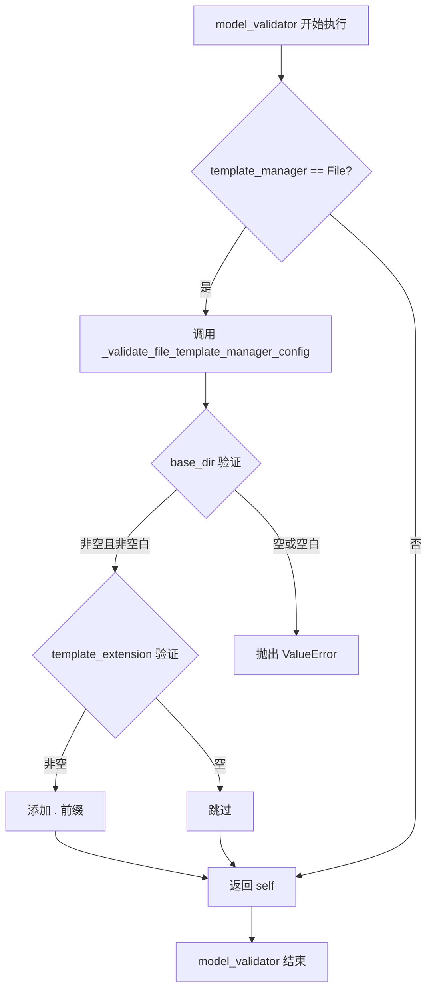
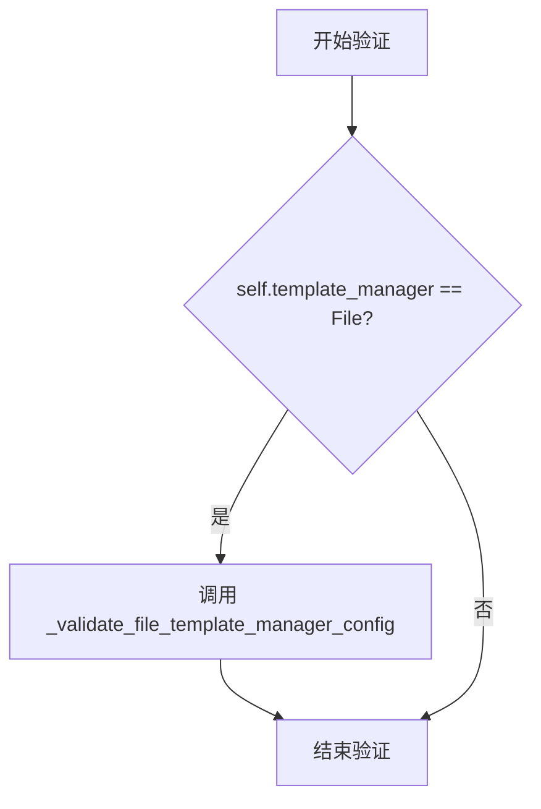
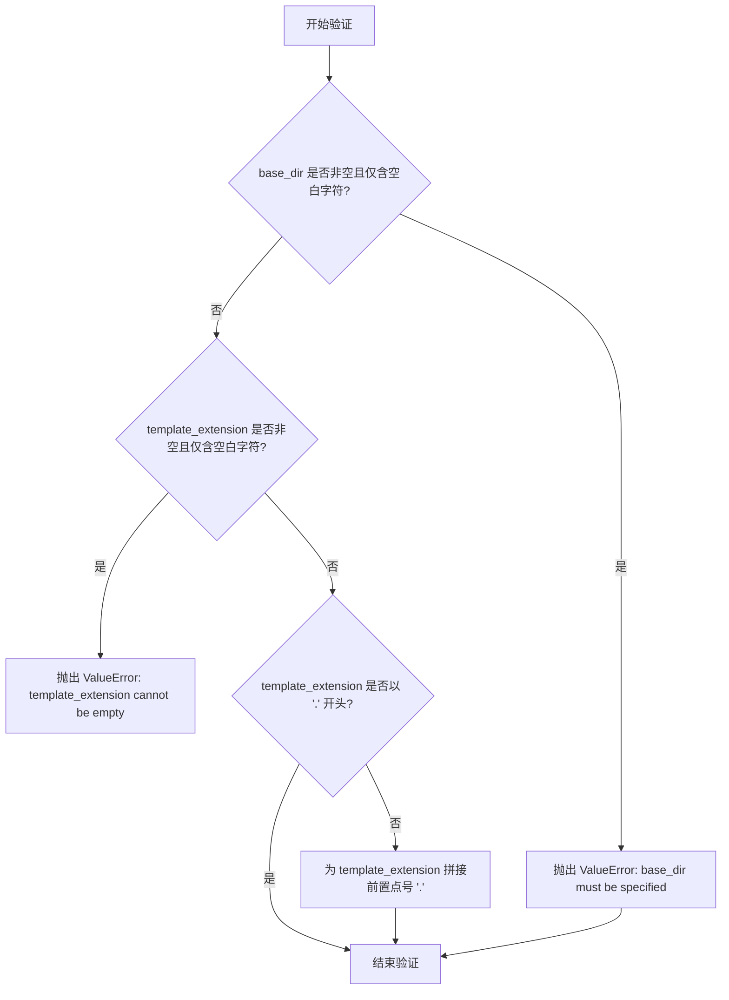
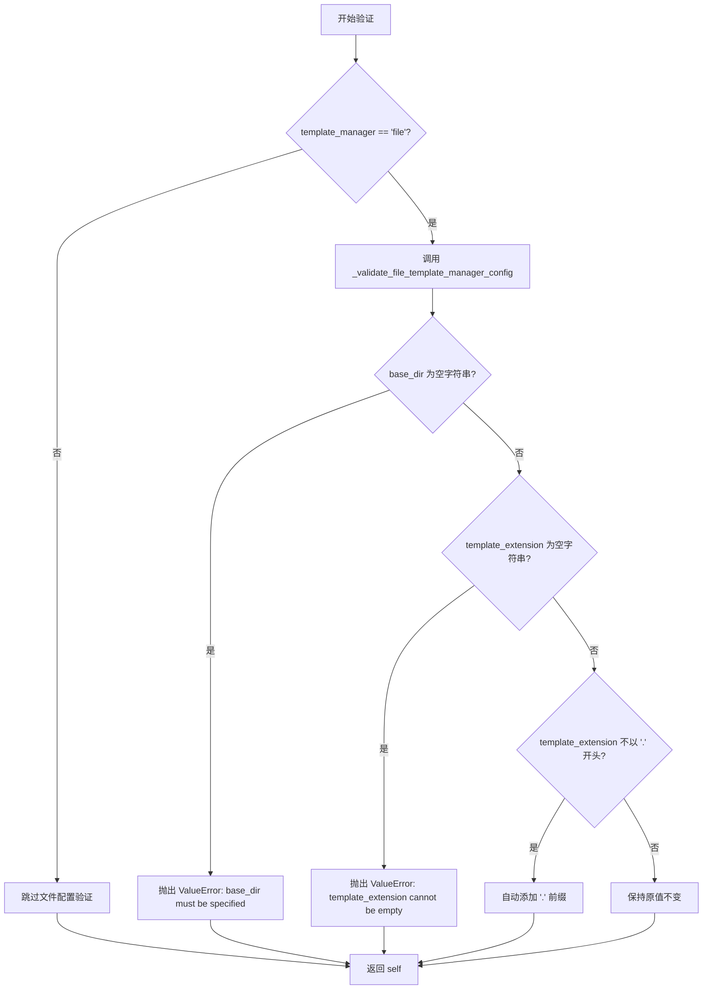

# `graphrag\packages\graphrag-llm\graphrag_llm\config\template_engine_config.py` 详细设计文档

这是一个Pydantic配置模型类，用于配置模板引擎的各类参数，包括模板引擎类型、模板管理器类型、文件基准目录、模板文件扩展名和文件编码等，并提供配置验证功能。

## 整体流程

```mermaid
graph TD
    A[创建TemplateEngineConfig实例] --> B{template_manager == File?}
    B -- 是 --> C[调用_validate_file_template_manager_config]
    B -- 否 --> D[跳过文件配置验证]
    C --> E{base_dir是否为非空字符串?}
    E -- 否 --> F[抛出ValueError: base_dir must be specified]
    E -- 是 --> G{template_extension是否为空字符串?}
    G -- 是 --> H[抛出ValueError: template_extension cannot be empty]
    G -- 否 --> I{template_extension是否以.开头?]
    I -- 否 --> J[自动添加.前缀]
    I -- 是 --> K[验证通过]
    J --> K
    K --> L[返回验证后的配置对象]
```

## 类结构

```
BaseModel (Pydantic 抽象基类)
└── TemplateEngineConfig (配置模型类)
```

## 全局变量及字段


### `TemplateEngineType`
    
从graphrag_llm.config.types导入的枚举类型，用于指定模板引擎的实现类型（如Jinja）

类型：`枚举类型 (Enum)`
    


### `TemplateManagerType`
    
从graphrag_llm.config.types导入的枚举类型，用于指定模板管理器的类型（如File、Memory）

类型：`枚举类型 (Enum)`
    


### `TemplateEngineConfig.type`
    
模板引擎类型，默认值为TemplateEngineType.Jinja，用于指定使用哪种模板引擎进行渲染

类型：`str`
    


### `TemplateEngineConfig.template_manager`
    
模板管理器类型，默认值为TemplateManagerType.File，用于指定模板的存储和管理方式

类型：`str`
    


### `TemplateEngineConfig.base_dir`
    
文件型模板管理器的基准目录，指定模板文件存放的根路径

类型：`str | None`
    


### `TemplateEngineConfig.template_extension`
    
模板文件扩展名，用于在文件系统中定位和识别模板文件

类型：`str | None`
    


### `TemplateEngineConfig.encoding`
    
文件编码格式，指定读取模板文件时使用的字符编码

类型：`str | None`
    
    

## 全局函数及方法


### `TemplateEngineConfig._validate_model`

这是一个 Pydantic `model_validator` 装饰器方法，在模型所有字段验证完成后执行，用于验证模板引擎配置的整体一致性，特别是针对文件型模板管理器的配置校验。

参数：

- `self`：`TemplateEngineConfig`，当前 Pydantic 模型实例

返回值：`TemplateEngineConfig`，返回验证后的模型实例（self），支持方法链式调用

#### 流程图



#### 带注释源码

```python
@model_validator(mode="after")
def _validate_model(self) -> TemplateEngineConfig:
    """Validate the template engine configuration based on its type.
    
    在所有字段验证完成后执行的后置验证器。
    仅当 template_manager 为 File 类型时，才调用文件模板管理器的配置验证。
    
    Returns:
        TemplateEngineConfig: 验证通过后返回自身，支持链式调用
        
    Raises:
        ValueError: 当 base_dir 为空字符串或 template_extension 为空字符串时
    """
    # 根据模板管理器类型执行条件验证
    if self.template_manager == TemplateManagerType.File:
        # 调用文件型模板管理器的专用验证方法
        self._validate_file_template_manager_config()
    
    # 返回验证后的模型实例（self），Pydantic 会自动处理后续验证
    return self
```


### `TemplateEngineConfig._validate_file_template_manager_config`

验证基于文件的模板管理器参数配置，确保 `base_dir` 和 `template_extension` 的有效性，并在需要时自动修正 `template_extension` 的格式。

参数：

- `self`：`TemplateEngineConfig`，隐式参数，类的实例本身

返回值：`None`，无返回值，仅进行配置验证和可能的修改

#### 流程图

```mermaid
flowchart TD
    A[开始 _validate_file_template_manager_config] --> B{base_dir is not None and base_dir.strip == ""}
    B -->|是| C[抛出 ValueError: base_dir must be specified for file-based template managers.]
    B -->|否| D{template_extension is not None and template_extension.strip == ""}
    D -->|是| E[抛出 ValueError: template_extension cannot be an empty string for file-based template managers.]
    D -->|否| F{template_extension is not None and not template_extension.startswith "."}
    F -->|是| G[self.template_extension = f".{self.template_extension}"]
    F -->|否| H[结束]
    C --> H
    E --> H
    G --> H
```

#### 带注释源码

```python
def _validate_file_template_manager_config(self) -> None:
    """Validate parameters for file-based template managers."""
    # 检查 base_dir 是否为非空字符串
    # 如果提供了 base_dir 但为空字符串，则抛出异常
    if self.base_dir is not None and self.base_dir.strip() == "":
        msg = "base_dir must be specified for file-based template managers."
        raise ValueError(msg)

    # 检查 template_extension 是否为空字符串
    # 如果提供了 template_extension 但为空字符串，则抛出异常
    if (
        self.template_extension is not None
        and self.template_extension.strip() == ""
    ):
        msg = "template_extension cannot be an empty string for file-based template managers."
        raise ValueError(msg)

    # 检查 template_extension 是否以 "." 开头
    # 如果未以 "." 开头，则自动添加 "." 前缀以确保格式一致性
    if (
        self.template_extension is not None
        and not self.template_extension.startswith(".")
    ):
        self.template_extension = f".{self.template_extension}"
```


### `TemplateEngineConfig._validate_model`

验证模板引擎配置，根据模板管理器类型进行相应的配置校验。

参数：

- `self`：`TemplateEngineConfig`，Pydantic 模型实例，表示当前的配置对象

返回值：`TemplateEngineConfig`，返回验证后的模型实例本身，用于链式调用

#### 流程图



#### 带注释源码

```python
@model_validator(mode="after")
def _validate_model(self):
    """Validate the template engine configuration based on its type."""
    # 检查模板管理器类型是否为文件类型
    if self.template_manager == TemplateManagerType.File:
        # 如果是文件类型，则调用文件模板管理器配置验证方法
        self._validate_file_template_manager_config()
    # 返回验证后的模型实例本身（支持链式调用）
    return self
```

---

**补充说明**：

- **方法性质**：这是一个 Pydantic `model_validator`（`mode="after"`），在模型所有字段验证完成后执行
- **验证逻辑**：仅当 `template_manager` 设置为 `TemplateManagerType.File` 时，才会触发文件模板管理器配置的验证
- **验证内容**：调用 `_validate_file_template_manager_config()` 方法，检查 `base_dir` 和 `template_extension` 参数的有效性
- **返回值设计**：返回 `self` 是 Pydantic model_validator 的标准模式，允许在验证后返回修改后的实例


### `TemplateEngineConfig._validate_file_template_manager_config`

验证文件型模板管理器的配置参数，确保 `base_dir` 和 `template_extension` 的值合法有效，并在需要时自动修正 `template_extension` 的格式（补齐前置点号）。

参数：该方法无显式参数（`self` 为隐式实例参数）

返回值：`None`，无返回值，仅在验证失败时抛出 `ValueError` 异常

#### 流程图



#### 带注释源码

```python
def _validate_file_template_manager_config(self) -> None:
    """Validate parameters for file-based template managers.
    
    该方法用于验证文件型模板管理器的配置参数，确保:
    1. base_dir 不能为空字符串（如果已提供）
    2. template_extension 不能为空字符串（如果已提供）
    3. template_extension 如果提供且不含点号，则自动补齐点号
    
    Raises:
        ValueError: 当 base_dir 或 template_extension 为空字符串时抛出
    """
    
    # 验证 base_dir：若提供了 base_dir，则不能为空字符串
    # strip() 用于移除首尾空白字符，防止用户传入纯空格的字符串
    if self.base_dir is not None and self.base_dir.strip() == "":
        msg = "base_dir must be specified for file-based template managers."
        raise ValueError(msg)

    # 验证 template_extension：若提供了 template_extension，则不能为空字符串
    # 同样使用 strip() 防止空格字符串绕过验证
    if (
        self.template_extension is not None
        and self.template_extension.strip() == ""
    ):
        msg = "template_extension cannot be an empty string for file-based template managers."
        raise ValueError(msg)

    # 自动修正 template_extension 格式：若提供了值但未以点号开头，则补齐点号
    # 这是一种兼容性处理，允许用户传入 'json' 或 '.json' 均可正常工作
    if (
        self.template_extension is not None
        and not self.template_extension.startswith(".")
    ):
        self.template_extension = f".{self.template_extension}"
```


### `TemplateEngineConfig._validate_model`

Pydantic模型验证器，用于在模型实例化后验证模板引擎配置的有效性。根据`template_manager`的类型执行相应的配置校验逻辑，当前仅对文件型模板管理器（File）进行配置验证。

参数：

- `self`：`TemplateEngineConfig`，模型实例本身，包含所有配置字段

返回值：`TemplateEngineConfig`，返回验证后的模型实例本身，支持链式调用

#### 流程图



#### 带注释源码

```python
@model_validator(mode="after")
def _validate_model(self):
    """Validate the template engine configuration based on its type.
    
    Pydantic模型验证器，在模型初始化完成后执行验证逻辑。
    mode="after" 表示在所有字段验证完成后执行此方法。
    """
    # 判断模板管理器类型是否为文件型
    if self.template_manager == TemplateManagerType.File:
        # 调用文件型模板管理器的配置验证方法
        self._validate_file_template_manager_config()
    
    # 返回验证后的模型实例本身
    return self
```

## 关键组件


### TemplateEngineConfig

核心配置类，基于 Pydantic BaseModel 实现，用于配置模板引擎的各项参数。允许额外字段以支持自定义指标实现。

### _validate_file_template_manager_config

文件模板管理器配置验证方法，检查 base_dir 不能为空字符串，template_extension 不能为空字符串，并自动为扩展名添加 "." 前缀。

### _validate_model

模型验证器装饰器，在模型验证阶段检查模板管理器类型，当为 File 类型时调用文件配置验证逻辑。

### type 字段

字符串类型字段，指定模板引擎类型，默认为 Jinja2。

### template_manager 字段

字符串类型字段，指定模板管理器类型，支持 File 和 Memory 两种模式，默认为 File。

### base_dir 字段

可选字符串字段，文件型模板管理器的基础目录。

### template_extension 字段

可选字符串字段，用于在文件型模板管理器中定位模板的文件扩展名。

### encoding 字段

可选字符串字段，用于文件型模板管理器中读取模板时的文件编码。

### model_validator (Pydantic)

模型验证装饰器，在配置对象创建后自动执行验证逻辑，确保配置的有效性。


## 问题及建议


### 已知问题

-   `model_config` 的文档字符串位置不规范，应放在类属性上方而非下方
-   缺少对 `base_dir` 路径存在性的验证，当使用文件模板管理器时未检查目录是否真实存在
-   `encoding` 字段定义但未在任何验证逻辑中使用，存在冗余字段风险
-   缺少对 `type` 字段的验证，未检查传入的模板引擎类型是否为有效值
-   `template_extension` 自动添加点号的逻辑隐藏在验证方法中，缺乏独立配置或常量化处理

### 优化建议

-   将 `model_config` 的文档字符串移至类内部，避免放置位置引起混淆
-   在 `_validate_file_template_manager_config` 方法中添加 `os.path.exists` 检查以验证 `base_dir` 路径有效性
-   为 `type` 字段添加类似 `template_manager` 的枚举验证逻辑，确保仅支持已注册的模板引擎类型
-   考虑将 `encoding` 的默认值显式化（如 "utf-8"），或在使用处补充文档说明其用途
-   将 `template_extension` 自动加点号的逻辑提取为独立工具方法或配置常量，提高可测试性和可维护性
-   可考虑为不同 `template_manager` 类型分别定义配置子类，通过 Pydantic 的 `model_validator` 实现更清晰的类型特定验证

## 其它


### 设计目标与约束

本配置类旨在为模板引擎提供统一、灵活的配置管理机制，支持不同类型的模板引擎（Jinja）和模板管理器（File、Memory），并通过Pydantic进行配置验证。设计约束包括：必须支持动态配置扩展（extra="allow"）、文件管理器必须指定base_dir、模板扩展名必须以点号开头。

### 错误处理与异常设计

配置验证采用Pydantic的model_validator装饰器进行自动验证。文件模板管理器验证逻辑会产生ValueError异常：当base_dir为非空字符串但仅包含空白字符时抛出"base_dir must be specified for file-based template managers."；当template_extension为空字符串时抛出"template_extension cannot be an empty string for file-based template managers."。

### 外部依赖与接口契约

本配置类依赖以下外部模块：pydantic（BaseModel、ConfigDict、Field、model_validator）用于配置建模和验证；graphrag_llm.config.types中的TemplateEngineType和TemplateManagerType枚举类型定义支持的模板引擎和管理器类型。接口契约规定：type字段接受字符串但实际应为TemplateEngineType枚举值；template_manager字段接受字符串但实际应为TemplateManagerType枚举值；其他字段均为可选配置。

### 使用示例

```python
# 使用默认配置（File模板管理器）
config = TemplateEngineConfig()

# 使用自定义文件模板管理器配置
config = TemplateEngineConfig(
    type="jinja",
    template_manager="file",
    base_dir="./templates",
    template_extension=".jinja2",
    encoding="utf-8"
)

# 使用内存模板管理器
config = TemplateEngineConfig(
    template_manager="memory"
)
```

### 安全性考虑

配置类本身不直接处理敏感数据，但encoding参数涉及文件读取编码，建议使用UTF-8等标准编码避免字符集相关安全风险。base_dir参数应验证路径安全性，避免路径遍历攻击（当前实现未做此验证，属于潜在安全优化点）。

### 配置约束汇总

| 字段 | 必填 | 默认值 | 约束条件 |
|------|------|--------|----------|
| type | 否 | Jinja | 应为有效模板引擎类型 |
| template_manager | 否 | File | 应为有效模板管理器类型 |
| base_dir | 条件必填 | None | 当template_manager为File时不能为空字符串 |
| template_extension | 否 | None | 不能为空字符串，若提供则自动补齐点号前缀 |
| encoding | 否 | None | 建议使用标准编码如utf-8 |

    