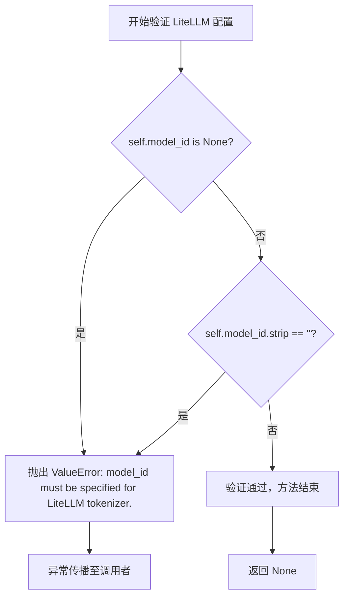
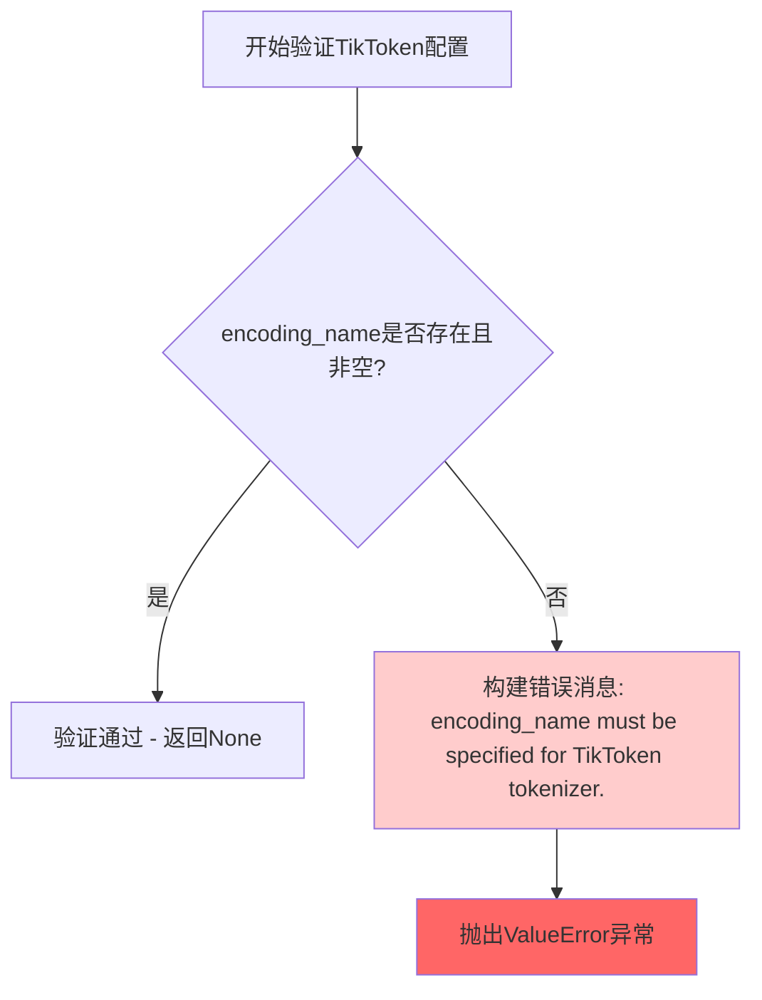
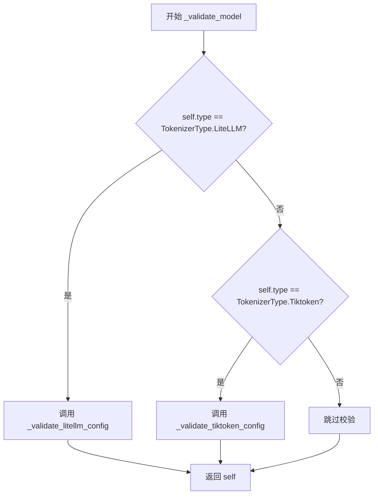

# `graphrag\packages\graphrag-llm\graphrag_llm\config\tokenizer_config.py` 详细设计文档

这是一个用于配置tokenizer（分词器）的Pydantic模型，支持LiteLLM和TikToken两种分词器类型，通过model_validator在实例化时自动验证配置参数的有效性。

## 整体流程

```mermaid
graph TD
    A[开始] --> B[创建TokenizerConfig实例]
    B --> C[Pydantic基础验证]
    C --> D[调用model_validator(mode='after')]
    D --> E{type == LiteLLM?}
    E -- 是 --> F[调用_validate_litellm_config]
    E -- 否 --> G{type == Tiktoken?}
    G -- 是 --> H[调用_validate_tiktoken_config]
    G -- 否 --> I[跳过验证]
    F --> J{model_id有效?}
    J -- 否 --> K[抛出ValueError]
    J -- 是 --> L[返回self]
    H --> M{encoding_name有效?}
    M -- 否 --> N[抛出ValueError]
    M -- 是 --> L
    K --> O[结束]
    L --> O
    I --> O
```

## 类结构

```
BaseModel (Pydantic基类)
└── TokenizerConfig (分词器配置类)
    ├── 字段: type, model_id, encoding_name
    └── 方法: _validate_litellm_config, _validate_tiktoken_config, _validate_model
```

## 全局变量及字段


### `TokenizerType.LiteLLM`
    
LiteLLM分词器类型枚举值

类型：`枚举值 (TokenizerType)`
    


### `TokenizerType.Tiktoken`
    
TikToken分词器类型枚举值

类型：`枚举值 (TokenizerType)`
    


### `TokenizerConfig.type`
    
分词器类型，默认为LiteLLM

类型：`str`
    


### `TokenizerConfig.model_id`
    
分词器模型标识符，用于LiteLLM分词器

类型：`str | None`
    


### `TokenizerConfig.encoding_name`
    
编码名称，用于TikToken分词器

类型：`str | None`
    
    

## 全局函数及方法


### `TokenizerConfig._validate_litellm_config`

验证 LiteLLM tokenizer 配置，确保 `model_id` 字段已正确指定且非空，否则抛出 `ValueError` 异常。

参数：

- （无显式参数，仅有隐式 `self` 参数）

返回值：`None`，无返回值；若验证失败则抛出 `ValueError` 异常。

#### 流程图



#### 带注释源码

```python
def _validate_litellm_config(self) -> None:
    """Validate LiteLLM tokenizer configuration."""
    # 检查 model_id 是否为 None 或空字符串
    if self.model_id is None or self.model_id.strip() == "":
        # 构建错误消息，包含清晰的说明
        msg = "model_id must be specified for LiteLLM tokenizer."
        # 抛出 ValueError 异常，中断配置验证流程
        raise ValueError(msg)
    # 验证通过，方法正常返回（隐式返回 None）
```


### `TokenizerConfig._validate_tiktoken_config`

验证TikToken tokenizer配置，确保encoding_name字段已正确设置且不为空。

参数：

- （无参数，仅作为实例方法通过self访问实例属性）

返回值：`None`，无返回值。该方法通过抛出`ValueError`异常来处理验证失败的情况。

#### 流程图



#### 带注释源码

```python
def _validate_tiktoken_config(self) -> None:
    """Validate TikToken tokenizer configuration."""
    # 检查encoding_name是否为None或空字符串
    if self.encoding_name is None or self.encoding_name.strip() == "":
        # 构建详细的错误消息，说明encoding_name对于TikToken tokenizer是必需的
        msg = "encoding_name must be specified for TikToken tokenizer."
        # 抛出ValueError异常以阻止无效配置继续使用
        raise ValueError(msg)
    # 验证通过，方法正常结束（隐式返回None）
```


### `TokenizerConfig._validate_model`

模型验证器入口方法，作为 Pydantic `model_validator` 在配置对象构造完成后自动触发，根据 `type` 字段的值分发至对应的配置校验逻辑，确保不同 tokenizer 类型的必要参数已正确配置。

参数：

- `self`：`TokenizerConfig`，当前配置实例，隐式参数，代表被验证的模型对象本身

返回值：`TokenizerConfig`，返回验证后的模型实例本身，以支持链式调用

#### 流程图



#### 带注释源码

```python
@model_validator(mode="after")
def _validate_model(self):
    """Validate the tokenizer configuration based on its type."""
    # 判断 tokenizer 类型是否为 LiteLLM
    if self.type == TokenizerType.LiteLLM:
        # 调用 LiteLLM 配置校验方法，验证 model_id 是否已设置
        self._validate_litellm_config()
    # 判断 tokenizer 类型是否为 Tiktoken
    elif self.type == TokenizerType.Tiktoken:
        # 调用 TikToken 配置校验方法，验证 encoding_name 是否已设置
        self._validate_tiktoken_config()
    # 返回验证后的模型实例本身，支持链式调用
    return self
```

## 关键组件


### TokenizerConfig 类

这是代码的核心配置类，继承自Pydantic的BaseModel，用于定义tokenizer的各种配置选项。该类通过Pydantic的model_validator实现了基于tokenizer类型的动态验证逻辑。

### type 字段

字符串类型字段，默认值为TokenizerType.LiteLLM，用于指定要使用的tokenizer类型（如litellm或tiktoken）。

### model_id 字段

可选字符串字段，用于指定tokenizer模型的标识符，示例值为"openai/gpt-4o"，仅在使用LiteLLM tokenizer时需要提供。

### encoding_name 字段

可选字符串字段，用于指定tokenizer的编码名称，示例值为"gpt-4o"，仅在使用TikToken tokenizer时需要提供。

### _validate_litellm_config 方法

私有验证方法，用于验证LiteLLM tokenizer的配置，检查model_id是否已提供且非空，若不满足则抛出ValueError异常。

### _validate_tiktoken_config 方法

私有验证方法，用于验证TikToken tokenizer的配置，检查encoding_name是否已提供且非空，若不满足则抛出ValueError异常。

### _validate_model 方法

模型验证器装饰器方法，在Pydantic模型验证阶段自动调用，根据tokenizer类型分发到对应的验证方法，实现配置验证的动态分发逻辑。


## 问题及建议


### 已知问题

-   **硬编码的类型分支验证**：在 `_validate_model` 方法中，仅对 `LiteLLM` 和 `Tiktoken` 两种类型进行验证，其他类型直接放行，缺乏对未知类型的警告或默认处理逻辑
-   **验证逻辑与类型定义分离**：使用了 `TokenizerType` 枚举进行类型判断，但在 `model_validator` 中使用字符串比较而非枚举比较，可能导致类型不一致
-   **缺少默认值验证**：虽然 `type` 字段有默认值，但当传入空字符串时不会触发验证，可能导致无效配置
-   **字符串 strip 后再判断冗余**：在验证方法中先调用 `strip()` 再判断是否为空，可以简化为一步
-   **extra 配置与验证不匹配**：配置了 `extra="allow"` 允许额外字段，但没有对额外字段的验证或文档说明

### 优化建议

-   **增加默认类型验证**：在 `model_validator` 中添加 `else` 分支，对未知 tokenizer 类型记录警告或使用日志提示
-   **统一使用枚举比较**：将 `self.type == TokenizerType.LiteLLM` 改为 `self.type is TokenizerType.LiteLLM`，使用身份比较避免字符串误匹配
-   **简化空值判断逻辑**：直接使用 `if not self.model_id or not self.model_id.strip()` 的简化形式，或使用 Pydantic 的 `field_validator` 装饰器进行更优雅的验证
-   **添加类型默认值校验**：在 `Field` 中增加 `validate_default=True` 或添加 `PreValidator` 确保默认值有效
-   **补充配置文档**：为额外字段添加说明，或在类文档中明确哪些额外字段是允许的及如何验证

## 其它


### 设计目标与约束

该配置类的主要设计目标是提供一个灵活且可扩展的tokenizer配置框架，支持多种tokenizer类型（LiteLLM和Tiktoken），同时通过Pydantic的验证机制确保配置的正确性。约束包括：必须根据tokenizer类型提供相应的必需字段（LiteLLM需要model_id，Tiktoken需要encoding_name），并且允许额外的字段以支持自定义LLM provider实现。

### 错误处理与异常设计

代码通过Pydantic的model_validator装饰器实现配置验证。当type为LiteLLM但model_id为空时，抛出ValueError并提示"model_id must be specified for LiteLLM tokenizer."；当type为Tiktoken但encoding_name为空时，抛出ValueError并提示"encoding_name must be specified for TikToken tokenizer."。这种设计确保了在对象构造时立即发现配置错误，符合fail-fast原则。

### 外部依赖与接口契约

该类依赖以下外部组件：1) pydantic库的BaseModel、ConfigDict、Field和model_validator，用于数据验证和配置管理；2) graphrag_llm.config.types模块中的TokenizerType枚举类型，定义了支持的tokenizer类型。接口契约方面，type字段接受字符串类型的tokenizer类型标识，model_id和encoding_name字段接受字符串或None值，返回值为经过验证的TokenizerConfig实例。

### 性能考虑

由于该类仅用于配置数据加载和验证，不涉及运行时性能敏感操作。Pydantic的model_validator在实例化时执行一次验证，后续使用已验证的实例无需额外性能开销。

### 安全考虑

该配置类本身不涉及敏感数据处理，但需要注意model_id和encoding_name可能包含外部服务标识信息。建议在日志输出时避免泄露完整的model_id信息，尤其是当其包含API密钥或其他凭证时。

### 测试策略

建议编写以下测试用例：1) 有效的LiteLLM配置验证通过；2) 有效的Tiktoken配置验证通过；3) LiteLLM类型缺少model_id时抛出预期异常；4) Tiktoken类型缺少encoding_name时抛出预期异常；5) 支持额外字段的扩展配置；6) 默认值测试（type默认为LiteLLM）。

### 版本兼容性

该代码使用Python 3.10+的类型注解语法（str | None），依赖pydantic v2.x版本（使用model_validator而非旧的validator装饰器）。需要确保运行时环境满足这些版本要求。

    