# `graphrag\packages\graphrag-llm\graphrag_llm\config\types.py` 详细设计文档

该文件定义了GraphRAG系统中LLM（大型语言模型）配置相关的枚举类型，包括LLM提供者、认证方法、指标处理/写入/存储、重试策略、模板引擎和分词器等配置选项。

## 整体流程

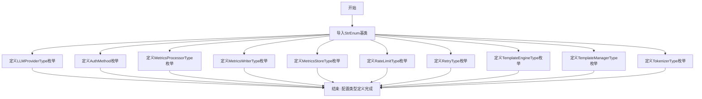
```mermaid
graph TD
    A[开始] --> B[导入StrEnum基类]
    B --> C[定义LLMProviderType枚举]
    B --> D[定义AuthMethod枚举]
    B --> E[定义MetricsProcessorType枚举]
    B --> F[定义MetricsWriterType枚举]
    B --> G[定义MetricsStoreType枚举]
    B --> H[定义RateLimitType枚举]
    B --> I[定义RetryType枚举]
    B --> J[定义TemplateEngineType枚举]
    B --> K[定义TemplateManagerType枚举]
    B --> L[定义TokenizerType枚举]
    C --> M[结束: 配置类型定义完成]
D --> M
E --> M
F --> M
G --> M
H --> M
I --> M
J --> M
K --> M
L --> M
```

## 类结构

```
StrEnum (Python标准库枚举基类)
├── LLMProviderType
├── AuthMethod
├── MetricsProcessorType
├── MetricsWriterType
├── MetricsStoreType
├── RateLimitType
├── RetryType
├── TemplateEngineType
├── TemplateManagerType
└── TokenizerType
```

## 全局变量及字段


### `LLMProviderType`
    
LLM提供商类型枚举，定义支持的LLM服务提供商

类型：`StrEnum`
    


### `AuthMethod`
    
认证方法枚举，定义系统支持的认证方式

类型：`StrEnum`
    


### `MetricsProcessorType`
    
指标处理器类型枚举，定义内置的指标处理实现

类型：`StrEnum`
    


### `MetricsWriterType`
    
指标写入器类型枚举，定义指标输出目标

类型：`StrEnum`
    


### `MetricsStoreType`
    
指标存储类型枚举，定义指标数据的持久化方式

类型：`StrEnum`
    


### `RateLimitType`
    
速率限制类型枚举，定义限流算法的实现方式

类型：`StrEnum`
    


### `RetryType`
    
重试策略类型枚举，定义请求失败时的重试机制

类型：`StrEnum`
    


### `TemplateEngineType`
    
模板引擎类型枚举，定义模板渲染引擎

类型：`StrEnum`
    


### `TemplateManagerType`
    
模板管理器类型枚举，定义模板资源管理方式

类型：`StrEnum`
    


### `TokenizerType`
    
分词器类型枚举，定义文本分词处理引擎

类型：`StrEnum`
    


### `LLMProviderType.LiteLLM (StrEnum成员)`
    
LiteLLM提供商标识符，用于使用litellm库调用LLM服务

类型：`LLMProviderType`
    


### `LLMProviderType.MockLLM (StrEnum成员)`
    
模拟LLM提供商标识符，用于测试和开发环境

类型：`LLMProviderType`
    


### `AuthMethod.ApiKey (StrEnum成员)`
    
API密钥认证方式，通过密钥进行服务授权

类型：`AuthMethod`
    


### `AuthMethod.AzureManagedIdentity (StrEnum成员)`
    
Azure托管身份认证方式，使用Azure AD进行身份验证

类型：`AuthMethod`
    


### `MetricsProcessorType.Default (StrEnum成员)`
    
默认指标处理器，使用系统内置的标准实现

类型：`MetricsProcessorType`
    


### `MetricsWriterType.Log (StrEnum成员)`
    
日志指标写入器，将指标输出到日志系统

类型：`MetricsWriterType`
    


### `MetricsWriterType.File (StrEnum成员)`
    
文件指标写入器，将指标持久化到文件系统

类型：`MetricsWriterType`
    


### `MetricsStoreType.Memory (StrEnum成员)`
    
内存指标存储，使用内存作为临时存储后端

类型：`MetricsStoreType`
    


### `RateLimitType.SlidingWindow (StrEnum成员)`
    
滑动窗口限流算法，基于时间滑动窗口控制请求速率

类型：`RateLimitType`
    


### `RetryType.ExponentialBackoff (StrEnum成员)`
    
指数退避重试策略，每次失败后指数增加等待时间

类型：`RetryType`
    


### `RetryType.Immediate (StrEnum成员)`
    
立即重试策略，失败后立即进行重试

类型：`RetryType`
    


### `TemplateEngineType.Jinja (StrEnum成员)`
    
Jinja模板引擎，使用Jinja2进行模板渲染

类型：`TemplateEngineType`
    


### `TemplateManagerType.File (StrEnum成员)`
    
文件模板管理器，从文件系统加载模板资源

类型：`TemplateManagerType`
    


### `TokenizerType.LiteLLM (StrEnum成员)`
    
LiteLLM分词器，使用litellm库进行文本分词

类型：`TokenizerType`
    


### `TokenizerType.Tiktoken (StrEnum成员)`
    
Tiktoken分词器，使用OpenAI的tiktoken库进行文本分词

类型：`TokenizerType`
    
    

## 全局函数及方法


### LLMProviderType

描述：继承自StrEnum的LLM提供商类型枚举类，定义了两个提供商：LiteLLM和MockLLM。

参数：

- 无

返回值：`str`，返回枚举成员的字符串值（如"litellm"或"mock"）

#### 流程图

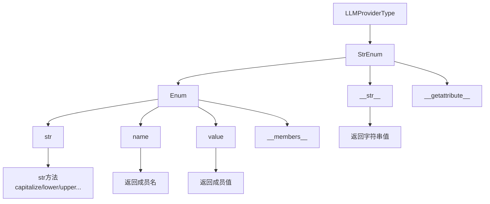
```mermaid
flowchart TD
    A[LLMProviderType] --> B[StrEnum]
    B --> C[Enum]
    C --> D[str]
    
    B --> E[__str__]
    B --> F[__getattribute__]
    C --> G[name]
    C --> H[value]
    C --> I[__members__]
    D --> J[str方法<br/>capitalize/lower/upper...]
    
    E --> K[返回字符串值]
    G --> L[返回成员名]
    H --> M[返回成员值]
```

#### 带注释源码

```python
class LLMProviderType(StrEnum):
    """Enum for LLM provider types."""

    LiteLLM = "litellm"  # LiteLLM提供商
    MockLLM = "mock"     # Mock测试用提供商
    
    # 继承自StrEnum的方法：
    # - __str__: 返回枚举成员的字符串值
    # - name: 返回枚举成员名称（如"LiteLLM"）
    # - value: 返回枚举成员值（如"litellm"）
    # - __eq__: 比较枚举成员与字符串是否相等
    # - __hash__: 支持哈希操作
    # 继承自str的方法：
    # - lower(): 转换为小写
    # - upper(): 转换为大写
    # - capitalize(): 首字母大写
    # - 等等所有str的方法
```


### AuthMethod

描述：AuthMethod 是一个继承自 StrEnum 的枚举类，用于定义身份验证方法的类型，包括 ApiKey 和 AzureManagedIdentity 两种认证方式。

### 继承自 StrEnum 的方法

由于 AuthMethod 继承自 StrEnum，因此它同时继承了 str 和 Enum 的所有方法。以下是主要方法的详细信息：

---

### AuthMethod.\_\_str\_\_

返回枚举成员的字符串表示形式。

参数：无

返回值：`str`，返回枚举成员的值（即字符串 "api_key" 或 "azure_managed_identity"）

#### 流程图

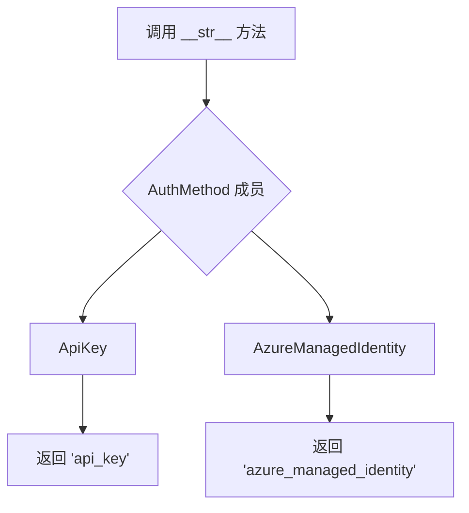
```mermaid
graph TD
    A[调用 __str__ 方法] --> B{AuthMethod 成员}
    B --> C[ApiKey]
    B --> D[AzureManagedIdentity]
    C --> E[返回 'api_key']
    D --> F[返回 'azure_managed_identity']
```

#### 带注释源码

```python
def __str__(self) -> str:
    """
    返回枚举成员的字符串值。
    
    对于 AuthMethod.ApiKey，返回 'api_key'
    对于 AuthMethod.AzureManagedIdentity，返回 'azure_managed_identity'
    """
    return str(self.value)
```

---

### AuthMethod.name

获取枚举成员的名称属性。

参数：无

返回值：`str`，返回枚举成员的名称

#### 流程图


```mermaid
graph TD
    A[访问 name 属性] --> B{AuthMethod 成员}
    B --> C[ApiKey]
    B --> D[AzureManagedIdentity]
    C --> E[返回 'ApiKey']
    D --> F[返回 'AzureManagedIdentity']
```

#### 带注释源码

```python
# name 是 Enum 类提供的只读属性
# 示例：
# AuthMethod.ApiKey.name  -> 'ApiKey'
# AuthMethod.AzureManagedIdentity.name  -> 'AzureManagedIdentity'
```

---

### AuthMethod.value

获取枚举成员的值属性。

参数：无

返回值：`str`，返回枚举成员的实际值

#### 流程图

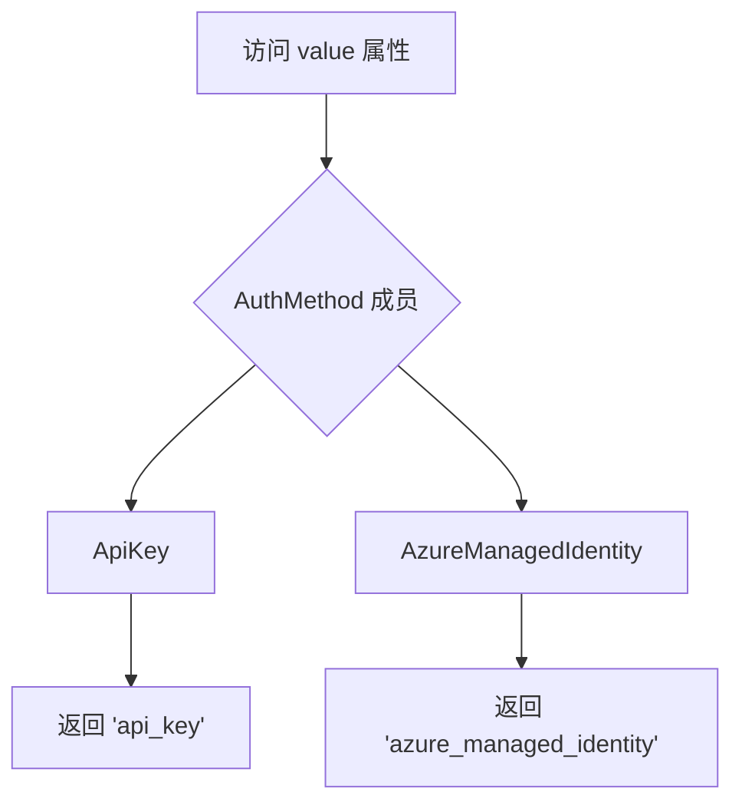
```mermaid
graph TD
    A[访问 value 属性] --> B{AuthMethod 成员}
    B --> C[ApiKey]
    B --> D[AzureManagedIdentity]
    C --> E[返回 'api_key']
    D --> F[返回 'azure_managed_identity']
```

#### 带注释源码

```python
# value 是 StrEnum 成员的核心属性，表示实际的字符串值
# 示例：
# AuthMethod.ApiKey.value  -> 'api_key'
# AuthMethod.AzureManagedIdentity.value  -> 'azure_managed_identity'
```

---

### AuthMethod.\_\_eq\_\_

比较两个枚举成员是否相等。

参数：

- `other`：比较对象，可以是 AuthMethod 枚举成员或其他可比较对象

返回值：`bool`，如果相等返回 True，否则返回 False

#### 流程图

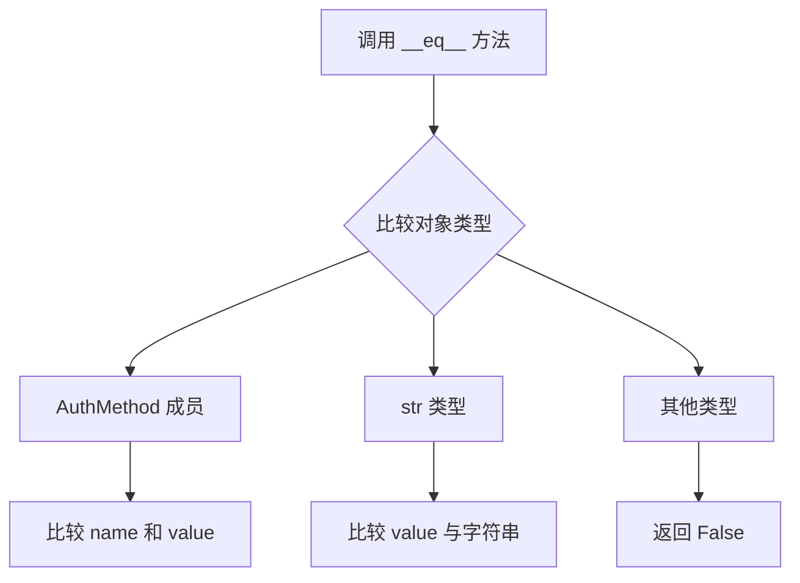
```mermaid
graph TD
    A[调用 __eq__ 方法] --> B{比较对象类型}
    B --> C[AuthMethod 成员]
    B --> D[str 类型]
    B --> E[其他类型]
    C --> F[比较 name 和 value]
    D --> G[比较 value 与字符串]
    E --> H[返回 False]
```

#### 带注释源码

```python
def __eq__(self, other: object) -> bool:
    """
    比较枚举成员是否相等。
    
    支持与同类型枚举成员比较，也支持与字符串直接比较。
    """
    if isinstance(other, str):
        # 可以直接与字符串比较: AuthMethod.ApiKey == "api_key" -> True
        return self.value == other
    return super().__eq__(other)
```

---

### AuthMethod.\_\_hash\_\_

返回枚举成员的哈希值。

参数：无

返回值：`int`，返回枚举成员的哈希值

#### 带注释源码

```python
# __hash__ 方法继承自 Enum 类
# 使枚举成员可以用作字典键或集合元素
# 示例：
# hash(AuthMethod.ApiKey) -> 可用于字典键
```

---

### str 方法（继承自 str 类）

由于 StrEnum 继承自 str，AuthMethod 的所有实例也都是字符串，因此可以使用所有 str 方法。

#### AuthMethod.upper()

将字符串值转换为大写。

参数：无

返回值：`str`，返回大写字符串

#### 带注释源码

```python
# 示例：
# AuthMethod.ApiKey.upper()  -> 'API_KEY'
# AuthMethod.AzureManagedIdentity.upper()  -> 'AZURE_MANAGED_IDENTITY'
```

#### AuthMethod.lower()

将字符串值转换为小写。

参数：无

返回值：`str`，返回小写字符串

#### 带注释源码

```python
# 示例：
# AuthMethod.ApiKey.lower()  -> 'api_key'
# AuthMethod.AzureManagedIdentity.lower()  -> 'azure_managed_identity'
```

#### AuthMethod.startswith()

检查字符串是否以指定前缀开头。

参数：

- `prefix`：前缀字符串或元组

返回值：`bool`，如果以指定前缀开头返回 True

#### 带注释源码

```python
# 示例：
# AuthMethod.ApiKey.startswith('api')  -> True
# AuthMethod.AzureManagedIdentity.startswith('azure')  -> True
```

#### AuthMethod.endswith()

检查字符串是否以指定后缀结尾。

参数：

- `suffix`：后缀字符串或元组

返回值：`bool`，如果以指定后缀结尾返回 True

#### 带注释源码

```python
# 示例：
# AuthMethod.ApiKey.endswith('key')  -> True
# AuthMethod.AzureManagedIdentity.endswith('identity')  -> True
```

#### AuthMethod.split()

分割字符串。

参数：

- `sep`：分隔符，默认为空白字符

返回值：`list[str]`，返回分割后的字符串列表

#### 带注释源码

```python
# 示例：
# AuthMethod.AzureManagedIdentity.split('_')  -> ['azure', 'managed', 'identity']
```

---

### AuthMethod.\_\_iter\_\_

迭代枚举成员。

参数：无

返回值：迭代器

#### 流程图

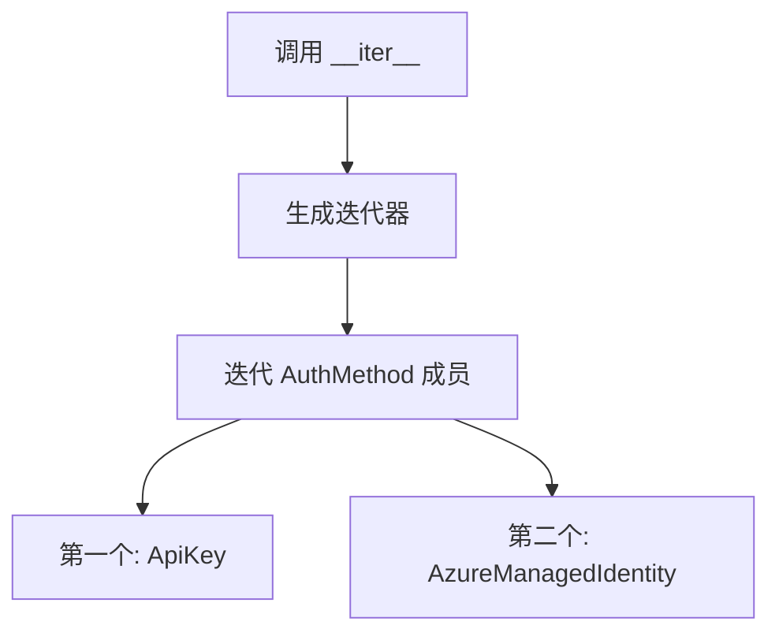
```mermaid
graph TD
    A[调用 __iter__] --> B[生成迭代器]
    B --> C[迭代 AuthMethod 成员]
    C --> D[第一个: ApiKey]
    C --> E[第二个: AzureManagedIdentity]
```

#### 带注释源码

```python
# 示例：
# for method in AuthMethod:
#     print(method)
# 输出:
# AuthMethod.ApiKey
# AuthMethod.AzureManagedIdentity
```

---

### AuthMethod.\_\_len\_\_

返回枚举成员的数量。

参数：无

返回值：`int`，返回枚举成员的数量

#### 带注释源码

```python
# 示例：
# len(AuthMethod)  -> 2
```

---

### AuthMethod.\_\_members\_\_

获取所有枚举成员的字典。

参数：无

返回值：`dict`，返回成员名称到成员的映射

#### 带注释源码

```python
# 示例：
# AuthMethod.__members__
# -> {'ApiKey': <AuthMethod.ApiKey: 'api_key'>, 
#     'AzureManagedIdentity': <AuthMethod.AzureManagedIdentity: 'azure_managed_identity'>}
```

---

### AuthMethod.\_\_repr\_\_

返回枚举成员的官方字符串表示。

参数：无

返回值：`str`，返回官方表示字符串

#### 带注释源码

```python
# 示例：
# repr(AuthMethod.ApiKey)  -> "AuthMethod.ApiKey"
```

---

### AuthMethod.from()

根据字符串值获取对应的枚举成员。**注意：这是类方法**

参数：

- `value`：字符串值

返回值：`AuthMethod`，返回对应的枚举成员

#### 带注释源码

```python
# 示例：
# AuthMethod.from('api_key')  -> AuthMethod.ApiKey
# AuthMethod.from('azure_managed_identity')  -> AuthMethod.AzureManagedIdentity
# 如果值不存在，会抛出 ValueError
```

---

### AuthMethod.\_\_class\_\_

获取枚举类本身。

参数：无

返回值：`type`，返回 AuthMethod 类

#### 带注释源码

```python
# 示例：
# AuthMethod.ApiKey.__class__  -> <class 'AuthMethod'>
```


### MetricsProcessorType

继承自 StrEnum 的枚举类，用于定义内置的 MetricsProcessor 类型。

#### 继承的方法

由于 MetricsProcessorType 继承自 StrEnum，它自动获得了以下方法：

##### 1. name 属性

- **类型**: `str`
- **描述**: 枚举成员的名称

##### 2. value 属性

- **类型**: `str`
- **描述**: 枚举成员的值（字符串）

##### 3. __str__() 方法

- **参数**: 无
- **返回值**: `str`，返回枚举成员的值（字符串形式）

##### 4. __repr__() 方法

- **参数**: 无
- **返回值**: `str`，返回枚举的表示形式

##### 5. __eq__() 方法

- **参数**: `other`: `Any`
- **返回值**: `bool`，比较枚举成员是否相等

##### 6. __hash__() 方法

- **参数**: 无
- **返回值**: `int`，返回枚举成员的哈希值

##### 7. __iter__() 方法

- **参数**: 无
- **返回值**: `Iterator[MetricsProcessorType]`，迭代枚举成员

##### 8. __len__() 方法

- **参数**: 无
- **返回值**: `int`，返回枚举成员的数量

##### 9. __getitem__() 方法

- **参数**: `index`: `int`
- **返回值**: `MetricsProcessorType`，通过索引获取枚举成员

##### 10. str 方法（继承自 str）

由于 StrEnum 继承自 str，MetricsProcessorType 的实例也是字符串，因此可以使用以下 str 方法：

- **upper()**: 返回转换为大写的字符串
- **lower()**: 返回转换为小写的字符串
- **strip()**: 去除字符串两端的空白字符
- **split()**: 分割字符串
- **replace()**: 替换字符串中的子串
- 等等，所有 str 方法都可用

#### 流程图

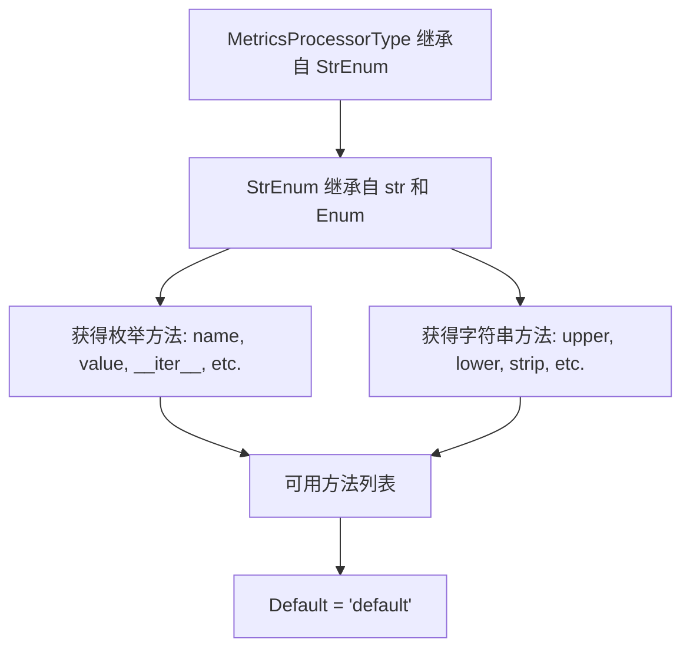
```mermaid
flowchart TD
    A[MetricsProcessorType 继承自 StrEnum] --> B[StrEnum 继承自 str 和 Enum]
    B --> C[获得枚举方法: name, value, __iter__, etc.]
    B --> D[获得字符串方法: upper, lower, strip, etc.]
    
    C --> E[可用方法列表]
    D --> E
    
    E --> F[Default = 'default']
```

#### 带注释源码

```python
class MetricsProcessorType(StrEnum):
    """Enum for built-in MetricsProcessor types."""
    
    # 继承自 StrEnum 的方法：
    # 1. name 属性 - 返回枚举成员名称 'Default'
    # 2. value 属性 - 返回枚举成员值 'default'
    # 3. __str__() - 返回 'default'（字符串值）
    # 4. __repr__() - 返回 "MetricsProcessorType.Default"
    # 5. __eq__() - 支持与字符串比较，如 MetricsProcessorType.Default == 'default' 返回 True
    # 6. __hash__() - 支持哈希操作
    # 7. __iter__() - 支持迭代，如 list(MetricsProcessorType) 返回 [MetricsProcessorType.Default]
    # 8. __len__() - 返回成员数量
    # 9. __getitem__() - 支持索引访问
    
    # 由于 StrEnum 继承自 str，以下方法也可用：
    # - upper() - 'DEFAULT'
    # - lower() - 'default'
    # - strip() - 'default'
    # - split() - ['default']
    # - replace() - 字符串替换
    # - 等等，所有 str 方法
    
    Default = "default"
```

#### 关键方法详情

| 方法名 | 参数 | 参数类型 | 返回值类型 | 描述 |
|--------|------|----------|------------|------|
| name | - | - | str | 枚举成员名称 |
| value | - | - | str | 枚举成员的值 |
| __str__ | - | - | str | 返回字符串值 |
| __repr__ | - | - | str | 返回类的表示 |
| __eq__ | other | Any | bool | 比较是否相等 |
| __hash__ | - | - | int | 返回哈希值 |
| __iter__ | - | - | Iterator | 迭代枚举成员 |
| __len__ | - | - | int | 枚举成员数量 |
| __getitem__ | index | int | MetricsProcessorType | 索引访问 |
| upper | - | - | str | 转换为大写 |
| lower | - | - | str | 转换为小写 |
| strip | - | - | str | 去除空白 |

#### 潜在的技术债务或优化空间

1. **功能单一**: `MetricsProcessorType` 目前只有一个成员 `Default`，可能需要扩展更多类型以支持不同的指标处理需求。
2. **缺乏验证**: 没有对枚举值进行运行时验证，可以考虑添加验证逻辑确保值的有效性。
3. **文档完善**: 可以添加更详细的文档说明每种处理器类型的用途和使用场景。


### MetricsWriterType

`MetricsWriterType` 是用于内置 MetricsWriter 类型的字符串枚举类，继承自 `StrEnum`。它定义了在指标写入器（MetricsWriter）中支持的类型，目前包括日志（Log）和文件（File）两种类型。

#### 枚举成员

##### MetricsWriterType.Log

日志写入器类型枚举成员

返回值：`str`，返回字符串值 `"log"`

##### MetricsWriterType.File

文件写入器类型枚举成员

返回值：`str`，返回字符串值 `"file"`

#### 继承自 StrEnum (str + Enum) 的方法

以下是从 `StrEnum`（通过继承的 `str` 和 `Enum` 基类）可用的重要方法。由于 `MetricsWriterType` 直接继承自 `StrEnum`，它自动获得以下功能：

#### 1. __iter__

迭代枚举的所有成员

参数：无

返回值：迭代器，返回枚举成员的迭代器

#### 流程图

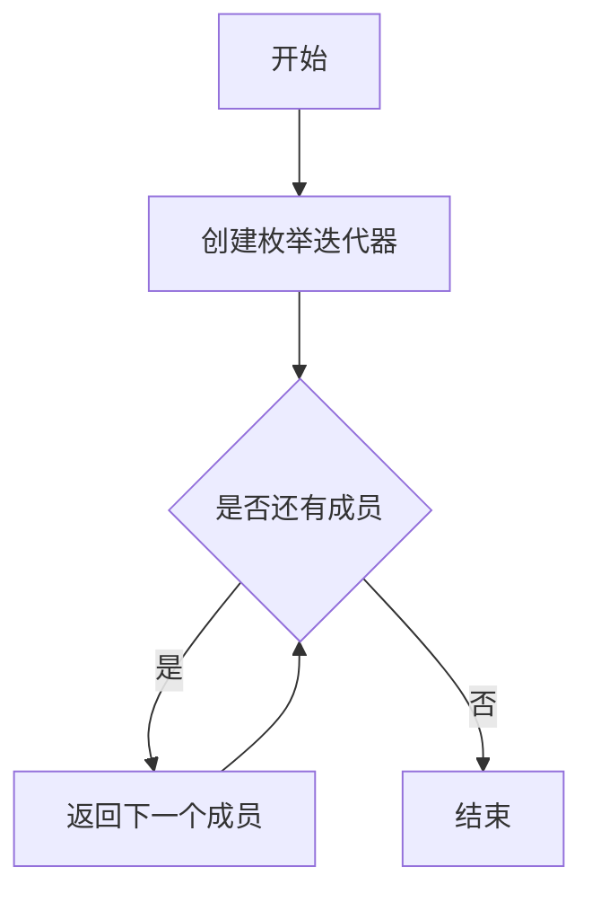
```mermaid
graph TD
    A[开始] --> B[创建枚举迭代器]
    B --> C{是否还有成员}
    C -->|是| D[返回下一个成员]
    D --> C
    C -->|否| E[结束]
```

#### 带注释源码

```python
# 从 Enum 基类继承
def __iter__(self):
    """迭代枚举的所有成员。
    
    Returns:
        迭代器: 返回枚举成员的迭代器。
    """
    return iter(list(self.__class__.member_map_.values()))
```

---

#### 2. __len__

返回枚举成员的数量

参数：无

返回值：`int`，枚举成员的数量

#### 流程图

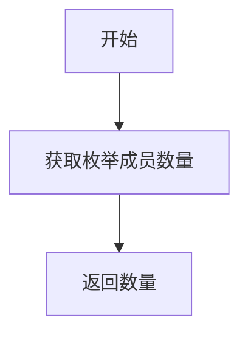
```mermaid
graph TD
    A[开始] --> B[获取枚举成员数量]
    B --> C[返回数量]
```

#### 带注释源码

```python
# 从 Enum 基类继承
def __len__(self):
    """返回枚举成员的数量。
    
    Returns:
        int: 枚举成员的数量。
    """
    return len(list(self.__class__.member_map_.values()))
```

---

#### 3. __getitem__

通过索引或名称访问枚举成员

参数：
- `key`：`int` 或 `str`，索引位置或成员名称

返回值：枚举成员

#### 流程图

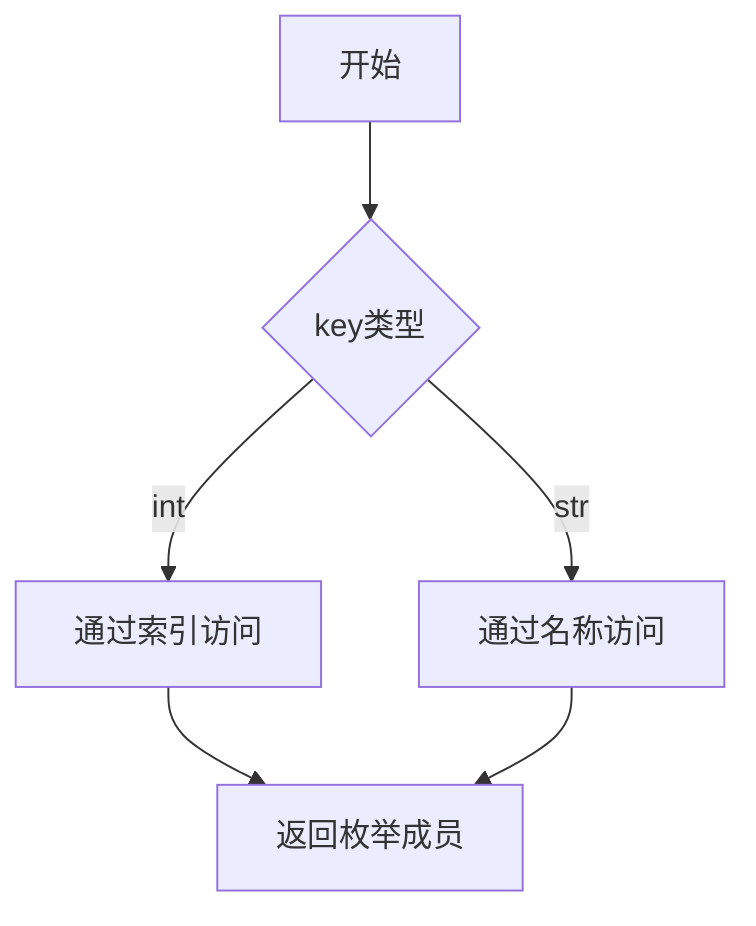
```mermaid
graph TD
    A[开始] --> B{key类型}
    B -->|int| C[通过索引访问]
    B -->|str| D[通过名称访问]
    C --> E[返回枚举成员]
    D --> E
```

#### 带注释源码

```python
# 从 Enum 基类继承
def __getitem__(self, key):
    """通过索引或名称访问枚举成员。
    
    Args:
        key: int 或 str，索引位置或成员名称
        
    Returns:
        枚举成员
        
    Raises:
        KeyError: 如果key不存在
        IndexError: 如果索引越界
    """
    return self.__class__._member_map_[key]
```

---

#### 4. __contains__

检查成员是否存在于枚举中

参数：
- `member`：枚举成员

返回值：`bool`，成员是否存在

#### 带注释源码

```python
# 从 Enum 基类继承
def __contains__(self, member):
    """检查成员是否存在于枚举中。
    
    Args:
        member: 枚举成员
        
    Returns:
        bool: 成员是否存在
    """
    return member in self.__class__._member_map_.values()
```

---

#### 5. __repr__

返回枚举类的官方字符串表示

参数：无

返回值：`str`，枚举类的表示

#### 带注释源码

```python
# 从 Enum 基类继承
def __repr__(self):
    """返回枚举类的官方字符串表示。
    
    Returns:
        str: 枚举类的表示
    """
    return f"<{self.__class__.__name__}.{self.name}: {repr(self.value)}>"
```

---

#### 6. __str__

返回枚举类的用户友好字符串表示

参数：无

返回值：`str`，枚举类的字符串表示

#### 带注释源码

```python
# 从 str 基类继承
def __str__(self):
    """返回枚举类的用户友好字符串表示。
    
    Returns:
        str: 枚举类的字符串表示
    """
    return self.name
```

---

#### 7. __members__

类的属性，返回所有枚举成员的字典

参数：无

返回值：`dict`，包含所有枚举成员名称和值的字典

#### 带注释源码

```python
# 这是一个类属性，从 Enum 基类继承
# 访问方式：MetricsWriterType.__members__
# 返回: {'Log': <MetricsWriterType.Log: 'log'>, 'File': <MetricsWriterType.File: 'file'>}
```

---

#### 继承自 str 的方法示例

由于 `MetricsWriterType` 继承自 `StrEnum`，其成员是字符串类型，因此可以调用所有字符串方法：

##### upper()

返回字符串的大写形式

参数：无

返回值：`str`，大写字符串

#### 流程图

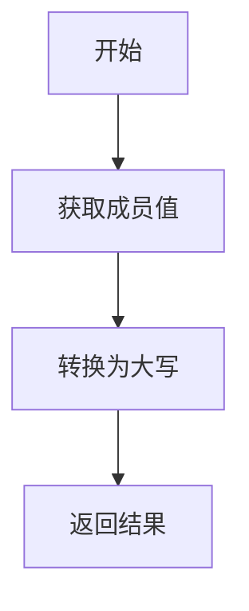
```mermaid
graph TD
    A[开始] --> B[获取成员值]
    B --> C[转换为大写]
    C --> D[返回结果]
```

#### 带注释源码

```python
# 示例用法
result = MetricsWriterType.Log.upper()  # 返回 "LOG"
# 继承自 str 类的方法
```

---

##### lower()

返回字符串的小写形式

参数：无

返回值：`str`，小写字符串

#### 带注释源码

```python
# 示例用法
result = MetricsWriterType.File.lower()  # 返回 "file"
# 继承自 str 类的方法
```

---

#### 类整体流程图

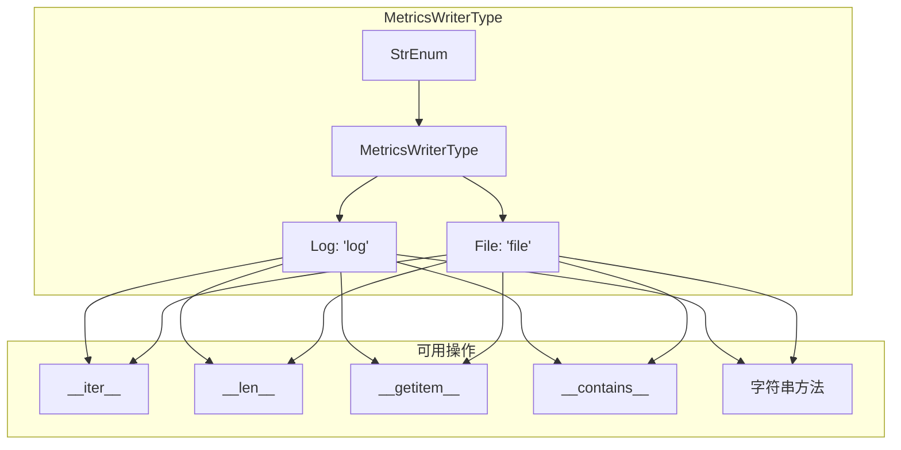
```mermaid
graph TB
    subgraph MetricsWriterType
        A[StrEnum] --> B[MetricsWriterType]
        B --> C[Log: 'log']
        B --> D[File: 'file']
    end
    
    subgraph 可用操作
        E[__iter__] 
        F[__len__]
        G[__getitem__]
        H[__contains__]
        I[字符串方法]
    end
    
    C --> E
    D --> E
    C --> F
    D --> F
    C --> G
    D --> G
    C --> H
    D --> H
    C --> I
    D --> I
```

#### 带注释源码（整体）

```python
class MetricsWriterType(StrEnum):
    """Enum for built-in MetricsWriter types."""
    
    # 枚举成员定义
    Log = "log"    # 日志写入器类型
    File = "file"  # 文件写入器类型
    
    # 继承的方法可用：
    # - __iter__: 迭代成员
    # - __len__: 成员数量
    # - __getitem__: 访问成员
    # - __contains__: 检查成员
    # - __repr__: 官方表示
    # - __str__: 字符串表示
    # - __members__: 成员字典
    # 字符串方法也适用于成员值：
    # - upper(), lower(), capitalize() 等
```


### MetricsStoreType

枚举类，用于定义内置的 MetricsStore 类型。该类继承自 StrEnum，提供了字符串和枚举的双重特性，支持字符串比较和枚举类型安全。

#### 流程图

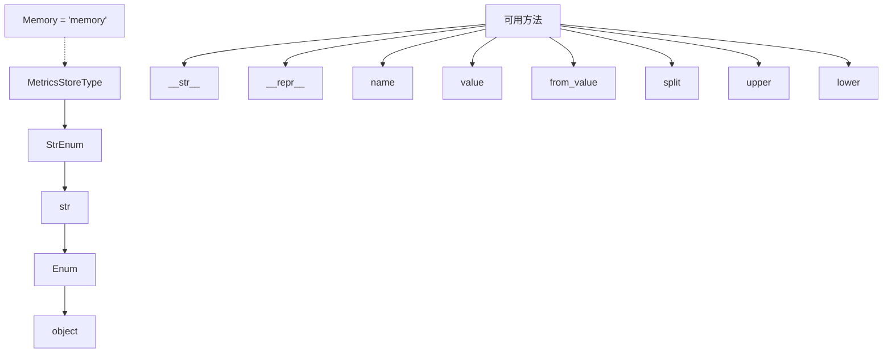
```mermaid
graph TD
    A[MetricsStoreType] --> B[StrEnum]
    B --> C[str]
    C --> D[Enum]
    D --> E[object]
    
    F[Memory = 'memory'] -.-> A
    
    G[可用方法] --> H[__str__]
    G --> I[__repr__]
    G --> J[name]
    G --> K[value]
    G --> L[from_value]
    G --> M[split]
    G --> N[upper]
    G --> O[lower]
```

#### 带注释源码

```python
class MetricsStoreType(StrEnum):
    """Enum for built-in MetricsStore types."""

    Memory = "memory"
```

---

### MetricsStoreType.Memory

获取枚举成员的名称。StrEnum 继承自 str 和 Enum，因此 Memory 既是枚举成员又是字符串对象。

参数：无

返回值：`str`，返回枚举成员的名称 "Memory"

#### 流程图

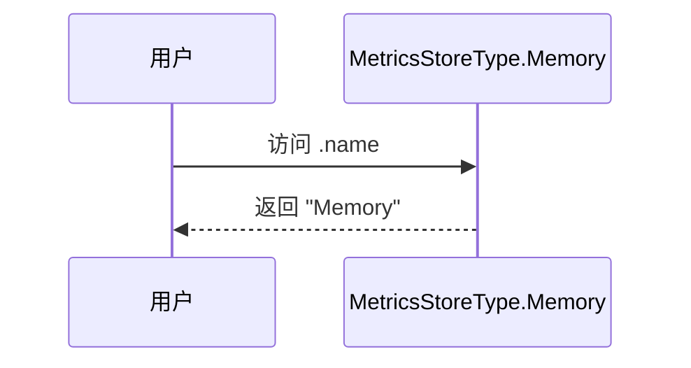
```mermaid
sequenceDiagram
    participant U as 用户
    participant E as MetricsStoreType.Memory
    
    U->>E: 访问 .name
    E-->>U: 返回 "Memory"
```

#### 带注释源码

```python
# Memory 是 StrEnum 成员，具有以下属性
MetricsStoreType.Memory.name  # -> "Memory"
```

---

### MetricsStoreType.value

获取枚举成员的值。StrEnum 的核心特性是 value 是字符串类型。

参数：无

返回值：`str`，返回枚举成员的值 "memory"

#### 流程图

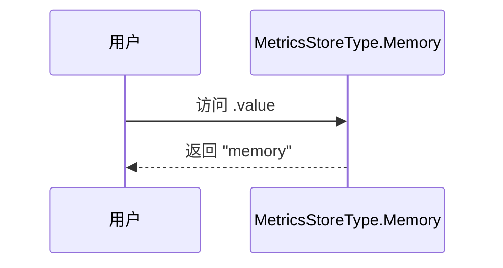
```mermaid
sequenceDiagram
    participant U as 用户
    participant E as MetricsStoreType.Memory
    
    U->>E: 访问 .value
    E-->>U: 返回 "memory"
```

#### 带注释源码

```python
# Memory 的值为字符串 "memory"
MetricsStoreType.Memory.value  # -> "memory"
```

---

### MetricsStoreType.from_value()

根据字符串值查找对应的枚举成员。继承自 Enum 类的类方法。

参数：

- `value`：`str`，要查找的字符串值

返回值：`MetricsStoreType`，返回匹配的枚举成员，如果未找到则抛出 ValueError

#### 流程图

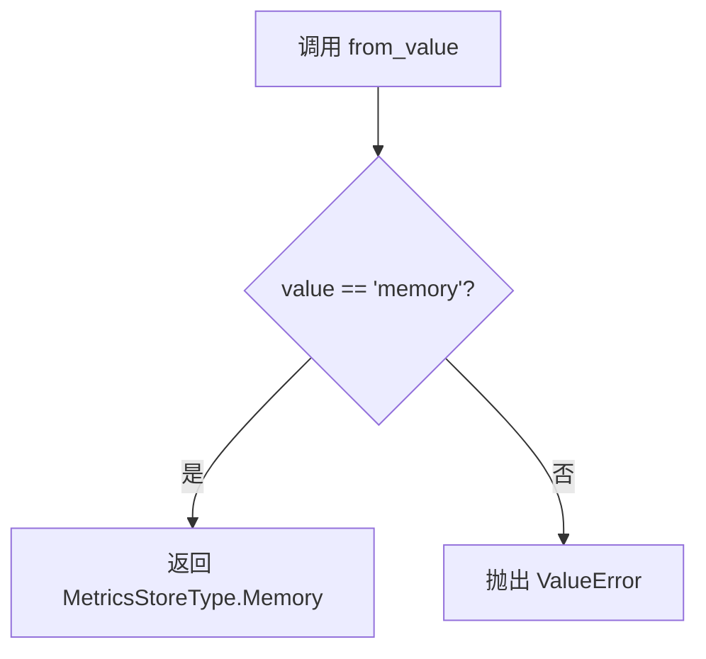
```mermaid
flowchart TD
    A[调用 from_value] --> B{value == 'memory'?}
    B -->|是| C[返回 MetricsStoreType.Memory]
    B -->|否| D[抛出 ValueError]
```

#### 带注释源码

```python
# 根据值查找枚举成员
MetricsStoreType.from_value("memory")  # -> MetricsStoreType.Memory

# 未找到时抛出异常
try:
    MetricsStoreType.from_value("invalid")
except ValueError as e:
    print(e)  # 'invalid' is not a valid MetricsStoreType
```

---

### MetricsStoreType.__str__()

返回枚举成员的字符串表示。由于 StrEnum 继承自 str，__str__ 返回值而非名称。

参数：无

返回值：`str`，返回枚举成员的值 "memory"

#### 流程图

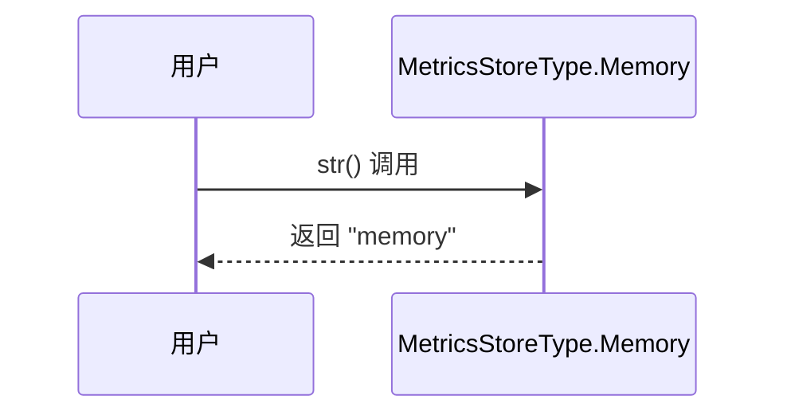
```mermaid
sequenceDiagram
    participant U as 用户
    participant E as MetricsStoreType.Memory
    
    U->>E: str() 调用
    E-->>U: 返回 "memory"
```

#### 带注释源码

```python
# __str__ 返回 value (str 特性)
str(MetricsStoreType.Memory)  # -> "memory"
print(MetricsStoreType.Memory)  # -> memory
```

---

### MetricsStoreType.__repr__()

返回枚举成员的完整表示。

参数：无

返回值：`str`，返回枚举成员的完整表示

#### 流程图

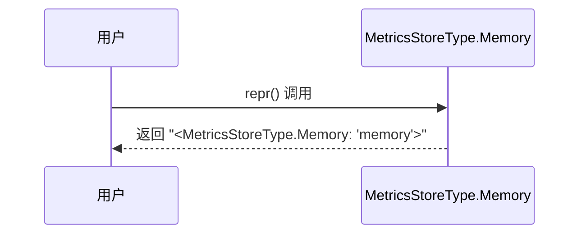
```mermaid
sequenceDiagram
    participant U as 用户
    participant E as MetricsStoreType.Memory
    
    U->>E: repr() 调用
    E-->>U: 返回 "<MetricsStoreType.Memory: 'memory'>"
```

#### 带注释源码

```python
# __repr__ 返回完整的枚举表示
repr(MetricsStoreType.Memory)  # -> "<MetricsStoreType.Memory: 'memory'>"
```

---

### MetricsStoreType.split()

字符串分割方法。继承自 str 类的所有方法都可用于 StrEnum 成员。

参数：

- `sep`：`str | None`，分隔符，默认为 None（按空白字符分割）
- `maxsplit`：`int`，最大分割次数，默认为 -1（不限）

返回值：`list[str]`，返回分割后的字符串列表

#### 流程图

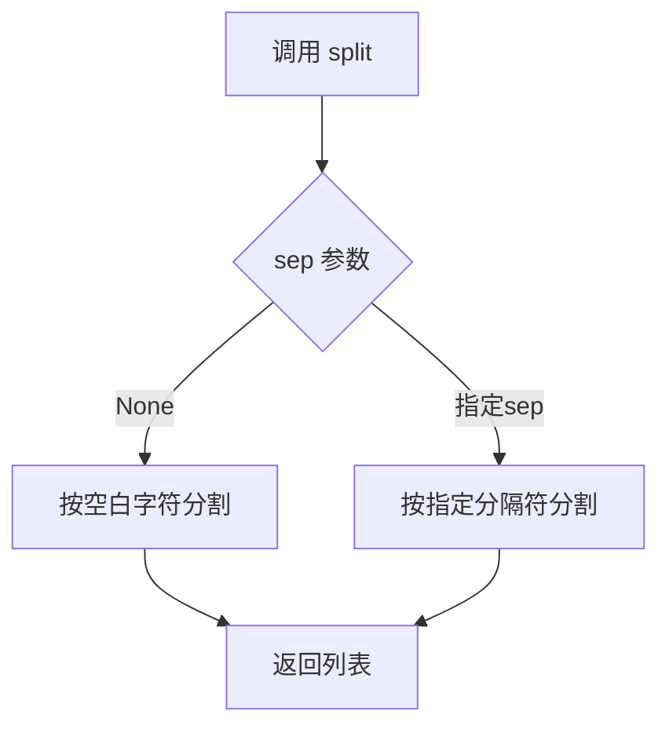
```mermaid
flowchart TD
    A[调用 split] --> B{sep 参数}
    B -->|None| C[按空白字符分割]
    B -->|指定sep| D[按指定分隔符分割]
    C --> E[返回列表]
    D --> E
```

#### 带注释源码

```python
# 字符串方法仍然可用
MetricsStoreType.Memory.split()  # -> ['memory']

# 模拟多值场景
# 假设有其他成员如 Memory = "memory"
# MetricsStoreType.Memory.split('m')  # -> ['', 'e', 'ory']
```

---

### MetricsStoreType.upper()

将字符串转换为大写。

参数：无

返回值：`str`，返回转换为大写的字符串

#### 流程图

```mermaid
sequenceDiagram
    participant U as 用户
    participant E as MetricsStoreType.Memory
    
    U->>E: .upper() 调用
    E-->>U: 返回 "MEMORY"
```

#### 带注释源码

```python
# 字符串方法可用
MetricsStoreType.Memory.upper()  # -> "MEMORY"
```

---

### MetricsStoreType.lower()

将字符串转换为小写。

参数：无

返回值：`str`，返回转换为小写的字符串

#### 流程图

```mermaid
sequenceDiagram
    participant U as 用户
    participant E as MetricsStoreType.Memory
    
    U->>E: .lower() 调用
    E-->>U: 返回 "memory"
```

#### 带注释源码

```python
# 字符串方法可用
MetricsStoreType.Memory.lower()  # -> "memory"
```

---

### MetricsStoreType.__eq__()

比较两个 StrEnum 成员是否相等。由于继承自 str，也可以与字符串直接比较。

参数：

- `other`：`Any`，要比较的对象

返回值：`bool`，返回比较结果

#### 流程图

```mermaid
flowchart TD
    A[调用 == 比较] --> B{比较对象类型}
    B -->|StrEnum| C[比较 name 和 value]
    B -->|str| D[只比较 value]
    C --> E[返回 bool]
    D --> E
```

#### 带注释源码

```python
# 可以与枚举成员比较
MetricsStoreType.Memory == MetricsStoreType.Memory  # -> True

# 可以与字符串值直接比较 (StrEnum 特性)
MetricsStoreType.Memory == "memory"  # -> True
MetricsStoreType.Memory == "Memory"  # -> False
```

---

### MetricsStoreType.__hash__()

使 StrEnum 成员可哈希，可用于字典键和集合。

参数：无

返回值：`int`，返回哈希值

#### 流程图

```mermaid
sequenceDiagram
    participant U as 用户
    participant E as MetricsStoreType.Memory
    
    U->>E: hash() 调用
    E-->>U: 返回哈希值
```

#### 带注释源码

```python
# 可用于字典和集合
my_dict = {MetricsStoreType.Memory: "some data"}
my_set = {MetricsStoreType.Memory}

hash(MetricsStoreType.Memory)  # -> 可用
```


### `RateLimitType`

这是 GraphRAG LLM 配置类型定义文件中的枚举类，用于表示内置的速率限制类型，目前只包含一种类型：滑动窗口（SlidingWindow）。

参数： 无

返回值： 无

#### 流程图

```mermaid
graph TD
    A[RateLimitType] --> B[继承自StrEnum]
    A --> C[继承自str]
    A --> D[继承自Enum]
    B --> E[__members__]
    B --> F[name属性]
    B --> G[value属性]
    C --> H[str方法集]
    D --> I[Enum方法集]
```

#### 带注释源码

```python
class RateLimitType(StrEnum):
    """Enum for built-in RateLimit types."""

    SlidingWindow = "sliding_window"
```

### `RateLimitType.name` (继承自 Enum)

枚举成员的名称。

参数： 无

返回值： `str`，返回枚举成员的名称，如 `"SlidingWindow"`

#### 流程图

```mermaid
flowchart LR
    A[调用name] --> B[返回枚举成员名称]
```

#### 带注释源码

```python
# 访问方式
RateLimitType.SlidingWindow.name  # 返回 "SlidingWindow"
```

### `RateLimitType.value` (继承自 StrEnum/str)

枚举成员的值，类型为字符串。

参数： 无

返回值： `str`，返回枚举成员的值，如 `"sliding_window"`

#### 流程图

```mermaid
flowchart LR
    A[调用value] --> B[返回枚举成员的值]
```

#### 带注释源码

```python
# 访问方式
RateLimitType.SlidingWindow.value  # 返回 "sliding_window"
```

### `RateLimitType.__members__` (继承自 Enum)

包含所有枚举成员的字典。

参数： 无

返回值： `dict`，返回枚举成员名称到成员的映射

#### 流程图

```mermaid
flowchart LR
    A[调用__members__] --> B[返回成员字典]
```

#### 带注释源码

```python
# 访问方式
RateLimitType.__members__  # 返回 {'SlidingWindow': <RateLimitType.SlidingWindow: 'sliding_window'>}
```

### `RateLimitType.from_value()` (继承自 StrEnum)

根据字符串值获取对应的枚举成员。

参数：

- `value`：`str`，要匹配的枚举值

返回值： `RateLimitType`，返回匹配到的枚举成员

#### 流程图

```mermaid
flowchart TD
    A[传入value字符串] --> B{是否匹配}
    B -->|匹配成功| C[返回对应枚举成员]
    B -->|匹配失败| D[抛出ValueError]
```

#### 带注释源码

```python
# 访问方式
RateLimitType.from_value("sliding_window")  # 返回 RateLimitType.SlidingWindow
```

### `str` 方法集 (继承自 StrEnum)

由于 RateLimitType 继承自 StrEnum（继承自 str），因此所有字符串方法都可用：

| 方法名 | 参数 | 返回值 | 描述 |
|--------|------|--------|------|
| `__str__` | 无 | `str` | 返回枚举成员的值字符串 |
| `capitalize()` | 无 | `str` | 返回首字母大写的字符串 |
| `lower()` | 无 | `str` | 返回小写字符串 |
| `upper()` | 无 | `str` | 返回大写字符串 |
| `split()` | `sep`/`maxsplit` | `list` | 分割字符串 |
| `replace()` | `old`/`new`/`count` | `str` | 替换字符串 |
| `startswith()` | `prefix` | `bool` | 检查是否以指定前缀开头 |
| `endswith()` | `suffix` | `bool` | 检查是否以指定后缀结尾 |

#### 带注释源码

```python
# 字符串方法示例
RateLimitType.SlidingWindow.value.upper()           # 返回 "SLIDING_WINDOW"
RateLimitType.SlidingWindow.value.startswith("slide")  # 返回 True
RateLimitType.SlidingWindow.value.replace("window", "rate")  # 返回 "sliding_rate"
```


### RetryType

RetryType 类是一个继承自 StrEnum 的枚举类，用于定义内置的重试类型。

参数： 无

返回值： 无

#### 流程图

```mermaid
graph TD
    A[开始] --> B{访问RetryType}
    B --> C[RetryType.ExponentialBackoff]
    B --> D[RetryType.Immediate]
    C --> E[返回枚举成员: 'exponential_backoff']
    D --> F[返回枚举成员: 'immediate']
```

#### 带注释源码

```python
class RetryType(StrEnum):
    """Enum for built-in Retry types."""

    ExponentialBackoff = "exponential_backoff"
    Immediate = "immediate"
```

### 枚举成员说明

由于 RetryType 继承自 StrEnum，其枚举成员（ExponentialBackoff 和 Immediate）具有以下特点：

- **name 属性**：返回枚举成员的名称
- **value 属性**：返回枚举成员的字符串值
- **__str__ 方法**：返回枚举成员的值字符串

#### ExponentialBackoff

```python
# 访问方式
RetryType.ExponentialBackoff  # 返回值: 'exponential_backoff'
```

#### Immediate

```python
# 访问方式
RetryType.Immediate  # 返回值: 'immediate'
```

### 继承自 StrEnum 的方法

RetryType 类继承自 StrEnum，因此具有以下可用方法：

- `__str__()`：返回枚举的字符串表示（值为字符串）
- `__repr__()`：返回枚举的官方字符串表示
- `name`：返回枚举成员的名称
- `value`：返回枚举成员的值
- `__eq__()`：用于比较枚举成员是否相等
- `__hash__()`：使枚举成员可哈希

### 使用示例

```python
# 字符串比较
if some_retry_type == RetryType.ExponentialBackoff:
    pass

# 获取值
retry_value = RetryType.Immediate.value  # 返回 'immediate'

# 获取名称
retry_name = RetryType.ExponentialBackoff.name  # 返回 'ExponentialBackoff'

# 迭代所有枚举值
for retry_type in RetryType:
    print(retry_type.value)
```


### `TemplateEngineType`

TemplateEngineType是继承自StrEnum的枚举类，用于定义内置的模板引擎类型，目前只支持Jinja模板引擎。

参数：

- 该类没有实例化方法，所有方法均为类方法或静态方法

返回值：枚举类方法

#### 流程图

```mermaid
flowchart TD
    A[TemplateEngineType] --> B[继承自StrEnum]
    A --> C[继承自Enum]
    B --> D[__str__: 返回字符串值]
    B --> E[__repr__: 返回字符串表示]
    C --> F[name: 获取成员名称]
    C --> G[value: 获取成员值]
    C --> H[__eq__: 比较相等]
    C --> I[__hash__: 可哈希]
    C --> J[__members__: 所有成员]
    C --> K[values: 所有值]
```

#### 带注释源码

```python
class TemplateEngineType(StrEnum):
    """Enum for built-in TemplateEngine types."""

    Jinja = "jinja"
    
    # 继承自StrEnum的方法：
    
    def __str__(self) -> str:
        """返回枚举成员的字符串值 (例如: 'jinja')"""
        return self.value
    
    def __repr__(self) -> str:
        """返回枚举的官方字符串表示"""
        return f'{self.__class__.__name__}.{self._name_}'
    
    # 继承自Enum的方法：
    
    @property
    def name(self) -> str:
        """获取枚举成员的名称 (例如: 'Jinja')"""
        return self._name_
    
    @property
    def value(self) -> str:
        """获取枚举成员的值 (例如: 'jinja')"""
        return self._value_
    
    def __eq__(self, other: object) -> bool:
        """比较枚举成员是否相等"""
        if isinstance(other, str):
            return self.value == other
        return super().__eq__(other)
    
    def __hash__(self) -> int:
        """使枚举成员可哈希，可用于字典和集合"""
        return hash(self.value)
    
    def __ge__(self, other: "TemplateEngineType") -> bool:
        """大于等于比较"""
        return self.value >= other.value
    
    def __gt__(self, other: "TemplateEngineType") -> bool:
        """大于比较"""
        return self.value > other.value
    
    def __le__(self, other: "TemplateEngineType") -> bool:
        """小于等于比较"""
        return self.value <= other.value
    
    def __lt__(self, other: "TemplateEngineType") -> bool:
        """小于比较"""
        return self.value < other.value
    
    @classmethod
    def values(cls) -> list[str]:
        """返回所有枚举成员值的列表"""
        return [member.value for member in cls]
    
    @classmethod
    def __members__(cls) -> dict[str, "TemplateEngineType"]:
        """返回所有枚举成员的字典映射"""
        return cls._member_map_
```


### `TemplateManagerType`

Enum for built-in TemplateEngine types，继承自 StrEnum，包含从 str 和 Enum 基类继承的所有方法。

参数：

- 无

返回值：N/A

#### 流程图

```mermaid
flowchart TD
    A[TemplateManagerType<br/>继承自 StrEnum] --> B[StrEnum 方法]
    A --> C[str 方法]
    A --> D[Enum 方法]
    
    B --> B1[name 属性]
    B --> B2[value 属性]
    B --> B3[__members__]
    
    C --> C1[lower/upper/capitalize]
    C --> C2[startswith/endswith]
    C --> C3[replace/split/strip]
    C --> C4[isalpha/isdigit/isalnum]
    C --> C5[...其他str方法]
    
    D --> D1[__iter__]
    D --> D2[__len__]
    D --> D3[__getitem__]
    D --> D4[__contains__]
```

#### 带注释源码

```python
class TemplateManagerType(StrEnum):
    """Enum for built-in TemplateEngine types."""
    
    File = "file"
    
    # 从 Enum 基类继承的方法：
    # - name: 返回枚举成员名称
    # - value: 返回枚举成员的值
    # - __members__: 返回所有成员的字典
    # - __iter__: 迭代所有成员
    # - __len__: 返回成员数量
    # - __getitem__: 通过名称或索引访问成员
    # - __contains__: 检查成员是否存在
    
    # 从 str 继承的方法（因为 StrEnum 继承自 str）：
    # - lower(), upper(), capitalize(), title()
    # - startswith(), endswith()
    # - replace(), split(), strip(), lstrip(), rstrip()
    # - isalpha(), isdigit(), isalnum(), islower(), isupper()
    # - find(), index(), count()
    # - join(), format()
    # 等等所有 str 方法
```

### `TemplateManagerType.name`

获取枚举成员的名称。

参数：

- 无

返回值：`str`，返回枚举成员的名称（如 "File"）

#### 流程图

```mermaid
flowchart TD
    A[开始] --> B[TemplateManagerType.File]
    B --> C[访问 name 属性]
    C --> D[返回 "File"]
```

#### 带注释源码

```python
# 获取成员名称
TemplateManagerType.File.name  # 返回 "File"
```

---

### `TemplateManagerType.value`

获取枚举成员的值（字符串）。

参数：

- 无

返回值：`str`，返回枚举成员的值（如 "file"）

#### 流程图

```mermaid
flowchart TD
    A[开始] --> B[TemplateManagerType.File]
    B --> C[访问 value 属性]
    C --> D[返回 "file"]
```

#### 带注释源码

```python
# 获取成员值
TemplateManagerType.File.value  # 返回 "file"
```

---

### `TemplateManagerType.__members__`

获取所有枚举成员的字典映射。

参数：

- 无

返回值：`dict[str, TemplateManagerType]`，返回包含所有成员名称到成员的映射字典

#### 流程图

```mermaid
flowchart TD
    A[开始] --> B[调用 __members__]
    B --> C{返回字典}
    C --> D["{'File': TemplateManagerType.File}"]
```

#### 带注释源码

```python
# 获取所有成员
TemplateManagerType.__members__  
# 返回: {'File': <TemplateManagerType.File: 'file'>}
```

---

### `TemplateManagerType.__iter__`

迭代所有枚举成员。

参数：

- 无

返回值：迭代器，返回所有 TemplateManagerType 成员

#### 流程图

```mermaid
flowchart TD
    A[开始] --> B[for member in TemplateManagerType]
    B --> C[yield TemplateManagerType.File]
```

#### 带注释源码

```python
# 迭代所有成员
for member in TemplateManagerType:
    print(member)  # 打印 TemplateManagerType.File
```

---

### `TemplateManagerType.__len__`

返回枚举成员的数量。

参数：

- 无

返回值：`int`，返回成员数量

#### 流程图

```mermaid
flowchart TD
    A[开始] --> B[len(TemplateManagerType)]
    B --> C[返回 1]
```

#### 带注释源码

```python
# 获取成员数量
len(TemplateManagerType)  # 返回 1
```

---

### `TemplateManagerType.__getitem__`

通过名称或索引访问枚举成员。

参数：

- `key`：`str | int`，成员名称或索引

返回值：`TemplateManagerType`，返回对应的枚举成员

#### 流程图

```mermaid
flowchart TD
    A[开始] --> B[TemplateManagerType["File"]]
    B --> C[返回 TemplateManagerType.File]
```

#### 带注释源码

```python
# 通过名称访问
TemplateManagerType["File"]  # 返回 TemplateManagerType.File

# 通过索引访问（由于 StrEnum 也支持字符串值访问）
TemplateManagerType["file"]  # 返回 TemplateManagerType.File
```

---

### `TemplateManagerType.__contains__`

检查名称或值是否存在于枚举中。

参数：

- `member`：`str`，成员名称或值

返回值：`bool`，返回是否存在

#### 流程图

```mermaid
flowchart TD
    A[开始] --> B["'File' in TemplateManagerType"]
    B --> C[返回 True]
```

#### 带注释源码

```python
# 检查成员是否存在
"File" in TemplateManagerType  # True
"file" in TemplateManagerType  # True
```

---

### `TemplateManagerType.lower()`

将成员值转换为小写字符串（继承自 str）。

参数：

- 无

返回值：`str`，返回小写字符串

#### 流程图

```mermaid
flowchart TD
    A[开始] --> B[TemplateManagerType.File.lower]
    B --> C[返回 "file"]
```

#### 带注释源码

```python
# 转为小写
TemplateManagerType.File.lower()  # 返回 "file"
```

---

### `TemplateManagerType.upper()`

将成员值转换为大写字符串（继承自 str）。

参数：

- 无

返回值：`str`，返回大写字符串

#### 流程图

```mermaid
flowchart TD
    A[开始] --> B[TemplateManagerType.File.upper]
    B --> C[返回 "FILE"]
```

#### 带注释源码

```python
# 转为大写
TemplateManagerType.File.upper()  # 返回 "FILE"
```

---

### `TemplateManagerType.startswith()`

检查成员值是否以指定前缀开头（继承自 str）。

参数：

- `prefix`：`str | tuple[str, ...]`，要检查的前缀
- `start`：`int`，可选，起始位置
- `end`：`int`，可选，结束位置

返回值：`bool`，返回是否以指定前缀开头

#### 流程图

```mermaid
flowchart TD
    A[开始] --> B[TemplateManagerType.File.startswith]
    B --> C[返回 True 或 False]
```

#### 带注释源码

```python
# 检查前缀
TemplateManagerType.File.startswith("fi")  # 返回 True
```

---

### `TemplateManagerType.endswith()`

检查成员值是否以指定后缀结尾（继承自 str）。

参数：

- `suffix`：`str | tuple[str, ...]`，要检查的后缀
- `start`：`int`，可选，起始位置
- `end`：`int`，可选，结束位置

返回值：`bool`，返回是否以指定后缀结尾

#### 流程图

```mermaid
flowchart TD
    A[开始] --> B[TemplateManagerType.File.endswith]
    B --> C[返回 True 或 False]
```

#### 带注释源码

```python
# 检查后缀
TemplateManagerType.File.endswith("le")  # 返回 True
```

---

### `TemplateManagerType.replace()`

替换成员值中的子字符串（继承自 str）。

参数：

- `old`：`str`，要替换的旧字符串
- `new`：`str`，替换后的新字符串
- `count`：`int`，可选，替换次数（-1 表示全部替换）

返回值：`str`，返回替换后的字符串

#### 流程图

```mermaid
flowchart TD
    A[开始] --> B[TemplateManagerType.File.replace]
    B --> C[返回新字符串]
```

#### 带注释源码

```python
# 字符串替换
TemplateManagerType.File.replace("file", "FILE")  # 返回 "FILE"
```

---

### `TemplateManagerType.split()`

拆分成员值为字符串列表（继承自 str）。

参数：

- `sep`：`str | None`，可选，分隔符（默认空格/空白字符）
- `maxsplit`：`int`，可选，最大拆分次数

返回值：`list[str]`，返回拆分后的字符串列表

#### 流程图

```mermaid
flowchart TD
    A[开始] --> B[TemplateManagerType.File.split]
    B --> C[返回列表]
```

#### 带注释源码

```python
# 字符串拆分
"file".split("i")  # 返回 ['f', 'le']
# TemplateManagerType.File 本质上也是字符串 "file"
```

---

### `TemplateManagerType.strip()`

移除成员值两端的首尾空白字符（继承自 str）。

参数：

- `chars`：`str | None`，可选，要移除的字符集

返回值：`str`，返回移除后的字符串

#### 流程图

```mermaid
flowchart TD
    A[开始] --> B[TemplateManagerType.File.strip]
    B --> C[返回字符串]
```

#### 带注释源码

```python
# 移除首尾空白
" file ".strip()  # 返回 "file"
```

---

### `TemplateManagerType.isalpha()`

检查成员值是否全部为字母（继承自 str）。

参数：

- 无

返回值：`bool`，返回是否全部为字母

#### 流程图

```mermaid
flowchart TD
    A[开始] --> B[TemplateManagerType.File.isalpha]
    B --> C[返回 True 或 False]
```

#### 带注释源码

```python
# 检查是否全为字母
TemplateManagerType.File.isalpha()  # 返回 True
```

---

### `TemplateManagerType.isdigit()`

检查成员值是否全部为数字（继承自 str）。

参数：

- 无

返回值：`bool`，返回是否全部为数字

#### 流程图

```mermaid
flowchart TD
    A[开始] --> B[TemplateManagerType.File.isdigit]
    B --> C[返回 True 或 False]
```

#### 带注释源码

```python
# 检查是否全为数字
TemplateManagerType.File.isdigit()  # 返回 False（因为 "file" 包含字母）
```

---

### `TemplateManagerType.isalnum()`

检查成员值是否全部为字母或数字（继承自 str）。

参数：

- 无

返回值：`bool`，返回是否全部为字母或数字

#### 流程图

```mermaid
flowchart TD
    A[开始] --> B[TemplateManagerType.File.isalnum]
    B --> C[返回 True 或 False]
```

#### 带注释源码

```python
# 检查是否全为字母或数字
TemplateManagerType.File.isalnum()  # 返回 True
```

---

### `TemplateManagerType.find()`

查找子字符串在成员值中的位置（继承自 str）。

参数：

- `sub`：`str`，要查找的子字符串
- `start`：`int`，可选，起始位置
- `end`：`int`，可选，结束位置

返回值：`int`，返回子字符串的索引，未找到返回 -1

#### 流程图

```mermaid
flowchart TD
    A[开始] --> B[TemplateManagerType.File.find]
    B --> C[返回索引或 -1]
```

#### 带注释源码

```python
# 查找子字符串位置
TemplateManagerType.File.find("i")  # 返回 1
TemplateManagerType.File.find("z")  # 返回 -1
```

---

### `TemplateManagerType.count()`

统计子字符串在成员值中出现的次数（继承自 str）。

参数：

- `sub`：`str`，要统计的子字符串
- `start`：`int`，可选，起始位置
- `end`：`int`，可选，结束位置

返回值：`int`，返回出现次数

#### 流程图

```mermaid
flowchart TD
    A[开始] --> B[TemplateManagerType.File.count]
    B --> C[返回次数]
```

#### 带注释源码

```python
# 统计出现次数
TemplateManagerType.File.count("i")  # 返回 1
```

---

### `TemplateManagerType.join()`

使用成员值作为分隔符连接字符串序列（继承自 str）。

参数：

- `iterable`：`Iterable[str]`，要连接的字符串可迭代对象

返回值：`str`，返回连接后的字符串

#### 流程图

```mermaid
flowchart TD
    A[开始] --> B[TemplateManagerType.File.join]
    B --> C[返回连接后的字符串]
```

#### 带注释源码

```python
# 连接字符串
TemplateManagerType.File.join(["a", "b", "c"])  # 返回 "afilebfilec"
```

---

### `TemplateManagerType.__str__()` / `TemplateManagerType.__repr__()`

返回枚举成员的字符串表示。

参数：

- 无

返回值：`str`，返回字符串表示

#### 流程图

```mermaid
flowchart TD
    A[开始] --> B[str TemplateManagerType.File]
    B --> C[返回 "file"]
```

#### 带注释源码

```python
# 字符串表示
str(TemplateManagerType.File)    # 返回 "file"
repr(TemplateManagerType.File)    # 返回 "<TemplateManagerType.File: 'file'>"
```


### TokenizerType

TokenizerType 是一个继承自 StrEnum 的枚举类，用于定义 GraphRAG LLM 配置中可用的分词器（Tokenizer）类型。该类定义了两种分词器类型：LiteLLM 和 Tiktoken，分别对应字符串值 "litellm" 和 "tiktoken"。作为 StrEnum 的子类，其成员同时具备枚举和字符串的特性，支持字符串操作并可用于类型安全的配置管理。

#### 流程图

```mermaid
flowchart TD
    A[TokenizerType 枚举类] --> B[StrEnum 基类]
    B --> C[Enum 元类]
    C --> D[str 类型]
    
    E[枚举成员] --> E1[LiteLLM = 'litellm']
    E --> E2[Tiktoken = 'tiktoken']
    
    E1 --> F[继承方法: name, value, __str__, __eq__ 等]
    E2 --> F
    
    F --> G[字符串方法: upper, lower, strip, split 等]
```

#### 带注释源码

```python
class TokenizerType(StrEnum):
    """Enum for tokenizer types."""

    LiteLLM = "litellm"    # LiteLLM 分词器类型
    Tiktoken = "tiktoken"  # Tiktoken 分词器类型
```

---

### 继承自 StrEnum/Enum 的方法

由于 TokenizerType 继承自 StrEnum，因此自动获得了以下方法和属性：

#### 1. name 属性

- **名称**：TokenizerType.name（实例属性）
- **参数**：无
- **返回值**：`str`，返回枚举成员的名称
- **描述**：获取枚举成员的名称

**带注释源码**：

```python
# 示例用法
tokenizer = TokenizerType.LiteLLM
print(tokenizer.name)  # 输出: "LiteLLM"
```

---

#### 2. value 属性

- **名称**：TokenizerType.value（实例属性）
- **参数**：无
- **返回值**：`str`，返回枚举成员的值
- **描述**：获取枚举成员对应的字符串值

**带注释源码**：

```python
# 示例用法
tokenizer = TokenizerType.Tiktoken
print(tokenizer.value)  # 输出: "tiktoken"
```

---

#### 3. __str__ 方法

- **名称**：TokenizerType.__str__
- **参数**：无
- **返回值**：`str`，返回枚举成员的字符串表示
- **描述**：返回枚举成员的字符串形式，等同于 value 属性

**带注释源码**：

```python
# 示例用法
tokenizer = TokenizerType.LiteLLM
print(str(tokenizer))  # 输出: "litellm"
print(tokenizer)       # 同样输出: "litellm"
```

---

#### 4. __eq__ 方法

- **名称**：TokenizerType.__eq__
- **参数**：
  - `other`：`Any`，比较对象
- **返回值**：`bool`，返回比较结果
- **描述**：支持与字符串或其他枚举成员的相等性比较

**带注释源码**：

```python
# 示例用法
tokenizer = TokenizerType.LiteLLM
print(tokenizer == "litellm")      # 输出: True
print(tokenizer == TokenizerType.Tiktoken)  # 输出: False
```

---

#### 5. __hash__ 方法

- **名称**：TokenizerType.__hash__
- **参数**：无
- **返回值**：`int`，返回哈希值
- **描述**：使枚举成员可用于字典键和集合

**带注释源码**：

```python
# 示例用法
tokenizer_dict = {TokenizerType.LiteLLM: "config1"}
print(tokenizer_dict[TokenizerType.LiteLLM])  # 输出: "config1"
```

---

#### 6. upper 方法（继承自 str）

- **名称**：TokenizerType.upper
- **参数**：无
- **返回值**：`str`，返回大写字符串
- **描述**：将枚举成员值转换为大写

**带注释源码**：

```python
# 示例用法
tokenizer = TokenizerType.Tiktoken
print(tokenizer.upper())  # 输出: "TIKTOKEN"
```

---

#### 7. lower 方法（继承自 str）

- **名称**：TokenizerType.lower
- **参数**：无
- **返回值**：`str`，返回小写字符串
- **描述**：将枚举成员值转换为小写

**带注释源码**：

```python
# 示例用法
tokenizer = TokenizerType.LiteLLM
print(tokenizer.lower())  # 输出: "litellm"
```

---

#### 8. startswith 方法（继承自 str）

- **名称**：TokenizerType.startswith
- **参数**：
  - `prefix`：`str` 或 `tuple[str, ...]`，前缀
  - `start`：`int`，可选，起始位置
  - `end`：`int`，可选，结束位置
- **返回值**：`bool`，返回是否以指定前缀开头
- **描述**：检查枚举成员值是否以指定字符串开头

**带注释源码**：

```python
# 示例用法
tokenizer = TokenizerType.LiteLLM
print(tokenizer.startswith("lite"))  # 输出: True
print(tokenizer.startswith("mock"))  # 输出: False
```

---

#### 9. endswith 方法（继承自 str）

- **名称**：TokenizerType.endswith
- **参数**：
  - `suffix`：`str` 或 `tuple[str, ...]`，后缀
  - `start`：`int`，可选，起始位置
  - `end`：`int`，可选，结束位置
- **返回值**：`bool`，返回是否以指定后缀结尾
- **描述**：检查枚举成员值是否以指定字符串结尾

**带注释源码**：

```python
# 示例用法
tokenizer = TokenizerType.Tiktoken
print(tokenizer.endswith("token"))  # 输出: True
print(tokenizer.endswith("llm"))    # 输出: False
```

---

#### 10. split 方法（继承自 str）

- **名称**：TokenizerType.split
- **参数**：
  - `sep`：`str`，可选，分隔符
  - `maxsplit`：`int`，可选，最大分割次数
- **返回值**：`list[str]`，返回分割后的字符串列表
- **描述**：按指定分隔符分割枚举成员值

**带注释源码**：

```python
# 示例用法
tokenizer = TokenizerType.LiteLLM
print(tokenizer.split("l"))  # 输出: ['', 'ite', 'l', 'lm']
```

---

#### 11. replace 方法（继承自 str）

- **名称**：TokenizerType.replace
- **参数**：
  - `old`：`str`，要替换的子串
  - `new`：`str`，替换后的子串
  - `count`：`int`，可选，替换次数
- **返回值**：`str`，返回替换后的字符串
- **描述**：替换枚举成员值中的指定子串

**带注释源码**：

```python
# 示例用法
tokenizer = TokenizerType.LiteLLM
print(tokenizer.replace("l", "L"))  # 输出: "LiteLLM"
```

---

#### 12. strip 方法（继承自 str）

- **名称**：TokenizerType.strip
- **参数**：
  - `chars`：`str`，可选，要移除的字符集
- **返回值**：`str`，返回去除首尾空白（或指定字符）后的字符串
- **描述**：去除枚举成员值首尾的空白字符或指定字符

**带注释源码**：

```python
# 示例用法 - 假设有一个带空格的值
tokenizer = TokenizerType.LiteLLM
print(tokenizer.strip())  # 输出: "litellm"
```

---

#### 13. __contains__ 方法（继承自 str）

- **名称**：TokenizerType.__contains__
- **参数**：
  - `sub`：`str`，子串
- **返回值**：`bool`，返回是否包含子串
- **描述**：检查枚举成员值是否包含指定子串

**带注释源码**：

```python
# 示例用法
tokenizer = TokenizerType.Tiktoken
print("token" in tokenizer)  # 输出: True
print("abc" in tokenizer)    # 输出: False
```

---

#### 14. __len__ 方法（继承自 str）

- **名称**：TokenizerType.__len__
- **参数**：无
- **返回值**：`int`，返回字符串长度
- **描述**：获取枚举成员值的长度

**带注释源码**：

```python
# 示例用法
tokenizer = TokenizerType.Tiktoken
print(len(tokenizer))  # 输出: 8
```

---

#### 15. __getitem__ 方法（继承自 str）

- **名称**：TokenizerType.__getitem__
- **参数**：
  - `i`：`int` 或 `slice`，索引或切片
- **返回值**：`str`，返回指定位置的字符或子串
- **描述**：通过索引或切片访问枚举成员值

**带注释源码**：

```python
# 示例用法
tokenizer = TokenizerType.LiteLLM
print(tokenizer[0])    # 输出: "l"
print(tokenizer[1:4])  # 输出: "ite"
```

---

#### 16. classmethod 方法（类方法）

##### 16.1 __members__ 属性

- **名称**：TokenizerType.__members__
- **参数**：无
- **返回值**：`mappingproxy`，返回所有枚举成员的映射
- **描述**：获取所有枚举成员的字典映射

**带注释源码**：

```python
# 示例用法
print(TokenizerType.__members__)
# 输出: mappingproxy({'LiteLLM': <TokenizerType.LiteLLM: 'litellm'>, 'Tiktoken': <TokenizerType.Tiktoken: 'tiktoken'>})
```

##### 16.2 __iter__ 方法

- **名称**：TokenizerType.__iter__
- **参数**：无
- **返回值**：返回枚举成员的迭代器
- **描述**：支持迭代遍历枚举成员

**带注释源码**：

```python
# 示例用法
for token_type in TokenizerType:
    print(token_type.name, token_type.value)
# 输出:
# LiteLLM litellm
# Tiktoken tiktoken
```

---

#### 17. 从 Enum 继承的类方法

##### 17.1 __new__ 方法

- **名称**：TokenizerType.__new__
- **参数**：
  - `cls`：类本身
  - `value`：`str`，枚举成员的值
- **返回值**：`TokenizerType`，返回枚举成员实例
- **描述**：在枚举类创建时调用，用于创建枚举成员

**带注释源码**（源码层面）：

```python
# StrEnum 的 __new__ 方法实现大致如下（简化版）
def __new__(cls, value):
    # 创建枚举成员并确保值是字符串类型
    member = str.__new__(cls, value)
    member._value_ = value
    return member
```

---

### 关键组件信息

| 组件名称 | 一句话描述 |
|---------|-----------|
| StrEnum | Python 3.11+ 的枚举基类，成员同时具备枚举和字符串特性 |
| TokenizerType.LiteLLM | LiteLLM 库提供的分词器类型枚举值 |
| TokenizerType.Tiktoken | OpenAI Tiktoken 库提供的分词器类型枚举值 |

---

### 潜在的技术债务或优化空间

1. **枚举成员扩展性**：当前仅支持两种分词器类型，如有新分词器需求，需手动添加枚举成员，可考虑使用动态注册机制。

2. **缺乏运行时验证**：枚举值在编译时确定，无法在运行时动态加载新的分词器类型，限制了插件化扩展能力。

3. **文档缺失**：缺少对分词器类型使用场景和配置要求的说明文档。

---

### 其它项目

#### 设计目标与约束

- **设计目标**：提供类型安全的分词器类型选择机制，避免硬编码字符串
- **约束**：依赖 Python 3.11+ 的 StrEnum 功能

#### 错误处理与异常设计

- 由于是简单枚举，不涉及复杂错误处理
- 不存在的枚举成员访问会抛出 `ValueError`

#### 数据流与状态机

- 该枚举类为静态配置类，不涉及数据流或状态机逻辑
- 主要用于 LLM 配置中的分词器类型选择

#### 外部依赖与接口契约

- 依赖 Python 标准库 `enum.StrEnum`（Python 3.11+）
- 作为配置类型被 GraphRAG LLM 模块引用


## 关键组件


### LLMProviderType

枚举类型，用于定义GraphRAG支持的LLM提供者类型，包括LiteLLM和MockLLM两种选项。

### AuthMethod

枚举类型，用于定义GraphRAG支持的认证方法，包括ApiKey和AzureManagedIdentity两种认证方式。

### MetricsProcessorType

枚举类型，用于定义内置的指标处理器类型，目前仅支持Default类型。

### MetricsWriterType

枚举类型，用于定义指标写入器的类型，支持Log和File两种写入方式。

### MetricsStoreType

枚举类型，用于定义指标存储的类型，目前仅支持Memory内存存储。

### RateLimitType

枚举类型，用于定义速率限制的类型，目前仅支持SlidingWindow滑动窗口方式。

### RetryType

枚举类型，用于定义重试策略的类型，支持ExponentialBackoff指数退避和Immediate立即重试两种方式。

### TemplateEngineType

枚举类型，用于定义模板引擎的类型，目前仅支持Jinja引擎。

### TemplateManagerType

枚举类型，用于定义模板管理器的类型，目前仅支持File文件管理方式。

### TokenizerType

枚举类型，用于定义分词器的类型，支持LiteLLM和Tiktoken两种分词器选项。


## 问题及建议


### 已知问题

-   **文档字符串错误**：TemplateManagerType类的文档字符串描述为"Enum for TemplateEngine types"，与类名TemplateManagerType不一致，应为"Enum for TemplateManager types"
-   **代码重复**：所有枚举类都遵循完全相同的结构（继承StrEnum并定义枚举成员），存在明显的代码重复，缺乏抽象和封装
-   **缺乏配置验证**：这些枚举类型作为配置使用时，没有提供运行时验证机制，无法确保配置值的有效性
-   **耦合度高**：LLMProviderType和TokenizerType都包含"LiteLLM"成员，表明两者之间存在隐式耦合，但这种关系未在代码中明确体现
-   **硬编码枚举值**：所有枚举成员的值都是硬编码的字符串，缺乏从外部配置源动态加载的能力
-   **缺少类型安全保证**：虽然使用了StrEnum，但未使用Fluent API或更严格的类型约束来防止无效的枚举组合

### 优化建议

-   修正TemplateManagerType的文档字符串，使其与类名保持一致
-   考虑使用枚举基类或混入类来减少代码重复，例如创建配置枚举基类
-   为关键配置类型添加验证方法或使用Pydantic等库进行配置校验
-   考虑将相关的枚举类型进行分组或使用枚举类作为命名空间组织，以降低耦合度
-   引入配置加载机制，支持从环境变量或配置文件动态读取枚举值
-   为相关的枚举类型添加关系映射或约束检查，例如LLMProviderType与TokenizerType的对应关系
-   考虑使用__slots__或 dataclass 配合枚举来提供更结构化的配置管理

## 其它


### 设计目标与约束

本模块的设计目标是定义GraphRAG系统中LLM配置的枚举类型集合，为系统提供类型安全的配置选项。约束条件包括：使用Python标准库enum模块确保兼容性，所有枚举类继承自StrEnum以支持字符串比较，所有枚举值均为不可变常量。

### 错误处理与异常设计

由于本模块仅包含枚举定义，不涉及运行时错误处理逻辑。枚举类型的错误将在导入或使用时触发Python内置的TypeError或ValueError。未来使用这些枚举的代码应处理InvalidEnumError等自定义异常。

### 外部依赖与接口契约

本模块仅依赖Python标准库enum模块，无外部依赖。接口契约包括：所有枚举类必须继承自StrEnum，所有枚举成员值为字符串类型，枚举名称采用PascalCase命名规范，枚举值采用snake_case命名规范。

### 性能考虑

本模块为纯枚举定义模块，无运行时性能开销。枚举类在模块导入时即被创建，内存占用极低。建议在使用处通过枚举类引用而非枚举值字符串进行配置，以提高类型安全性和IDE支持。

### 安全性考虑

本模块不涉及敏感数据处理或认证凭证存储。LLMProviderType和AuthMethod枚举仅定义配置选项的标识符，实际认证凭据应在其他模块中安全管理。枚举定义本身不包含任何安全敏感信息。

### 可扩展性设计

模块采用可扩展的枚举设计模式，新增配置类型只需定义新的枚举类并继承StrEnum。建议遵循现有命名规范（Type/Method/Writer/Store/Limit/Retry/Engine/Manager/Tokenizer后缀），并确保枚举值具有描述性。扩展时应考虑向后兼容性，避免修改或删除已发布的枚举成员。

### 版本兼容性

本模块设计为Python 3.11+版本兼容（StrEnum为Python 3.11新增特性）。对于更低版本Python，需要自定义StrEnum基类或使用Enum+str组合方式。GraphRAG项目应明确Python版本要求。

### 测试策略

由于模块仅包含枚举定义，测试重点应包括：枚举成员数量验证、枚举值类型验证（str）、枚举名称唯一性验证、枚举值字符串格式验证。建议使用pytest框架编写静态测试用例。

### 配置管理

所有枚举值均为静态常量，定义在代码中而非配置文件。这种设计确保了类型安全性和IDE支持。配置值变更需要代码更新和版本发布。建议在项目文档中维护枚举值变更日志。

### 代码规范与约定

代码遵循PEP 8命名规范，枚举类使用PascalCase，枚举成员名称也使用PascalCase（继承自StrEnum特性，枚举值自动转为字符串）。文档字符串使用Google风格，所有类包含简明的功能描述。模块级文档说明了版权和许可信息。

### 依赖管理

本模块无第三方依赖，仅使用Python标准库。这确保了模块的可移植性和轻量级特性。项目中如需使用这些枚举类型，应确保Python版本支持StrEnum。

### 许可与合规

模块头部包含Microsoft Corporation版权声明和MIT License许可声明。所有使用、修改和分发行为均需遵守MIT License条款。

### 数据字典

| 枚举类 | 枚举成员数 | 用途描述 |
|--------|------------|----------|
| LLMProviderType | 2 | LLM提供者类型 |
| AuthMethod | 2 | 认证方法 |
| MetricsProcessorType | 1 | 指标处理器类型 |
| MetricsWriterType | 2 | 指标写入器类型 |
| MetricsStoreType | 1 | 指标存储类型 |
| RateLimitType | 1 | 速率限制类型 |
| RetryType | 2 | 重试策略类型 |
| TemplateEngineType | 1 | 模板引擎类型 |
| TemplateManagerType | 1 | 模板管理器类型 |
| TokenizerType | 2 | 分词器类型 |


    