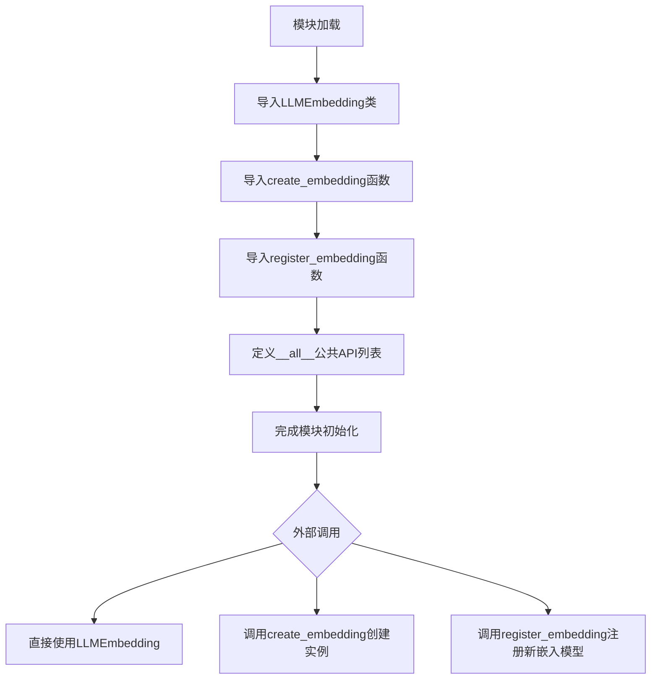
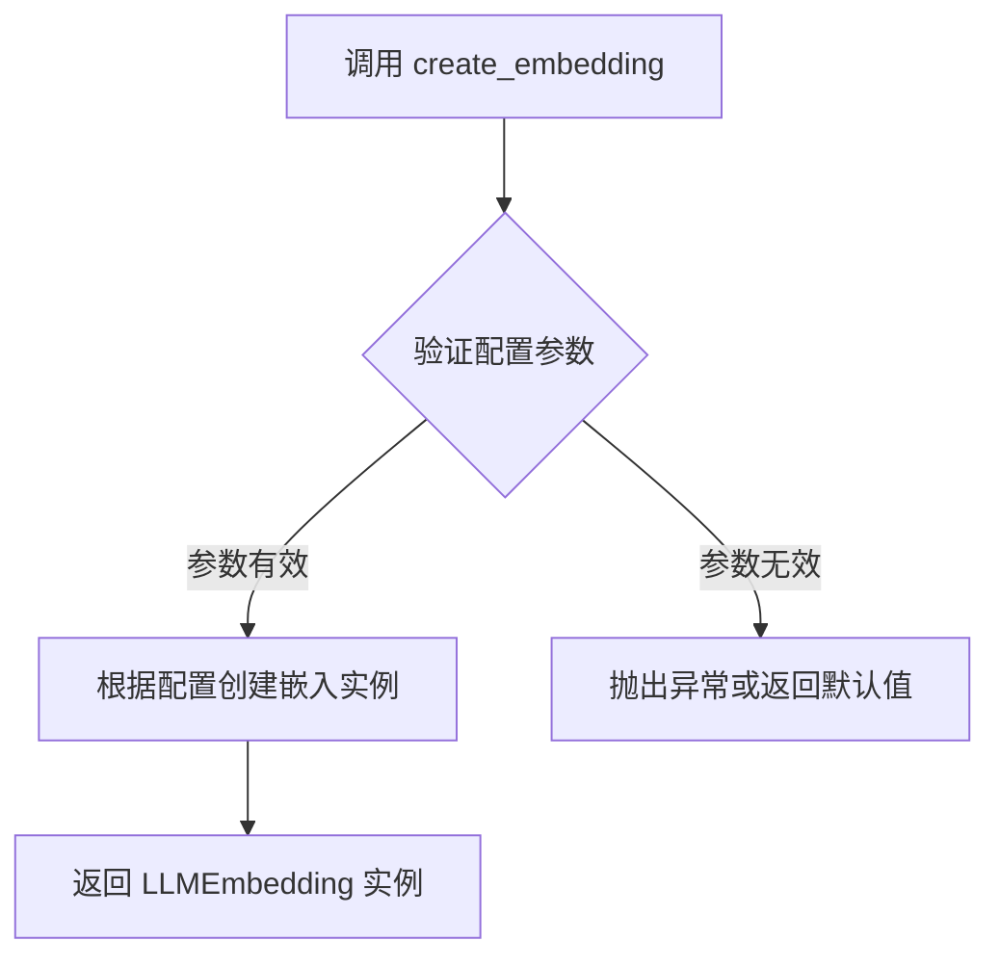
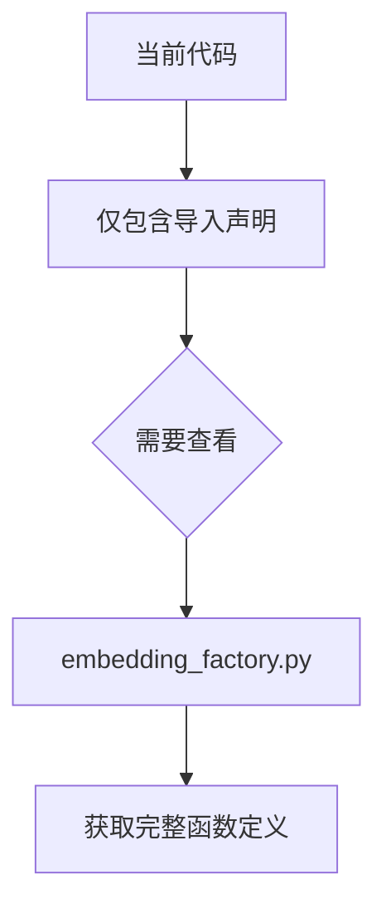

# `graphrag\packages\graphrag-llm\graphrag_llm\embedding\__init__.py` 详细设计文档

该模块是graphrag_llm的嵌入层入口文件，通过统一接口导出LLMEmbedding类、create_embedding和register_embedding函数，为上层应用提供文本向量化和嵌入模型注册的能力。

## 整体流程



## 类结构

```
graphrag_llm.embedding (包)
├── __init__.py (当前文件 - 模块入口)
├── embedding.py (LLMEmbedding类定义)
└── embedding_factory.py (create_embedding和register_embedding函数)
```

## 全局变量及字段


    

## 全局函数及方法


### `create_embedding`

创建嵌入对象的工厂函数，用于根据配置实例化相应的嵌入模型。

参数：

- 由于源代码仅为导入声明，具体参数需参考 `embedding_factory` 模块实现。根据函数命名约定和用途推断，可能包含：
  - `config`：`EmbeddingConfig` 或字典类型，嵌入模型配置参数
  - 其他可能的参数：模型名称、API密钥、端点等

返回值：`LLMEmbedding`，返回配置好的嵌入模型实例

#### 流程图



#### 带注释源码

```python
# 从 embedding_factory 模块导入 create_embedding 函数
# 该函数为工厂方法，用于创建 LLMEmbedding 实例
from graphrag_llm.embedding.embedding_factory import (
    create_embedding,  # 工厂函数：创建嵌入对象
    register_embedding,  # 注册函数：注册自定义嵌入实现
)
```

---

**注意**：提供的代码为 `__init__.py` 导入文件，`create_embedding` 的具体实现位于 `graphrag_llm.embedding.embedding_factory` 模块中。上述参数和返回值信息基于函数命名约定和模块用途进行推断，详细实现需查看 `embedding_factory.py` 源文件。


# register_embedding 函数分析

根据提供的代码，我需要说明一个重要限制：

## 重要说明

提供的代码文件是一个 **模块导入文件**（可能是 `__init__.py`），它仅包含对 `register_embedding` 函数的**导入声明**，并没有包含该函数的具体实现。

```python
from graphrag_llm.embedding.embedding_factory import (
    create_embedding,
    register_embedding,
)
```

要获取 `register_embedding` 函数的完整信息（参数、返回值、流程图、源码），需要查看 `graphrag_llm/embedding/embedding_factory.py` 文件中该函数的**实际定义**。

---

## 当前可提取的信息

### `register_embedding`

这是从 `graphrag_llm.embedding.embedding_factory` 模块导入的函数，用于注册嵌入模型。

#### 可获取的信息

- **名称**：`register_embedding`
- **来源模块**：`graphrag_llm.embedding.embedding_factory`
- **描述**：根据函数命名惯例，该函数用于将嵌入模型注册到工厂系统中，以便后续通过 `create_embedding` 函数创建实例。
- **参数**：无法从当前代码中确定（需要查看 `embedding_factory.py`）
- **返回值**：无法从当前代码中确定（需要查看 `embedding_factory.py`）

#### 流程图



#### 带注释源码

```python
# 从 embedding_factory 模块导入 register_embedding 函数
# 该函数的具体实现位于 graphrag_llm/embedding/embedding_factory.py
from graphrag_llm.embedding.embedding_factory import (
    create_embedding,
    register_embedding,
)
```

---

## 建议

请提供 `graphrag_llm/embedding/embedding_factory.py` 文件的内容，以便提取 `register_embedding` 函数的完整信息，包括：
- 完整的参数列表及其类型和描述
- 返回值类型和描述
- 详细的函数实现源码
- 准确的流程图

## 关键组件


### LLMEmbedding

嵌入模型的核心类，负责将文本转换为向量表示，支持多种嵌入模型的加载与推理。

### create_embedding

嵌入工厂函数，用于根据配置创建相应的嵌入模型实例，支持灵活的嵌入模型选择与初始化。

### register_embedding

嵌入注册函数，用于将自定义嵌入模型注册到工厂系统中，支持扩展默认支持的嵌入模型类型。


## 问题及建议


### 已知问题

- 缺少模块级文档字符串，未说明该模块的职责和使用场景
- 未定义模块版本信息，不利于依赖管理和版本追踪
- `__all__` 列表中仅包含3个公共符号，导出接口较为单薄，缺乏扩展性考虑
- 未提供类型注解，调用方无法获得静态类型检查支持
- 作为公共 API 入口，未包含弃用声明机制，未来重构时可能导致破坏性变更

### 优化建议

- 添加模块级 docstring，说明 LLMEmbedding 模块在 graphrag_llm 中的定位和核心用途
- 引入 `__version__` 变量，使用版本约定（如 Semantic Versioning）管理模块演进
- 考虑在 `__all__` 中增加类型提示文件的导出（如 `LLMEmbedding` 的 `Protocol` 或类型定义），增强类型安全
- 增加 `__deprecated__` 标记或弃用警告机制，当后续需要废弃某些 API 时可平滑过渡
- 添加模块级别的配置或工厂方法，提供更灵活的 embedding 初始化能力

## 其它


### 设计目标与约束

该模块作为graphrag_llm包的embedding子包的公共接口层，主要目标是提供统一的嵌入功能导出接口，简化外部调用方的导入操作。设计约束包括：仅暴露稳定的公共API（LLMEmbedding、create_embedding、register_embedding），隐藏内部实现细节，遵循Python包的__init__.py最佳实践。

### 外部依赖与接口契约

该模块依赖graphrag_llm.embedding包内的两个模块：embedding.py（提供LLMEmbedding类）和embedding_factory.py（提供create_embedding和register_embedding函数）。接口契约要求：LLMEmbedding类需实现embedding相关的核心方法；create_embedding函数接受嵌入配置参数并返回LLMEmbedding实例；register_embedding函数用于注册自定义嵌入实现。

### 错误处理与异常设计

由于该模块仅为导入导出层，自身不包含业务逻辑，错误处理主要依赖于底层模块。潜在异常包括：导入模块不存在时的ImportError、底层类或函数接口变更导致的接口不兼容。建议在文档中注明依赖模块的版本兼容性要求。

### 模块化与扩展性

该模块采用工厂模式设计，支持通过register_embedding函数注册自定义嵌入实现，便于扩展不同的嵌入模型。LLMEmbedding类作为基类或标准实现，提供了良好的继承扩展能力。

### 配置管理

该模块本身不直接管理配置，配置通过create_embedding函数的参数传递给底层嵌入实现。建议在文档中说明配置参数的来源和格式要求。

### 版本兼容性

应明确标注该模块所需的graphrag_llm内部模块版本兼容性，以及Python版本要求。建议遵循语义化版本控制（SemVer）原则。

    