# `graphrag\packages\graphrag-llm\graphrag_llm\embedding\embedding.py` 详细设计文档

这是一个用于语言模型嵌入的抽象基类，定义了同步/异步嵌入、线程池批处理、缓存、重试、限流和指标收集的接口规范。

## 整体流程

```mermaid
graph TD
A[开始] --> B[创建LLMEmbedding实例]
B --> C{调用方式}
C --> D[同步调用 embedding()]
C --> E[异步调用 embedding_async()]
C --> F[批处理调用 embedding_batch()]
D --> G[调用 embedding_thread_pool]
E --> H[直接异步处理]
F --> I[创建线程池]
I --> J[遍历请求列表]
J --> K[提交任务到线程池]
K --> L[执行 handle_response]
L --> M[收集结果]
M --> N[返回结果列表]
```

## 类结构

```
LLMEmbedding (ABC 抽象基类)
```

## 全局变量及字段


### `LLMEmbedding.model_id`
    
模型标识符，如 'openai/gpt-4o'

类型：`str`
    


### `LLMEmbedding.model_config`
    
语言模型的配置对象

类型：`ModelConfig`
    


### `LLMEmbedding.tokenizer`
    
用于文本分词的分词器

类型：`Tokenizer`
    


### `LLMEmbedding.metrics_store`
    
存储指标数据的指标存储

类型：`MetricsStore`
    


### `LLMEmbedding.metrics_processor`
    
可选的指标处理器，用于处理指标数据

类型：`MetricsProcessor | None`
    


### `LLMEmbedding.rate_limiter`
    
可选的速率限制器，控制请求频率

类型：`RateLimiter | None`
    


### `LLMEmbedding.retrier`
    
可选的重试策略，处理失败请求

类型：`Retry | None`
    


### `LLMEmbedding.cache`
    
可选的嵌入缓存，存储历史嵌入结果

类型：`Cache | None`
    


### `LLMEmbedding.cache_key_creator`
    
缓存键创建函数，用于生成缓存键

类型：`CacheKeyCreator`
    


### `LLMEmbedding.kwargs`
    
额外的关键字参数

类型：`dict[str, Any]`
    


### `LLMEmbedding.embedding_requests`
    
待处理的嵌入请求列表

类型：`list[LLMEmbeddingArgs]`
    


### `LLMEmbedding.concurrency`
    
线程池并发线程数量

类型：`int`
    


### `LLMEmbedding.queue_limit`
    
输入队列最大限制，0表示无限制

类型：`int`
    


### `LLMEmbedding.response_handler`
    
处理嵌入响应的回调函数

类型：`ThreadedLLMEmbeddingResponseHandler`
    


### `LLMEmbedding.results`
    
存储嵌入请求结果的列表

类型：`list[LLMEmbeddingResponse | Exception]`
    
    

## 全局函数及方法


### `LLMEmbedding.__init__`

这是 `LLMEmbedding` 抽象基类的初始化方法，用于配置语言模型嵌入所需的各种组件和服务。该方法接受多个可选和必需的参数来设置模型、缓存、重试策略、指标收集等功能模块。

参数：

- `model_id`：`str`，模型标识符，例如 "openai/gpt-4o"
- `model_config`：`ModelConfig`，语言模型的配置对象
- `tokenizer`：`Tokenizer`，用于处理文本的分词器
- `metrics_store`：`MetricsStore`，指标存储实例，用于记录嵌入操作的度量数据
- `metrics_processor`：`MetricsProcessor | None`，可选的指标处理器，默认值为 None
- `rate_limiter`：`RateLimiter | None`，可选的速率限制器，用于控制请求频率，默认值为 None
- `retrier`：`Retry | None`，可选的重试策略，用于处理失败的请求，默认值为 None
- `cache`：`Cache | None`，可选的嵌入缓存，用于存储和复用已有的嵌入结果，默认值为 None
- `cache_key_creator`：`CacheKeyCreator`，缓存键创建函数，用于生成缓存的唯一标识键
- `**kwargs`：`Any`，额外的关键字参数，用于扩展或传递其他配置

返回值：无（`None`），该方法为抽象方法，实际实现由子类完成，当前抛出 `NotImplementedError`

#### 流程图

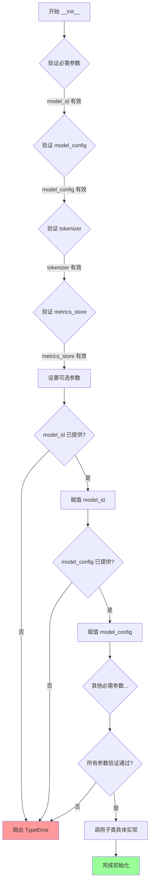

#### 带注释源码

```python
@abstractmethod
def __init__(
    self,
    *,
    model_id: str,
    model_config: "ModelConfig",
    tokenizer: "Tokenizer",
    metrics_store: "MetricsStore",
    metrics_processor: "MetricsProcessor | None" = None,
    rate_limiter: "RateLimiter | None" = None,
    retrier: "Retry | None" = None,
    cache: "Cache | None" = None,
    cache_key_creator: "CacheKeyCreator",
    **kwargs: Any,
):
    """Initialize the LLMEmbedding.

    Args
    ----
        model_id: str
            The model ID, e.g., "openai/gpt-4o".
        model_config: ModelConfig
            The configuration for the language model.
        tokenizer: Tokenizer
            The tokenizer to use.
        metrics_store: MetricsStore | None (default=None)
            The metrics store to use.
        metrics_processor: MetricsProcessor | None (default: None)
            The metrics processor to use.
        rate_limiter: RateLimiter | None (default=None)
            The rate limiter to use.
        retrier: Retry | None (default=None)
            The retry strategy to use.
        cache: Cache | None (default=None)
            Optional cache for embeddings.
        cache_key_creator: CacheKeyCreator | None (default=None)
            Optional cache key creator function.
            (dict[str, Any]) -> str
        **kwargs: Any
            Additional keyword arguments.
    """
    raise NotImplementedError
```


### `LLMEmbedding.embedding`

同步嵌入方法，用于将输入文本转换为向量表示。

参数：

- `**kwargs`：`Unpack["LLMEmbeddingArgs"]`，接受 LLMEmbeddingArgs 类型解包后的关键字参数

返回值：`LLMEmbeddingResponse`，嵌入操作的结果，包含向量数据或嵌入相关的响应信息

#### 流程图

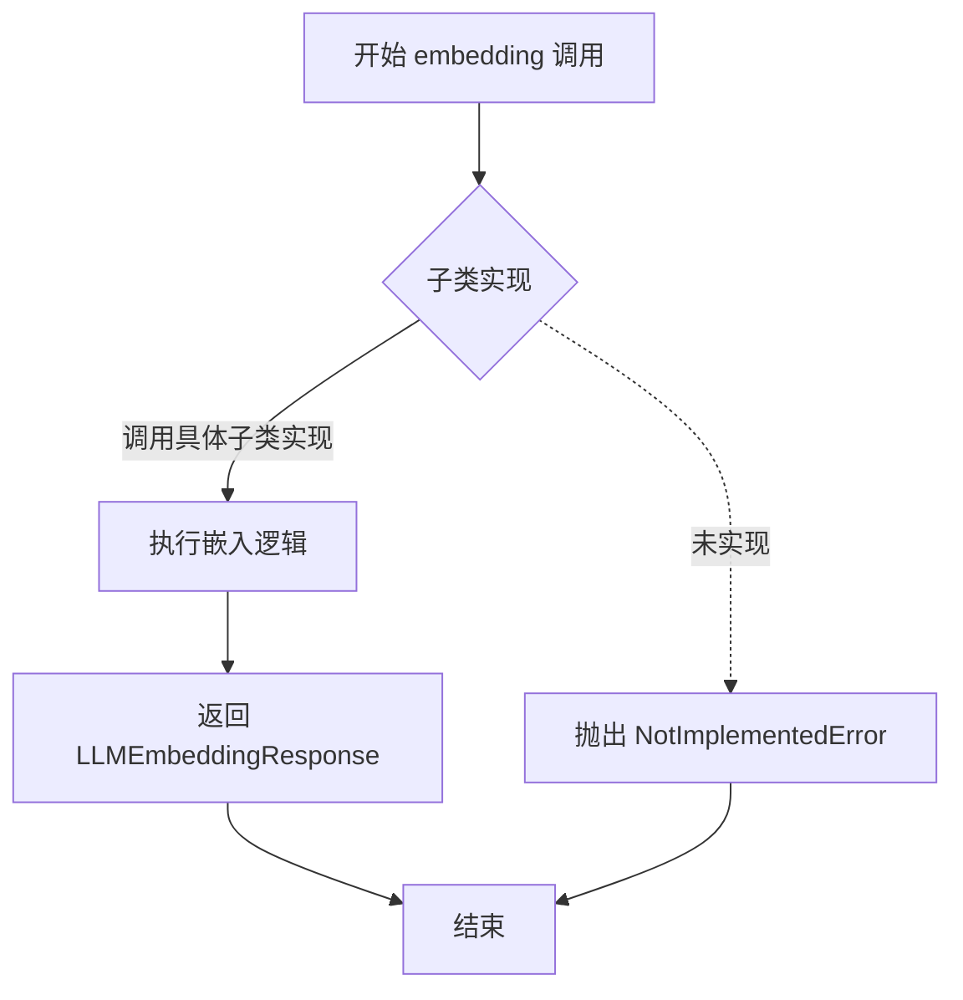

#### 带注释源码

```python
@abstractmethod
def embedding(
    self, /, **kwargs: Unpack["LLMEmbeddingArgs"]
) -> "LLMEmbeddingResponse":
    """Sync embedding method."""
    raise NotImplementedError
```

**源码说明：**
- `self` 后的 `/` 表示此方法只接受位置参数（不允许使用关键字参数传递 self 之后的参数）
- `**kwargs: Unpack["LLMEmbeddingArgs"]` 表示接受任意关键字参数，参数类型由 LLMEmbeddingArgs 类型定义
- `@abstractmethod` 装饰器表明这是一个抽象方法，必须由子类实现
- 该方法为同步调用入口，对应异步版本 `embedding_async`
- 实际实现逻辑由子类提供，当前基类仅定义接口契约


### `LLMEmbedding.embedding_async`

异步嵌入方法的核心接口，定义了在具体实现中执行向量嵌入的异步操作规范。该方法接受灵活的嵌入参数，通过解包 `LLMEmbeddingArgs` 类型，支持不同来源和配置的模型调用，并返回对应的嵌入响应结果。

参数：

- `self`：隐式的 `LLMEmbedding` 实例，当前抽象类的实例对象
- `**kwargs`：`Unpack["LLMEmbeddingArgs"]`，解包后的嵌入请求参数，包含输入文本、模型配置等，具体参数由 `LLMEmbeddingArgs` 类型定义

返回值：`LLMEmbeddingResponse`，异步嵌入操作的结果对象，包含嵌入向量、模型元数据等信息

#### 流程图

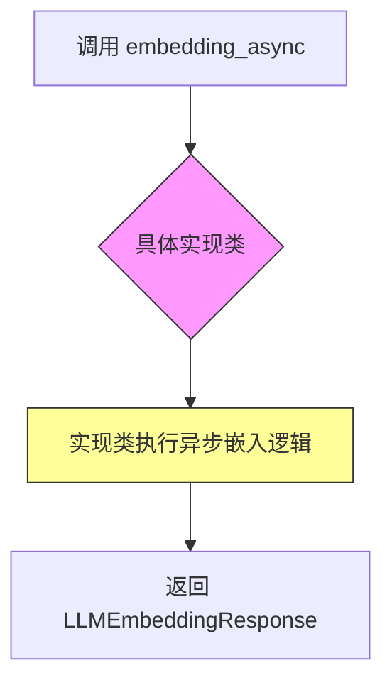

#### 带注释源码

```python
@abstractmethod
async def embedding_async(
    self, /, **kwargs: Unpack["LLMEmbeddingArgs"]
) -> "LLMEmbeddingResponse":
    """Async embedding method.
    
    这是一个抽象方法，具体的嵌入实现由继承类提供。
    方法采用位置参数限制（/），确保只接受关键字参数 **kwargs。
    
    Args:
        **kwargs: Unpack[LLMEmbeddingArgs]
            解包的嵌入参数，包含:
            - input: 输入文本或文本列表
            - 其他模型特定参数
            
    Returns:
        LLMEmbeddingResponse: 嵌入结果，包含:
            - embeddings: 嵌入向量列表
            - model: 使用的模型标识
            - usage: token 使用情况
            
    Raises:
        NotImplementedError: 在抽象基类中调用时抛出
        具体实现类需重写此方法以提供实际功能
    """
    raise NotImplementedError
```


### `LLMEmbedding.embedding_thread_pool`

运行一个嵌入任务的线程池上下文管理器，用于并发处理多个嵌入请求。

参数：

- `response_handler`：`ThreadedLLMEmbeddingResponseHandler`，处理嵌入响应的回调函数，签名为 `(request_id, response|exception) -> Awaitable[None] | None`
- `concurrency`：`int`，线程池中要启动的线程数量
- `queue_limit`：`int`（默认值=0），输入队列中允许的最大项目数，0 表示无限制，用于为调用者创建背压

返回值：`Iterator[ThreadedLLMEmbeddingFunction]`，一个可用于向线程池提交嵌入请求的函数，签名为 `(input, request_id, **kwargs) -> None`

#### 流程图

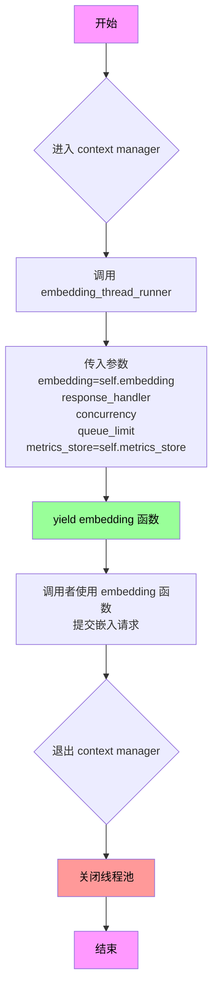

#### 带注释源码

```python
@contextmanager
def embedding_thread_pool(
    self,
    *,
    response_handler: "ThreadedLLMEmbeddingResponseHandler",
    concurrency: int,
    queue_limit: int = 0,
) -> "Iterator[ThreadedLLMEmbeddingFunction]":
    """Run an embedding thread pool.

    Args
    ----
        response_handler: ThreadedLLMEmbeddingResponseHandler
            The callback function to handle embedding responses.
            (request_id, response|exception) -> Awaitable[None] | None
        concurrency: int
            The number of threads to spin up in a thread pool.
        queue_limit: int (default=0)
            The maximum number of items allowed in the input queue.
            0 means unlimited.
            Set this to a value to create backpressure on the caller.

    Yields
    ------
        ThreadedLLMEmbeddingFunction:
            A function that can be used to submit embedding requests to the thread pool.
            (input, request_id, **kwargs) -> None

            The thread pool will process the requests and invoke the provided callback
            with the responses.

            same signature as LLMEmbeddingFunction but requires a `request_id` parameter
            to identify the request and does not return anything.

    """
    # 上下文管理器入口，调用 embedding_thread_runner 创建线程池
    # 传入当前 embedding 方法、响应处理器、并发数、队列限制和指标存储
    with embedding_thread_runner(
        embedding=self.embedding,                      # 同步 embedding 方法
        response_handler=response_handler,             # 响应回调函数
        concurrency=concurrency,                       # 并发线程数
        queue_limit=queue_limit,                       # 队列限制
        metrics_store=self.metrics_store,              # 指标存储
    ) as embedding:
        # 将线程池的 embedding 函数 yield 给调用者使用
        yield embedding
    # 上下文管理器退出时自动关闭线程池
```


### `LLMEmbedding.embedding_batch`

使用线程池并发处理批量嵌入请求的核心方法，通过 `embedding_thread_pool` 上下文管理器创建线程池，将多个嵌入请求分配到线程中并行处理，并收集每个请求的响应或异常结果。

参数：

-  `self`：隐式参数，`LLMEmbedding` 实例本身
-  `embedding_requests`：`list["LLMEmbeddingArgs"]`，要并行处理的嵌入请求参数列表
-  `concurrency`：`int`，线程池中要启动的线程数
-  `queue_limit`：`int`（默认值=0），输入队列中允许的最大项目数，0 表示无限制

返回值：`list["LLMEmbeddingResponse | Exception"]`，每个输入的嵌入响应或异常列表

#### 流程图

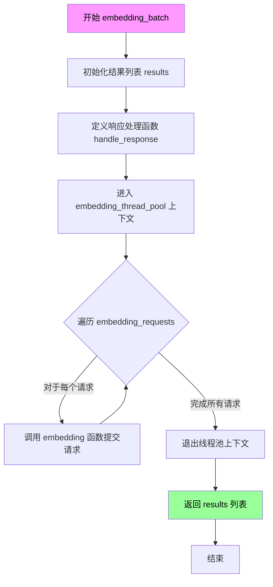

#### 带注释源码

```python
def embedding_batch(
    self,
    embedding_requests: list["LLMEmbeddingArgs"],
    *,
    concurrency: int,
    queue_limit: int = 0,
) -> list["LLMEmbeddingResponse | Exception"]:
    """Process a batch of embedding requests using a thread pool.

    Args
    ----
        embedding_requests: list[LLMEmbeddingArgs]
            A list of embedding request arguments to process in parallel.
        batch_size: int
            The number of inputs to process in each batch.
        concurrency: int
            The number of threads to spin up in a thread pool.
        queue_limit: int (default=0)
            The maximum number of items allowed in the input queue.
            0 means unlimited.
            Set this to a value to create backpressure on the caller.

    Returns
    -------
        list[LLMEmbeddingResponse | Exception]
            A list of embedding responses or exceptions for each input.
    """
    # 初始化结果列表，预填充 None 以保持索引与请求对应
    # 结果列表的长度与输入请求列表相同
    results: list[LLMEmbeddingResponse | Exception] = [None] * len(
        embedding_requests
    )  # type: ignore

    # 定义响应处理函数，用于在线程池处理完每个请求后存储结果
    # request_id 被用作索引，以保持结果与请求的顺序对应
    def handle_response(
        request_id: str,
        response: "LLMEmbeddingResponse | Exception",
    ) -> None:
        # 将 request_id 转换为整数索引
        index = int(request_id)
        # 在结果列表的对应位置存储响应或异常
        results[index] = response

    # 使用 embedding_thread_pool 上下文管理器创建线程池
    # 线程池会并发执行嵌入请求，并使用 handle_response 回调存储结果
    with self.embedding_thread_pool(
        response_handler=handle_response,
        concurrency=concurrency,
        queue_limit=queue_limit,
    ) as embedding:
        # 遍历所有嵌入请求
        for idx, embedding_request in enumerate(embedding_requests):
            # 将每个请求提交到线程池
            # 使用 idx 作为 request_id，以便在结果中保持顺序
            embedding(request_id=str(idx), **embedding_request)

    # 返回包含所有响应或异常的结果列表
    return results
```


### `LLMEmbedding.metrics_store`

这是一个抽象属性（property），用于获取指标存储（MetricsStore）实例。

参数：
- 无（`self` 是隐式参数）

返回值：`MetricsStore`，用于存储和访问指标数据的存储接口

#### 流程图

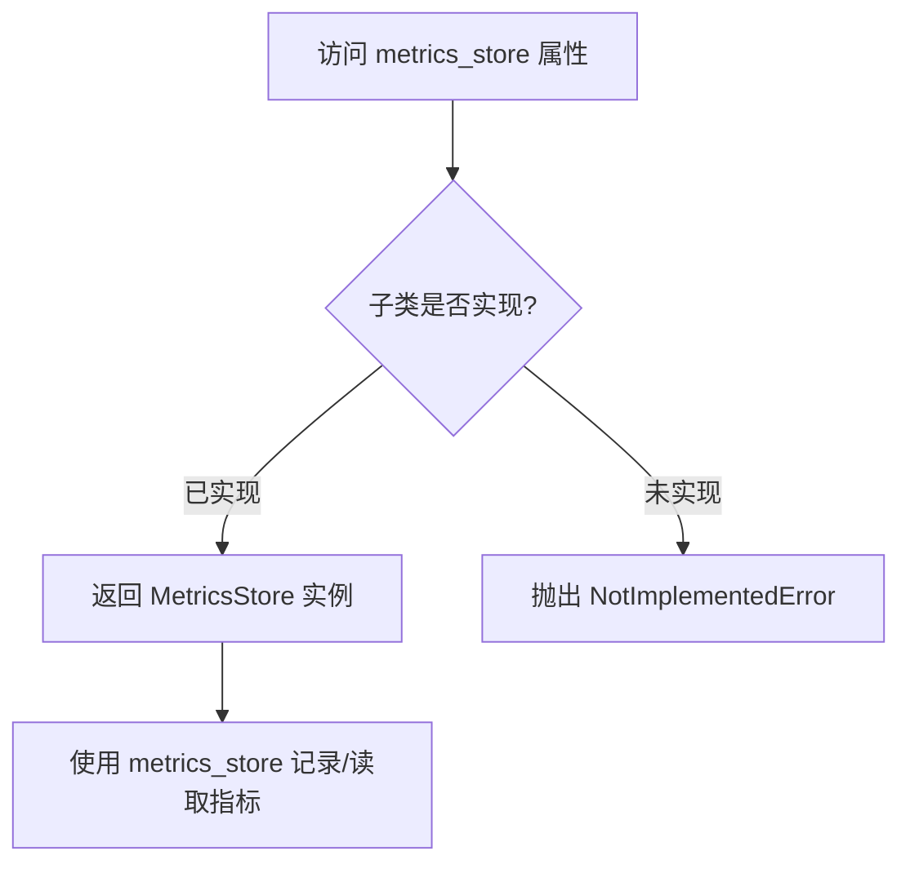

#### 带注释源码

```python
@property
@abstractmethod
def metrics_store(self) -> "MetricsStore":
    """Metrics store."""
    raise NotImplementedError
```

**源码解析：**

- `@property`：装饰器，将方法转换为属性，允许通过 `self.metrics_store` 访问
- `@abstractmethod`：装饰器，声明为抽象方法，要求子类必须实现此属性
- 返回类型 `"MetricsStore"`：字符串前向引用，避免循环导入
- 方法体直接 `raise NotImplementedError`：确保子类必须实现此抽象属性


### `LLMEmbedding.tokenizer`

这是一个抽象属性 getter，用于获取与语言模型关联的分词器（Tokenizer）实例。

参数：

- 无参数（这是一个属性访问器）

返回值：`Tokenizer`，分词器实例，用于对输入文本进行分词处理

#### 流程图

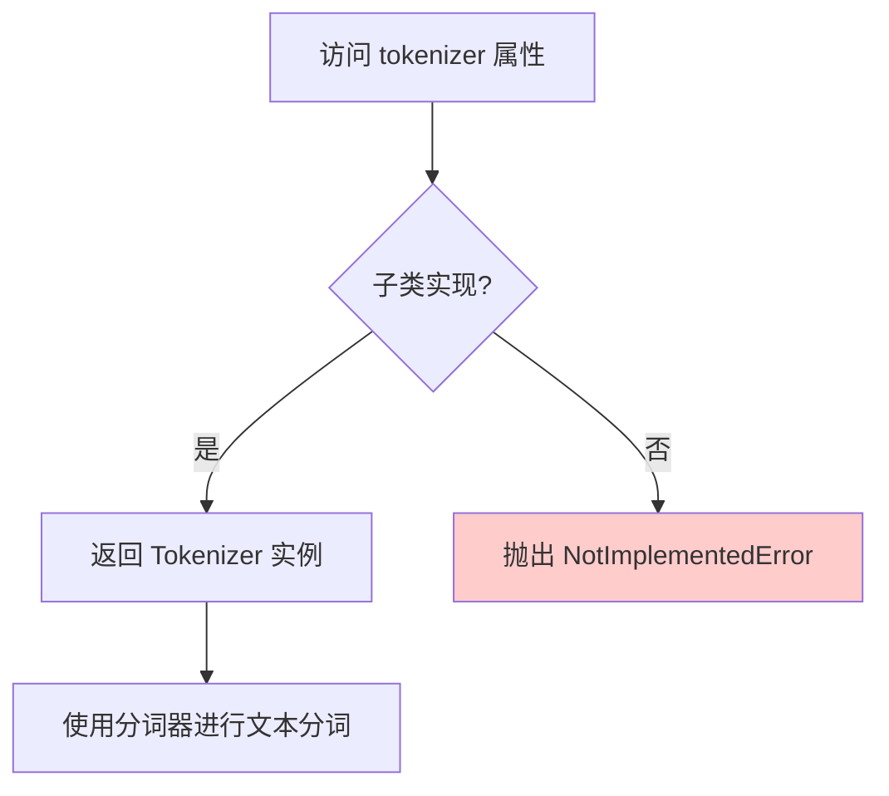

#### 带注释源码

```python
@property
@abstractmethod
def tokenizer(self) -> "Tokenizer":
    """Tokenizer.
    
    这是一个抽象属性方法，要求子类必须实现该属性 getter。
    用于获取与当前语言模型关联的分词器实例，以便对输入文本
    进行分词处理，统计 token 数量等操作。
    
    Returns
    -------
    Tokenizer
        分词器实例，负责将文本转换为 token 序列
        
    Raises
    ------
    NotImplementedError
        如果子类没有实现该属性，将抛出此异常
    """
    raise NotImplementedError
```

## 关键组件


### 一段话描述

LLMEmbedding 是一个抽象基类（ABC），为语言模型嵌入功能提供统一的接口规范，支持同步/异步嵌入、线程池批处理、缓存、指标收集、速率限制和重试机制。

### 文件的整体运行流程

该文件定义了 `LLMEmbedding` 抽象基类，作为所有具体嵌入实现的接口契约。初始化时接收模型配置、分词器、指标存储、缓存等依赖组件。具体嵌入流程包括：客户端调用 `embedding()` 或 `embedding_async()` 方法执行嵌入；使用 `embedding_batch()` 进行批量处理时，通过 `embedding_thread_pool()` 创建线程池并发处理请求；请求经过速率限制器检查、缓存查询、重试策略处理，最终返回嵌入结果或异常。

### 类的详细信息

#### 类名：LLMEmbedding
- **类类型**：抽象基类（ABC）
- **继承自**：ABC
- **核心功能**：为语言模型嵌入操作提供统一接口规范，支持同步/异步方法、线程池批处理、指标收集、缓存和重试机制

### 类字段和全局变量

| 名称 | 类型 | 描述 |
|------|------|------|
| model_id | str | 模型标识符，如 "openai/gpt-4o" |
| model_config | ModelConfig | 语言模型的配置对象 |
| tokenizer | Tokenizer | 用于处理文本的分词器 |
| metrics_store | MetricsStore | 指标存储，用于记录嵌入操作的性能数据 |
| metrics_processor | MetricsProcessor \| None | 指标处理器，可选用于实时指标处理 |
| rate_limiter | RateLimiter \| None | 速率限制器，控制请求频率 |
| retrier | Retry \| None | 重试策略，处理临时性失败 |
| cache | Cache \| None | 嵌入缓存，存储已计算的嵌入结果 |
| cache_key_creator | CacheKeyCreator | 缓存键生成函数，用于生成缓存唯一标识 |

### 类方法和全局函数

#### 方法 1: __init__

- **参数**：
  - `model_id`: str - 模型标识符
  - `model_config`: ModelConfig - 模型配置
  - `tokenizer`: Tokenizer - 分词器
  - `metrics_store`: MetricsStore - 指标存储
  - `metrics_processor`: MetricsProcessor | None - 指标处理器
  - `rate_limiter`: RateLimiter | None - 速率限制器
  - `retrier`: Retry | None - 重试策略
  - `cache`: Cache | None - 缓存实例
  - `cache_key_creator`: CacheKeyCreator - 缓存键生成函数
  - `**kwargs`: Any - 额外关键字参数

- **返回值类型**：None

- **返回值描述**：初始化 LLMEmbedding 实例

- **mermaid 流程图**：

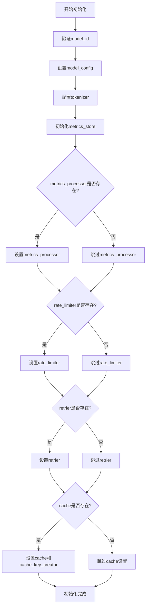

- **带注释源码**：

```python
@abstractmethod
def __init__(
    self,
    *,
    model_id: str,
    model_config: "ModelConfig",
    tokenizer: "Tokenizer",
    metrics_store: "MetricsStore",
    metrics_processor: "MetricsProcessor | None" = None,
    rate_limiter: "RateLimiter | None" = None,
    retrier: "Retry | None" = None,
    cache: "Cache | None" = None,
    cache_key_creator: "CacheKeyCreator",
    **kwargs: Any,
):
    """Initialize the LLMEmbedding.

    Args
    ----
        model_id: str
            The model ID, e.g., "openai/gpt-4o".
        model_config: ModelConfig
            The configuration for the language model.
        tokenizer: Tokenizer
            The tokenizer to use.
        metrics_store: MetricsStore | None (default=None)
            The metrics store to use.
        metrics_processor: MetricsProcessor | None (default: None)
            The metrics processor to use.
        rate_limiter: RateLimiter | None (default=None)
            The rate limiter to use.
        retrier: Retry | None (default=None)
            The retry strategy to use.
        cache: Cache | None (default=None)
            Optional cache for embeddings.
        cache_key_creator: CacheKeyCreator | None (default=None)
            Optional cache key creator function.
            (dict[str, Any]) -> str
        **kwargs: Any
            Additional keyword arguments.
    """
    raise NotImplementedError
```

#### 方法 2: embedding

- **参数**：
  - `**kwargs`: Unpack["LLMEmbeddingArgs"] - 嵌入参数

- **返回值类型**：LLMEmbeddingResponse

- **返回值描述**：嵌入操作返回的响应结果

- **mermaid 流程图**：

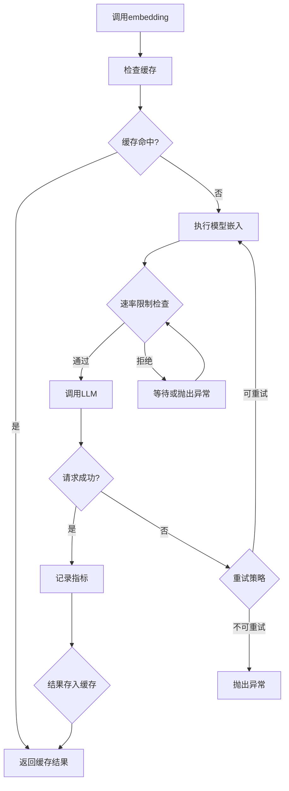

- **带注释源码**：

```python
@abstractmethod
def embedding(
    self, /, **kwargs: Unpack["LLMEmbeddingArgs"]
) -> "LLMEmbeddingResponse":
    """Sync embedding method."""
    raise NotImplementedError
```

#### 方法 3: embedding_async

- **参数**：
  - `**kwargs`: Unpack["LLMEmbeddingArgs"] - 嵌入参数

- **返回值类型**：LLMEmbeddingResponse

- **返回值描述**：异步嵌入操作返回的响应结果

- **mermaid 流程图**：

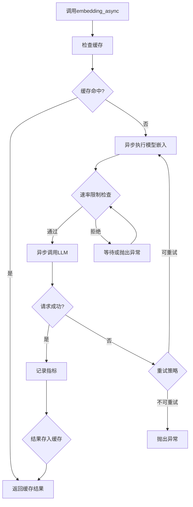

- **带注释源码**：

```python
@abstractmethod
async def embedding_async(
    self, /, **kwargs: Unpack["LLMEmbeddingArgs"]
) -> "LLMEmbeddingResponse":
    """Async embedding method."""
    raise NotImplementedError
```

#### 方法 4: embedding_thread_pool

- **参数**：
  - `response_handler`: ThreadedLLMEmbeddingResponseHandler - 响应处理回调函数
  - `concurrency`: int - 线程池并发数
  - `queue_limit`: int - 输入队列限制，默认0表示无限制

- **返回值类型**：Iterator[ThreadedLLMEmbeddingFunction]

- **返回值描述**：返回一个迭代器，用于提交嵌入请求到线程池

- **mermaid 流程图**：

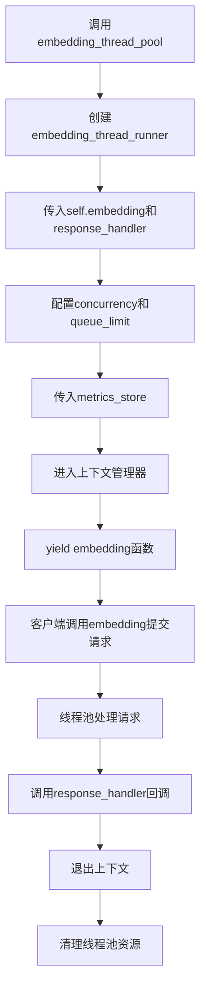

- **带注释源码**：

```python
@contextmanager
def embedding_thread_pool(
    self,
    *,
    response_handler: "ThreadedLLMEmbeddingResponseHandler",
    concurrency: int,
    queue_limit: int = 0,
) -> "Iterator[ThreadedLLMEmbeddingFunction]":
    """Run an embedding thread pool.

    Args
    ----
        response_handler: ThreadedLLMEmbeddingResponseHandler
            The callback function to handle embedding responses.
            (request_id, response|exception) -> Awaitable[None] | None
        concurrency: int
            The number of threads to spin up in a thread pool.
        queue_limit: int (default=0)
            The maximum number of items allowed in the input queue.
            0 means unlimited.
            Set this to a value to create backpressure on the caller.

    Yields
    ------
        ThreadedLLMEmbeddingFunction:
            A function that can be used to submit embedding requests to the thread pool.
            (input, request_id, **kwargs) -> None

            The thread pool will process the requests and invoke the provided callback
            with the responses.

            same signature as LLMEmbeddingFunction but requires a `request_id` parameter
            to identify the request and does not return anything.

    """
    with embedding_thread_runner(
        embedding=self.embedding,
        response_handler=response_handler,
        concurrency=concurrency,
        queue_limit=queue_limit,
        metrics_store=self.metrics_store,
    ) as embedding:
        yield embedding
```

#### 方法 5: embedding_batch

- **参数**：
  - `embedding_requests`: list[LLMEmbeddingArgs] - 嵌入请求列表
  - `concurrency`: int - 并发数
  - `queue_limit`: int - 队列限制，默认0

- **返回值类型**：list[LLMEmbeddingResponse | Exception]

- **返回值描述**：返回嵌入响应或异常的列表

- **mermaid 流程图**：

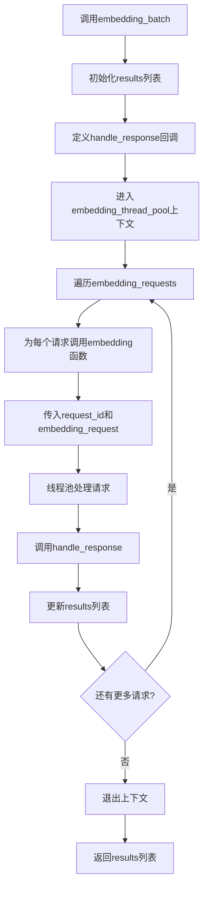

- **带注释源码**：

```python
def embedding_batch(
    self,
    embedding_requests: list["LLMEmbeddingArgs"],
    *,
    concurrency: int,
    queue_limit: int = 0,
) -> list["LLMEmbeddingResponse | Exception"]:
    """Process a batch of embedding requests using a thread pool.

    Args
    ----
        embedding_requests: list[LLMEmbeddingArgs]
            A list of embedding request arguments to process in parallel.
        batch_size: int
            The number of inputs to process in each batch.
        concurrency: int
            The number of threads to spin up in a thread pool.
        queue_limit: int (default=0)
            The maximum number of items allowed in the input queue.
            0 means unlimited.
            Set this to a value to create backpressure on the caller.

    Returns
    -------
        list[LLMEmbeddingResponse | Exception]
            A list of embedding responses or exceptions for each input.
    """
    results: list[LLMEmbeddingResponse | Exception] = [None] * len(
        embedding_requests
    )  # type: ignore

    def handle_response(
        request_id: str,
        response: "LLMEmbeddingResponse | Exception",
    ) -> None:
        index = int(request_id)
        results[index] = response

    with self.embedding_thread_pool(
        response_handler=handle_response,
        concurrency=concurrency,
        queue_limit=queue_limit,
    ) as embedding:
        for idx, embedding_request in enumerate(embedding_requests):
            embedding(request_id=str(idx), **embedding_request)

    return results
```

#### 属性 1: metrics_store

- **参数**：无

- **返回值类型**：MetricsStore

- **返回值描述**：返回指标存储对象

- **mermaid 流程图**：

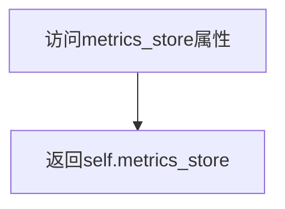

- **带注释源码**：

```python
@property
@abstractmethod
def metrics_store(self) -> "MetricsStore":
    """Metrics store."""
    raise NotImplementedError
```

#### 属性 2: tokenizer

- **参数**：无

- **返回值类型**：Tokenizer

- **返回值描述**：返回分词器对象

- **mermaid 流程图**：

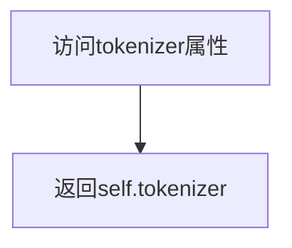

- **带注释源码**：

```python
@property
@abstractmethod
def tokenizer(self) -> "Tokenizer":
    """Tokenizer."""
    raise NotImplementedError
```

### 关键组件信息

#### 组件 1: 抽象基类接口（LLMEmbedding ABC）

定义了语言模型嵌入的统一接口规范，是所有具体嵌入实现的基础抽象类。

#### 组件 2: 同步/异步嵌入方法

提供 `embedding()` 同步方法和 `embedding_async()` 异步方法，满足不同场景需求。

#### 组件 3: 线程池批处理引擎

通过 `embedding_thread_pool()` 和 `embedding_batch()` 实现高并发批处理能力，支持背压控制。

#### 组件 4: 缓存抽象层

支持可选的 Cache 和 CacheKeyCreator，实现嵌入结果缓存以减少重复计算。

#### 组件 5: 指标收集系统

通过 MetricsStore 和 MetricsProcessor 收集和记录嵌入操作的性能指标。

#### 组件 6: 速率限制与重试机制

集成 RateLimiter 和 Retry 组件，处理临时性失败和请求频率控制。

### 潜在的技术债务或优化空间

1. **缺乏批量大小控制**：`embedding_batch()` 方法参数中定义了 `batch_size` 注释但未实际使用，无法分批处理大量请求
2. **缓存键生成未标准化**：cache_key_creator 类型定义不够清晰，文档说明与类型签名不一致
3. **错误处理不完善**：抽象方法使用 `raise NotImplementedError`，缺少具体错误类型定义
4. **类型注解不完整**：大量使用字符串形式的类型注解（如 "ModelConfig"），影响运行时类型检查
5. **缺乏超时机制**：未定义嵌入操作的默认超时时间，可能导致线程池阻塞
6. **metrics_processor 使用不明确**：初始化参数中接收但未在抽象基类中直接使用

### 其它项目

#### 设计目标与约束

- **设计目标**：提供统一的嵌入接口，支持同步/异步操作，支持高并发批处理
- **约束**：
  - 所有具体实现必须继承 LLMEmbedding 并实现所有抽象方法
  - embedding_thread_pool 使用同步方法 embedding，通过线程池实现并发
  - queue_limit 用于背压控制，0 表示无限制

#### 错误处理与异常设计

- 抽象方法通过 `raise NotImplementedError` 强制子类实现
- embedding_batch 返回结果中包含 Exception 对象，允许部分失败继续处理
- 响应处理器回调接收 Exception 作为响应，支持异步错误传播

#### 数据流与状态机

- 嵌入请求流程：输入验证 → 缓存检查 → 速率限制 → 模型调用 → 结果缓存 → 指标记录
- 批处理流程：请求入队 → 线程池分发 → 并发处理 → 回调通知 → 结果聚合
- 线程池状态：初始化 → 运行中（可提交任务） → 退出（清理资源）

#### 外部依赖与接口契约

- **graphrag_llm.threading.embedding_thread_runner**：线程池运行器，提供嵌入任务的并发执行
- **graphrag_cache.Cache**：缓存接口，存储嵌入向量结果
- **graphrag_llm.config.ModelConfig**：模型配置，包含模型参数设置
- **graphrag_llm.tokenizer.Tokenizer**：分词器接口，处理文本输入
- **graphrag_llm.metrics**：指标收集相关接口
- **graphrag_llm.rate_limit.RateLimiter**：速率限制器接口
- **graphrag_llm.retry.Retry**：重试策略接口
- **LLMEmbeddingArgs / LLMEmbeddingResponse**：嵌入请求/响应参数类型定义


## 问题及建议


### 已知问题

- **文档与实现不一致**：`embedding_batch` 方法的 docstring 中声明了 `batch_size` 参数，但实际方法签名中并不存在此参数，会导致使用者的困惑。
- **抽象 init 方法未保存状态**：抽象方法 `__init__` 仅抛出 `NotImplementedError`，但接收了大量参数（model_id、model_config、tokenizer、metrics_store 等）却未进行任何保存。子类实现时必须重新定义 `__init__` 并手动存储这些值，违反了 DRY 原则，也容易导致实现不一致。
- **类型注解不匹配**：在 `__init__` 签名中 `cache_key_creator: "CacheKeyCreator"` 未标记为可选类型，但在 docstring 中说明 `cache_key_creator: CacheKeyCreator | None (default=None)`，类型注解与实际行为不符。
- **结果列表类型处理**：`embedding_batch` 中初始化 `results: list[LLMEmbeddingResponse | Exception] = [None] * len(embedding_requests)` 后使用了 `# type: ignore`，表明类型检查器无法正确推断列表类型，应使用 `typing.List` 的方式或其他方式明确类型。
- **request_id 解析风险**：`handle_response` 中使用 `int(request_id)` 进行解析，若传入非数字字符串会抛出 `ValueException`，缺乏异常保护机制。

### 优化建议

- 移除 `embedding_batch` docstring 中的 `batch_size` 参数描述，或将其添加到方法签名中。
- 在抽象类中实现基础的 `__init__` 方法来保存通用配置（如 model_id、tokenizer、metrics_store 等），或提供抽象属性让子类实现，而不是在抽象方法中传递大量参数却不保存。
- 统一 `cache_key_creator` 的类型注解：`cache_key_creator: "CacheKeyCreator | None" = None`。
- 修复类型推断问题，可以使用 `results: list[LLMEmbeddingResponse | Exception] = [None] * len(embedding_requests)  # type: ignore[assignment]` 或重构为显式循环填充。
- 在 `handle_response` 中添加异常处理，如 `try: index = int(request_id) except ValueError: ...` 以处理非法 request_id。
- 考虑将 `embedding_thread_runner` 的同步嵌入逻辑与异步方法分离，提供 `embedding_async_thread_pool` 以支持异步嵌入场景。

## 其它


### 设计目标与约束

**设计目标**：
- 提供语言模型嵌入的抽象接口，支持同步和异步两种嵌入方式
- 支持批量嵌入处理，通过线程池实现并发
- 集成缓存、指标收集、速率限制和重试机制
- 提供可扩展的抽象基类，供具体实现类继承

**设计约束**：
- 必须继承自 ABC，成为抽象基类
- 子类必须实现所有 @abstractmethod 标记的方法和属性
- 依赖注入模式，所有依赖通过构造函数传入
- 使用 TYPE_CHECKING 避免循环导入

### 错误处理与异常设计

**异常处理策略**：
- 抽象方法中使用 `raise NotImplementedError` 强制子类实现
- embedding_batch 方法中返回 `list[LLMEmbeddingResponse | Exception]`，将异常包含在结果中而非抛出
- 线程池通过 response_handler 回调处理异常，异常作为参数传递

**异常传播机制**：
- 同步/异步嵌入方法不捕获异常，由调用方处理
- 线程池模式中，异常通过 response_handler 的 response 参数传递
- Cache 相关异常由缓存层自行处理

### 数据流与状态机

**核心数据流**：
1. 单次嵌入：调用 embedding() 或 embedding_async() -> 返回 LLMEmbeddingResponse
2. 批量嵌入：调用 embedding_batch() -> 创建线程池 -> 并发执行 embedding -> 收集结果
3. 线程池模式：使用 embedding_thread_pool() 上下文管理器 -> 获取 embedding 函数 -> 提交任务 -> 通过 response_handler 回调处理结果

**状态管理**：
- 自身为无状态类，所有状态通过依赖注入（metrics_store, cache, rate_limiter 等）
- metrics_store 存储指标数据
- cache 存储嵌入缓存结果
- rate_limiter 控制请求速率

### 外部依赖与接口契约

**必需依赖**：
- `ModelConfig`: 模型配置，包含模型参数设置
- `Tokenizer`: 分词器，用于处理文本分词
- `MetricsStore`: 指标存储，用于记录嵌入操作指标

**可选依赖**：
- `MetricsProcessor`: 指标处理器，可选
- `RateLimiter`: 速率限制器，可选
- `Retry`: 重试策略，可选
- `Cache`: 缓存实例，可选
- `CacheKeyCreator`: 缓存键创建函数，必需（无默认值）

**接口契约**：
- embedding() 和 embedding_async() 必须接受 **kwargs: Unpack[LLMEmbeddingArgs]
- embedding() 返回 LLMEmbeddingResponse
- embedding_async() 异步返回 LLMEmbeddingResponse
- metrics_store 和 tokenizer 必须实现为只读属性

### 并发模型与线程安全

**并发策略**：
- 使用 threading.ThreadPoolExecutor 实现线程池
- embedding_thread_pool() 方法通过 contextmanager 管理线程池生命周期
- 支持 concurrency 参数控制并发线程数
- 支持 queue_limit 参数实现背压控制

**线程安全考量**：
- metrics_store 的写入操作需考虑线程安全（由具体实现保证）
- 线程池内部通过队列管理任务，线程安全由 Python 标准库保证
- embedding_batch 中的 results 列表通过 request_id 索引写入，无竞争条件

### 缓存策略

**缓存接口**：
- cache: 可选的 Cache 实例
- cache_key_creator: 必需的 CacheKeyCreator 函数
- 缓存键由 cache_key_creator 函数从请求参数生成

**缓存使用模式**：
- 缓存逻辑由具体子类实现
- 基类不直接操作缓存，提供缓存依赖注入
- 支持可选缓存以提升性能

### 速率限制与重试机制

**速率限制**：
- 通过 rate_limiter: RateLimiter 依赖注入
- 具体限流逻辑由具体实现类在 embedding 方法中调用

**重试机制**：
- 通过 retrier: Retry 依赖注入
- 具体重试逻辑由具体实现类处理
- 支持可配置的重试策略

### 性能考虑

**性能优化点**：
- embedding_batch 支持并发处理，提高吞吐量
- embedding_thread_pool 支持 queue_limit 背压控制，防止内存溢出
- 缓存机制减少重复计算

**性能指标**：
- 通过 MetricsStore 记录嵌入操作指标
- 可选 MetricsProcessor 实时处理指标

### 继承实现要求

**子类必须实现**：
1. `__init__()`: 初始化方法，接受所有依赖参数
2. `embedding()`: 同步嵌入方法
3. `embedding_async()`: 异步嵌入方法
4. `metrics_store` 属性: 返回 MetricsStore 实例
5. `tokenizer` 属性: 返回 Tokenizer 实例

**设计模式**：
- 模板方法模式：基类定义流程框架，子类实现具体逻辑
- 依赖注入：所有外部依赖通过构造函数传入
- 策略模式：rate_limiter, retrier, cache 等可替换策略

### 类型签名与泛型设计

**泛型参数**：
- `Unpack["LLMEmbeddingArgs"]`: 使用 PEP 646 类型展开
- `Iterator[ThreadedLLMEmbeddingFunction]`: 上下文管理器返回类型
- `list["LLMEmbeddingResponse | Exception"]`: 批量结果类型

**类型安全**：
- 使用 TYPE_CHECKING 避免循环导入
- 使用 type: ignore 处理类型推断问题
- 所有公开接口都有完整的类型注解

    