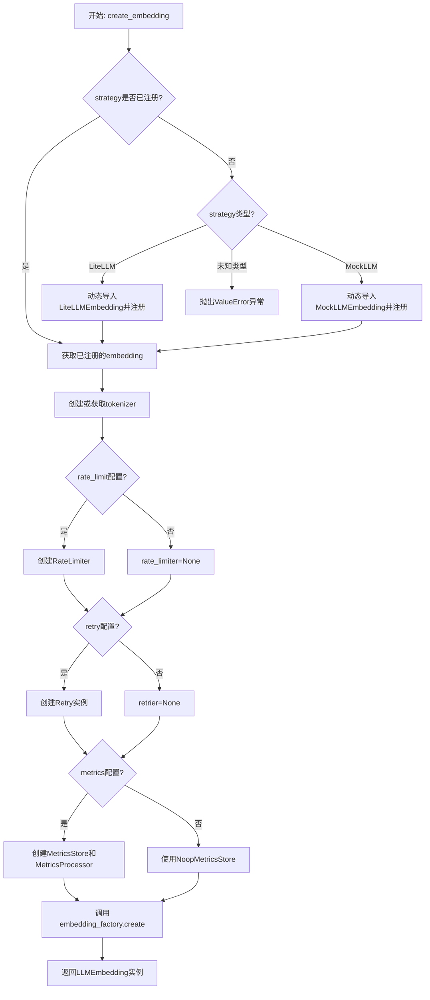
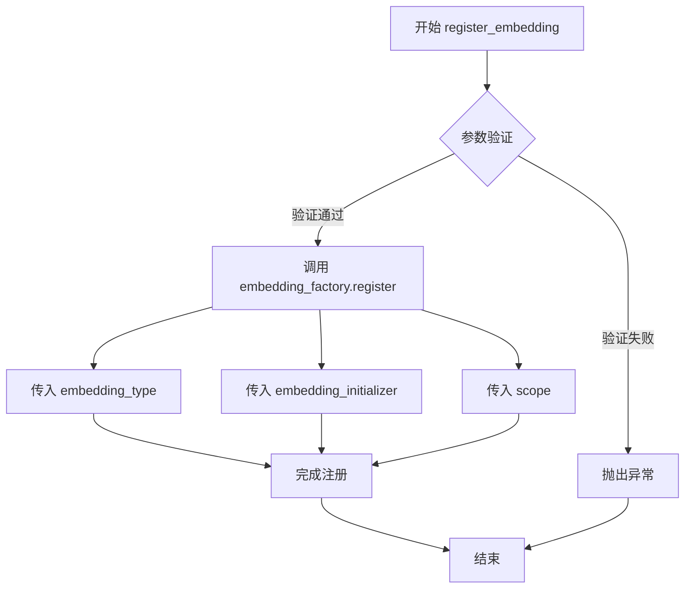
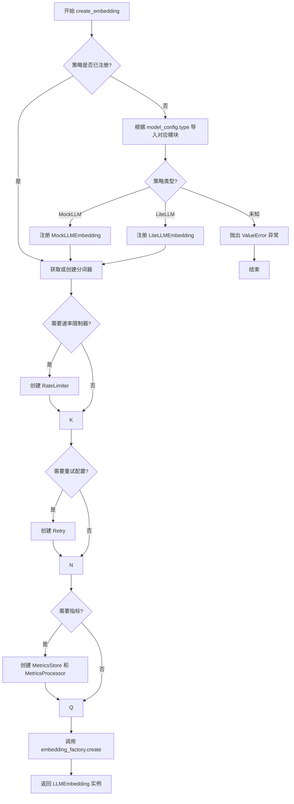
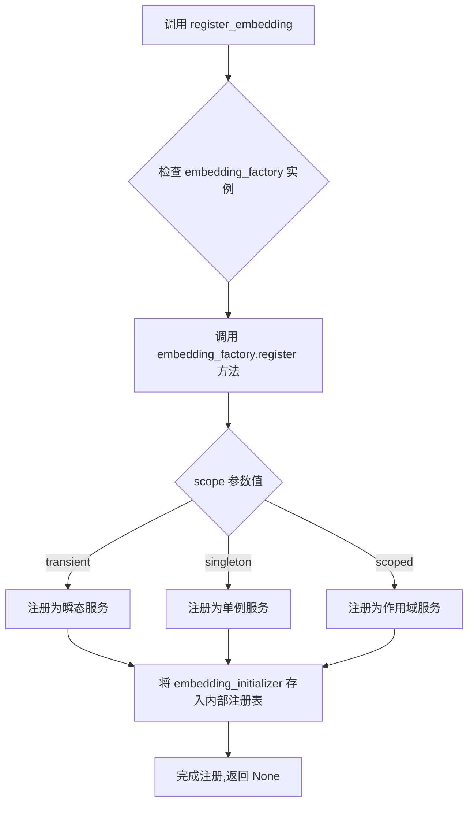
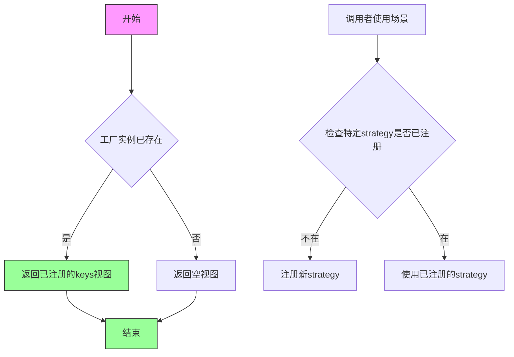

# `graphrag\packages\graphrag-llm\graphrag_llm\embedding\embedding_factory.py` 详细设计文档

这是一个嵌入工厂模块，通过工厂模式根据ModelConfig配置动态创建不同类型的嵌入实例（如LiteLLM、MockLLM），支持可选的缓存、速率限制、重试机制和指标收集功能。

## 整体流程



## 类结构

```
Factory[T] (抽象基类)
└── EmbeddingFactory (嵌入工厂实现类)
    └── 继承自graphrag_common.factory.Factory
```

## 全局变量及字段


### `embedding_factory`
    
全局Embedding工厂实例，用于注册和创建各种类型的Embedding实例

类型：`EmbeddingFactory`
    


    

## 全局函数及方法


### `register_embedding`

注册一个自定义的 Embedding 实现到嵌入工厂中，以便后续可以通过 `create_embedding` 函数根据配置创建对应的 Embedding 实例。

参数：

-  `embedding_type`：`str`，要注册的 Embedding 类型标识符（例如 `LLMProviderType.LiteLLM`）
-  `embedding_initializer`：`Callable[..., "LLMEmbedding"]`，用于创建 Embedding 实例的可调用对象（初始化函数或类）
-  `scope`：`"ServiceScope"`（默认：`"transient"`），服务作用域，默认为 `transient`（每次请求创建新实例），可设为 `singleton`（单例）

返回值：`None`，无返回值，此函数仅执行注册操作

#### 流程图



#### 带注释源码

```python
def register_embedding(
    embedding_type: str,
    embedding_initializer: Callable[..., "LLMEmbedding"],
    scope: "ServiceScope" = "transient",
) -> None:
    """Register a custom completion implementation.

    Args
    ----
        embedding_type: str
            The embedding id to register.
        embedding_initializer: Callable[..., LLMEmbedding]
            The embedding initializer to register.
        scope: ServiceScope (default: "transient")
            The service scope for the embedding.
    """
    # 调用全局 embedding_factory 实例的 register 方法
    # 将 embedding_type 作为键，embedding_initializer 作为创建器
    # scope 控制该 embedding 的生命周期（transient/singleton）
    embedding_factory.register(embedding_type, embedding_initializer, scope)
```


### `create_embedding`

该函数是一个嵌入(Embedding)工厂函数，用于根据提供的模型配置创建一个 LLMEmbedding 实例。它支持多种嵌入类型(如 LiteLLM、MockLLM)，并可选地配置缓存、分词器、速率限制器、重试机制和指标收集。

参数：

- `model_config`：`ModelConfig`，模型配置对象，包含模型类型、提供商、速率限制、重试和指标配置等
- `cache`：`Cache | None`，可选的缓存实例，用于缓存嵌入结果
- `cache_key_creator`：`CacheKeyCreator | None`，可选的缓存键创建函数，默认为 `create_cache_key`
- `tokenizer`：`Tokenizer | None`，可选的分词器实例，默认为根据 model_id 创建

返回值：`LLMEmbedding`，嵌入实例，具体类型由 model_config.type 决定

#### 流程图



#### 带注释源码

```python
def create_embedding(
    model_config: "ModelConfig",
    *,
    cache: "Cache | None" = None,
    cache_key_creator: "CacheKeyCreator | None" = None,
    tokenizer: "Tokenizer | None" = None,
) -> "LLMEmbedding":
    """Create an Embedding instance based on the model configuration.

    Args
    ----
        model_config: ModelConfig
            The configuration for the model.
        cache: Cache | None (default: None)
            An optional cache instance.
        cache_key_creator: CacheKeyCreator | None (default: create_cache_key)
            An optional cache key creator function.
        tokenizer: Tokenizer | None (default: litellm)
            An optional tokenizer instance.

    Returns
    -------
        LLMEmbedding:
            An instance of an Embedding subclass.
    """
    # 如果未提供缓存键创建函数，则使用默认的 create_cache_key
    cache_key_creator = cache_key_creator or create_cache_key
    
    # 构建模型标识符，格式为 "provider/model"
    model_id = f"{model_config.model_provider}/{model_config.model}"
    
    # 获取嵌入策略类型
    strategy = model_config.type
    
    # 从模型配置中提取额外的参数
    extra: dict[str, Any] = model_config.model_extra or {}

    # 检查该策略是否已在工厂中注册
    if strategy not in embedding_factory:
        # 动态导入并注册对应的嵌入实现类
        match strategy:
            case LLMProviderType.LiteLLM:
                from graphrag_llm.embedding.lite_llm_embedding import (
                    LiteLLMEmbedding,
                )

                register_embedding(
                    embedding_type=LLMProviderType.LiteLLM,
                    embedding_initializer=LiteLLMEmbedding,
                    scope="singleton",
                )
            case LLMProviderType.MockLLM:
                from graphrag_llm.embedding.mock_llm_embedding import MockLLMEmbedding

                register_embedding(
                    embedding_type=LLMProviderType.MockLLM,
                    embedding_initializer=MockLLMEmbedding,
                )
            case _:
                # 策略未注册，抛出错误
                msg = f"ModelConfig.type '{strategy}' is not registered in the CompletionFactory. Registered strategies: {', '.join(embedding_factory.keys())}"
                raise ValueError(msg)

    # 如果未提供分词器，则根据 model_id 创建默认分词器
    tokenizer = tokenizer or create_tokenizer(TokenizerConfig(model_id=model_id))

    # 初始化可选组件
    rate_limiter: RateLimiter | None = None
    retrier: Retry | None = None
    metrics_store: MetricsStore = NoopMetricsStore()  # 默认使用无操作指标存储
    metrics_processor: MetricsProcessor | None = None

    # 如果配置了速率限制，则创建速率限制器
    if model_config.rate_limit:
        from graphrag_llm.rate_limit.rate_limit_factory import create_rate_limiter

        rate_limiter = create_rate_limiter(rate_limit_config=model_config.rate_limit)

    # 如果配置了重试策略，则创建重试配置
    if model_config.retry:
        from graphrag_llm.retry.retry_factory import create_retry

        retrier = create_retry(retry_config=model_config.retry)

    # 如果配置了指标，则创建指标存储和处理器
    if model_config.metrics:
        from graphrag_llm.metrics import (
            create_metrics_processor,
            create_metrics_store,
        )

        metrics_store = create_metrics_store(
            config=model_config.metrics,
            id=model_id,
        )
        metrics_processor = create_metrics_processor(model_config.metrics)

    # 使用工厂模式创建嵌入实例，传入所有初始化参数
    return embedding_factory.create(
        strategy=strategy,
        init_args={
            **extra,  # 展开模型额外的配置参数
            "model_id": model_id,
            "model_config": model_config,
            "tokenizer": tokenizer,
            "metrics_store": metrics_store,
            "metrics_processor": metrics_processor,
            "rate_limiter": rate_limiter,
            "retrier": retrier,
            "cache": cache,
            "cache_key_creator": cache_key_creator,
        },
    )
```


### `EmbeddingFactory.register`

向嵌入工厂注册自定义嵌入实现，以便可以通过 `create_embedding` 函数根据策略类型创建相应的嵌入实例。

参数：

- `embedding_type`：`str`，嵌入类型的唯一标识符（如 `"LiteLLM"`、`"MockLLM"` 等）
- `embedding_initializer`：`Callable[..., LLMEmbedding]`，用于创建嵌入实例的可调用对象（类或函数）
- `scope`：`ServiceScope`，服务作用域，默认为 `"transient"`（ transient | singleton | scoped）

返回值：`None`，无返回值，仅注册到工厂实例中

#### 流程图



#### 带注释源码

```python
# 基于代码中 register_embedding 函数的调用方式推断
# 实际实现位于 graphrag_common.factory.Factory 基类中

def register(
    self,
    embedding_type: str,
    embedding_initializer: Callable[..., "LLMEmbedding"],
    scope: "ServiceScope" = "transient",
) -> None:
    """注册嵌入类型及其初始化器
    
    Args:
        embedding_type: 嵌入类型的唯一标识符字符串
        embedding_initializer: 可调用对象,用于创建 LLMEmbedding 实例
        scope: 服务作用域,控制实例的生命周期
              - 'transient': 每次请求创建新实例
              - 'singleton': 全局单例
              - 'scoped': 作用域内单例
    """
    # 将初始化器和作用域信息存储到工厂的注册表中
    # 后续可通过 embedding_factory.create(strategy=embedding_type) 创建实例
    self._registry[embedding_type] = {
        "initializer": embedding_initializer,
        "scope": scope,
    }
```

> **注意**：由于 `EmbeddingFactory` 继承自 `graphrag_common.factory.Factory`，其 `register` 方法的具体实现位于基类中。上面的源码是基于调用模式和 Python 工厂模式常见实现的推断。实际使用时，调用方式如下：

```python
# 代码中的实际调用示例
register_embedding(
    embedding_type=LLMProviderType.LiteLLM,
    embedding_initializer=LiteLLMEmbedding,
    scope="singleton",
)
```


### `create_embedding`

该函数是嵌入工厂的核心创建方法，基于模型配置动态创建嵌入实例。它负责根据配置选择合适的嵌入策略（如LiteLLM或MockLLM），并自动处理缓存、分词器、速率限制、重试机制和指标追踪等依赖项的初始化。

参数：

- `model_config`：`ModelConfig`，模型配置对象，包含模型提供商、模型名称、速率限制、重试配置等
- `cache`：`Cache | None`，可选的缓存实例，用于存储嵌入结果
- `cache_key_creator`：`CacheKeyCreator | None`，可选的缓存键创建函数，默认为 `create_cache_key`
- `tokenizer`：`Tokenizer | None`，可选的分词器实例，默认为根据模型ID自动创建

返回值：`LLMEmbedding`，嵌入实例的具体实现（如 LiteLLMEmbedding 或 MockLLMEmbedding）

#### 流程图

```mermaid
flowchart TD
    A[开始创建 Embedding] --> B[设置默认cache_key_creator]
    B --> C[构建model_id: {provider}/{model}]
    C --> D{strategy是否已注册?}
    D -->|是| F[使用已注册的strategy]
    D -->|否| E{strategy类型}
    E -->|LiteLLM| E1[注册LiteLLMEmbedding]
    E -->|MockLLM| E2[注册MockLLMEmbedding]
    E -->|其他| E3[抛出ValueError]
    E1 --> F
    E2 --> F
    E3 --> G[异常处理]
    F --> H[创建或获取Tokenizer]
    H --> I{有rate_limit配置?}
    I -->|是| I1[创建RateLimiter]
    I -->|否| J{有retry配置?}
    I1 --> J
    J -->|是| J1[创建Retry]
    J -->|否| K{有metrics配置?}
    J1 --> K
    K -->|是| K1[创建MetricsStore和MetricsProcessor]
    K -->|否| L[使用NoopMetricsStore]
    K1 --> L
    L --> M[调用embedding_factory.create]
    M --> N[返回LLMEmbedding实例]
```

#### 带注释源码

```python
def create_embedding(
    model_config: "ModelConfig",
    *,
    cache: "Cache | None" = None,
    cache_key_creator: "CacheKeyCreator | None" = None,
    tokenizer: "Tokenizer | None" = None,
) -> "LLMEmbedding":
    """Create an Embedding instance based on the model configuration.

    Args
    ----
        model_config: ModelConfig
            The configuration for the model.
        cache: Cache | None (default: None)
            An optional cache instance.
        cache_key_creator: CacheKeyCreator | None (default: create_cache_key)
            An optional cache key creator function.
        tokenizer: Tokenizer | None (default: litellm)
            An optional tokenizer instance.

    Returns
    -------
        LLMEmbedding:
            An instance of an Embedding subclass.
    """
    # 1. 设置默认的缓存键创建器，如果未提供则使用 create_cache_key
    cache_key_creator = cache_key_creator or create_cache_key
    
    # 2. 构建模型唯一标识，格式为 "{provider}/{model}"
    model_id = f"{model_config.model_provider}/{model_config.model}"
    
    # 3. 获取嵌入策略类型（来自 ModelConfig.type）
    strategy = model_config.type
    
    # 4. 获取模型的额外配置参数
    extra: dict[str, Any] = model_config.model_extra or {}

    # 5. 检查该策略是否已在工厂中注册
    if strategy not in embedding_factory:
        # 6. 如果未注册，根据策略类型动态注册对应的嵌入实现
        match strategy:
            case LLMProviderType.LiteLLM:
                # 动态导入 LiteLLM 嵌入实现
                from graphrag_llm.embedding.lite_llm_embedding import (
                    LiteLLMEmbedding,
                )
                # 注册为单例模式
                register_embedding(
                    embedding_type=LLMProviderType.LiteLLM,
                    embedding_initializer=LiteLLMEmbedding,
                    scope="singleton",
                )
            case LLMProviderType.MockLLM:
                # 动态导入 Mock 嵌入实现
                from graphrag_llm.embedding.mock_llm_embedding import MockLLMEmbedding
                # 注册（默认 transient 作用域）
                register_embedding(
                    embedding_type=LLMProviderType.MockLLM,
                    embedding_initializer=MockLLMEmbedding,
                )
            case _:
                # 策略未注册，抛出详细错误信息
                msg = f"ModelConfig.type '{strategy}' is not registered in the CompletionFactory. Registered strategies: {', '.join(embedding_factory.keys())}"
                raise ValueError(msg)

    # 7. 如果未提供分词器，则根据模型ID创建默认分词器
    tokenizer = tokenizer or create_tokenizer(TokenizerConfig(model_id=model_id))

    # 8. 根据配置创建速率限制器（可选）
    rate_limiter: RateLimiter | None = None
    if model_config.rate_limit:
        from graphrag_llm.rate_limit.rate_limit_factory import create_rate_limiter
        rate_limiter = create_rate_limiter(rate_limit_config=model_config.rate_limit)

    # 9. 根据配置创建重试机制（可选）
    retrier: Retry | None = None
    if model_config.retry:
        from graphrag_llm.retry.retry_factory import create_retry
        retrier = create_retry(retry_config=model_config.retry)

    # 10. 初始化指标存储，默认使用无操作存储
    metrics_store: MetricsStore = NoopMetricsStore()
    metrics_processor: MetricsProcessor | None = None
    
    # 11. 如果配置了指标，则创建指标处理器和存储
    if model_config.metrics:
        from graphrag_llm.metrics import (
            create_metrics_processor,
            create_metrics_store,
        )
        # 创建带配置的指标存储
        metrics_store = create_metrics_store(
            config=model_config.metrics,
            id=model_id,
        )
        # 创建指标处理器
        metrics_processor = create_metrics_processor(model_config.metrics)

    # 12. 调用工厂的 create 方法创建嵌入实例，传入所有初始化参数
    return embedding_factory.create(
        strategy=strategy,
        init_args={
            **extra,                      # 展开模型额外配置
            "model_id": model_id,         # 模型唯一标识
            "model_config": model_config, # 原始模型配置
            "tokenizer": tokenizer,       # 分词器实例
            "metrics_store": metrics_store,    # 指标存储
            "metrics_processor": metrics_processor,  # 指标处理器
            "rate_limiter": rate_limiter, # 速率限制器
            "retrier": retrier,           # 重试机制
            "cache": cache,               # 缓存实例
            "cache_key_creator": cache_key_creator,  # 缓存键创建器
        },
    )
```


### `EmbeddingFactory.keys`

获取当前已注册的所有 Embedding 类型的键列表，用于查询有哪些可用的 Embedding 实现策略。

参数：无

返回值：`KeysView[str]`，返回已注册在工厂中的所有 Embedding 类型标识符的视图

#### 流程图



#### 带注释源码

```python
# 这是 Factory 基类的方法，EmbeddingFactory 继承自 Factory
# 以下是其在 create_embedding 函数中的使用方式

# 使用场景1：检查 strategy 是否已注册
if strategy not in embedding_factory:  # 调用 __contains__ 方法，内部使用 keys()
    # ... 注册新的 embedding 类型

# 使用场景2：获取所有已注册的策略用于错误提示
msg = f"ModelConfig.type '{strategy}' is not registered in the CompletionFactory. Registered strategies: {', '.join(embedding_factory.keys())}"
raise ValueError(msg)

# Factory 基类（推测）的 keys() 方法实现类似：
# def keys(self) -> KeysView[str]:
#     """Return a view of registered strategy keys."""
#     return self._strategies.keys()
```

---

## 关联信息补充

### `EmbeddingFactory` 类的完整信息

**基类来源**：`graphrag_common.factory.Factory`

**核心功能**：工厂模式实现，用于创建不同类型的 LLM Embedding 实例，支持动态注册和按需加载。

**主要方法**：
- `register(embedding_type, embedding_initializer, scope)`：注册新的 Embedding 类型
- `create(strategy, init_args)`：根据策略创建 Embedding 实例
- `keys()`：返回已注册策略的键视图
- `__contains__(strategy)`：检查策略是否已注册

### 潜在的技术债务或优化空间

1. **类型提示不完整**：`embedding_factory.keys()` 返回类型未在代码中明确指定，依赖运行时行为
2. **错误信息不一致**：错误消息中提到 `CompletionFactory`，但实际类名是 `EmbeddingFactory`
3. **隐式导入副作用**：`create_embedding` 函数在运行时根据策略类型动态导入模块，可能导致启动时的循环依赖问题

## 关键组件


### EmbeddingFactory

嵌入工厂类，继承自通用工厂基类，负责根据配置创建不同类型的嵌入实例。

### register_embedding

注册函数，用于将自定义嵌入类型及其初始化器注册到工厂中，支持瞬态和单例作用域。

### create_embedding

核心创建函数，根据 ModelConfig 配置动态创建嵌入实例，集成了缓存、速率限制、重试机制、指标收集等横切关注点。

### LiteLLMEmbedding

基于 LiteLLM 的嵌入实现，通过动态注册机制懒加载，避免不必要的依赖。

### MockLLMEmbedding

用于测试的模拟嵌入实现，支持快速原型开发和单元测试。

### 缓存机制

支持可选的缓存实例和缓存键创建器，用于缓存嵌入结果以提升性能。

### 速率限制器

基于配置的速率限制实现，支持并发控制和 API 调用限制。

### 重试机制

基于配置的重试策略实现，处理临时性失败和网络问题。

### 指标处理

支持指标存储和指标处理器，用于监控嵌入操作的性能和行为。


## 问题及建议


### 已知问题

- **动态注册逻辑分散**：LiteLLM 和 MockLLM 的导入与注册逻辑内嵌在 `create_embedding` 函数中，导致注册逻辑与创建逻辑耦合，且每次调用都会检查策略是否已注册
- **缺少缓存键创建失败的容错**：当 `cache_key_creator` 为 None 时，虽然有默认值逻辑，但如果 `create_cache_key` 函数本身出现问题，缺乏明确的错误处理
- **重复的缓存键创建逻辑**：`cache_key_creator = cache_key_creator or create_cache_key` 与 `create_cache_key` 导入的缓存键创建逻辑分散在多个模块中，可能导致行为不一致
- **指标初始化冗余**：无论是否启用指标，都会创建 `NoopMetricsStore()` 实例，即使后续可能被真实实例覆盖，造成不必要的对象创建
- **类型注解不完整**：函数返回类型标注为 `"LLMEmbedding"` 字符串形式，虽然在 TYPE_CHECKING 块中有导入，但可使用 `from __future__ import annotations` 改进
- **错误信息可能误导**：`raise ValueError(msg)` 中显示 `CompletionFactory` 但实际使用的是 `EmbeddingFactory`，信息不够准确

### 优化建议

- **集中注册机制**：在模块初始化或配置阶段预先注册所有支持的嵌入类型，避免在运行时动态注册，或将动态注册逻辑抽取为独立函数
- **统一缓存键处理**：将缓存键创建逻辑统一封装，确保传入 None 时有明确的默认值和错误处理流程
- **惰性指标初始化**：仅在 `model_config.metrics` 存在时才初始化指标相关对象，避免创建不必要的 `NoopMetricsStore` 实例
- **修复错误信息**：将错误信息中的 `CompletionFactory` 修正为 `EmbeddingFactory`，或动态获取工厂类名
- **简化函数职责**：将 `create_embedding` 函数中的配置解析、依赖创建和实例化逻辑拆分为更小的辅助函数，提高可读性和可测试性
- **添加前向引用支持**：在文件顶部添加 `from __future__ import annotations`，使类型注解更加清晰简洁

## 其它


### 设计目标与约束

本模块的设计目标是提供一个灵活的嵌入（Embedding）实例创建工厂，支持多种嵌入提供商（如LiteLLM、MockLLM），并通过依赖注入机制支持缓存、限流、重试、指标收集等横切关注点。设计约束包括：1）必须继承自Factory基类；2）支持transient、singleton等生命周期管理；3）所有嵌入实现必须返回LLMEmbedding接口类型；4）配置驱动，通过ModelConfig动态决定创建策略。

### 错误处理与异常设计

1. **策略未注册错误**：当`strategy`不在`embedding_factory`中且无法匹配已知`LLMProviderType`时，抛出`ValueError`，错误信息包含当前策略名和已注册策略列表。2. **导入失败处理**：LiteLLMEmbedding和MockLLMEmbedding采用延迟导入（lazy import），仅在匹配到对应策略时才导入，避免不必要的依赖。3. **可选依赖降级**：当`cache`、`tokenizer`、`rate_limiter`、`retrier`等可选组件未提供时，使用系统默认值（如`NoopMetricsStore`表示无指标收集）。

### 数据流与状态机

**数据流**：ModelConfig → create_embedding() → 策略解析 → 嵌入类注册（如需要） → 可选组件初始化（tokenizer/rate_limiter/retrier/metrics） → embedding_factory.create() → LLMEmbedding实例。**状态机**：Factory内部维护嵌入类型到初始化器的映射，register_embedding()修改映射状态，create_embedding()读取映射并实例化。线程安全由Factory基类实现保证。

### 外部依赖与接口契约

1. **graphrag_common.factory.Factory**：基类，提供register()和create()方法。2. **graphrag_llm.embedding.embedding.LLMEmbedding**：返回类型接口，定义嵌入行为。3. **graphrag_cache.Cache/CacheKeyCreator**：缓存接口，用于嵌入结果缓存。4. **graphrag_llm.tokenizer.Tokenizer**：分词器接口。5. **graphrag_llm.rate_limit.RateLimiter**：限流器接口。6. **graphrag_llm.retry.Retry**：重试策略接口。7. **graphrag_llm.metrics.MetricsStore/MetricsProcessor**：指标收集接口。8. **ModelConfig**：模型配置数据类，包含model_provider、model、type、rate_limit、retry、metrics等字段。

### 关键组件信息

1. **EmbeddingFactory**：继承自Factory的泛型类，管理嵌入类型注册和实例化。2. **embedding_factory**：模块级单例工厂实例。3. **register_embedding()**：全局注册函数，用于添加新的嵌入类型。4. **create_embedding()**：核心工厂方法，根据ModelConfig创建嵌入实例。5. **create_cache_key**：默认缓存键创建函数，来自graphrag_llm.cache模块。6. **TokenizerConfig**：分词器配置类。7. **LLMProviderType**：枚举类型，定义支持的嵌入提供商。8. **LiteLLMEmbedding**：LiteLLM实现的嵌入类。9. **MockLLMEmbedding**：测试用模拟嵌入类。10. **NoopMetricsStore**：无操作指标存储，用于禁用指标场景。

### 性能考虑与优化空间

1. **延迟导入**：LiteLLMEmbedding和MockLLMEmbedding采用条件导入，减少启动时依赖。2. **缓存复用**：相同model_config可复用已注册的嵌入策略，避免重复注册。3. **单例策略**：LiteLLMEmbedding默认注册为singleton，减少实例创建开销。4.**潜在优化**：可增加嵌入实例缓存机制，对相同init_args的请求返回缓存实例；可添加配置验证预检查，避免运行时错误。

### 并发与线程安全性

Factory基类需保证register_embedding()和create_embedding()的线程安全。模块级embedding_factory实例在多线程环境下可能被并发访问，Factory实现应使用锁或线程安全数据结构。业务层调用create_embedding()时无需额外加锁，但需注意ModelConfig的不可变性。

### 测试策略建议

1. **单元测试**：测试register_embedding()和create_embedding()的基本功能，验证策略注册与查找。2. **集成测试**：测试与Cache、RateLimiter、Retry等组件的集成。3. **Mock测试**：使用MockLLMEmbedding验证工厂流程，模拟各种错误场景。4. **性能测试**：验证并发场景下工厂的正确性和性能。

### 版本兼容性与迁移指南

当前版本依赖graphrag_common、graphrag_llm等内部包，需保持版本同步。未来如需支持新的嵌入提供商，只需：1）在对应模块实现LLMEmbedding；2）调用register_embedding()注册。Factory模式便于扩展，无需修改核心逻辑。

    