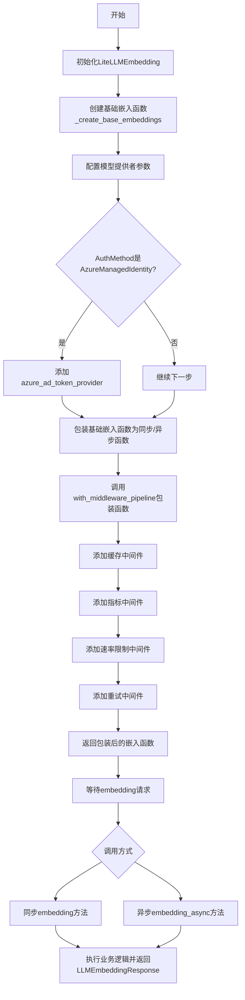
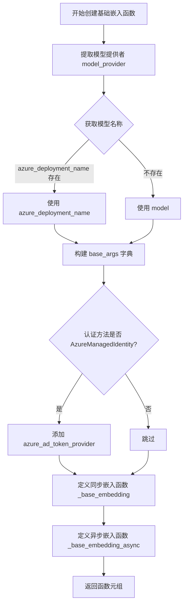
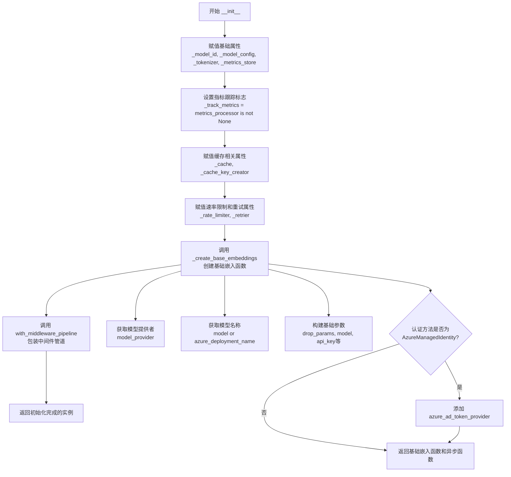
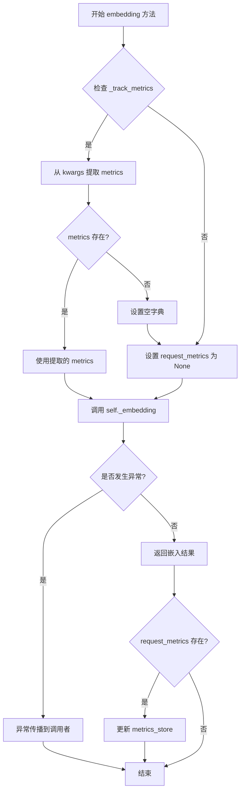
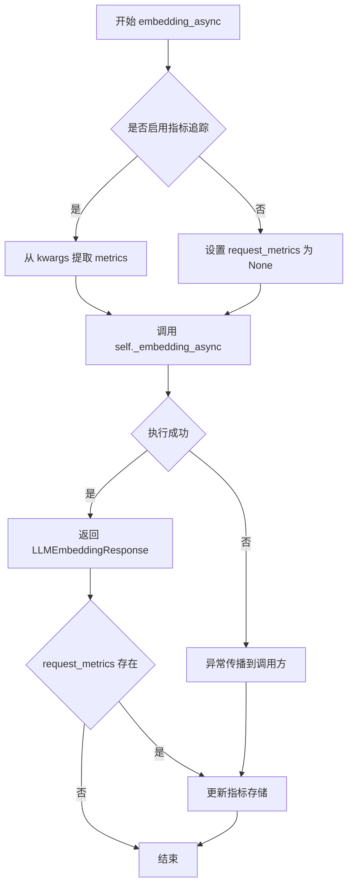
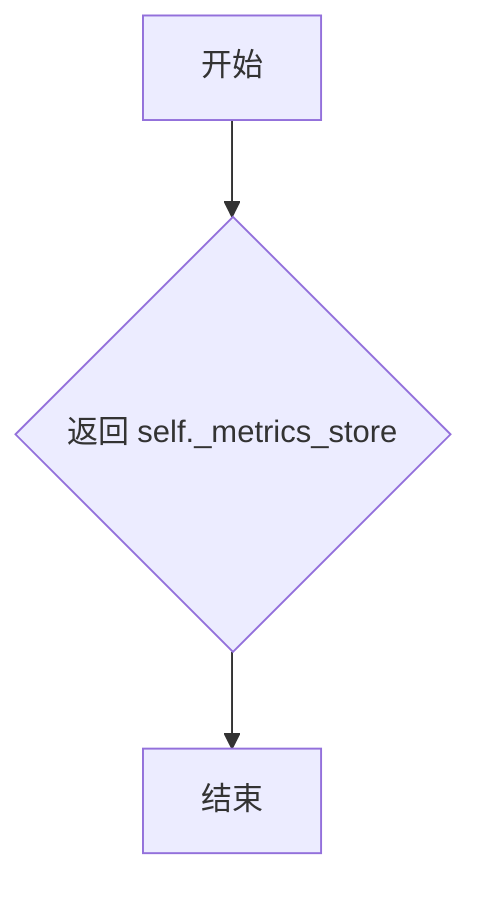
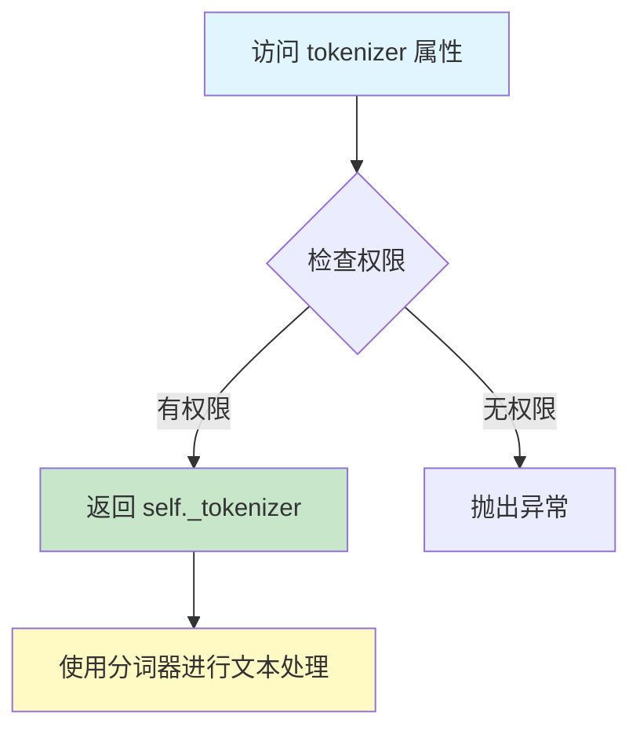

# `graphrag\packages\graphrag-llm\graphrag_llm\embedding\lite_llm_embedding.py` 详细设计文档

LiteLLMEmbedding是一个基于litellm的LLM嵌入实现类，提供了同步和异步的嵌入功能，集成了缓存、指标收集、速率限制和重试机制，支持Azure Managed Identity认证，并可通过中间件管道扩展功能。

## 整体流程



## 类结构

```
LLMEmbedding (抽象基类 - 来自graphrag_llm.embedding.embedding)
└── LiteLLMEmbedding (实现类)
```

## 全局变量及字段


### `litellm.suppress_debug_info`
    
litellm调试信息抑制标志

类型：`bool`
    


### `LiteLLMEmbedding._model_config`
    
模型配置

类型：`ModelConfig`
    


### `LiteLLMEmbedding._model_id`
    
模型标识符

类型：`str`
    


### `LiteLLMEmbedding._track_metrics`
    
是否跟踪指标

类型：`bool`
    


### `LiteLLMEmbedding._metrics_store`
    
指标存储

类型：`MetricsStore`
    


### `LiteLLMEmbedding._metrics_processor`
    
指标处理器

类型：`MetricsProcessor | None`
    


### `LiteLLMEmbedding._cache`
    
缓存实例

类型：`Cache | None`
    


### `LiteLLMEmbedding._cache_key_creator`
    
缓存键创建器

类型：`CacheKeyCreator`
    


### `LiteLLMEmbedding._tokenizer`
    
分词器

类型：`Tokenizer`
    


### `LiteLLMEmbedding._rate_limiter`
    
速率限制器

类型：`RateLimiter | None`
    


### `LiteLLMEmbedding._retrier`
    
重试策略

类型：`Retry | None`
    


### `LiteLLMEmbedding._embedding`
    
同步嵌入函数

类型：`LLMEmbeddingFunction`
    


### `LiteLLMEmbedding._embedding_async`
    
异步嵌入函数

类型：`AsyncLLMEmbeddingFunction`
    
    

## 全局函数及方法


### `_create_base_embeddings`

创建基础嵌入函数工厂，根据模型配置生成同步和异步的嵌入函数元组，用于调用 LiteLLM 的嵌入 API。

参数：

- `model_config`：`ModelConfig`，模型配置对象，包含模型提供者、模型名称、API 密钥、API 基础地址等配置信息
- `drop_unsupported_params`：`bool`，是否丢弃模型提供者不支持的参数
- `azure_cognitive_services_audience`：`str`，Azure 认知服务的令牌受众，用于 Azure Managed Identity 认证

返回值：`tuple[LLMEmbeddingFunction, AsyncLLMEmbeddingFunction]`，返回同步嵌入函数和异步嵌入函数组成的元组

#### 流程图



#### 带注释源码

```python
def _create_base_embeddings(
    *,
    model_config: "ModelConfig",
    drop_unsupported_params: bool,
    azure_cognitive_services_audience: str,
) -> tuple["LLMEmbeddingFunction", "AsyncLLMEmbeddingFunction"]:
    """Create base embedding functions.
    
    根据传入的模型配置创建基础的同步和异步嵌入函数。
    这些函数将作为 LiteLLM 嵌入调用的底层实现。
    
    Args:
        model_config: ModelConfig 对象，包含模型提供者、模型名称、API 配置等
        drop_unsupported_params: 是否丢弃不支持的参数，避免模型调用报错
        azure_cognitive_services_audience: Azure 认知服务的受众地址，用于获取托管身份令牌
    
    Returns:
        包含同步嵌入函数和异步嵌入函数的元组
    """
    # 从模型配置中提取模型提供者名称
    model_provider = model_config.model_provider
    # 优先使用 azure_deployment_name，否则使用 model 名称
    model = model_config.azure_deployment_name or model_config.model

    # 构建基础参数字典，包含通用的调用参数
    base_args: dict[str, Any] = {
        "drop_params": drop_unsupported_params,  # 是否丢弃不支持的参数
        "model": f"{model_provider}/{model}",    # 格式化的模型名称
        "api_key": model_config.api_key,         # API 密钥
        "api_base": model_config.api_base,      # API 基础地址
        "api_version": model_config.api_version, # API 版本
        **model_config.call_args,                # 额外的调用参数
    }

    # 如果使用 Azure Managed Identity 认证
    if model_config.auth_method == AuthMethod.AzureManagedIdentity:
        # 创建 Bearer 令牌提供程序，用于 Azure 托管身份认证
        base_args["azure_ad_token_provider"] = get_bearer_token_provider(
            DefaultAzureCredential(), azure_cognitive_services_audience
        )

    # 定义同步嵌入函数，内部调用 litellm.embedding
    def _base_embedding(**kwargs: Any) -> LLMEmbeddingResponse:
        # 移除 metrics 参数，避免传递给底层 LiteLLM 调用
        kwargs.pop("metrics", None)
        # 合并基础参数和动态参数
        new_args: dict[str, Any] = {**base_args, **kwargs}

        # 调用 LiteLLM 的嵌入接口
        response = litellm.embedding(**new_args)
        # 将响应转换为 LLMEmbeddingResponse 对象返回
        return LLMEmbeddingResponse(**response.model_dump())

    # 定义异步嵌入函数，内部调用 litellm.aembedding
    async def _base_embedding_async(**kwargs: Any) -> LLMEmbeddingResponse:
        # 移除 metrics 参数，避免传递给底层 LiteLLM 调用
        kwargs.pop("metrics", None)
        # 合并基础参数和动态参数
        new_args: dict[str, Any] = {**base_args, **kwargs}

        # 异步调用 LiteLLM 的嵌入接口
        response = await litellm.aembedding(**new_args)
        # 将响应转换为 LLMEmbeddingResponse 对象返回
        return LLMEmbeddingResponse(**response.model_dump())

    # 返回同步和异步嵌入函数元组
    return _base_embedding, _base_embedding_async
```


### `LiteLLMEmbedding.__init__`

初始化 LiteLLMEmbedding 实例，配置基于 litellm 的嵌入模型，包括模型配置、令牌器、指标存储、缓存、速率限制器和重试策略，同时创建同步和异步的嵌入函数并通过中间件管道进行包装。

参数：

- `model_id`：`str`，LiteLLM 模型 ID，例如 "openai/gpt-4o"
- `model_config`：`ModelConfig`，模型的配置对象
- `tokenizer`：`Tokenizer`，用于分词的令牌器
- `metrics_store`：`MetricsStore`，指标存储实例
- `metrics_processor`：`MetricsProcessor | None` = None，可选的指标处理器
- `rate_limiter`：`RateLimiter | None` = None，可选的速率限制器
- `retrier`：`Retry | None` = None，可选的重试策略
- `cache`：`Cache | None` = None，可选的缓存实例
- `cache_key_creator`：`CacheKeyCreator`，缓存键创建器
- `azure_cognitive_services_audience`：`str` = "https://cognitiveservices.azure.com/.default"，Azure 认知服务的受众地址
- `drop_unsupported_params`：`bool` = True，是否丢弃不支持的参数
- `**kwargs`：`Any`，额外的关键字参数

返回值：`None`，构造函数不返回值

#### 流程图



#### 带注释源码

```python
def __init__(
    self,
    *,
    model_id: str,
    model_config: "ModelConfig",
    tokenizer: "Tokenizer",
    metrics_store: "MetricsStore",
    metrics_processor: "MetricsProcessor | None" = None,
    rate_limiter: "RateLimiter | None" = None,
    retrier: "Retry | None" = None,
    cache: "Cache | None" = None,
    cache_key_creator: "CacheKeyCreator",
    azure_cognitive_services_audience: str = "https://cognitiveservices.azure.com/.default",
    drop_unsupported_params: bool = True,
    **kwargs: Any,
):
    """Initialize LiteLLMEmbedding.

    Args
    ----
        model_id: str
            The LiteLLM model ID, e.g., "openai/gpt-4o"
        model_config: ModelConfig
            The configuration for the model.
        tokenizer: Tokenizer
            The tokenizer to use.
        metrics_store: MetricsStore | None (default: None)
            The metrics store to use.
        metrics_processor: MetricsProcessor | None (default: None)
            The metrics processor to use.
        cache: Cache | None (default: None)
            An optional cache instance.
        cache_key_prefix: str | None (default: "chat")
            The cache key prefix. Required if cache is provided.
        rate_limiter: RateLimiter | None (default: None)
            The rate limiter to use.
        retrier: Retry | None (default: None)
            The retry strategy to use.
        azure_cognitive_services_audience: str (default: "https://cognitiveservices.azure.com/.default")
            The audience for Azure Cognitive Services when using Managed Identity.
        drop_unsupported_params: bool (default: True)
            Whether to drop unsupported parameters for the model provider.
    """
    # 赋值模型ID和模型配置
    self._model_id = model_id
    self._model_config = model_config
    # 赋值令牌器和指标相关对象
    self._tokenizer = tokenizer
    self._metrics_store = metrics_store
    self._metrics_processor = metrics_processor
    # 根据是否存在指标处理器来决定是否跟踪指标
    self._track_metrics = metrics_processor is not None
    # 赋值缓存相关属性
    self._cache = cache
    self._cache_key_creator = cache_key_creator
    # 赋值速率限制器和重试策略
    self._rate_limiter = rate_limiter
    self._retrier = retrier

    # 创建基础的同步和异步嵌入函数
    self._embedding, self._embedding_async = _create_base_embeddings(
        model_config=model_config,
        drop_unsupported_params=drop_unsupported_params,
        azure_cognitive_services_audience=azure_cognitive_services_audience,
    )

    # 使用中间件管道包装嵌入函数（添加缓存、指标、速率限制、重试等功能）
    self._embedding, self._embedding_async = with_middleware_pipeline(
        model_config=self._model_config,
        model_fn=self._embedding,
        async_model_fn=self._embedding_async,
        request_type="embedding",
        cache=self._cache,
        cache_key_creator=self._cache_key_creator,
        tokenizer=self._tokenizer,
        metrics_processor=self._metrics_processor,
        rate_limiter=self._rate_limiter,
        retrier=self._retrier,
    )
```


### `LiteLLMEmbedding.embedding`

同步嵌入方法，通过 LiteLLM 底层库执行嵌入请求，支持指标追踪和错误处理。

参数：

- `self`：隐式参数，`LiteLLMEmbedding` 实例，当前嵌入对象
- `/`：参数分隔符，表示其后的参数必须使用关键字参数形式
- `**kwargs`：`Unpack["LLMEmbeddingArgs"]`，可变关键字参数，接受 LLMEmbeddingArgs 类型定义的所有参数（如文本输入、模型参数等）

返回值：`LLMEmbeddingResponse`，嵌入操作的响应结果，包含嵌入向量和相关元数据

#### 流程图



#### 带注释源码

```python
def embedding(
    self, /, **kwargs: Unpack["LLMEmbeddingArgs"]
) -> "LLMEmbeddingResponse":
    """Sync embedding method."""
    # 从关键字参数中提取 metrics 参数，如果不存在则默认为空字典
    # metrics 用于跟踪嵌入请求的性能指标
    request_metrics: Metrics | None = kwargs.pop("metrics", None) or {}
    
    # 如果未启用指标跟踪（_track_metrics 为 False），则忽略传入的 metrics
    # 这可以减少不必要的指标收集开销
    if not self._track_metrics:
        request_metrics = None

    try:
        # 调用底层嵌入函数执行实际的嵌入计算
        # 传入 metrics 和其他关键字参数
        return self._embedding(metrics=request_metrics, **kwargs)
    finally:
        # 使用 try-finally 确保 metrics 总是被更新，即使发生异常
        # 这样可以保证指标数据的完整性
        if request_metrics:
            self._metrics_store.update_metrics(metrics=request_metrics)
```


### `LiteLLMEmbedding.embedding_async`

异步嵌入方法，通过 LiteLLM 库执行异步嵌入操作，支持指标追踪和中间件管道处理。

参数：

- `self`：隐式的 `LiteLLMEmbedding` 实例，当前类的引用
- `**kwargs`：`Unpack["LLMEmbeddingArgs"]`，可变关键字参数，接收 LLMEmbeddingArgs 类型解包的参数（如文本输入、模型参数等）

返回值：`LLMEmbeddingResponse`，嵌入操作的异步响应结果，包含嵌入向量和相关元数据

#### 流程图



#### 带注释源码

```python
async def embedding_async(
    self, /, **kwargs: Unpack["LLMEmbeddingArgs"]
) -> "LLMEmbeddingResponse":
    """Async embedding method.
    
    通过 LiteLLM 库的异步嵌入功能生成文本嵌入向量，
    支持指标收集和中间件管道处理。
    """
    # 从关键字参数中提取 metrics，若不存在则创建空字典
    request_metrics: Metrics | None = kwargs.pop("metrics", None) or {}
    
    # 如果未启用指标追踪，则忽略 metrics 以避免不必要的开销
    if not self._track_metrics:
        request_metrics = None

    try:
        # 调用经过中间件管道包装的异步嵌入函数
        # 传入 metrics 和其他用户提供的参数
        return await self._embedding_async(metrics=request_metrics, **kwargs)
    finally:
        # finally 块确保即使发生异常也会更新指标
        # 仅在 request_metrics 有效时更新指标存储
        if request_metrics:
            self._metrics_store.update_metrics(metrics=request_metrics)
```


### `LiteLLMEmbedding.metrics_store`

获取 `LiteLLMEmbedding` 类中存储的指标存储实例，用于访问和更新嵌入请求的指标数据。

参数：

- （无，此为属性方法不接受额外参数，`self` 为隐式实例引用）

返回值：`MetricsStore`，返回当前嵌入实例关联的指标存储对象。

#### 流程图



#### 带注释源码

```python
@property
def metrics_store(self) -> "MetricsStore":
    """Get metrics store."""
    return self._metrics_store
```

**代码说明：**

- `@property` 装饰器：将此方法转换为属性访问，使其可以通过 `instance.metrics_store` 而非 `instance.metrics_store()` 调用
- `self._metrics_store`：类实例的私有属性，在 `__init__` 方法中初始化并赋值
- 返回值类型 `MetricsStore`：类型注解表明返回的是一个 `MetricsStore` 对象引用
- 此属性为只读属性，仅提供对内部指标存储的访问权限，不允许外部修改内部状态


### `LiteLLMEmbedding.tokenizer` (property)

获取分词器，返回初始化时设置的 Tokenizer 实例，用于对文本进行分词处理。

参数：

- 无参数（属性访问）

返回值：`Tokenizer`，返回分词器实例，用于对输入文本进行编码和分词。

#### 流程图



#### 带注释源码

```python
@property
def tokenizer(self) -> "Tokenizer":
    """Get tokenizer."""
    return self._tokenizer
```

**源码说明：**

- `@property` 装饰器：将方法转换为属性，允许通过 `instance.tokenizer` 方式访问
- 返回类型：`"Tokenizer"` - 字符串前向引用，因为 `Tokenizer` 类型在 `TYPE_CHECKING` 块中导入
- `self._tokenizer`：类私有属性，在 `__init__` 方法中初始化，存储分词器实例
- 功能：直接返回内部存储的 `_tokenizer` 实例，供外部使用进行文本分词处理

## 关键组件


### LiteLLMEmbedding 类

基于litellm的LLMEmbedding实现类，负责同步和异步的嵌入向量生成，集成了缓存、重试、速率限制和指标收集等功能。

### _create_base_embeddings 函数

创建底层的同步和异步嵌入函数，根据模型配置构建litellm调用参数，支持Azure托管身份认证。

### 指标系统 (MetricsStore & MetricsProcessor)

用于收集和存储嵌入操作的性能指标，包括请求延迟、成功率等关键指标数据。

### 缓存系统 (Cache & CacheKeyCreator)

提供嵌入结果的缓存能力，通过CacheKeyCreator生成缓存键，避免重复计算。

### 速率限制器 (RateLimiter)

控制嵌入请求的频率，防止超过API调用限制。

### 重试机制 (Retry)

在嵌入请求失败时自动重试，提高系统的容错能力。

### 中间件管道 (with_middleware_pipeline)

将缓存、指标收集、速率限制和重试等横切关注点串联起来，形成统一的处理流程。

### Azure 托管身份认证

支持使用Azure的DefaultAzureCredential进行身份验证，实现安全的无密钥API访问。


## 问题及建议


### 已知问题

-   **缺少 `_embedding` 和 `_embedding_async` 字段声明**：类中使用了 `self._embedding` 和 `self._embedding_async`，但在类字段定义中未声明这两个属性，导致类型检查工具可能无法正确识别
-   **文档与实现不一致**：`__init__` 的文档字符串中提到了 `cache_key_prefix` 参数，但实际代码中接收的是 `cache_key_creator`，且默认值说明也不准确
-   **metrics 参数处理存在风险**：在 `_create_base_embeddings` 中使用 `kwargs.pop("metrics", None)` 直接移除 metrics 参数，但如果传入的 kwargs 中没有该键会返回 None 而非默认空字典，可能导致意外行为
- **错误处理不足**：`embedding` 和 `embedding_async` 方法没有 try-except 捕获异常，如果底层 litellm 调用失败，metrics 更新的 finally 块也会执行，可能导致嵌套异常
- **类型安全风险**：使用 `**response.model_dump()` 假设 litellm 返回的对象一定有 model_dump 方法，但没有验证响应类型或处理可能的 AttributeError
- **中间件初始化顺序**：先调用 `_create_base_embeddings` 创建基础 embedding 函数，再通过 `with_middleware_pipeline` 包装，这种两阶段赋值可能导致初始状态不一致

### 优化建议

-   **补充字段声明**：在类字段定义中添加 `_embedding: "LLMEmbeddingFunction"` 和 `_embedding_async: "AsyncLLMEmbeddingFunction"`
-   **统一文档和实现**：修正 `__init__` 的文档字符串，使其与实际参数 `cache_key_creator` 一致
-   **改进错误处理**：在 embedding 方法中添加 try-except 块，捕获并处理可能的异常，确保 metrics 更新在正确的上下文中执行
-   **添加响应验证**：在调用 litellm 后验证响应对象，确保具有 model_dump 方法或使用类型断言
-   **考虑使用 Pydantic 模型**：将 base_args 定义为 TypedDict 或 Pydantic 模型，提供更好的类型安全和自动补全
-   **日志记录**：添加适当的日志记录，以便在生产环境中调试和监控 embedding 调用

## 其它


### 设计目标与约束

本模块旨在提供统一的LLM Embedding能力，基于litellm库实现，支持多种模型提供商（如OpenAI、Azure等）。核心设计目标包括：1）通过中间件管道实现缓存、限流、重试等横切关注点的可插拔；2）支持同步和异步两种调用模式；3）提供Metrics收集能力以支持监控；4）支持Azure Managed Identity认证方式。约束条件包括依赖litellm库、需配合ModelConfig进行配置、缓存和指标功能为可选增强。

### 错误处理与异常设计

错误处理主要依赖litellm库自身的异常抛出机制。在embedding和embedding_async方法中，使用try-finally块确保metrics更新逻辑执行。当启用metrics时，方法末会调用_metrics_store.update_metrics更新指标数据；若发生异常，finally块仍会执行以保证指标不丢失。缓存、限流、重试等中间件组件各自处理其相关异常，如RateLimiter可能抛出速率超限异常，Retry组件处理重试逻辑。调用方需关注litellm.embedding和litellm.aembedding可能抛出的各类异常，包括认证失败、模型不支持、请求超时等。

### 数据流与状态机

同步数据流：调用embedding() -> 提取metrics参数 -> 调用self._embedding (经过middleware pipeline包装) -> litellm.embedding()调用 -> 返回LLMEmbeddingResponse -> 更新metrics -> 返回结果。异步数据流类似，使用embedding_async()和self._embedding_async。状态机主要涉及Middleware Pipeline的各阶段：缓存检查 -> 限流检查 -> 实际调用 -> 重试处理 -> 缓存写入（可选） -> metrics记录。

### 外部依赖与接口契约

核心依赖包括：litellm（统一的LLM调用库）、azure-identity（Azure身份认证）、graphrag_llm内部模块（config、embedding基类、middleware、types）、graphrag_cache（可选缓存）。接口契约方面，LLMEmbeddingResponse需符合types中定义的结构；LLMEmbeddingArgs通过类型解包传递参数；ModelConfig包含model_provider、azure_deployment_name、model、api_key、api_base、api_version、auth_method等配置字段。

### 安全性考虑

1）API密钥管理：api_key从ModelConfig传入，应通过安全方式配置（如环境变量、密钥管理器）；2）Azure认证：支持Azure Managed Identity，通过DefaultAzureCredential和get_bearer_token_provider实现无密钥访问；3）敏感信息处理：cache_key_creator生成缓存键时应避免包含敏感数据；4）依赖安全：依赖litellm库需关注其安全更新。

### 配置管理

配置通过ModelConfig类集中管理，必填项包括model_provider（模型提供商）、model（模型名），可选配置包括api_key、api_base、api_version、azure_deployment_name、call_args。LiteLLMEmbedding构造函数还接受azure_cognitive_services_audience、drop_unsupported_params等额外参数。配置应支持运行时动态调整（部分参数如rate_limiter、retrier可在实例化后修改）。

### 并发和线程安全性

_metrics_store.update_metrics在finally块中同步调用，需确保MetricsStore实现线程安全。self._embedding和self._embedding_async分别指向经过middleware pipeline包装的函数，middleware组件（如Cache、RateLimiter）需保证并发安全。RateLimiter通常需实现线程安全的限流逻辑。整体类设计为实例级无状态（状态存储在注入的组件中），并发安全性依赖于各组件的正确实现。

### 监控和可观测性

通过MetricsProcessor和MetricsStore实现监控能力。_track_metrics标志控制是否启用指标收集，当metrics_processor不为None时自动启用。embedding和embedding_async方法支持通过kwargs传递metrics参数，供调用方注入自定义指标。middleware_pipeline支持在各个阶段（缓存、限流、请求）记录指标。MetricsStore提供update_metrics方法用于指标聚合存储。

### 版本兼容性和演化考虑

1）litellm库版本兼容性：代码设置litellm.suppress_debug_info = True，需关注litellm版本升级带来的API变化；2）模型提供商适配：drop_unsupported_params参数用于处理不同提供商的参数兼容性问题；3）接口扩展：LLMEmbeddingArgs使用Unpack类型支持动态参数扩展；4）中间件扩展：with_middleware_pipeline支持添加新的中间件组件。

    