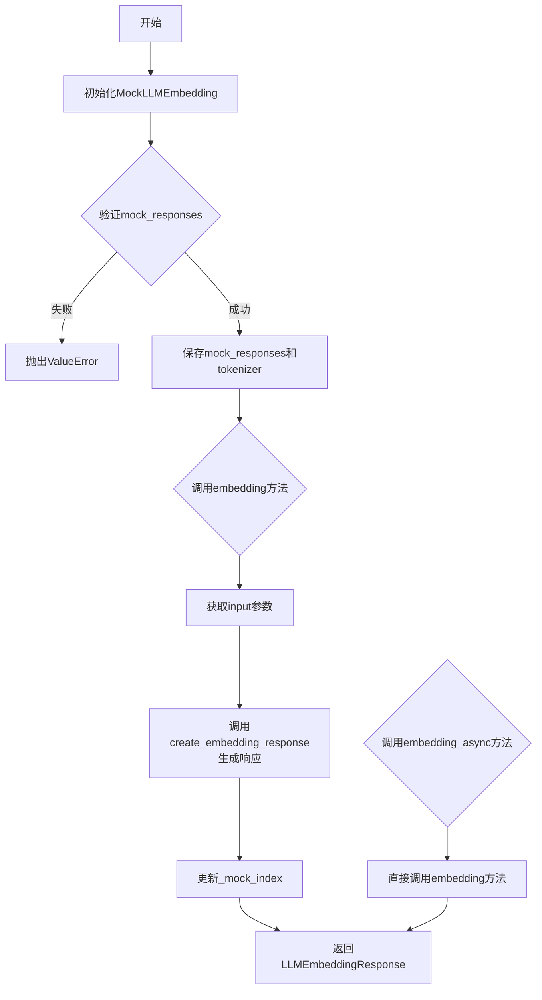
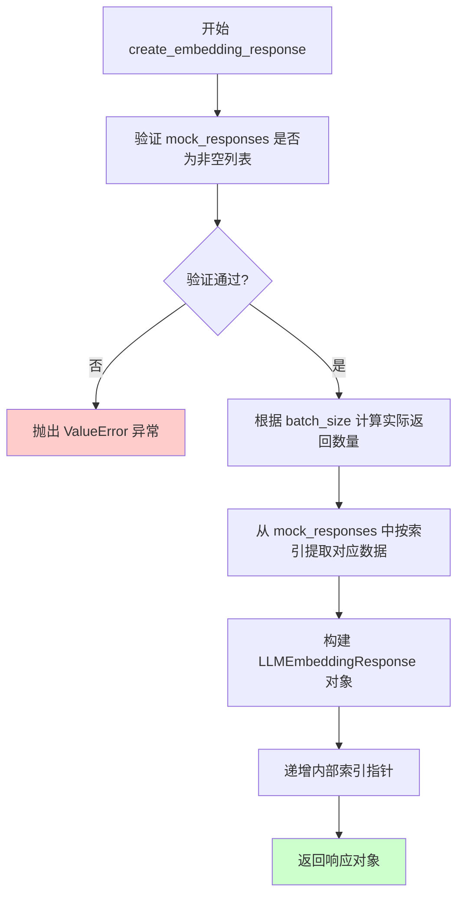
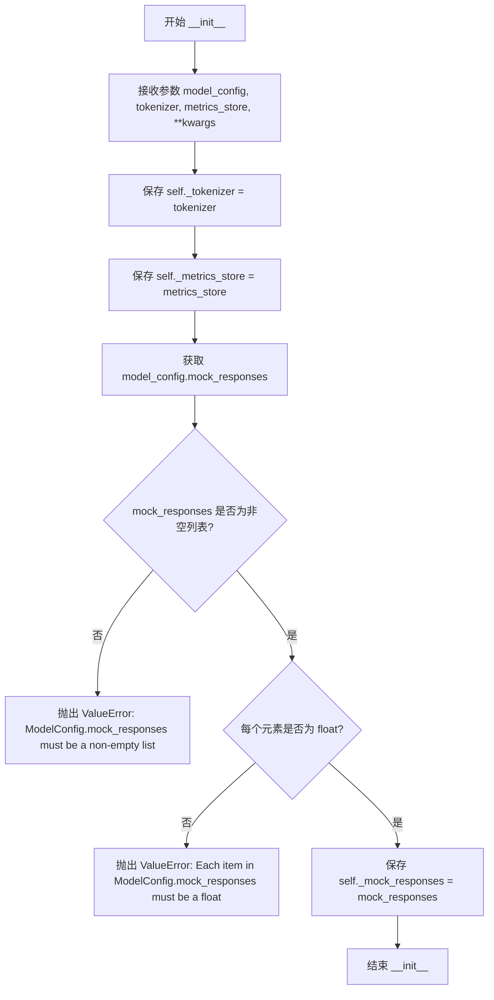
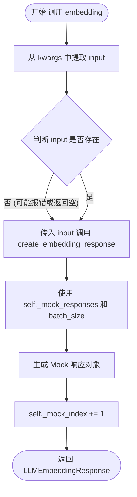
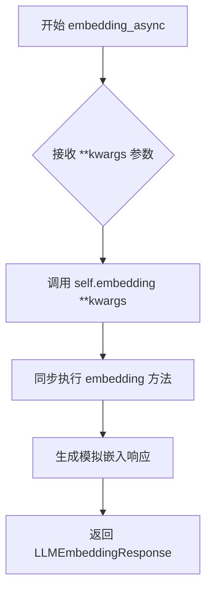
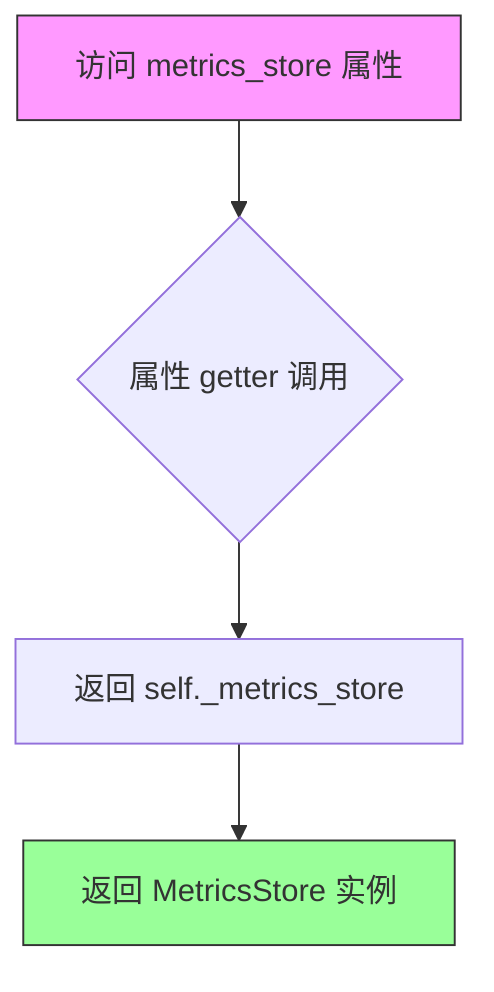
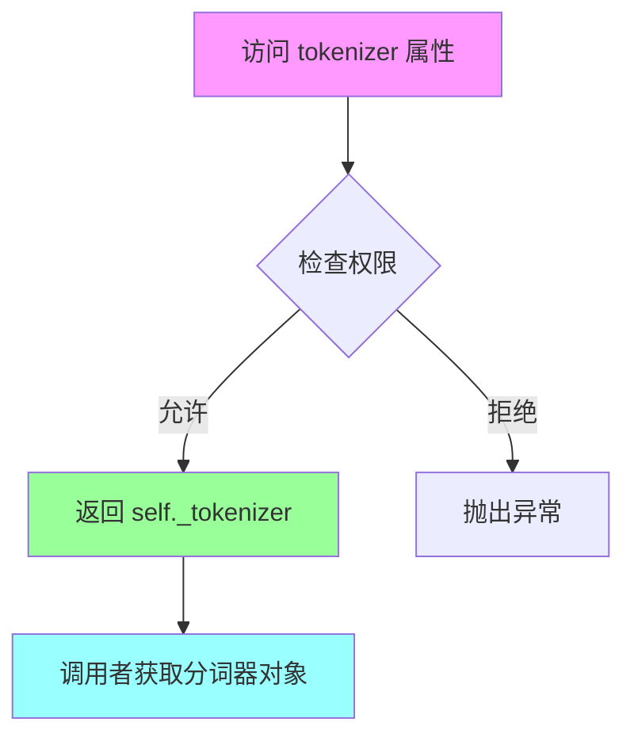

# `graphrag\packages\graphrag-llm\graphrag_llm\embedding\mock_llm_embedding.py` 详细设计文档

这是一个模拟LLM嵌入功能的实现类，继承自LLMEmbedding基类，用于在测试或开发环境中提供可控的嵌入向量响应，支持同步和异步两种嵌入调用方式。

## 整体流程



## 类结构

```
LLMEmbedding (抽象基类)
└── MockLLMEmbedding (实现类)
```

## 全局变量及字段


### `litellm`
    
外部LLM库，用于调用大语言模型

类型：`module`
    


### `TYPE_CHECKING`
    
类型检查标志，用于条件导入避免运行时循环依赖

类型：`bool`
    


### `LLMEmbedding`
    
基类，提供嵌入功能的抽象接口

类型：`class`
    


### `create_embedding_response`
    
工具函数，用于创建模拟的嵌入响应

类型：`function`
    


### `MockLLMEmbedding._metrics_store`
    
指标存储对象，用于记录和访问指标数据

类型：`MetricsStore`
    


### `MockLLMEmbedding._tokenizer`
    
分词器对象，用于文本分词处理

类型：`Tokenizer`
    


### `MockLLMEmbedding._mock_responses`
    
模拟嵌入响应列表，存储预设的嵌入向量用于测试

类型：`list[float]`
    


### `MockLLMEmbedding._mock_index`
    
当前模拟响应索引，记录已使用的模拟响应数量

类型：`int`
    
    

## 全局函数及方法


### `create_embedding_response`

创建模拟嵌入响应的工具函数，用于生成符合 `LLMEmbeddingResponse` 格式的模拟嵌入数据。

参数：

- `mock_responses`：`list[float]`，模拟嵌入向量的列表，提供预定义的嵌入值供函数返回
- `batch_size`：`int`，请求的嵌入向量批次大小，用于确定返回的向量数量

返回值：`LLMEmbeddingResponse`，返回一个模拟的嵌入响应对象，包含嵌入向量列表和元数据

#### 流程图



#### 带注释源码

```python
def create_embedding_response(
    mock_responses: list[float],  # 模拟嵌入向量列表
    batch_size: int  # 请求的批次大小
) -> "LLMEmbeddingResponse":
    """Create a mock embedding response.
    
    This utility function generates a simulated embedding response
    for testing purposes. It takes a list of pre-defined float values
    as mock embeddings and returns them wrapped in an LLMEmbeddingResponse
    object based on the requested batch size.
    
    Args:
        mock_responses: A list of float values representing mock embedding vectors.
        batch_size: The number of embedding vectors to return.
        
    Returns:
        LLMEmbeddingResponse: A response object containing the mock embeddings
            and metadata about the embedding operation.
            
    Raises:
        ValueError: If mock_responses is empty or not a list.
    """
    # Implementation would typically:
    # 1. Validate that mock_responses is a non-empty list
    # 2. Calculate how many vectors to return (min of batch_size and len(mock_responses))
    # 3. Cycle through mock_responses using an internal index
    # 4. Construct and return an LLMEmbeddingResponse with the selected vectors
    
    # Example response structure:
    # return LLMEmbeddingResponse(
    #     embeddings=[[mock_responses[i % len(mock_responses)]] for i in range(batch_size)],
    #     model="mock-embedding-model",
    #     usage={"prompt_tokens": 0, "total_tokens": 0}
    # )
```


### `MockLLMEmbedding.__init__`

初始化MockLLMEmbedding类，验证并保存模型配置、分词器和指标存储，同时检查mock_responses的有效性。

参数：

- `model_config`：`ModelConfig`，模型配置对象，包含mock_responses等配置信息
- `tokenizer`：`Tokenizer`，分词器对象，用于处理文本输入
- `metrics_store`：`MetricsStore`，指标存储对象，用于记录嵌入操作的指标
- `**kwargs`：`Any`，额外的关键字参数，用于扩展

返回值：`None`，构造函数不返回值

#### 流程图



#### 带注释源码

```python
def __init__(
    self,
    *,
    model_config: "ModelConfig",
    tokenizer: "Tokenizer",
    metrics_store: "MetricsStore",
    **kwargs: Any,
):
    """Initialize MockLLMEmbedding."""
    # 保存分词器实例到类属性
    self._tokenizer = tokenizer
    # 保存指标存储实例到类属性
    self._metrics_store = metrics_store

    # 从模型配置中获取 mock_responses
    mock_responses = model_config.mock_responses
    # 验证 mock_responses 是非空列表
    if not isinstance(mock_responses, list) or len(mock_responses) == 0:
        msg = "ModelConfig.mock_responses must be a non-empty list of embedding responses."
        raise ValueError(msg)

    # 验证 mock_responses 中的每个元素都是 float 类型
    if not all(isinstance(resp, float) for resp in mock_responses):
        msg = "Each item in ModelConfig.mock_responses must be a float."
        raise ValueError(msg)

    # 保存验证后的 mock_responses 到类属性
    self._mock_responses = mock_responses  # type: ignore
```


### `MockLLMEmbedding.embedding`

该方法是一个同步嵌入（Sync Embedding）实现，属于 `MockLLMEmbedding` 类。它接受任意关键字参数（通常包含待嵌入的文本输入），通过调用内部工具函数生成预设的模拟嵌入向量响应，并更新内部的模拟索引计数器。

参数：

- `self`：隐式参数，`MockLLMEmbedding` 类的实例本身。
- `**kwargs`：`Unpack["LLMEmbeddingArgs"]`，解包后的嵌入参数集合。该参数允许方法接受灵活的配置，其中核心关键参数为 `input`（待嵌入的文本列表）。
- `input` (存在于 kwargs 中)：`List[str]`，从 kwargs 中提取的输入数据。在代码中通过 `kwargs.get("input")` 获取，用于决定生成批处理响应的大小。

返回值：`LLMEmbeddingResponse`，返回一个包含模拟嵌入向量数据的响应对象。该对象由 `create_embedding_response` 工具函数构造。

#### 流程图



#### 带注释源码

```python
def embedding(
    self, /, **kwargs: Unpack["LLMEmbeddingArgs"]
) -> "LLMEmbeddingResponse":
    """Sync embedding method."""
    # 1. 从关键字参数中提取名为 'input' 的输入数据
    # input 通常是一个字符串列表，代表待嵌入的文本
    input = kwargs.get("input")
    
    # 2. 调用工具函数创建嵌入响应
    # 使用类初始化时保存的模拟响应列表 (_mock_responses)
    # batch_size 根据当前输入的长度动态决定，以模拟真实的批量嵌入场景
    response = create_embedding_response(
        self._mock_responses, batch_size=len(input)
    )
    
    # 3. 更新模拟索引，用于记录已生成的响应次数（虽然当前逻辑未使用此索引进行循环取值）
    self._mock_index += 1
    
    # 4. 返回生成的模拟嵌入响应对象
    return response
```


### `MockLLMEmbedding.embedding_async`

异步嵌入方法，通过委托模式调用同步的 `embedding` 方法来执行实际的嵌入逻辑，并返回嵌入响应结果。

参数：

- `self`：`MockLLMEmbedding`，MockLLMEmbedding 实例本身
- `**kwargs`：`Unpack[LLMEmbeddingArgs]`，可变关键字参数，包含嵌入操作的输入数据（如文本列表等）

返回值：`LLMEmbeddingResponse`，嵌入操作的响应结果，包含模拟的嵌入向量数据

#### 流程图



#### 带注释源码

```python
async def embedding_async(
    self, /, **kwargs: Unpack["LLMEmbeddingArgs"]
) -> "LLMEmbeddingResponse":
    """Async embedding method."""
    # 使用委托模式，将异步调用转发给同步的 embedding 方法
    # kwargs 包含嵌入操作的输入参数（如 input 文本列表）
    # 返回由 embedding 方法生成的 LLMEmbeddingResponse 对象
    return self.embedding(**kwargs)
```


### `MockLLMEmbedding.metrics_store`

获取指标存储属性，用于访问该嵌入器实例的指标存储对象。

参数：无（该属性不接受额外参数，`self` 为隐式参数）

返回值：`MetricsStore`，返回与当前嵌入器实例关联的指标存储对象

#### 流程图



#### 带注释源码

```python
@property
def metrics_store(self) -> "MetricsStore":
    """Get metrics store."""
    return self._metrics_store
```

**源码说明：**
- `@property` 装饰器：将该方法转换为属性，允许像访问字段一样访问此方法
- `self`：隐式参数，指向 MockLLMEmbedding 实例本身
- 返回类型 `MetricsStore`：类型注解，表明返回指标存储对象
- `self._metrics_store`：类实例变量，在构造函数 `__init__` 中被初始化并赋值
- 功能：提供对内部 `_metrics_store` 指标的只读访问，让外部调用者能够获取嵌入器使用的指标存储对象


### `MockLLMEmbedding.tokenizer`

获取分词器属性，返回当前实例关联的分词器（Tokenizer）对象。

参数： 无

返回值：`Tokenizer`，返回该嵌入实例所配置的分词器，用于对输入文本进行分词处理。

#### 流程图



#### 带注释源码

```python
@property
def tokenizer(self) -> "Tokenizer":
    """Get tokenizer.
    
    返回当前MockLLMEmbedding实例关联的分词器对象。
    该分词器在实例初始化时通过构造函数注入，
    用于对输入文本进行token化处理。
    
    Returns:
        Tokenizer: 与此嵌入实例关联的分词器
    """
    return self._tokenizer
```

## 关键组件


### MockLLMEmbedding 类

MockLLMEmbedding 是一个模拟 LLM 嵌入向量的测试类，继承自 LLMEmbedding 基类，用于在开发和测试环境中生成可控的嵌入结果，而无需调用真实的 LLM 服务。

### _mock_responses 列表

存储预设的模拟嵌入向量响应列表，每个元素为 float 类型的嵌入维度值，用于在调用 embedding 时返回预定义的向量结果。

### _mock_index 索引跟踪器

整型计数器，用于追踪当前返回到第几个 mock 响应，支持顺序返回不同的预设嵌入向量。

### embedding 方法

同步嵌入方法，接收输入文本，通过 create_embedding_response 从预设的 mock_responses 中生成嵌入向量，并递增索引后返回响应对象。

### embedding_async 方法

异步嵌入方法，内部直接调用同步的 embedding 方法并返回结果，提供了异步接口以保持与基类的一致性。

### metrics_store 属性

返回 MetricsStore 实例，用于记录和存储嵌入操作的性能指标，如延迟、吞吐量等。

### tokenizer 属性

返回 Tokenizer 实例，用于对输入文本进行分词处理，获取输入的 token 数量和批次大小信息。

### 验证逻辑

在初始化时检查 mock_responses 必须为非空列表，且所有元素必须为 float 类型，确保数据合法性否则抛出 ValueError 异常。


## 问题及建议


### 已知问题

- `_mock_index` 在类属性中声明为 `int = 0`，但未在 `__init__` 方法中显式初始化，可能导致实例状态不一致
- `_mock_index` 变量被递增但从未被实际使用来从 `_mock_responses` 中选择对应的响应，当前逻辑使用 `batch_size=len(input)` 替代，存在逻辑缺陷
- `_tokenizer` 在 `__init__` 中被赋值但在整个类中未被使用，造成资源浪费
- `**kwargs: Any` 在 `__init__` 方法中接收但未使用，属于死代码
- `embedding_async` 方法并非真正的异步实现，只是同步调用 `embedding` 方法，未体现异步设计意图
- `create_embedding_response` 函数的调用使用了 `batch_size=len(input)`，但未验证 `input` 是否为 `None` 或空列表，可能导致运行时错误
- 使用 `# type: ignore` 绕过类型检查，掩盖了潜在的类型安全问题
- `litellm.suppress_debug_info = True` 在模块级别修改全局状态，可能对同一进程中的其他代码产生副作用
- 缺少对 `LLMEmbedding` 父类方法的完整实现或重写，可能导致多态行为不一致
- 未实现 `embedding` 方法的参数验证（如 `input` 参数的存在性和类型检查）

### 优化建议

- 在 `__init__` 方法中显式初始化 `self._mock_index = 0`，确保实例状态清晰
- 使用 `_mock_index` 正确地从 `_mock_responses` 中按索引选择响应，或移除 `_mock_index` 字段如果确实不需要
- 移除未使用的 `_tokenizer` 字段，或在后续功能中使用它
- 移除 `__init__` 中的 `**kwargs` 参数，或将其传递给父类
- 实现真正的异步逻辑，例如使用 `asyncio.sleep` 模拟异步行为，或使用 `aiohttp` 等异步 HTTP 客户端
- 在 `embedding` 方法中添加输入验证：`if not input: raise ValueError("input cannot be None or empty")`
- 移除 `# type: ignore`，通过正确的类型声明解决类型问题
- 将 `litellm.suppress_debug_info = True` 封装在配置类中，或提供开关控制，减少全局副作用
- 添加完整的文档字符串，说明类的作用、字段含义和方法行为
- 考虑实现上下文管理器协议（`__enter__` 和 `__exit__`）以支持资源管理

## 其它


### 设计目标与约束

本模块旨在提供一个模拟的嵌入层实现，用于测试和开发环境，避免实际调用外部LLM服务。约束包括：mock_responses必须为非空float列表，继承自LLMEmbedding基类，保持与真实嵌入服务相同的接口契约。

### 错误处理与异常设计

初始化时检查mock_responses类型，若非list或为空则抛出ValueError，错误信息为"ModelConfig.mock_responses must be a non-empty list of embedding responses."；若列表元素非float则抛出ValueError，错误信息为"Each item in ModelConfig.mock_responses must be a float."。embedding方法假设input存在，不做空值检查。

### 数据流与状态机

数据流：调用方传入input参数（文本列表）→embedding方法提取input→create_embedding_response生成响应→返回LLMEmbeddingResponse。状态机：_mock_index用于跟踪已使用的mock响应数量，仅在同步方法中递增，异步方法调用同步方法但不改变状态。

### 外部依赖与接口契约

依赖graphrag_llm.embedding.embedding.LLMEmbedding基类、graphrag_llm.utils.create_embedding_response工具函数、litellm库（用于抑制调试信息）、typing模块。接口契约：继承LLMEmbedding，需实现embedding和embedding_async方法，以及metrics_store和tokenizer属性。

### 配置说明

ModelConfig.mock_responses：必需配置项，类型为list[float]，非空，用于提供预设的嵌入向量响应。

### 使用示例

```python
model_config = ModelConfig(mock_responses=[0.1, 0.2, 0.3])
tokenizer = Tokenizer()
metrics_store = MetricsStore()
mock_embedding = MockLLMEmbedding(
    model_config=model_config,
    tokenizer=tokenizer,
    metrics_store=metrics_store
)
response = mock_embedding.embedding(input=["test text"])
```

### 线程安全与并发考虑

_mock_index为实例变量，非线程安全。若多线程同时调用embedding方法，可能出现索引竞争问题。异步方法embedding_async直接委托给同步方法，无独立状态管理。

### 版本兼容性

依赖Python typing模块的Unpack特性（PEP 646），需Python 3.12+或from __future__ import annotations。

### 测试策略

应覆盖：正常初始化、mock_responses为空列表异常、mock_responses含非float元素异常、embedding返回响应结构、embedding_async返回响应结构、多次调用索引递增行为。


    