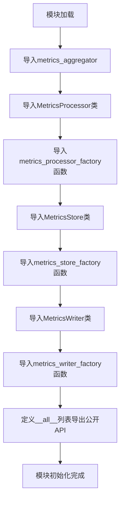
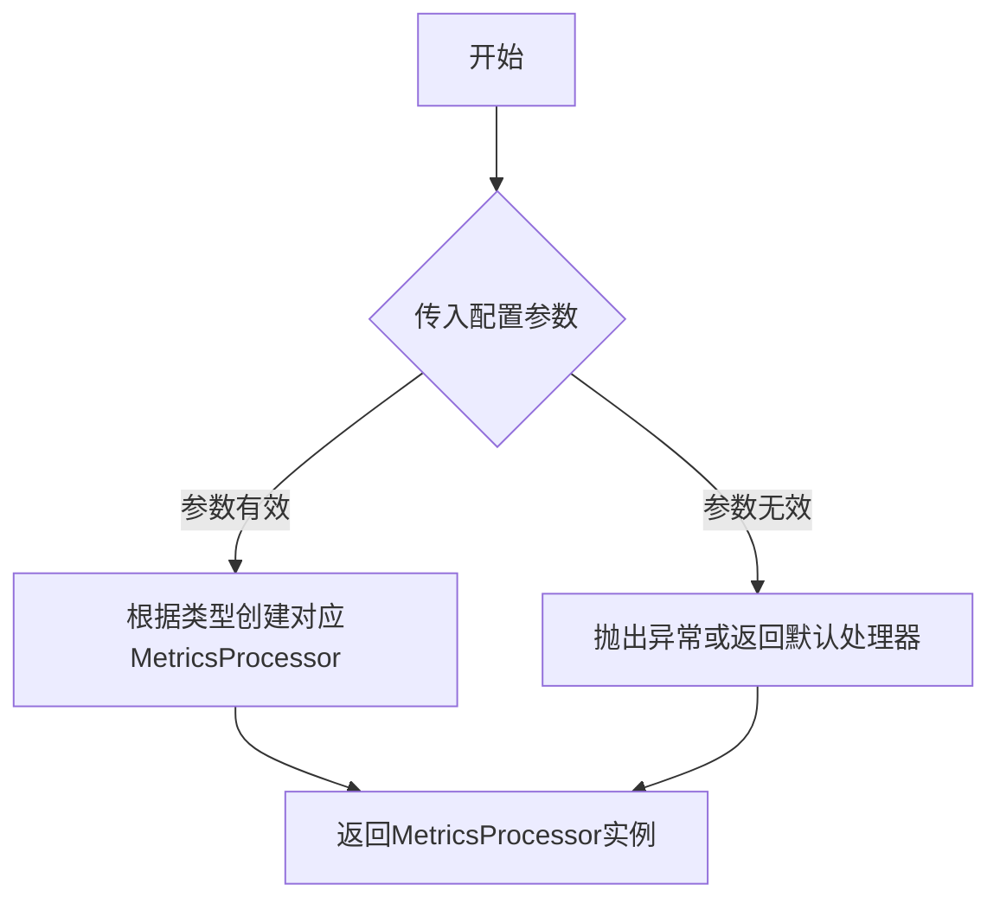
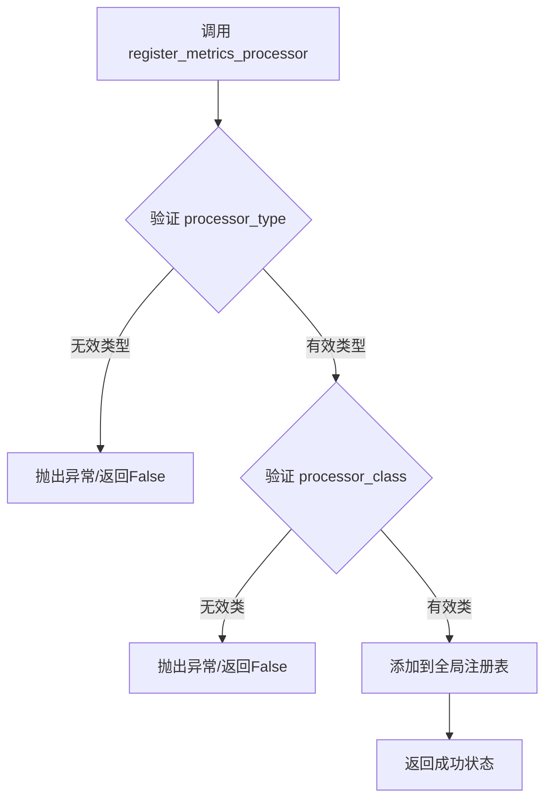
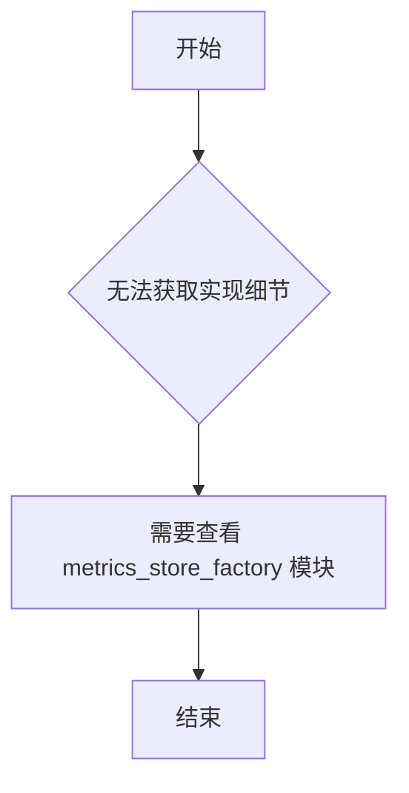
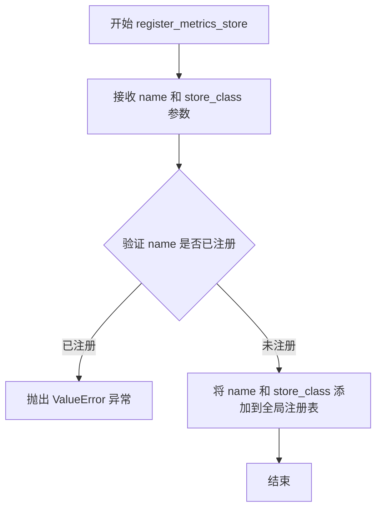
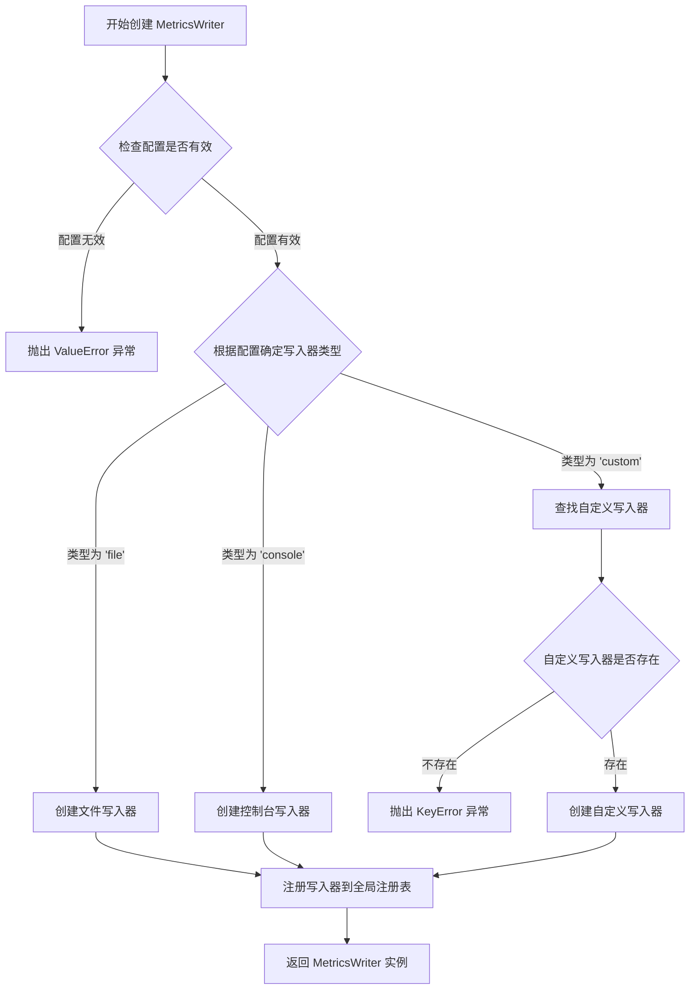
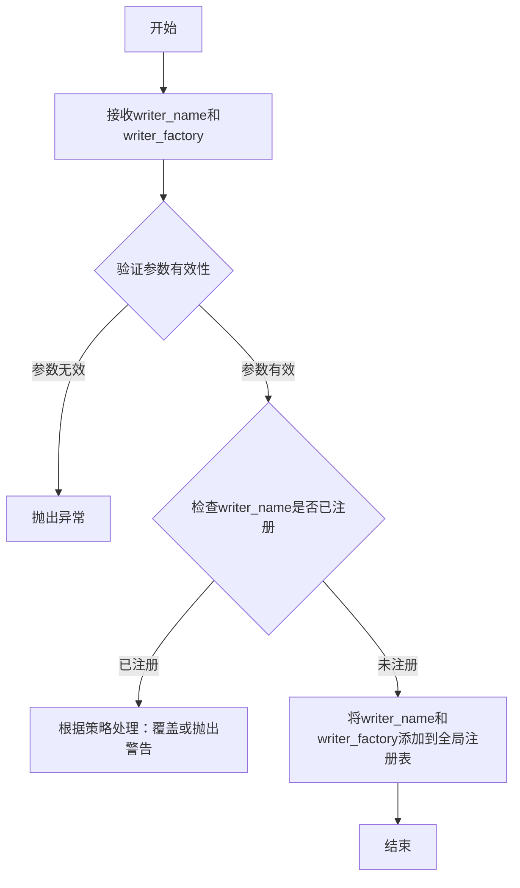

# `graphrag\packages\graphrag-llm\graphrag_llm\metrics\__init__.py` 详细设计文档

这是graphrag-llm项目的metrics模块入口文件，负责导入和导出metrics相关的核心类（MetricsProcessor、MetricsStore、MetricsWriter）、工厂函数（create_metrics_processor、create_metrics_store、create_metrics_writer）以及注册函数（register_metrics_processor、register_metrics_store、register_metrics_writer），同时还导出metrics_aggregator聚合器，为外部提供统一的metrics处理API接口。

## 整体流程



## 类结构

```
metrics (包)
├── __init__.py (模块入口)
├── metrics_aggregator.py
├── metrics_processor.py
├── metrics_processor_factory.py
├── metrics_store.py
├── metrics_store_factory.py
├── metrics_writer.py
└── metrics_writer_factory.py
```

## 全局变量及字段


### `metrics_aggregator`
    
全局指标聚合器实例，用于收集和聚合各类性能指标数据

类型：`MetricsAggregator`
    


    

## 全局函数及方法


### `create_metrics_processor`

该函数是一个工厂函数，用于创建指标处理器（MetricsProcessor）的实例。它在 `metrics_processor_factory` 模块中定义，虽然在当前代码片段中仅作为导入展示，但其核心功能是根据配置或参数生成相应的处理器实例。

#### 流程图



#### 带注释源码

```python
# 当前代码片段为 __init__.py，仅展示 create_metrics_processor 的导入
# 实际实现位于 graphrag_llm.metrics.metrics_processor_factory 模块中

from graphrag_llm.metrics.metrics_processor_factory import (
    create_metrics_processor,  # 从工厂模块导入创建函数
    register_metrics_processor,
)

# 该函数通常具有以下特征（基于工厂模式推断）：
# - 函数名: create_metrics_processor
# - 参数: 可能有配置字典、处理器类型等参数
# - 返回值: MetricsProcessor 实例
# - 功能: 根据参数类型创建对应的指标处理器
```

> **注意**：当前提供的代码片段是 `__init__.py` 文件，仅包含导入语句。`create_metrics_processor` 函数的具体实现位于 `graphrag_llm.metrics.metrics_processor_factory` 模块中，该实现未在当前代码片段中提供。如需获取完整的函数实现源码，请参考 `metrics_processor_factory.py` 文件。


### `register_metrics_processor`

注册指标处理器到工厂注册表中，支持动态扩展指标处理能力。

参数：

- `processor_type`：`str`，处理器的类型标识符，用于在注册表中唯一标识该处理器
- `processor_class`：`Type[MetricsProcessor]` 或 `Callable`，具体的指标处理器类或可调用对象

返回值：`None` 或 `bool`，通常无返回值或返回注册是否成功

#### 流程图



#### 带注释源码

```python
# 从模块导入声明中提取
# 该函数定义在 graphrag_llm.metrics.metrics_processor_factory 模块中
from graphrag_llm.metrics.metrics_processor_factory import (
    create_metrics_processor,
    register_metrics_processor,
)

# __all__ 导出列表中也包含该函数
__all__ = [
    # ...
    "register_metrics_processor",
    # ...
]

# 注意：由于提供的代码仅为导入和导出部分，
# 实际的 register_metrics_processor 函数实现位于：
# graphrag_llm/metrics/metrics_processor_factory.py 模块中
#
# 典型实现模式如下（基于工厂模式推断）：
#
# _PROCESSORS_REGISTRY = {}  # 全局注册表字典
#
# def register_metrics_processor(processor_type: str, processor_class: Type[MetricsProcessor]):
#     """
#     注册指标处理器
#     
#     Args:
#         processor_type: 处理器类型标识符
#         processor_class: 处理器类
#     """
#     _PROCESSORS_REGISTRY[processor_type] = processor_class
#
# def create_metrics_processor(processor_type: str, *args, **kwargs):
#     """
#     根据类型创建指标处理器实例
#     """
#     if processor_type not in _PROCESSORS_REGISTRY:
#         raise ValueError(f"Unknown processor type: {processor_type}")
#     return _PROCESSORS_REGISTRY[processor_type](*args, **kwargs)
```


### `create_metrics_store`

该函数是指标存储工厂方法，用于根据配置创建相应类型的指标存储实例。

**注意**：当前代码片段仅包含该函数的导入和导出语句，函数的实际实现位于 `graphrag_llm.metrics.metrics_store_factory` 模块中。

#### 参数

- **无法从当前代码片段确定**：当前提供的代码仅包含模块级导入语句，未展示 `create_metrics_store` 函数的完整签名和实现。

#### 返回值

- **无法从当前代码片段确定**：需要查看 `graphrag_llm.metrics.metrics_store_factory` 模块的实现以获取返回值类型和描述。

#### 流程图



#### 带注释源码

```python
# 从 metrics_store_factory 模块导入 create_metrics_store 函数
from graphrag_llm.metrics.metrics_store_factory import (
    create_metrics_store,
    register_metrics_store,
)

# 将 create_metrics_store 添加到模块的公共接口
__all__ = [
    # ... 其他导出
    "create_metrics_store",
    # ...
]

# 提示：完整的函数实现需要查看 graphrag_llm/metrics/metrics_store_factory.py 文件
```

---

**补充说明**：当前提供的代码片段是一个**模块入口文件**（通常为 `__init__.py`），其主要功能是聚合并导出该包中的关键类和函数。`create_metrics_store` 函数的具体参数、返回值以及业务逻辑实现位于 `graphrag_llm.metrics.metrics_store_factory` 模块中。建议查阅该源文件以获取完整的函数设计文档。


### `register_metrics_store`

该函数是 MetricsStore 的注册函数，用于将自定义的指标存储类型注册到全局注册表中，以便通过 `create_metrics_store` 工厂函数动态创建相应的指标存储实例。

参数：

- `name`：`str`，要注册的指标存储类型的标识名称
- `store_class`：`type`，实现了 MetricsStore 接口的存储类

返回值：`None`，无返回值（注册操作）

#### 流程图



#### 带注释源码

```
# 该函数定义在 graphrag_llm.metrics.metrics_store_factory 模块中
# 此处仅为调用点的导入声明，函数实际定义需查看 metrics_store_factory.py

from graphrag_llm.metrics.metrics_store_factory import (
    create_metrics_store,
    register_metrics_store,
)

# register_metrics_store 函数用于注册自定义的 MetricsStore 实现类
# 参数 name: 存储类型的唯一标识符
# 参数 store_class: 继承自 MetricsStore 基类的具体实现类
# 返回值: 无返回值，执行注册操作后将 store_class 存入全局注册表
```


### `create_metrics_writer`

该函数是 MetricsWriter 的工厂函数，用于根据配置创建相应类型的 MetricsWriter 实例，支持不同输出目标的指标写入。

参数：

- `config`：`Dict[str, Any]`，写入器配置参数，包含类型、输出路径等配置信息
- `name`：`Optional[str]`，写入器名称，用于标识和注册，默认为 None

返回值：`MetricsWriter`，返回创建的指标写入器实例

#### 流程图



#### 带注释源码

```
def create_metrics_writer(config: Dict[str, Any], name: Optional[str] = None) -> MetricsWriter:
    """
    创建 MetricsWriter 实例的工厂函数。
    
    根据配置中的 'type' 字段确定要创建的写入器类型，
    支持文件写入器、控制台写入器和自定义写入器。
    
    Args:
        config: 包含写入器配置的字典，必须包含 'type' 字段
               支持的类型: 'file', 'console', 或已注册的自定义类型
        name: 可选的写入器名称，用于注册到全局注册表
    
    Returns:
        创建的 MetricsWriter 实例
    
    Raises:
        ValueError: 配置无效或缺少必要字段
        KeyError: 指定的写入器类型未注册
    """
    # 获取写入器类型，默认为 'console'
    writer_type = config.get('type', 'console')
    
    # 验证配置有效性
    if not isinstance(config, dict):
        raise ValueError("配置必须是一个字典")
    
    # 从注册表中获取对应类型的工厂函数
    if writer_type not in _metrics_writer_registry:
        raise KeyError(f"未知的写入器类型: {writer_type}，请先注册")
    
    # 调用对应的工厂函数创建写入器
    writer_factory = _metrics_writer_registry[writer_type]
    writer = writer_factory(config)
    
    # 如果提供了名称，注册到全局注册表
    if name:
        register_metrics_writer(name, writer)
    
    return writer
```


### register_metrics_writer

该函数是指标写入器工厂模块中的注册函数，用于将自定义的指标写入器（MetricsWriter）注册到全局注册表中，以便后续可以通过工厂函数创建相应的写入器实例。

参数：

- `writer_name`：`str`，指标写入器的唯一标识名称，用于在注册表中查找和区分不同的写入器实现
- `writer_factory`：`Callable[[], MetricsWriter]` 或 `Type[MetricsWriter]`，用于创建指标写入器实例的工厂函数或写入器类

返回值：`None`，该函数仅执行注册操作，不返回任何值

#### 流程图



#### 带注释源码

由于提供的代码仅为模块的 `__init__.py` 文件，未包含 `register_metrics_writer` 函数的具体实现。该函数定义在 `graphrag_llm.metrics.metrics_writer_factory` 模块中。以下为基于常见工厂模式的推断代码：

```python
# 假设的实现（在 metrics_writer_factory.py 中）
from typing import Callable, Dict, Type
from graphrag_llm.metrics.metrics_writer import MetricsWriter

# 全局注册表，用于存储已注册的指标写入器
_METRICS_WRITER_REGISTRY: Dict[str, Type[MetricsWriter] | Callable[[], MetricsWriter]] = {}

def register_metrics_writer(
    writer_name: str, 
    writer_factory: Type[MetricsWriter] | Callable[[], MetricsWriter]
) -> None:
    """
    注册指标写入器到全局注册表。
    
    Args:
        writer_name: 写入器的唯一标识名称
        writer_factory: 写入器类或工厂函数
    
    Returns:
        None
    """
    if writer_name in _METRICS_WRITER_REGISTRY:
        # 如果已存在，可选择覆盖或抛出警告
        import warnings
        warnings.warn(f"MetricsWriter '{writer_name}' 已被注册，将被覆盖")
    
    # 注册写入器
    _METRICS_WRITER_REGISTRY[writer_name] = writer_factory
```

#### 备注

根据提供的 `__init__.py` 代码，`register_metrics_writer` 函数是从 `graphrag_llm.metrics.metrics_writer_factory` 模块导入并重新导出的。如需查看完整的实现细节，请参考该模块的源代码文件。


## 关键组件


### MetricsProcessor

负责处理和转换指标数据的核心类

### MetricsStore

负责存储指标数据的持久化组件

### MetricsWriter

负责将指标数据写入到指定输出目标的组件

### metrics_aggregator

负责聚合多个指标数据并生成汇总结果的模块

### create_metrics_processor

用于创建MetricsProcessor实例的工厂函数

### create_metrics_store

用于创建MetricsStore实例的工厂函数

### create_metrics_writer

用于创建MetricsWriter实例的工厂函数

### register_metrics_processor

用于注册自定义MetricsProcessor实现到系统的注册函数

### register_metrics_store

用于注册自定义MetricsStore实现到系统的注册函数

### register_metrics_writer

用于注册自定义MetricsWriter实现到系统的注册函数


## 问题及建议


### 已知问题

-   **模块粒度过粗**：__init__.py 直接暴露了大量内部实现细节（工厂函数、聚合器实例），不符合"接口隔离"原则，调用者可能依赖了不该依赖的内部组件
-   **缺乏模块文档**：该 __init__.py 没有模块级别的 docstring，无法快速了解 metrics 模块的核心职责和使用方式
-   **混合导出类型**：同时导出了类（MetricsProcessor/Store/Writer）、单例实例（metrics_aggregator）和工厂函数，API 使用方式不统一，增加了学习成本
-   **潜在的循环导入风险**：大量从子模块导入实现类，若后续子模块间存在依赖关系，可能触发循环导入问题
-   **缺少类型注解和错误处理说明**：未提供类型提示，工厂函数可能抛出的异常也没有明确文档

### 优化建议

-   **精简导出内容**：仅在 __all__ 中暴露必要的公共接口（如 MetricsProcessor、MetricsStore、MetricsWriter），将工厂函数下沉到子模块或单独的 factory 子模块
-   **添加模块文档**：补充模块级别的 docstring，说明 metrics 模块的职责、典型使用场景和核心组件关系
-   **统一 API 风格**：考虑将工厂函数统一为类方法或提供一致的调用模式，避免混合使用实例和静态工厂
-   **增加类型注解**：为导入和导出添加类型注解，提升 IDE 支持和代码可维护性
-   **抽取工厂层**：可考虑将 create_* 和 register_* 函数统一放置在独立的 factory.py 或 factory 子包中，降低主模块的耦合度

## 其它


### 设计目标与约束

该metrics模块旨在为graphrag-llm提供统一的指标处理、存储和写入能力，支持灵活的指标处理器、存储后端和写入器的插件式架构。设计约束包括：需兼容Python 3.8+环境，遵循MIT许可协议，必须通过工厂模式和注册机制支持第三方扩展。

### 错误处理与异常设计

模块应定义自定义异常类如MetricsProcessorError、MetricsStoreError、MetricsWriterError，用于处理各组件初始化失败、数据写入失败、配置错误等场景。所有工厂方法和注册方法应捕获底层异常并转换为模块特定异常，同时提供原始错误信息以便调试。

### 数据流与状态机

指标数据流遵循以下路径：指标数据输入 → MetricsProcessor处理 → MetricsStore存储 → MetricsWriter写出。MetricsAggregator负责聚合多个处理器的结果。整体采用单向数据流设计，状态主要保存在MetricsStore中，支持内存和持久化两种存储模式。

### 外部依赖与接口契约

模块依赖graphrag_llm.metrics包下的子模块：metrics_aggregator、metrics_processor、metrics_processor_factory、metrics_store、metrics_store_factory、metrics_writer、metrics_writer_factory。所有导出函数遵循统一的工厂函数签名（create_*）和注册函数签名（register_*），返回类型需符合各组件的抽象接口规范。

### 性能考虑

应支持批量处理指标数据以减少IO开销，MetricsStore需提供连接池或缓存机制，MetricsWriter应支持异步写入。工厂函数和注册函数可考虑添加缓存逻辑避免重复创建相同配置的组件。

### 安全性考虑

若指标数据包含敏感信息，MetricsWriter需支持数据脱敏或加密。存储后端应支持访问控制配置，所有配置项需避免硬编码敏感凭证，应通过环境变量或安全配置中心获取。

### 扩展性设计

采用工厂模式+注册机制支持自定义处理器、存储后端和写入器。新增指标类型只需实现对应接口并注册，无需修改核心代码。建议提供抽象基类定义标准接口规范，确保插件兼容性。

### 测试策略

单元测试应覆盖所有导出函数和类的正常/异常路径，集成测试验证完整数据流，mock外部依赖进行隔离测试。建议使用pytest框架，包含工厂函数参数验证、注册机制线程安全性、存储后端兼容性等测试用例。

### 版本兼容性

当前代码标记为Copyright 2024 Microsoft Corporation，需遵循MIT License。后续版本迭代应保持接口向后兼容，若需破坏性变更应在版本号中体现（如v2.0.0），并提供迁移指南。

### 命名规范

所有导出名称遵循snake_case命名规范，类名使用PascalCase。工厂函数前缀create_，注册函数前缀register_，与Python社区惯例保持一致。模块级__all__列表明确指定公开API。

### 日志设计

建议在关键操作点添加日志：工厂函数调用时记录参数和结果，注册函数执行时记录组件注册信息，数据写入时记录成功/失败状态和数量。日志级别遵循Python logging模块标准，DEBUG用于详细流程，INFO用于关键里程碑，ERROR用于异常情况。

### 配置设计

建议支持通过配置文件或环境变量配置默认的处理器类型、存储后端和写入器。配置项应包括：默认存储路径、写入缓冲区大小、批量处理阈值、连接超时时间等。配置 schema 应在文档中明确说明。

    