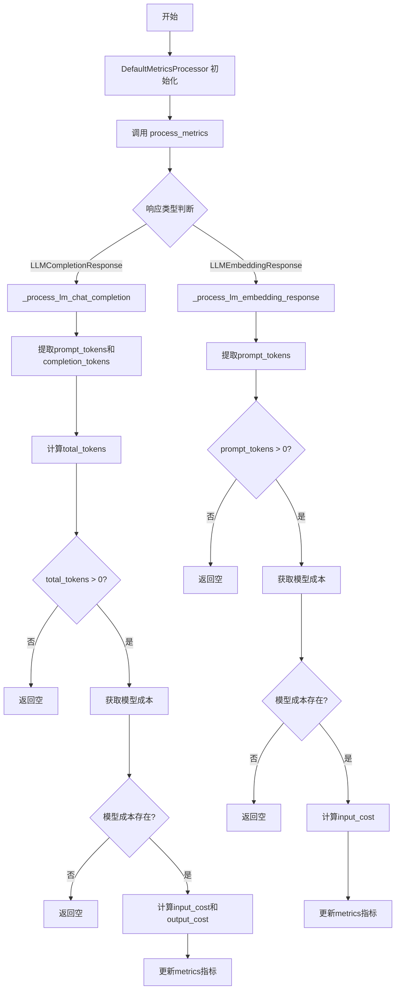
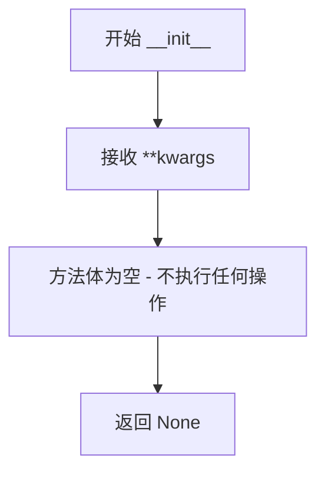
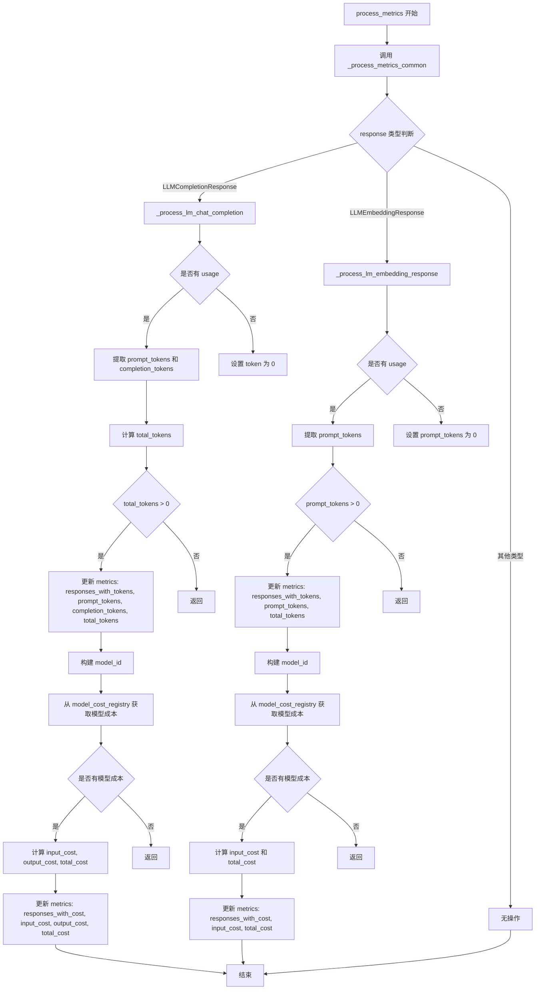
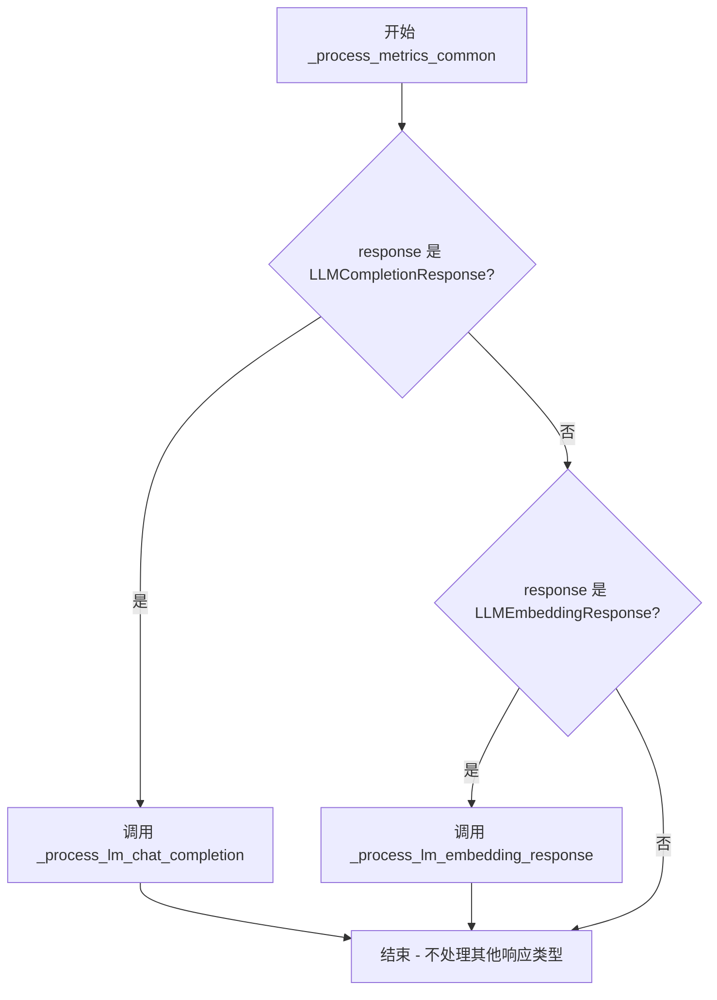
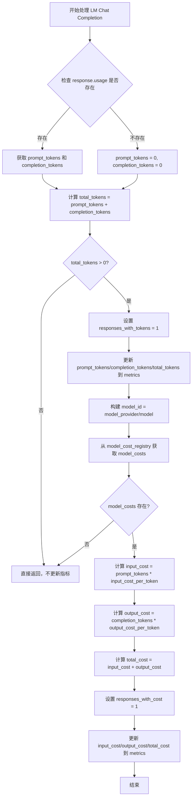
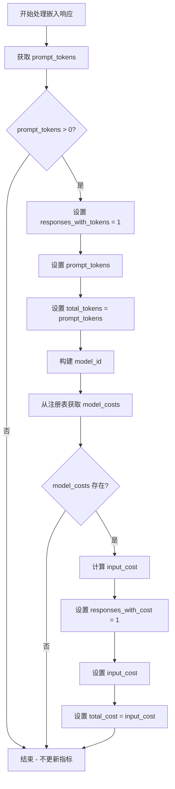

# `graphrag\packages\graphrag-llm\graphrag_llm\metrics\default_metrics_processor.py` 详细设计文档

默认的指标处理器，负责解析LLM响应中的token使用情况，并根据模型成本注册表计算对应的API调用成本，支持聊天补全和嵌入两种响应类型的指标处理。

## 整体流程



## 类结构

```
MetricsProcessor (抽象基类)
└── DefaultMetricsProcessor
```

## 全局变量及字段


### `TYPE_CHECKING`
    
用于条件导入的类型检查标志，避免运行时导入类型提示

类型：`bool`
    


### `MetricsProcessor`
    
指标处理器的基类，DefaultMetricsProcessor继承自此类

类型：`Type[MetricsProcessor]`
    


### `model_cost_registry`
    
模型成本注册表实例，用于获取不同模型的token费用信息

类型：`ModelCostRegistry`
    


### `LLMCompletionResponse`
    
LLM完成响应的类型定义，用于处理同步响应

类型：`Type[LLMCompletionResponse]`
    


### `LLMEmbeddingResponse`
    
LLM嵌入响应的类型定义，用于处理嵌入请求响应

类型：`Type[LLMEmbeddingResponse]`
    


### `AsyncIterator`
    
异步迭代器类型提示（仅在TYPE_CHECKING块中使用）

类型：`Type[AsyncIterator]`
    


### `Iterator`
    
同步迭代器类型提示（仅在TYPE_CHECKING块中使用）

类型：`Type[Iterator]`
    


### `ModelConfig`
    
模型配置类型提示（仅在TYPE_CHECKING块中使用）

类型：`Type[ModelConfig]`
    


### `LLMCompletionChunk`
    
LLM完成块类型提示，用于流式响应（仅在TYPE_CHECKING块中使用）

类型：`Type[LLMCompletionChunk]`
    


### `Metrics`
    
指标字典类型提示（仅在TYPE_CHECKING块中使用）

类型：`Type[Metrics]`
    


    

## 全局函数及方法


### `DefaultMetricsProcessor.__init__`

初始化默认指标处理器，该方法接受任意关键字参数但不执行任何操作，是一个空实现的初始化方法。

参数：

- `**kwargs`：`Any`，可选的关键字参数，用于接受任意数量的命名参数（当前版本中未使用）

返回值：`None`，无返回值

#### 流程图



#### 带注释源码

```python
def __init__(self, **kwargs: Any) -> None:
    """Initialize DefaultMetricsProcessor."""
    # 该方法是一个空实现，不执行任何初始化逻辑
    # **kwargs: 接受任意关键字参数，但在此类中未使用
    # 返回类型: None，表示无返回值
    pass  # 方法体为空
```


### DefaultMetricsProcessor.process_metrics

该方法是默认的指标处理器，负责解析 LLM 响应中的使用量数据（如 token 数量），并根据模型成本计算实际费用，最终将相关指标更新到 metrics 字典中。

参数：

- `model_config`：`ModelConfig`，模型配置对象，包含模型提供商和模型名称等信息
- `metrics`：`Metrics`，指标字典，用于存储处理后的指标数据
- `input_args`：`dict[str, Any]`，输入参数字典，包含调用 LLM 时传递的参数
- `response`：`LLMCompletionResponse | Iterator[LLMCompletionChunk] | AsyncIterator[LLMCompletionChunk] | LLMEmbeddingResponse`，LLM 的响应对象，可能是同步/异步完成响应或嵌入响应

返回值：`None`，该方法直接修改传入的 `metrics` 字典，不返回任何值

#### 流程图



#### 带注释源码

```python
def process_metrics(
    self,
    *,
    model_config: "ModelConfig",
    metrics: "Metrics",
    input_args: dict[str, Any],
    response: "LLMCompletionResponse \
        | Iterator[LLMCompletionChunk] \
        | AsyncIterator[LLMCompletionChunk] \
        | LLMEmbeddingResponse",
) -> None:
    """处理指标数据.
    
    该方法是 DefaultMetricsProcessor 的主要入口点,负责将 LLM 响应中的
    使用量信息(如 token 数量)转换为可追踪的指标,并计算相应的成本费用.
    
    参数:
        model_config: 模型配置,包含 model_provider 和 model 等信息
        metrics: 指标字典,用于存储处理后的指标数据(原地修改)
        input_args: 调用 LLM 时传递的输入参数
        response: LLM 的响应对象,支持多种类型:
            - LLMCompletionResponse: 同步完成响应
            - Iterator[LLMCompletionChunk]: 同步流式响应迭代器
            - AsyncIterator[LLMCompletionChunk]: 异步流式响应迭代器
            - LLMEmbeddingResponse: 嵌入响应
    
    返回:
        None: 直接修改 metrics 字典,不返回值
    """
    # 委托给通用处理方法,根据 response 类型分发到具体的处理逻辑
    self._process_metrics_common(
        model_config=model_config,
        metrics=metrics,
        input_args=input_args,
        response=response,
    )
```


### `DefaultMetricsProcessor._process_metrics_common`

该方法是一个私有方法，用于根据响应类型（LLMCompletionResponse 或 LLMEmbeddingResponse）分发给相应的处理方法进行指标计算。它首先检查响应的具体类型，然后调用对应的私有方法 `_process_lm_chat_completion` 或 `_process_lm_embedding_response` 来处理不同的响应类型。

参数：

- `model_config`：`ModelConfig`，模型配置对象，包含模型提供商和模型名称等信息
- `metrics`：`Metrics`，度量指标字典，用于存储各种指标数据（如 token 数量、成本等）
- `input_args`：`dict[str, Any]`，输入参数字典，包含调用 LLM 时传入的参数
- `response`：`LLMCompletionResponse | Iterator[LLMCompletionChunk] | AsyncIterator[LLMCompletionChunk] | LLMEmbeddingResponse`，LLM 响应对象，可以是同步/异步的完成响应或嵌入响应

返回值：`None`，该方法不返回任何值，直接修改 `metrics` 字典

#### 流程图



#### 带注释源码

```python
def _process_metrics_common(
    self,
    *,
    model_config: "ModelConfig",
    metrics: "Metrics",
    input_args: dict[str, Any],
    response: "LLMCompletionResponse \
        | Iterator[LLMCompletionChunk] \
        | AsyncIterator[LLMCompletionChunk] \
        | LLMEmbeddingResponse",
) -> None:
    """处理通用的指标计算，根据响应类型分发到对应的处理方法。
    
    参数:
        model_config: 模型配置对象，包含模型提供商和模型名称
        metrics: 度量指标字典，用于记录各类指标数据
        input_args: 调用 LLM 时传入的输入参数
        response: LLM 的响应对象，支持多种类型
    
    返回:
        None: 直接修改 metrics 字典，不返回任何值
    """
    # 检查响应是否为 LLM 完成响应类型（包括同步/异步迭代器）
    if isinstance(response, LLMCompletionResponse):
        # 调用处理聊天完成响应的方法
        self._process_lm_chat_completion(
            model_config=model_config,
            metrics=metrics,
            input_args=input_args,
            response=response,
        )
    # 检查响应是否为 LLM 嵌入响应类型
    elif isinstance(response, LLMEmbeddingResponse):
        # 调用处理嵌入响应的方法
        self._process_lm_embedding_response(
            model_config=model_config,
            metrics=metrics,
            input_args=input_args,
            response=response,
        )
    # 注意：Iterator[LLMCompletionChunk] 和 AsyncIterator[LLMCompletionChunk]
    # 在此处不会被特殊处理，它们会被忽略
```


### `DefaultMetricsProcessor._process_lm_chat_completion`

该方法用于处理 LLM 聊天完成响应的指标计算，包括 token 统计和成本计算，并将结果更新到 metrics 字典中。

参数：

- `model_config`：`ModelConfig`，模型配置对象，包含模型提供商和模型名称等信息
- `metrics`：`Metrics`，指标字典，用于存储计算后的指标数据
- `input_args`：`dict[str, Any]`，输入参数字典，包含调用 LLM 时传入的参数
- `response`：`LLMCompletionResponse`，LLM 完成响应对象，包含 usage 信息等

返回值：`None`，该方法无返回值，通过直接修改 `metrics` 字典来输出结果

#### 流程图



#### 带注释源码

```python
def _process_lm_chat_completion(
    self,
    model_config: "ModelConfig",
    metrics: "Metrics",
    input_args: dict[str, Any],
    response: "LLMCompletionResponse",
) -> None:
    """Process LMChatCompletion metrics."""
    # 从响应中获取 prompt tokens 数量，如果 usage 不存在则默认为 0
    prompt_tokens = response.usage.prompt_tokens if response.usage else 0
    # 从响应中获取 completion tokens 数量，如果 usage 不存在则默认为 0
    completion_tokens = response.usage.completion_tokens if response.usage else 0
    # 计算总 token 数量
    total_tokens = prompt_tokens + completion_tokens

    # 仅在有 token 消耗时更新指标
    if total_tokens > 0:
        # 标记有响应的请求
        metrics["responses_with_tokens"] = 1
        # 记录各类 token 数量到指标字典
        metrics["prompt_tokens"] = prompt_tokens
        metrics["completion_tokens"] = completion_tokens
        metrics["total_tokens"] = total_tokens

        # 构建模型标识符，格式为 "provider/model"
        model_id = f"{model_config.model_provider}/{model_config.model}"
        # 从成本注册表获取该模型的计费信息
        model_costs = model_cost_registry.get_model_costs(model_id)

        # 如果未找到该模型的计费信息，直接返回
        if not model_costs:
            return

        # 计算输入成本：prompt tokens 乘以每 token 输入单价
        input_cost = prompt_tokens * model_costs["input_cost_per_token"]
        # 计算输出成本：completion tokens 乘以每 token 输出单价
        output_cost = completion_tokens * model_costs["output_cost_per_token"]
        # 计算总成本
        total_cost = input_cost + output_cost

        # 标记有成本产生的响应
        metrics["responses_with_cost"] = 1
        # 将各项成本记录到指标字典
        metrics["input_cost"] = input_cost
        metrics["output_cost"] = output_cost
        metrics["total_cost"] = total_cost
```


### `DefaultMetricsProcessor._process_lm_embedding_response`

处理 LLM 嵌入响应（Embedding Response）的指标数据，包括 token 使用统计和成本计算。

参数：

- `model_config`：`ModelConfig`，模型配置，包含模型提供商和模型名称信息
- `metrics`：`Metrics`，指标字典，用于存储计算后的指标数据
- `input_args`：`dict[str, Any]`，输入参数字典
- `response`：`LLMEmbeddingResponse`，嵌入响应对象，包含 usage 信息

返回值：`None`，该方法直接修改 metrics 字典，不返回任何值

#### 流程图



#### 带注释源码

```python
def _process_lm_embedding_response(
    self,
    model_config: "ModelConfig",
    metrics: "Metrics",
    input_args: dict[str, Any],
    response: "LLMEmbeddingResponse",
) -> None:
    """Process LLMEmbeddingResponse metrics."""
    # 从响应中获取 prompt_tokens，如果 usage 不存在则默认为 0
    prompt_tokens = response.usage.prompt_tokens if response.usage else 0

    # 只有当存在有效的 prompt_tokens 时才更新指标
    if prompt_tokens > 0:
        # 设置 token 相关的指标
        metrics["responses_with_tokens"] = 1  # 标记有 token 使用的响应
        metrics["prompt_tokens"] = prompt_tokens  # 记录 prompt token 数量
        metrics["total_tokens"] = prompt_tokens  # 总 token 数等于 prompt token 数

        # 构建模型标识符，格式为 "provider/model"
        model_id = f"{model_config.model_provider}/{model_config.model}"
        
        # 从成本注册表获取该模型的计费信息
        model_costs = model_cost_registry.get_model_costs(model_id)

        # 如果没有找到该模型的计费信息，则直接返回
        if not model_costs:
            return

        # 计算输入成本（嵌入模型通常只计算输入成本）
        input_cost = prompt_tokens * model_costs["input_cost_per_token"]
        
        # 设置成本相关的指标
        metrics["responses_with_cost"] = 1  # 标记有成本信息的响应
        metrics["input_cost"] = input_cost  # 记录输入成本
        metrics["total_cost"] = input_cost  # 总成本等于输入成本
```

## 关键组件


### DefaultMetricsProcessor 类

默认指标处理器，实现 MetricsProcessor 接口，负责处理 LLM 调用过程中的指标收集与成本计算，支持聊天完成和嵌入响应两种类型的指标处理。

### process_metrics 方法

公共入口方法，接收模型配置、指标字典、输入参数和 LLM 响应，然后调用内部方法进行统一处理，支持同步/异步迭代器和嵌入响应等多种响应类型。

### _process_metrics_common 方法

分发方法，根据响应类型（LLMCompletionResponse 或 LLMEmbeddingResponse）将处理任务分发给对应的专用处理方法，实现响应类型的路由分发。

### _process_lm_chat_completion 方法

聊天完成响应处理器，提取响应中的 prompt_tokens 和 completion_tokens，计算总 token 数，并结合 model_cost_registry 获取模型单价计算输入成本、输出成本和总成本，将结果写入 metrics 字典。

### _process_lm_embedding_response 方法

嵌入响应处理器，处理 LLMEmbeddingResponse 类型的响应，提取 prompt_tokens 并结合模型单价计算输入成本和总成本，更新 metrics 字典。

### model_cost_registry 全局变量

模型成本注册表，提供模型单价查询功能，包含 input_cost_per_token 和 output_cost_per_token 等成本字段，用于 LLM 调用的成本估算。


## 问题及建议


### 已知问题

-   **`__init__`方法接收未使用的`**kwargs`**：构造函数接受任意关键字参数但未使用，导致接口语义不清晰。
-   **未处理`Iterator`和`AsyncIterator`类型**：`_process_metrics_common`方法声明接受`Iterator[LLMCompletionChunk]`和`AsyncIterator[LLMCompletionChunk]`类型，但实际只处理了`LLMCompletionResponse`，存在类型与实现不匹配的问题。
-   **未使用的`input_args`参数**：多个方法接收`input_args`参数但从未使用，造成接口污染。
-   **缺少错误处理**：当`model_cost_registry.get_model_costs`返回`None`时直接return，没有日志记录；`response.usage`可能为`None`的场景虽有处理但缺乏明确的错误上下文。
-   **硬编码的metrics键名**：metrics键名（如`"responses_with_tokens"`、`"prompt_tokens"`等）以字符串形式硬编码，容易出现拼写错误且难以维护。
-   **代码重复**：`_process_lm_chat_completion`和`_process_lm_embedding_response`中获取model_id和model_costs的逻辑重复，可以抽象公共逻辑。

### 优化建议

-   移除`__init__`中未使用的`**kwargs`参数，或在文档中说明其预留用途。
-   补充`Iterator`和`AsyncIterator`类型的处理逻辑，或在类型注解中移除这些类型以保持一致性。
-   移除所有方法中未使用的`input_args`参数，保持接口简洁。
-   添加错误处理和日志记录，例如当`model_costs`为空时记录警告日志。
-   提取metrics键名为常量或枚举类（如`MetricsKeys`），集中管理以减少硬编码字符串。
-   抽取公共逻辑：将`model_id`构造和`model_costs`获取逻辑提取为私有方法，减少代码重复。

## 其它


### 设计目标与约束

设计目标是为 LLM 调用提供默认的指标处理能力，支持统计 token 使用量和计算调用成本。该处理器作为 MetricsProcessor 的默认实现，主要职责是根据 LLM 响应中的 usage 信息计算 token 数量和费用。设计约束包括：必须继承 MetricsProcessor 基类、支持同步和异步响应处理、依赖 model_cost_registry 获取模型定价信息、metrics 字典采用键值对形式存储指标数据。

### 错误处理与异常设计

当 model_cost_registry.get_model_costs(model_id) 返回 None 或空值时，方法直接 return，不记录成本相关指标。当 response.usage 为 None 时，token 数量默认为 0，不抛出异常。当 total_tokens 小于等于 0 时，不更新 metrics 字典中的任何指标。当前实现未处理 model_config 或 model 为 None 的边界情况，也未处理 model_cost_registry 抛出异常的场景。

### 数据流与状态机

数据流向：首先调用 process_metrics 方法，接收 model_config、metrics 字典、input_args 和 response 参数。然后根据 response 的类型分发到 _process_metrics_common 方法进行类型判断。对于 LLMCompletionResponse 类型，调用 _process_lm_chat_completion 方法处理。对于 LLMEmbeddingResponse 类型，调用 _process_lm_embedding_response 方法处理。最终将计算得到的 token 数量和成本更新到传入的 metrics 字典中。该过程无状态机设计，属于纯函数式的数据转换逻辑。

### 外部依赖与接口契约

该类依赖以下外部组件：MetricsProcessor 基类（来自 graphrag_llm.metrics.metrics_processor），定义了 process_metrics 接口方法；model_cost_registry（来自 graphrag_llm.model_cost_registry），提供 get_model_costs(model_id) 方法返回模型定价字典；LLMCompletionResponse、LLMEmbeddingResponse、LLMCompletionChunk 类型（来自 graphrag_llm.types），定义了响应数据结构；ModelConfig 类型（来自 graphrag_llm.config），定义了模型配置结构；Metrics 类型（来自 graphrag_llm.types），定义为 dict[str, Any]。接口契约要求 process_metrics 方法接收特定参数并直接修改传入的 metrics 字典，无返回值。

### 性能考虑与优化空间

当前实现为 O(1) 复杂度，主要操作包括类型判断、字典访问和数值计算。优化空间包括：model_id 字符串拼接（f"{model_config.model_provider}/{model_config.model}"）可以缓存；model_costs 查询可以使用局部变量减少多次查询；如果 metrics 字典更新频繁，可以考虑使用批量更新而非单键赋值；当前每次调用都会访问 model_cost_registry，可以考虑在类初始化时缓存常用模型的定价信息。

### 安全性考虑

该代码不涉及用户数据处理或敏感信息存储。潜在安全风险包括：model_config.model 和 model_config.model_provider 未进行输入验证，可能导致字符串格式化问题；model_costs 字典的键名（input_cost_per_token、output_cost_per_token）未做空值检查，如果 model_cost_registry 返回不完整的字典可能导致 KeyError；metrics 字典直接接受外部传入，存在被恶意修改的风险。建议在访问 model_costs 字典键之前使用 .get() 方法并设置默认值。

### 配置说明

DefaultMetricsProcessor 的构造函数 __init__ 接受 **kwargs: Any 参数，当前实现中未使用任何参数。这是为了保持与可能需要传递额外配置参数的子类的兼容性。配置约束：kwargs 中传递的任何参数都会被忽略，该处理器不维护任何内部状态。

### 使用示例

```python
# 创建处理器实例
processor = DefaultMetricsProcessor()

# 准备 metrics 字典
metrics = {}

# 模拟 LLMCompletionResponse
response = LLMCompletionResponse(
    model="gpt-4",
    choices=[],
    usage=UsageInfo(prompt_tokens=100, completion_tokens=50)
)

# 调用处理方法
processor.process_metrics(
    model_config=ModelConfig(model="gpt-4", model_provider="openai"),
    metrics=metrics,
    input_args={},
    response=response
)

# 处理后 metrics 包含:
# {
#     "responses_with_tokens": 1,
#     "prompt_tokens": 100,
#     "completion_tokens": 50,
#     "total_tokens": 150,
#     "responses_with_cost": 1,
#     "input_cost": 0.01,
#     "output_cost": 0.03,
#     "total_cost": 0.04
# }
```

### 版本历史与变更记录

该代码文件版权为 Microsoft Corporation，许可证为 MIT License。代码位于 graphrag_llm 包名下，属于 graphrag_llm 项目的 metrics 模块。初始版本提供了基本的 token 统计和成本计算功能，支持 LLMCompletionResponse 和 LLMEmbeddingResponse 两种响应类型的处理。


    