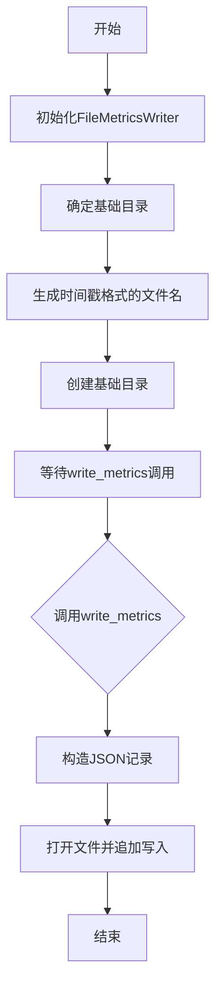
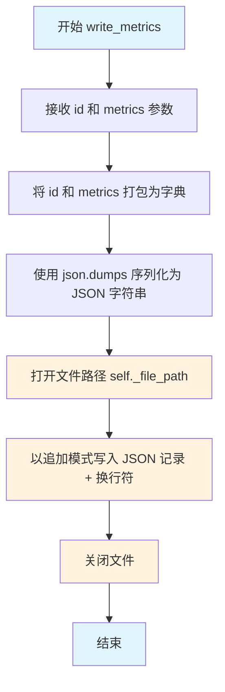

# `graphrag\packages\graphrag-llm\graphrag_llm\metrics\file_metrics_writer.py` 详细设计文档

这是一个文件指标写入器的实现类，继承自MetricsWriter基类，用于将指标数据以JSONL格式写入到带时间戳命名的日志文件中，支持自定义基础目录配置。

## 整体流程



## 类结构

```
MetricsWriter (抽象基类/接口)
└── FileMetricsWriter (文件指标写入器实现)
```

## 全局变量及字段


### `FileMetricsWriter._log_method`
    
日志方法，可选，用于记录日志

类型：`Callable[..., None] | None`
    


### `FileMetricsWriter._base_dir`
    
基础目录路径，用于存储指标文件的根目录

类型：`Path`
    


### `FileMetricsWriter._file_path`
    
输出文件路径，指向具体的JSONL指标文件

类型：`Path`
    
    

## 全局函数及方法


### `FileMetricsWriter.__init__`

初始化文件指标写入器，设置基础目录并生成带时间戳的输出文件路径。

参数：

- `base_dir`：`str | None`，用于存储指标文件的基础目录，默认为当前工作目录
- `**kwargs`：`Any`，传递给父类的额外关键字参数

返回值：`None`，该方法为构造函数，不返回任何值

#### 流程图

```mermaid
flowchart TD
    A[开始 __init__] --> B{base_dir 是否为 None}
    B -->|是| C[使用 Path.cwd 作为基础目录]
    B -->|否| D[使用传入的 base_dir]
    C --> E[调用 resolve 规范化路径]
    D --> E
    E --> F[获取当前 UTC 时间并转换到本地时区]
    F --> G[生成格式为 YYYYMMDD_HHMMSS 的时间戳]
    G --> H[构造文件名: {时间戳}.jsonl]
    H --> I[设置 self._file_path]
    I --> J[调用 mkdir 创建目录]
    J --> K[结束 __init__]
```

#### 带注释源码

```python
def __init__(self, *, base_dir: str | None = None, **kwargs: Any) -> None:
    """Initialize FileMetricsWriter."""
    # 解析基础目录路径：如果提供了 base_dir 则使用它，否则使用当前工作目录
    # 调用 resolve() 将路径规范化为绝对路径
    self._base_dir = Path(base_dir or Path.cwd()).resolve()

    # 获取当前 UTC 时间，转换到本地时区，并格式化为字符串
    # 格式: YYYYMMDD_HHMMSS (如: 20240315_143052)
    now = datetime.now(timezone.utc).astimezone().strftime("%Y%m%d_%H%M%S")

    # 构造输出文件路径：基础目录 / 时间戳.jsonl
    # 例如: /path/to/output/20240315_143052.jsonl
    self._file_path = self._base_dir / f"{now}.jsonl"

    # 创建必要的目录结构
    # parents=True 表示创建所有父目录
    # exist_ok=True 表示目录已存在时不报错
    self._base_dir.mkdir(parents=True, exist_ok=True)
```


### `FileMetricsWriter.write_metrics`

将接收到的指标数据与标识符打包为JSON记录，并以JSONL格式追加写入到基于时间戳命名的输出文件中。

参数：

- `id`：`str`，用于标识本次指标记录的唯 一标识符
- `metrics`：`Metrics`，待写入的指标数据对象

返回值：`None`，该方法仅执行文件写入操作，不返回任何数据

#### 流程图

```mermaid
flowchart TD
    A[开始 write_metrics] --> B[接收参数 id 和 metrics]
    B --> C[构建字典 record = {'id': id, 'metrics': metrics}]
    C --> D[使用 json.dumps 序列化为 JSON 字符串]
    D --> E[以追加模式打开文件 self._file_path]
    E --> F[写入 JSON 记录 + 换行符]
    F --> G[关闭文件]
    G --> H[结束]
```

#### 带注释源码

```python
def write_metrics(self, *, id: str, metrics: "Metrics") -> None:
    """Write the given metrics."""
    # 步骤1: 将 id 和 metrics 组装为字典对象
    record = json.dumps({"id": id, "metrics": metrics})
    
    # 步骤2: 以追加模式打开文件（不存在则创建），指定 UTF-8 编码
    with self._file_path.open("a", encoding="utf-8") as f:
        # 步骤3: 将 JSON 字符串写入文件，并追加换行符以符合 JSONL 格式
        f.write(f"{record}\n")
```


### `FileMetricsWriter.write_metrics`

将给定的度量数据写入到以时间戳命名的 JSONL 文件中。

参数：

- `id`：`str`，度量记录的唯一标识符
- `metrics`：`Metrics`，要写入的度量数据（字典类型）

返回值：`None`，无返回值（执行文件写入操作）

#### 流程图



#### 带注释源码

```python
def write_metrics(self, *, id: str, metrics: "Metrics") -> None:
    """Write the given metrics.
    
    Args:
        id:  度量记录的唯一标识符
        metrics: 要写入的度量数据
    
    Returns:
        None
    """
    # 步骤1: 构建记录字典，包含 id 和 metrics 字段
    record = json.dumps({"id": id, "metrics": metrics})
    
    # 步骤2: 以追加模式打开文件（如果不存在则创建）
    # 使用上下文管理器确保文件正确关闭
    with self._file_path.open("a", encoding="utf-8") as f:
        # 步骤3: 写入 JSON 序列化的记录，并在末尾添加换行符
        # 每条记录占一行，便于后续逐行读取解析
        f.write(f"{record}\n")
```

## 关键组件


### FileMetricsWriter

文件指标写入器实现类，继承自 MetricsWriter 基类，负责将指标数据以 JSONL 格式写入文件。

### _base_dir

基础目录路径，类型为 Path，用于指定指标文件的存储目录。

### _file_path

输出文件路径，类型为 Path，指向生成的 JSONL 文件。

### __init__

初始化方法，接受可选的 base_dir 参数，自动创建带时间戳的 JSONL 文件路径，并确保基础目录存在。

### write_metrics

写入指标方法，接受 id 和 metrics 参数，将指标记录以 JSON 格式追加到 JSONL 文件中。

### JSONL 文件格式

每行包含一个 JSON 对象，包含 id 和 metrics 字段，用于持久化指标数据。

### 目录自动创建

通过 mkdir(parents=True, exist_ok=True) 确保输出目录存在，支持嵌套目录结构。

### 时间戳文件命名

使用 UTC 时区的当前时间生成文件名，格式为 YYYYMMDD_HHMMSS.jsonl，确保文件名的唯一性。


## 问题及建议


### 已知问题

-   **未使用的类属性**：`_log_method` 定义为类属性但从未被实际调用或初始化，导致代码冗余
-   **文件写入无异常处理**：文件创建和写入操作缺乏 try-except 保护，磁盘满、权限不足等异常会导致程序直接崩溃
- **每次调用都打开关闭文件**：`write_metrics` 方法每次都执行 `open`/`close`，在高频调用场景下性能较差
- **线程安全问题**：多线程并发调用 `write_metrics` 时，可能出现数据竞争、文件损坏或记录交错
- **类型注解运行时问题**：`Metrics` 类型仅在 `TYPE_CHECKING` 块导入，但方法签名中直接使用 `"Metrics"` 字符串引用，实际运行时可能无法正确解析
- **日志配置未生效**：构造函数接收 `**kwargs` 但未处理日志相关参数，导致调用方无法配置日志行为

### 优化建议

-   移除未使用的 `_log_method` 属性，或实现完整的日志记录功能
-   添加文件操作的异常捕获与处理，提供有意义的错误信息
-   考虑使用文件缓冲、批量写入或上下文管理器优化频繁的文件操作
-   若涉及多线程场景，添加线程锁或使用原子写入机制（如先写临时文件再重命名）
-   将 `Metrics` 类型改为运行时导入，或使用 `typing.get_type_hints()` 处理字符串类型引用
-   在 `__init__` 中解析并初始化 `_log_method` 参数，支持调用方自定义日志行为
-   添加文件路径冲突检测，避免同一时刻生成相同文件名（虽然概率极低）

## 其它


### 设计目标与约束

本模块的设计目标是将指标数据持久化到文件系统，采用JSONL格式以支持流式写入和后续处理。约束条件包括：文件路径基于当前工作目录或指定base_dir，写入模式为追加模式，不支持并发写入的线程安全性保证。

### 错误处理与异常设计

主要异常场景包括：目录创建失败、文件写入失败、权限不足等。代码中通过open()方法的异常传播机制处理写入错误，未进行显式的异常捕获。潜在改进点：添加重试机制、记录写入失败的详细日志、提供回调机制通知写入失败。

### 外部依赖与接口契约

依赖项包括：json（标准库）、datetime（标准库）、pathlib（标准库）、typing（标准库）、graphrag_llm.metrics.metrics_writer.MetricsWriter（抽象基类）、graphrag_llm.types.Metrics（类型注解）。接口契约要求调用方传入id字符串和Metrics类型对象，写入结果为JSONL格式的文本文件。

### 配置说明

主要配置项为base_dir参数，用于指定指标文件的输出目录。默认值为当前工作目录（Path.cwd()）。文件名格式为"{timestamp}.jsonl"，时间戳格式为"%Y%m%d_%H%M%S"。

### 使用示例

```python
# 初始化写入器
writer = FileMetricsWriter(base_dir="/tmp/metrics")

# 写入指标
writer.write_metrics(
    id="request_123",
    metrics={"latency": 150, "status": "success"}
)
```

### 版本历史

初始版本（2024）：支持基本的JSONL文件写入功能。


    