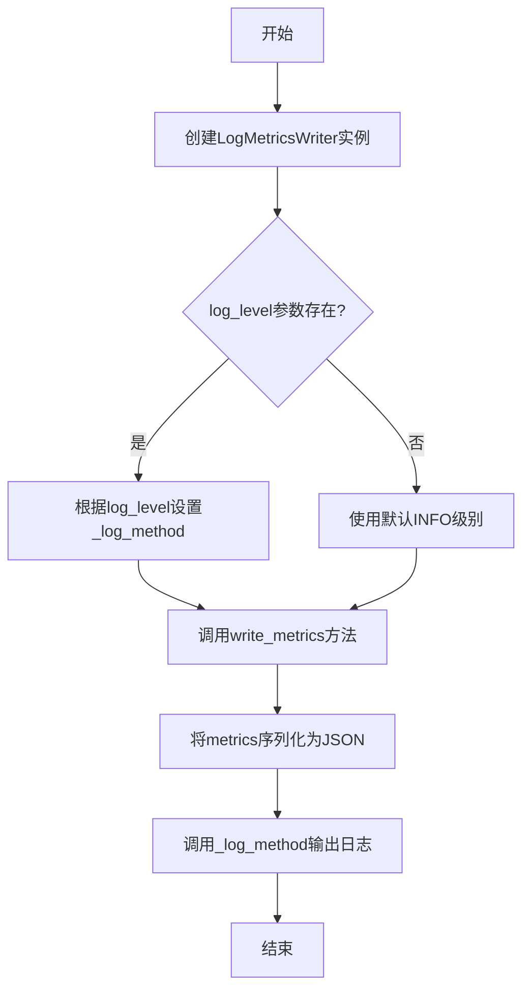
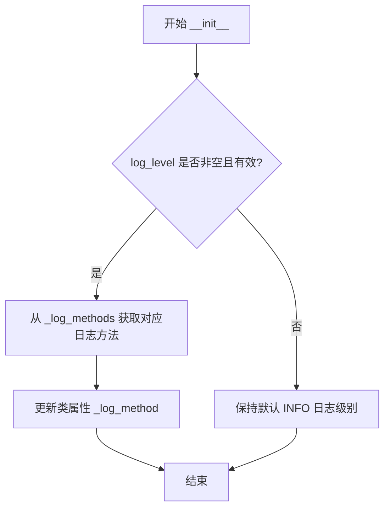
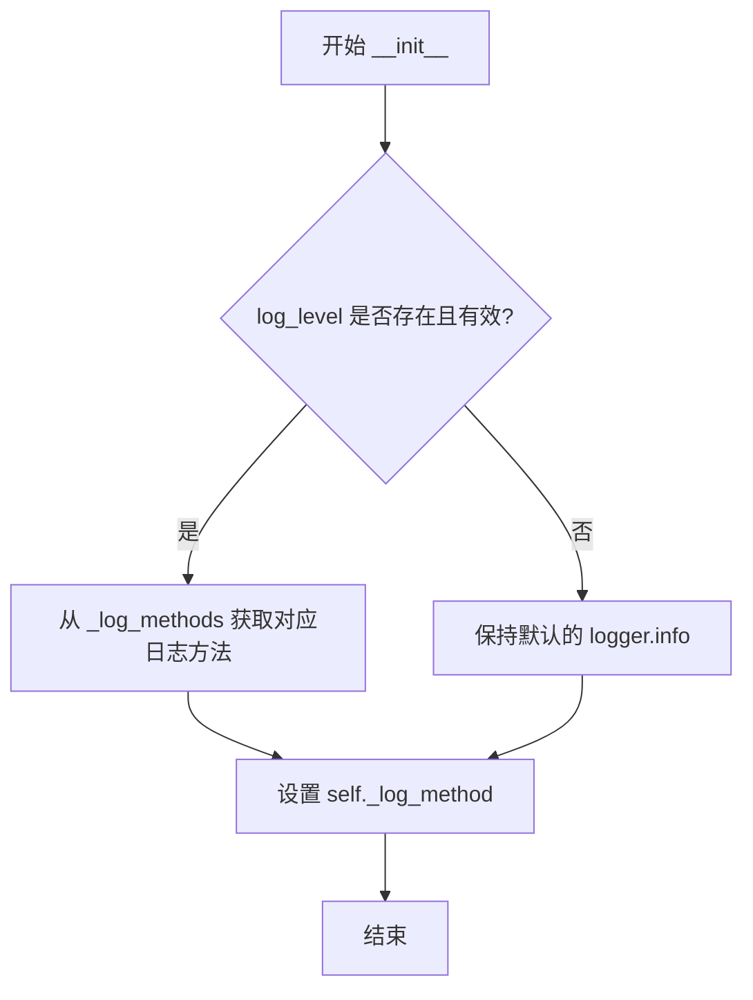

# `graphrag\packages\graphrag-llm\graphrag_llm\metrics\log_metrics_writer.py` 详细设计文档

该文件实现了一个日志指标写入器(LogMetricsWriter)，用于将指标数据通过Python标准日志模块输出到日志系统，支持配置不同的日志级别。

## 整体流程



## 类结构

```
MetricsWriter (抽象基类/接口)
└── LogMetricsWriter (日志指标写入器实现类)
```

## 全局变量及字段


### `_log_methods`
    
日志级别到日志方法的映射字典

类型：`dict[int, Callable[..., None]]`
    


### `logger`
    
模块级logger对象，用于记录日志

类型：`Logger`
    


### `LogMetricsWriter._log_method`
    
日志记录方法，默认使用logger.info

类型：`Callable[..., None]`
    
    

## 全局函数及方法


### `LogMetricsWriter.__init__`

初始化 LogMetricsWriter 实例，根据可选的 log_level 参数设置日志级别，用于将指标数据输出到标准日志系统。

参数：

- `self`：实例对象，隐式参数，无需传入
- `log_level`：`int | None`，可选参数，目标日志级别（如 logging.INFO、logging.DEBUG 等），若提供且为有效的日志级别，则使用该级别记录指标；否则默认使用 INFO 级别
- `**kwargs`：`Any`，可变关键字参数，用于接收额外的配置参数（当前未使用，保留接口兼容性）

返回值：`None`，该方法仅执行初始化逻辑，无返回值

#### 流程图



#### 带注释源码

```python
def __init__(self, *, log_level: int | None = None, **kwargs: Any) -> None:
    """Initialize LogMetricsWriter.
    
    初始化 LogMetricsWriter，设置日志记录级别。
    
    Args:
        log_level: 日志级别，默认为 None（使用 INFO 级别）
                   有效值包括 logging.DEBUG、logging.INFO、
                   logging.WARNING、logging.ERROR、logging.CRITICAL
        **kwargs: 额外的关键字参数，保留用于接口兼容性
    """
    # 检查 log_level 是否有效（非空且在 _log_methods 字典中）
    if log_level and log_level in _log_methods:
        # 根据日志级别获取对应的 logger 方法并设置为类属性
        # 例如：logging.INFO -> logger.info
        self._log_method = _log_methods[log_level]
    # 若 log_level 无效或未提供，保持默认的 logger.info 方法
```


### `LogMetricsWriter.write_metrics`

写入指标到日志的方法，将给定的指标数据格式化为 JSON 字符串并通过预配置的日志方法输出。

参数：

- `id`：`str`，指标的唯一标识符，用于在日志中标记指标数据
- `metrics`：`Metrics`，待写入的指标对象，包含要记录的性能或业务指标数据

返回值：`None`，该方法不返回任何值，仅执行日志写入操作

#### 流程图

```mermaid
flowchart TD
    A[开始 write_metrics] --> B{检查 log_level 配置}
    B -->|已配置| C[使用对应的日志方法]
    B -->|默认| D[使用 INFO 级别日志方法]
    C --> E[接收 id 和 metrics 参数]
    D --> E
    E --> F[调用 json.dumps 格式化 metrics]
    F --> G[构建日志消息: 'Metrics for {id}: {格式化内容}']
    G --> H[调用 _log_method 输出日志]
    H --> I[结束]
```

#### 带注释源码

```python
def write_metrics(self, *, id: str, metrics: "Metrics") -> None:
    """Write the given metrics.
    
    将指标数据序列化为 JSON 格式并写入日志输出。
    
    Args:
        id: 指标的唯一标识符，用于日志中的区分标记
        metrics: Metrics 类型对象，包含待记录的指标数据
    
    Returns:
        None: 该方法不返回任何值，直接输出到日志系统
    """
    # 使用实例绑定的日志方法（_log_method）记录指标
    # 格式：'Metrics for {id}: {JSON 格式的 metrics}'
    # 使用 json.dumps(indent=2) 实现美化输出，便于人工阅读
    self._log_method(f"Metrics for {id}: {json.dumps(metrics, indent=2)}")
```

## 关键组件


### 1. 一段话描述

LogMetricsWriter 是一个日志指标写入器实现，通过继承 MetricsWriter 抽象基类并重写 write_metrics 方法，将指标数据以 JSON 格式记录到标准日志系统中，支持可配置的日志级别。

### 2. 文件的整体运行流程

1. 模块导入阶段：导入必要的标准库（json、logging、typing 等）和自定义的 MetricsWriter 抽象基类
2. 日志方法映射构建：创建 _log_methods 字典，将日志级别映射到对应的日志方法
3. LogMetricsWriter 类实例化：通过 __init__ 方法接收 log_level 参数，配置日志级别
4. 指标写入操作：调用 write_metrics 方法，将指标数据序列化为 JSON 格式并输出到日志

### 3. 类的详细信息

#### LogMetricsWriter 类

**类字段：**

- `_log_method: Callable[..., None]` - 日志记录方法，默认为 logger.info
- `_log_methods: dict[int, Callable[..., None]]` - 类级别字典，映射日志级别到对应的日志方法

**类方法：**

##### `__init__`

- **参数：**
  - `log_level: int | None` - 日志级别（logging.DEBUG、INFO、WARNING、ERROR、CRITICAL），可选参数
  - `**kwargs: Any` - 额外的关键字参数，用于向后兼容
- **返回值：** `None`
- **描述：** 初始化 LogMetricsWriter 实例，根据 log_level 设置日志记录方法
- **流程图：** 


##### `write_metrics`

- **参数：**
  - `id: str` - 指标的唯一标识符
  - `metrics: Metrics` - 要写入的指标数据（类型标注为字符串以避免循环导入）
- **返回值：** `None`
- **描述：** 将指标数据序列化为格式化的 JSON 字符串并输出到日志
- **流程图：**
```mermaid
flowchart TD
    A[开始 write_metrics] --> B[调用 self._log_method]
    B --> C[格式化日志消息: 'Metrics for {id}: {json.dumps(metrics)}']
    C --> D[结束]
```

**带注释源码：**

```python
class LogMetricsWriter(MetricsWriter):
    """Log metrics writer implementation."""

    # 类字段：存储当前使用的日志方法，默认为 INFO 级别
    _log_method: Callable[..., None] = _log_methods[logging.INFO]

    def __init__(self, *, log_level: int | None = None, **kwargs: Any) -> None:
        """Initialize LogMetricsWriter."""
        # 如果提供了日志级别且在映射中，则更新日志方法
        if log_level and log_level in _log_methods:
            self._log_method = _log_methods[log_level]

    def write_metrics(self, *, id: str, metrics: "Metrics") -> None:
        """Write the given metrics."""
        # 使用当前配置的日志方法输出格式化的指标数据
        self._log_method(f"Metrics for {id}: {json.dumps(metrics, indent=2)}")
```

### 4. 关键组件信息

#### MetricsWriter 抽象基类

定义指标写入器的接口契约，LogMetricsWriter 实现该接口以确保与其他写入器（如文件写入器、数据库写入器）的兼容性。

#### _log_methods 字典

将 Python logging 模块的标准日志级别映射到具体的日志方法，提供统一的日志级别管理机制。

#### json 模块

用于将 metrics 字典序列化为格式化的 JSON 字符串，便于日志阅读和后续分析。

### 5. 潜在的技术债务或优化空间

1. **错误处理缺失**：write_metrics 方法没有处理 JSON 序列化失败的情况，如果 metrics 包含不可序列化的对象会抛出异常
2. **参数验证不足**：__init__ 方法未验证 log_level 的有效性范围，只是简单检查是否在字典中
3. **性能考虑**：每次调用 write_metrics 都使用 indent=2 进行格式化，在大量指标场景下可能影响性能
4. **类型提示改进**：metrics 参数使用字符串引用 "Metrics"，虽然避免了循环导入但不够直观，可以考虑使用 TYPE_CHECKING 块
5. **缺少关闭/刷新机制**：没有提供 flush 或 close 方法，无法确保日志及时写入

### 6. 其它项目

#### 设计目标与约束

- **设计目标**：提供一种轻量级的指标输出方式，将指标数据记录到标准日志系统
- **约束**：依赖 Python 标准库，无需额外依赖；遵循 MetricsWriter 接口规范

#### 错误处理与异常设计

- 当前实现未包含 try-except 块处理潜在异常
- 建议在 write_metrics 中捕获 TypeError（JSON 序列化失败）和异常情况

#### 数据流与状态机

- 数据流：外部调用 → write_metrics 方法 → JSON 序列化 → 日志方法输出 → 日志系统
- 无状态机设计，类实例不维护持久状态

#### 外部依赖与接口契约

- 依赖 graphrag_llm.metrics.metrics_writer.MetricsWriter 抽象基类
- 依赖 Python 标准库：json、logging、typing、collections.abc
- 实现 MetricsWriter 接口的 write_metrics(*, id: str, metrics: Metrics) -> None 方法


## 问题及建议


### 已知问题

-   **未使用的参数**: `__init__` 方法接收 `**kwargs: Any` 参数但未使用，可能导致接口不一致或隐藏潜在的配置问题
-   **日志级别验证缺失**: 当 `log_level` 不在 `_log_methods` 字典中时，代码静默失败，用户不会收到任何警告可能导致日志配置不符合预期
-   **JSON 序列化风险**: `json.dumps(metrics)` 在遇到不可序列化对象时会抛出异常，缺乏错误处理机制
-   **类型注解不完整**: 使用 `from graphrag_llm.types import Metrics` 仅在 TYPE_CHECKING 块中，没有运行时类型验证
-   **缺少基类方法覆盖验证**: 未显式检查是否正确实现了父类 `MetricsWriter` 的所有抽象方法

### 优化建议

-   移除 `**kwargs` 参数或添加日志警告提示该参数已被忽略
-   在 `__init__` 中添加日志级别范围验证，无效级别时抛出 `ValueError` 异常
-   添加 try-except 包装 JSON 序列化，失败时降级为字符串输出或记录错误日志
-   考虑添加类型验证或使用 `pydantic` 等进行运行时类型检查
-   可添加 `__init__` 方法的参数验证日志，便于调试配置问题

## 其它


### 设计目标与约束

该代码的核心目标是将指标数据通过Python logging模块输出到日志系统，支持可配置的日志级别。约束包括：仅支持Python标准logging模块，不支持异步写入，不提供指标格式化自定义功能。

### 错误处理与异常设计

代码本身不包含显式的异常处理逻辑。潜在异常场景包括：1) log_level参数不在_log_methods字典中时会被忽略；2) metrics对象无法被json.dumps序列化时会抛出TypeError。建议添加异常捕获机制，防止写入失败影响主流程。

### 数据流与状态机

数据流为：外部调用write_metrics(id, metrics) → 格式化metrics为JSON字符串 → 调用_log_method输出。状态机简单，无状态转换，仅为单次写入操作。

### 外部依赖与接口契约

依赖项包括：1) graphrag_llm.metrics.metrics_writer.MetricsWriter基类；2) graphrag_llm.types.Metrics类型提示；3) Python标准库json、logging、typing、collections.abc。接口契约要求实现MetricsWriter的write_metrics方法，参数为id(str)和metrics(Metrics类型)。

### 配置说明

LogMetricsWriter可通过构造函数传入log_level参数设置日志级别，支持logging.DEBUG(10)、INFO(20)、WARNING(30)、ERROR(40)、CRITICAL(50)，默认级别为INFO。

### 使用示例与调用场景

适用于需要将指标输出到日志系统的场景，如开发调试、运行时监控。典型调用：writer = LogMetricsWriter(log_level=logging.INFO); writer.write_metrics(id="example", metrics={"accuracy": 0.95})。

### 性能考虑与优化空间

当前实现为同步写入，高频调用时可能影响性能。优化方向：1) 添加缓冲机制批量写入；2) 支持异步日志记录；3) 提供自定义JSON序列化器；4) 增加格式化模板支持。

### 安全性考虑

输入的metrics数据直接序列化为JSON输出，需注意敏感信息泄露风险。建议在文档中明确说明不应在此处记录敏感个人数据或密钥信息。

### 测试策略建议

建议测试用例包括：1) 不同日志级别的输出验证；2) 异常metrics对象的异常捕获；3) 无log_level参数时的默认行为；4) 基类接口兼容性。

    