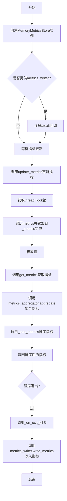
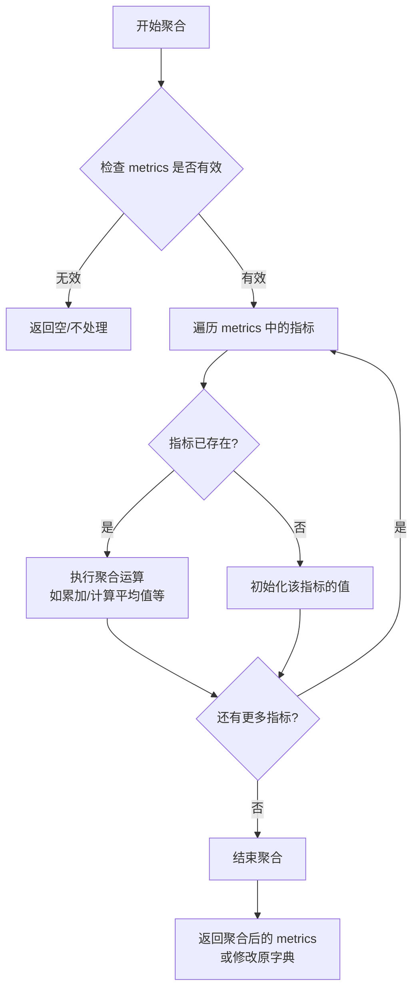
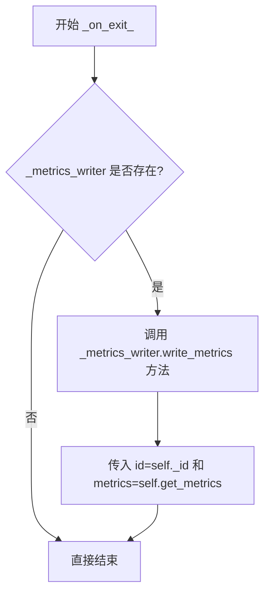
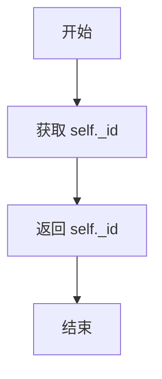
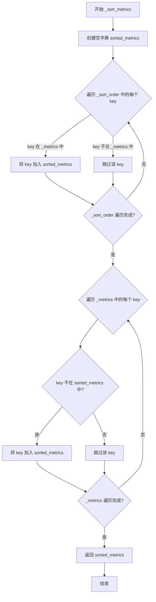
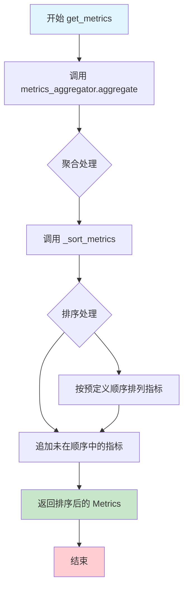

# `graphrag\packages\graphrag-llm\graphrag_llm\metrics\memory_metrics_store.py` 详细设计文档

这是一个内存指标存储实现，提供了线程安全的指标更新、排序和聚合功能，支持在程序退出时自动将指标写入到指定的MetricsWriter中。

## 整体流程



## 类结构

```
MetricsStore (抽象基类/接口)
└── MemoryMetricsStore (具体实现类)
```

## 全局变量及字段


### `_default_sort_order`
    
默认的指标排序顺序列表，包含23个标准指标键名

类型：`list[str]`
    


### `MemoryMetricsStore._metrics_writer`
    
指标写入器，用于在程序退出时保存指标

类型：`MetricsWriter | None`
    


### `MemoryMetricsStore._id`
    
指标存储的唯一标识符

类型：`str`
    


### `MemoryMetricsStore._sort_order`
    
指标键的排序顺序列表

类型：`list[str]`
    


### `MemoryMetricsStore._thread_lock`
    
用于保证线程安全的锁对象

类型：`threading.Lock`
    


### `MemoryMetricsStore._metrics`
    
存储指标的字典对象

类型：`Metrics`
    
    

## 全局函数及方法


# metrics_aggregator.aggregate 函数详细设计文档

### `metrics_aggregator.aggregate`

该函数是指标聚合器（metrics_aggregator）对象的核心方法，用于对指标数据进行聚合处理。根据代码中的调用方式，它接收一个包含指标键值对的字典，并对其进行聚合操作（例如累加、计算平均值等），具体实现位于 `graphrag_llm.metrics.metrics_aggregator` 模块中。

参数：

- `metrics`：`Dict[str, Any]` 或 `Metrics`，待聚合的指标字典，键为指标名称，值为对应的数值或统计信息

返回值：`None` 或 `Metrics`，聚合处理后的结果（根据调用处代码，未直接使用返回值，而是直接修改了传入的字典）

#### 流程图



#### 带注释源码

```python
# 注意：以下为基于调用上下文推断的源码结构
# 实际定义位于 graphrag_llm.metrics.metrics_aggregator 模块中

def aggregate(self, metrics: "Metrics") -> "Metrics":
    """对指标数据进行聚合处理。
    
    该方法接收一个指标字典，遍历其中的每个指标项，
    根据预设的聚合策略（如累加、计算平均值等）对指标值进行处理。
    
    Parameters
    ----------
    metrics : Metrics
        待聚合的指标字典，键为指标名称（如 'prompt_tokens'），
        值为对应的数值或统计信息。
        
    Returns
    -------
    Metrics
        聚合处理后的指标字典。
    """
    # 遍历传入的指标字典
    for name, value in metrics.items():
        # 检查该指标是否已存在于聚合器中
        if name in self._aggregated_metrics:
            # 如果已存在，执行聚合运算（如累加）
            self._aggregated_metrics[name] += value
        else:
            # 如果不存在，初始化该指标的值
            self._aggregated_metrics[name] = value
    
    # 返回聚合后的指标字典
    return self._aggregated_metrics
```

> **注意**：由于实际的 `metrics_aggregator` 类定义未在当前代码文件中显示，以上源码为基于 `MemoryMetricsStore.get_metrics()` 方法中的调用方式推断的结构。实际的聚合逻辑（如累加策略、是否返回新字典等）需要查看 `graphrag_llm.metrics.metrics_aggregator` 模块的完整实现。

---

## 调用上下文分析

在 `MemoryMetricsStore` 类中的使用方式：

```python
def get_metrics(self) -> "Metrics":
    """Get all metrics from the store."""
    # 调用 metrics_aggregator.aggregate 对存储的指标进行聚合处理
    metrics_aggregator.aggregate(self._metrics)
    # 返回排序后的指标
    return self._sort_metrics()
```

从上述调用可以看出：

1. **输入**：传入 `self._metrics`（一个 `Metrics` 类型的字典）
2. **处理**：函数对指标进行聚合（可能直接修改原字典或返回新字典）
3. **输出**：返回值未被直接使用，后续通过 `self._sort_metrics()` 返回排序后的指标


### `MemoryMetricsStore.__init__`

初始化 MemoryMetricsStore 实例，设置ID、排序顺序、线程锁和指标字典。如果提供了 metrics_writer，则注册程序退出时的指标写入回调。

参数：

- `id`：`str`，指标存储的唯一标识符
- `metrics_writer`：`MetricsWriter | None`，可选的指标写入器，用于在程序退出时保存指标
- `sort_order`：`list[str] | None`，可选的指标排序顺序，默认使用预定义的默认排序顺序
- `**kwargs`：`Any`，额外的关键字参数（用于兼容性）

返回值：`None`，无返回值（`__init__` 方法）

#### 流程图

```mermaid
flowchart TD
    A[开始 __init__] --> B{传入 id?}
    B -->|是| C[设置 self._id = id]
    C --> D{传入 sort_order?}
    D -->|是| E[设置 self._sort_order = sort_order]
    D -->|否| F[设置 self._sort_order = _default_sort_order]
    E --> G[初始化线程锁]
    F --> G
    G --> H[初始化空指标字典 self._metrics = {}]
    H --> I{传入 metrics_writer?}
    I -->|是| J[设置 self._metrics_writer = metrics_writer]
    J --> K[注册 atexit 回调 self._on_exit_]
    I -->|否| L[结束]
    K --> L
```

#### 带注释源码

```python
def __init__(
    self,
    *,
    id: str,                                    # 指标存储的唯一标识符
    metrics_writer: "MetricsWriter | None" = None,  # 可选的指标写入器
    sort_order: list[str] | None = None,        # 可选的排序顺序
    **kwargs: Any,                              # 额外的关键字参数（兼容性）
) -> None:
    """Initialize MemoryMetricsStore."""
    # 设置实例的ID属性
    self._id = id
    
    # 设置排序顺序：如果提供了sort_order则使用它，否则使用默认排序顺序
    # 默认排序顺序定义了指标展示的优先级
    self._sort_order = sort_order or _default_sort_order
    
    # 初始化线程锁，用于保证线程安全地更新指标
    self._thread_lock = threading.Lock()
    
    # 初始化空的指标字典，存储所有收集的指标数据
    self._metrics = {}

    # 如果提供了metrics_writer，则保存引用并注册退出回调
    # 这样在程序正常退出时，会自动将内存中的指标写入到持久化存储
    if metrics_writer:
        self._metrics_writer = metrics_writer
        atexit.register(self._on_exit_)  # 注册程序退出时的回调函数
```


### `MemoryMetricsStore._on_exit_`

程序退出时的回调函数，负责在程序正常退出时将内存中存储的指标数据写入到 metrics_writer，以便持久化保存。该函数通过 `atexit` 模块注册，在程序结束时自动被调用。

参数： 无

返回值：`None`，无返回值

#### 流程图



#### 带注释源码

```python
def _on_exit_(self) -> None:
    """程序退出时的回调函数，用于将指标写入到 metrics_writer。
    
    该方法通过 atexit.register() 在初始化时注册，
    当 Python 程序正常退出时会被自动调用。
    """
    # 检查 metrics_writer 是否已配置
    if self._metrics_writer:
        # 调用 metrics_writer 的 write_metrics 方法写入指标数据
        # 参数:
        #   - id: 当前 metrics store 的标识符
        #   - metrics: 通过 get_metrics() 获取排序后的指标数据
        self._metrics_writer.write_metrics(id=self._id, metrics=self.get_metrics())
```


### MemoryMetricsStore.id

获取指标存储的唯一标识符。

参数：无

返回值：`str`，返回指标存储的唯一标识符。

#### 流程图



#### 带注释源码

```python
@property
def id(self) -> str:
    """Get the ID of the metrics store."""
    return self._id
```


### `MemoryMetricsStore.update_metrics`

线程安全地将多个指标更新到内存存储中，支持指标的累加操作。

参数：

- `metrics`：`Metrics`，关键字参数，包含要更新的指标名称和值的字典

返回值：`None`，无返回值，仅更新内部存储的指标数据

#### 流程图

```mermaid
flowchart TD
    A[开始 update_metrics] --> B[获取线程锁 self._thread_lock]
    B --> C{遍历 metrics.items}
    C --> D{检查指标名称是否已存在}
    D -->|是| E[累加指标值 self._metrics[name] += value]
    D -->|否| F[创建新指标 self._metrics[name] = value]
    E --> G{继续遍历}
    F --> G
    G -->|还有更多指标| C
    G -->|遍历完成| H[释放线程锁]
    H --> I[结束]
    
    style B fill:#e1f5fe
    style H fill:#e1f5fe
    style A fill:#fff3e0
    style I fill:#fff3e0
```

#### 带注释源码

```python
def update_metrics(self, *, metrics: "Metrics") -> None:
    """Update the store with multiple metrics.
    
    此方法线程安全地更新内部指标存储。如果指标已存在，
    则将新值累加到现有值上；否则创建新的指标条目。
    
    Parameters
    ----------
    metrics : Metrics
        包含指标名称和对应值的字典，用于批量更新存储中的指标
    """
    # 使用线程锁确保在多线程环境下安全地修改共享的 _metrics 字典
    with self._thread_lock:
        # 遍历传入的每个指标名称和值
        for name, value in metrics.items():
            # 检查该指标是否已经在存储中存在
            if name in self._metrics:
                # 如果存在，则将新值累加到现有值上（用于统计计数类指标）
                self._metrics[name] += value
            else:
                # 如果不存在，则创建新的指标条目
                self._metrics[name] = value
```


### `MemoryMetricsStore._sort_metrics`

根据预定义的排序顺序对指标进行排序，返回一个按照指定顺序排列的指标字典。不在预定义排序中的指标将被追加到排序后的结果末尾。

参数：无需参数（仅使用实例属性 `self`）

返回值：`Metrics`，返回排序后的指标字典，其中包含所有原始指标，但按照预定义的顺序排列。

#### 流程图



#### 带注释源码

```python
def _sort_metrics(self) -> "Metrics":
    """Sort metrics based on the predefined sort order."""
    # 1. 创建一个空的排序后指标字典
    sorted_metrics: Metrics = {}
    
    # 2. 第一轮遍历：按照预定义的排序顺序添加指标
    #    这确保了重要指标（如 attempted_request_count）排在前面
    for key in self._sort_order:
        if key in self._metrics:
            # 如果该 key 在当前指标中存在，则按顺序加入排序结果
            sorted_metrics[key] = self._metrics[key]
    
    # 3. 第二轮遍历：处理未在预定义排序中的指标
    #    这些指标将被追加到排序结果的末尾，保持原始顺序
    for key in self._metrics:
        if key not in sorted_metrics:
            # 只添加尚未在 sorted_metrics 中的指标
            sorted_metrics[key] = self._metrics[key]
    
    # 4. 返回排序后的完整指标字典
    return sorted_metrics
```


### `MemoryMetricsStore.get_metrics`

获取所有指标数据，包括聚合处理和排序处理。该方法首先调用指标聚合器对当前存储的指标进行聚合，然后根据预定义的排序顺序对指标进行排序，最后返回排序后的完整指标字典。

参数：
- （无显式参数，隐式参数 `self` 表示当前实例）

返回值：`Metrics`，返回已聚合并排序的所有指标字典

#### 流程图



#### 带注释源码

```python
def get_metrics(self) -> "Metrics":
    """Get all metrics from the store.
    
    该方法执行以下操作：
    1. 使用 metrics_aggregator 对当前存储的指标进行聚合处理
    2. 调用 _sort_metrics() 方法对指标进行排序
    3. 返回排序后的完整指标字典
    
    Returns
    -------
    Metrics
        已聚合并按预定义顺序排序的所有指标
    """
    # 第一步：调用全局指标聚合器对当前指标进行聚合处理
    # 聚合器可能会合并、计算平均值或其他统计操作
    metrics_aggregator.aggregate(self._metrics)
    
    # 第二步：调用内部排序方法对指标进行排序
    # 排序基于预定义的 sort_order 列表
    # 返回按顺序排列的指标字典
    return self._sort_metrics()
```


### MemoryMetricsStore.clear_metrics

清空 MemoryMetricsStore 中所有存储的指标数据，将内部维护的 Metrics 字典重置为空。

参数：

- `self`：无，类实例本身（隐式参数）

返回值：`None`，无返回值描述

#### 流程图

```mermaid
flowchart TD
    A[开始 clear_metrics] --> B{检查线程锁}
    B --> C[将 _metrics 字典重置为空字典]
    C --> D[结束方法]
    
    subgraph "内部状态"
        _metrics[_metrics: {}]
    end
    
    C -.-> |"更新内部状态"| _metrics
```

#### 带注释源码

```python
def clear_metrics(self) -> None:
    """Clear all metrics from the store.

    Returns
    -------
        None
    """
    # 将实例变量 _metrics 重置为空字典，实现清空所有指标的功能
    # 原有存储的所有指标数据将被完全丢弃
    self._metrics = {}
```

## 关键组件


### MemoryMetricsStore

内存指标存储类，提供线程安全的指标存储、更新、排序和检索功能，支持在程序退出时自动持久化指标数据。

### _default_sort_order

全局排序顺序列表，定义了指标展示的优先级顺序，包含请求计数、成功率、失败率、重试次数、计算时长、缓存命中率、token统计、成本计算等22个指标维度。

### _metrics_writer

指标写入器接口，负责将内存中的指标数据持久化到外部存储，支持在程序退出时自动触发写入操作。

### _thread_lock

线程锁对象，确保在多线程环境下对指标的更新和读取操作是原子性的，防止数据竞争条件。

### _metrics

内存指标字典，存储所有采集的指标数据，键为指标名称，值为累加的数值。

### update_metrics()

更新指标方法，接收多个指标键值对，线程安全地将新值累加到现有指标上，如果指标不存在则创建新条目。

### get_metrics()

获取指标方法，返回排序后的所有指标，通过 metrics_aggregator 进行聚合处理，并按照预定义的 sort_order 排序输出。

### _sort_metrics()

指标排序内部方法，将指标按照预定义的顺序排列，未在排序列表中的指标会追加到末尾，保证输出顺序的一致性。

### _on_exit_()

程序退出回调方法，在程序终止时自动调用，将当前内存中的指标通过 _metrics_writer 写入到持久化存储中。

### clear_metrics()

清空指标方法，重置 _metrics 字典为空，释放内存中的指标数据。


## 问题及建议


### 已知问题

-   **线程安全问题**：`clear_metrics()` 方法没有使用 `self._thread_lock` 进行保护，与 `update_metrics()`、`get_metrics()` 之间存在竞态条件风险
-   **类型不匹配风险**：`_metrics` 初始化为空字典 `{}`，但在 `update_metrics` 中使用 `+=` 操作累加值，如果传入的 value 为 `None` 或不支持加法的类型会导致运行时错误
-   **内存泄漏风险**：`atexit.register()` 注册的回调在程序生命周期内永久存在，如果多次创建 `MemoryMetricsStore` 实例，会累积注册多个退出回调
-   **缺失的错误处理**：对 `metrics_aggregator.aggregate()` 的调用没有任何异常捕获机制，该外部依赖可能抛出异常
-   **性能考虑**：`get_metrics()` 每次调用都会执行排序操作 `self._sort_metrics()`，在高频调用场景下会产生性能开销
-   **缺乏输入验证**：`update_metrics()` 和构造函数中没有对 `metrics` 字典的值类型进行验证，无法保证数值类型的正确性
-   **资源清理不完整**：类没有实现 `__del__` 或上下文管理器接口，无法主动释放资源或取消 atexit 注册

### 优化建议

-   为 `clear_metrics()` 方法添加线程锁保护，确保线程安全
-   在 `update_metrics()` 中添加类型检查或使用 `isinstance(value, (int, float))` 验证后再进行累加操作，并为类型不匹配的情况提供默认值或错误处理
-   实现 `__del__` 方法或提供显式的资源释放接口，在对象销毁时移除 atexit 注册（通过 `atexit.unregister()`）
-   在 `get_metrics()` 调用 `metrics_aggregator.aggregate()` 时添加 try-except 异常处理
-   考虑将排序结果缓存或提供单独的 `get_sorted_metrics()` 方法，避免每次获取都重新排序
-   在构造函数中验证 `sort_order` 参数是否为有效类型，增强输入校验
-   考虑实现 `__enter__` 和 `__exit__` 方法以支持上下文管理器协议，提供更规范的资源管理方式

## 其它


### 设计目标与约束

**设计目标**：提供一个线程安全的内存指标存储实现，支持指标的累积、更新、排序和获取，同时支持可选的指标持久化写入功能。

**约束条件**：
- 必须继承自MetricsStore抽象类
- 必须实现update_metrics、get_metrics、clear_metrics等接口方法
- 线程安全：通过threading.Lock保证并发访问安全
- 支持自定义排序规则，默认使用预定义的指标排序顺序

### 错误处理与异常设计

**异常处理机制**：
- 线程锁操作：使用`with self._thread_lock`上下文管理器自动获取和释放锁，避免死锁
- 空值处理：metrics_writer为可选参数，允许为None
- 指标更新：当指标不存在时自动创建，存在时累加

**退出处理**：
- 使用atexit.register在程序退出时自动调用_on_exit_方法
- 确保在进程终止前将内存中的指标写入持久化存储

### 数据流与状态机

**数据流**：
1. 外部调用update_metrics()方法输入指标数据
2. 在线程锁保护下累加到内部_metrics字典
3. get_metrics()调用metrics_aggregator进行聚合
4. 通过_sort_metrics()按预定义顺序排序
5. 返回排序后的指标字典
6. 程序退出时通过_on_exit_将数据写入MetricsWriter

**状态机**：
- 初始状态：_metrics为空字典
- 运行状态：指标不断累积更新
- 清理状态：调用clear_metrics()重置为初始状态

### 外部依赖与接口契约

**依赖模块**：
- threading：线程同步
- atexit：程序退出钩子
- typing：类型注解
- graphrag_llm.metrics.metrics_aggregator：指标聚合器
- graphrag_llm.metrics.metrics_store：抽象基类
- graphrag_llm.metrics.metrics_writer：指标写入器（可选）
- graphrag_llm.types.Metrics：指标类型定义

**接口契约**：
- update_metrics(metrics: Metrics)：接收指标字典进行累加更新
- get_metrics() -> Metrics：返回聚合排序后的指标
- clear_metrics() -> None：清空所有指标
- id属性：返回存储实例标识符

### 性能考虑

**性能优化点**：
- 线程锁粒度：只在update_metrics中加锁，get_metrics中不使用锁避免阻塞读取
- 惰性聚合：只在get_metrics时调用aggregate，减少不必要的计算
- 内存效率：使用字典存储指标，键值对形式紧凑

**性能瓶颈**：
- 每次get_metrics都进行排序操作，时间复杂度O(n log n)
- 指标累加使用循环遍历，可考虑批量操作优化

### 并发处理

**并发场景**：
- 多线程同时调用update_metrics()
- 主线程调用get_metrics()同时后台线程更新

**线程安全机制**：
- 使用threading.Lock保证原子性操作
- 锁的获取和释放使用上下文管理器确保异常安全

### 资源管理

**内存管理**：
- _metrics字典动态增长
- 程序退出时通过atexit释放资源
- clear_metrics()可手动触发垃圾回收

**外部资源**：
- MetricsWriter为可选依赖，存在时负责持久化
- atexit回调确保资源正确释放

### 配置参数

**构造函数参数**：
- id: str - 存储实例唯一标识符
- metrics_writer: MetricsWriter | None - 可选的指标写入器
- sort_order: list[str] | None - 自定义排序顺序
- **kwargs: Any - 额外的扩展参数

**默认配置**：
- sort_order默认使用_default_sort_order预定义列表
- metrics_writer默认为None

### 使用示例

```python
# 创建存储实例
store = MemoryMetricsStore(id="worker1")

# 更新指标
store.update_metrics(metrics={
    "attempted_request_count": 10,
    "successful_response_count": 8,
    "failed_response_count": 2
})

# 获取指标
metrics = store.get_metrics()
print(metrics)

# 清理指标
store.clear_metrics()
```

### 版本信息

**文件信息**：
- 文件路径：graphrag_llm/metrics/memory_metrics_store.py
- 版权：Copyright (c) 2024 Microsoft Corporation
- 许可证：MIT License
- 模块：Default metrics store

    