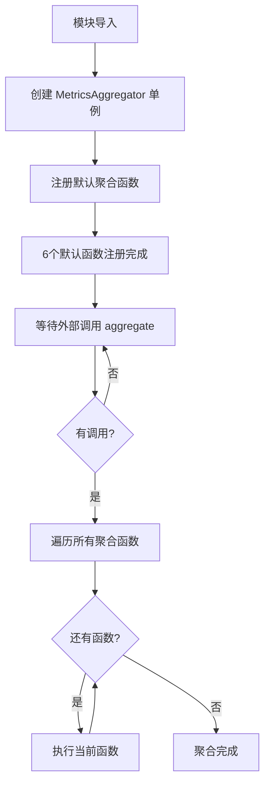
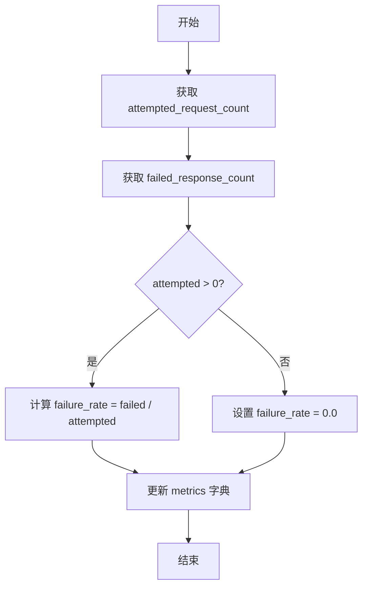
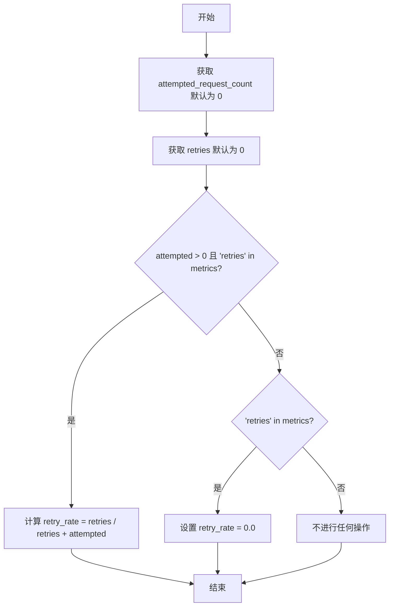
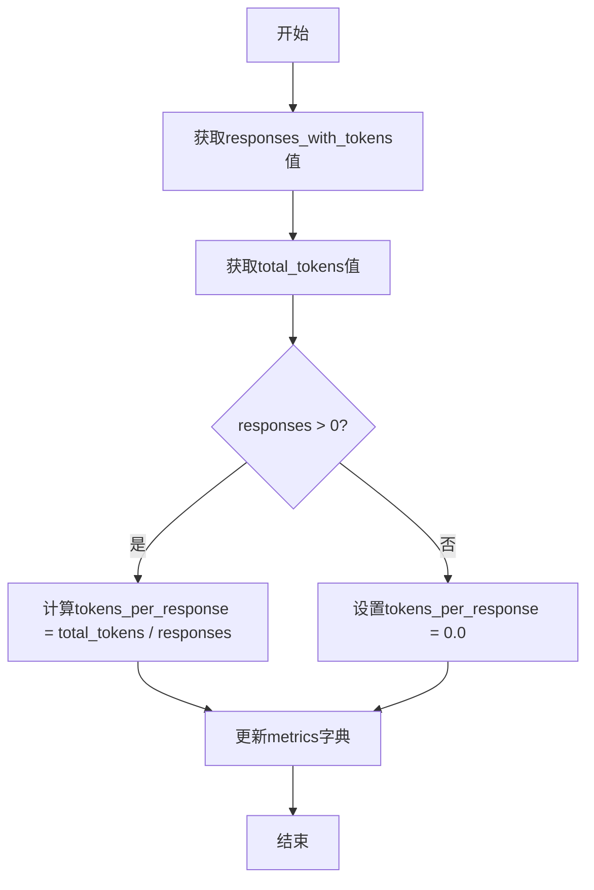
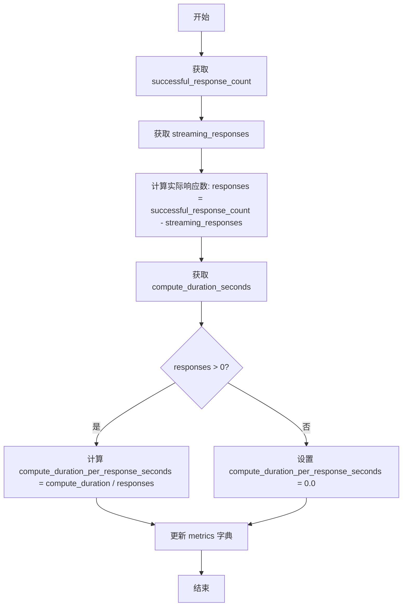
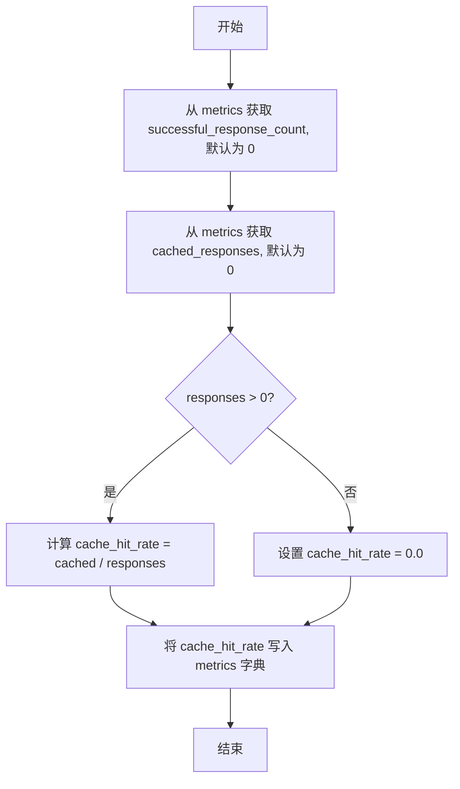
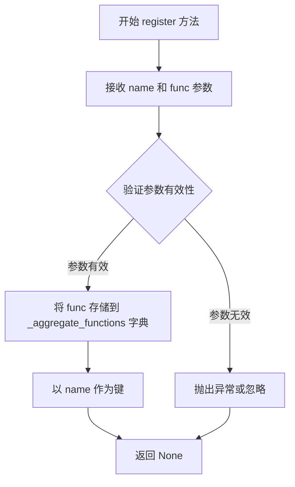
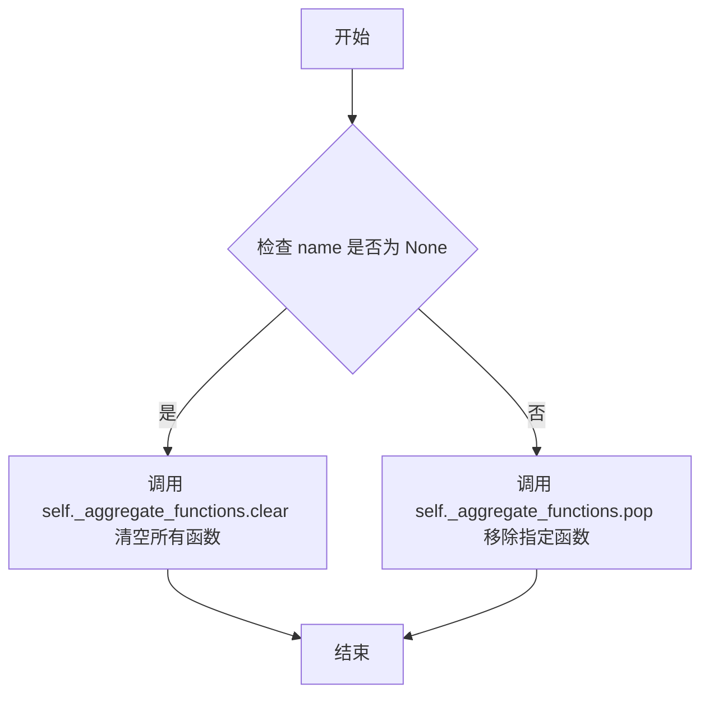

```mermaid
flowchart TD
    A[开始 aggregate 方法] --> B{检查 _aggregate_functions 是否为空}
    B -->|否| C[遍历 _aggregate_functions.values]
    C --> D[获取当前迭代的聚合函数 func]
    D --> E[调用 func&#40;metrics&#41; 执行聚合计算]
    E --> F{是否还有更多聚合函数}
    F -->|是| C
    F -->|否| G[结束方法, 返回 None]
    B -->|是| G
    
    style A fill:#e1f5fe
    style G fill:#e8f5e8
    style E fill:#fff3e0
```

# `graphrag\packages\graphrag-llm\graphrag_llm\metrics\metrics_aggregator.py` 详细设计文档

这是一个指标聚合器模块，通过单例模式的 MetricsAggregator 类提供指标注册和聚合功能，支持计算失败率、重试率、每响应Token数、每响应成本、每响应计算时长和缓存命中率等派生指标。

## 整体流程



## 类结构

```
MetricsAggregator (单例聚合器类)
└── 内置6个默认聚合函数:
    ├── _failure_rate
    ├── _retry_rate
    ├── _tokens_per_response
    ├── _cost_per_response
    ├── _compute_duration_per_response
    └── _cache_hit_rate
```

## 全局变量及字段


### `metrics_aggregator`
    
MetricsAggregator单例实例，用于聚合指标

类型：`MetricsAggregator`
    


### `_failure_rate`
    
计算失败率指标的聚合函数

类型：`Callable[[Metrics], None]`
    


### `_retry_rate`
    
计算重试率指标的聚合函数

类型：`Callable[[Metrics], None]`
    


### `_tokens_per_response`
    
计算每个响应token数的聚合函数

类型：`Callable[[Metrics], None]`
    


### `_cost_per_response`
    
计算每个响应成本的聚合函数

类型：`Callable[[Metrics], None]`
    


### `_compute_duration_per_response`
    
计算每个响应计算时长的聚合函数

类型：`Callable[[Metrics], None]`
    


### `_cache_hit_rate`
    
计算缓存命中率的聚合函数

类型：`Callable[[Metrics], None]`
    


### `MetricsAggregator._instance`
    
单例实例，存储MetricsAggregator的唯一实例

类型：`ClassVar[Self | None]`
    


### `MetricsAggregator._aggregate_functions`
    
存储聚合函数，键为函数名，值为聚合函数

类型：`dict[str, Callable[[Metrics], None]]`
    


### `MetricsAggregator._initialized`
    
初始化标志，防止重复初始化

类型：`bool`
    
    

## 全局函数及方法


### `_failure_rate`

计算失败率指标。该函数从 metrics 字典中获取尝试请求数和失败响应数，计算失败率并更新 metrics 字典。

参数：

-  `metrics`：`"Metrics"`，Metrics 字典对象，包含请求计数和响应计数的度量数据

返回值：`None`，该函数直接修改传入的 metrics 字典，不返回任何值

#### 流程图



#### 带注释源码

```python
def _failure_rate(metrics: "Metrics") -> None:
    """Calculate failure rate metric.
    
    该函数计算失败率指标，失败率 = 失败响应数 / 尝试请求数。
    如果没有尝试请求，则失败率设为 0.0。
    
    Args:
        metrics: Metrics 字典，应包含 attempted_request_count 和 failed_response_count 键
    """
    # 从 metrics 字典中获取尝试请求数，默认值为 0
    attempted = metrics.get("attempted_request_count", 0)
    # 从 metrics 字典中获取失败响应数，默认值为 0
    failed = metrics.get("failed_response_count", 0)
    # 检查是否有尝试请求
    if attempted > 0:
        # 计算失败率：失败响应数除以尝试请求数
        metrics["failure_rate"] = failed / attempted
    else:
        # 如果没有尝试请求，失败率设为 0.0
        metrics["failure_rate"] = 0.0
```


### `_retry_rate`

计算重试率指标。该函数从 metrics 字典中获取尝试请求数和重试次数，然后计算重试率并将其添加到 metrics 字典中。

参数：

-  `metrics`：`Metrics` 字典，包含各种指标数据的字典，需要包含 `attempted_request_count` 和 `retries` 键

返回值：`None`，该函数直接修改传入的 metrics 字典，不返回任何值

#### 流程图



#### 带注释源码

```python
def _retry_rate(metrics: "Metrics") -> None:
    """Calculate failure rate metric.
    
    注意：docstring 描述为 failure rate，但实际计算的是 retry_rate，
    这是一个文档与实现不一致的地方，属于技术债务。
    """
    # 从 metrics 字典中获取 attempted_request_count，默认为 0
    attempted = metrics.get("attempted_request_count", 0)
    
    # 从 metrics 字典中获取 retries，默认为 0
    retries = metrics.get("retries", 0)
    
    # 判断条件：attempted 大于 0 且 metrics 中存在 'retries' 键
    if attempted > 0 and "retries" in metrics:
        # 计算重试率：重试次数 / (重试次数 + 原始请求次数)
        metrics["retry_rate"] = retries / (retries + attempted)
    # 如果 attempted 为 0 但 metrics 中存在 'retries' 键
    elif "retries" in metrics:
        # 设置重试率为 0.0
        metrics["retry_rate"] = 0.0
```


### `_tokens_per_response`

计算每响应Token数指标。该函数接收一个包含响应统计信息的Metrics字典，计算每个响应平均消耗的Token数量，并将结果更新到metrics字典中。

参数：

-  `metrics`：`Metrics`，包含 `responses_with_tokens`（有Token的响应数）和 `total_tokens`（总Token数）的metrics字典，函数会直接修改此字典

返回值：`None`，该函数不返回值，而是直接修改输入的metrics字典

#### 流程图



#### 带注释源码

```python
def _tokens_per_response(metrics: "Metrics") -> None:
    """Calculate tokens per response metric.
    
    计算每响应Token数指标。
    
    该函数从metrics字典中获取responses_with_tokens和total_tokens，
    计算每个响应平均消耗的Token数量，并将结果写回metrics字典。
    """
    # 从metrics字典中获取有Token的响应数量，默认为0
    responses = metrics.get("responses_with_tokens", 0)
    # 从metrics字典中获取总Token数，默认为0
    total_tokens = metrics.get("total_tokens", 0)
    # 检查是否有有效的响应数量
    if responses > 0:
        # 计算每响应Token数 = 总Token数 / 有Token的响应数
        metrics["tokens_per_response"] = total_tokens / responses
    else:
        # 如果没有响应，设置每响应Token数为0.0
        metrics["tokens_per_response"] = 0.0
```


### `_cost_per_response`

该函数是一个指标计算函数，用于计算每个响应（Request）的平均成本。它从传入的 `Metrics` 字典中获取响应数量和总成本，然后计算每个响应的平均成本并将结果写回字典中。如果响应数量为零，则将成本设为 0.0。

参数：

- `metrics`：`Metrics`，包含指标数据的字典对象，需要包含 `responses_with_cost`（有成本统计的响应数）和 `total_cost`（总成本）键值

返回值：`None`，该函数不返回值，直接修改输入的 `metrics` 字典

#### 流程图

```mermaid
flowchart TD
    A[开始] --> B[从 metrics 获取 responses_with_cost 和 total_cost]
    B --> C{responses > 0?}
    C -->|是| D[计算 cost_per_response = total_cost / responses]
    C -->|否| E[设置 cost_per_response = 0.0]
    D --> F[将结果写入 metrics['cost_per_response']]
    E --> F
    F --> G[结束]
```

#### 带注释源码

```python
def _cost_per_response(metrics: "Metrics") -> None:
    """Calculate cost per response metric."""
    # 从metrics字典中获取有成本统计的响应数量，默认值为0
    responses = metrics.get("responses_with_cost", 0)
    # 从metrics字典中获取总成本，默认值为0
    total_cost = metrics.get("total_cost", 0)
    # 检查是否有有效的响应数量
    if responses > 0:
        # 计算每个响应的平均成本 = 总成本 / 响应数
        metrics["cost_per_response"] = total_cost / responses
    else:
        # 如果没有响应，则将平均成本设为0.0
        metrics["cost_per_response"] = 0.0
```


### `_compute_duration_per_response`

该函数用于计算每个成功响应（不含流式响应）的平均计算时长指标，通过将总计算时长除以成功响应数得到。

参数：

- `metrics`：`"Metrics"`，包含需要计算指标的metrics字典，应包含 `successful_response_count`（成功响应数）、`streaming_responses`（流式响应数）和 `compute_duration_seconds`（计算时长）字段

返回值：`None`，该函数直接修改传入的metrics字典，不返回任何值

#### 流程图



#### 带注释源码

```python
def _compute_duration_per_response(metrics: "Metrics") -> None:
    """Calculate compute duration per response metric.
    
    计算每个成功响应（不含流式响应）的平均计算时长。
    通过从成功响应数中减去流式响应数，得到非流式响应数，
    然后用总计算时长除以该数量得到平均值。
    
    Args
    ----
        metrics: Metrics
            包含原始指标的字典，需要包含以下键：
            - successful_response_count: 成功响应总数
            - streaming_responses: 流式响应数
            - compute_duration_seconds: 总计算时长（秒）
            
    Returns
    -------
        None
            直接修改传入的metrics字典，添加或更新
            compute_duration_per_response_seconds键
    """
    # 获取成功响应数（包括流式和非流式）
    responses = metrics.get("successful_response_count", 0)
    # 获取流式响应数
    streaming_responses = metrics.get("streaming_responses", 0)
    # 计算非流式响应数（排除流式响应）
    responses = responses - streaming_responses
    # 获取总计算时长
    compute_duration = metrics.get("compute_duration_seconds", 0)
    # 如果有非流式响应，则计算平均值；否则设为0
    if responses > 0:
        metrics["compute_duration_per_response_seconds"] = compute_duration / responses
    else:
        metrics["compute_duration_per_response_seconds"] = 0.0
```


### `_cache_hit_rate`

计算缓存命中率指标。该函数从 Metrics 字典中获取成功响应数和缓存响应数，计算缓存命中率并更新 Metrics 字典。

参数：

-  `metrics`：`Metrics`，一个包含指标数据的字典，通过此参数传入 Metrics 字典，函数会就地修改该字典，添加 `cache_hit_rate` 键值对

返回值：`None`，无返回值，函数直接修改输入的 Metrics 字典

#### 流程图



#### 带注释源码

```python
def _cache_hit_rate(metrics: "Metrics") -> None:
    """Calculate cache hit rate metric.
    
    该函数计算缓存命中率（cache hit rate），并将其添加到 metrics 字典中。
    缓存命中率 = 缓存响应数 / 成功响应数
    """
    # 从 metrics 字典中获取成功响应数，如果不存在则默认为 0
    responses = metrics.get("successful_response_count", 0)
    # 从 metrics 字典中获取缓存响应数，如果不存在则默认为 0
    cached = metrics.get("cached_responses", 0)
    # 检查是否有成功响应
    if responses > 0:
        # 如果有成功响应，计算缓存命中率 = 缓存响应数 / 成功响应数
        metrics["cache_hit_rate"] = cached / responses
    else:
        # 如果没有成功响应，缓存命中率为 0.0
        metrics["cache_hit_rate"] = 0.0
```


### `MetricsAggregator.__new__`

创建或返回 MetricsAggregator 单例实例的方法，实现单例模式以确保全局只有一个聚合器实例。

参数：

- `cls`：`<class>`，类本身，Python 中 `__new__` 方法的第一个参数，代表调用该方法的类
- `*args`：`Any`，可变位置参数列表，用于传递给父类的构造函数（当前实现中未直接使用）
- `**kwargs`：`Any`，可变关键字参数列表，用于传递给父类的构造函数（当前实现中未直接使用）

返回值：`Self`，返回 `MetricsAggregator` 的单例实例。如果实例不存在则创建新实例，否则返回已存在的实例。

#### 流程图

```mermaid
flowchart TD
    A[开始 __new__] --> B{cls._instance 是否为 None?}
    B -->|是| C[调用 super().__new__ 创建新实例]
    C --> D[将新实例赋值给 cls._instance]
    D --> E[返回 cls._instance]
    B -->|否| E
    E --> F[结束 __new__]
```

#### 带注释源码

```python
def __new__(cls, *args: Any, **kwargs: Any) -> Self:
    """Create a new instance of MetricsAggregator if it does not exist."""
    # 检查类变量 _instance 是否已存在实例
    if cls._instance is None:
        # 如果不存在，调用父类的 __new__ 方法创建新实例
        # 并将新实例存储到类变量 _instance 中实现单例
        cls._instance = super().__new__(cls, *args, **kwargs)
    # 返回单例实例（无论新创建还是已存在）
    return cls._instance
```


### `MetricsAggregator.__init__`

初始化单例实例的内部状态，仅在首次创建时执行初始化操作，确保单例模式下的状态一致性。

参数：

- `self`：无特定类型（MetricsAggregator 实例），代表当前实例对象本身

返回值：`None`，无返回值，仅执行初始化逻辑

#### 流程图

```mermaid
flowchart TD
    A[开始 __init__] --> B{self 是否已具有 _initialized 属性?}
    B -->|否| C[设置 self._initialized = True]
    C --> D[初始化 self._aggregate_functions = {} 空字典]
    D --> E[结束 __init__]
    B -->|是| E
```

#### 带注释源码

```python
def __init__(self):
    """初始化单例实例的内部状态。
    
    仅在首次创建实例时执行初始化，用于设置聚合函数字典。
    由于 __new__ 方法实现了单例模式，此 __init__ 可能在已存在的实例上被调用，
    因此需要通过 _initialized 标志来防止重复初始化。
    """
    # 检查当前实例是否已经初始化过
    # 这是单例模式下的必要检查，因为 __init__ 可能在同一实例上被多次调用
    if not hasattr(self, "_initialized"):
        # 标记实例已初始化，防止后续调用重复初始化
        self._initialized = True
        # 初始化聚合函数字典，用于存储注册的指标聚合函数
        # 键为函数名称，值为可调用对象
        self._aggregate_functions = {}
```


### `MetricsAggregator.register`

注册聚合函数到 MetricsAggregator 实例中，以便后续对指标数据进行聚合计算。

参数：

-  `name`：`str`，聚合函数的名称，用于标识和后续调用
-  `func`：`Callable[[Metrics], None]，聚合函数，接受 Metrics 字典作为输入并原地修改 Metrics 数据

返回值：`None`，无返回值

#### 流程图



#### 带注释源码

```python
def register(self, name: str, func: Callable[["Metrics"], None]) -> None:
    """Register an aggregate function.

    Args
    ----
        name: str
            The name of the aggregate function.
        func: Callable[[Metrics], None]
            The aggregate function to register. It should take a Metrics
            dictionary as input and return None, modifying the Metrics in place.
    """
    # 将传入的聚合函数存储到实例变量 _aggregate_functions 字典中
    # 键为函数名称 name，值为实际的函数对象 func
    self._aggregate_functions[name] = func
```

#### 详细说明

该方法是 `MetricsAggregator` 类的核心方法之一，负责将自定义的聚合函数注册到系统中。注册后的函数可以在调用 `aggregate` 方法时对指标数据进行处理。

- **设计模式**：该方法采用注册模式（Registry Pattern），允许在运行时动态添加或修改聚合逻辑
- **存储结构**：使用字典 `_aggregate_functions` 存储聚合函数，以名称作为键实现 O(1) 时间复杂度的查找
- **线程安全**：当前实现非线程安全，在多线程环境下可能存在竞态条件
- **错误处理**：未对重复名称进行处理，后续注册会覆盖已有函数


### `MetricsAggregator.clear`

清除已注册的聚合函数。可以选择清除特定的聚合函数，或在未提供名称时清除所有已注册的聚合函数。

参数：

-  `name`：`str | None`，要清除的聚合函数名称。如果为 None，则清除所有已注册的聚合函数。

返回值：`None`，该方法不返回任何值。

#### 流程图



#### 带注释源码

```python
def clear(self, name: str | None = None) -> None:
    """Clear registered aggregate functions.

    Args
    ----
        name: str | None
            The name of the aggregate function to clear. If None, clears all
            registered aggregate functions.

    """
    # 检查是否提供了特定的函数名称
    if name:
        # 尝试从字典中弹出指定名称的函数，使用 None 作为默认值防止 KeyError
        self._aggregate_functions.pop(name, None)
    else:
        # 未提供名称时，清空整个聚合函数字典
        self._aggregate_functions.clear()
```


### `MetricsAggregator.aggregate`

该方法接收一个指标字典，遍历所有已注册的聚合函数，依次对指标进行计算和聚合，最终在原地修改指标字典。

参数：

- `metrics`：`Metrics`，包含待聚合的原始指标数据的字典对象，聚合函数会对其进行原地修改，添加计算后的派生指标。

返回值：`None`，该方法直接修改传入的 `metrics` 字典，不返回任何值。

#### 流程图



#### 带注释源码

```python
def aggregate(self, metrics: "Metrics") -> None:
    """Aggregate metrics using registered aggregate functions.

    Args
    ----
        metrics: Metrics
            The metrics dictionary to aggregate.
    """
    # 遍历所有已注册的聚合函数
    # 每个聚合函数都接收 metrics 字典作为参数，并在原地修改它
    for func in self._aggregate_functions.values():
        # 调用注册的聚合函数（如 _failure_rate, _retry_rate 等）
        # 这些函数会根据原始指标计算派生指标（如 failure_rate, retry_rate）
        func(metrics)
```

## 关键组件


### MetricsAggregator 类

单例模式的指标聚合器核心类，负责注册、管理和执行各种指标聚合函数。通过 `__new__` 方法实现单例模式，确保全局只有一个聚合器实例。

### metrics_aggregator 全局实例

预配置的单例实例，在模块加载时自动注册了六个内置的指标计算函数，为外部提供即用的指标聚合能力。

### register 方法

用于注册自定义指标聚合函数，允许外部扩展指标计算逻辑。接收聚合函数名称和对应的 Callable 对象作为参数。

### clear 方法

清除已注册的聚合函数，支持按名称清除单个函数或清除所有已注册的函数。

### aggregate 方法

遍历所有已注册的聚合函数并执行，实现指标的实际聚合计算。该方法修改传入的 Metrics 字典对象。

### _failure_rate 函数

内置指标计算函数，根据请求尝试次数和失败响应数计算失败率，存储到 metrics 字典中。

### _retry_rate 函数

内置指标计算函数，根据请求尝试次数和重试次数计算重试率，存储到 metrics 字典中。

### _tokens_per_response 函数

内置指标计算函数，根据包含令牌的响应数和总令牌数计算每个响应的平均令牌数，存储到 metrics 字典中。

### _cost_per_response 函数

内置指标计算函数，根据包含成本的响应数和总成本计算每个响应的平均成本，存储到 metrics 字典中。

### _compute_duration_per_response 函数

内置指标计算函数，根据成功响应数和计算时长计算每个响应的平均计算时长，存储到 metrics 字典中。

### _cache_hit_rate 函数

内置指标计算函数，根据成功响应数和缓存响应数计算缓存命中率，存储到 metrics 字典中。


## 问题及建议


### 已知问题

- **单例模式线程不安全**：`MetricsAggregator` 使用单例模式但没有线程锁保护，在多线程环境下可能导致竞态条件，创建多个实例
- **模块级副作用**：在模块导入时立即创建 `metrics_aggregator` 实例并注册所有函数，导致导入时执行，可能使单元测试困难
- **缺乏异常处理**：`aggregate` 方法遍历执行所有聚合函数时没有异常处理机制，一个函数抛异常会导致整个聚合过程中断
- **硬编码的默认函数注册**：默认聚合函数在模块级别硬编码注册，无法在运行时灵活配置或动态添加/删除
- **直接修改输入参数**：所有聚合函数直接修改传入的 `metrics` 字典，可能导致调用方数据被意外修改，缺乏不可变数据处理
- **逻辑冗余**：`_retry_rate` 函数中 `elif "retries" in metrics` 条件在 `attempted > 0` 不满足时必然成立，逻辑冗余
- **全局可变状态**：`metrics_aggregator` 作为全局单例可被外部代码修改，缺乏访问控制
- **缺少类型注解完整性**：部分函数参数 `metrics: "Metrics"` 使用字符串前向引用但实际 `Metrics` 类型未在当前文件中定义

### 优化建议

- 为单例模式添加线程锁（如 `threading.Lock`）确保线程安全
- 将默认函数注册逻辑移至显式的初始化方法或提供配置机制，避免模块导入时的副作用
- 在 `aggregate` 方法中添加 try-except 异常处理，记录失败函数并继续执行其他函数
- 提供配置接口或工厂方法，允许在运行时动态注册/注销聚合函数
- 考虑使用不可变数据结构或返回新的字典副本而非直接修改输入
- 简化 `_retry_rate` 中的条件逻辑
- 添加私有属性保护或提供只读访问方法
- 将 `Metrics` 类型定义或导入添加到 TYPE_CHECKING 块之外，确保类型注解完整性

## 其它


### 设计目标与约束

**设计目标**：提供一种可扩展的指标聚合机制，支持动态注册和执行指标计算函数，将原始指标数据转换为有意义的派生指标（如失败率、重试率等），同时采用单例模式确保全局唯一实例。

**约束条件**：
- 采用单例模式确保全局唯一实例
- 聚合函数必须接收 Metrics 字典并就地修改
- 支持动态注册和清除聚合函数
- 所有聚合函数在 aggregate 执行时按注册顺序串行执行

### 错误处理与异常设计

**异常场景**：
- 注册重复名称的聚合函数时，后注册的函数会覆盖先注册的
- aggregate 方法执行时，如果某个聚合函数抛出异常，会中断后续聚合函数的执行
- 传入的 metrics 字典缺少必要键值时，聚合函数会返回默认值（如 0.0）

**处理方式**：当前实现未做异常捕获，依赖调用方保证 metrics 数据的完整性和聚合函数的有效性

### 数据流与状态机

**数据输入**：外部传入的 Metrics 字典，包含原始指标数据（如 attempted_request_count、failed_response_count、retries、total_tokens 等）

**数据处理**：aggregate 方法遍历所有注册的聚合函数，依次对 metrics 字典进行就地修改

**数据输出**：修改后的 Metrics 字典，包含原始指标和派生指标

**状态转换**：无显式状态机，MetricsAggregator 实例化后处于就绪状态，可随时接收注册、清除和聚合操作

### 外部依赖与接口契约

**依赖模块**：
- typing：类型提示支持
- typing_extensions：Self 类型支持
- graphrag_llm.types.types：Metrics 类型定义

**接口契约**：
- Metrics 类型为字典，键为字符串，值为任意类型
- 聚合函数签名为 Callable[[Metrics], None]，接收字典并就地修改
- register 方法接受字符串名称和聚合函数
- clear 方法可选择性清除单个或全部聚合函数
- aggregate 方法接收 Metrics 字典并执行所有已注册的聚合函数

### 并发与线程安全性

**线程安全分析**：单例模式下存在潜在竞态条件，多线程同时调用 __new__ 时可能导致创建多个实例；_aggregate_functions 字典的读写操作在多线程环境下非原子操作

**建议**：如需支持多线程环境，应使用线程锁保护关键操作

### 性能考虑

**性能特点**：
- 单例模式避免了重复实例化的开销
- 聚合函数串行执行，时间复杂度为 O(n)，其中 n 为已注册的聚合函数数量
- 字典就地修改避免了额外内存分配

**优化建议**：如聚合函数数量较大，可考虑并行执行（需注意线程安全）

### 使用示例

```python
# 获取单例实例
aggregator = MetricsAggregator()

# 注册自定义聚合函数
def custom_metric(metrics: Metrics) -> None:
    if metrics.get("request_count", 0) > 0:
        metrics["custom_ratio"] = metrics.get("success_count", 0) / metrics["request_count"]

aggregator.register("custom_metric", custom_metric)

# 执行聚合
input_metrics = {
    "attempted_request_count": 100,
    "failed_response_count": 5,
    "retries": 10,
    "responses_with_tokens": 80,
    "total_tokens": 16000
}
aggregator.aggregate(input_metrics)
print(input_metrics)  # 包含计算的派生指标
```

### 配置与扩展性

**扩展方式**：
- 通过 register 方法动态添加新的聚合函数
- 聚合函数可以访问和修改任意指标键值
- 支持按名称清除特定聚合函数或清空所有

**模块初始化**：模块导入时自动注册 6 个内置聚合函数，无需额外配置
    