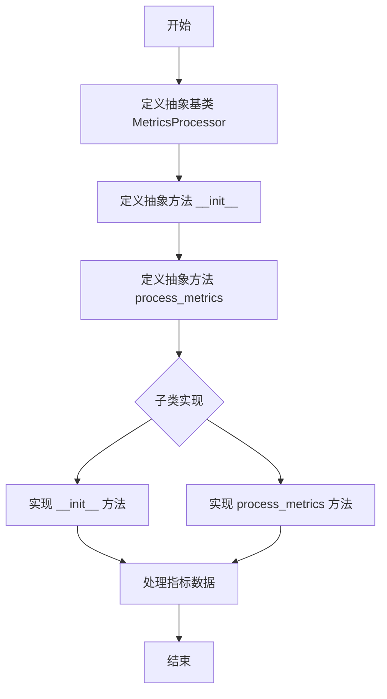
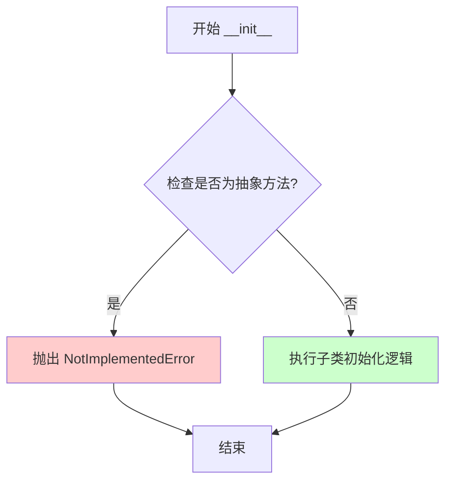
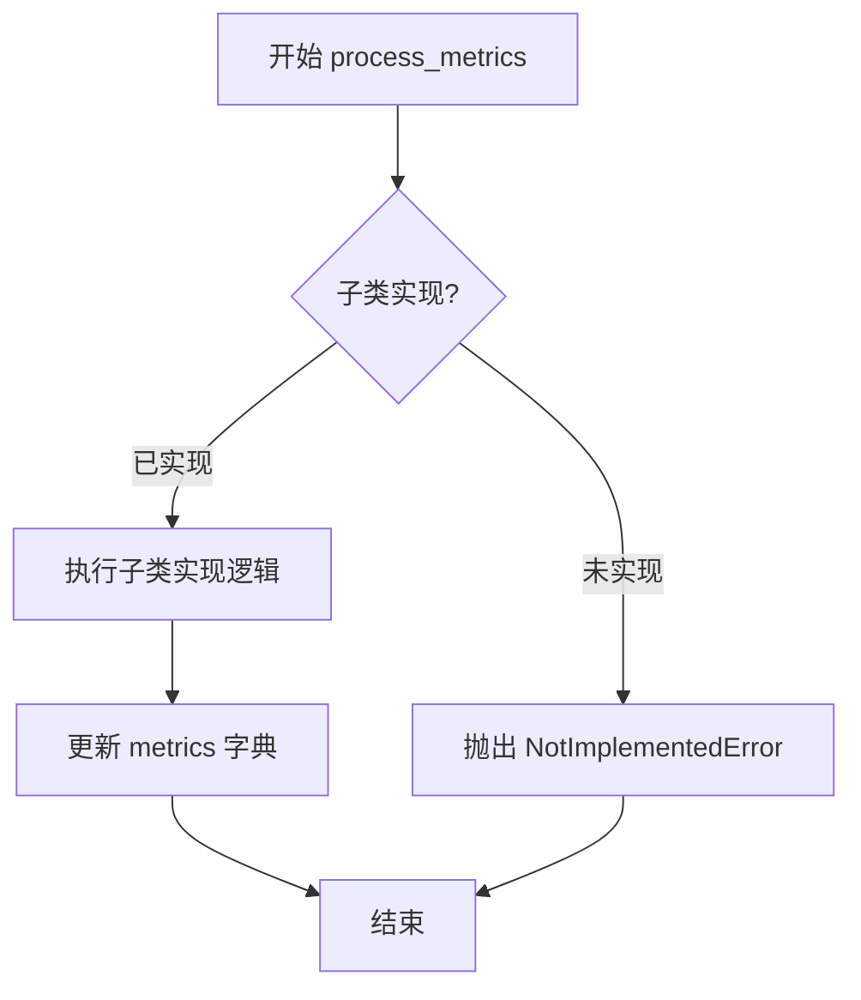

# `graphrag\packages\graphrag-llm\graphrag_llm\metrics\metrics_processor.py` 详细设计文档

这是一个指标处理器抽象基类，定义了处理LLM（大型语言模型）指标的接口规范。该类通过抽象方法process_metrics，要求子类实现具体的指标处理逻辑，用于收集和分析LLM调用过程中的各类性能指标数据。

## 整体流程



## 类结构

```
object
└── ABC (abc.ABC)
    └── MetricsProcessor
```

## 全局变量及字段


    

## 全局函数及方法


### MetricsProcessor.__init__

这是抽象基类 `MetricsProcessor` 的初始化方法，采用可变关键字参数（`**kwargs`）进行初始化，由于是抽象方法，具体实现由子类完成。

参数：

- `**kwargs`：`Any`，可变关键字参数，用于接收子类所需的任意配置参数

返回值：`None`，`__init__` 方法不返回值

#### 流程图



#### 带注释源码

```python
@abstractmethod
def __init__(self, **kwargs: Any):
    """Initialize MetricsProcessor.
    
    抽象方法，子类必须实现此方法。
    使用可变关键字参数允许子类接收任意配置。
    
    Args:
        **kwargs: Any - 可变关键字参数，由子类定义具体参数
        
    Raises:
        NotImplementedError: 当直接调用基类时抛出
    """
    raise NotImplementedError
```


### `MetricsProcessor.process_metrics`

这是一个抽象方法，用于处理和更新指标（Metrics）。该方法接收模型配置、输入参数和 LLM 响应，然后根据这些信息更新指标字典。由于是抽象方法，具体实现由子类完成。

参数：

- `model_config`：`ModelConfig`，模型配置参数
- `metrics`：`Metrics`，需要处理的指标对象
- `input_args`：`dict[str, Any]`，传递给完成或嵌入函数的输入参数
- `response`：`LLMCompletionResponse | Iterator[LLMCompletionChunk] | AsyncIterator[LLMCompletionChunk] | LLMEmbeddingResponse`，LLM 返回的响应

返回值：`None`，该方法直接修改 `metrics` 字典，不返回任何值

#### 流程图



#### 带注释源码

```python
@abstractmethod
def process_metrics(
    self,
    *,
    model_config: "ModelConfig",
    metrics: "Metrics",
    input_args: dict[str, Any],
    response: "LLMCompletionResponse \
        | Iterator[LLMCompletionChunk] \
        | AsyncIterator[LLMCompletionChunk] \
        | LLMEmbeddingResponse",
) -> None:
    """处理指标。

    更新 metrics 字典（原地修改）。

    参数
    ----
        metrics: Metrics
            要处理的指标。
        input_args: dict[str, Any]
            传递给 completion 或 embedding 的输入参数，
            用于生成响应。
        response: LLMCompletionResponse | Iterator[LLMCompletionChunk] | LLMEmbeddingResponse
            来自 LLM 的 completion 或 embedding 响应。

    返回值
    -------
        None
    """
    raise NotImplementedError
```

## 关键组件


### MetricsProcessor 抽象基类

用于处理LLM指标的核心抽象基类，定义了指标处理的接口规范。

### process_metrics 抽象方法

核心指标处理方法，支持多种响应类型（同步/异步completion、embedding）的指标处理。

### 类型提示系统

支持LLMCompletionResponse、LLMCompletionChunk（同步/异步迭代器）、LLMEmbeddingResponse等多种响应类型的类型安全处理。

### 文档字符串规范

详细的参数和返回值说明，包含Args和Returns部分的标准文档格式。

### 抽象方法设计模式

通过ABC和abstractmethod实现模板方法模式，强制子类实现具体的指标处理逻辑。


## 问题及建议


### 已知问题

-   `__init__` 方法被定义为抽象方法不符合常规设计模式，通常抽象基类的构造函数不需要也不应该抽象化
-   文档字符串中的参数描述与实际方法签名不匹配，文档仅描述了 `metrics`、`input_args`、`response` 三个参数，但实际签名包含 `model_config` 参数
-   抽象类没有提供任何默认实现或通用功能，子类必须完全重写所有方法，缺乏代码复用性
-   `process_metrics` 方法的 `response` 参数类型注解使用了反斜杠换行，这种写法不够规范且降低可读性
-   抽象方法使用 `**kwargs: Any` 传递参数，缺乏明确的接口契约，子类无法明确知道需要哪些配置
-   没有定义任何异常类或错误处理机制，当子类实现不当时缺乏统一的错误处理策略

### 优化建议

-   将 `__init__` 方法改为普通方法，提供基础初始化逻辑或移除该抽象方法
-   修正文档字符串中的参数列表，确保与实际方法签名一致
-   考虑提供部分默认实现或辅助方法，如日志记录、错误验证等通用功能
-   将复杂的类型注解移至单独行，使用括号包裹提高可读性
-   明确定义抽象方法的参数规范，而非使用 `**kwargs` 传递不确定参数
-   考虑添加 `__repr__` 或 `__str__` 方法便于调试
-   可考虑添加类级别的配置验证或钩子方法，提升扩展性

## 其它


### 设计目标与约束

设计目标：定义一个统一的指标处理接口规范，允许不同的指标处理器实现类来捕获和处理LLM调用过程中的各类指标数据（如延迟、Token使用量、错误率等），实现指标收集的解耦和可扩展性。

设计约束：
1. 该类为抽象基类，必须通过子类实现具体逻辑
2. process_metrics方法必须支持同步响应、异步响应、Streaming响应等多种LLM响应类型
3. 方法设计为in-place修改metrics字典，不应返回新字典对象
4. 子类实现时需兼容ModelConfig、Metrics、input_args等输入参数

### 错误处理与异常设计

由于该类为抽象基类，错误处理主要依赖于子类实现：
1. 子类在实现process_metrics时应捕获可能的异常（如响应解析错误、数据格式错误等），避免异常向上传播导致主流程中断
2. NotImplementedError用于标识抽象方法未实现，属于设计层面的异常
3. 建议子类在遇到无效输入参数时记录警告而非抛出异常，保证指标收集的容错性

### 数据流与状态机

数据流：
1. 外部调用方（如LLM客户端）创建MetricsProcessor子类实例
2. 调用方在LLM调用前后准备metrics字典、input_args参数
3. 调用方获取LLM响应后，调用process_metrics方法
4. 方法内部读取response中的指标数据，更新metrics字典

状态机：
- 该类本身无状态，仅提供方法签名规范
- 状态依赖于具体子类实现，可能包含缓存状态、配置状态等

### 外部依赖与接口契约

外部依赖：
1. graphrag_llm.config.ModelConfig - 模型配置类，提供模型相关参数
2. graphrag_llm.types.Metrics - 指标字典类型
3. graphrag_llm.types.LLMCompletionResponse - LLM同步完成响应
4. graphrag_llm.types.LLMCompletionChunk - LLM流式响应块
5. graphrag_llm.types.LLMEmbeddingResponse - LLM嵌入响应

接口契约：
1. 子类必须实现__init__和process_metrics方法
2. process_metrics的input_args参数应包含调用LLM时的输入参数（如prompt、model、temperature等）
3. response参数可能是多种类型，子类需通过类型判断或duck typing处理不同响应格式
4. metrics参数为dict子类或类似字典对象，方法需直接修改该对象

### 扩展点与插件机制

扩展方式：
1. 继承MetricsProcessor抽象基类，创建具体处理器实现
2. 可实现多种处理器分别处理不同类型的指标（如Token计数器、延迟记录器、成本计算器等）
3. 处理器可在初始化时接收自定义配置参数（通过kwargs传递）
4. 多个处理器可组合使用，形成指标处理链

插件化场景：
- 可通过注册机制动态加载不同的指标处理器
- 支持按配置启用/禁用特定处理器
- 处理器之间可通过共享metrics对象协同工作

### 性能考虑

性能优化点：
1. process_metrics方法应避免复杂的同步阻塞操作，影响LLM调用主流程
2. 对于流式响应，建议采用增量更新而非累积后统一处理
3. 避免在方法内进行频繁的IO操作（如文件读写、网络请求），如需异步操作应使用异步方法
4. 多次调用时应考虑缓存机制，减少重复计算


    