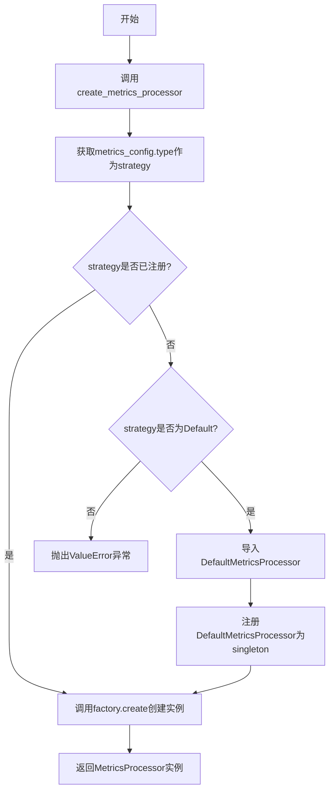
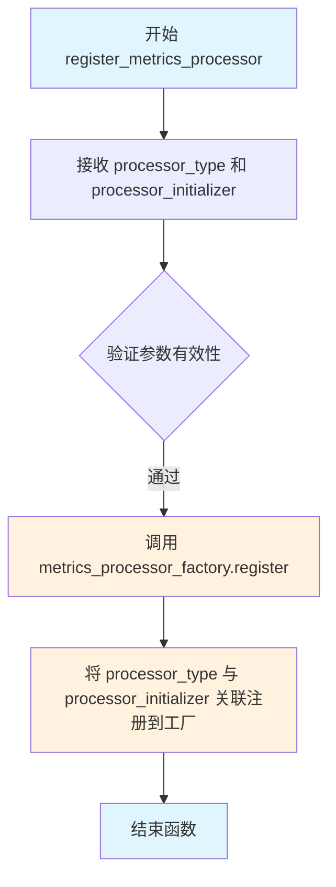
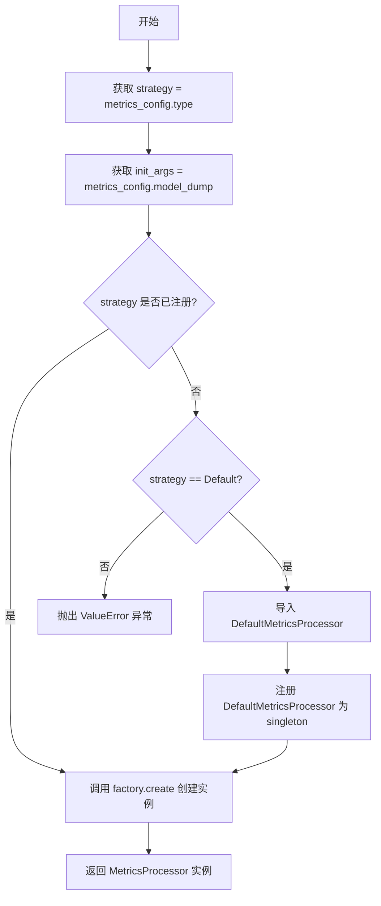

# `graphrag\packages\graphrag-llm\graphrag_llm\metrics\metrics_processor_factory.py` 详细设计文档

指标处理器工厂模块，通过工厂模式根据配置动态创建和管理不同类型的MetricsProcessor实例，支持自定义处理器的注册和按需加载。

## 整体流程



## 类结构

```
MetricsProcessorFactory (工厂类)
└── Factory[MetricsProcessor] (泛型基类)
```

## 全局变量及字段


### `metrics_processor_factory`
    
用于创建和管理 MetricsProcessor 实例的工厂单例，支持注册自定义处理器并根据配置创建相应的处理器实例

类型：`MetricsProcessorFactory[MetricsProcessor]`
    


### `模块级全局变量.metrics_processor_factory`
    
MetricsProcessor 工厂的单例实例，负责处理器的注册、查找和实例化

类型：`MetricsProcessorFactory[MetricsProcessor]`
    
    

## 全局函数及方法


### `register_metrics_processor`

用于向指标处理器工厂注册自定义指标处理器实现，使系统能够通过工厂模式创建不同类型的指标处理器。

参数：

- `processor_type`：`str`，指标处理器的类型标识符，用于在工厂中唯一标识该处理器
- `processor_initializer`：`Callable[..., MetricsProcessor]`，可调用的指标处理器初始化器，实际创建 MetricsProcessor 实例的函数

返回值：`None`，无返回值，仅执行注册逻辑

#### 流程图



#### 带注释源码

```python
def register_metrics_processor(
    processor_type: str,
    processor_initializer: Callable[..., MetricsProcessor],
) -> None:
    """Register a custom metrics processor implementation.

    Args
    ----
        processor_type: str
            The metrics processor id to register.
        processor_initializer: Callable[..., MetricsProcessor]
            The metrics processor initializer to register.
    """
    # 调用工厂实例的 register 方法，将处理器类型和初始化器注册到工厂中
    # 后续可以通过 factory.create(processor_type) 来创建对应的处理器实例
    metrics_processor_factory.register(processor_type, processor_initializer)
```


### `create_metrics_processor`

该函数是指标处理器的工厂方法，根据传入的 `MetricsConfig` 配置对象，创建并返回一个对应的 `MetricsProcessor` 实例。如果配置中指定的处理器类型未注册，且为默认类型，则自动导入并注册默认处理器；若为未知类型则抛出 `ValueError` 异常。

参数：

- `metrics_config`：`MetricsConfig`，指标处理器的配置对象，包含处理器类型及其他相关配置

返回值：`MetricsProcessor`，根据配置创建的指标处理器实例

#### 流程图



#### 带注释源码

```python
def create_metrics_processor(metrics_config: "MetricsConfig") -> MetricsProcessor:
    """Create a MetricsProcessor instance based on the configuration.

    Args
    ----
        metrics_config: MetricsConfig
            The configuration for the metrics processor.

    Returns
    -------
        MetricsProcessor:
            An instance of a MetricsProcessor subclass.
    """
    # 从配置中获取处理器类型策略
    strategy = metrics_config.type
    # 将配置对象序列化为字典，作为初始化参数
    init_args = metrics_config.model_dump()

    # 检查该策略是否已在工厂中注册
    if strategy not in metrics_processor_factory:
        # 根据不同的策略类型进行处理
        match strategy:
            # 如果是默认类型，则导入并注册默认处理器
            case MetricsProcessorType.Default:
                from graphrag_llm.metrics.default_metrics_processor import (
                    DefaultMetricsProcessor,
                )

                # 将默认处理器注册为单例模式
                metrics_processor_factory.register(
                    strategy=MetricsProcessorType.Default,
                    initializer=DefaultMetricsProcessor,
                    scope="singleton",
                )
            # 其他未注册的策略类型，抛出错误
            case _:
                msg = f"MetricsConfig.processor '{strategy}' is not registered in the MetricsProcessorFactory. Registered strategies: {', '.join(metrics_processor_factory.keys())}"
                raise ValueError(msg)

    # 通过工厂创建 MetricsProcessor 实例
    return metrics_processor_factory.create(
        strategy=strategy,
        init_args={
            **init_args,
            # 将原始配置对象也传入，供处理器内部使用
            "metrics_config": metrics_config,
        },
    )
```

## 关键组件


### MetricsProcessorFactory

工厂类，继承自Factory基类，负责创建MetricsProcessor实例的工厂模式实现。

### metrics_processor_factory

工厂单例实例，用于注册和创建指标处理器。

### register_metrics_processor

全局注册函数，用于将自定义的指标处理器实现注册到工厂中，支持动态扩展指标处理器类型。

### create_metrics_processor

核心创建函数，根据配置创建相应的MetricsProcessor实例，包含默认处理器自动注册逻辑和错误处理。

### MetricsProcessorType

从配置模块导入的枚举类型，用于标识不同的指标处理器类型。


## 问题及建议


### 已知问题

-   **延迟注册逻辑违反开闭原则** - `create_metrics_processor`函数中仅对`MetricsProcessorType.Default`进行特殊处理，其他策略类型不在工厂注册则直接抛异常，未来新增处理器类型需要修改此函数
-   **字符串类型与枚举类型混用** - `strategy`变量接收的是字符串(`metrics_config.type`)，但与`MetricsProcessorType`枚举进行比较，类型不安全
-   **配置对象重复传递** - `init_args`中同时包含`model_dump()`序列化的结果和原始的`metrics_config`对象，造成数据冗余
-   **缺少线程安全机制** - `metrics_processor_factory`是全局单例，工厂的`register`和`create`方法在多线程环境下可能产生竞态条件
-   **工厂注册后未验证** - 延迟注册`DefaultMetricsProcessor`时未检查是否已存在同策略的注册，可能导致重复注册覆盖

### 优化建议

-   将延迟注册逻辑改为统一的注册机制，或使用配置驱动的自动注册方式
-   统一使用`MetricsProcessorType`枚举类型进行策略标识，避免字符串比较
-   移除`init_args`中的`metrics_config`冗余传递，直接使用`model_dump()`结果
-   在工厂类中实现线程锁或使用线程安全的数据结构
-   延迟注册前先检查策略是否已存在：使用`hasattr`或`in`检查后再注册
-   考虑将错误消息中的`keys()`调用移出，或在异常处理前进行缓存，减少异常构造开销
-   为工厂类添加类型注解`Factory[MetricsProcessor]`，确保泛型类型安全


## 其它


### 设计目标与约束

该模块采用工厂模式实现度量处理器(MetricsProcessor)的灵活创建，支持自定义处理器的注册机制。设计目标包括：1) 提供统一的处理器创建入口，简化调用方逻辑；2) 支持运行时动态注册新处理器类型；3) 支持单例作用域以优化资源使用；4) 内置默认处理器作为降级方案。约束条件包括：必须依赖`graphrag_common.factory.Factory`基类、处理器类型必须在`MetricsProcessorType`枚举中定义或通过注册机制添加、创建时需要传入完整的`MetricsConfig`配置对象。

### 错误处理与异常设计

模块定义了明确的错误处理机制。当`strategy`参数指定的处理器类型未在工厂中注册时，会区分两种处理路径：若策略为`MetricsProcessorType.Default`，则自动注册默认处理器；若为其他未知类型，则抛出`ValueError`异常，错误消息包含当前策略名称及已注册策略列表，便于开发者定位问题。异常信息格式：`"MetricsConfig.processor '{strategy}' is not registered in the MetricsProcessorFactory. Registered strategies: {keys}"`。建议调用方在捕获`ValueError`后检查策略有效性或联系管理员添加新处理器支持。

### 数据流与状态机

数据流主要分为三个阶段：**注册阶段**→**配置阶段**→**创建阶段**。注册阶段通过`register_metrics_processor`函数将处理器类型与初始化器绑定，支持运行时扩展；配置阶段由`create_metrics_processor`接收`MetricsConfig`对象，提取`type`字段作为策略标识并序列化配置；创建阶段工厂根据策略查找已注册的初始化器，若不存在则回退到默认处理器，最终返回配置好的`MetricsProcessor`实例。状态机转换：`INITIAL`→`REGISTERED`(自定义注册)→`CONFIGURED`(配置加载)→`CREATED`(实例生成)，其中默认处理器会自动完成`INITIAL`→`REGISTERED`的隐式转换。

### 外部依赖与接口契约

模块依赖以下外部组件形成接口契约：1) **Factory基类**（`graphrag_common.factory.Factory`）：提供`register`、`create`、`keys`、`__contains__`等方法，工厂实现者需遵循其接口规范；2) **MetricsProcessorType枚举**（`graphrag_llm.config.types`）：定义合法的处理器类型，当前包含`Default`及其他扩展类型；3) **MetricsProcessor基类**（`graphrag_llm.metrics.metrics_processor`）：所有具体处理器的父类，工厂创建的对象必须为此类型或其子类；4) **MetricsConfig配置类**（`graphrag_llm.config`）：包含`type`字段（处理器类型标识）和`model_dump()`方法用于配置序列化；5) **DefaultMetricsProcessor**（`graphrag_llm.metrics.default_metrics_processor`）：默认实现，当策略为`MetricsProcessorType.Default`时自动加载。调用方需保证传入的`metrics_config`非空且`type`字段有效。

### 关键组件信息

| 组件名称 | 一句话描述 |
|---------|-----------|
| MetricsProcessorFactory | 继承自Factory的泛型工厂类，用于管理MetricsProcessor实例的创建生命周期 |
| metrics_processor_factory | 全局单例工厂实例，供整个模块使用 |
| register_metrics_processor | 全局注册函数，允许外部代码添加自定义处理器实现 |
| create_metrics_processor | 全局创建函数，根据配置创建并返回对应的处理器实例 |
| DefaultMetricsProcessor | 默认的度量处理器实现，作为降级方案自动注册 |

### 潜在的技术债务或优化空间

1. **缺少类型安全检查**：当前`register_metrics_processor`的`processor_initializer`参数类型为`Callable[..., MetricsProcessor]`，未严格约束返回类型，建议使用`Protocol`或泛型约束增强类型安全。2. **配置序列化风险**：`create_metrics_processor`中使用`model_dump()`将整个配置对象展开为字典，可能包含敏感字段或不必要的配置项，建议显式指定需要传递的字段列表。3. **全局单例状态**：`metrics_processor_factory`作为全局变量存在状态污染风险，在多线程环境下可能被并发修改，建议添加线程锁保护或提供工厂实例化方法。4. **缺少日志记录**：当前实现无任何日志输出，调试时难以追踪处理器注册和创建流程，建议添加结构化日志。5. **默认处理器自动注册逻辑**：当策略不匹配时自动注册默认处理器的行为可能导致意外覆盖，建议将此行为显式化或提供配置开关。


    