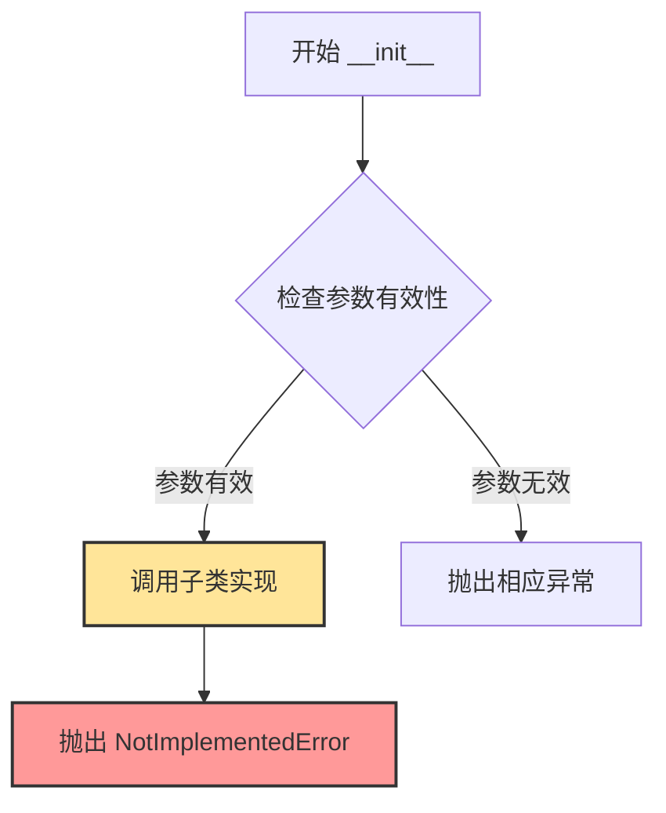
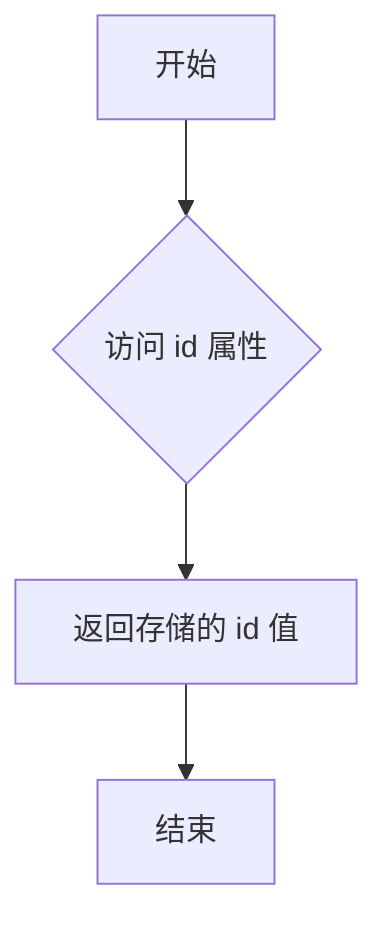
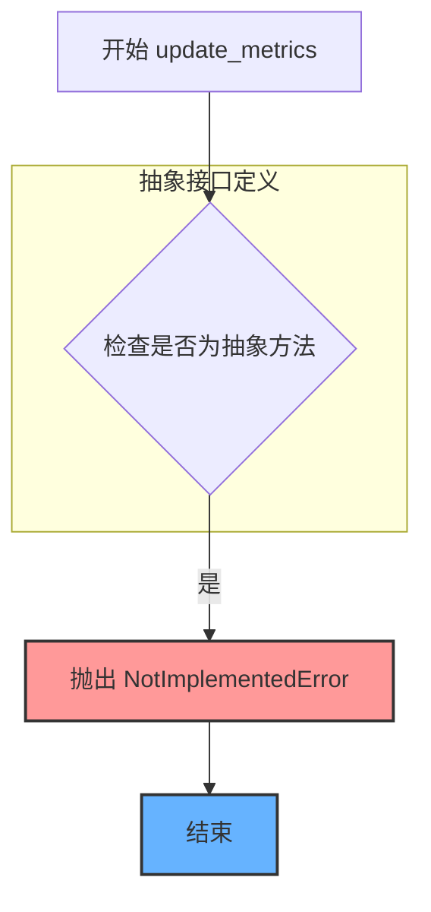
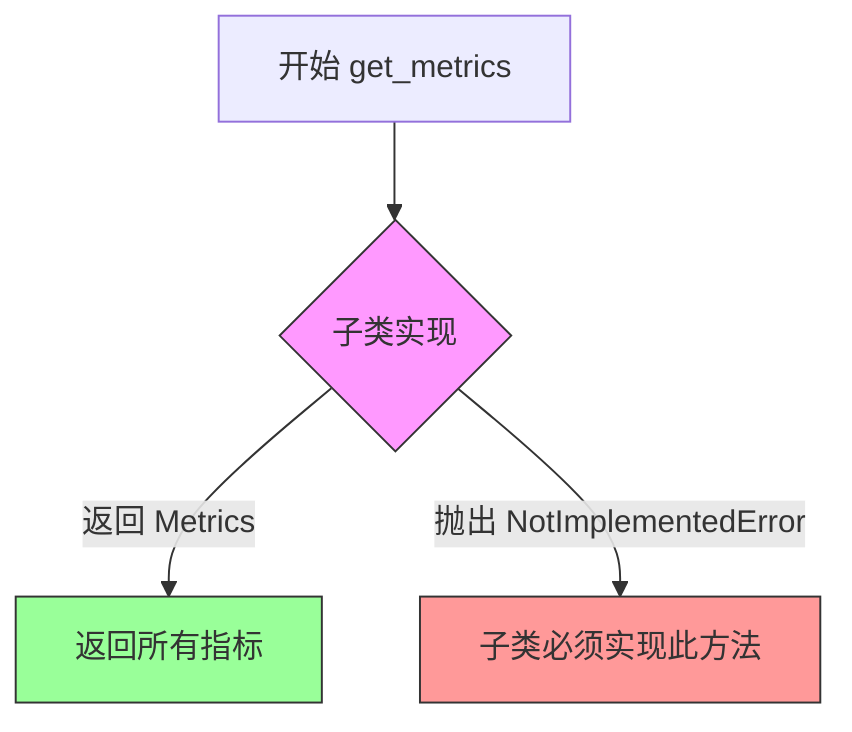
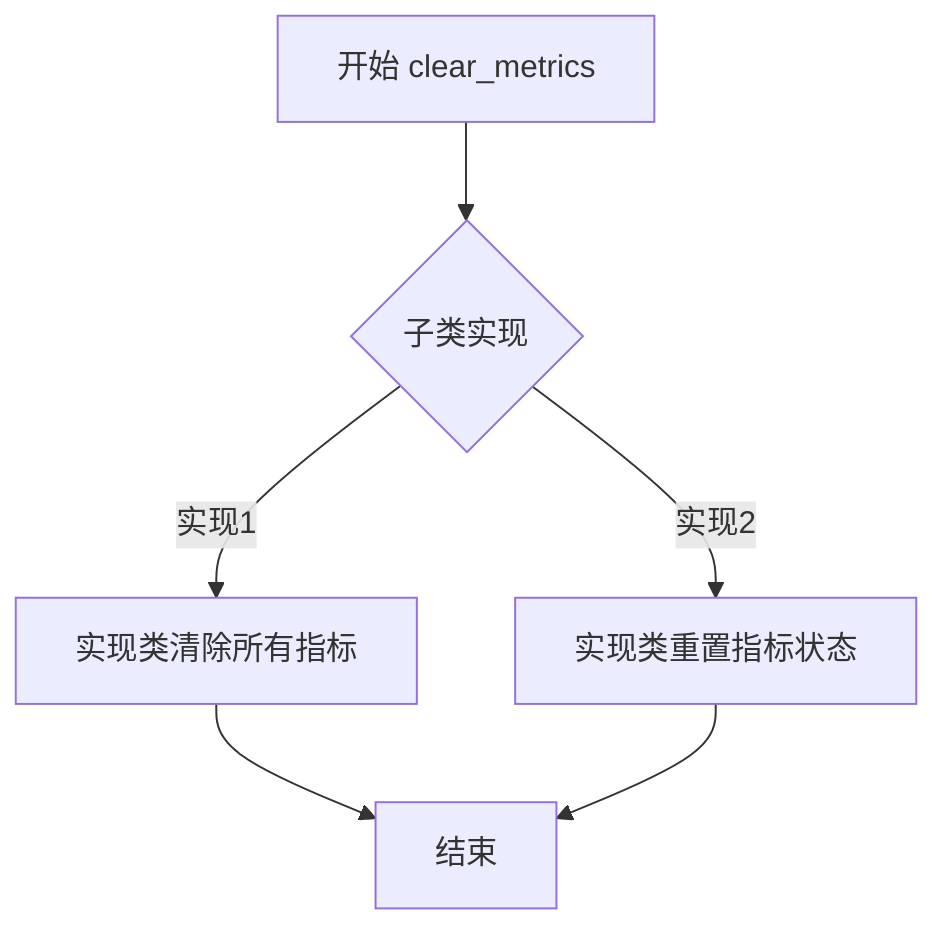

# `graphrag\packages\graphrag-llm\graphrag_llm\metrics\metrics_store.py` 详细设计文档

这是一个指标存储的抽象基类，定义了指标存储的标准接口，包括初始化、ID获取、指标更新、指标获取和指标清除等操作，用于支持不同实现方式的指标存储方案。

## 整体流程

```mermaid
graph TD
    A[开始] --> B[创建 MetricsStore 子类实例]
B --> C{初始化参数}
C --> D[设置 ID 和 MetricsWriter]
D --> E[调用 update_metrics 更新指标]
E --> F[调用 get_metrics 获取指标]
F --> G[调用 clear_metrics 清除指标]
G --> H[结束]
note: 这是一个抽象基类，定义了接口规范，具体流程由子类实现
```

## 类结构

```
MetricsStore (抽象基类)
└── 实现类待扩展
```

## 全局变量及字段


### `MetricsStore.id`
    
metrics store 的唯一标识符，用于区分不同的指标存储实例

类型：`str`
    


### `MetricsStore.metrics_writer`
    
用于写入指标的 MetricsWriter 实例，可选参数

类型：`MetricsWriter | None`
    
    

## 全局函数及方法


### `MetricsStore.__init__`

初始化 MetricsStore 抽象基类，用于存储和管理指标数据。该方法是一个抽象方法，要求子类实现具体的初始化逻辑。

参数：

- `id`：`str`，metrics store 的唯一标识符，通常使用模型 ID（如 openai/gpt-4o），以便按模型追踪和聚合指标
- `metrics_writer`：`MetricsWriter | None`，可选的指标写入器，用于将指标写入存储
- `**kwargs`：`Any`，其他可选关键字参数，用于扩展

返回值：`None`，`__init__` 方法不返回任何值

#### 流程图



#### 带注释源码

```python
@abstractmethod
def __init__(
    self,
    *,
    id: str,
    metrics_writer: "MetricsWriter | None" = None,
    **kwargs: Any,
) -> None:
    """Initialize MetricsStore.

    Args
    ----
        id: str
            The ID of the metrics store.
            One metric store is created per ID so a good
            candidate is the model id (e.g., openai/gpt-4o).
            That way one store tracks and aggregates the metrics
            per model.
        metrics_writer: MetricsWriter
            The metrics writer to use for writing metrics.

    """
    raise NotImplementedError
```

#### 说明

这是一个**抽象方法**（使用 `@abstractmethod` 装饰器），本身不能直接实例化，必须由子类继承并实现。该方法通过 `raise NotImplementedError` 明确表明需要子类实现具体逻辑。

**设计意图**：
- `id` 参数用于标识不同的 metrics store，支持按模型 ID 进行指标隔离和聚合
- `metrics_writer` 是可选的，允许在不指定写入器的情况下创建存储
- `**kwargs` 提供了扩展性，子类可以接受额外的配置参数


### `MetricsStore.id`

获取 MetricsStore 的唯一标识符。该属性返回与当前指标存储区关联的 ID（通常为模型 ID），用于标识和区分不同的指标存储实例。

参数：无（这是一个属性而非方法）

返回值：`str`，metrics store 的唯一标识符

#### 流程图



#### 带注释源码

```python
@property
@abstractmethod
def id(self) -> str:
    """Get the ID of the metrics store."""
    raise NotImplementedError
```

**代码说明：**

- `@property`：Python 装饰器，将方法转换为只读属性
- `@abstractmethod`：声明此属性为抽象方法，要求子类必须实现
- `-> str`：类型注解，表明返回值为字符串类型
- `"""Get the ID of the metrics store."""`：文档字符串，说明该属性的用途是获取指标存储区的 ID
- `raise NotImplementedError`：由于这是抽象基类，具体实现由子类完成


### `MetricsStore.update_metrics`

更新存储中的多个指标，将传入的 Metrics 对象合并到存储中。

参数：

-  `metrics`：`Metrics`，需要合并到存储中的指标

返回值：`None`，无返回值

#### 流程图



#### 带注释源码

```python
@abstractmethod
def update_metrics(self, *, metrics: "Metrics") -> None:
    """Update the store with multiple metrics.

    Args
    ----
        metrics: Metrics
            The metrics to merge into the store.

    Returns
    -------
        None
    """
    # 抽象方法，由子类实现具体逻辑
    # 此处仅定义接口规范，不包含实际实现
    raise NotImplementedError
```


### `MetricsStore.get_metrics`

从存储中获取所有收集的指标数据，返回包含所有 Metrics 对象的集合。

参数：

- 无参数

返回值：`Metrics`，存储在当前指标存储中的所有指标数据

#### 流程图



#### 带注释源码

```python
@abstractmethod
def get_metrics(self) -> "Metrics":
    """Get all metrics from the store.

    Returns
    -------
        Metrics:
            All metrics stored in the store.
    """
    raise NotImplementedError
```

**源码说明：**

- `@abstractmethod`：装饰器，标识此方法为抽象方法，必须由子类实现
- `def get_metrics(self) -> "Metrics"`：方法签名，返回类型为 Metrics（字符串引用避免循环导入）
- `"""Get all metrics from the store."""`：方法文档字符串，说明方法功能为获取所有存储的指标
- `Returns` 部分：说明返回值为存储在 store 中的所有 Metrics 对象
- `raise NotImplementedError`：抽象方法占位符，强制子类实现具体逻辑


### MetricsStore.clear_metrics

清除存储中的所有指标数据。

参数：

- 无参数（仅包含 `self`）

返回值：`None`，无返回值

#### 流程图



#### 带注释源码

```python
@abstractmethod
def clear_metrics(self) -> None:
    """Clear all metrics from the store.

    Returns
    -------
        None
    """
    raise NotImplementedError
```

---

**方法说明**：

- **方法名**：`clear_metrics`
- **所属类**：`MetricsStore`（抽象基类）
- **方法类型**：抽象方法（`@abstractmethod`）
- **功能**：清除存储中的所有指标数据，将指标重置为初始状态
- **设计意图**：提供一个统一的接口让子类实现具体的清除逻辑，例如清空内部字典、重置计数器等操作
- **注意事项**：由于是抽象方法，具体实现由子类提供，调用时需确保子类已正确实现此方法

## 关键组件


### MetricsStore (ABC)

抽象基类，定义了指标存储的标准接口，提供了指标更新、获取和清除的统一规范，支持按模型ID跟踪和聚合指标。

### id 属性

抽象属性，用于获取指标存储实例的唯一标识符，通常对应模型ID（如 openai/gpt-4o），确保每个模型拥有独立的指标存储。

### metrics_writer

指标写入器组件，负责将指标数据持久化，支持可选配置，允许在不指定写入器的情况下创建存储实例。

### update_metrics 方法

抽象方法，接收 Metrics 对象并将其合并到存储中，用于增量更新指标数据，支持多轮推理过程中的指标累积。

### get_metrics 方法

抽象方法，从存储中检索所有已累积的指标数据，返回完整的 Metrics 对象，供外部调用者分析或展示。

### clear_metrics 方法

抽象方法，清空存储中所有指标数据，用于重置状态或释放内存，支持在新的评估周期开始时进行初始化。

### 抽象方法设计模式

该类采用抽象基类（ABC）设计模式，强制子类实现所有核心方法，确保不同存储后端（内存、文件、数据库等）提供一致的接口契约。


## 问题及建议


### 已知问题

-   **冗余的 NotImplementedError 抛出**：所有抽象方法体中都包含 `raise NotImplementedError`，这是多余的，因为使用 `@abstractmethod` 装饰的方法在子类未实现时直接实例化就会报错。
-   **id 属性的设计冗余**：定义了 `__init__` 方法接受 `id` 参数，同时又定义了 `@property` 抽象属性 `id` 来获取 ID，这造成了数据存储的歧义（子类需要在两处都保存 id）。
-   **内置函数 id 被覆盖**：参数名使用 `id` 会覆盖 Python 内置的 `id()` 函数，虽然在类内部影响有限，但不符合最佳实践。
-   **kwargs 参数意义不明确**：`__init__` 方法接收 `**kwargs: Any` 但未说明其用途和预期参数，增加了 API 的不确定性和理解成本。
-   **缺少类级别的文档说明**：类文档字符串仅有一句话描述，未说明该类的设计目的、使用场景或与具体子类的关系。
-   **无线程安全设计**：作为指标存储容器，未考虑并发访问场景（如多线程写入/读取），可能导致数据竞争。
-   **无资源管理协议**：未实现上下文管理器协议（`__enter__`/`__exit__` 或 `__aenter__`/`__aexit__`），无法确保资源如 MetricsWriter 的正确释放。

### 优化建议

-   **移除冗余的 NotImplementedError**：删除所有方法体中的 `raise NotImplementedError`，仅保留方法签名和抽象方法装饰器。
-   **重构 id 访问方式**：移除 `__init__` 中的 `id` 参数，改为在 `id` 属性中通过其他方式获取或直接在子类构造函数中定义；或移除 `id` 属性，改为在 `__init__` 中存储并在方法中直接使用实例变量。
-   **重命名参数避免覆盖内置函数**：将 `id` 参数改为 `store_id` 或 `metrics_id`。
-   **明确 kwargs 的用途**：在文档中详细说明哪些额外参数是可接受的，或者移除 `**kwargs` 以提高 API 清晰度。
-   **添加并发控制机制**：在具体实现类中添加线程锁（threading.Lock）或异步锁（asyncio.Lock）以保证并发安全。
-   **实现上下文管理器协议**：添加 `__enter__`/`__exit__` 或 `__aenter__`/`__aexit__` 方法以支持 `with` 或 `async with` 语法，确保资源清理。

## 其它


### 设计目标与约束

设计目标：定义一个通用的指标存储抽象基类，为具体的指标存储实现提供统一的接口规范，支持指标的更新、获取和清除操作。约束条件：具体实现类必须实现所有抽象方法，ID属性为必需字段，metrics_writer为可选依赖。

### 错误处理与异常设计

由于该类为抽象基类，所有方法均抛出NotImplementedError，具体实现类需自行定义异常处理策略。常见异常场景包括：无效的ID格式、metrics_writer未初始化、metrics数据格式错误等。建议在具体实现中定义自定义异常类继承自Exception或ValueError。

### 外部依赖与接口契约

外部依赖：
- MetricsWriter类：用于写入指标数据，具体实现需依赖graphrag_llm.metrics.metrics_writer.MetricsWriter
- Metrics类型：来自graphrag_llm.types，用于定义指标数据结构
接口契约：
- __init__方法必须接受id参数和可选的metrics_writer参数
- update_metrics方法接收Metrics对象并合并到存储中
- get_metrics方法返回当前存储的所有Metrics对象
- clear_metrics方法清空所有存储的指标数据

### 使用场景与示例

使用场景：
- 在LLM应用中用于跟踪模型性能指标
- 多模型场景下按模型ID分别存储和聚合指标
- 需要对指标数据进行持久化或实时分析的架构中作为数据存储层抽象

示例代码：
```python
# 具体实现类示例
class InMemoryMetricsStore(MetricsStore):
    def __init__(self, *, id: str, metrics_writer=None, **kwargs):
        self._id = id
        self._metrics_writer = metrics_writer
        self._metrics = {}
    
    @property
    def id(self) -> str:
        return self._id
    
    def update_metrics(self, *, metrics: "Metrics") -> None:
        # 合并指标逻辑
        pass
    
    def get_metrics(self) -> "Metrics":
        return self._metrics
    
    def clear_metrics(self) -> None:
        self._metrics = {}
```

### 性能考量

由于是抽象基类，性能特性取决于具体实现。设计时应考虑：
- update_metrics操作的时间复杂度
- get_metrics返回数据的拷贝开销
- 大规模指标数据下的内存占用
- 是否需要批量处理能力

### 线程安全性

该抽象基类未定义线程安全机制，具体实现需自行考虑：
- 如果在多线程环境下使用，需要添加锁机制
- 或者使用线程安全的数据结构
- 建议在文档中明确说明线程安全要求

### 扩展性设计

扩展方向：
- 可添加批量操作方法如batch_update_metrics
- 可添加指标过滤和聚合方法
- 可添加持久化相关方法如save/load
- 可添加指标订阅和回调机制
- 支持插件化的metrics_writer实现

    