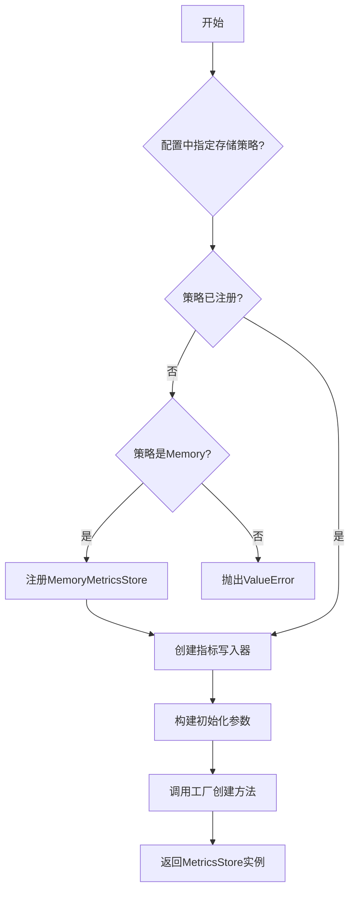
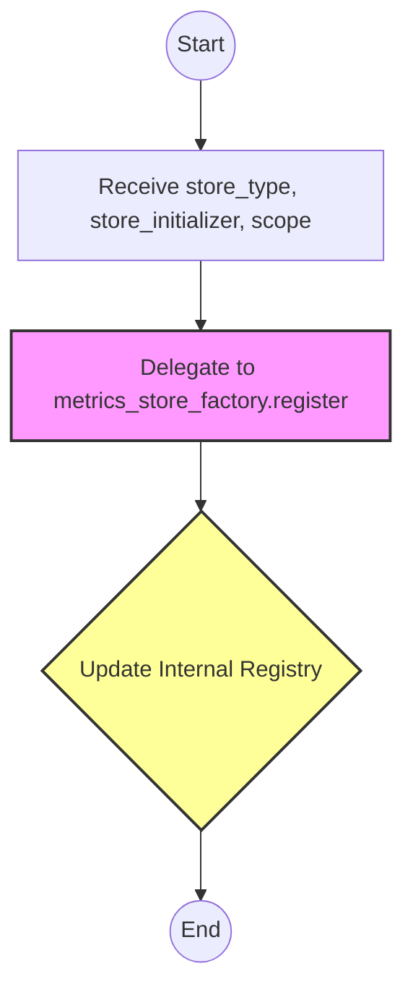
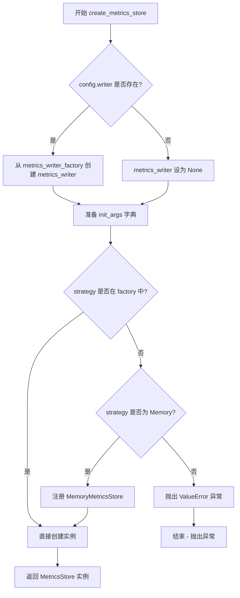
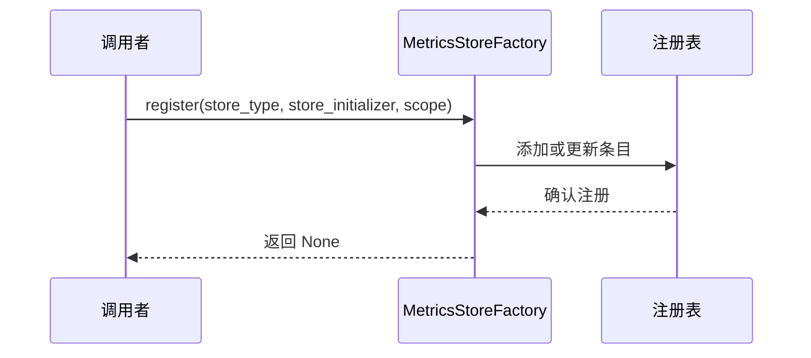
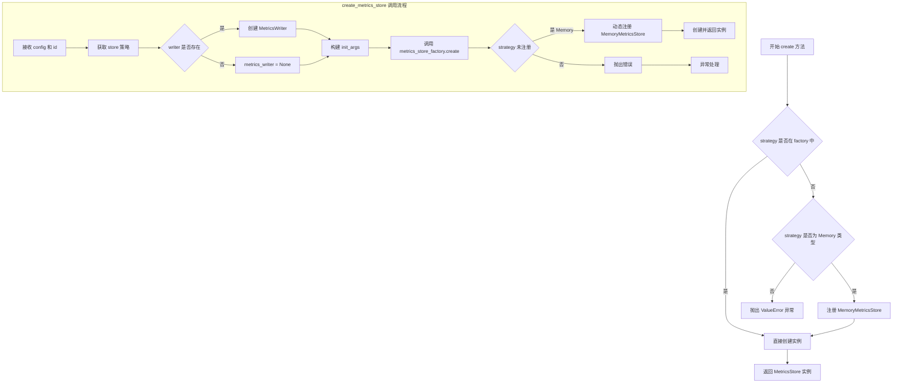
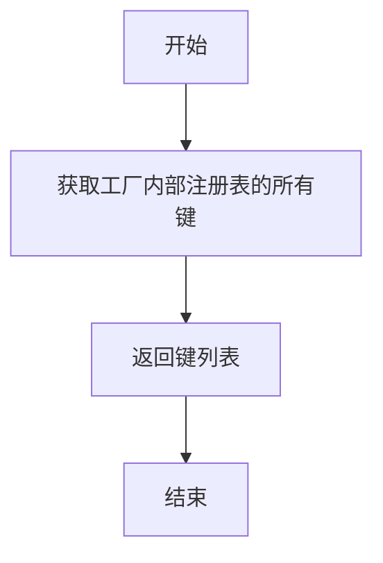

# `graphrag\packages\graphrag-llm\graphrag_llm\metrics\metrics_store_factory.py` 详细设计文档

这是一个指标存储工厂模块，用于根据配置创建和管理不同类型的指标存储实例，支持注册自定义指标存储实现，并提供内存存储等内置策略。

## 整体流程



## 类结构

```
Factory<T> (泛型抽象工厂)
└── MetricsStoreFactory (指标存储工厂)
    └── 被创建: MetricsStore (接口)
        ├── MemoryMetricsStore (内存实现)
        └── 其它自定义实现
```

## 全局变量及字段


### `metrics_store_factory`
    
用于创建MetricsStore实例的工厂单例，负责注册和管理不同类型的metrics store实现

类型：`MetricsStoreFactory`
    


    

## 全局函数及方法


### `register_metrics_store`

该函数作为 `MetricsStore` 工厂的注册接口，允许开发者将自定义的指标存储实现（Initializer）绑定到特定的类型标识符（Store Type）上，并配置其生命周期作用域。

参数：

- `store_type`：`str`，指标存储的唯一标识符（ID），用于在配置中引用。
- `store_initializer`：`Callable[..., MetricsStore]`，一个可调用对象（通常是类），用于实例化 `MetricsStore`。
- `scope`：`"ServiceScope"`，服务作用域，默认为 `"transient"`（瞬态），定义了该类型实例的生命周期管理方式。

返回值：`None`，该函数仅执行注册操作，不返回任何数据。

#### 流程图



#### 带注释源码

```python
def register_metrics_store(
    store_type: str,
    store_initializer: Callable[..., MetricsStore],
    scope: "ServiceScope" = "transient",
) -> None:
    """Register a custom metrics store implementation.

    Args
    ----
        store_type: str
            The metrics store id to register.
        store_initializer: Callable[..., MetricsStore]
            The metrics store initializer to register.
    """
    # 调用全局工厂实例的 register 方法，将类型和初始化器绑定
    metrics_store_factory.register(store_type, store_initializer, scope)
```


### `create_metrics_store`

该函数根据提供的配置动态创建并返回一个 MetricsStore 实例。它首先检查是否需要创建 metrics_writer，然后如果指定的存储策略尚未注册到工厂中，则自动注册默认的内存存储实现，最后通过工厂模式创建并初始化完整的 MetricsStore 实例。

参数：

- `config`：`MetricsConfig`，metrics 存储的配置对象，包含存储类型、写入器等配置信息
- `id`：`str`，metrics 存储的标识符，通常用于标识具体的模型或服务，例如 "openai/gpt-4o"

返回值：`MetricsStore`，一个 MetricsStore 子类的实例，具体类型取决于配置中的 store 策略

#### 流程图



#### 带注释源码

```python
def create_metrics_store(config: "MetricsConfig", id: str) -> MetricsStore:
    """Create a MetricsStore instance based on the configuration.

    Args
    ----
        config: MetricsConfig
            The configuration for the metrics store.
        id: str
            The identifier for the metrics store.
            Example: openai/gpt-4o

    Returns
    -------
        MetricsStore:
            An instance of a MetricsStore subclass.
    """
    # 获取配置中的存储策略类型
    strategy = config.store
    
    # 初始化 metrics_writer 为 None
    metrics_writer: MetricsWriter | None = None
    
    # 检查配置中是否指定了 writer
    if config.writer:
        # 动态导入并创建 metrics writer
        from graphrag_llm.metrics.metrics_writer_factory import create_metrics_writer
        metrics_writer = create_metrics_writer(config)
    
    # 从配置对象中提取初始化参数
    init_args: dict[str, Any] = config.model_dump()

    # 检查指定的存储策略是否已注册到工厂中
    if strategy not in metrics_store_factory:
        # 如果未注册，根据策略类型进行注册
        match strategy:
            case MetricsStoreType.Memory:
                # 动态导入内存存储实现
                from graphrag_llm.metrics.memory_metrics_store import MemoryMetricsStore
                # 将内存存储注册到工厂，使用单例模式
                register_metrics_store(
                    store_type=strategy,
                    store_initializer=MemoryMetricsStore,
                    scope="singleton",
                )
            case _:
                # 对于未支持的策略，抛出详细的错误信息
                msg = f"MetricsConfig.store '{strategy}' is not registered in the MetricsStoreFactory. Registered strategies: {', '.join(metrics_store_factory.keys())}"
                raise ValueError(msg)

    # 通过工厂创建 metrics store 实例，传入完整的初始化参数
    return metrics_store_factory.create(
        strategy=strategy,
        init_args={
            **init_args,
            "id": id,
            "metrics_config": config,
            "metrics_writer": metrics_writer,
        },
    )
```


### `MetricsStoreFactory.register`

继承自 `Factory` 基类的方法，用于向工厂注册自定义的度量存储实现。

参数：

- `store_type`：`str`，度量存储的类型标识符，用于后续创建实例时的键
- `store_initializer`：`Callable[..., MetricsStore]`，度量存储的初始化函数或类
- `scope`：`ServiceScope`（字符串字面量），服务作用域，控制实例的生命周期（如 "transient" 或 "singleton"）

返回值：`None`，无返回值，仅执行注册操作

#### 流程图



#### 带注释源码

```python
# 由于 register 方法继承自 Factory 基类，
# 以下是代码中实际调用 register 的上下文：

def register_metrics_store(
    store_type: str,
    store_initializer: Callable[..., MetricsStore],
    scope: "ServiceScope" = "transient",
) -> None:
    """注册一个自定义的度量存储实现。
    
    参数:
        store_type: 度量存储的唯一标识符
        store_initializer: 可调用对象，用于创建 MetricsStore 实例
        scope: 服务作用域，控制实例生命周期
    """
    # 调用 Factory 基类的 register 方法进行注册
    metrics_store_factory.register(store_type, store_initializer, scope)


# 在 create_metrics_store 函数中的实际使用示例：
# case MetricsStoreType.Memory:
#     register_metrics_store(
#         store_type=strategy,
#         store_initializer=MemoryMetricsStore,
#         scope="singleton",
#     )
```


### `MetricsStoreFactory.create`

该方法是继承自 `Factory` 基类的工厂方法，用于根据传入的策略（strategy）创建对应的 `MetricsStore` 实例。在代码中通过 `metrics_store_factory.create()` 被调用，支持动态注册新的存储类型，并根据配置初始化包含 id、metrics_config 和 metrics_writer 的完整实例。

参数：

-  `strategy`：`str`，指标存储的类型标识符（如 "memory" 或自定义类型）
-  `init_args`：`dict[str, Any]`，初始化参数字典，包含 id、metrics_config 和 metrics_writer 等配置

返回值：`MetricsStore`，返回创建的指标存储实例

#### 流程图



#### 带注释源码

```python
# 调用 Factory 基类的 create 方法创建指标存储实例
return metrics_store_factory.create(
    strategy=strategy,  # 存储策略类型，如 "memory"
    init_args={
        **init_args,  # 展开配置字典
        "id": id,  # 指标存储的唯一标识
        "metrics_config": config,  # 完整的指标配置对象
        "metrics_writer": metrics_writer,  # 可选的指标写入器
    },
)
```


### `MetricsStoreFactory.keys`

返回工厂中已注册的所有指标存储类型的键（标识符）列表。

参数：

- 无

返回值：`list[str]`，已注册的指标存储类型标识符列表

#### 流程图



#### 带注释源码

```
# 注意：此方法继承自 Factory 基类，未在此文件中直接定义
# 基于代码中使用方式推断其行为

# 在 create_metrics_store 函数中的使用示例：
if strategy not in metrics_store_factory:
    # ... 注册逻辑 ...
    raise ValueError(f"... Registered strategies: {', '.join(metrics_store_factory.keys())}")

# 推断的基类方法签名（来自 Factory 父类）：
def keys(self) -> list[str]:
    """返回工厂中已注册的所有 store_type 键列表。
    
    Returns
    -------
        list[str]:
            所有已注册的指标存储类型标识符，例如 ['memory', 'sqlite', ...]
    """
    # 返回内部注册表中所有 store_type 的键
    return list(self._registry.keys())
```

#### 额外说明

**设计目标与约束**：
- 该方法用于查询当前工厂中已注册可用的指标存储实现类型
- 继承自 `graphrag_common.factory.Factory` 基类

**使用场景**：
- 在 `create_metrics_store` 函数中用于生成错误信息，列出所有已注册的策略供用户参考
- 帮助开发者调试时了解系统支持哪些指标存储类型

**技术债务/优化空间**：
- 由于 `keys` 方法定义在外部基类中，文档缺失，需要查阅 `graphrag_common` 包才能确认其完整签名
- 建议在项目中添加对基类方法的类型注解和文档链接

## 关键组件


### MetricsStoreFactory

工厂基类，继承自通用Factory，用于创建和管理MetricsStore实例的工厂模式实现，支持注册和动态创建不同类型的指标存储。

### metrics_store_factory

全局工厂实例，提供指标存储的注册和创建功能，作为系统中的单例使用。

### register_metrics_store

全局注册函数，允许动态注册自定义的指标存储实现，支持指定服务作用域（transient/singleton）。

### create_metrics_store

核心创建函数，根据配置动态创建对应的指标存储实例，处理指标写入器初始化和存储策略的动态注册。

### MetricsWriter

指标写入器接口，集成在指标存储创建流程中，负责将指标数据持久化到目标存储。

### MetricsStoreType

指标存储类型枚举，定义系统支持的存储策略（如Memory内存存储）。

### MemoryMetricsStore

内存实现的指标存储，提供基于内存的指标暂存能力，作为默认存储策略之一。

### MetricsConfig

指标配置类，通过model_dump方法导出配置字典，驱动指标存储的初始化参数。

### 动态注册机制

支持运行时注册新的存储实现，通过工厂模式实现可扩展的存储后端支持。

### 策略模式

根据配置中的store字段动态选择存储实现，支持开闭原则的扩展。


## 问题及建议


### 已知问题

- **类型注解不一致**：`scope: "ServiceScope" = "transient"` 使用字符串字面量作为默认值，但类型注解为 `ServiceScope`，可能导致类型检查器警告或运行时类型不匹配
- **重复注册逻辑冗余**：在 `create_metrics_store` 中每次调用都会检查 `strategy not in metrics_store_factory`，如果不在则动态注册，这导致注册逻辑分散在两处（`register_metrics_store` 函数和 `create_metrics_store` 函数内部），违反了单一职责原则
- **动态导入缺乏错误处理**：当 `config.writer` 存在时导入 `create_metrics_writer`，但未捕获可能的导入异常，缺乏健壮的错误处理
- **配置字段泄露**：`config.model_dump()` 可能包含不必要的字段直接传入 `init_args`，导致初始化参数膨胀和不必要的依赖
- **全局工厂实例状态**：`metrics_store_factory` 作为全局单例，缺乏线程安全保证，在并发场景下可能出现竞态条件
- **Magic String 使用**：`"singleton"` 和 `"transient"` 字符串未定义为常量，容易产生拼写错误

### 优化建议

- 将 `scope` 的默认值改为枚举类型或常量，确保类型安全
- 在模块初始化时预先注册所有内置的 `MetricsStore` 实现，而非在运行时动态注册
- 对动态导入添加 try-except 包装，提供有意义的错误信息
- 在构建 `init_args` 前过滤或显式选择必要的配置字段，避免传递冗余数据
- 考虑为工厂实例添加线程锁或使用线程安全的单例模式
- 定义常量类或枚举来管理 scope 和 store_type 的合法值，如 `ScopeEnum` 或 `MetricsStoreType`

## 其它


### 项目概述

该模块实现了一个指标存储工厂模式，通过工厂模式动态创建和管理不同类型的指标存储（MetricsStore）实例，支持内存存储等策略，并提供自定义存储实现的注册机制。

### 文件整体运行流程

该模块主要处理指标存储的创建流程：首先检查配置中指定的存储策略是否已注册，若未注册且为内置的Memory类型则自动注册；然后根据配置创建对应的指标存储实例，在创建过程中注入指标写入器（MetricsWriter）和相关配置参数。调用方通过调用`create_metrics_store`函数并传入配置和标识ID即可获得相应类型的指标存储实例。

### 类详细信息

#### MetricsStoreFactory

工厂类，继承自`graphrag_common.factory.Factory`，用于创建`MetricsStore`实例的工厂实现。

### 全局变量

#### metrics_store_factory

- **类型**: MetricsStoreFactory
- **描述**: 指标存储工厂的单例实例，用于注册和创建各种类型的指标存储实现

### 全局函数

#### register_metrics_store

- **函数签名**: `register_metrics_store(store_type: str, store_initializer: Callable[..., MetricsStore], scope: "ServiceScope" = "transient") -> None`
- **参数说明**:
  - `store_type`: 字符串类型，要注册的指标存储类型标识符
  - `store_initializer`: 可调用对象类型，用于初始化指标存储的函数或类
  - `scope`: ServiceScope类型，作用域，默认为"transient"（瞬态）
- **返回值**: None
- **功能描述**: 注册一个新的指标存储实现到工厂中，使其可以通过工厂创建

#### create_metrics_store

- **函数签名**: `create_metrics_store(config: "MetricsConfig", id: str) -> MetricsStore`
- **参数说明**:
  - `config`: MetricsConfig类型，指标存储的配置对象，包含存储策略、写入器等配置
  - `id`: 字符串类型，指标存储的唯一标识符，例如"openai/gpt-4o"
- **返回值**: MetricsStore类型，创建的指标存储实例
- **功能描述**: 根据配置创建一个指标存储实例，支持自动注册内置存储类型

### 关键组件信息

1. **Factory基类**: 来自graphrag_common的通用工厂基类，提供注册和创建实例的基础功能
2. **MetricsStore**: 指标存储的抽象接口或基类，定义了指标存储的标准行为
3. **MetricsConfig**: 配置类，包含指标存储的配置信息，如存储策略、写入器配置等
4. **MetricsWriter**: 指标写入器接口，用于将指标数据写入到指定的存储后端
5. **MemoryMetricsStore**: 内置的内存存储实现，用于在内存中存储指标数据

### 潜在技术债务与优化空间

1. **类型安全**: 使用`Any`类型字典传递初始化参数可能导致运行时类型错误，建议增强类型提示
2. **错误处理**: 对于未注册的存储策略，仅提供错误信息而缺乏重试机制或降级策略
3. **依赖管理**: 存在延迟导入（lazy import）模式，可能影响代码的可读性和静态分析
4. **扩展性**: 目前内置存储类型较少，对于新的存储后端支持需要手动注册
5. **配置验证**: 缺少对配置参数的预验证，创建实例失败时错误信息不够详细

### 设计目标与约束

设计目标主要是提供一种灵活的可扩展的指标存储创建机制，通过工厂模式解耦指标存储的具体实现与调用方，支持多种存储后端的动态切换。约束包括必须实现MetricsStore接口、配置参数需符合model_dump序列化要求、存储类型必须在工厂中注册等。

### 错误处理与异常设计

当请求的存储策略未在工厂中注册时，函数会抛出ValueError异常，异常信息包含具体的策略名称和已注册的策略列表，便于开发者排查配置错误。延迟导入的错误（如MetricsWriter创建失败）会向上传播，由调用方处理。

### 数据流与状态机

数据流方向：配置对象 → 工厂注册检查 → 创建初始化参数 → 调用工厂create方法 → 实例化具体存储实现 → 返回MetricsStore实例。状态转换主要发生在存储策略的注册状态从未注册到已注册的过程，以及从配置到实例的创建过程。

### 外部依赖与接口契约

主要依赖包括：graphrag_common包提供的Factory基类、graphrag_llm.config中的MetricsConfig配置类、graphrag_llm.metrics中的MetricsStore和MetricsWriter接口。接口契约要求所有注册的存储初始化器必须返回MetricsStore或其子类实例，配置对象必须支持model_dump方法用于序列化。

### 配置模型与序列化

配置通过MetricsConfig的model_dump方法序列化为字典，用于传递初始化参数。这种方式确保配置对象能够透明地传递给具体的存储实现，同时保持了配置与创建逻辑的解耦。

    