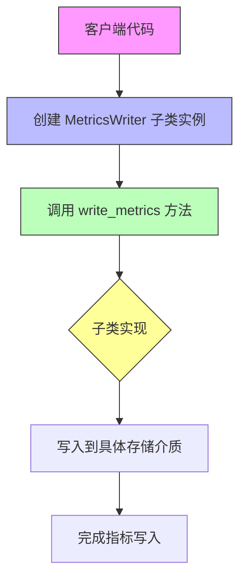
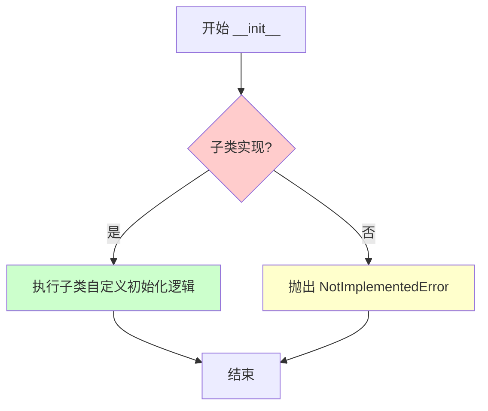
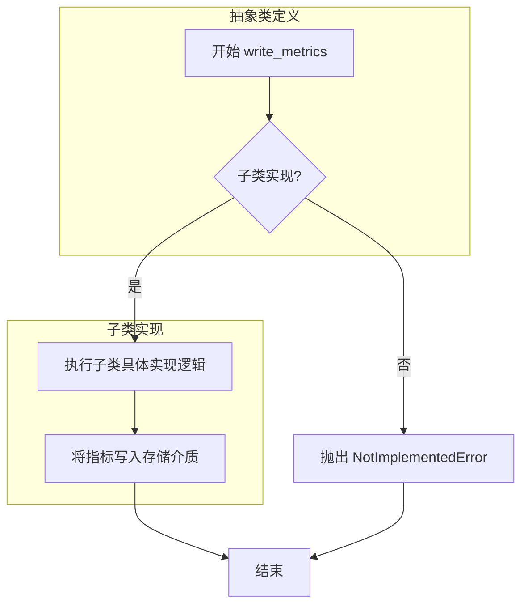

# `graphrag\packages\graphrag-llm\graphrag_llm\metrics\metrics_writer.py` 详细设计文档

这是一个指标写入器的抽象基类，定义了写入指标数据的接口规范。所有具体的指标写入实现类都需要继承此类并实现write_metrics方法，用于将 Metrics 对象写入到不同的存储介质（如文件、数据库、云服务等）。

## 整体流程



## 类结构

```
MetricsWriter (抽象基类)
└── [具体实现类待定义]
```

## 全局变量及字段


    

## 全局函数及方法


### `MetricsWriter.__init__`

抽象方法，定义指标写入器的初始化接口。子类需要实现此方法以完成具体的初始化逻辑，例如配置存储后端、建立连接或设置内部状态。

参数：

-  `**kwargs`：`Any`，可变关键字参数，用于子类初始化配置

返回值：`None`，无返回值

#### 流程图



#### 带注释源码

```python
@abstractmethod
def __init__(self, **kwargs: Any) -> None:
    """Initialize MetricsWriter.
    
    抽象方法，子类需要实现此方法进行初始化。
    
    Args:
        **kwargs: 可变关键字参数，用于子类初始化配置
                 具体参数由子类根据其需求定义
    
    Returns:
        None
    
    Raises:
        NotImplementedError: 如果子类未实现此方法直接调用时抛出
    """
    raise NotImplementedError
```


### `MetricsWriter.write_metrics`

抽象方法，定义了指标写入的接口规范。子类必须实现此方法以将指标数据写入到具体的存储介质（如文件、数据库或监控系统）。

参数：

- `id`：`str`，指标的标识符，用于唯一标识一组指标数据
- `metrics`：`Metrics`，要写入的指标数据对象，包含具体的指标内容

返回值：`None`，该方法不返回任何值，通过副作用（如写入存储）完成功能

#### 流程图



#### 带注释源码

```python
# Copyright (c) 2024 Microsoft Corporation.
# Licensed under the MIT License

"""Metrics writer abstract base class."""

from abc import ABC, abstractmethod
from typing import TYPE_CHECKING, Any

# 仅在类型检查时导入，避免运行时循环依赖
if TYPE_CHECKING:
    from graphrag_llm.types import Metrics


class MetricsWriter(ABC):
    """Abstract base class for metrics writers.
    
    抽象基类，定义了指标写入器的接口。
    所有具体的指标写入器都必须继承此类并实现 write_metrics 方法。
    """
    
    @abstractmethod
    def __init__(self, **kwargs: Any) -> None:
        """Initialize MetricsWriter.
        
        抽象初始化方法，子类需要实现此方法以完成特定的初始化逻辑。
        
        Raises:
            NotImplementedError: 如果子类没有实现此方法
        """
        raise NotImplementedError

    @abstractmethod
    def write_metrics(self, *, id: str, metrics: "Metrics") -> None:
        """Write the given metrics.
        
        抽象方法，子类需要实现此方法将指标写入到具体存储介质。
        该方法定义了指标写入的接口规范，由子类提供具体实现。
        
        Args
        ----
            id : str
                The identifier for the metrics.
                指标的标识符，用于唯一标识一组指标数据
            metrics : Metrics
                The metrics data to write.
                要写入的指标数据对象，包含具体的指标内容
        
        Returns
        -------
            None
                该方法不返回值，通过副作用完成功能
        
        Raises
        ------
            NotImplementedError
                如果在基类中直接调用此方法会抛出此异常
        """
        raise NotImplementedError
```

## 关键组件


### MetricsWriter

抽象基类，定义了指标写入器的接口规范，强制子类实现初始化和写入指标的方法。

### __init__

抽象初始化方法，接受任意关键字参数用于配置指标写入器，具体实现由子类完成。

### write_metrics

抽象方法，定义了写入指标的标准接口，接收指标ID和指标数据，强制子类实现具体的写入逻辑。

### TYPE_CHECKING

类型检查导入，用于避免循环导入，仅在类型检查时导入Metrics类型。

### Metrics类型

从graphrag_llm.types模块导入的指标数据类型，用于类型提示和类型检查。


## 问题及建议


### 已知问题

-   **抽象方法 `__init__` 设计不规范**：将 `__init__` 定义为抽象方法是非常规做法，通常抽象基类应提供具体的初始化逻辑或完全不需要定义抽象的 `__init__`，这会导致子类实现时的代码重复
-   **类型注解过于宽松**：`__init__` 使用 `**kwargs: Any` 缺乏明确性，子类无法清晰了解需要哪些配置参数
-   **循环类型引用**：`metrics: "Metrics"` 使用字符串形式的类型注解表明存在循环导入问题，应通过 TYPE_CHECKING 或重新组织类型定义解决
-   **缺少资源管理**：没有实现上下文管理器协议（`__enter__`/`__exit__`），无法确保资源正确释放（如文件句柄、数据库连接等）
-   **缺乏异步支持**：现代架构中指标写入可能是 I/O 密集型操作，缺少异步版本的方法（`async_write_metrics`）
-   **无错误处理机制**：`write_metrics` 方法未定义异常规范，子类实现时缺乏统一的错误处理契约
-   **文档格式不标准**：Args 部分的格式使用了不规范的 `----` 分隔符，且缺少 Returns 部分的说明

### 优化建议

-   **移除抽象 `__init__`**：在抽象基类中提供具体的初始化方法，接受通用配置参数，子类通过重写 `._init_impl()` 或使用模板方法模式扩展
-   **明确参数规范**：将 `**kwargs` 改为具体的 TypedDict 或 dataclass 定义，提供类型安全的配置
-   **解决循环导入**：将 `Metrics` 类型定义移至独立模块或在文件顶部使用 `from __future__ import annotations`
-   **添加上下文管理器**：实现 `__enter__`/`__exit__` 方法或添加 `async with` 支持
-   **添加异步接口**：定义 `async def write_metrics` 抽象方法，或提供基于 `asyncio` 的默认实现
-   **定义异常体系**：创建自定义异常类（如 `MetricsWriteError`），在文档中明确可能的异常情况
-   **添加日志记录**：在基类中添加日志功能，便于调试和监控
-   **提供默认实现**：考虑为 `write_metrics` 提供基类实现（如空实现或模板方法），减少子类重复代码


## 其它


### 设计目标与约束

设计目标：定义 metrics 写入器的抽象接口规范，约束所有具体实现类必须提供标准化的 metrics 写入能力。

设计约束：
- 该类为抽象基类（ABC），不允许直接实例化
- 子类必须实现所有抽象方法
- 使用 **kwargs 实现参数扩展性
- 方法签名遵循关键字参数（keyword-only arguments）规范

### 错误处理与异常设计

异常类型：
- NotImplementedError：当子类未实现抽象方法时抛出
- TypeError：当传入参数类型不符合预期时由 Python 解释器自动触发
- 依赖的 Metrics 类型相关的验证异常（由具体实现类定义）

异常处理原则：
- 抽象方法通过 raise NotImplementedError 明确要求子类实现
- 不在基类中处理具体业务逻辑异常，交给实现类根据业务场景定义

### 外部依赖与接口契约

外部依赖：
- `graphrag_llm.types.Metrics`：metrics 数据类型依赖
- `abc.ABC`：Python 内置抽象基类模块
- `typing.TYPE_CHECKING`：类型检查时的条件导入

接口契约：
- 子类必须实现 `__init__(self, **kwargs: Any) -> None` 方法
- 子类必须实现 `write_metrics(self, *, id: str, metrics: "Metrics") -> None` 方法
- `id` 参数为必填关键字参数，用于标识 metrics
- `metrics` 参数为必填关键字参数，类型为 Metrics

### 继承关系与实现要求

抽象方法要求：
- `__init__`：初始化方法，接受任意关键字参数，子类可扩展参数定义
- `write_metrics`：写入 metrics 的核心方法，必须实现写入逻辑

推荐子类实现考虑：
- 实现具体的写入逻辑（如文件写入、数据库写入、API 上报等）
- 可根据业务需求扩展额外的配置参数
- 建议添加类型提示的具体实现

### 线程安全考量

由于该基类不涉及具体实现，无法确定线程安全性要求。子类实现时需根据具体场景考虑：
- 如果涉及文件 I/O，可能需要文件锁
- 如果涉及网络请求，可能需要连接池管理
- 如果涉及共享资源访问，可能需要同步机制

### 版本演化与兼容性

当前版本为初始设计（v1.0），接口稳定：
- 抽象方法签名在后续迭代中应保持向后兼容
- 可通过添加新的抽象方法扩展功能（需谨慎评估）
- 子类实现应遵循接口契约，确保可替换性
    