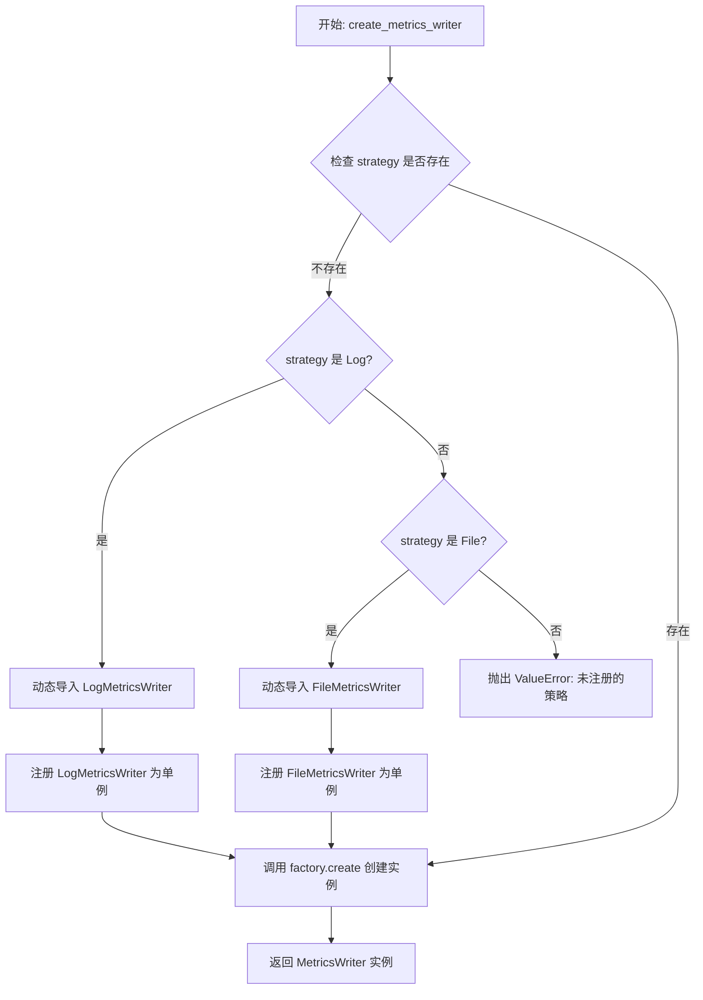
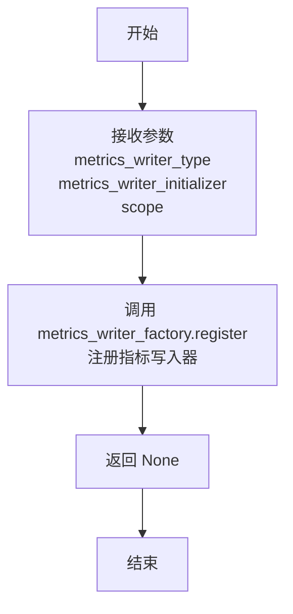
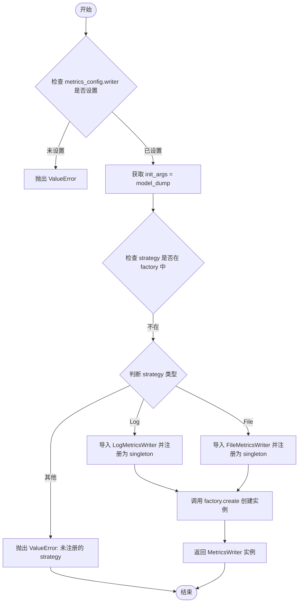
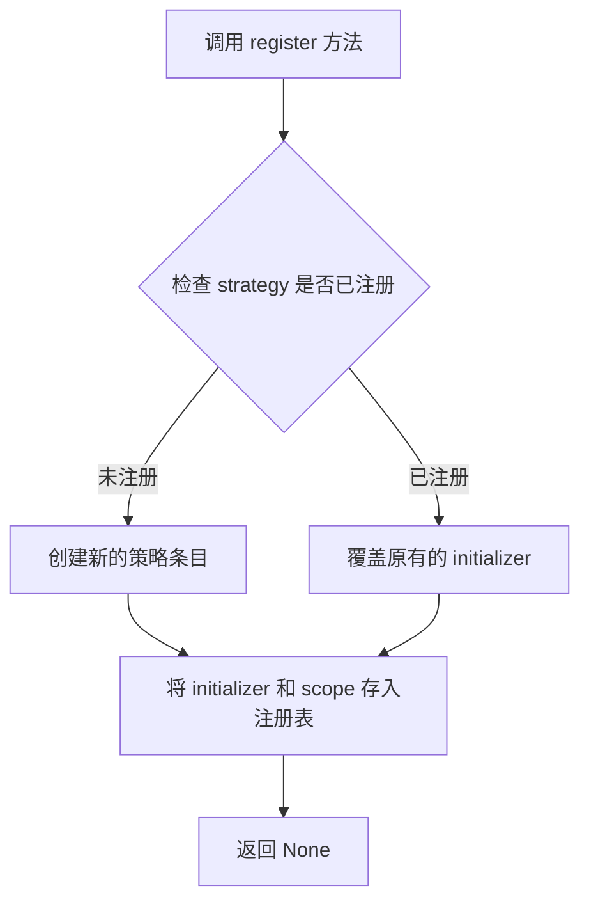
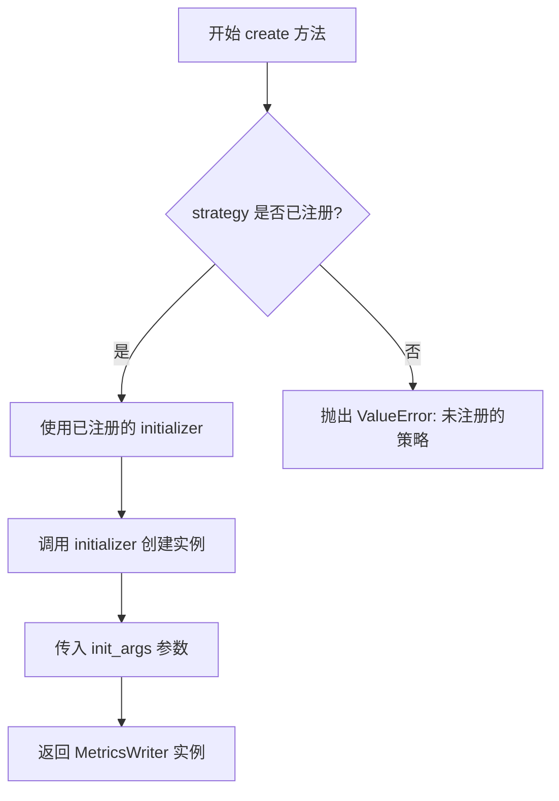
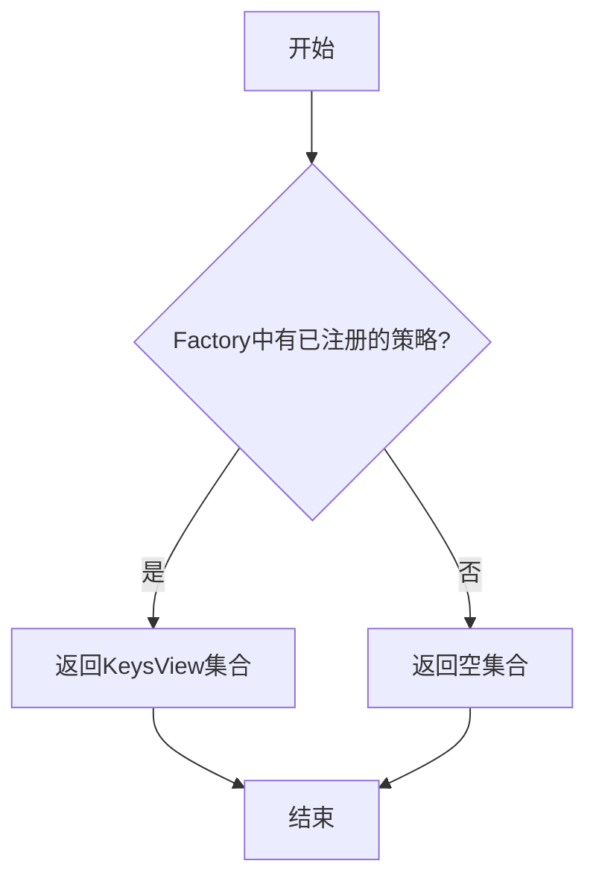
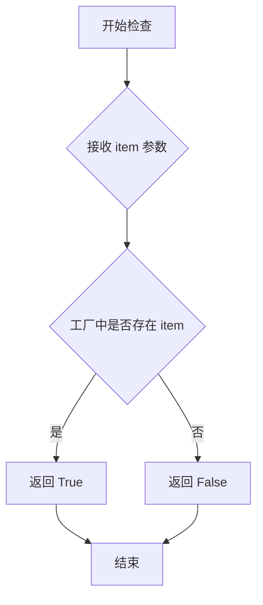

# `graphrag\packages\graphrag-llm\graphrag_llm\metrics\metrics_writer_factory.py` 详细设计文档

这是一个度量写入器工厂模块，通过工厂模式根据配置动态创建不同类型的MetricsWriter实例（LogMetricsWriter或FileMetricsWriter），支持自定义度量写入器的注册和单例/瞬态作用域管理。

## 整体流程



## 类结构

```
Factory<T> (抽象基类 - graphrag_common)
└── MetricsWriterFactory (度量写入器工厂)
    ├── LogMetricsWriter (日志写入器)
    └── FileMetricsWriter (文件写入器)
```

## 全局变量及字段


### `metrics_writer_factory`
    
指标写入器工厂实例，用于根据配置创建和管理不同类型的 MetricsWriter 对象

类型：`MetricsWriterFactory`
    


    

## 全局函数及方法


### `register_metrics_writer`

该函数用于在指标写入器工厂中注册自定义的指标写入器实现，允许调用者通过指定类型、初始化器和作用域来扩展系统的指标写入能力。

参数：

- `metrics_writer_type`：`str`，要注册的指标写入器的唯一标识符
- `metrics_writer_initializer`：`Callable[..., MetricsWriter]`，用于创建指标写入器实例的可调用对象（初始化器）
- `scope`：`ServiceScope`（默认值为 `"transient"`），指标写入器的服务作用域

返回值：`None`，无返回值，仅执行注册操作

#### 流程图



#### 带注释源码

```python
def register_metrics_writer(
    metrics_writer_type: str,  # 要注册的指标写入器类型标识符
    metrics_writer_initializer: Callable[..., MetricsWriter],  # 创建MetricsWriter实例的可调用对象
    scope: "ServiceScope" = "transient",  # 服务作用域，默认是瞬态的
) -> None:
    """Register a custom metrics writer implementation.

    Args
    ----
        metrics_writer_type: str
            The metrics writer id to register.
        metrics_writer_initializer: Callable[..., MetricsWriter]
            The metrics writer initializer to register.
        scope: ServiceScope (default: "transient")
            The service scope for the metrics writer.
    """
    # 调用工厂实例的register方法，将自定义的指标写入器注册到工厂中
    # 参数: metrics_writer_type - 写入器类型标识
    #       metrics_writer_initializer - 写入器初始化函数
    #       scope - 服务作用域，控制写入器的生命周期
    metrics_writer_factory.register(
        metrics_writer_type, metrics_writer_initializer, scope
    )
```


### `create_metrics_writer`

根据提供的配置创建一个 MetricsWriter 实例，支持动态注册 Log 和 File 类型的 MetricsWriter 实现。

参数：

-  `metrics_config`：`MetricsConfig`，用于配置 metrics writer 的参数

返回值：`MetricsWriter`，返回创建的 MetricsWriter 子类实例

#### 流程图



#### 带注释源码

```python
def create_metrics_writer(metrics_config: "MetricsConfig") -> MetricsWriter:
    """Create a MetricsWriter instance based on the configuration.

    Args
    ----
        metrics_config: MetricsConfig
            The configuration for the metrics writer.

    Returns
    -------
        MetricsWriter:
            An instance of a MetricsWriter subclass.
    """
    # 从配置中获取 writer 策略
    strategy = metrics_config.writer
    
    # 检查 strategy 是否已设置，未设置则抛出错误
    if not strategy:
        msg = "MetricsConfig.writer needs to be set to create a MetricsWriter."
        raise ValueError(msg)

    # 将配置序列化为字典，作为初始化参数
    init_args = metrics_config.model_dump()

    # 检查该 strategy 是否已经在工厂中注册
    if strategy not in metrics_writer_factory:
        # 根据不同的策略类型动态导入并注册对应的 MetricsWriter 实现
        match strategy:
            case MetricsWriterType.Log:
                # 导入日志类型的 MetricsWriter
                from graphrag_llm.metrics.log_metrics_writer import LogMetricsWriter

                # 将 LogMetricsWriter 注册到工厂，作用域为单例模式
                metrics_writer_factory.register(
                    strategy=MetricsWriterType.Log,
                    initializer=LogMetricsWriter,
                    scope="singleton",
                )
            case MetricsWriterType.File:
                # 导入文件类型的 MetricsWriter
                from graphrag_llm.metrics.file_metrics_writer import FileMetricsWriter

                # 将 FileMetricsWriter 注册到工厂，作用域为单例模式
                metrics_writer_factory.register(
                    strategy=MetricsWriterType.File,
                    initializer=FileMetricsWriter,
                    scope="singleton",
                )
            case _:
                # strategy 类型不匹配，抛出错误并列出已注册的策略
                msg = f"MetricsConfig.writer '{strategy}' is not registered in the MetricsWriterFactory. Registered strategies: {', '.join(metrics_writer_factory.keys())}"
                raise ValueError(msg)

    # 使用工厂模式创建 MetricsWriter 实例
    return metrics_writer_factory.create(strategy=strategy, init_args=init_args)
```


### `MetricsWriterFactory.register`

`MetricsWriterFactory.register` 是工厂基类提供的方法，用于注册指标写入器的初始化器。该方法继承自 `Factory` 基类，允许在运行时动态注册自定义的 `MetricsWriter` 实现，使其可以通过工厂创建。

参数：

-  `strategy`：`str`，指标写入器的标识符（策略名称），用于在后续调用 `create` 时指定要创建的写入器类型
-  `initializer`：`Callable[..., MetricsWriter]`，返回 `MetricsWriter` 实例的可调用对象（通常是类或工厂函数）
-  `scope`：`str`（可选），服务作用域，默认为 `"transient"`，可选值包括 `"singleton"`（单例）等

返回值：`None`，无返回值

#### 流程图



#### 带注释源码

```python
# 注意：此源码基于代码中实际调用 register 的方式反推得出
# Factory 基类中的 register 方法实现（推断）

def register(
    self,
    strategy: str,
    initializer: Callable[..., T],
    scope: str = "transient",
) -> None:
    """注册一个策略及其初始化器
    
    Args:
        strategy: 策略标识符，用于唯一识别该写入器
        initializer: 可调用对象，返回 MetricsWriter 实例
        scope: 服务作用域，控制实例的生命周期
    """
    # 将策略和对应的初始化器存入内部注册表
    # scope 参数用于控制创建实例时的生命周期管理
    self._registry[strategy] = {
        "initializer": initializer,
        "scope": scope,
    }
```

#### 实际使用示例（来自代码中的调用）

```python
# 在 create_metrics_writer 函数中的实际调用方式
metrics_writer_factory.register(
    strategy=MetricsWriterType.Log,
    initializer=LogMetricsWriter,
    scope="singleton",
)

# 在 register_metrics_writer 函数中的调用方式
metrics_writer_factory.register(
    metrics_writer_type, 
    metrics_writer_initializer, 
    scope
)
```

#### 备注

- 该方法定义在 `Factory` 基类中（`graphrag_common.factory.Factory`），`MetricsWriterFactory` 继承自该基类
- 实际的注册操作通过模块级函数 `register_metrics_writer` 间接调用完成
- 注册后的策略可以通过 `metrics_writer_factory.create()` 方法实例化相应的 `MetricsWriter`


### `MetricsWriterFactory.create`

该方法继承自 `Factory` 基类，用于根据策略类型和初始化参数创建具体的 `MetricsWriter` 实例。工厂模式允许动态注册和实例化不同的指标写入器实现（如日志写入器、文件写入器）。

参数：

-  `strategy`：`str`，指标写入器的策略类型标识符（如 "Log"、"File"）
-  `init_args`：`dict`，传递给指标写入器初始化函数的参数字典，包含从 `MetricsConfig` 提取的配置参数

返回值：`MetricsWriter`，返回具体指标写入器子类的实例

#### 流程图



#### 带注释源码

```
# 继承自 Factory 基类的方法
# 此方法根据 strategy 和 init_args 创建 MetricsWriter 实例

def create(
    self,
    strategy: str,  # 指标写入器类型标识
    init_args: Optional[Dict[str, Any]] = None,  # 初始化参数字典
) -> MetricsWriter:
    """Create a MetricsWriter instance based on strategy.

    Args:
        strategy: The metrics writer type identifier.
        init_args: Optional initialization arguments dict.

    Returns:
        A MetricsWriter subclass instance.
    """
    # 1. 从注册表中获取 strategy 对应的 initializer
    initializer = self._registry[strategy]  # type: Callable[..., MetricsWriter]
    
    # 2. 如果提供了 init_args，则解包参数并调用 initializer
    #    否则直接调用 initializer（使用默认参数）
    if init_args:
        return initializer(**init_args)
    else:
        return initializer()
    
    # 注：具体实现取决于 Factory 基类的源码
    # 此处为基于代码使用方式的推断
```


### `MetricsWriterFactory.keys`

该方法是 `MetricsWriterFactory` 类（继承自 `Factory` 基类）的一个方法，用于获取当前工厂中已注册的所有 Metrics Writer 的键（标识符）列表。

参数： 无

返回值：`KeysView[str]`（或类似的可迭代字符串集合），返回已注册的所有 Metrics Writer 类型标识符集合，可用于遍历或检查特定 Writer 是否已注册。

#### 流程图



#### 带注释源码

```python
# 该方法继承自 Factory 基类，在 graphrag_common.factory 中定义
# 根据代码中的使用方式 metrics_writer_factory.keys()，其主要逻辑如下：

def keys(self) -> KeysView[str]:
    """返回工厂中已注册的所有策略键。
    
    在 create_metrics_writer 函数中用于：
    1. 检查策略是否已注册 (strategy not in metrics_writer_factory)
    2. 生成已注册策略的错误提示信息
    
    Returns:
        KeysView[str]: 已注册策略的键视图，可迭代遍历
    """
    # 此方法由基类 Factory 提供实现
    # 返回内部注册表中所有 key 的视图
```


### `MetricsWriterFactory.__contains__`

检查工厂中是否已注册指定类型的指标写入器。

参数：

- `item`：`str`，要检查的指标写入器类型标识符

返回值：`bool`，如果指定类型的指标写入器已注册则返回 `True`，否则返回 `False`

#### 流程图



#### 带注释源码

```python
def __contains__(self, item: str) -> bool:
    """检查工厂中是否包含指定类型的指标写入器。

    该方法实现了 Python 的 'in' 操作符，使得可以使用
    'strategy in metrics_writer_factory' 的形式进行检查。

    Args:
        item: str
            要检查的指标写入器类型标识符（例如 'Log', 'File' 等）

    Returns:
        bool:
            如果工厂中已注册该类型的指标写入器返回 True，否则返回 False
    """
    # 调用内部键集合的 __contains__ 方法进行检查
    return item in self._strategies
```

**注意**：由于 `MetricsWriterFactory` 继承自 `graphrag_common.factory.Factory` 基类，`__contains__` 方法的具体实现位于基类中。上述源码是基于 Python 工厂模式的常见实现方式推断的。从代码中 `if strategy not in metrics_writer_factory:` 的使用方式可以确认该方法存在且支持 `in` 操作符。

## 关键组件


### MetricsWriterFactory

工厂类，继承自Generic Factory，用于创建和管理MetricsWriter实例的工厂模式实现，支持注册和动态创建不同类型的指标写入器。

### metrics_writer_factory

工厂单例实例，提供全局的指标写入器创建和注册能力。

### register_metrics_writer

注册函数，用于将自定义的指标写入器实现注册到工厂中，支持指定服务作用域（transient/singleton）。

### create_metrics_writer

核心创建函数，根据MetricsConfig配置动态创建对应的MetricsWriter实例，支持按需自动注册Log和File类型的写入器。

### MetricsWriter

指标写入器的抽象基类，定义了指标写入的标准接口，由具体的实现类（如LogMetricsWriter、FileMetricsWriter）继承。

### 工厂策略模式

支持两种内置策略 - LogMetricsWriter用于日志输出，FileMetricsWriter用于文件写入，通过动态注册机制扩展。

### 服务作用域管理

支持transient（瞬态）和singleton（单例）两种服务生命周期管理，通过ServiceScope控制实例创建策略。


## 问题及建议


### 已知问题

-   **工厂状态不一致**：在 `create_metrics_writer` 函数内部动态注册默认的 Log 和 File writer，这违反了工厂模式的单一职责原则，导致工厂状态在运行时被修改，且每次调用都会尝试重新注册
-   **配置传递冗余**：使用 `metrics_config.model_dump()` 将整个配置对象传递给 writer 初始化，可能传递了不必要的参数，应该只传递 writer 需要的特定参数
-   **Scope 参数硬编码**：在 `create_metrics_writer` 中注册默认 writer 时硬编码使用 `"singleton"`，而 `register_metrics_writer` 函数默认 scope 是 `"transient"，不一致
-   **缺少配置验证**：在创建 writer 前没有验证 `metrics_config` 的有效性（如必需字段是否存在、类型是否正确）
-   **没有注销机制**：只提供了注册功能，但没有提供注销已注册 writer 的方法，可能导致工厂状态无法清理
-   **导入优化不足**：在运行时动态导入具体 writer 类（LogMetricsWriter、FileMetricsWriter），增加了运行时开销，应该在模块级别或工厂注册时预先导入
-   **类型注解不一致**：部分类型使用字符串前向引用（如 `"ServiceScope"`），部分使用实际类型导入，风格不统一

### 优化建议

-   将默认 writer 的注册移到模块初始化阶段或工厂类静态注册方法中，而不是在运行时动态注册
-   在 `create_metrics_writer` 开始时添加配置验证逻辑，确保 `metrics_config` 的必要字段存在且有效
-   定义一个标准接口或配置类来明确 MetricsWriter 需要哪些参数，避免传递整个配置对象
-   添加 `unregister_metrics_writer` 方法提供清理已注册 writer 的能力
-   使用 `functools.lru_cache` 或单例模式缓存已创建的 writer 实例（针对 singleton scope）
-   统一类型注解风格，要么全部使用字符串前向引用，要么全部使用实际类型
-   考虑添加重试机制或更详细的错误信息，帮助调试创建失败的情况

## 其它


### 设计目标与约束

设计目标：
- 提供统一的指标写入器创建接口，支持多种写入策略（Log、File）
- 实现工厂模式，支持自定义指标写入器的注册
- 通过配置驱动的方式动态创建写入器实例

约束：
- 必须实现MetricsWriter接口
- 依赖graphrag_common的Factory基类
- 配置对象必须包含writer字段指定策略

### 错误处理与异常设计

主要异常场景：
1. **metrics_config.writer未设置**：抛出ValueError("MetricsConfig.writer needs to be set to create a MetricsWriter.")
2. **未注册的策略**：抛出ValueError包含可用策略列表
3. **动态导入失败**：依赖Python导入机制

异常处理原则：
- 工厂方法create_metrics_writer在策略不存在时尝试动态注册默认实现
- 显式错误信息包含可用策略，便于调试

### 外部依赖与接口契约

外部依赖：
- graphrag_common.factory.Factory：工厂基类
- graphrag_llm.config.types.MetricsWriterType：枚举类型
- graphrag_llm.metrics.metrics_writer.MetricsWriter：写入器抽象接口

接口契约：
- MetricsWriter：需实现指标写入方法
- MetricsConfig：需包含writer字段和model_dump方法
- Callable：初始化器签名为Callable[..., MetricsWriter]

### 性能考虑

- 采用延迟注册策略：仅在首次使用时注册默认写入器
- 支持singleton scope减少重复实例化
- 工厂缓存已注册的写入器类型

### 线程安全性

- 依赖底层Factory实现
- 全局工厂实例metrics_writer_factory需考虑并发访问
- 建议在多线程环境下添加锁保护

### 使用示例

```python
# 配置并创建LogMetricsWriter
config = MetricsConfig(writer=MetricsWriterType.Log)
writer = create_metrics_writer(config)

# 配置并创建FileMetricsWriter
config = MetricsConfig(writer=MetricsWriterType.File, file_path="/tmp/metrics.json")
writer = create_metrics_writer(config)

# 注册自定义写入器
def custom_initializer(**kwargs):
    return CustomMetricsWriter(**kwargs)
register_metrics_writer("custom", custom_initializer, scope="singleton")
```

    