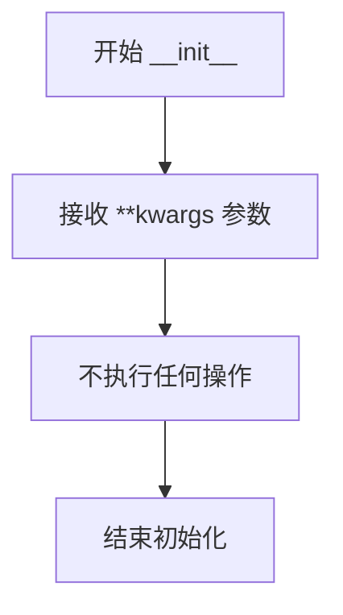
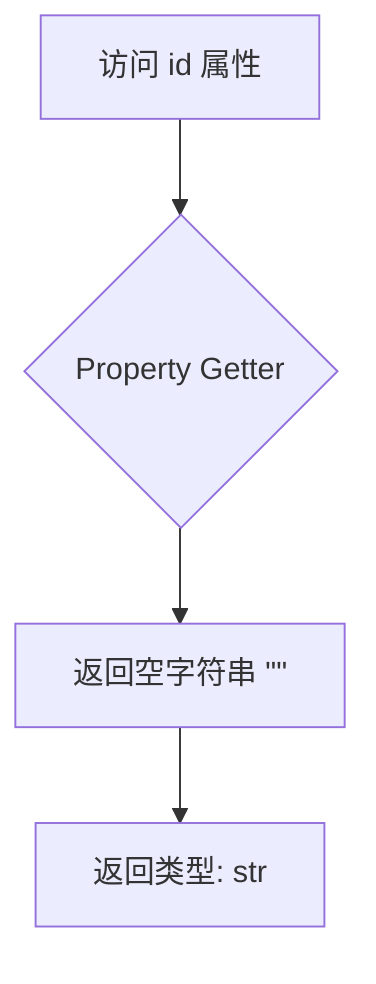
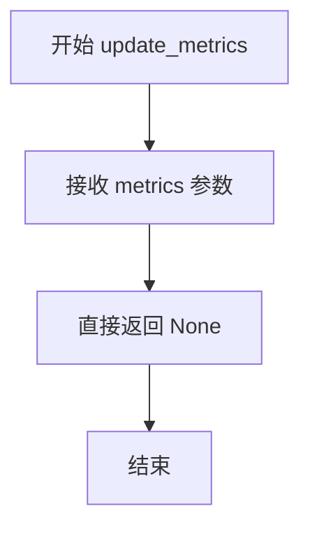
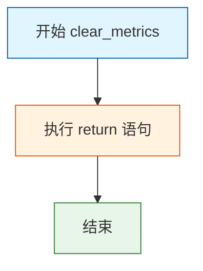

# `graphrag\packages\graphrag-llm\graphrag_llm\metrics\noop_metrics_store.py` 详细设计文档

该文件实现了一个 NoopMetricsStore 类，它继承自 MetricsStore 抽象基类，但所有方法均为空实现（No-op），用于在不需要实际指标存储或处理的场景下作为占位符或默认后端。

## 整体流程

```mermaid
graph TD
    Caller[调用者] -->|初始化| Init[NoopMetricsStore.__init__]
    Init --> Caller
    Caller -->|获取ID| Id[NoopMetricsStore.id (property)]
    Id -->|返回空字符串 ""| Caller
    Caller -->|更新指标| Update[NoopMetricsStore.update_metrics]
    Update -->|无操作 (return)| Caller
    Caller -->|获取指标| Get[NoopMetricsStore.get_metrics]
    Get -->|返回空字典 {}| Caller
    Caller -->|清除指标| Clear[NoopMetricsStore.clear_metrics]
    Clear -->|无操作 (return)| Caller
```

## 类结构

```
MetricsStore (抽象基类)
└── NoopMetricsStore (空操作实现)
```

## 全局变量及字段


    

## 全局函数及方法


### NoopMetricsStore.__init__

初始化 NoopMetricsStore 实例，该类是一个用于指标存储的空操作（Noop）实现，不执行任何实际的存储操作。

参数：

- `**kwargs`：`Any`，接受任意关键字参数，用于未来扩展或保持接口一致性

返回值：`None`，无返回值

#### 流程图



#### 带注释源码

```python
def __init__(
    self,
    **kwargs: Any,  # 接受任意关键字参数，用于保持接口一致性
) -> None:
    """Initialize NoopMetricsStore."""
    # NoopMetricsStore 不需要执行任何初始化操作
    # 所有参数都被忽略（设计为空操作模式）
```


### `NoopMetricsStore.id`

获取指标存储的唯一标识符，该属性返回一个空字符串，表示这是一个无操作（Noop）实现，不存储任何实际数据。

参数：此属性无需参数（通过 `self` 访问实例属性）

返回值：`str`，返回指标存储的唯一标识符（在本实现中始终返回空字符串）

#### 流程图



#### 带注释源码

```python
@property
def id(self) -> str:
    """Get the ID of the metrics store.
    
    该属性用于获取指标存储的唯一标识符。由于 NoopMetricsStore
    是一个无操作的实现，不存储任何实际数据，因此始终返回空字符串。
    
    Returns
    -------
        str
            指标存储的唯一标识符（空字符串）
    """
    return ""
```


### `NoopMetricsStore.update_metrics`

该方法是一个无操作（Noop）实现，用于更新指标存储，但实际上不执行任何操作，只是空实现。

参数：

- `metrics`：`Metrics`，需要更新的指标数据，使用关键字参数传递

返回值：`None`，无返回值

#### 流程图



#### 带注释源码

```python
def update_metrics(self, *, metrics: Metrics) -> None:
    """Noop update.
    
    这是一个无操作（Noop）方法，用于更新指标存储。
    实际上不执行任何逻辑，只是直接返回。
    
    Parameters
    ----------
    metrics : Metrics
        需要更新的指标数据，虽然接收但不使用
    
    Returns
    -------
    None
        无返回值
    """
    return
```


### `NoopMetricsStore.get_metrics`

获取当前存储的所有指标数据（Noop实现，返回空字典）

参数：
- 无

返回值：`Metrics`，返回存储的指标数据（此处为空的Metrics对象）

#### 流程图

```mermaid
flowchart TD
    A[开始 get_metrics] --> B[创建空字典 {}]
    B --> C[返回空字典作为Metrics]
    C --> D[结束]
```

#### 带注释源码

```python
def get_metrics(self) -> Metrics:
    """Noop get all metrics from the store."""
    return {}
```


### `NoopMetricsStore.clear_metrics`

清空NoopMetricsStore中的所有指标数据（无实际操作，仅返回None）。

参数：
- 无

返回值：`None`，无返回值

#### 流程图



#### 带注释源码

```python
def clear_metrics(self) -> None:
    """Clear all metrics from the store.

    Returns
    -------
        None
    """
    return  # 无操作，直接返回None
```

## 关键组件


### NoopMetricsStore 类

NoopMetricsStore 是一个实现了 MetricsStore 接口的空操作（No-op）指标存储类，用于在不实际存储或处理指标的情况下满足接口契约。

### MetricsStore 抽象基类

定义了指标存储的标准接口，包括更新、获取和清除指标的方法，NoopMetricsStore 实现了该接口的所有方法但不做任何实际操作。

### id 属性

返回空字符串，作为该 Noop 存储的唯一标识符。

### update_metrics 方法

空实现的指标更新方法，接收 Metrics 对象但不执行任何操作。

### get_metrics 方法

空实现的指标获取方法，始终返回空字典。

### clear_metrics 方法

空实现的指标清除方法，不执行任何操作。

### Metrics 类型

指标数据的类型定义，用于规范指标的结构。


## 问题及建议


### 已知问题

-   **返回类型不匹配**：`get_metrics()` 方法声明返回 `Metrics` 类型，但实际返回空字典 `{}`，类型声明与实现不一致
-   **未使用的参数**：`__init__` 方法接受 `**kwargs: Any` 参数但完全未使用，造成接口污染
-   **缺失类型检查**：继承自 `MetricsStore` 抽象类，但未验证是否正确实现了所有抽象方法（建议添加 `override` 装饰器或类型检查）
-   **文档与实现不符**：`clear_metrics()` 方法的文档字符串声明了 "Returns" 部分，但实际上该方法没有返回值（虽然返回 `None` 在技术上正确）
-   **空实现缺乏说明**：作为 Noop 实现，缺少文档说明其使用场景和设计目的（如：用于禁用指标存储或作为默认实现）

### 优化建议

-   **修复返回类型**：将 `get_metrics()` 的返回类型改为 `dict` 或添加类型注解 `-> Metrics: ...` 并确保实际返回正确的类型
-   **移除或使用 kwargs**：如果 `**kwargs` 不是必需的，应移除该参数；如果是预留扩展，应添加 `pass` 或日志记录
-   **添加 override 装饰器**：使用 `from typing import override` 装饰器明确标识重写方法，提高代码可读性和类型安全
-   **完善文档**：在类和方法中添加 Noop 模式的使用说明，如"用于测试环境或需要禁用指标收集的场景"
-   **统一返回类型**：考虑将 `get_metrics()` 改为返回 `None` 或抛出特定异常，以明确表示"无指标"状态，而不是返回空字典

## 其它


### 设计目标与约束

**设计目标**：提供一个无操作的指标存储实现，用于不需要实际指标存储或需要禁用指标收集的场景。作为MetricsStore接口的空实现，允许调用者使用统一的接口而不需要关心底层是否真正存储指标。

**约束**：
- 必须实现MetricsStore接口的所有方法
- 所有方法必须是线程安全的（由于是no-op实现，天然线程安全）
- 不能抛出任何异常
- 必须兼容Python 3.10+类型注解

### 错误处理与异常设计

**异常处理策略**：
- 本实现为Noop（无操作）实现，不执行任何实际逻辑，因此不抛出任何异常
- 所有方法均返回空值或空集合：update_metrics返回None，get_metrics返回空字典{}，clear_metrics返回None
- 参数验证由调用方负责，本类不进行额外的参数校验

**异常场景**：
- 不存在任何异常场景，因为所有操作都是no-op

### 数据流与状态机

**数据流**：
- 输入：Metrics对象（通过update_metrics接收）
- 处理：不进行任何处理，直接丢弃
- 输出：空字典或None

**状态机**：
- NoopMetricsStore不维护任何状态
- 始终返回初始空状态

### 外部依赖与接口契约

**依赖关系**：
- 依赖graphrag_llm.metrics.metrics_store.MetricsStore基类
- 依赖graphrag_llm.types.Metrics类型定义
- 依赖typing.Any类型

**接口契约**：
- 必须实现MetricsStore抽象基类的所有方法
- id属性必须返回字符串类型
- update_metrics方法接受keyword-only参数metrics
- get_metrics方法必须返回Metrics类型
- clear_metrics方法必须无返回值

### 使用场景与典型用例

**典型用例**：
1. **测试环境**：在单元测试或集成测试中作为Mock对象
2. **开发调试**：禁用生产环境的指标收集
3. **性能基准测试**：排除指标存储开销的性能测试
4. **接口适配**：需要MetricsStore接口但不需要实际存储的场景

**配置示例**：
```python
store = NoopMetricsStore()  # 无需任何配置
```

### 性能特性与资源考虑

**性能特性**：
- 时间复杂度：O(1)，所有操作都是常量时间
- 空间复杂度：O(1)，不存储任何数据
- 内存占用：极低，仅包含类定义和空方法

**资源考虑**：
- 不占用磁盘空间
- 不产生网络请求
- 不需要外部服务连接

### 线程安全性

**线程安全说明**：
- 本类是线程安全的，因为不共享任何可变状态
- 所有方法都是无副作用的
- 可以被多个线程并发调用而无数据竞争风险

### 配置说明

**配置参数**：
- 本类不接受任何配置参数
- __init__方法的**kwargs仅用于接口兼容性，不影响功能

### 版本兼容性

**Python版本**：支持Python 3.10+

**类型注解**：
- 使用typing.Any处理kwargs
- 使用类型提示确保与静态类型检查工具兼容

### 相关文档链接

- 父类MetricsStore接口定义
- Metrics类型定义文档
- 项目指标系统设计文档

    