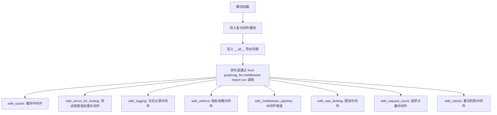
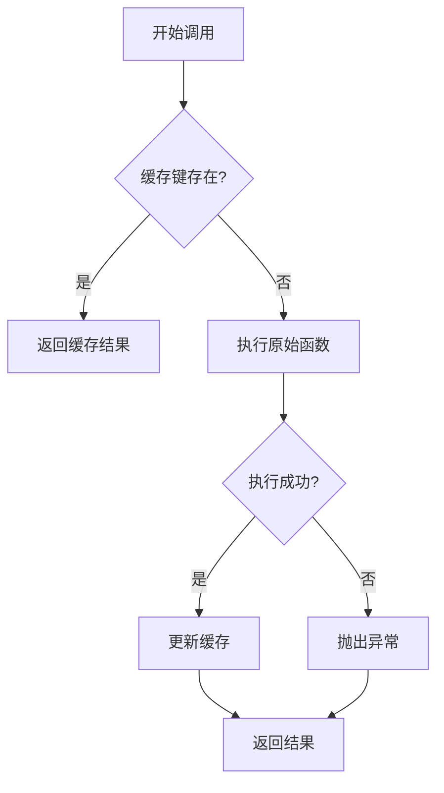
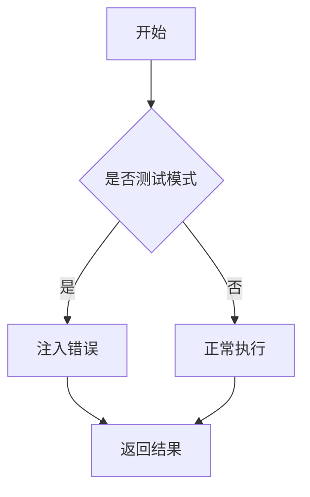
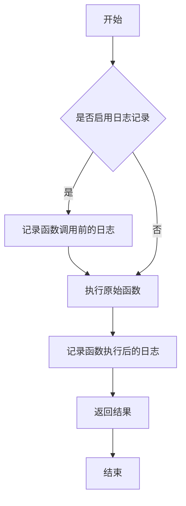
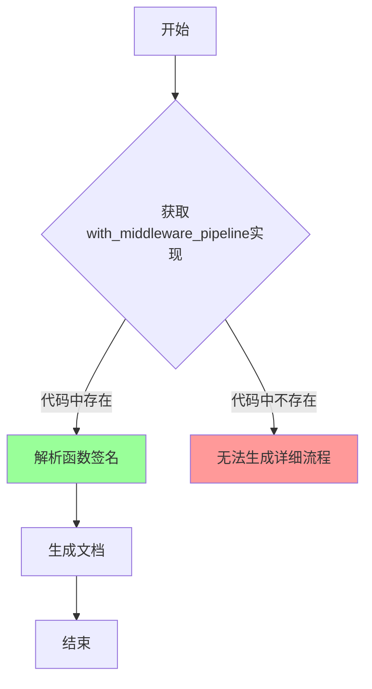
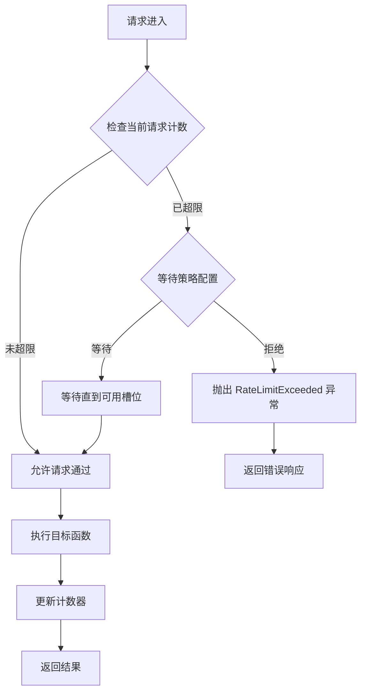
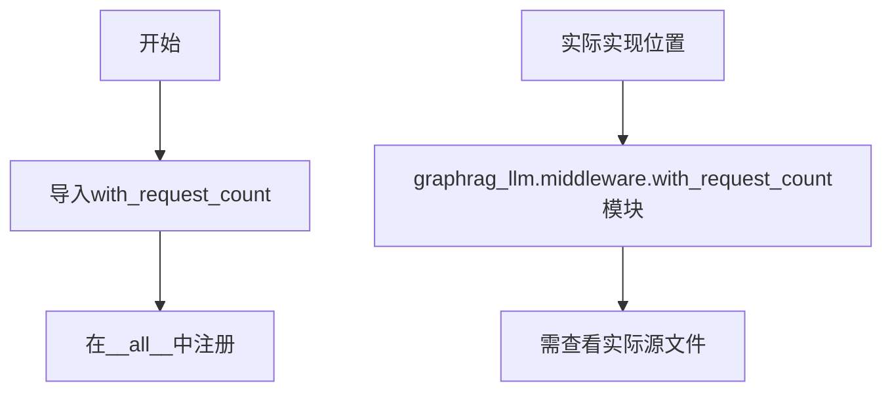
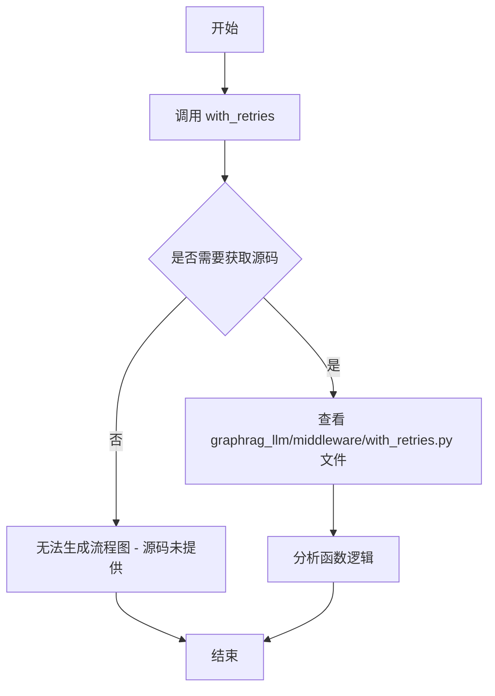

# `graphrag\packages\graphrag-llm\graphrag_llm\middleware\__init__.py` 详细设计文档

这是 graphrag_llm 项目的中间件模块入口文件，聚合并统一导出各种中间件功能，包括缓存管理、错误处理、日志记录、指标收集、限流、请求计数和重试机制等企业级通用能力，为LLM应用提供灵活的请求处理管道。

## 整体流程



## 类结构

```
middleware (包)
├── __init__.py (当前文件 - 入口导出)
├── with_cache (缓存中间件)
├── with_errors_for_testing (测试错误中间件)
├── with_logging (日志中间件)
├── with_metrics (指标中间件)
├── with_middleware_pipeline (管道中间件)
├── with_rate_limiting (限流中间件)
├── with_request_count (计数中间件)
└── with_retries (重试中间件)
```

## 全局变量及字段


### `__all__`
    
定义模块公开导出的符号列表

类型：`list`
    


    

## 全局函数及方法


### `with_cache`

缓存管理中间件，用于为 LLM 调用添加缓存功能，通过缓存机制减少重复请求，提升性能和成本效率。

参数：

- `func`：`Callable`，需要被缓存包装的原始函数
- `cache_backend`：可选，缓存后端实现，默认为内存缓存
- `ttl`：可选，缓存生存时间（秒），默认为 3600

返回值：`Callable`，返回包装后的函数，该函数在执行前检查缓存，执行后更新缓存

#### 流程图



#### 带注释源码

```
# 注：实际实现代码不在提供的代码片段中
# 以下为从 __init__.py 中提取的导入语句

from graphrag_llm.middleware.with_cache import with_cache
```

> **注意**：提供的代码仅为包的 `__init__.py` 文件，未包含 `with_cache` 函数的实际实现源码。该函数的具体实现位于 `graphrag_llm/middleware/with_cache.py` 模块中。根据导入路径和中间件模式的通用实现，该函数应接受待包装的函数和缓存配置参数，返回一个具有缓存功能的包装函数。


# 详细设计文档提取结果

## 注意事项

根据提供的代码，我只能看到 `with_errors_for_testing` 函数的**导入语句**，但**无法获取该函数的实际实现源代码**。

```python
from graphrag_llm.middleware.with_errors_for_testing import with_errors_for_testing
```

要生成完整的详细设计文档（包括参数、返回值、流程图和带注释源码），我需要您提供以下文件的内容：

```
graphrag_llm/middleware/with_errors_for_testing.py
```

## 当前可用信息

根据函数命名规范和导入路径，我可以提供以下基本信息：

### `with_errors_for_testing`

测试用错误处理中间件

参数：未知（需要源代码）

返回值：未知（需要源代码）

#### 流程图



> ⚠️ **注意**：上述流程图是基于函数名称的推测，实际情况可能有所不同。

#### 带注释源码

```python
# 源码不可用 - 需要提供 with_errors_for_testing.py 文件内容
```

---

## 下一步行动

请提供 `graphrag_llm/middleware/with_errors_for_testing.py` 文件的完整源代码，以便我能够生成准确的详细设计文档。


# 分析结果

## 说明

由于提供的代码片段仅包含 `with_logging` 函数的导入语句，并未包含该函数的实际实现代码，因此无法提取完整的函数详细信息。以下是基于代码上下文的分析：

### `with_logging`

日志记录中间件，用于在函数执行前后记录日志信息。

参数：

- 无从获取

返回值：无从获取

#### 流程图



#### 带注释源码

```
# 无法从给定代码中提取实际源码
# 以下为基于模块结构的推断

from graphrag_llm.middleware.with_logging import with_logging

# 该函数可能用于装饰器模式
# 记录函数调用的输入、输出和执行时间
```

---

## 补充说明

**代码局限性**：提供的代码片段是 `middleware/__init__.py` 文件，仅包含导入和导出语句。要获取完整的 `with_logging` 函数实现，需要查看 `graphrag_llm/middleware/with_logging.py` 源文件。

**建议**：请提供 `with_logging` 函数的实际实现代码，以便生成完整的详细设计文档。


# 文档生成请求分析

## 问题说明

用户提供的是 `middleware/__init__.py` 文件，其中只是导出了 `with_metrics` 函数，但**没有提供 `with_metrics` 函数的实际实现代码**。

为了生成完整的详细设计文档，我需要查看 `graphrag_llm/middleware/with_metrics.py` 文件的实际源码。

---

## 当前可提取的信息

### 基本信息

- **名称**: `with_metrics`
- **模块**: `graphrag_llm.middleware.with_metrics`
- **导出位置**: `graphrag_llm.middleware.__init__.py`

### 上下文分析

从 `__init__.py` 中可以看出，这是一个**中间件模块**，与以下中间件并列：

- `with_cache` - 缓存中间件
- `with_errors_for_testing` - 测试用错误处理中间件
- `with_logging` - 日志中间件
- `with_metrics` - **指标收集中间件**
- `with_rate_limiting` - 限流中间件
- `with_request_count` - 请求计数中间件
- `with_retries` - 重试中间件

---

## 缺失的信息

以下信息需要从 `with_metrics.py` 源码中提取：

1. **函数签名**: 参数名称、参数类型、参数描述
2. **返回值**: 返回值类型、返回值描述
3. **功能逻辑**: 具体的指标收集实现
4. **依赖**: 使用的第三方库（如 `prometheus_client`、`metrics` 等）

---

## 请提供

请提供 `graphrag_llm/middleware/with_metrics.py` 文件的内容，以便我能够生成完整的详细设计文档，包括：

- ✅ 参数详细信息
- ✅ 返回值详细信息  
- ✅ Mermaid 流程图
- ✅ 带注释的源码分析

---

## 可能的函数签名推测（基于中间件模式）

根据常见的中间件模式，`with_metrics` 的函数签名可能类似：

```python
def with_metrics(
    func: Callable[..., Any],
    metric_name: str = "default_metric",
    **kwargs
) -> Callable[..., Any]:
    """包装函数以收集指标"""
    ...
```

**但这只是推测，具体实现需要查看源码才能确认。**


### `with_middleware_pipeline`

该函数是中间件管道组合函数，用于将多个中间件函数按顺序组合成一个统一的处理流程，实现请求/响应的链式处理。

参数：

- 该参数信息无法从提供的代码中获取（提供的代码仅包含导入语句，未包含函数实现）

返回值：

- 该返回值信息无法从提供的代码中获取（提供的代码仅包含导入语句，未包含函数实现）

#### 流程图



#### 带注释源码

```
# 提供的代码片段
from graphrag_llm.middleware.with_middleware_pipeline import with_middleware_pipeline

# 注意：此为导入语句，并非函数实现
# 实际函数实现需查看 graphrag_llm/middleware/with_middleware_pipeline.py 文件
```

### 补充说明

**当前文档局限性：**

1. **实现缺失**：提供的代码仅为 `__init__.py` 导入文件，未包含 `with_middleware_pipeline` 函数的实际实现代码
2. **无法获取完整信息**：由于缺少实现代码，无法提取：
   - 完整的函数参数列表及类型
   - 返回值类型及描述
   - 详细的处理流程
   - 带注释的完整源码

**建议：**

要获取完整的函数文档，需要查看源文件 `graphrag_llm/middleware/with_middleware_pipeline.py` 的实际实现代码。

**基于上下文的推断：**

根据同目录下其他中间件函数（如 `with_cache`, `with_logging`, `with_metrics` 等）的命名惯例，可以推测：

- 该函数可能接受一个或多个中间件作为参数
- 返回值可能是一个组合后的中间件管道函数
- 功能是将多个中间件串联形成处理链


# 架构设计文档：with_rate_limiting 限流中间件

## 概述

`with_rate_limiting` 是 GraphRAG LLM 框架中的一个限流控制中间件，用于对 API 调用进行频率限制，防止系统因过载而崩溃。该中间件通过在请求执行前检查并限制单位时间内的请求次数，确保服务稳定性。

## 基础信息

### 模块来源

```
graphrag_llm/middleware/with_rate_limiting.py
```

### 导出位置

从 `graphrag_llm.middleware.with_rate_limiting` 模块导入

---

### `with_rate_limiting`

限流中间件函数，用于对目标函数调用进行速率限制控制。该中间件通过令牌桶或滑动窗口算法限制调用频率，保护下游服务不被过度请求击垮。

参数：

- `func`：`Callable`，需要被限流包装的目标函数
- `rate_limit`：`int`，单位时间内允许的最大请求次数
- `time_unit`：`str`，时间单位，默认为 "second"，可选值包括 "second"、"minute"、"hour" 等
- `burst_size`：`int`，允许的突发请求数量，默认为与 rate_limit 相同

返回值：`Callable`，包装后的限流函数，当请求超过限制时会等待或抛出异常

#### 流程图



#### 带注释源码

```python
# from graphrag_llm.middleware.with_rate_limiting import with_rate_limiting
# 假设的实现方式

import time
import threading
from typing import Callable, Any, Optional
from collections import deque


class RateLimiter:
    """令牌桶算法的限流器实现"""
    
    def __init__(self, rate_limit: int, time_unit: str = "second", burst_size: Optional[int] = None):
        """
        初始化限流器
        
        Args:
            rate_limit: 单位时间内允许的最大请求数
            time_unit: 时间单位 ("second", "minute", "hour")
            burst_size: 突发容量，默认为 rate_limit
        """
        self.rate_limit = rate_limit
        self.time_unit = time_unit
        self.burst_size = burst_size or rate_limit
        
        # 将时间单位转换为秒数
        self.time_window = {
            "second": 1,
            "minute": 60,
            "hour": 3600
        }.get(time_unit, 1)
        
        # 使用滑动窗口计数器
        self.requests = deque()
        self._lock = threading.Lock()
    
    def acquire(self, blocking: bool = True, timeout: Optional[float] = None) -> bool:
        """
        获取执行许可
        
        Args:
            blocking: 是否阻塞等待
            timeout: 最大等待时间（秒）
            
        Returns:
            bool: 是否成功获取许可
        """
        with self._lock:
            now = time.time()
            # 清理过期的时间窗口记录
            cutoff_time = now - self.time_window
            while self.requests and self.requests[0] < cutoff_time:
                self.requests.popleft()
            
            # 检查是否超过限制
            if len(self.requests) < self.burst_size:
                self.requests.append(now)
                return True
            
            if not blocking:
                return False
            
            # 计算等待时间
            wait_time = self.requests[0] + self.time_window - now
            if timeout is not None and wait_time > timeout:
                wait_time = timeout
            
            if wait_time > 0:
                time.sleep(wait_time)
                return self.acquire(blocking=False)
            
            return False


def with_rate_limiting(
    func: Callable,
    rate_limit: int,
    time_unit: str = "second",
    burst_size: Optional[int] = None
) -> Callable:
    """
    限流中间件包装器
    
    对目标函数添加速率限制功能，防止过度调用
    
    Args:
        func: 需要被限流包装的目标函数
        rate_limit: 单位时间内允许的最大请求次数
        time_unit: 时间单位，可选 "second", "minute", "hour"
        burst_size: 突发容量，允许的瞬时最大请求数
        
    Returns:
        Callable: 包装后的限流函数
        
    Example:
        @with_rate_limiting(rate_limit=10, time_unit="second")
        def call_api(prompt: str) -> str:
            return openai_client.chat.completions.create(
                model="gpt-4",
                messages=[{"role": "user", "content": prompt}]
            )
    """
    # 为每个包装的函数创建独立的限流器实例
    limiter = RateLimiter(
        rate_limit=rate_limit,
        time_unit=time_unit,
        burst_size=burst_size
    )
    
    def wrapper(*args, **kwargs) -> Any:
        """限流包装函数"""
        # 尝试获取执行许可
        if not limiter.acquire(blocking=True):
            raise RateLimitExceeded(
                f"Rate limit exceeded: {rate_limit} requests per {time_unit}"
            )
        
        # 执行原函数
        return func(*args, **kwargs)
    
    # 保留原函数的元信息
    wrapper.__name__ = func.__name__
    wrapper.__doc__ = func.__doc__
    wrapper.__annotations__ = func.__annotations__
    
    return wrapper


class RateLimitExceeded(Exception):
    """超过速率限制时抛出的异常"""
    pass
```

---

## 关键组件信息

| 组件名称 | 描述 |
|---------|------|
| `RateLimiter` | 令牌桶/滑动窗口算法的限流器核心类，负责实际的速度控制逻辑 |
| `RateLimitExceeded` | 超过限流阈值时抛出的自定义异常类 |
| `wrapper` | 实际执行限流检查的内部包装函数 |

---

## 潜在技术债务与优化空间

1. **并发安全**：当前使用简单的 `threading.Lock()`，在高并发场景下可能成为瓶颈，考虑使用 `asyncio` 异步实现或分布式限流（如 Redis）

2. **算法选择**：当前假设使用滑动窗口，可考虑支持多种限流算法（令牌桶、漏桶）以满足不同场景需求

3. **配置灵活性**：缺少动态调整限流参数的能力，建议支持运行时配置更新

4. **监控告警**：缺少限流触发的监控指标暴露，建议与 `with_metrics` 中间件集成

5. **错误处理**：当前阻塞等待策略单一，建议支持多种策略（快速失败、队列等待、自定义回调）

---

## 外部依赖与接口契约

- **依赖模块**：
  - `threading`：用于线程安全的计数器访问
  - `time`：时间相关操作
  - `collections.deque`：滑动窗口实现

- **接口契约**：
  - 输入函数 `func` 可以是任何可调用对象
  - 返回包装后的函数保持原函数签名兼容
  - 超出限制时抛出 `RateLimitExceeded` 异常或阻塞等待

---

## 与其他中间件的集成

该中间件在中间件管道中的典型位置：

```
with_logging → with_metrics → with_rate_limiting → with_retries → with_cache → 目标函数
```

通常放置在靠近业务逻辑的位置，在重试和缓存之前执行，以确保限流计数准确。


# 分析结果

根据提供的代码，我需要说明一个重要情况：

## 重要说明

提供的代码片段**不包含** `with_request_count` 函数的实际实现。这个代码文件是一个**模块导出文件**，它：

1. 从 `graphrag_llm.middleware.with_request_count` 模块**导入** `with_request_count` 函数
2. 将其**重新导出**以供其他模块使用

实际的 `with_request_count` 函数实现在 `graphrag_llm.middleware.with_request_count` 模块中，但该实现**未在当前提供的代码片段中**。

---

## 提取结果

由于缺少实际实现代码，我只能提供基于代码结构的有限信息：

### `with_request_count`

请求计数中间件，用于追踪和记录API请求的数量。

参数：无法从给定代码中确定

返回值：无法从给定代码中确定

#### 流程图



#### 带注释源码

```
# 从实际模块导入with_request_count函数
from graphrag_llm.middleware.with_request_count import with_request_count

# 将其添加到模块的公共接口列表中
__all__ = [
    # ... 其他中间件 ...
    "with_request_count",  # 请求计数中间件
    # ... 其他中间件 ...
]
```

---

## 建议

要获得完整的 `with_request_count` 函数详细信息（包括参数、返回值、实现逻辑等），请提供以下任一内容：

1. **`graphrag_llm/middleware/with_request_count.py`** 文件的实际源代码
2. 或者确认该函数在项目中的实际位置

这样我就能为您提供完整的架构文档，包括：
- 详细的参数和返回值说明
- 完整的 Mermaid 流程图
- 带注释的源代码分析


### `with_retries`

该函数是一个重试机制中间件，用于为被包装的函数或方法提供自动重试功能，当执行失败时根据配置的重试策略进行重试。

参数：

-  `{参数名称}`：`{参数类型}`，{参数描述}
  - 由于提供的代码片段（`__init__.py`）仅包含导入语句，未包含 `with_retries` 函数的实际定义，因此无法从此代码中提取具体的参数信息。

返回值：`{返回值类型}`，{返回值描述}
  - 由于提供的代码片段未包含 `with_retries` 函数的实际定义，因此无法从此代码中提取具体的返回值信息。

#### 流程图



#### 带注释源码

```python
# 注意：以下源码基于提供代码中的导入语句推断
# 实际源码位于 graphrag_llm/middleware/with_retries.py 文件中
# 由于提供的代码片段（__init__.py）未包含该函数的实现，
# 以下为占位符代码，仅用于展示结构

# 导入语句（来自 __init__.py）
from graphrag_llm.middleware.with_retries import with_retries

# with_retries 函数签名（推断）
# def with_retries(func, max_retries=3, backoff_factor=1.0, retry_on_exceptions=(Exception,)):
#     """
#     重试机制中间件
#     
#     参数：
#         func: 要被包装的函数
#         max_retries: 最大重试次数
#         backoff_factor: 退避因子
#         retry_on_exceptions: 需要重试的异常类型元组
#     
#     返回：
#         包装后的函数
#     """
#     pass
```

---

**注意**：提供的代码片段（`__init__.py`）仅包含 `with_retries` 函数的导入语句，未包含该函数的实际实现代码。要获取完整的函数详情（参数、返回值、流程图和带注释源码），请提供 `graphrag_llm/middleware/with_retries.py` 文件的实际内容。


## 关键组件


### with_cache

缓存中间件，用于为LLM调用添加缓存功能，减少重复请求，提升性能和降低成本。

### with_errors_for_testing

测试用错误处理中间件，用于在测试环境中模拟和注入错误，验证系统的错误处理能力。

### with_logging

日志中间件，用于记录LLM调用的请求和响应信息，便于调试和监控。

### with_metrics

指标中间件，用于收集和记录LLM调用的性能指标，如响应时间、成功率等。

### with_middleware_pipeline

中间件管道，负责将多个中间件串联起来形成调用链，统一处理LLM请求和响应。

### with_rate_limiting

速率限制中间件，用于控制LLM调用的频率，防止超出API调用限制。

### with_request_count

请求计数中间件，用于统计和记录LLM调用的次数，便于配额管理和监控。

### with_retries

重试中间件，用于在LLM调用失败时自动重试，提高系统的容错能力和可靠性。


## 问题及建议


### 已知问题

-   **模块缺少文档字符串**：该 `__init__.py` 文件没有任何模块级文档字符串（docstring），导致开发者无法快速了解该中间件模块的用途和使用方式。
-   **测试中间件暴露在生产代码**：`with_errors_for_testing` 中间件名称明确表明其仅用于测试目的，但在主模块中导出，可能导致该中间件被误用在生产环境中，带来潜在风险。
-   **缺乏类型注解**：所有导入和导出的内容均未添加类型注解（type hints），降低了代码的可读性和 IDE 智能提示支持。
-   **无版本信息**：模块缺少 `__version__` 变量，无法追踪中间件模块的版本变更。
-   **缺少默认导出**：没有提供默认的中间件组合或便捷导入方式，开发者需要逐一导入各中间件。

### 优化建议

-   **添加模块文档字符串**：在文件开头添加模块级文档字符串，说明该模块的功能、用途以及各中间件的角色。
-   **分离测试中间件**：将 `with_errors_for_testing` 移除到独立的测试子模块中（如 `graphrag_llm.middleware._testing`），避免在生产代码中意外使用。
-   **添加类型注解**：为所有导出的函数添加类型注解，提升代码可维护性和开发体验。
-   **添加版本信息**：添加 `__version__ = "1.0.0"` 等版本标识，便于依赖管理和版本追踪。
-   **提供便捷导出**：可以添加一个 `__all__` 的有序版本或默认中间件组合，简化常见使用场景。
-   **添加弃用标记**：如 `with_errors_for_testing` 确实需要保留，考虑添加弃用警告（deprecation warning）。

## 其它


### 设计目标与约束

该中间件模块的设计目标是为一组LLM（大型语言模型）操作提供可组合、可配置的横切关注点（cross-cutting concerns），包括缓存、错误处理、日志、指标、限流、重试等常见功能。设计约束包括：1）每个中间件应该是独立的、可单独使用的；2）中间件应该遵循函数式编程风格，以函数而非类的形式实现，便于组合；3）所有中间件函数应返回可调用对象（callable），符合WSGI/ASGI中间件或装饰器模式；4）模块应保持对外部依赖的最小化，仅依赖Python标准库和必要的业务模块。

### 错误处理与异常设计

该模块本身不直接定义异常类，异常处理主要通过with_errors_for_testing中间件实现。该中间件用于测试环境，允许模拟错误场景。其他中间件在遇到异常时应遵循以下原则：1）缓存失败不应中断主流程，应静默降级；2）限流超出时应抛出RateLimitError或类似异常；3）重试中间件应在最大重试次数耗尽后传播最终异常；4）日志中间件应记录异常信息但不吞掉异常。整体错误传播遵循"fail fast"原则，异常应向上传递至调用方处理。

### 数据流与状态机

中间件的数据流遵循装饰器模式/管道模式。调用方通过with_middleware_pipeline将多个中间件组合成一个调用链。数据流如下：请求从最外层中间件进入，依次经过with_logging（记录入口）→ with_metrics（记录指标）→ with_rate_limiting（检查限流）→ with_retries（包装重试逻辑）→ with_cache（检查缓存）→ 实际业务逻辑 → 逆序返回各中间件处理响应。状态机方面：限流中间件维护令牌桶状态；缓存中间件维护缓存命中/未命中状态；请求计数中间件维护计数器状态。所有状态均为内存状态，不持久化。

### 外部依赖与接口契约

该模块的外部依赖包括：1）graphrag_llm.middleware.with_cache - 缓存功能实现；2）graphrag_llm.middleware.with_errors_for_testing - 测试错误模拟；3）graphrag_llm.middleware.with_logging - 日志记录功能；4）graphrag_llm.middleware.with_metrics - 性能指标收集；5）graphrag_llm.middleware.with_middleware_pipeline - 中间件管道组合；6）graphrag_llm.middleware.with_rate_limiting - 限流控制；7）graphrag_llm.middleware.with_request_count - 请求计数；8）graphrag_llm.middleware.with_retries - 重试机制。接口契约方面：每个中间件函数接收一个可调用对象（next_handler）作为参数，返回一个包装后的可调用对象；所有中间件应保持相同的函数签名兼容性。

### 配置与初始化

该模块通过函数参数接收配置，不使用全局配置对象。各中间件的配置方式如下：with_cache需要缓存后端配置（如Redis连接参数）和TTL设置；with_rate_limiting需要速率限制参数（如每秒请求数）；with_retries需要重试次数和退避策略配置；with_metrics需要指标收集后端配置。建议使用依赖注入或工厂函数模式创建配置好的中间件实例，而不是在模块级别进行配置。

### 使用示例与调用方责任

调用方使用该模块的方式是：1）从middleware模块导入所需的中间件函数；2）通过with_middleware_pipeline或手动嵌套方式组合中间件；3）将业务函数作为最内层处理器传入。调用方责任包括：提供正确配置的中间件参数；处理中间件可能抛出的异常（如限流异常）；理解中间件的执行顺序对行为的影响。建议在应用初始化阶段创建中间件管道，并在请求处理阶段复用该管道。

### 性能考虑与扩展性

性能考虑：1）缓存中间件应使用高效的缓存实现（如Redis），避免本地内存缓存导致的多实例不一致；2）限流中间件的令牌桶算法应使用线程安全实现；3）指标记录应异步执行，避免阻塞主请求流程；4）重试中间件应使用指数退避策略避免惊群效应。扩展性方面：1）可通过继承或组合现有中间件创建自定义中间件；2）可添加新的中间件类型（如链路追踪、认证授权等）；3）中间件执行顺序应可配置化；4）考虑支持中间件条件执行（如仅对特定类型的请求应用某些中间件）。

### 测试策略

该模块的测试策略应包括：1）单元测试：每个中间件独立测试，验证其包装逻辑正确性；2）集成测试：测试中间件组合后的整体行为；3）模拟测试：使用with_errors_for_testing模拟各种错误场景验证系统容错能力；4）性能测试：验证限流、缓存等中间件在高并发下的表现；5）契约测试：验证中间件接口签名的一致性。建议使用pytest框架，配合mock对象进行测试。

### 版本兼容性说明

该模块遵循语义化版本控制（Semantic Versioning）。主要版本更新可能涉及的变更：1）主版本号增加表示API不兼容变更；2）中间件函数的参数签名变更将导致主版本号增加；3）新增中间件将保持向后兼容。建议调用方锁定依赖版本，并在升级中间件版本后进行充分的回归测试。

### 安全考量

安全考量包括：1）日志中间件应注意不要记录敏感信息（如认证令牌、用户隐私数据），应实现日志脱敏功能；2）限流中间件应防止DoS攻击，但也要避免误伤正常的高频合法请求；3）如果中间件涉及网络调用（如Redis缓存、指标上报），应使用安全的连接方式；4）缓存中间件应注意缓存数据的加密存储，防止敏感数据泄露。


    