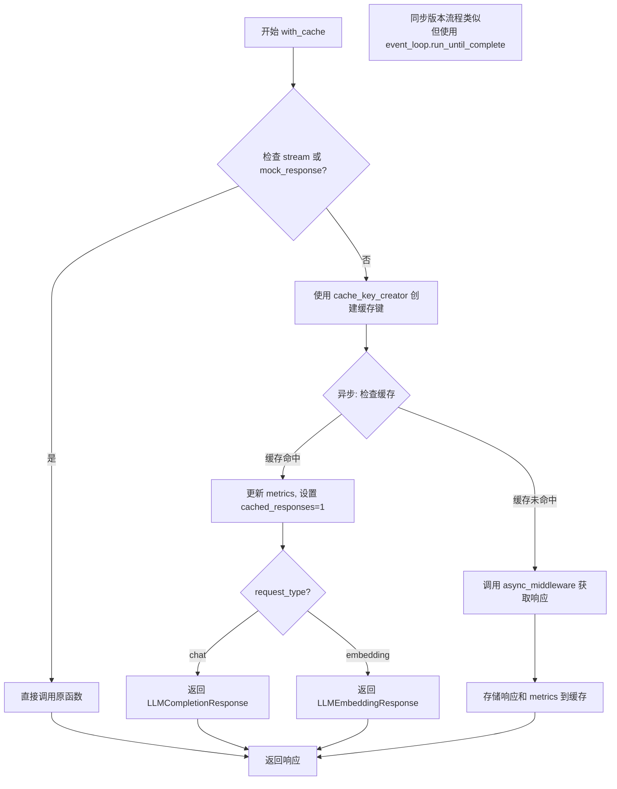
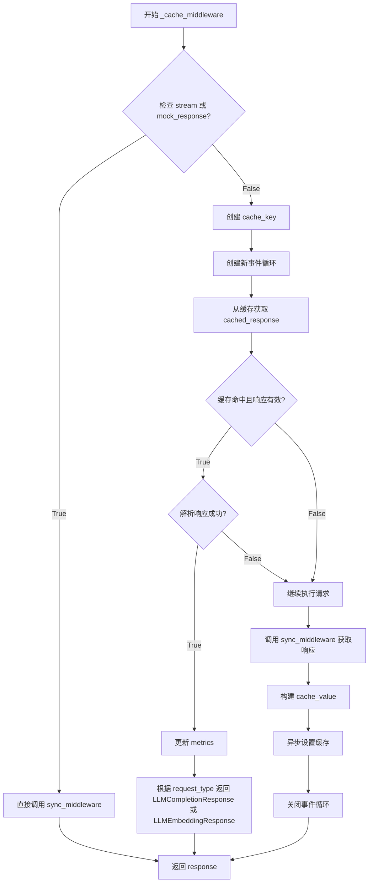
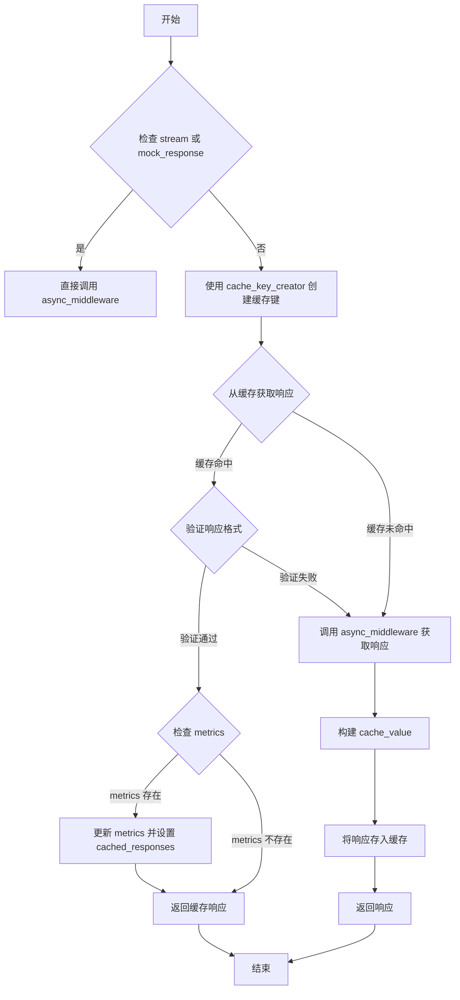

# `graphrag\packages\graphrag-llm\graphrag_llm\middleware\with_cache.py` 详细设计文档

这是一个缓存中间件实现，用于为LLM（语言模型）函数添加缓存功能。它通过包装同步和异步的LLM函数，根据请求参数生成缓存键，对非流式和非模拟的响应进行缓存，并支持chat和embedding两种请求类型的缓存管理。

## 整体流程

```mermaid
graph TD
    A[开始 with_cache] --> B[创建同步缓存中间件 _cache_middleware]
    B --> C[创建异步缓存中间件 _cache_middleware_async]
    C --> D[返回元组 (_cache_middleware, _cache_middleware_async)]
    E[_cache_middleware 调用] --> F{is_streaming 或 is_mocked?}
    F -- 是 --> G[直接调用 sync_middleware]
    F -- 否 --> H[使用 cache_key_creator 生成缓存键]
    H --> I[从缓存获取响应]
    I --> J{缓存命中且响应有效?}
    J -- 是 --> K[更新 metrics 并返回缓存响应]
    J -- 否 --> L[调用 sync_middleware 获取新响应]
    L --> M[将响应存入缓存]
    M --> N[返回响应]
    G --> N
    K --> N
    O[_cache_middleware_async 调用] --> P{is_streaming 或 is_mocked?}
    P -- 是 --> Q[直接调用 async_middleware]
    P -- 否 --> R[使用 cache_key_creator 生成缓存键]
    R --> S[异步从缓存获取响应]
S --> T{缓存命中且响应有效?}
    T -- 是 --> U[更新 metrics 并返回缓存响应]
    T -- 否 --> V[异步调用 async_middleware 获取新响应]
    V --> W[异步将响应存入缓存]
    W --> X[返回响应]
    Q --> X
    U --> X
```

## 类结构

```
with_cache (函数模块)
├── _cache_middleware (内部同步函数)
└── _cache_middleware_async (内部异步函数)
```

## 全局变量及字段


### `sync_middleware`
    
The synchronous model function to wrap (completion or embedding)

类型：`LLMFunction`
    


### `async_middleware`
    
The asynchronous model function to wrap (completion or embedding)

类型：`AsyncLLMFunction`
    


### `request_type`
    
The type of request, either "chat" or "embedding"

类型：`Literal["chat", "embedding"]`
    


### `cache`
    
The cache instance to use for storing and retrieving responses

类型：`Cache`
    


### `cache_key_creator`
    
The function to create cache keys from request parameters

类型：`CacheKeyCreator`
    


### `is_streaming`
    
Flag indicating whether the request is for streaming response

类型：`bool`
    


### `is_mocked`
    
Flag indicating whether the response is mocked

类型：`bool`
    


### `metrics`
    
Optional metrics dictionary for tracking cache hits and performance

类型：`Metrics | None`
    


### `cache_key`
    
The generated cache key for the current request

类型：`str`
    


### `event_loop`
    
New event loop created for synchronous cache operations

类型：`asyncio.EventLoop`
    


### `cached_response`
    
The cached response retrieved from cache, if exists

类型：`dict | None`
    


### `response`
    
The LLM response from the model (either from cache or fresh request)

类型：`LLMCompletionResponse | LLMEmbeddingResponse`
    


### `cache_value`
    
The value to store in cache containing response and metrics

类型：`dict`
    


    

## 全局函数及方法


### `with_cache`

这是一个缓存中间件包装函数，用于为 LLM（大型语言模型）函数（同步和异步版本）添加缓存功能。该函数通过拦截请求、检查缓存、并在缓存命中时返回缓存的响应来减少重复的 API 调用，从而提高性能并降低成本。

参数：

- `sync_middleware`：`LLMFunction`，同步模型函数，用于处理同步的 LLM 请求
- `async_middleware`：`AsyncLLMFunction`，异步模型函数，用于处理异步的 LLM 请求
- `request_type`：`Literal["chat", "embedding"]`，请求类型，区分聊天或嵌入请求
- `cache`：`Cache`，缓存实例，用于存储和检索响应
- `cache_key_creator`：`CacheKeyCreator`，缓存键创建器，用于根据请求参数生成唯一缓存键

返回值：`tuple[LLMFunction, AsyncLLMFunction]`，返回包装了缓存功能的同步和异步模型函数元组

#### 流程图



#### 带注释源码

```python
def with_cache(
    *,
    sync_middleware: "LLMFunction",          # 同步 LLM 函数
    async_middleware: "AsyncLLMFunction",    # 异步 LLM 函数
    request_type: Literal["chat", "embedding"],  # 请求类型标识
    cache: "Cache",                          # 缓存实例
    cache_key_creator: "CacheKeyCreator",    # 缓存键生成器
) -> tuple["LLMFunction", "AsyncLLMFunction"]:
    """Wrap model functions with cache middleware.
    
    包装模型函数以添加缓存中间件功能
    
    Args:
        sync_middleware: 同步模型函数（完成或嵌入函数）
        async_middleware: 异步模型函数（完成或嵌入函数）
        cache: 使用的缓存实例
        request_type: 请求类型，"chat" 或 "embedding"
        cache_key_creator: 使用的缓存键创建器
    
    Returns:
        包含缓存功能的同步和异步模型函数元组
    """

    def _cache_middleware(**kwargs: Any):
        """同步缓存中间件实现"""
        # 检查是否为流式响应或模拟响应，这些不进行缓存
        is_streaming = kwargs.get("stream") or False
        is_mocked = kwargs.get("mock_response") or False
        metrics: Metrics | None = kwargs.get("metrics")

        # 流式或模拟响应直接调用原函数，不缓存
        if is_streaming or is_mocked:
            return sync_middleware(**kwargs)

        # 使用缓存键创建器生成缓存键
        cache_key = cache_key_creator(kwargs)

        # 创建新的事件循环来执行异步缓存操作
        event_loop = asyncio.new_event_loop()
        asyncio.set_event_loop(event_loop)
        
        # 尝试从缓存获取响应
        cached_response = event_loop.run_until_complete(cache.get(cache_key))
        
        # 检查缓存响应是否有效
        if (
            cached_response is not None
            and isinstance(cached_response, dict)
            and "response" in cached_response
            and cached_response["response"] is not None
            and isinstance(cached_response["response"], dict)
        ):
            try:
                # 如果有 metrics，更新并标记缓存命中
                if (
                    metrics is not None
                    and "metrics" in cached_response
                    and cached_response["metrics"] is not None
                    and isinstance(cached_response["metrics"], dict)
                ):
                    metrics.update(cached_response["metrics"])
                    metrics["cached_responses"] = 1

                # 根据请求类型返回对应的响应对象
                if request_type == "chat":
                    return LLMCompletionResponse(**cached_response["response"])
                return LLMEmbeddingResponse(**cached_response["response"])
            except Exception:
                # 如果缓存解析失败，继续调用原函数
                ...

        # 缓存未命中，调用原函数获取响应
        response = sync_middleware(**kwargs)
        
        # 构建缓存值，包含响应和指标
        cache_value = {
            "response": response.model_dump(),
            "metrics": metrics if metrics is not None else {},
        }
        
        # 存储到缓存
        event_loop.run_until_complete(cache.set(cache_key, cache_value))
        event_loop.close()
        
        return response

    async def _cache_middleware_async(**kwargs: Any):
        """异步缓存中间件实现"""
        is_streaming = kwargs.get("stream") or False
        is_mocked = kwargs.get("mock_response") or False
        metrics: Metrics | None = kwargs.get("metrics")

        # 流式或模拟响应不缓存
        if is_streaming or is_mocked:
            return await async_middleware(**kwargs)

        cache_key = cache_key_creator(kwargs)

        # 异步获取缓存响应
        cached_response = await cache.get(cache_key)
        
        # 验证缓存响应格式
        if (
            cached_response is not None
            and isinstance(cached_response, dict)
            and "response" in cached_response
            and cached_response["response"] is not None
            and isinstance(cached_response["response"], dict)
        ):
            try:
                # 更新缓存指标
                if (
                    metrics is not None
                    and "metrics" in cached_response
                    and cached_response["metrics"] is not None
                    and isinstance(cached_response["metrics"], dict)
                ):
                    metrics.update(cached_response["metrics"])
                    metrics["cached_responses"] = 1

                # 返回对应类型的响应对象
                if request_type == "chat":
                    return LLMCompletionResponse(**cached_response["response"])
                return LLMEmbeddingResponse(**cached_response["response"])
            except Exception:
                # 缓存解析失败时继续调用原函数
                ...

        # 缓存未命中，异步调用原函数
        response = await async_middleware(**kwargs)
        
        # 存储响应到缓存
        cache_value = {
            "response": response.model_dump(),
            "metrics": metrics if metrics is not None else {},
        }
        await cache.set(cache_key, cache_value)
        
        return response

    # 返回同步和异步包装函数元组
    return (_cache_middleware, _cache_middleware_async)
```


### `_cache_middleware`

`_cache_middleware` 是一个同步缓存中间件函数，用于为 LLM 调用提供缓存功能。它通过检查缓存键来避免重复的模型调用，对于流式请求或模拟响应则直接透传，并在缓存命中时返回缓存的响应，否则执行实际调用并缓存结果。

参数：

-  `**kwargs`：`Any`，包含调用参数（如 `stream`、`mock_response`、`metrics` 等）

返回值：`LLMCompletionResponse | LLMEmbeddingResponse`，根据 `request_type` 返回对应的响应类型

#### 流程图



#### 带注释源码

```python
def _cache_middleware(
    **kwargs: Any,
):
    """同步缓存中间件函数，用于包装 LLM 函数以支持缓存。
    
    关键逻辑：
    1. 流式请求和模拟响应不缓存
    2. 使用 cache_key_creator 生成缓存键
    3. 缓存命中时直接返回缓存的响应
    4. 缓存未命中时执行实际调用并缓存结果
    """
    
    # 从 kwargs 中提取关键参数
    is_streaming = kwargs.get("stream") or False  # 检查是否为流式请求
    is_mocked = kwargs.get("mock_response") or False  # 检查是否为模拟响应
    metrics: Metrics | None = kwargs.get("metrics")  # 获取指标对象

    # 流式请求或模拟响应不缓存，直接调用原始函数
    if is_streaming or is_mocked:
        return sync_middleware(**kwargs)

    # 使用 cache_key_creator 根据请求参数生成缓存键
    cache_key = cache_key_creator(kwargs)

    # 创建新的事件循环用于异步缓存操作
    # 注意：这里存在潜在的性能问题，每次调用都创建新事件循环
    event_loop = asyncio.new_event_loop()
    asyncio.set_event_loop(event_loop)
    
    # 尝试从缓存获取响应
    cached_response = event_loop.run_until_complete(cache.get(cache_key))
    
    # 检查缓存是否命中且响应有效
    if (
        cached_response is not None
        and isinstance(cached_response, dict)
        and "response" in cached_response
        and cached_response["response"] is not None
        and isinstance(cached_response["response"], dict)
    ):
        try:
            # 如果存在 metrics，更新缓存指标
            if (
                metrics is not None
                and "metrics" in cached_response
                and cached_response["metrics"] is not None
                and isinstance(cached_response["metrics"], dict)
            ):
                metrics.update(cached_response["metrics"])
                metrics["cached_responses"] = 1

            # 根据请求类型返回对应的响应对象
            if request_type == "chat":
                return LLMCompletionResponse(**cached_response["response"])
            return LLMEmbeddingResponse(**cached_response["response"])
        except Exception:  # noqa: BLE001
            # 如果解析缓存响应失败，继续执行实际请求
            # 这种设计确保了缓存故障不会导致整个请求失败
            ...

    # 缓存未命中，执行实际的 LLM 调用
    response = sync_middleware(**kwargs)
    
    # 构建缓存值，包含响应和指标
    cache_value = {
        "response": response.model_dump(),  # type: ignore
        "metrics": metrics if metrics is not None else {},
    }
    
    # 异步设置缓存
    event_loop.run_until_complete(cache.set(cache_key, cache_value))
    
    # 关闭事件循环释放资源
    event_loop.close()
    
    # 返回实际响应
    return response
```


### `_cache_middleware_async`

该函数是异步缓存中间件，用于为 LLM（大型语言模型）函数添加缓存功能。它通过拦截异步调用，检查缓存中是否存在对应的响应，如果存在则直接返回缓存结果，否则调用实际的异步 LLM 函数并将结果存入缓存。

参数：

- `**kwargs`：`Any`，任意关键字参数，包含调用 LLM 函数所需的所有参数（如 messages、model 等），以及 stream、mock_response、metrics 等特殊参数

返回值：`AsyncLLMFunction`，返回缓存包装后的异步 LLM 函数

#### 流程图



#### 带注释源码

```python
async def _cache_middleware_async(
    **kwargs: Any,  # 接收任意关键字参数
):
    """异步缓存中间件函数，为 LLM 调用添加缓存支持。

    Args:
        **kwargs: 包含 LLM 调用参数的特殊字典，可能包含:
            - stream: bool, 是否为流式响应
            - mock_response: bool, 是否为模拟响应
            - metrics: Metrics, 可选的指标对象

    Returns:
        AsyncLLMFunction: 包装后的异步 LLM 函数
    """
    # 从 kwargs 中提取 stream 和 mock_response 参数
    # 如果是流式或模拟响应，则不进行缓存
    is_streaming = kwargs.get("stream") or False
    is_mocked = kwargs.get("mock_response") or False
    metrics: Metrics | None = kwargs.get("metrics")

    # 流式响应和模拟响应不进行缓存，直接调用原始异步函数
    if is_streaming or is_mocked:
        # don't cache streaming or mocked responses
        return await async_middleware(**kwargs)

    # 使用 cache_key_creator 根据 kwargs 创建缓存键
    cache_key = cache_key_creator(kwargs)

    # 尝试从缓存中获取响应
    cached_response = await cache.get(cache_key)
    
    # 检查缓存响应是否有效
    # 需要满足以下条件：
    # 1. cached_response 不为 None
    # 2. 是字典类型
    # 3. 包含 "response" 键
    # 4. response 不为 None
    # 5. response 是字典类型
    if (
        cached_response is not None
        and isinstance(cached_response, dict)
        and "response" in cached_response
        and cached_response["response"] is not None
        and isinstance(cached_response["response"], dict)
    ):
        try:
            # 如果存在 metrics，更新指标信息
            # 设置 cached_responses 为 1 表示使用了缓存
            if (
                metrics is not None
                and "metrics" in cached_response
                and cached_response["metrics"] is not None
                and isinstance(cached_response["metrics"], dict)
            ):
                metrics.update(cached_response["metrics"])
                metrics["cached_responses"] = 1

            # 根据请求类型返回相应的响应对象
            if request_type == "chat":
                return LLMCompletionResponse(**cached_response["response"])
            return LLMEmbeddingResponse(**cached_response["response"])
        except Exception:  # noqa: BLE001
            # 如果缓存数据解析失败，继续执行实际请求
            # Try to retrieve value from cache but if it fails, continue
            # to make the request.
            ...

    # 缓存未命中，调用实际的异步 LLM 函数
    response = await async_middleware(**kwargs)
    
    # 构建缓存值，包含响应和指标
    cache_value = {
        "response": response.model_dump(),  # type: ignore
        "metrics": metrics if metrics is not None else {},
    }
    
    # 将响应存入缓存
    await cache.set(cache_key, cache_value)
    
    # 返回实际响应
    return response
```

## 关键组件


### 缓存中间件核心函数 with_cache

该函数是整个模块的入口点，负责将 LLM 函数（同步和异步）包装上缓存功能。它接收模型函数、缓存实例、请求类型和缓存键生成器，返回包装后的同步和异步中间件函数。

### 同步缓存中间件 _cache_middleware

负责处理同步 LLM 调用的缓存逻辑，包括检查流式/模拟响应、生成缓存键、查询缓存、更新指标、返回缓存响应或执行实际调用并缓存结果。

### 异步缓存中间件 _cache_middleware_async

负责处理异步 LLM 调用的缓存逻辑，功能与同步版本相同但使用 await 进行异步操作，避免事件循环阻塞。

### 缓存键生成器 cache_key_creator

根据传入的 kwargs 参数生成唯一的缓存键，用于标识不同的请求。

### 缓存响应解析器

负责将从缓存中获取的字典数据解析为 LLMCompletionResponse 或 LLMEmbeddingResponse 对象，并处理指标数据的合并。

### 流式/模拟响应过滤逻辑

检测请求参数中的 stream 和 mock_response 标志，跳过缓存直接调用下游中间件，确保流式响应和测试响应不被缓存。

### 指标更新模块

在缓存命中时更新 Metrics 对象，包括合并缓存的指标数据和设置 cached_responses 计数。

### 缓存异常处理机制

使用 try-except 捕获缓存响应解析异常，失败时静默继续执行实际请求，保证缓存故障不影响主流程。


## 问题及建议


### 已知问题

-   **同步函数中不当使用异步事件循环**：在 `_cache_middleware` 同步函数中，每次请求都创建新的事件循环 (`asyncio.new_event_loop()`)然后立即关闭，这是极其低效的反模式，会造成严重的资源开销和潜在的资源泄漏
-   **裸异常捕获**：使用 `except Exception:` 并在 except 块中使用 `...` 静默吞掉所有异常，这会导致缓存读取失败时无法追踪问题，且掩盖了潜在的业务逻辑错误
-   **裸 `Any` 类型使用**：kwargs 使用 `Any` 类型，缺乏类型安全，且多处使用 `# type: ignore` 表明类型注解不完整
-   **重复代码**：同步和异步中间件函数有大量重复的业务逻辑，违反了 DRY (Don't Repeat Yourself) 原则
-   **metrics 更新逻辑缺陷**：当 metrics 为 None 时，缓存命中的指标更新逻辑会被跳过，且 metrics 字典直接更新可能导致原数据被修改
-   **缺少日志记录**：没有任何日志输出，无法追踪缓存命中/未命中、缓存错误等调试信息
-   **model_dump() 无参数**：使用 `response.model_dump()` 未指定参数，可能包含不必要的空值字段，增加缓存存储大小

### 优化建议

-   **移除同步包装器中的事件循环**：如果缓存是异步的，同步版本应提供异步缓存的同步适配器实现，而非每次请求创建新的事件循环；或者重构为纯异步设计
-   **完善异常处理**：为缓存读取/写入失败添加具体异常捕获和日志记录，而非静默忽略；考虑区分缓存失败和响应解析失败
-   **提取公共逻辑**：将缓存命中检查、响应构建、metrics 更新等逻辑抽取为独立函数，避免代码重复
-   **增强类型安全**：为 kwargs 定义具体的 TypedDict 或 Pydantic 模型，减少 Any 使用场景
-   **添加日志和监控**：在缓存命中/未命中、异常发生时添加适当的日志记录，便于生产环境调试
-   **优化 model_dump**：使用 `model_dump(exclude_none=True)` 减少缓存数据体积

## 其它


### 设计目标与约束

该代码的核心目标是为LLM（语言模型）调用提供缓存功能，通过缓存已完成的请求响应来减少重复调用，提升系统性能和响应速度。设计约束包括：不缓存流式响应（streaming）和模拟响应（mock_response），仅支持chat和embedding两种请求类型，必须配合Cache和CacheKeyCreator组件使用。

### 错误处理与异常设计

代码采用静默异常处理策略：当从缓存获取数据时，若解析失败（如模型不匹配、数据格式错误），会捕获异常并继续执行实际的LLM调用，不会导致请求失败。异常处理使用空的`except Exception: ...`块，注释说明"Try to retrieve value from cache but if it fails, continue to make the request"。潜在问题：捕获所有异常过于宽泛，可能隐藏其他关键错误，建议细化异常类型。

### 数据流与状态机

同步数据流：调用方传入kwargs → 检查是否流式/模拟请求 → 生成缓存键 → 查询缓存 → 缓存命中则返回缓存响应 → 缓存未命中则调用实际LLM函数 → 将响应存入缓存 → 返回响应。异步数据流类似，但使用async/await模式。状态转换：NEW_REQUEST → CHECK_CACHE → (CACHE_HIT → RETURN_RESPONSE) | (CACHE_MISS → CALL_LLM → STORE_CACHE → RETURN_RESPONSE)。

### 外部依赖与接口契约

依赖项：(1) graphrag_cache库：提供Cache和CacheKeyCreator类，用于缓存存储和键生成；(2) graphrag_llm.types：提供LLMCompletionResponse和LLMEmbeddingResponse类型。接口契约：with_cache函数接收5个参数（sync_middleware、async_middleware、request_type、cache、cache_key_creator），返回元组(LLMFunction, AsyncLLMFunction)。调用方需保证kwargs包含stream、mock_response、metrics等可选参数。

### 性能考虑

(1) 同步版本中每次请求都创建新的event_loop并立即关闭，存在额外开销，建议使用contextvar或单例模式；(2) 缓存键生成和序列化操作可能影响性能，特别是大型响应；(3) 缺少缓存过期机制，可能导致缓存无限增长；(4) metrics更新操作在缓存命中时执行，可能存在竞态条件。

### 安全性考虑

(1) 缓存数据包含LLM响应和metrics，需确保缓存存储安全（加密或访问控制）；(2) kwargs直接用于缓存键生成，需防止敏感信息泄露；(3) 缺少输入验证，恶意构造的kwargs可能导致异常或安全问题。

### 测试策略

(1) 单元测试：覆盖缓存命中/未命中场景、流式请求、模拟请求、异常处理；(2) 集成测试：测试与Cache、CacheKeyCreator的实际交互；(3) 性能测试：对比有缓存和无缓存的响应时间；(4) 边界测试：测试空kwargs、缺失参数、异常缓存数据等场景。

### 部署注意事项

(1) 确保graphrag_cache和graphrag_llm版本兼容；(2) 缓存后端需根据生产环境选择（内存/Redis/文件等）；(3) 监控缓存命中率以评估效果；(4) 同步版本的event_loop管理可能在多线程环境下有问题，建议使用异步版本。

### 版本兼容性

代码使用TYPE_CHECKING进行类型注解，支持运行时类型检查。依赖的typing模块需Python 3.9+（使用Literal类型）。需确认graphrag_cache和graphrag_llm的版本兼容性矩阵。

### 配置管理

(1) cache_key_creator的行为直接影响缓存粒度，需根据业务需求配置；(2) 缓存过期策略需通过Cache实例配置；(3) metrics收集可通过kwargs中的metrics参数控制开关。

### 潜在技术债务

(1) 异常处理过于宽泛：`except Exception: ...`应改为具体异常类型；(2) 同步版本的event_loop管理不规范，每次请求创建/关闭event_loop而非复用；(3) 缺少缓存大小限制和清理机制；(4) 代码复用：同步和异步中间件逻辑高度重复，可提取公共函数；(5) 缺少日志记录，缓存命中/未命中无审计追踪。


    