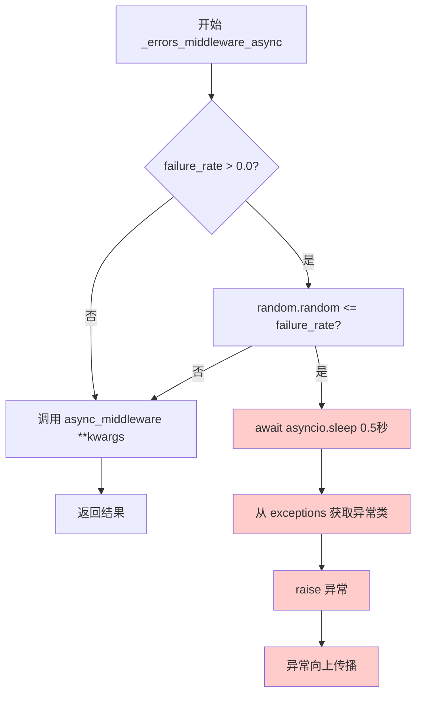

# `graphrag\packages\graphrag-llm\graphrag_llm\middleware\with_errors_for_testing.py` 详细设计文档

这是一个用于测试的错误注入中间件，通过包装同步和异步的LLM函数，根据指定的失败率随机触发异常，以模拟生产环境中的错误场景，用于调试和测试目的。

## 整体流程

```mermaid
graph TD
    A[调用 with_errors_for_testing] --> B[输入 sync_middleware, async_middleware, failure_rate, exception_type, exception_args]
    B --> C[返回 (_errors_middleware, _errors_middleware_async)]
    C --> D[调用 _errors_middleware]
    C --> E[调用 _errors_middleware_async]
    D --> F{failure_rate > 0 && random <= failure_rate?}
    E --> G{failure_rate > 0 && random <= failure_rate?}
    F -- 是 --> H[延迟 0.5秒]
    G -- 是 --> I[异步延迟 0.5秒]
    H --> J[获取异常类并抛出]
    I --> K[获取异常类并抛出]
    F -- 否 --> L[执行 sync_middleware]
    G -- 否 --> M[执行 async_middleware]
    L --> N[返回结果]
    M --> O[返回结果]
```

## 类结构

```
无类定义
└── 模块级函数: with_errors_for_testing (主入口)
    ├── 内部函数: _errors_middleware (同步中间件)
    └── 内部函数: _errors_middleware_async (异步中间件)
```

## 全局变量及字段


### `exceptions`
    
来自 litellm 的异常模块，用于动态获取异常类

类型：`module`
    


### `failure_rate`
    
浮点数，失败率阈值，用于决定是否触发模拟失败

类型：`float`
    


### `exception_type`
    
字符串，要抛出的异常类型名称

类型：`str`
    


### `exception_args`
    
列表或None，异常参数，用于传递给异常构造函数

类型：`list[Any] | None`
    


    

## 全局函数及方法


### `with_errors_for_testing`

该函数是一个错误测试中间件工厂，用于包装LLM（大型语言模型）函数（同步和异步版本），根据指定的失败率随机注入异常，以帮助测试代码的错误处理能力。

参数：

- `sync_middleware`：`LLMFunction`，要包装的同步模型函数，可以是completion函数或embedding函数
- `async_middleware`：`AsyncLLMFunction`，要包装的异步模型函数，可以是completion函数或embedding函数
- `failure_rate`：`float`，测试用的失败率，介于0.0和1.0之间，默认为0.0（无失败）
- `exception_type`：`str`，要抛出的异常类名称，来自litellm.exceptions，默认为"ValueError"
- `exception_args`：`list[Any] | None`，抛出异常时传递的参数，默认为None（使用默认消息）

返回值：`tuple[LLMFunction, AsyncLLMFunction]`，包装了错误测试中间件的同步和异步模型函数

#### 流程图

```mermaid
flowchart TD
    A[开始 with_errors_for_testing] --> B[定义同步中间件 _errors_middleware]
    B --> C{检查 failure_rate > 0}
    C -->|是| D[随机数 <= failure_rate?]
    C -->|否| G[直接调用 sync_middleware]
    D -->|是| E[延迟0.5秒]
    D -->|否| G
    E --> F[从 exceptions 获取异常类并抛出]
    F --> H[异常传播到调用方]
    G --> I[返回 sync_middleware 结果]
    
    J[定义异步中间件 _errors_middleware_async] --> K{检查 failure_rate > 0}
    K -->|是| L[随机数 <= failure_rate?]
    K -->|否| O[直接调用 async_middleware]
    L -->|是| M[异步延迟0.5秒]
    L -->|否| O
    M --> N[从 exceptions 获取异常类并抛出]
    N --> P[异常传播到调用方]
    O --> Q[返回 async_middleware 结果]
    
    R[返回元组 (_errors_middleware, _errors_middleware_async)] --> S[结束]
```

#### 带注释源码

```python
def with_errors_for_testing(
    *,
    sync_middleware: "LLMFunction",
    async_middleware: "AsyncLLMFunction",
    failure_rate: float = 0.0,
    exception_type: str = "ValueError",
    exception_args: list[Any] | None = None,
) -> tuple[
    "LLMFunction",
    "AsyncLLMFunction",
]:
    """Wrap model functions with error testing middleware.

    Args
    ----
        sync_middleware: LLMFunction
            The synchronous model function to wrap.
            Either a completion function or an embedding function.
        async_middleware: AsyncLLMFunction
            The asynchronous model function to wrap.
            Either a completion function or an embedding function.
        failure_rate: float
            The failure rate for testing, between 0.0 and 1.0.
            Defaults to 0.0 (no failures).
        exception_type: str
            The name of the exceptions class from litellm.exceptions to raise.
            Defaults to "ValueError".
        exception_args: list[Any] | None
            The arguments to pass to the exception when raising it. Defaults to None,
            which results in a default message.

    Returns
    -------
        tuple[LLMFunction, AsyncLLMFunction]
            The synchronous and asynchronous model functions wrapped with error testing middleware.
    """

    # 定义同步错误中间件函数
    def _errors_middleware(
        **kwargs: Any,  # 接收任意关键字参数
    ):
        # 如果失败率大于0且随机数小于等于失败率，则触发异常
        if failure_rate > 0.0 and random.random() <= failure_rate:  # noqa: S311
            time.sleep(0.5)  # 模拟延迟

            # 从 litellm.exceptions 获取指定的异常类，默认为 ValueError
            exception_cls = exceptions.__dict__.get(exception_type, ValueError)
            # 抛出异常，使用提供的参数或默认消息
            raise exception_cls(
                *(exception_args or ["Simulated failure for debugging purposes."])
            )

        # 否则正常调用原始同步中间件
        return sync_middleware(**kwargs)

    # 定义异步错误中间件函数
    async def _errors_middleware_async(
        **kwargs: Any,  # 接收任意关键字参数
    ):
        # 如果失败率大于0且随机数小于等于失败率，则触发异常
        if failure_rate > 0.0 and random.random() <= failure_rate:  # noqa: S311
            await asyncio.sleep(0.5)  # 模拟异步延迟

            # 从 litellm.exceptions 获取指定的异常类，默认为 ValueError
            exception_cls = exceptions.__dict__.get(exception_type, ValueError)
            # 抛出异常，使用提供的参数或默认消息
            raise exception_cls(
                *(exception_args or ["Simulated failure for debugging purposes."])
            )

        # 否则正常调用原始异步中间件
        return await async_middleware(**kwargs)

    # 返回包装后的同步和异步函数元组
    return (_errors_middleware, _errors_middleware_async)  # type: ignore
```


### `_errors_middleware`

这是一个内部同步中间件函数，用于在调用底层 LLM 函数时根据指定的失败率随机模拟异常，以测试系统的错误处理能力。

参数：

- `**kwargs`：`Any`，传递给底层同步中间件函数的所有关键字参数（如模型参数、输入数据等）

返回值：`Any`，底层同步中间件函数 `sync_middleware` 的返回值，如果未抛出异常则返回其执行结果

#### 流程图

```mermaid
flowchart TD
    A[开始] --> B{failure_rate > 0.0 且<br/>random.random() <= failure_rate?}
    B -->|是| C[time.sleep 0.5秒]
    C --> D[从 exceptions 获取异常类]
    D --> E[raise exception_cls]
    E --> F[结束 - 异常向上传播]
    B -->|否| G[调用 sync_middleware(**kwargs)]
    G --> H[返回结果]
    H --> F
```

#### 带注释源码

```python
def _errors_middleware(
    **kwargs: Any,  # 接收任意关键字参数，传递给底层同步函数
):
    """同步错误测试中间件。
    
    根据 failure_rate 随机决定是否抛出异常，
    用于测试调用方的错误处理逻辑。
    """
    # 检查是否需要模拟失败
    if failure_rate > 0.0 and random.random() <= failure_rate:  # noqa: S311
        time.sleep(0.5)  # 模拟延迟，模拟真实网络请求的失败场景

        # 从 litellm.exceptions 模块动态获取异常类
        exception_cls = exceptions.__dict__.get(exception_type, ValueError)
        # 抛出指定类型的异常
        raise exception_cls(
            *(exception_args or ["Simulated failure for debugging purposes."])
        )

    # 正常情况下调用底层同步中间件函数并返回其结果
    return sync_middleware(**kwargs)
```


### `with_errors_for_testing._errors_middleware_async`

这是一个内部异步中间件函数，用于在调用实际的异步LLM函数之前，根据配置的失败率（failure_rate）随机触发异常，以模拟测试场景中的错误处理。

参数：

- `**kwargs`：`Any`，任意关键字参数，这些参数会被直接传递给底层的异步中间件函数（`async_middleware`）

返回值：`Any`，底层异步LLM函数（`async_middleware`）的返回值，如果未触发异常则返回正常的函数执行结果

#### 流程图



#### 带注释源码

```python
async def _errors_middleware_async(
    **kwargs: Any,  # 接收任意关键字参数，传递给底层的异步中间件函数
):
    """异步错误测试中间件。
    
    根据failure_rate配置的概率，随机触发异常以模拟测试场景。
    """
    
    # 检查是否配置了失败率
    if failure_rate > 0.0 and random.random() <= failure_rate:  # noqa: S311
        # 模拟异步延迟（模拟真实网络调用或处理延迟）
        await asyncio.sleep(0.5)

        # 从litellm.exceptions模块动态获取异常类
        # 默认降级为ValueError
        exception_cls = exceptions.__dict__.get(exception_type, ValueError)
        
        # 使用配置的参数或默认消息抛出异常
        raise exception_cls(
            *(exception_args or ["Simulated failure for debugging purposes."])
        )

    # 未触发异常时，正常调用底层异步中间件函数
    return await async_middleware(**kwargs)
```

## 关键组件


## 一段话描述

该代码实现了一个错误测试中间件，通过包装LLM的同步和异步函数，以可配置的失败率随机注入异常，用于测试系统对各类错误的容错能力和调试能力。

## 文件的整体运行流程

1. 调用 `with_errors_for_testing` 函数，传入同步和异步中间件函数以及配置参数
2. 函数内部创建两个包装器：` _errors_middleware`（同步）和 `_errors_middleware_async`（异步）
3. 每次调用包装器时，根据 `failure_rate` 随机决定是否触发错误
4. 若触发错误，延迟0.5秒后从 `litellm.exceptions` 获取指定异常类型并抛出
5. 若不触发错误，则正常调用原始中间件函数

## 全局变量和全局函数详细信息

### 全局函数

#### with_errors_for_testing

- **参数名称**: sync_middleware, async_middleware, failure_rate, exception_type, exception_args
- **参数类型**: LLMFunction, AsyncLLMFunction, float, str, list[Any] | None
- **参数描述**: 
  - sync_middleware: 要包装的同步模型函数（完成函数或嵌入函数）
  - async_middleware: 要包装的异步模型函数
  - failure_rate: 测试用失败率，0.0-1.0之间，默认为0.0
  - exception_type: 要抛出的异常类名称，默认为"ValueError"
  - exception_args: 传递给异常的参数列表，默认为None
- **返回值类型**: tuple[LLMFunction, AsyncLLMFunction]
- **返回值描述**: 包装了错误测试功能的同步和异步模型函数

#### _errors_middleware (内部函数)

- **参数名称**: kwargs
- **参数类型**: Any
- **参数描述**: 传递给底层同步中间件的所有关键字参数
- **返回值类型**: Any
- **返回值描述**: 底层同步中间件的返回值，或抛出的异常

#### _errors_middleware_async (内部函数)

- **参数名称**: kwargs
- **参数类型**: Any
- **参数描述**: 传递给底层异步中间件的所有关键字参数
- **返回值类型**: Any
- **返回值描述**: 底层异步中间件的返回值，或抛出的异常

## 关键组件信息

### with_errors_for_testing

错误测试中间件的主入口函数，负责创建带有随机错误注入功能的函数包装器

### 失败率控制机制

通过 `failure_rate` 参数控制错误触发概率，使用 `random.random()` 生成0-1随机数进行比较

### 异常类型动态获取

使用 `exceptions.__dict__.get()` 动态从 litellm.exceptions 模块获取指定的异常类

### 同步中间件 _errors_middleware

包装同步LLM函数，在调用前根据失败率决定是否抛出异常

### 异步中间件 _errors_middleware_async

包装异步LLM函数，使用 `await asyncio.sleep()` 实现异步延迟

## 潜在的技术债务或优化空间

1. **随机数生成安全**: 使用 `random.random()` 在安全敏感场景下可能不够安全，建议使用 `secrets` 模块
2. **延迟硬编码**: 0.5秒延迟硬编码在代码中，建议作为可配置参数
3. **异常参数类型**: exception_args 使用 list[Any] 类型，类型安全性可以增强
4. **错误注入逻辑重复**: 同步和异步中间件的错误注入逻辑重复，可提取为通用函数

## 其它项目

### 设计目标与约束

- 目标：提供可配置的LLM函数错误注入能力，用于测试容错机制
- 约束：failure_rate 必须在0.0到1.0之间

### 错误处理与异常设计

- 动态支持 litellm.exceptions 中的任何异常类型
- 默认使用 ValueError，并提供默认错误消息"Simulated failure for debugging purposes."

### 数据流与状态机

数据流为：调用方 → 包装器函数 → (随机决定) → 抛出异常 或 → 原始中间件函数 → 返回结果

### 外部依赖与接口契约

- 依赖 `litellm.exceptions` 模块获取异常类
- 输入接口：接受符合 LLMFunction 和 AsyncLLMFunction 签名的函数
- 输出接口：返回相同签名的包装函数


## 问题及建议


### 已知问题

-   **随机数生成不安全**：使用 `random.random()` 生成随机数，不是加密安全的随机数（代码中已标注 `# noqa: S311`），在安全敏感场景下存在风险
-   **异常类型获取方式脆弱**：使用 `exceptions.__dict__.get(exception_type, ValueError)` 动态获取异常类，如果传入的 `exception_type` 不存在，会静默回退到 `ValueError`，可能导致配置错误被掩盖
-   **硬编码延迟时间**：`time.sleep(0.5)` 和 `await asyncio.sleep(0.5)` 的 0.5 秒延迟是硬编码的，缺乏灵活性
-   **异常参数传递风险**：使用 `*(exception_args or [...])` 解包参数时，如果 `exception_args` 与目标异常类的签名不匹配，可能产生难以调试的错误
-   **缺少日志记录**：注入错误时没有任何日志输出，调试时难以追踪是真实错误还是测试注入的模拟错误
- **同步阻塞调用**：同步版本使用阻塞的 `time.sleep()`，在异步环境中会阻塞事件循环
- **无法复现测试**：使用全局 `random` 模块，无法通过种子实现可复现的确定性测试
- **类型推断不完善**：存在 `# type: ignore` 注解，表明返回类型处理可以改进

### 优化建议

-   使用 `secrets` 模块替代 `random` 模块以满足加密安全需求
-   增加可选的 `seed` 参数以支持确定性测试，或显式验证 `exception_type` 是否存在于 `litellm.exceptions` 中并抛出明确错误
-   将延迟时间参数化，允许调用者配置
-   添加日志记录功能，在注入错误时输出可识别的日志信息，便于调试
-   考虑将同步版本改为在独立线程中执行睡眠，避免阻塞事件循环
-   完善类型注解，使用 `typing.TypeVar` 改进返回类型的泛化处理

## 其它


### 设计目标与约束

**设计目标**：
该中间件旨在为LLM（大型语言模型）调用提供可控的故障注入能力，用于测试系统在异常情况下的行为和恢复机制。通过模拟不同类型的异常，帮助开发者和测试人员验证错误处理逻辑的健壮性。

**约束条件**：
- failure_rate 参数必须控制在 0.0 到 1.0 之间
- exception_type 必须是 litellm.exceptions 模块中存在的异常类名称
- 中间件必须保持原函数签名和返回值的兼容性
- 同步和异步版本必须提供相同的行为逻辑

### 错误处理与异常设计

**异常触发机制**：
- 使用 random.random() 生成随机数与 failure_rate 比较，决定是否触发异常
- 触发异常前有 0.5 秒延迟（同步使用 time.sleep，异步使用 asyncio.sleep），模拟真实网络延迟
- 异常类型通过字符串动态获取，支持任意 litellm.exceptions 中的异常类

**默认异常处理**：
- 当 exception_type 不存在于 litellm.exceptions 模块时，回退到 ValueError
- 当 exception_args 为 None 时，使用默认错误消息 "Simulated failure for debugging purposes."

### 数据流与状态机

**同步调用流程**：
```
调用入口 → 参数校验(failure_rate) → 随机数生成 → 
[failure_rate > 0 and random <= failure_rate] → 延迟0.5秒 → 构造异常 → 抛出异常
                                                    ↓
                                                 执行原函数 → 返回结果
```

**异步调用流程**：
```
调用入口 → 参数校验(failure_rate) → 随机数生成 → 
[failure_rate > 0 and random <= failure_rate] → 异步延迟0.5秒 → 构造异常 → 抛出异常
                                                    ↓
                                              异步执行原函数 → 返回结果
```

### 外部依赖与接口契约

**依赖项**：
- litellm.exceptions：提供可模拟的异常类集合
- asyncio：提供异步sleep支持
- random：提供随机数生成
- time：提供同步延迟

**接口契约**：
- 输入：接受任意关键字参数 **kwargs，透传给底层LLM函数
- 输出：返回底层LLM函数的执行结果（同步或异步）
- 异常：按配置的 failure_rate 概率抛出指定类型的异常

### 性能考虑

**延迟开销**：
- 触发异常时：固定 0.5 秒延迟
- 正常执行时：无额外延迟，仅函数调用开销

**随机数生成**：
- 使用 random.random()，在高频调用场景下可能存在轻微性能影响

### 安全性考虑

**随机数安全性**：
- 代码中标注了 # noqa: S311，表明已知使用 random 而非 secrets 模块的安全警告
- 在测试环境中此风险可忽略，生产环境建议使用 secrets 模块

**异常信息泄露**：
- 默认错误消息不包含敏感信息
- 自定义 exception_args 时需注意不要泄露生产环境敏感数据

### 并发与线程安全

**同步版本**：
- random.random() 和 time.sleep() 均为线程安全
- 无共享状态修改，并发调用安全

**异步版本**：
- asyncio.sleep() 为协程安全
- 无共享状态修改，并发调用安全

### 测试策略

**单元测试建议**：
- 验证 failure_rate=0 时不抛出异常
- 验证 failure_rate=1 时必定抛出异常
- 验证不同 exception_type 的异常抛出
- 验证异常参数的传递
- 验证同步/异步函数的返回值正确性

**集成测试建议**：
- 与实际LLM调用链路的集成测试
- 异常情况下的错误处理链路测试

### 版本兼容性

**Python版本要求**：
- 需要支持 Python 3.9+（基于 TYPE_CHECKING 导入模式和联合类型语法）

**依赖兼容性**：
- litellm.exceptions 的异常类列表可能随版本变化，需验证兼容性

### 日志与监控

**当前实现**：
- 无日志记录功能
- 无监控指标暴露

**建议改进**：
- 添加日志记录异常触发次数
- 添加指标暴露用于监控系统观察故障注入效果

### 部署注意事项

**配置管理**：
- failure_rate 在生产环境应设为 0.0
- exception_type 和 exception_args 应根据测试场景配置

**环境隔离**：
- 建议仅在测试环境启用该中间件
- 生产环境应使用条件开关或环境变量控制

### 使用示例与API参考

**基本用法**：
```python
from graphrag_llm.middleware import with_errors_for_testing

sync_fn, async_fn = with_errors_for_testing(
    sync_middleware=original_sync_llm,
    async_middleware=original_async_llm,
    failure_rate=0.3,
    exception_type="RateLimitError",
    exception_args=["Rate limit exceeded for testing"]
)
```

**配置参数表**：
| 参数 | 类型 | 默认值 | 描述 |
|------|------|--------|------|
| sync_middleware | LLMFunction | 必填 | 同步LLM函数 |
| async_middleware | AsyncLLMFunction | 必填 | 异步LLM函数 |
| failure_rate | float | 0.0 | 失败率(0.0-1.0) |
| exception_type | str | "ValueError" | 异常类名 |
| exception_args | list[Any] | None | 异常参数 |


    