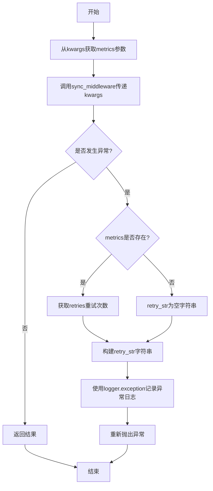
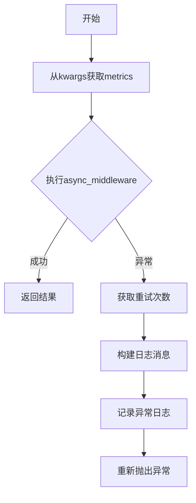

# `graphrag\packages\graphrag-llm\graphrag_llm\middleware\with_logging.py` 详细设计文档

这是一个日志记录中间件模块，通过包装同步和异步的LLM函数，捕获执行过程中的异常并记录日志，同时支持记录重试次数信息。该模块提供with_logging函数作为入口，返回经过日志增强的同步和异步中间件函数。

## 整体流程

```mermaid
graph TD
    A[开始 with_logging] --> B[接收 sync_middleware 和 async_middleware]
    B --> C[定义同步中间件 _request_count_middleware]
    C --> C1[从 kwargs 获取 metrics]
    C1 --> C2[调用 sync_middleware]
    C2 --> C3{是否发生异常?}
    C3 -- 否 --> C4[返回结果]
    C3 -- 是 --> C5[获取重试次数]
    C5 --> C6[记录异常日志]
    C6 --> C7[重新抛出异常]
    C --> D[定义异步中间件 _request_count_middleware_async]
    D --> D1[从 kwargs 获取 metrics]
    D1 --> D2[await 异步调用 async_middleware]
    D2 --> D3{是否发生异常?}
    D3 -- 否 --> D4[返回结果]
    D3 -- 是 --> D5[获取重试次数]
    D5 --> D6[记录异常日志]
    D6 --> D7[重新抛出异常]
    D --> E[返回元组 (_request_count_middleware, _request_count_middleware_async)]
    E --> F[结束]
```

## 类结构

```
模块: request_count_middleware.py (无类定义)
├── 全局函数: with_logging
│   ├── 内部函数: _request_count_middleware (同步中间件)
│   └── 内部函数: _request_count_middleware_async (异步中间件)
└── 全局变量: logger (logging.getLogger)
```

## 全局变量及字段


### `logger`
    
模块级日志记录器，用于记录异常信息

类型：`logging.Logger`
    


### `sync_middleware`
    
同步LLM函数

类型：`LLMFunction`
    


### `async_middleware`
    
异步LLM函数

类型：`AsyncLLMFunction`
    


### `_request_count_middleware.metrics`
    
从kwargs获取的指标对象，用于获取重试次数

类型：`Metrics | None`
    


### `_request_count_middleware.kwargs`
    
传递给中间件的关键字参数

类型：`Any`
    


### `_request_count_middleware.e`
    
捕获的异常对象

类型：`Exception`
    


### `_request_count_middleware.retries`
    
从metrics获取的重试次数

类型：`Any | None`
    


### `_request_count_middleware.retry_str`
    
格式化后的重试次数字符串

类型：`str`
    


### `_request_count_middleware_async.metrics`
    
从kwargs获取的指标对象，用于获取重试次数

类型：`Metrics | None`
    


### `_request_count_middleware_async.kwargs`
    
传递给中间件的关键字参数

类型：`Any`
    


### `_request_count_middleware_async.e`
    
捕获的异常对象

类型：`Exception`
    


### `_request_count_middleware_async.retries`
    
从metrics获取的重试次数

类型：`Any | None`
    


### `_request_count_middleware_async.retry_str`
    
格式化后的重试次数字符串

类型：`str`
    
    

## 全局函数及方法


### `with_logging`

该函数是一个中间件工厂函数，接收同步和异步的 LLM 模型函数作为输入，返回包装了日志记录功能的函数元组，用于在请求失败时记录异常信息和重试次数。

参数：

- `sync_middleware`：`LLMFunction`，同步模型函数，可以是 completion 函数或 embedding 函数
- `async_middleware`：`AsyncLLMFunction`，异步模型函数，可以是 completion 函数或 embedding 函数

返回值：`tuple[LLMFunction, AsyncLLMFunction]`，包含包装了日志中间件的同步和异步函数元组

#### 流程图

```mermaid
flowchart TD
    A[开始 with_logging] --> B[接收参数 sync_middleware 和 async_middleware]
    
    B --> C[定义内部同步包装函数 _request_count_middleware]
    C --> C1[从 kwargs 获取 metrics]
    C1 --> C2[执行 sync_middleware]
    C2 --> C3{是否发生异常?}
    C3 -->|是| C4[获取 retries 次数]
    C4 --> C5[记录异常日志]
    C5 --> C6[重新抛出异常]
    C3 -->|否| C7[返回结果]
    
    C --> D[定义内部异步包装函数 _request_count_middleware_async]
    D --> D1[从 kwargs 获取 metrics]
    D1 --> D2[异步执行 async_middleware]
    D2 --> D3{是否发生异常?}
    D3 -->|是| D4[获取 retries 次数]
    D4 --> D5[记录异步异常日志]
    D5 --> D6[重新抛出异常]
    D3 -->|否| D7[返回结果]
    
    D --> E[返回函数元组 (_request_count_middleware, _request_count_middleware_async)]
    E --> F[结束]
```

#### 带注释源码

```python
def with_logging(
    *,
    sync_middleware: "LLMFunction",
    async_middleware: "AsyncLLMFunction",
) -> tuple[
    "LLMFunction",
    "AsyncLLMFunction",
]:
    """Wrap model functions with logging middleware.

    Args
    ----
        sync_middleware: LLMFunction
            The synchronous model function to wrap.
            Either a completion function or an embedding function.
        async_middleware: AsyncLLMFunction
            The asynchronous model function to wrap.
            Either a completion function or an embedding function.

    Returns
    -------
        tuple[LLMFunction, AsyncLLMFunction]
            The synchronous and asynchronous model functions wrapped with request count middleware.
    """

    # 定义同步日志包装函数
    # 内部函数捕获同步调用中的异常并记录日志
    def _request_count_middleware(
        **kwargs: Any,  # 接收任意关键字参数
    ):
        metrics: Metrics | None = kwargs.get("metrics")  # 从参数中提取 metrics
        try:
            return sync_middleware(**kwargs)  # 执行原始同步函数
        except Exception as e:  # 捕获所有异常
            retries = metrics.get("retries", None) if metrics else None  # 获取重试次数
            retry_str = f" after {retries} retries" if retries else ""  # 格式化重试信息
            logger.exception(
                f"Request failed{retry_str} with exception={e}",  # 记录异常日志
            )
            raise  # 重新抛出异常

    # 定义异步日志包装函数
    # 内部函数捕获异步调用中的异常并记录日志
    async def _request_count_middleware_async(
        **kwargs: Any,  # 接收任意关键字参数
    ):
        metrics: Metrics | None = kwargs.get("metrics")  # 从参数中提取 metrics
        
        try:
            return await async_middleware(**kwargs)  # 异步执行原始函数
        except Exception as e:  # 捕获所有异常
            retries = metrics.get("retries", None) if metrics else None  # 获取重试次数
            retry_str = f" after {retries} retries" if retries else ""  # 格式化重试信息
            logger.exception(
                f"Async request failed{retry_str} with exception={e}",  # 记录异步异常日志
            )
            raise  # 重新抛出异常

    # 返回包装后的同步和异步函数元组
    return (_request_count_middleware, _request_count_middleware_async)  # type: ignore
```


### `_request_count_middleware`

同步中间件函数，用于包装同步 LLM 调用，在发生异常时记录包含重试次数的日志信息并重新抛出异常。

参数：

- `**kwargs`：`Any`，任意关键字参数，将直接传递给底层同步中间件函数（`sync_middleware`）

返回值：取决于被包装的 `sync_middleware` 函数的返回类型，通常是 LLM 的响应对象

#### 流程图



#### 带注释源码

```python
def _request_count_middleware(
    **kwargs: Any,  # 任意关键字参数，传递给底层同步LLM函数
):
    """同步中间件 - 包装同步LLM调用并添加异常日志"""
    
    # 从kwargs中提取metrics指标对象，用于获取重试次数信息
    metrics: Metrics | None = kwargs.get("metrics")
    
    try:
        # 调用底层同步中间件函数并返回其结果
        return sync_middleware(**kwargs)
    except Exception as e:
        # 尝试获取重试次数，若metrics不存在则返回None
        retries = metrics.get("retries", None) if metrics else None
        
        # 构建重试信息字符串，若有重试则显示" after N retries"
        retry_str = f" after {retries} retries" if retries else ""
        
        # 记录异常日志，包含重试信息和异常详情
        logger.exception(
            f"Request failed{retry_str} with exception={e}",  # noqa: G004, TRY401
        )
        
        # 重新抛出异常以便上层调用者处理
        raise
```


### `_request_count_middleware_async`

这是一个内部异步中间件函数，封装异步 LLM 调用，捕获异常并记录包含重试次数的日志信息，然后重新抛出异常。

参数：

- `**kwargs`：`Any`，任意关键字参数，包含传递给异步中间件函数的参数，其中可能包含 `metrics` 字典

返回值：`Any`，返回异步中间件函数 `async_middleware` 的执行结果

#### 流程图



#### 带注释源码

```python
async def _request_count_middleware_async(
    **kwargs: Any,  # 任意关键字参数，包含传递给异步中间件函数的参数
):
    """异步中间件：包装异步LLM调用并添加异常日志。
    
    该函数是一个内部中间件，用于包装异步LLM函数（如异步补全或嵌入函数），
    在执行过程中捕获异常并记录包含重试次数的日志信息。
    """
    
    # 从kwargs中获取metrics字典，用于记录重试次数等指标
    metrics: Metrics | None = kwargs.get("metrics")
    
    try:
        # 尝试执行被包装的异步中间件函数，传递所有参数
        return await async_middleware(**kwargs)
    except Exception as e:
        # 异常处理分支：捕获执行过程中的异常
        
        # 从metrics中获取重试次数（如果存在）
        retries = metrics.get("retries", None) if metrics else None
        
        # 根据是否有重试次数构建日志消息前缀
        retry_str = f" after {retries} retries" if retries else ""
        
        # 使用logger.exception记录异常日志（包含完整的堆栈跟踪）
        # 日志格式：Async request failed{retry_str} with exception={e}
        logger.exception(
            f"Async request failed{retry_str} with exception={e}",  # noqa: G004, TRY401
        )
        
        # 重新抛出异常，保持调用链的异常传播
        raise
```

## 关键组件


### with_logging 函数

用于包装LLM函数的日志中间件工厂函数，接收同步和异步中间件函数，返回包装后的同步和异步函数版本。

### _request_count_middleware 同步中间件

同步函数包装器，在调用底层同步LLM函数时捕获异常并记录日志，包含重试次数信息。

### _request_count_middleware_async 异步中间件

异步函数包装器，在调用底层异步LLM函数时捕获异常并记录日志，包含重试次数信息。

### Metrics 类型

用于传递指标的字典结构，包含重试次数（retries）等指标信息，用于日志记录中的错误上下文描述。

### 异常处理机制

使用try-except捕获同步和异步函数执行过程中的异常，获取metrics中的重试次数信息，生成描述性错误日志后重新抛出异常。

### 日志记录模块

使用标准logging模块记录请求失败信息，包括异常类型和可选的重试次数，便于调试和问题追踪。


## 问题及建议


### 已知问题

-   **类型安全缺失**：返回类型使用了 `# type: ignore` 标记，绕过了类型检查，存在类型推断风险
-   **metrics 类型假设不可靠**：假设 `metrics` 是字典类型并使用 `.get()` 方法，但 `Metrics` 类型的实际结构未知，可能导致运行时错误
-   **异常处理不完整**：仅记录异常后直接抛出，没有重试机制，且没有资源清理逻辑
-   **参数验证缺失**：未验证 `sync_middleware` 和 `async_middleware` 是否为 `None`，可能导致调用时崩溃
-   **代码重复**：同步和异步中间件逻辑高度重复，违反了 DRY 原则
-   **敏感信息泄露风险**：`logger.exception()` 会记录完整的堆栈信息，可能包含敏感数据

### 优化建议

-   添加输入参数验证，确保 `sync_middleware` 和 `async_middleware` 不为 `None`
-   明确定义 `Metrics` 类型或使用 Protocols 定义接口约束
-   使用 `try/finally` 块确保资源正确释放（尤其在异步场景）
-   提取公共逻辑到独立函数，减少代码重复
-   考虑添加日志脱敏机制，过滤敏感信息
-   补充超时参数支持，增强请求控制能力

## 其它


### 设计目标与约束

本模块的设计目标是为LLM（大型语言模型）调用提供统一的日志记录中间件，支持同步和异步两种调用模式，捕获请求异常信息并记录重试次数。约束条件包括：必须保持原有函数签名完全兼容，不得改变调用方的传入参数结构，仅在执行前后添加日志记录逻辑。

### 错误处理与异常设计

异常处理采用透明传播模式，即捕获异常后记录详细日志信息（包括重试次数），随后重新抛出原异常，确保调用方能够感知到请求失败。日志记录使用logger.exception方法，能够自动包含完整的堆栈信息。对于metrics参数为空的情况做了防御性处理，避免空指针异常。

### 外部依赖与接口契约

本模块依赖以下外部组件：logging模块用于日志输出；typing模块用于类型注解；graphrag_llm.types中的LLMFunction、AsyncLLMFunction和Metrics类型定义。接口契约要求传入的sync_middleware和async_middleware必须是可调用的函数对象，支持任意关键字参数**kwargs传递，返回值类型保持与原函数一致。

### 性能考虑

该中间件对性能的影响极小，仅在请求执行前后增加日志记录操作。异步版本使用async/await模式，不会阻塞事件循环。对于禁用日志的场景，logging模块的级别控制会自动跳过日志记录开销。

### 安全性考虑

日志记录中可能包含异常信息，但默认情况下不会记录敏感的请求参数内容。如需记录请求参数，需调用方自行在kwargs中传递脱敏后的数据。当前实现符合最小权限原则，不引入额外的安全风险。

### 配置管理

本模块不直接管理配置，日志记录的详细程度由Python logging模块的全局配置决定。调用方可通过设置logging.getLogger(__name__)的级别来控制日志输出行为。

### 测试策略建议

建议添加以下测试用例：验证同步中间件正常调用时的行为；验证异步中间件正常调用时的行为；验证异常被正确捕获并重新抛出；验证metrics为None时的异常处理；验证metrics包含retries时的日志输出格式；验证返回值与原函数返回值一致。

### 版本兼容性

代码使用Python 3.9+的类型注解语法（from __future__ import annotations未使用但推荐添加以提高兼容性）。对于Python 3.8及以下版本，可能需要调整类型注解的写法。依赖的graphrag_llm.types模块需要确保版本兼容。


    