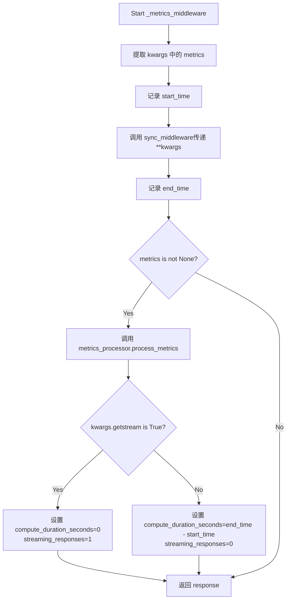
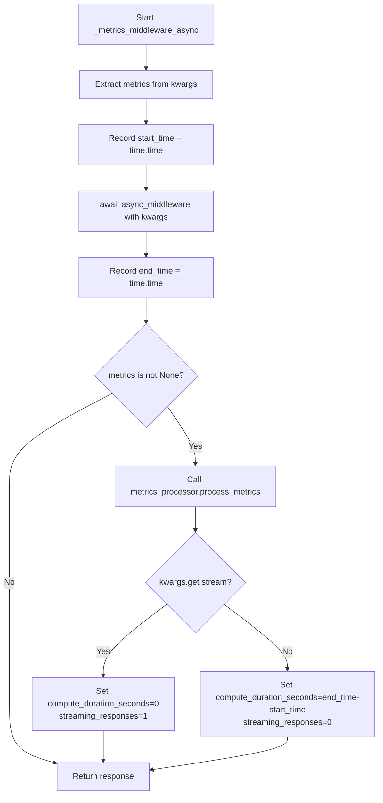

# `graphrag\packages\graphrag-llm\graphrag_llm\middleware\with_metrics.py` 详细设计文档

一个指标中间件模块，用于包装同步和异步的LLM模型函数，收集和处理性能指标，包括计算耗时和流式响应计数。

## 整体流程

```mermaid
graph TD
    A[开始] --> B[调用with_metrics函数]
    B --> C[返回元组: (_metrics_middleware, _metrics_middleware_async)]
    C --> D{调用同步函数}
    C --> E{调用异步函数}
    D --> D1[获取kwargs中的metrics参数]
    D --> D2[记录start_time时间戳]
    D --> D3[调用sync_middleware执行实际逻辑]
    D --> D4[记录end_time时间戳]
    D --> D5{metrics不为None?}
    D5 -- 是 --> D6[调用metrics_processor.process_metrics]
    D5 -- 否 --> D8[直接返回response]
    D6 --> D7{stream参数为true?}
    D7 -- 是 --> D9[设置compute_duration_seconds=0, streaming_responses=1]
    D7 -- 否 --> D10[设置compute_duration_seconds=end-start, streaming_responses=0]
    D9 --> D8
    D10 --> D8
    E --> E1[获取kwargs中的metrics参数]
    E --> E2[记录start_time时间戳]
    E --> E3[await async_middleware执行实际逻辑]
    E --> E4[记录end_time时间戳]
    E --> E5{metrics不为None?}
    E5 -- 是 --> E6[调用metrics_processor.process_metrics]
    E5 -- 否 --> E8[直接返回response]
    E6 --> E7{stream参数为true?}
    E7 -- 是 --> E9[设置compute_duration_seconds=0, streaming_responses=1]
    E7 -- 否 --> E10[设置compute_duration_seconds=end-start, streaming_responses=0]
    E9 --> E8
    E10 --> E8
```

## 类结构

```
无类定义 - 仅包含函数的高阶模块
└── with_metrics (主函数)
    ├── _metrics_middleware (内部同步包装函数)
    └── _metrics_middleware_async (内部异步包装函数)
```

## 全局变量及字段


### `with_metrics`
    
包装模型函数以添加指标处理功能的中间件工厂函数

类型：`function`
    


### `model_config`
    
模型配置对象，包含模型相关参数

类型：`ModelConfig`
    


### `sync_middleware`
    
要包装的同步模型函数（completion或embedding函数）

类型：`LLMFunction`
    


### `async_middleware`
    
要包装的异步模型函数（completion或embedding函数）

类型：`AsyncLLMFunction`
    


### `metrics_processor`
    
用于处理和记录指标的工具类实例

类型：`MetricsProcessor`
    


### `_metrics_middleware`
    
同步指标中间件包装函数，拦截调用并记录指标

类型：`function`
    


### `_metrics_middleware_async`
    
异步指标中间件包装函数，拦截调用并记录指标

类型：`function`
    


### `kwargs`
    
传递给模型函数的动态关键字参数

类型：`Any`
    


### `metrics`
    
从kwargs中获取的指标字典，可能为None

类型：`Metrics | None`
    


### `start_time`
    
模型函数调用开始时的时间戳

类型：`float`
    


### `end_time`
    
模型函数调用结束时的时间戳

类型：`float`
    


### `response`
    
模型函数的返回值

类型：`Any`
    


    

## 全局函数及方法


### `with_metrics`

该函数是一个指标中间件工厂，用于将指标收集功能包装到同步和异步的LLM函数中。它接收模型配置、同步/异步中间件函数和指标处理器，返回包装了指标收集逻辑的新函数。

参数：

- `model_config`：`ModelConfig`，模型配置对象，包含模型相关配置信息
- `sync_middleware`：`LLMFunction`，要包装的同步模型函数（可以是completion函数或embedding函数）
- `async_middleware`：`AsyncLLMFunction`，要包装的异步模型函数（可以是completion函数或embedding函数）
- `metrics_processor`：`MetricsProcessor`，用于处理和记录指标的处理器

返回值：`tuple[LLMFunction, AsyncLLMFunction]`，返回包装了指标中间件的同步和异步模型函数元组

#### 流程图

```mermaid
flowchart TD
    A[开始 with_metrics] --> B[接收参数: model_config, sync_middleware, async_middleware, metrics_processor]
    B --> C[定义同步中间件函数 _metrics_middleware]
    C --> C1[从kwargs获取metrics]
    C1 --> C2[记录start_time]
    C2 --> C3[调用sync_middleware执行原始函数]
    C3 --> C4[记录end_time]
    C4 --> C5{metrics是否存在?}
    C5 -->|是| C6[调用metrics_processor.process_metrics处理指标]
    C5 -->|否| C7[跳过指标处理]
    C6 --> C8{是否streaming?}
    C7 --> C9[返回response]
    C8 -->|是| C10[设置compute_duration_seconds=0, streaming_responses=1]
    C8 -->|否| C11[设置compute_duration_seconds=end_time-start_time, streaming_responses=0]
    C10 --> C9
    C11 --> C9
    
    C9 --> D[定义异步中间件函数 _metrics_middleware_async]
    D --> D1[从kwargs获取metrics]
    D1 --> D2[记录start_time]
    D2 --> D3[await async_middleware执行原始函数]
    D3 --> D4[记录end_time]
    D4 --> D5{metrics是否存在?}
    D5 -->|是| D6[调用metrics_processor.process_metrics处理指标]
    D5 -->|否| D7[返回response]
    D6 --> D8{是否streaming?}
    D7 --> D9[返回response]
    D8 -->|是| D10[设置compute_duration_seconds=0, streaming_responses=1]
    D8 -->|否| D11[设置compute_duration_seconds=end_time-start_time, streaming_responses=0]
    D10 --> D9
    D11 --> D9
    
    D9 --> E[返回元组 (_metrics_middleware, _metrics_middleware_async)]
    E --> F[结束]
```

#### 带注释源码

```python
# 版权声明和许可协议
# Copyright (c) 2024 Microsoft Corporation.
# Licensed under the MIT License

"""Metrics middleware to process metrics using a MetricsProcessor."""

# 导入时间模块用于计时
import time
# 导入类型检查相关的类型
from typing import TYPE_CHECKING, Any

# 仅在类型检查时导入，避免运行时循环依赖
if TYPE_CHECKING:
    from graphrag_llm.config import ModelConfig
    from graphrag_llm.metrics import MetricsProcessor
    from graphrag_llm.types import (
        AsyncLLMFunction,
        LLMFunction,
        Metrics,
    )


def with_metrics(
    *,
    model_config: "ModelConfig",
    sync_middleware: "LLMFunction",
    async_middleware: "AsyncLLMFunction",
    metrics_processor: "MetricsProcessor",
) -> tuple[
    "LLMFunction",
    "AsyncLLMFunction",
]:
    """Wrap model functions with metrics middleware.

    Args
    ----
        model_config: ModelConfig
            The model configuration.
        sync_middleware: LLMFunction
            The synchronous model function to wrap.
            Either a completion function or an embedding function.
        async_middleware: AsyncLLMFunction
            The asynchronous model function to wrap.
            Either a completion function or an embedding function.
        metrics_processor: MetricsProcessor
            The metrics processor to use.

    Returns
    -------
        tuple[LLMFunction, AsyncLLMFunction]
            The synchronous and asynchronous model functions wrapped with metrics middleware.

    """

    # 定义同步版本的指标中间件包装函数
    def _metrics_middleware(
        **kwargs: Any,
    ):
        # 从关键字参数中获取metrics字典
        metrics: Metrics | None = kwargs.get("metrics")
        # 记录函数执行开始时间
        start_time = time.time()
        # 调用原始同步中间件函数并获取响应
        response = sync_middleware(**kwargs)
        # 记录函数执行结束时间
        end_time = time.time()

        # 如果传入了metrics字典，则处理指标
        if metrics is not None:
            # 调用指标处理器处理指标数据
            metrics_processor.process_metrics(
                model_config=model_config,
                metrics=metrics,
                input_args=kwargs,
                response=response,
            )
            # 根据是否为流式响应设置指标值
            if kwargs.get("stream"):
                # 流式响应：计算时长设为0，响应次数设为1
                metrics["compute_duration_seconds"] = 0
                metrics["streaming_responses"] = 1
            else:
                # 非流式响应：计算实际执行时长
                metrics["compute_duration_seconds"] = end_time - start_time
                metrics["streaming_responses"] = 0
        # 返回原始函数响应
        return response

    # 定义异步版本的指标中间件包装函数
    async def _metrics_middleware_async(
        **kwargs: Any,
    ):
        # 从关键字参数中获取metrics字典
        metrics: Metrics | None = kwargs.get("metrics")

        # 记录函数执行开始时间
        start_time = time.time()
        # 异步调用原始中间件函数并获取响应
        response = await async_middleware(**kwargs)
        # 记录函数执行结束时间
        end_time = time.time()

        # 如果传入了metrics字典，则处理指标
        if metrics is not None:
            # 调用指标处理器处理指标数据
            metrics_processor.process_metrics(
                model_config=model_config,
                metrics=metrics,
                input_args=kwargs,
                response=response,
            )
            # 根据是否为流式响应设置指标值
            if kwargs.get("stream"):
                # 流式响应：计算时长设为0，响应次数设为1
                metrics["compute_duration_seconds"] = 0
                metrics["streaming_responses"] = 1
            else:
                # 非流式响应：计算实际执行时长
                metrics["compute_duration_seconds"] = end_time - start_time
                metrics["streaming_responses"] = 0
        # 返回原始函数响应
        return response

    # 返回同步和异步包装函数组成的元组
    return (_metrics_middleware, _metrics_middleware_async)  # type: ignore
```


### `_metrics_middleware`

这是一个同步中间件函数，封装在 `with_metrics` 函数内部。它在调用底层同步 LLM 函数（如 completion 或 embedding 函数）前后收集和处理指标数据，包括记录开始和结束时间、计算处理时长，并根据是否为流式响应设置相应的指标值。

**闭包捕获的外部变量**：

- `model_config`：ModelConfig，来自外层 `with_metrics` 函数
- `sync_middleware`：LLMFunction，来自外层 `with_metrics` 函数
- `metrics_processor`：MetricsProcessor，来自外层 `with_metrics` 函数

参数：

- `**kwargs`：`Any`，可变关键字参数，包含传递给底层中间件的各种参数，其中：
  - `metrics`：`Metrics | None`，可选的指标字典
  - `stream`：可选的流式响应标志
  - 其它参数直接传递给 `sync_middleware`

返回值：返回值类型取决于 `sync_middleware` 的返回类型（`Any`），即底层同步 LLM 函数的响应结果

#### 流程图



#### 带注释源码

```python
def _metrics_middleware(
    **kwargs: Any,  # 可变关键字参数，包含metrics、stream等
):
    """同步指标中间件包装函数"""
    
    # 从kwargs中获取metrics参数，如果不存在则为None
    metrics: Metrics | None = kwargs.get("metrics")
    
    # 记录调用底层函数前的开始时间
    start_time = time.time()
    
    # 调用同步中间件函数（可能是completion或embedding函数）
    # 传递所有kwargs参数
    response = sync_middleware(**kwargs)
    
    # 记录调用完成后的结束时间
    end_time = time.time()

    # 如果metrics对象存在，则处理指标
    if metrics is not None:
        # 调用metrics处理器的process_metrics方法
        # 传入模型配置、指标对象、输入参数和响应结果
        metrics_processor.process_metrics(
            model_config=model_config,
            metrics=metrics,
            input_args=kwargs,
            response=response,
        )
        
        # 根据是否为流式响应设置指标值
        if kwargs.get("stream"):
            # 流式响应：计算时长设为0，流式响应计数设为1
            metrics["compute_duration_seconds"] = 0
            metrics["streaming_responses"] = 1
        else:
            # 非流式响应：计算实际处理时长，流式响应计数设为0
            metrics["compute_duration_seconds"] = end_time - start_time
            metrics["streaming_responses"] = 0
    
    # 返回底层同步中间件的响应结果
    return response
```


### `_metrics_middleware_async`

这是一个异步中间件函数，用于在调用异步 LLM 函数时收集和处理指标数据。它通过记录开始和结束时间，计算执行时长，并将指标数据传递给 MetricsProcessor 进行处理。

参数：

- `**kwargs`：`Any`，可变关键字参数，包含传递给异步中间件的所有参数，其中可能包含 `metrics`、`stream` 等字段

返回值：`Any`，返回异步中间件的执行响应结果

#### 流程图



#### 带注释源码

```python
async def _metrics_middleware_async(
    **kwargs: Any,  # 可变关键字参数，包含metrics、stream等配置
):
    """异步指标中间件，用于包装异步LLM函数并收集指标数据。

    Args:
        **kwargs: 传递给异步中间件的关键字参数，
                 应包含metrics（可选）、stream（可选）等字段

    Returns:
        Any: 异步中间件的执行响应结果
    """
    # 从kwargs中提取metrics参数，可能为None
    metrics: Metrics | None = kwargs.get("metrics")

    # 记录异步函数开始执行的时间戳
    start_time = time.time()

    # 等待异步中间件函数执行完成并获取响应
    response = await async_middleware(**kwargs)

    # 记录异步函数结束执行的时间戳
    end_time = time.time()

    # 如果提供了metrics对象，则处理指标数据
    if metrics is not None:
        # 调用metrics处理器处理指标信息
        metrics_processor.process_metrics(
            model_config=model_config,  # 模型配置
            metrics=metrics,            # 指标字典
            input_args=kwargs,          # 输入参数
            response=response,          # 函数响应
        )
        # 根据是否流式输出设置相应的指标值
        if kwargs.get("stream"):
            # 流式输出时，计算时长设为0，响应数设为1
            metrics["compute_duration_seconds"] = 0
            metrics["streaming_responses"] = 1
        else:
            # 非流式输出时，计算实际执行时长
            metrics["compute_duration_seconds"] = end_time - start_time
            metrics["streaming_responses"] = 0

    # 返回异步中间件的执行结果
    return response
```

## 关键组件


### 指标中间件包装器 (with_metrics)

该函数是核心入口，接收模型配置、同步/异步中间件函数和指标处理器，返回包装后的同步和异步函数，用于在模型调用前后添加指标收集和处理逻辑。

### 同步指标中间件 (_metrics_middleware)

负责包装同步模型函数，在调用前后记录时间戳，根据是否流式输出设置计算时长和流式响应标记，并调用指标处理器处理指标数据。

### 异步指标中间件 (_metrics_middleware_async)

负责包装异步模型函数，使用await调用异步中间件，其余逻辑与同步版本一致，实现对异步模型调用的指标拦截和处理。

### 指标处理调用 (process_metrics)

将模型配置、指标对象、输入参数和响应结果传递给指标处理器进行统一处理，实现指标数据的收集和上报逻辑解耦。

### 流式响应判断逻辑

根据kwargs.get("stream")判断是否为流式调用，若为流式则将compute_duration_seconds设为0并标记streaming_responses为1，否则计算实际执行时长。

### 参数注入机制

通过kwargs字典传递metrics参数，从传入的模型函数参数中提取指标对象，实现无侵入式的指标上下文传递。


## 问题及建议


### 已知问题

-   **异常处理缺失**：同步和异步中间件都没有 try-finally 块，如果 `sync_middleware` 或 `async_middleware` 抛出异常，指标处理逻辑不会执行，导致关键指标丢失
-   **硬编码的流式响应计数**：当 `stream=True` 时，`streaming_responses` 被硬编码为 1，但实际流式响应数量应该是实际产生的响应数量
-   **副作用风险**：直接修改传入的 `metrics` 字典，可能对调用方造成意外的副作用，缺乏防御性拷贝
-   **类型安全不足**：使用 `# type: ignore` 忽略类型检查，返回类型标注不完整，掩盖了潜在的类型问题
-   **重复代码**：同步和异步中间件有大量重复逻辑（指标处理逻辑几乎完全相同），违反 DRY 原则
-   **时间计算不准确**：异步版本使用 `await` 前后时间差计算 `compute_duration_seconds`，但这只计算了函数调用的总时间，无法准确反映实际处理时间
-   **隐式参数依赖**：通过 `kwargs.get()` 隐式获取 `metrics` 和 `stream` 参数，调用方无法从函数签名了解需要传递哪些参数
-   **MetricsProcessor 调用方式**：在异步中间件中同步调用 `metrics_processor.process_metrics` 可能阻塞事件循环，应考虑其异步版本或使用线程池

### 优化建议

-   添加 try-finally 块确保即使发生异常也能记录时间，或至少标记失败状态
-   为 `streaming_responses` 实现真实的流式响应计数逻辑
-   在处理指标前创建 metrics 字典的副本，避免副作用
-   完善类型注解，移除 `# type: ignore`，提供完整的返回类型
-   提取公共逻辑到私有辅助函数，减少代码重复
-   考虑使用上下文管理器或装饰器模式封装指标收集逻辑
-   明确定义函数签名参数，使用显式参数替代 **kwargs，提高可读性和可维护性
-   如果 MetricsProcessor.process_metrics 有异步版本，应在异步中间件中使用 await 调用
-   考虑添加配置选项控制是否启用指标收集，避免在生产环境中进行不必要的开销
-   添加日志记录以便调试指标相关问题


## 其它


### 设计目标与约束

该模块的核心设计目标是为LLM模型调用提供统一的指标收集和处理能力，通过中间件模式实现关注点分离，使得指标处理逻辑与核心业务逻辑解耦。设计约束包括：必须支持同步和异步两种调用模式；指标处理应在模型调用完成后执行以确保准确性；流式响应场景下计算时间应设为0；该中间件为可选组件，当metrics参数为None时应透明传递不做处理。

### 错误处理与异常设计

该模块采用了防御性编程设计。在指标处理阶段，任何异常都被假设不会影响主业务逻辑（模型调用的响应），因为指标处理使用try-except块进行保护。具体错误处理包括：当metrics为None时直接跳过所有指标处理逻辑；当metrics_processor.process_metrics抛出异常时，该异常应被捕获但不传播，以避免影响模型调用的主流程；时间测量使用time.time()而非time.perf_counter()，这对相对时间测量已足够且性能开销更小。

### 数据流与状态机

数据流分为两条路径。同步路径：调用方传入kwargs（含可选的metrics字典）→ _metrics_middleware记录start_time → 调用sync_middleware获取response → 记录end_time → 若metrics存在则调用metrics_processor.process_metrics处理指标 → 计算compute_duration_seconds和streaming_responses → 返回response。异步路径：逻辑相同但使用await进行异步调用。状态机方面，该中间件本身无状态，但会影响传入的metrics字典的状态（被修改添加compute_duration_seconds和streaming_responses字段）。

### 外部依赖与接口契约

该模块依赖以下外部组件：ModelConfig类型（来自graphrag_llm.config）用于模型配置；MetricsProcessor类型（来自graphrag_llm.metrics）用于指标处理；LLMFunction和AsyncLLMFunction类型（来自graphrag_llm.types）分别表示同步和异步的模型调用函数；Metrics类型（来自graphrag_llm.types）表示指标字典结构。接口契约规定：sync_middleware和async_middleware必须是可调用对象且签名兼容**kwargs；metrics_processor.process_metrics必须接受model_config、metrics、input_args、response四个命名参数；返回的元组第一个元素为同步函数，第二个为异步函数。

### 性能考虑与优化空间

性能方面：该中间件在每次调用时都会创建新的闭包函数（_metrics_middleware和_metrics_middleware_async），这会带来一定的内存分配开销，可考虑复用或使用类来实现。time.time()调用在极高频场景下可能成为瓶颈，但对于一般使用场景可接受。流式响应场景下compute_duration_seconds设为0是合理的设计选择，因为流式响应的总时长难以在单次调用中准确测量。优化空间包括：可添加指标处理的批量处理能力以减少I/O；可考虑使用__slots__优化闭包变量的内存占用；可添加指标处理的异步非阻塞执行以避免影响主响应时间。

### 线程安全性分析

该模块的线程安全性取决于传入的sync_middleware、async_middleware和metrics_processor的线程安全性。自身代码方面，_metrics_middleware和_metrics_middleware_async函数每次调用都会创建独立的局部变量，不共享可变状态，因此是线程安全的。但需要注意：metrics字典是直接被修改的（添加字段），如果多个线程共享同一个metrics对象并同时写入，可能存在竞态条件，建议调用方为每个请求创建独立的metrics字典实例。

### 配置说明与使用方式

该中间件的使用需要预先配置以下内容：ModelConfig对象包含模型相关配置信息；MetricsProcessor实例负责实际的指标处理逻辑（如记录到存储或发送至监控系统）；LLMFunction和AsyncLLMFunction是实际的模型调用函数（如completion或embedding函数）。使用示例：wrapped_sync, wrapped_async = with_metrics(model_config=cfg, sync_middleware=sync_fn, async_middleware=async_fn, metrics_processor=processor)，然后调用wrapped_sync或wrapped_async时传入包含metrics参数的kwargs。

### 安全考虑与隐私保护

安全方面：该模块本身不直接处理敏感数据，但需要注意传入的kwargs和response可能包含用户输入或模型输出，需确保后续的metrics_processor处理不会泄露敏感信息。metrics字典中可能包含输入文本、token数量等信息，建议在存储或传输指标数据时进行脱敏处理。该代码未对kwargs进行验证，存在潜在的安全风险，建议添加输入验证机制。

### 版本兼容性与迁移指南

该模块使用TYPE_CHECKING进行类型提示，避免运行时导入依赖，符合Python类型检查最佳实践。返回值使用# type: ignore标记类型不匹配，这是因为返回的元组类型与声明的泛型类型存在细微差异，不影响功能。未来的迁移考虑：可考虑使用泛型类型参数化LLMFunction和AsyncLLMFunction以提供更精确的类型推断；可考虑将闭包改为类实现以提高可测试性；随着Python版本演进，可使用更现代的类型注解语法。


    