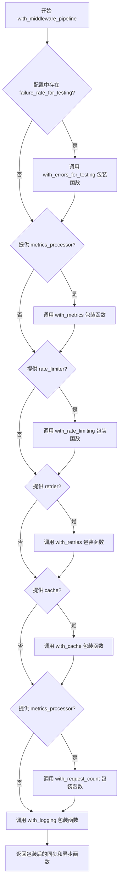

# `graphrag\packages\graphrag-llm\graphrag_llm\middleware\with_middleware_pipeline.py` 详细设计文档

该模块实现了一个中间件管道工厂，通过组合缓存、重试、速率限制、指标收集、错误模拟和日志等中间件，对LLM的同步和异步模型函数进行包装，以提供统一的请求处理流程。

## 整体流程



## 类结构

```
该文件为函数模块，无类定义
└── with_middleware_pipeline (主入口函数)
```

## 全局变量及字段


### `model_config`
    
模型配置对象，包含模型的参数和额外配置选项

类型：`ModelConfig`
    


### `model_fn`
    
同步的模型函数，用于处理聊天或嵌入请求

类型：`LLMFunction`
    


### `async_model_fn`
    
异步的模型函数，用于处理聊天或嵌入请求

类型：`AsyncLLMFunction`
    


### `metrics_processor`
    
指标处理器，用于收集和记录请求指标，可选参数为None时跳过指标中间件

类型：`MetricsProcessor | None`
    


### `cache`
    
缓存实例，用于存储和检索已缓存的响应，可选参数为None时跳过缓存中间件

类型：`Cache | None`
    


### `cache_key_creator`
    
缓存键创建器，用于生成缓存的唯一键

类型：`CacheKeyCreator`
    


### `request_type`
    
请求类型，指定是聊天请求还是嵌入请求

类型：`Literal["chat", "embedding"]`
    


### `tokenizer`
    
分词器，用于对输入进行分词以进行速率限制计算

类型：`Tokenizer`
    


### `rate_limiter`
    
速率限制器，用于控制请求速率，可选参数为None时跳过速率限制中间件

类型：`RateLimiter | None`
    


### `retrier`
    
重试策略，用于处理失败的请求重试，可选参数为None时跳过重试中间件

类型：`Retry | None`
    


### `extra_config`
    
从模型配置中提取的额外配置字典

类型：`dict`
    


### `failure_rate_for_testing`
    
测试用的失败率，用于模拟请求失败以便测试

类型：`float`
    


    

## 全局函数及方法


### `with_middleware_pipeline`

该函数是中间件管道的核心封装函数，它接收模型配置、模型函数（同步和异步）、以及各种可选的中间件处理器（如缓存、指标、速率限制、重试等），并按照特定的顺序将这些中间件层层包装到模型函数上，最终返回包装后的同步和异步模型函数。

参数：

- `model_config`：`ModelConfig`，模型配置对象，包含模型相关参数和额外配置
- `model_fn`：`LLMFunction`，同步模型函数（completion 或 embedding 函数）
- `async_model_fn`：`AsyncLLMFunction`，异步模型函数（completion 或 embedding 函数）
- `metrics_processor`：`MetricsProcessor | None`，指标处理器，用于收集请求和响应指标，若为 None 则跳过指标中间件
- `cache`：`Cache | None`，缓存实例，用于存储和检索已缓存的响应，若为 None 则跳过缓存中间件
- `cache_key_creator`：`CacheKeyCreator`，缓存键创建器，用于生成缓存键
- `request_type`：`Literal["chat", "embedding"]`，请求类型，区分聊天完成请求和嵌入请求
- `tokenizer`：`Tokenizer`，分词器，用于速率限制中的令牌计数
- `rate_limiter`：`RateLimiter | None`，速率限制器，用于限制请求频率，若为 None 则跳过速率限制中间件
- `retrier`：`Retry | None`，重试处理器，用于自动重试失败的请求，若为 None 则跳过重试中间件

返回值：`tuple[LLMFunction, AsyncLLMFunction]`，包装在中间件管道中的同步和异步模型函数元组

#### 流程图

```mermaid
flowchart TD
    A[开始] --> B{failure_rate_for_testing > 0?}
    B -->|是| C[with_errors_for_testing]
    B -->|否| D{metrics_processor 存在?}
    C --> D
    
    D -->|是| E[with_metrics]
    D -->|否| F{rate_limiter 存在?}
    E --> F
    
    F -->|是| G[with_rate_limiting]
    F -->|否| H{retrier 存在?}
    G --> H
    
    H -->|是| I[with_retries]
    H -->|否| J{cache 存在?}
    I --> J
    
    J -->|是| K[with_cache]
    J -->|否| L{metrics_processor 存在?}
    K --> L
    
    L -->|是| M[with_request_count]
    L -->|否| N[with_logging]
    M --> N
    
    N --> O[返回 tuple[model_fn, async_model_fn]]
```

#### 带注释源码

```python
def with_middleware_pipeline(
    *,
    model_config: "ModelConfig",
    model_fn: "LLMFunction",
    async_model_fn: "AsyncLLMFunction",
    metrics_processor: "MetricsProcessor | None",
    cache: "Cache | None",
    cache_key_creator: "CacheKeyCreator",
    request_type: Literal["chat", "embedding"],
    tokenizer: "Tokenizer",
    rate_limiter: "RateLimiter | None",
    retrier: "Retry | None",
) -> tuple[
    "LLMFunction",
    "AsyncLLMFunction",
]:
    """Wrap model functions in middleware pipeline.

    Full Pipeline Order:
        - with_requests_counts: Counts incoming requests and
            successes, and failures that bubble back up.
        - with_cache: Returns cached responses when available
            and caches new successful responses that bubble back up.
        - with_retries: Retries failed requests.
            Since the retry middleware occurs prior to rate limiting,
            all retries get back in line for rate limiting. This is
            to avoid threads that retry rapidly against an endpoint,
            thus increasing the required cooldown.
        - with_rate_limiting: Rate limits requests.
        - with_metrics: Collects metrics about the request and responses.
        - with_errors_for_testing: Raises errors for testing purposes.
            Relies on ModelConfig.failure_rate_for_testing to determine
            the failure rate. 'failure_rate_for_testing' is not an exposed
            configuration option and is only intended for internal testing.

    Args
    ----
        model_config: ModelConfig
            The model configuration.
        model_fn: LLMFunction
            The synchronous model function to wrap.
            Either a completion function or an embedding function.
        async_model_fn: AsyncLLMFunction
            The asynchronous model function to wrap.
            Either a completion function or an embedding function.
        metrics_processor: MetricsProcessor | None
            The metrics processor to use. If None, metrics middleware is skipped.
        cache: Cache | None
            The cache instance to use. If None, caching middleware is skipped.
        cache_key_creator: CacheKeyCreator
            The cache key creator to use.
        request_type: Literal["chat", "embedding"]
            The type of request, either "chat" or "embedding".
            The middleware pipeline is used for both completions and embeddings
            and some of the steps need to know which type of request it is.
        tokenizer: Tokenizer
            The tokenizer to use for rate limiting.
        rate_limiter: RateLimiter | None
            The rate limiter to use. If None, rate limiting middleware is skipped.
        retrier: Retry | None
            The retrier to use. If None, retry middleware is skipped.

    Returns
    -------
        tuple[LLMFunction, AsyncLLMFunction]
            The synchronous and asynchronous model functions wrapped in the middleware pipeline.
    """
    # 从模型配置的额外字段中获取 failure_rate_for_testing 配置
    extra_config = model_config.model_extra or {}
    failure_rate_for_testing = extra_config.get("failure_rate_for_testing", 0.0)

    # 如果设置了测试失败率，则添加错误测试中间件（用于内部测试）
    if failure_rate_for_testing > 0.0:
        model_fn, async_model_fn = with_errors_for_testing(
            sync_middleware=model_fn,
            async_middleware=async_model_fn,
            failure_rate=failure_rate_for_testing,
            exception_type=extra_config.get(
                "failure_rate_for_testing_exception_type", "ValueError"
            ),
            exception_args=extra_config.get("failure_rate_for_testing_exception_args"),
        )

    # 如果提供了指标处理器，则添加指标收集中间件
    if metrics_processor:
        model_fn, async_model_fn = with_metrics(
            model_config=model_config,
            sync_middleware=model_fn,
            async_middleware=async_model_fn,
            metrics_processor=metrics_processor,
        )

    # 如果提供了速率限制器，则添加速率限制中间件
    if rate_limiter:
        model_fn, async_model_fn = with_rate_limiting(
            sync_middleware=model_fn,
            async_middleware=async_model_fn,
            tokenizer=tokenizer,
            rate_limiter=rate_limiter,
        )

    # 如果提供了重试处理器，则添加重试中间件（在速率限制之前执行）
    if retrier:
        model_fn, async_model_fn = with_retries(
            sync_middleware=model_fn,
            async_middleware=async_model_fn,
            retrier=retrier,
        )

    # 如果提供了缓存实例，则添加缓存中间件
    if cache:
        model_fn, async_model_fn = with_cache(
            sync_middleware=model_fn,
            async_middleware=async_model_fn,
            request_type=request_type,
            cache=cache,
            cache_key_creator=cache_key_creator,
        )

    # 如果提供了指标处理器，则添加请求计数中间件
    if metrics_processor:
        model_fn, async_model_fn = with_request_count(
            sync_middleware=model_fn,
            async_middleware=async_model_fn,
        )

    # 最后添加日志记录中间件（始终执行，作为最外层包装）
    model_fn, async_model_fn = with_logging(
        sync_middleware=model_fn,
        async_middleware=async_model_fn,
    )

    # 返回包装后的同步和异步模型函数
    return (model_fn, async_model_fn)
```

## 关键组件


### with_middleware_pipeline

主函数,负责将多个中间件组件按特定顺序包装到LLM模型函数上,形成完整的中间件管道,支持请求计数、缓存、重试、速率限制、指标收集、错误注入和日志记录等功能。

### with_cache

缓存中间件,用于在缓存命中时返回已缓存的响应,并在请求成功后将新响应写入缓存。

### with_retries

重试中间件,在请求失败时自动重试请求,由于重试发生在速率限制之前,所有重试请求都需要重新排队等待速率限制。

### with_rate_limiting

速率限制中间件,使用tokenizer计算请求的token数量,并通过rate_limiter控制请求速率。

### with_metrics

指标收集中间件,收集请求和响应的相关指标数据。

### with_request_count

请求计数中间件,统计传入的请求数量以及成功和失败的响应数量。

### with_errors_for_testing

测试用错误注入中间件,根据配置的错误率随机抛出异常,用于内部测试目的。

### with_logging

日志记录中间件,记录模型函数的调用日志。

### Pipeline Order

中间件的执行顺序为:请求计数 → 缓存 → 重试 → 速率限制 → 指标收集 → 错误注入 → 日志记录。


## 问题及建议


### 已知问题

-   **文档与实现顺序不一致**：代码中的管道顺序与文档描述严重不符。文档描述的顺序是：requests_counts → cache → retries → rate_limiting → metrics → errors_for_testing，但实际实现顺序是：errors_for_testing → metrics → rate_limiting → retries → cache → request_count → logging。这种不一致会导致维护困难和预期行为偏差。
-   **导入缺失问题**：文档中提到的 `with_requests_counts` 组件未被导入和使用，实际代码使用的是 `with_request_count`（单数形式），这表明文档可能未同步更新或存在命名不一致。
-   **缓存与重试顺序问题**：缓存中间件位于重试之后，这意味着如果请求在重试后成功，最终成功的响应不会被缓存（因为缓存层在重试之前执行）。这可能导致重复请求未能利用缓存，从而降低缓存效率。
-   **指标统计不准确**：请求计数（request_count）位于管道末尾，在缓存和重试之后执行，因此无法准确统计原始请求数量，只能统计最终处理后的请求数（包括缓存命中和重试）。
-   **配置值缺乏验证**：从 `model_extra` 字典中提取 `failure_rate_for_testing` 时没有类型或范围验证，如果配置中传入非法值（如负数或大于1的数），可能导致意外行为。
-   **日志位置过晚**：日志中间件被放置在管道的最后，这意味着无法记录请求在中间件管道中各阶段的处理过程，只能记录最终结果，不利于问题排查。

### 优化建议

-   **统一文档与实现**：更新代码注释或文档字符串，使其与实际的中间件执行顺序一致，或者重构代码以匹配文档描述的理想管道顺序。
-   **调整中间件顺序**：根据实际需求重新排列中间件顺序。如果缓存目的是避免重复请求，应该在重试之前应用缓存；如果希望缓存重试后的成功响应，则调整顺序。
-   **添加配置验证**：在提取 `failure_rate_for_testing` 等配置值时，添加范围验证（如 0.0 到 1.0）和类型检查，确保配置的有效性。
-   **改进日志策略**：考虑将日志中间件移至管道开头或添加多个日志点，以便记录请求进入管道时的状态，以及在各关键阶段的处理情况。
-   **统一命名规范**：确认 `with_request_count` vs `with_requests_counts` 的正确命名，并确保所有引用保持一致。
-   **考虑添加中间件组合错误处理**：在中间件链接过程中添加适当的错误处理，以防某个中间件初始化失败导致整个管道构建失败。


## 其它


### 设计目标与约束

**设计目标**：
该模块的核心目标是为LLM（大型语言模型）函数提供一个可插拔的中间件管道，支持功能横切关注点（如缓存、重试、速率限制、指标收集、日志记录、错误模拟等）的解耦与组合，使模型调用层具备可观测性、可控性和可复用性。

**约束**：
- 中间件按照固定顺序执行，后续中间件依赖于前序中间件的执行结果（如缓存中间件需要在重试之前执行以避免重复计费）。
- 所有中间件必须同时支持同步（LLMFunction）和异步（AsyncLLMFunction）两种函数签名。
- 配置通过ModelConfig传递，中间件可根据配置按需启用或跳过（如cache=None时跳过缓存中间件）。

### 错误处理与异常设计

**错误传播机制**：
中间件管道采用嵌套包装模式，外层中间件调用内层中间件，异常沿调用栈向上传播。各中间件负责捕获并处理其职责范围内的异常（如重试中间件捕获临时失败并重试），无法处理的异常向上抛出。

**关键异常场景**：
- **缓存失败**：with_cache中间件在缓存读取/写入失败时应静默降级，允许请求继续执行。
- **速率限制触发**：with_rate_limiting在触发限流时应抛出RateLimitExceeded异常。
- **重试耗尽**：with_retries在重试次数耗尽后应将最终异常向上抛出。
- **测试错误模拟**：with_errors_for_testing根据配置的概率主动抛出异常，用于测试系统的容错能力。

### 数据流与状态机

**数据流向**：
请求从最外层（with_logging）进入管道，依次经过with_request_count、with_metrics、with_rate_limiting、with_retries、with_cache（反向顺序：缓存检查→模型调用→缓存写入），最终到达原始model_fn。响应沿相反方向返回。

**关键状态**：
- **请求计数状态**：with_request_count维护请求计数、成功率、失败率。
- **缓存状态**：with_cache维护缓存命中/未命中状态。
- **重试状态**：with_retries维护当前重试次数。
- **速率限制状态**：with_rate_limiting维护令牌桶或滑动窗口状态。

### 外部依赖与接口契约

**外部依赖**：
- graphrag_llm.middleware.*：各中间件实现模块。
- graphrag_cache.Cache：缓存接口，提供get/set方法。
- graphrag_llm.config.ModelConfig：模型配置，包含model_extra用于传递额外配置（如failure_rate_for_testing）。
- graphrag_llm.rate_limit.RateLimiter：速率限制器接口。
- graphrag_llm.retry.Retry：重试策略接口。
- graphrag_llm.tokenizer.Tokenizer：分词器接口，用于计算token数量以进行速率限制。
- graphrag_llm.metrics.MetricsProcessor：指标处理器接口。

**接口契约**：
- LLMFunction和AsyncLLMFunction必须接受统一的参数签名，适配器模式用于统一不同模型提供商的接口。
- CacheKeyCreator接受请求参数，返回唯一缓存键。
- RateLimiter提供acquire(tokens)方法用于申请令牌。

### 并发与线程安全

**并发考量**：
- 缓存访问：Cache实现需保证线程安全，支持并发读写。
- 速率限制：RateLimiter实现需保证线程安全，通常使用锁或原子操作。
- 指标收集：MetricsProcessor需支持并发写入，推荐使用线程安全的数据结构或异步队列。

### 性能考量

**性能特征**：
- 缓存命中可显著降低延迟（从网络请求降至本地缓存查询）。
- 速率限制引入额外检查开销，但保护下游服务免受过载。
- 重试机制可能增加总体延迟，但在瞬时故障时提高成功率。

### 安全与权限

**安全设计**：
- 缓存键生成需避免敏感信息泄露（如用户输入不应直接作为缓存键的一部分）。
- 速率限制配置需防止恶意用户耗尽资源。

### 配置管理

**配置来源**：
- 主要配置通过ModelConfig传递。
- 额外配置通过model_extra字典传递（如failure_rate_for_testing、failure_rate_for_testing_exception_type等）。
- 中间件实例（cache、rate_limiter、retrier等）通过依赖注入传入，便于单元测试。

### 可测试性设计

**测试策略**：
- with_errors_for_testing中间件支持按概率注入失败，用于测试系统容错能力。
- 中间件解耦设计允许单独测试每个中间件。
- 支持通过传入None跳过可选中间件，简化测试场景。

### 版本兼容性

**兼容性说明**：
- 该模块依赖TYPE_CHECKING进行类型检查，运行时仅依赖实际使用的中间件。
- 缓存键格式需保持稳定，避免缓存失效。

### 部署与环境

**部署考量**：
- 需配置分布式缓存（如Redis）以支持多实例部署场景下的缓存共享。
- 速率限制需考虑分布式环境下的全局限流（如使用Redis实现分布式令牌桶）。


    