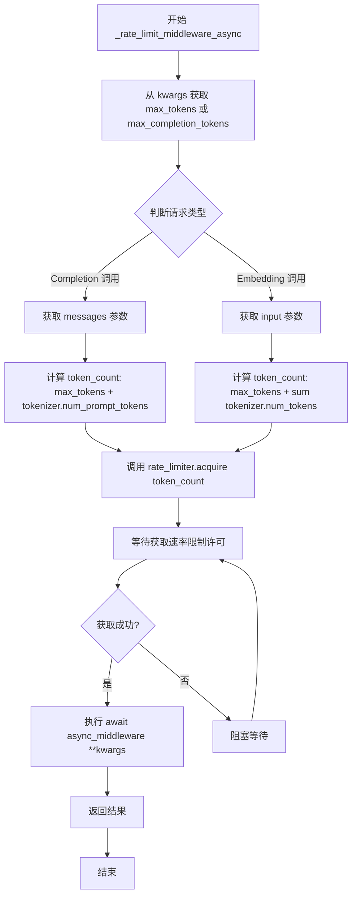
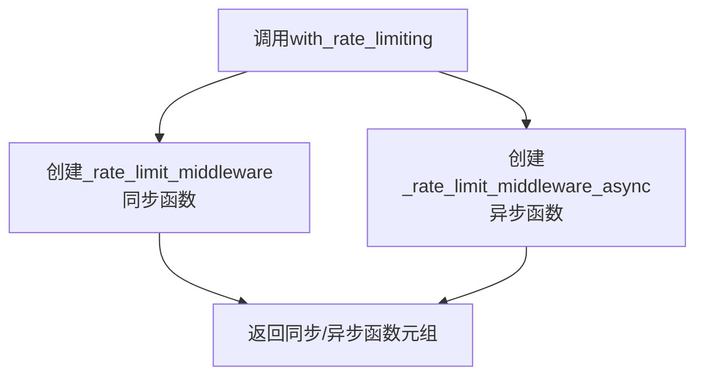

# `graphrag\packages\graphrag-llm\graphrag_llm\middleware\with_rate_limiting.py` 详细设计文档

一个用于 LLM 函数的速率限制中间件，通过包装同步和异步模型函数来强制实施基于令牌计数的速率限制

## 整体流程

```mermaid
graph TD
    A[开始] --> B[调用 with_rate_limiting]
    B --> C[创建同步中间件包装器 _rate_limit_middleware]
    B --> D[创建异步中间件包装器 _rate_limit_middleware_async]
    B --> E[返回元组 (同步函数, 异步函数)]
    C --> F{调用同步包装器}
    D --> G{调用异步包装器}
    F --> H[从 kwargs 获取 max_tokens 或 max_completion_tokens]
    G --> I[从 kwargs 获取 max_tokens 或 max_completion_tokens]
    H --> J{检查 messages 存在?}
    I --> K{检查 messages 存在?}
    J -- 是 --> L[使用 tokenizer 计算 prompt tokens 并累加]
    J -- 否 --> M{检查 input 存在?}
    K -- 是 --> L
    K -- 否 --> N{检查 input 存在?}
    M -- 是 --> O[使用 tokenizer 计算 input tokens 并累加]
    N -- 是 --> O
    L --> P[调用 rate_limiter.acquire(token_count)]
    O --> P
    P --> Q[调用原始中间件函数并返回结果]
    Q --> R[结束]
```

## 类结构

```
rate_limit_middleware.py (函数式模块)
└── with_rate_limiting (主函数)
    ├── _rate_limit_middleware (同步内部函数)
    └── _rate_limit_middleware_async (异步内部函数)
```

## 全局变量及字段


### `with_rate_limiting`
    
全局函数，用于将LLM函数包装上速率限制中间件

类型：`function(sync_middleware: LLMFunction, async_middleware: AsyncLLMFunction, rate_limiter: RateLimiter, tokenizer: Tokenizer) -> tuple[LLMFunction, AsyncLLMFunction]`
    


### `_rate_limit_middleware`
    
内部同步中间件函数，用于在调用同步LLM函数前进行速率限制检查

类型：`function(**kwargs: Any) -> Any`
    


### `_rate_limit_middleware_async`
    
内部异步中间件函数，用于在调用异步LLM函数前进行速率限制检查

类型：`async function(**kwargs: Any) -> Any`
    


### `token_count`
    
局部变量，计算请求需要消耗的令牌数量

类型：`int`
    


### `messages`
    
局部变量，用于completion调用的消息列表

类型：`list | None`
    


### `input`
    
局部变量，用于embedding调用的输入文本列表

类型：`list[str] | None`
    


    

## 全局函数及方法


### `with_rate_limiting`

该函数是一个速率限制中间件包装器，用于将同步和异步的 LLM 函数（如补全函数或嵌入函数）与速率限制功能结合。它通过获取令牌计数（从 `max_tokens` 或 `messages/input` 中提取），使用 `RateLimiter` 控制请求频率，并返回包装后的同步和异步函数元组。

参数：

- `sync_middleware`：`LLMFunction`，要包装的同步模型函数（补全函数或嵌入函数）
- `async_middleware`：`AsyncLLMFunction`，要包装的异步模型函数（补全函数或嵌入函数）
- `rate_limiter`：`RateLimiter`，用于控制请求频率的速率限制器
- `tokenizer`：`Tokenizer`，用于计算令牌数量的分词器

返回值：`tuple[LLMFunction, AsyncLLMFunction]`，包装了速率限制中间件的同步和异步模型函数

#### 流程图

```mermaid
flowchart TD
    A[with_rate_limiting 开始] --> B[接收参数: sync_middleware, async_middleware, rate_limiter, tokenizer]
    B --> C[创建同步中间件 _rate_limit_middleware]
    C --> C1[从 kwargs 获取 token_count: max_tokens 或 max_completion_tokens]
    C1 --> C2{检查 messages 或 input}
    C2 -->|messages| C3[使用 tokenizer 计算 prompt tokens 并累加]
    C2 -->|input| C4[使用 tokenizer 计算每个 text 的 tokens 并累加]
    C2 -->|无| C5[token_count 保持不变]
    C3 --> C6
    C4 --> C6
    C5 --> C6
    C6[使用 rate_limiter.acquire token_count 获取许可]
    C6 --> C7[调用 sync_middleware 执行原始功能]
    C7 --> C8[返回同步函数 _rate_limit_middleware]
    
    B --> D[创建异步中间件 _rate_limit_middleware_async]
    D --> D1[从 kwargs 获取 token_count: max_tokens 或 max_completion_tokens]
    D1 --> D2{检查 messages 或 input}
    D2 -->|messages| D3[使用 tokenizer 计算 prompt tokens 并累加]
    D2 -->|input| D4[使用 tokenizer 计算每个 text 的 tokens 并累加]
    D2 -->|无| D5[token_count 保持不变]
    D3 --> D6
    D4 --> D6
    D5 --> D6
    D6[使用 rate_limiter.acquire token_count 获取许可]
    D6 --> D7[await async_middleware 执行原始功能]
    D7 --> D8[返回异步函数 _rate_limit_middleware_async]
    
    C8 --> E[返回元组 (_rate_limit_middleware, _rate_limit_middleware_async)]
    D8 --> E
```

#### 带注释源码

```python
def with_rate_limiting(
    *,
    sync_middleware: "LLMFunction",
    async_middleware: "AsyncLLMFunction",
    rate_limiter: "RateLimiter",
    tokenizer: "Tokenizer",
) -> tuple[
    "LLMFunction",
    "AsyncLLMFunction",
]:
    """Wrap model functions with rate limit middleware.

    Args
    ----
        sync_middleware: LLMFunction
            The synchronous model function to wrap.
            Either a completion function or an embedding function.
        async_middleware: AsyncLLMFunction
            The asynchronous model function to wrap.
            Either a completion function or an embedding function.
        rate_limiter: RateLimiter
            The rate limiter to use.
        tokenizer: Tokenizer
            The tokenizer to use for counting tokens.

    Returns
    -------
        tuple[LLMFunction, AsyncLLMFunction]
            The synchronous and asynchronous model functions wrapped with rate limit middleware.
    """

    # 定义同步速率限制中间件函数
    def _rate_limit_middleware(
        **kwargs: Any,  # 接收任意关键字参数
    ):
        # 从 kwargs 中提取 token 数量，优先使用 max_tokens，其次是 max_completion_tokens
        token_count = int(
            kwargs.get("max_tokens") or kwargs.get("max_completion_tokens") or 0
        )
        
        # 获取 messages（用于补全调用）或 input（用于嵌入调用）
        messages = kwargs.get("messages")  # completion call
        input: list[str] | None = kwargs.get("input")  # embedding call
        
        # 如果有 messages，计算其 prompt tokens 并累加到 token_count
        if messages:
            token_count += tokenizer.num_prompt_tokens(messages=messages)
        # 如果有 input，计算每个文本的 tokens 并累加
        elif input:
            token_count += sum(tokenizer.num_tokens(text) for text in input)

        # 使用速率限制器获取许可（传入需要占用的 token 数量）
        with rate_limiter.acquire(token_count):
            # 调用原始的同步中间件函数
            return sync_middleware(**kwargs)

    # 定义异步速率限制中间件函数
    async def _rate_limit_middleware_async(
        **kwargs: Any,  # 接收任意关键字参数
    ):
        # 从 kwargs 中提取 token 数量
        token_count = int(
            kwargs.get("max_tokens") or kwargs.get("max_completion_tokens") or 0
        )
        
        # 获取 messages 或 input
        messages = kwargs.get("messages")  # completion call
        input = kwargs.get("input")  # embedding call
        
        # 计算并累加 prompt tokens
        if messages:
            token_count += tokenizer.num_prompt_tokens(messages=messages)
        elif input:
            token_count += sum(tokenizer.num_tokens(text) for text in input)
        
        # 使用速率限制器获取许可
        with rate_limiter.acquire(token_count):
            # 异步调用原始的异步中间件函数
            return await async_middleware(**kwargs)

    # 返回包装后的同步和异步函数元组
    return (_rate_limit_middleware, _rate_limit_middleware_async)  # type: ignore
```


### `_rate_limit_middleware`

这是一个同步速率限制中间件函数，用于在调用 LLM 模型函数前根据请求的 token 数量进行速率限制控制。它通过提取请求参数计算 token 总数，然后使用 rate limiter 获取配额后再执行原始的同步模型函数。

参数：

- `**kwargs`：`Any`，关键字参数，包含以下可选字段：
  - `max_tokens` 或 `max_completion_tokens`：`int`，completion 调用的最大 token 数
  - `messages`：`list`，completion 调用的消息列表
  - `input`：`list[str]`，embedding 调用的输入文本列表

返回值：`Any`，返回同步中间件函数 `sync_middleware` 的执行结果

#### 流程图

```mermaid
flowchart TD
    A[开始] --> B[提取 kwargs 中的 max_tokens 或 max_completion_tokens]
    B --> C[初始化 token_count 为整数值]
    D{kwargs 中是否有 messages?}
    C --> D
    D -->|是| E[使用 tokenizer 计算 messages 的 token 数并累加到 token_count]
    D -->|否| F{kwargs 中是否有 input?}
    E --> G
    F -->|是| H[使用 tokenizer 计算 input 中每个文本的 token 数并求和累加到 token_count]
    F -->|否| G
    H --> G[使用 rate_limiter.acquire(token_count) 获取速率限制配额]
    G --> I[调用 sync_middleware(**kwargs) 执行原始函数]
    I --> J[返回结果]
    
    style A fill:#e1f5fe
    style G fill:#fff3e0
    style J fill:#e8f5e9
```

#### 带注释源码

```python
def _rate_limit_middleware(
    **kwargs: Any,
):
    """同步速率限制中间件函数。
    
    在调用同步 LLM 函数前计算请求的 token 数量，
    通过速率限制器获取配额后执行原始函数。
    
    Args:
        **kwargs: 关键字参数，可包含 max_tokens/max_completion_tokens、
                  messages（completion调用）或 input（embedding调用）
    
    Returns:
        Any: 同步中间件函数的返回结果
    """
    
    # 从 kwargs 中提取 max_tokens 或 max_completion_tokens，默认为 0
    # 使用 int() 确保转换为整数类型
    token_count = int(
        kwargs.get("max_tokens") or kwargs.get("max_completion_tokens") or 0
    )
    
    # 获取 completion 调用的消息列表
    messages = kwargs.get("messages")  # completion call
    
    # 获取 embedding 调用的输入文本列表
    input: list[str] | None = kwargs.get("input")  # embedding call
    
    # 如果有 messages，使用 tokenizer 计算提示词的 token 数量并累加
    if messages:
        token_count += tokenizer.num_prompt_tokens(messages=messages)
    # 否则如果存在 input（embedding 调用），计算所有输入文本的 token 总数
    elif input:
        token_count += sum(tokenizer.num_tokens(text) for text in input)

    # 使用 rate_limiter 获取指定 token 数量的速率限制配额
    # with 语句确保资源正确释放
    with rate_limiter.acquire(token_count):
        # 调用原始的同步 LLM 函数，传递所有参数
        return sync_middleware(**kwargs)
```


### `_rate_limit_middleware_async`

这是一个异步速率限制中间件函数，用于在调用异步 LLM 函数前计算请求的 token 数量，并通过速率限制器获取执行许可，确保不超过配置的速率限制。

参数：

- `**kwargs`：`Any`，关键字参数，包含传递给异步 LLM 函数的参数（如 `max_tokens`、`messages` 或 `input` 等）

返回值：`Any`，异步 LLM 函数的返回结果（类型取决于 `async_middleware` 的实际返回类型）

#### 流程图



#### 带注释源码

```python
async def _rate_limit_middleware_async(
    **kwargs: Any,  # 接收任意关键字参数，包含LLM调用所需的参数
):
    """异步速率限制中间件函数。
    
    该函数在调用实际的异步LLM函数前执行，用于：
    1. 计算请求的token数量
    2. 通过速率限制器获取执行许可
    3. 然后调用被包装的异步LLM函数
    """
    
    # 从kwargs中获取max_tokens或max_completion_tokens，默认为0
    # 这两个参数分别对应不同的LLM API命名习惯
    token_count = int(
        kwargs.get("max_tokens") or kwargs.get("max_completion_tokens") or 0
    )
    
    # 获取messages参数 - 用于completion调用的消息列表
    messages = kwargs.get("messages")  # completion call
    
    # 获取input参数 - 用于embedding调用的文本列表
    input = kwargs.get("input")  # embedding call
    
    # 根据请求类型计算总token数
    if messages:
        # 对于completion请求，加上提示词的token数量
        token_count += tokenizer.num_prompt_tokens(messages=messages)
    elif input:
        # 对于embedding请求，加上所有输入文本的token数量之和
        token_count += sum(tokenizer.num_tokens(text) for text in input)
    
    # 使用速率限制器获取执行许可，传入所需的token数量
    # rate_limiter.acquire 会阻塞直到获取到许可
    with rate_limiter.acquire(token_count):
        # 调用实际的异步LLM函数，传递所有参数
        return await async_middleware(**kwargs)
```

## 关键组件


### 核心功能概述

该代码实现了一个速率限制中间件，通过包装同步和异步的LLM函数（completion和embedding），在调用前计算请求的token数量，并使用RateLimiter进行流量控制，以防止超出API速率限制。

### 文件整体运行流程

1. 导入必要的类型检查模块和依赖
2. 定义`with_rate_limiting`函数作为入口
3. 在`with_rate_limiting`内部创建`_rate_limit_middleware`同步包装函数
4. 在`with_rate_limiting`内部创建`_rate_limit_middleware_async`异步包装函数
5. 两个内部函数分别计算token数量并调用rate_limiter.acquire()获取许可
6. 最后返回同步和异步包装函数元组

### 全局函数详细信息

#### with_rate_limiting

| 属性 | 详情 |
|------|------|
| 函数名 | with_rate_limiting |
| 参数 | sync_middleware: LLMFunction, async_middleware: AsyncLLMFunction, rate_limiter: RateLimiter, tokenizer: Tokenizer |
| 参数类型 | sync_middleware: "LLMFunction", async_middleware: "AsyncLLMFunction", rate_limiter: "RateLimiter", tokenizer: "Tokenizer" |
| 参数描述 | sync_middleware是待包装的同步模型函数，async_middleware是待包装的异步模型函数，rate_limiter是速率限制器，tokenizer用于计算token数量 |
| 返回值类型 | tuple["LLMFunction", "AsyncLLMFunction"] |
| 返回值描述 | 返回包装了速率限制功能的同步和异步模型函数元组 |

**Mermaid流程图:**



**带注释源码:**

```python
def with_rate_limiting(
    *,
    sync_middleware: "LLMFunction",  # 同步LLM函数引用
    async_middleware: "AsyncLLMFunction",  # 异步LLM函数引用
    rate_limiter: "RateLimiter",  # 速率限制器实例
    tokenizer: "Tokenizer",  # 分词器用于计数
) -> tuple[
    "LLMFunction",
    "AsyncLLMFunction",
]:
    """Wrap model functions with rate limit middleware.

    Args
    ----
        sync_middleware: LLMFunction
            The synchronous model function to wrap.
            Either a completion function or an embedding function.
        async_middleware: AsyncLLMFunction
            The asynchronous model function to wrap.
            Either a completion function or an embedding function.
        rate_limiter: RateLimiter
            The rate limiter to use.
        tokenizer: Tokenizer
            The tokenizer to use for counting tokens.

    Returns
    -------
        tuple[LLMFunction, AsyncLLMFunction]
            The synchronous and asynchronous model functions wrapped with rate limit middleware.
    """

    # 内部同步中间件实现
    def _rate_limit_middleware(
        **kwargs: Any,  # 接受任意关键字参数
    ):
        # 从kwargs中提取max_tokens或max_completion_tokens
        token_count = int(
            kwargs.get("max_tokens") or kwargs.get("max_completion_tokens") or 0
        )
        messages = kwargs.get("messages")  # completion调用
        input: list[str] | None = kwargs.get("input")  # embedding调用
        
        # 根据请求类型累加token数量
        if messages:
            token_count += tokenizer.num_prompt_tokens(messages=messages)
        elif input:
            token_count += sum(tokenizer.num_tokens(text) for text in input)

        # 获取速率限制许可后执行原函数
        with rate_limiter.acquire(token_count):
            return sync_middleware(**kwargs)

    # 内部异步中间件实现
    async def _rate_limit_middleware_async(
        **kwargs: Any,
    ):
        token_count = int(
            kwargs.get("max_tokens") or kwargs.get("max_completion_tokens") or 0
        )
        messages = kwargs.get("messages")  # completion call
        input = kwargs.get("input")  # embedding call
        if messages:
            token_count += tokenizer.num_prompt_tokens(messages=messages)
        elif input:
            token_count += sum(tokenizer.num_tokens(text) for text in input)
        
        # 异步获取许可后await执行原函数
        with rate_limiter.acquire(token_count):
            return await async_middleware(**kwargs)

    return (_rate_limit_middleware, _rate_limit_middleware_async)  # type: ignore
```

### 关键组件信息

#### 速率限制中间件包装器

该组件负责将速率限制功能透明地附加到现有的LLM函数上，支持同步和异步两种调用模式。

#### Token计数逻辑

该组件负责在请求发送前计算需要占用的token配额，支持completion（消息列表）和embedding（输入文本列表）两种请求类型的token计算。

#### 上下文管理器集成

该组件使用`with rate_limiter.acquire(token_count)`语法，确保速率限制的获取和释放自动管理，即使发生异常也能正确释放资源。

### 潜在技术债务与优化空间

1. **错误处理缺失**：当tokenizer.num_prompt_tokens或tokenizer.num_tokens抛出异常时，没有适当的错误处理和降级策略

2. **重复代码**：同步和异步中间件函数中存在大量重复的token计数逻辑，可以提取为共享函数

3. **类型安全**：使用`Any`和`# type: ignore`降低了类型安全性，kwargs的动态特性使得编译时检查受限

4. **参数提取方式**：依赖kwargs.get()的fallback逻辑可能在API变化时失效，缺乏对参数结构变化的容错能力

5. **性能考量**：每次调用都重新计算token数量，对于批量请求可以考虑缓存机制

### 其它项目

#### 设计目标与约束

- 目标：在不修改原有LLM函数的情况下透明添加速率限制
- 约束：依赖外部RateLimiter和Tokenizer的具体实现

#### 错误处理与异常设计

- 当前实现没有显式的异常处理逻辑
- 假设tokenizer的num_prompt_tokens和num_tokens方法不会失败
- 假设rate_limiter.acquire()正确处理资源获取失败情况

#### 数据流与状态机

- 数据流：kwargs输入 → token计数 → 速率限制获取 → 调用原函数 → 返回结果
- 状态机：空闲 → 计算token → 等待速率限制许可 → 执行中 → 完成

#### 外部依赖与接口契约

- RateLimiter：需提供acquire(token_count)上下文管理器方法
- Tokenizer：需提供num_prompt_tokens(messages)和num_tokens(text)方法
- LLMFunction/AsyncLLMFunction：接受任意kwargs并返回结果


## 问题及建议


### 已知问题

-   **类型安全问题**：大量使用 `Any` 类型和 `# type: ignore`，降低了代码的类型安全性和可维护性
-   **代码重复**：同步和异步中间件中 token 计算逻辑几乎完全重复，违反 DRY 原则
-   **参数处理不严谨**：当 `messages` 和 `input` 都为 `None` 时没有明确处理逻辑，可能导致意外行为
-   **异步版本类型标注缺失**：`async` 函数中 `input` 变量缺少类型注解，与函数签名中的 `list[str] | None` 不一致
-   **缺少异常处理**：`rate_limiter.acquire()` 调用没有异常捕获和处理机制，可能导致未预期的错误传播
-   **默认值处理可能不合理**：当 `max_tokens` 和 `max_completion_tokens` 都未提供时默认为 0，可能导致速率计算不准确

### 优化建议

-   **提取公共逻辑**：将 token 计算逻辑抽取为独立函数，消除同步/异步版本中的重复代码
-   **增强类型注解**：为所有函数参数和变量添加明确的类型注解，避免使用 `Any` 类型
-   **添加参数验证**：在函数入口处验证 `messages` 和 `input` 的合法性，提供明确的错误信息
-   **完善异常处理**：为 `rate_limiter.acquire()` 添加 try-except 块，处理可能的速率限制异常
-   **统一类型标注**：确保同步和异步版本的参数类型保持一致


## 其它


### 设计目标与约束

本中间件的设计目标是解决LLM API调用中的速率限制问题，确保在不超过API提供商设定的token-per-minute或request-per-minute限制下稳定运行。核心约束包括：(1) 仅支持基于token数量的速率限制，不支持基于请求数量的限制；(2) 要求调用方传入max_tokens或max_completion_tokens参数用于completion调用，或input参数用于embedding调用；(3) 同步版本使用上下文管理器（with语句），异步版本使用await；(4) 依赖外部RateLimiter实现令牌桶或信号量机制。

### 错误处理与异常设计

本模块自身的错误处理较少，主要依赖外部组件。RateLimiter.acquire()方法在无法获取令牌时的行为取决于具体实现（可能阻塞等待或抛出RateLimitException）。参数获取使用kwargs.get()并提供默认值0，避免KeyError但可能导致token_count为0的情况。代码未对以下异常场景进行处理：tokenizer返回None或无效值、rate_limiter为None、messages或input参数格式错误、sync_middleware或async_middleware调用抛出异常。建议在生产环境中添加对tokenizer.num_prompt_tokens()和tokenizer.num_tokens()返回值的校验，以及对middleware调用异常的捕获和重试逻辑。

### 数据流与状态机

同步调用流程：调用方传入kwargs -> 提取max_tokens/max_completion_tokens作为基础token数 -> 检查messages参数存在则累加prompt tokens -> 检查input参数存在则累加embedding tokens -> 调用rate_limiter.acquire(token_count)阻塞等待令牌 -> 调用原始sync_middleware返回结果。异步流程类似，只是使用await async_middleware。状态转换：Idle（初始）-> Calculating（计算token）-> Waiting（等待令牌）-> Executing（执行middleware）-> Done（返回结果）。注意同步版本会阻塞线程，异步版本会阻塞事件循环。

### 外部依赖与接口契约

本模块依赖四个外部组件，接口契约如下：(1) RateLimiter：需提供acquire(token_count)方法，支持同步上下文管理器协议（__enter__/__exit__），在获取令牌成功后返回，失败时阻塞或抛异常；(2) Tokenizer：需提供num_prompt_tokens(messages:list)返回int和num_tokens(text:str)返回int方法；(3) LLMFunction：任意接受**kwargs并返回任意类型的同步函数；(4) AsyncLLMFunction：任意接受**kwargs并返回Awaitable的异步函数。调用方需确保传入有效的messages（list of dict，支持content字段）或input（list of str），以及max_tokens/max_completion_tokens之一。

### 并发与线程安全考量

本模块本身不维护状态，线程安全性完全取决于RateLimiter实现。如果RateLimiter使用线程锁（如threading.Semaphore），则同步版本线程安全；如果使用asyncio.Semaphore，则异步版本在单事件循环内安全。需要注意tokenizer的num_prompt_tokens和num_tokens方法是否线程安全——如果tokenizer内部有状态，可能需要在外部进行同步控制。建议在多线程环境使用thread-safe的RateLimiter，在多协程环境使用asyncio.Lock或asyncio.Semaphore。

### 配置与初始化要求

本模块为工厂函数，使用前需正确初始化RateLimiter和Tokenizer实例。RateLimiter通常需要配置max_tokens_per_minute、max_requests_per_minute等参数；Tokenizer需要加载对应的模型词表。调用方在包装函数时需确保这些依赖已正确初始化，否则运行时可能抛出AttributeError或TypeError。建议提供默认的tokenizer和rate_limiter工厂方法，或使用依赖注入框架管理生命周期。


    