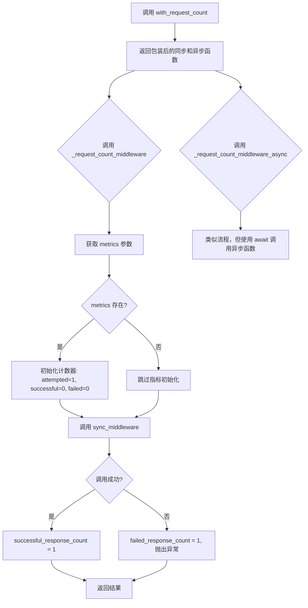
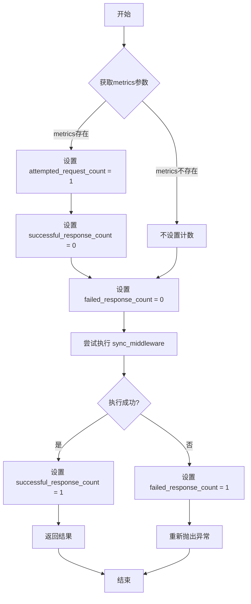
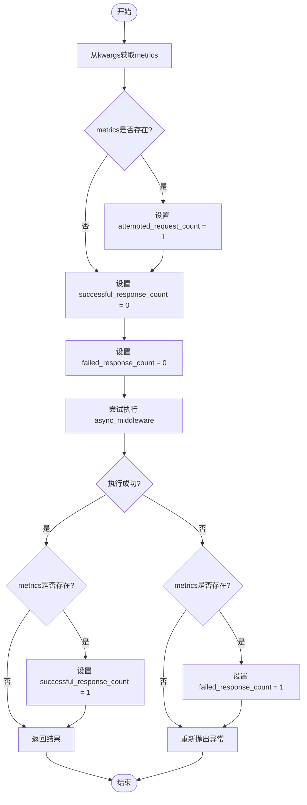

# `graphrag\packages\graphrag-llm\graphrag_llm\middleware\with_request_count.py` 详细设计文档

这是一个请求计数中间件，用于包装LLM（大型语言模型）函数调用，跟踪请求数量、成功响应数量和失败响应数量，并将这些指标记录到metrics字典中。

## 整体流程



## 类结构

```
该文件无类定义，仅包含模块级函数
└── with_request_count (主函数)
    ├── _request_count_middleware (同步中间件)
    └── _request_count_middleware_async (异步中间件)
```

## 全局变量及字段


### `sync_middleware`
    
The synchronous model function to wrap (either a completion function or an embedding function)

类型：`LLMFunction`
    


### `async_middleware`
    
The asynchronous model function to wrap (either a completion function or an embedding function)

类型：`AsyncLLMFunction`
    


### `kwargs`
    
Keyword arguments passed to the middleware functions

类型：`Any`
    


### `metrics`
    
Optional metrics dictionary to track request counts

类型：`Metrics | None`
    


### `result`
    
The result returned from the wrapped middleware function

类型：`Any`
    


    

## 全局函数及方法


### `with_request_count`

这是一个中间件工厂函数，用于包装 LLM 函数（同步和异步版本），添加请求计数功能。它是中间件管道的第一步，统计尝试请求数、成功响应数和失败响应数，并将这些指标记录到 metrics 字典中。

**参数：**

- `sync_middleware`：`LLMFunction`，同步模型函数，可以是补全函数或嵌入函数
- `async_middleware`：`AsyncLLMFunction`，异步模型函数，可以是补全函数或嵌入函数

**返回值：** `tuple[LLMFunction, AsyncLLMFunction]`，包装了请求计数中间件的同步和异步模型函数

#### 流程图

```mermaid
flowchart TD
    A[with_request_count 被调用] --> B[创建同步包装函数 _request_count_middleware]
    B --> C[创建异步包装函数 _request_count_middleware_async]
    C --> D[返回元组 (_request_count_middleware, _request_count_middleware_async)]
    
    E[同步包装函数被调用] --> F{获取 kwargs 中的 metrics}
    F -->|metrics 存在| G[初始化计数器: attempted_request_count=1, successful_response_count=0, failed_response_count=0]
    F -->|metrics 为 None| H[跳过计数器初始化]
    G --> I[调用 sync_middleware(**kwargs)]
    H --> I
    I --> J{调用是否成功}
    J -->|成功| K[设置 successful_response_count=1]
    K --> L[返回结果]
    J -->|失败| M[设置 failed_response_count=1]
    M --> N[重新抛出异常]
    
    O[异步包装函数被调用] --> P{获取 kwargs 中的 metrics}
    P -->|metrics 存在| Q[初始化计数器: attempted_request_count=1, successful_response_count=0, failed_response_count=0]
    P -->|metrics 为 None| R[跳过计数器初始化]
    Q --> S[await async_middleware(**kwargs)]
    R --> S
    S --> T{调用是否成功}
    T -->|成功| U[设置 successful_response_count=1]
    U --> V[返回结果]
    T -->|失败| W[设置 failed_response_count=1]
    W --> X[重新抛出异常]
```

#### 带注释源码

```python
def with_request_count(
    *,
    sync_middleware: "LLMFunction",
    async_middleware: "AsyncLLMFunction",
) -> tuple[
    "LLMFunction",
    "AsyncLLMFunction",
]:
    """Wrap model functions with request count middleware.

    This is the first step in the middleware pipeline.
    It counts how many requests were made, how many succeeded, and how many failed

    Args
    ----
        sync_middleware: LLMFunction
            The synchronous model function to wrap.
            Either a completion function or an embedding function.
        async_middleware: AsyncLLMFunction
            The asynchronous model function to wrap.
            Either a completion function or an embedding function.

    Returns
    -------
        tuple[LLMFunction, AsyncLLMFunction]
            The synchronous and asynchronous model functions wrapped with request count middleware.
    """

    def _request_count_middleware(
        **kwargs: Any,
    ):
        # 从 kwargs 中获取 metrics 字典，用于记录请求计数指标
        metrics: Metrics | None = kwargs.get("metrics")
        
        # 如果提供了 metrics，初始化计数器
        # attempted_request_count: 记录尝试的请求总数
        # successful_response_count: 初始为 0，成功后更新为 1
        # failed_response_count: 初始为 0，失败后更新为 1
        if metrics is not None:
            metrics["attempted_request_count"] = 1
            metrics["successful_response_count"] = 0
            metrics["failed_response_count"] = 0
        
        try:
            # 调用原始的同步中间件函数，传递所有参数
            result = sync_middleware(**kwargs)
            
            # 如果调用成功，更新成功计数
            if metrics is not None:
                metrics["successful_response_count"] = 1
            
            return result  # noqa: TRY300
        except Exception:
            # 如果调用失败，更新失败计数，并重新抛出异常
            # 这样异常可以传播到上层调用者
            if metrics is not None:
                metrics["failed_response_count"] = 1
            raise

    async def _request_count_middleware_async(
        **kwargs: Any,
    ):
        # 从 kwargs 中获取 metrics 字典
        metrics: Metrics | None = kwargs.get("metrics")

        # 初始化异步请求的计数器
        if metrics is not None:
            metrics["attempted_request_count"] = 1
            metrics["successful_response_count"] = 0
            metrics["failed_response_count"] = 0
        
        try:
            # 异步调用原始的异步中间件函数
            result = await async_middleware(**kwargs)
            
            # 成功后更新成功计数
            if metrics is not None:
                metrics["successful_response_count"] = 1
            
            return result  # noqa: TRY300
        except Exception:
            # 失败后更新失败计数，并重新抛出异常
            if metrics is not None:
                metrics["failed_response_count"] = 1
            raise

    # 返回包装后的同步和异步函数元组
    return (_request_count_middleware, _request_count_middleware_async)  # type: ignore
```


### `_request_count_middleware`

这是一个同步中间件函数，用于包装模型函数以统计请求计数。它在`with_request_count`函数内部定义，作为中间件管道的第一步，统计尝试请求数、成功响应数和失败响应数。

参数：

- `**kwargs: Any`，任意关键字参数，包含传递给底层同步中间件的参数和可选的`metrics`字典

返回值：底层`sync_middleware`的返回值类型，记录模型函数的执行结果

#### 流程图



#### 带注释源码

```python
def _request_count_middleware(
    **kwargs: Any,  # 接收任意关键字参数，包括metrics字典
):
    """同步请求计数中间件
    
    在请求开始前初始化计数，
    在请求完成后更新成功/失败计数。
    """
    # 从kwargs中获取metrics字典（如果存在）
    metrics: Metrics | None = kwargs.get("metrics")
    
    # 如果提供了metrics字典，初始化计数器
    if metrics is not None:
        metrics["attempted_request_count"] = 1       # 标记尝试请求数为1
        metrics["successful_response_count"] = 0     # 预先设置为0，等待结果更新
        metrics["failed_response_count"] = 0         # 预先设置为0，等待结果更新
    
    try:
        # 调用底层的同步中间件函数
        result = sync_middleware(**kwargs)
        
        # 如果执行成功，更新成功计数
        if metrics is not None:
            metrics["successful_response_count"] = 1
        
        return result  # 返回底层函数的结果
    except Exception:
        # 如果发生异常，更新失败计数并重新抛出异常
        if metrics is not None:
            metrics["failed_response_count"] = 1
        raise
```


### `_request_count_middleware_async`

这是一个异步中间件函数，用于包装异步模型函数以统计请求计数。它通过捕获关键字参数中的指标对象，记录尝试请求数、成功响应数和失败响应数，并在请求完成后更新相应的指标值。

参数：

- `**kwargs`：`Any`，传递给异步中间件的关键字参数，包含可选的 `metrics` 指标对象

返回值：返回异步中间件的执行结果，类型与被包装的 `async_middleware` 返回类型相同

#### 流程图



#### 带注释源码

```python
async def _request_count_middleware_async(
    **kwargs: Any,  # 关键字参数，包含metrics等配置
):
    """异步请求计数中间件.
    
    包装异步模型函数以跟踪请求计数指标。
    在调用底层异步函数前后更新指标数据。
    """
    # 从关键字参数中获取metrics指标对象
    metrics: Metrics | None = kwargs.get("metrics")
    
    # 如果提供了metrics对象，初始化计数器的初始值
    if metrics is not None:
        # 记录尝试执行的请求数
        metrics["attempted_request_count"] = 1
        # 初始化成功响应计数为0（等待实际结果后更新）
        metrics["successful_response_count"] = 0
        # 初始化失败响应计数为0（等待实际结果后更新）
        metrics["failed_response_count"] = 0
    
    try:
        # 调用异步中间件函数并等待其完成
        result = await async_middleware(**kwargs)
        
        # 如果提供了metrics且请求成功，更新成功计数
        if metrics is not None:
            metrics["successful_response_count"] = 1
        
        # 返回异步函数的结果
        return result  # noqa: TRY300
    except Exception:
        # 如果请求失败且提供了metrics，更新失败计数
        if metrics is not None:
            metrics["failed_response_count"] = 1
        
        # 重新抛出异常以保持调用栈
        raise
```

## 关键组件


### with_request_count 函数

主入口函数，用于包装同步和异步的LLM函数，添加请求计数功能。该函数接收sync_middleware和async_middleware两个参数，返回包装后的同步和异步中间件函数元组。

### _request_count_middleware 同步中间件

同步版本的请求计数中间件实现。通过kwargs获取metrics字典，在调用底层同步函数前后分别记录attempted_request_count、successful_response_count和failed_response_count指标，实现请求成功和失败的计数追踪。

### _request_count_middleware_async 异步中间件

异步版本的请求计数中间件实现。与同步版本逻辑相同，但使用await调用底层的async_middleware，实现异步场景下的请求计数功能。

### Metrics 指标字典

用于存储请求计数信息的数据结构，包含三个关键指标：attempted_request_count（尝试请求数）、successful_response_count（成功响应数）、failed_response_count（失败响应数）。通过kwargs传递，由调用方初始化和消费。

### 请求计数逻辑

通过try-except块捕获异常来区分成功和失败的请求。在同步和异步中间件中都实现了相同逻辑：调用前设置attempted_request_count为1且success和failed为0，成功后设置successful_response_count为1，捕获异常时设置failed_response_count为1并重新抛出异常。


## 问题及建议


### 已知问题

- **魔法字符串硬编码**：指标键（如 `"attempted_request_count"`、`"successful_response_count"`、`"failed_response_count"`）作为字符串字面量硬编码，容易产生拼写错误且无法被 IDE 自动重构
- **类型安全缺失**：内部中间件函数使用 `**kwargs: Any` 传递参数，导致调用方失去静态类型检查和代码补全能力
- **类型注解不完整**：返回值使用 `# type: ignore` 抑制类型检查错误，表明类型系统无法正确推断返回类型
- **异常处理过于宽泛**：`except Exception` 捕获所有异常，可能隐藏特定类型的错误，且 `# noqa: TRY300` 表明使用了不推荐的异常处理模式
- **指标修改无并发保护**：在异步环境中直接修改共享的 metrics 字典存在竞态条件风险
- **空值处理不明确**：当 `metrics` 为 `None` 时，中间件静默执行但不记录任何数据，调用方无法得知指标未被记录
- **内部函数无文档**：`_request_count_middleware` 和 `_request_count_middleware_async` 缺少 docstring，影响代码可维护性

### 优化建议

- **提取常量**：定义 `MetricKeys` 命名常量类或枚举，统一管理指标键字符串
- **改进类型注解**：使用泛型或具体类型替代 `Any`，考虑为 kwargs 定义 Protocol 或 TypedDict
- **精确异常捕获**：根据业务需求捕获特定异常类型，避免捕获 `Exception`
- **并发安全**：在异步版本中使用 `asyncio.Lock` 或在指标更新时考虑线程安全的数据结构
- **显式空值处理**：在 metrics 为 None 时记录警告日志或抛出明确异常，而非静默忽略
- **完善文档**：为内部函数添加 docstring，说明参数、返回值和可能抛出的异常
- **类型校验**：使用 `typing.TypeGuard` 或运行时校验确保输入的 middleware 参数是可调用对象

## 其它


### 设计目标与约束

该中间件是middleware管道的第一步，核心目标是对LLM调用进行请求计数统计，记录attempted_request_count（尝试请求数）、successful_response_count（成功响应数）和failed_response_count（失败响应数）三个指标。约束：仅在kwargs中传入metrics字典时才进行计数，若无metrics参数则不执行任何计数操作。

### 错误处理与异常设计

同步和异步中间件均采用try-except结构捕获所有Exception。异常发生时将failed_response_count置为1后重新抛出异常，确保异常能够正常向上传播。成功时在try块末尾将successful_response_count置为1，确保计数逻辑不会因正常返回而遗漏。

### 数据流与状态机

数据流为：接收kwargs → 提取metrics → 初始化计数（attempted=1, successful=0, failed=0） → 调用下游middleware → 根据结果更新successful或failed计数 → 返回结果。状态机包含三个状态：初始状态（计数初始化）、成功状态（successful_response_count=1）、失败状态（failed_response_count=1）。

### 外部依赖与接口契约

依赖graphrag_llm.types中的AsyncLLMFunction、LLMFunction和Metrics类型。输入契约：kwargs必须包含可选的metrics字典字段，metrics类型为dict或其他映射类型。输出契约：返回tuple[LLMFunction, AsyncLLMFunction]，包含包装后的同步和异步函数。

### 性能考虑

每次调用都会进行字典键值检查（kwargs.get("metrics")），无metrics时仅做一次空值检查开销较小。计数操作仅为字典赋值，性能开销可忽略。异步版本使用await保持非阻塞特性。

### 并发安全性

metrics字典的读写操作非原子性，在多线程/多协程并发环境下可能存在竞态条件。设计假设metrics由调用方管理生命周期，middleware仅负责读写而不负责同步。若需要严格线程安全，需在metrics操作时加锁。

### 配置说明

无需额外配置。metrics字典的初始化和传递由上层调用方负责，中间件自动检测并处理metrics存在与否的两种情况。

### 使用示例

该函数通常作为第一个middleware被pipeline调用，与其他middleware（如重试、缓存、日志等）组合使用。返回的同步和异步函数可继续作为下一个middleware的输入，形成middleware链。

### 限制和注意事项

1. metrics字典需要调用方提前创建并传入
2. 只能统计基本的请求/成功/失败数量，无法区分不同类型的错误
3. 在异常情况下successful_response_count保持为0，failed_response_count为1
4. 使用 noqa: TRY300 注释表明有意在middleware中捕获并重新抛出异常
5. 使用 type: ignore 忽略类型推断问题（因tuple返回类型包含函数）
    