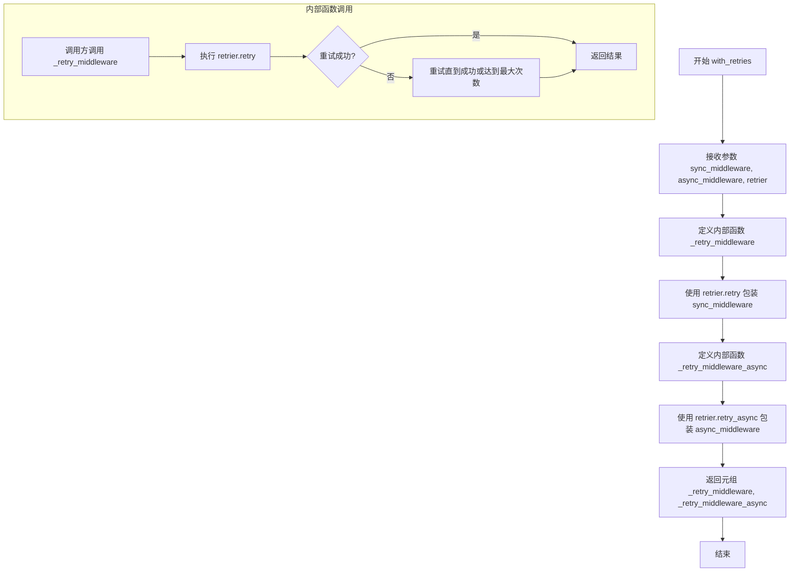
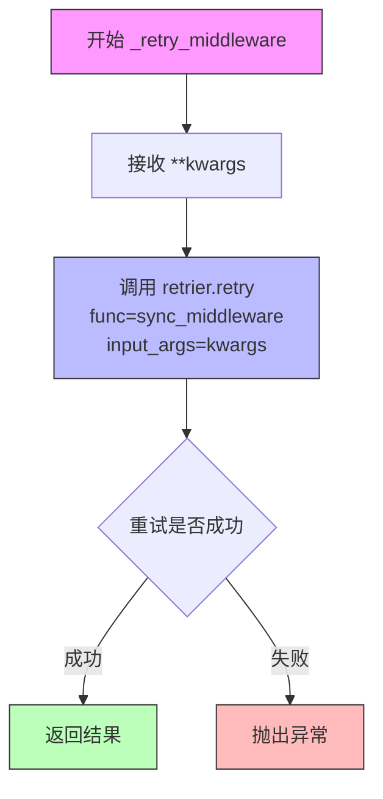
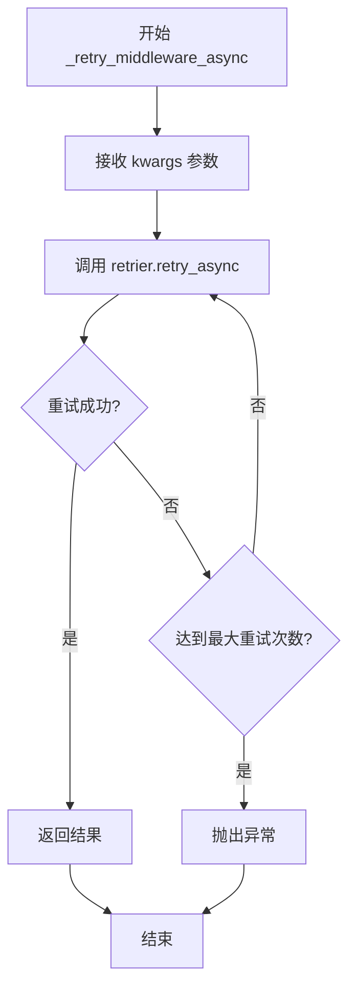

# `graphrag\packages\graphrag-llm\graphrag_llm\middleware\with_retries.py` 详细设计文档

一个重试中间件模块，通过包装同步和异步的LLM函数（同步中间件和异步中间件）并使用Retry实例实现重试逻辑，为模型调用提供容错能力。

## 整体流程

```mermaid
graph TD
    A[开始] --> B[调用 with_retries 函数]
    B --> C[定义同步重试中间件 _retry_middleware]
    B --> D[定义异步重试中间件 _retry_middleware_async]
    C --> E[返回 (同步函数, 异步函数) 元组]
    D --> E
    E --> F{调用者发起请求}
    F --> G{选择调用路径}
    G -- 同步调用 --> H[_retry_middleware 被调用]
    G -- 异步调用 --> I[_retry_middleware_async 被调用]
    H --> J[调用 retrier.retry]
    I --> K[调用 retrier.retry_async]
    J --> L{重试成功?}
    K --> L
    L -- 是 --> M[返回结果]
    L -- 否 --> N[重试直到成功或耗尽重试次数]
    N --> L
```

## 类结构

```
无类定义 - 纯函数式模块
主要包含: with_retries (顶层函数)
嵌套函数: _retry_middleware, _retry_middleware_async
```

## 全局变量及字段


### `sync_middleware`
    
要包装的同步LLM函数

类型：`LLMFunction`
    


### `async_middleware`
    
要包装的异步LLM函数

类型：`AsyncLLMFunction`
    


### `retrier`
    
用于重试逻辑的Retrier实例

类型：`Retry`
    


### `kwargs`
    
传递给底层函数的关键字参数

类型：`Any`
    


### `func`
    
要执行的函数引用

类型：`Callable`
    


### `input_args`
    
函数的输入参数字典

类型：`Dict`
    


    

## 全局函数及方法


### `with_retries`

该函数是一个高阶函数，用于将重试逻辑包装到同步和异步的 LLM 函数（如下游 API 调用）中。它接收同步中间件、异步中间件和重试器实例作为参数，内部创建两个包装函数，分别通过重试器对同步和异步中间件进行包装，最终返回包含这两个包装函数的元组。

参数：

- `sync_middleware`：`LLMFunction`，同步模型函数，可以是 completion 函数或 embedding 函数
- `async_middleware`：`AsyncLLMFunction`，异步模型函数，可以是 completion 函数或 embedding 函数
- `retrier`：`Retry`，用于重试失败请求的重试器实例

返回值：`tuple[LLMFunction, AsyncLLMFunction]`，包含包装了重试逻辑的同步和异步模型函数元组

#### 流程图



#### 带注释源码

```python
# 导入类型检查模块
from typing import TYPE_CHECKING, Any

# 仅在类型检查时导入，避免运行时循环依赖
if TYPE_CHECKING:
    from graphrag_llm.retry import Retry
    from graphrag_llm.types import (
        AsyncLLMFunction,
        LLMFunction,
    )


def with_retries(
    *,
    sync_middleware: "LLMFunction",
    async_middleware: "AsyncLLMFunction",
    retrier: "Retry",
) -> tuple[
    "LLMFunction",
    "AsyncLLMFunction",
]:
    """Wrap model functions with retry middleware.
    
    该函数将重试逻辑包装到同步和异步的 LLM 函数中。
    当底层函数调用失败时，重试器会根据其配置策略自动重试。

    Args
    ----
        sync_middleware: LLMFunction
            要包装的同步模型函数，可以是 completion 函数或 embedding 函数
        async_middleware: AsyncLLMFunction
            要包装的异步模型函数，可以是 completion 函数或 embedding 函数
        retrier: Retry
            用于重试失败请求的重试器实例

    Returns
    -------
        tuple[LLMFunction, AsyncLLMFunction]
            包装了重试中间件的同步和异步模型函数元组
    """

    # 定义同步重试中间件包装函数
    def _retry_middleware(
        **kwargs: Any,  # 接收任意关键字参数
    ):
        # 使用重试器的 retry 方法包装同步中间件
        # input_args 传递所有关键字参数给底层函数
        return retrier.retry(
            func=sync_middleware,
            input_args=kwargs,
        )

    # 定义异步重试中间件包装函数
    async def _retry_middleware_async(
        **kwargs: Any,  # 接收任意关键字参数
    ):
        # 使用重试器的 retry_async 方法包装异步中间件
        # input_args 传递所有关键字参数给底层函数
        return await retrier.retry_async(
            func=async_middleware,
            input_args=kwargs,
        )

    # 返回包装后的同步和异步函数元组
    return (_retry_middleware, _retry_middleware_async)  # type: ignore
```


### `_retry_middleware`

这是一个嵌套的同步重试中间件函数，用于在调用同步 LLM 函数时添加重试机制。它接收任意关键字参数，将其传递给 `retrier.retry` 方法来执行具有重试逻辑的同步函数调用。

参数：

- `**kwargs`：`Any`，任意关键字参数，这些参数将被传递给被包装的同步中间件函数（sync_middleware）

返回值：取决于 `retrier.retry` 的返回类型，通常是同步中间件函数的执行结果，重试成功后的返回值

#### 流程图



#### 带注释源码

```python
def _retry_middleware(
    **kwargs: Any,  # 接收任意关键字参数，这些参数将被传递给原始的同步 LLM 函数
):
    """同步重试中间件包装器。
    
    该函数是一个嵌套函数，用于包装同步的 LLM 函数（如同步完成函数或嵌入函数），
    为其添加重试机制。
    
    参数:
        **kwargs: 传递给同步中间件函数的任意关键字参数
        
    返回:
        重试成功后的同步中间件函数执行结果
    """
    # 调用 retrier.retry 方法执行重试逻辑
    # - func: 要执行的同步函数
    # - input_args: 传递给函数的参数字典
    return retrier.retry(
        func=sync_middleware,  # 要重试执行的同步 LLM 函数
        input_args=kwargs,    # 将 kwargs 转换为字典形式传递
    )
```


### `_retry_middleware_async`

这是一个嵌套在 `with_retries` 函数内部的异步中间件函数，用于包装异步 LLM 函数（如异步补全函数或异步嵌入函数），通过调用 `retrier.retry_async` 实现自动重试逻辑。

参数：

- `**kwargs`：`Any`，任意关键字参数，这些参数会被传递给被包装的异步模型函数（`async_middleware`）

返回值：`Any`，返回异步模型函数调用（经过重试逻辑后）的结果

#### 流程图



#### 带注释源码

```python
async def _retry_middleware_async(
    **kwargs: Any,  # 接收任意关键字参数，传递给底层的异步模型函数
):
    """异步重试中间件
    
    该函数是 with_retries 返回的元组中的异步部分，
    用于包装异步 LLM 函数并提供重试能力。
    
    Args:
        **kwargs: 任意关键字参数，将被传递给 async_middleware
        
    Returns:
        Any: 异步模型函数的返回值，经过重试逻辑处理
    """
    return await retrier.retry_async(
        func=async_middleware,  # 要调用的异步模型函数
        input_args=kwargs,       # 传递给模型函数的参数
    )
```

## 关键组件


### with_retries 函数

核心重试中间件包装函数，用于为同步和异步LLM函数添加重试能力，接受模型函数和重试器实例，返回包装后的同步和异步函数元组。

### _retry_middleware 内部函数

同步重试中间件实现，通过retrier.retry方法包装同步模型函数，将任意关键字参数传递给底层同步函数并实现重试逻辑。

### _retry_middleware_async 内部函数

异步重试中间件实现，通过retrier.retry_async方法包装异步模型函数，将任意关键字参数传递给底层异步函数并实现异步重试逻辑。

### sync_middleware 参数

类型: LLMFunction

同步模型函数，可以是completion函数或embedding函数，作为底层实际执行的同步LLM调用。

### async_middleware 参数

类型: AsyncLLMFunction

异步模型函数，可以是completion函数或embedding函数，作为底层实际执行的异步LLM调用。

### retrier 参数

类型: Retry

重试器实例，负责实现具体的重试策略和逻辑，包括重试次数、退避策略等。

### 返回值

类型: tuple[LLMFunction, AsyncLLMFunction]

包含包装后的同步和异步模型函数元组，两者都已集成重试功能。


## 问题及建议


### 已知问题

- **类型安全缺失**：使用 `# type: ignore` 忽略类型检查，且大量使用 `Any` 类型，降低了代码的类型安全性和可维护性。
- **错误处理不完善**：没有显式的异常处理逻辑，重试失败后的错误传播机制不明确，调用方难以精准捕获和处理特定错误。
- **日志和监控缺失**：代码中没有任何日志记录，无法追踪重试次数、失败原因和重试成功与否，不利于生产环境的问题排查。
- **参数验证缺失**：`**kwargs: Any` 接收任意参数但没有任何验证逻辑，可能导致传递给底层函数无效参数而难以定位问题。
- **依赖声明方式风险**：在 `TYPE_CHECKING` 块中导入类型，运行时不进行实际导入，若导入路径错误将在运行时才暴露问题。
- **设计灵活性不足**：不支持自定义重试条件（如只对特定错误类型重试）、重试回调、预检查函数等高级功能。
- **文档注释不完整**：虽然有 docstring，但缺少返回值可能抛出的异常、错误码等重要信息。

### 优化建议

- **完善类型标注**：为 kwargs 定义具体的类型约束（如 TypedDict 或 Protocol），移除 `# type: ignore`，提升类型安全。
- **增强错误处理**：添加显式的异常捕获和重试耗尽的自定义异常，提供错误上下文（重试次数、最后错误等）。
- **集成日志记录**：在重试前后记录日志，包括重试次数、延迟时间、错误类型等信息。
- **添加参数验证**：在进入重试逻辑前验证必要参数，提供明确的参数错误提示。
- **扩展配置能力**：支持传入自定义重试条件函数、回调函数、最大重试次数覆盖等配置。
- **优化导入方式**：考虑在运行时也进行类型导入的可用性检查，或使用动态导入提高鲁棒性。
- **补充文档**：完善异常文档、返回值说明、错误码定义等，提升 API 的可用性。

## 其它


### 设计目标与约束

该模块的设计目标是提供一个可复用的重试中间件，用于包装LLM函数（同步和异步），使其具备自动重试失败请求的能力。核心约束包括：1) 必须保持原始函数的签名兼容性；2) 重试逻辑由外部`Retry`实例控制；3) 同步和异步函数必须成对返回。

### 错误处理与异常设计

该模块本身不处理具体业务异常，异常处理委托给`Retry`类。重试过程中的所有异常（如网络超时、API限流等）都由`retrier.retry()`或`retrier.retry_async()`捕获并根据配置策略决定是否重试。模块返回的包装函数会直接传播`Retry`类抛出的最终异常。

### 数据流与状态机

数据流：调用方传入`sync_middleware`和`async_middleware`以及`retrier` → `with_retries`创建闭包`_retry_middleware`和`_retry_middleware_async` → 返回元组。调用时：调用方调用`_retry_middleware(**kwargs)` → 内部调用`retrier.retry(func=sync_middleware, input_args=kwargs)` → `Retry`类执行重试逻辑 → 返回最终结果或抛出异常。

### 外部依赖与接口契约

外部依赖：
- `graphrag_llm.retry.Retry`：重试策略执行类
- `graphrag_llm.types.LLMFunction`：同步LLM函数类型
- `graphrag_llm.types.AsyncLLMFunction`：异步LLM函数类型

接口契约：
- `sync_middleware`和`async_middleware`：必须是对应的同步/异步函数，接受任意关键字参数
- `retrier`：必须是`Retry`实例，具有`retry`和`retry_async`方法
- 返回值：始终返回元组`(LLMFunction, AsyncLLMFunction)`

### 性能考虑

该模块的性能开销主要来自：1) 闭包创建的开销（可忽略）；2) 重试机制带来的额外网络调用开销。设计时应确保重试策略合理配置，避免不必要的重试。

### 线程安全性

该模块本身是函数工厂，每次调用`with_retries`创建新的闭包实例，不共享状态。线程安全性取决于`Retry`类本身的实现和被包装的函数是否线程安全。

### 兼容性考虑

该代码使用Python 3.9+的类型注解（`tuple[`语法）。由于使用了`TYPE_CHECKING`进行类型检查，避免了运行时循环导入。返回值使用`# type: ignore`抑制mypy类型检查警告，因为返回的函数签名使用`**kwargs`导致类型推断不精确。

### 使用示例

```python
from graphrag_llm.retry import Retry
from graphrag_llm.types import LLMFunction, AsyncLLMFunction

# 假设已有原始函数
def my_sync_func(prompt: str, **kwargs): ...
async def my_async_func(prompt: str, **kwargs): ...

# 创建重试器
retrier = Retry(max_attempts=3, backoff_factor=2)

# 包装函数
sync_wrapped, async_wrapped = with_retries(
    sync_middleware=my_sync_func,
    async_middleware=my_async_func,
    retrier=retrier
)

# 使用包装后的函数
result = sync_wrapped(prompt="Hello")
```

    