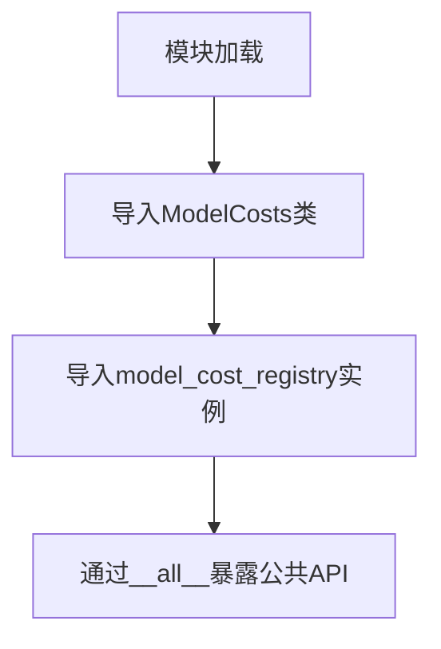
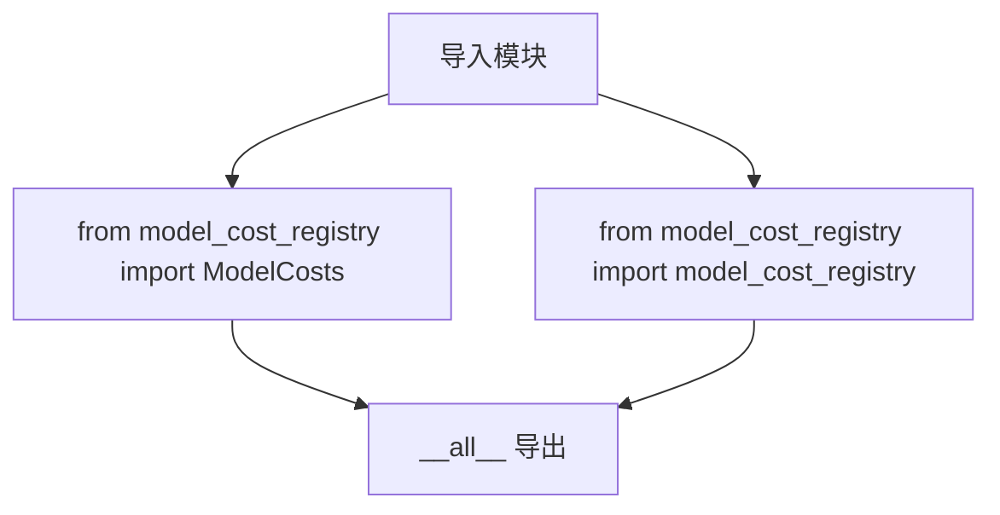

# `graphrag\packages\graphrag-llm\graphrag_llm\model_cost_registry\__init__.py` 详细设计文档

模型成本注册表模块的公共接口导出模块，通过统一的方式暴露ModelCosts类和model_cost_registry实例，供其他模块查询和管理不同大语言模型的调用成本。

## 整体流程



## 类结构

```
模块级导出
├── ModelCosts (类 - 从子模块导入)
└── model_cost_registry (实例 - 从子模块导入)
```

## 全局变量及字段


### `ModelCosts`
    
模型成本数据类，用于存储和管理各模型的成本信息

类型：`class`
    


### `model_cost_registry`
    
模型成本注册表实例，包含各模型名称到成本的映射关系

类型：`dict/Registry`
    


### `ModelCosts.ModelCosts`
    
模型成本数据类，具体字段需查看 model_cost_registry.py 源码

类型：`class`
    


### `N/A.model_cost_registry`
    
全局模型成本注册表实例，具体字段结构需查看 model_cost_registry.py 源码

类型：`dict/Registry`
    
    

## 全局函数及方法


# 分析结果

根据提供的代码，这是一个**模块导出文件**，仅包含重新导出（re-export）逻辑。代码中并未定义 `ModelCosts` 类的具体实现，而是从 `graphrag_llm.model_cost_registry.model_cost_registry` 模块导入并重新导出。

---

### `ModelCosts`

**描述**

由于提供的代码仅为导出模块（`__init__.py`），未包含 `ModelCosts` 类的具体实现细节。`ModelCosts` 类的实际定义位于 `graphrag_llm.model_cost_registry.model_cost_registry` 模块中。

**注意**: 当前提供的代码片段不包含 `ModelCosts` 类的字段和方法定义。

#### 流程图



#### 带注释源码

```python
# Copyright (c) 2024 Microsoft Corporation.
# Licensed under the MIT License

"""Model cost registry module."""

# 从子模块导入 ModelCosts 类和 model_cost_registry 实例
from graphrag_llm.model_cost_registry.model_cost_registry import (
    ModelCosts,
    model_cost_registry,
)

# 定义公开API接口
__all__ = ["ModelCosts", "model_cost_registry"]
```

---

## 补充说明

### 潜在问题

1. **信息不完整**: 当前提供的代码仅为模块入口文件（`__init__.py`），未包含 `ModelCosts` 类的实际定义和实现源码。
2. **缺少详细设计**: 无法提取类的字段、方法、流程图等详细信息。

### 建议

要获取 `ModelCosts` 类的完整设计文档，需要查看 `graphrag_llm/model_cost_registry/model_cost_registry.py` 源文件的内容。该文件应该包含：
- `ModelCosts` 类的定义
- 类字段（属性）
- 类方法
- `model_cost_registry` 全局变量/实例

## 关键组件


### 一段话描述

该模块是模型成本注册表模块的公共接口层，通过重新导出 `ModelCosts` 类和 `model_cost_registry` 实例，为外部调用者提供统一的访问入口，用于管理和查询不同模型的推理成本信息。

### 文件的整体运行流程

该模块作为一个简单的重新导出（reexport）模块，不包含任何业务逻辑执行流程。其主要作用是在包初始化时，将底层实现模块 `graphrag_llm.model_cost_registry.model_cost_registry` 中的公开接口暴露给上层调用者。导入时，Python 会首先执行该模块的导入语句，将 `ModelCosts` 和 `model_cost_registry` 加载到当前模块的命名空间中，并通过 `__all__` 定义公开的 API 集合。

### 类的详细信息

由于该代码文件仅包含导入和重新导出语句，未定义任何类或全局函数。实际的 `ModelCosts` 类和 `model_cost_registry` 对象定义在 `graphrag_llm.model_cost_registry.model_cost_registry` 模块中，该模块未在当前代码中展示。

### 关键组件信息

#### ModelCosts

模型成本数据类或配置类，用于存储和管理不同模型的推理成本信息，可能包含模型名称、输入成本、输出成本、批次大小等属性。

#### model_cost_registry

模型成本注册表实例，用于注册和查询已配置模型的成本信息，提供模型成本的添加、检索和计算功能。

### 潜在的技术债务或优化空间

1. **缺少直接文档**：当前模块仅有简单的文档字符串，未提供详细的使用说明和示例代码
2. **隐式依赖**：该模块对 `graphrag_llm.model_cost_registry.model_cost_registry` 存在强耦合，若底层实现变化，当前模块可能需要同步更新
3. **无版本控制**：缺少对模型成本数据版本的管理机制，无法追踪成本信息的变更历史

### 其它项目

#### 设计目标与约束

- **设计目标**：提供统一的模型成本管理接口，支持多模型的成本追踪和计算
- **约束**：必须与 `graphrag_llm.model_cost_registry.model_cost_registry` 模块保持接口兼容

#### 错误处理与异常设计

由于该模块仅为导入重导出模块，不涉及实际业务逻辑，错误处理依赖于底层实现模块。通常可能的异常包括导入失败（底层模块不存在）或属性访问错误（底层模块未导出预期接口）。

#### 数据流与状态机

该模块不涉及数据流处理或状态管理，仅作为接口透传层。

#### 外部依赖与接口契约

- **外部依赖**：`graphrag_llm.model_cost_registry.model_cost_registry` 模块
- **接口契约**：外部调用者可通过 `from graphrag_llm.model_cost_registry import ModelCosts, model_cost_registry` 导入使用


## 问题及建议


### 已知问题

-   **代码功能单一，无实际逻辑**：该模块仅作为重新导出（reexport）层，直接从 `graphrag_llm.model_cost_registry.model_cost_cost_registry` 导入并导出 `ModelCosts` 和 `model_cost_registry`，未添加任何额外的功能、验证或转换，存在过度抽象的可能。
-   **缺乏模块级文档说明**：仅有模块级 docstring "Model cost registry module."，缺少对 `ModelCosts` 和 `model_cost_registry` 实际用途、使用场景以及二者关系的说明。
-   **无类型提示暴露**：未在该模块层暴露类型注解（Type Hints），调用方无法直接从此模块获取类型信息，可能需要额外导入增加了使用复杂度。
-   **API 稳定性依赖**：该模块的设计目的可能是为了提供稳定的公共 API，但如果内部模块路径或名称发生变化，此文件仍需同步更新，未能完全解耦。

### 优化建议

-   **增加详细文档**：为 `ModelCosts` 类和 `model_cost_registry` 添加详细的使用说明、参数说明和示例，提高模块可维护性和可读性。
-   **重新评估架构价值**：如果该模块仅为简单的重导出，建议评估是否可以直接使用内部模块路径，或在此模块中添加额外的功能（如默认值处理、配置校验等）以提供实际价值。
-   **添加类型注解**：在 `__all__` 之外，考虑使用 `typing` 模块暴露类型信息，例如 `ModelCostsType = ModelCosts`，方便调用方进行类型检查。
-   **考虑版本与版权维护**：版权年份固定为 2024，建议添加动态年份或定期更新；如该模块为公共 API，考虑添加版本号或变更日志。

## 其它


### 设计目标与约束

本模块的设计目标是为LLM模型成本计算提供一个统一的注册表机制，使得不同模型的token成本能够被集中管理和查询。约束方面，该模块依赖于 `graphrag_llm.model_cost_registry.model_cost_registry` 模块，需要确保该模块正确安装和导入。

### 错误处理与异常设计

本模块作为简单的重导出（re-export）模块，不涉及直接的错误处理逻辑。潜在的错误主要包括导入错误（ImportError），即当底层模块 `model_cost_registry` 不存在或版本不兼容时会导致导入失败。建议在项目初始化时进行依赖检查，确保 `graphrag_llm` 包正确安装。

### 外部依赖与接口契约

本模块的外部依赖为 `graphrag_llm.model_cost_registry.model_cost_registry` 包，需要确保该包的版本兼容性。接口契约包括：`ModelCosts` 应为模型成本数据类或类型定义，`model_cost_registry` 应为模型成本注册表实例，两者均需要符合预期的API规范（如查询方法、添加方法等）。

### 版本兼容性

本模块声明了MIT许可证，版权归属Microsoft Corporation。版本兼容性取决于底层 `graphrag_llm` 包的版本，建议与 `graphrag_llm` 0.1.0及以上版本配合使用。

### 性能考虑

作为轻量级的重导出模块，该代码本身不涉及性能问题。性能主要取决于底层 `model_cost_registry` 的实现，建议底层实现使用高效的数据结构（如字典）进行模型成本的存储和查询。

### 安全考虑

本模块不涉及敏感数据处理或用户输入，建议确保底层模块的模型成本数据来源可靠，避免注入恶意的成本数据。

### 测试策略

建议针对导入功能进行测试，验证 `ModelCosts` 和 `model_cost_registry` 能够正确导入。同时建议测试底层模块的功能，包括模型成本的注册、查询、更新等操作。

### 部署考虑

本模块作为 `graphrag_llm` 包的一部分进行部署，建议通过包管理工具（如pip）进行安装部署，确保依赖关系正确解析。

    