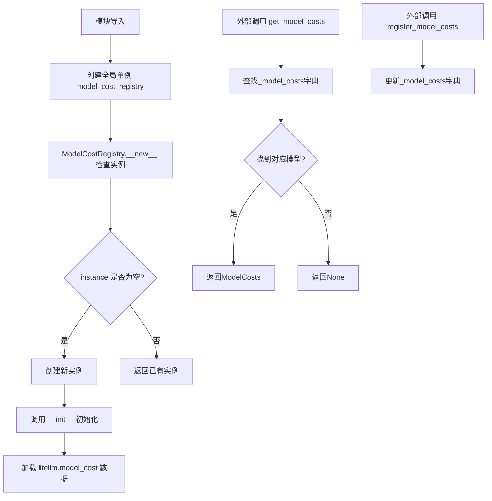
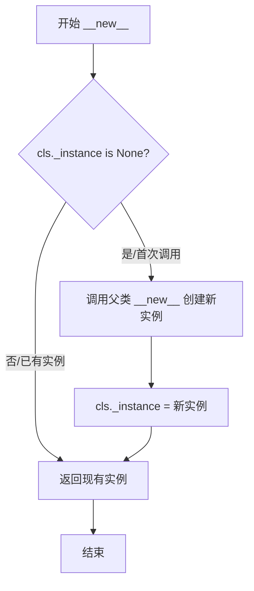
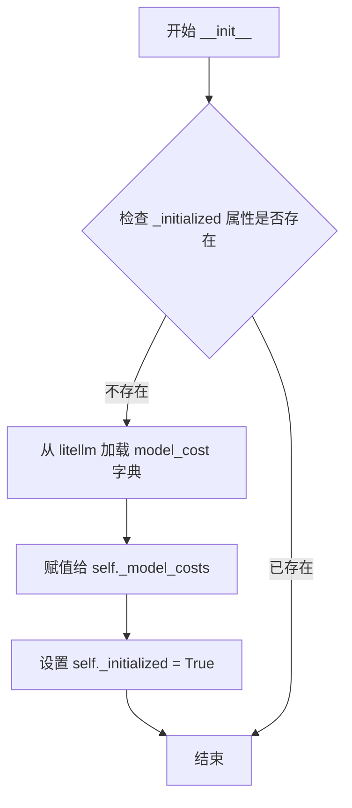
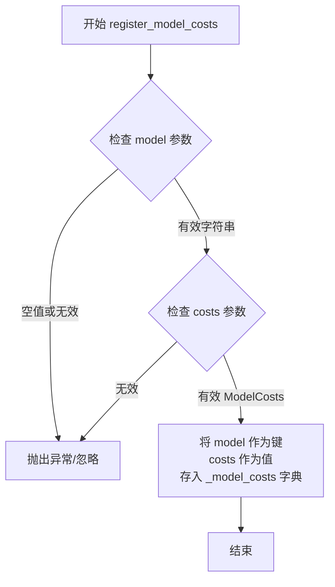
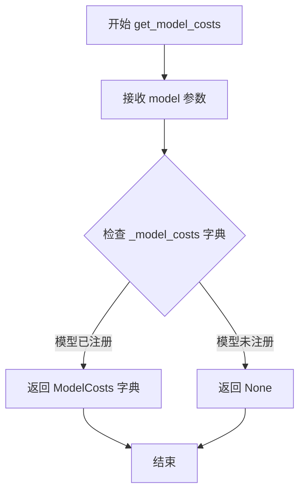
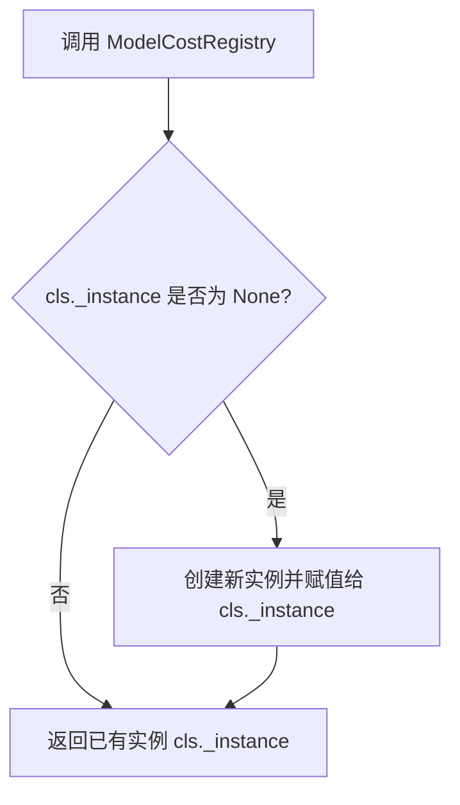
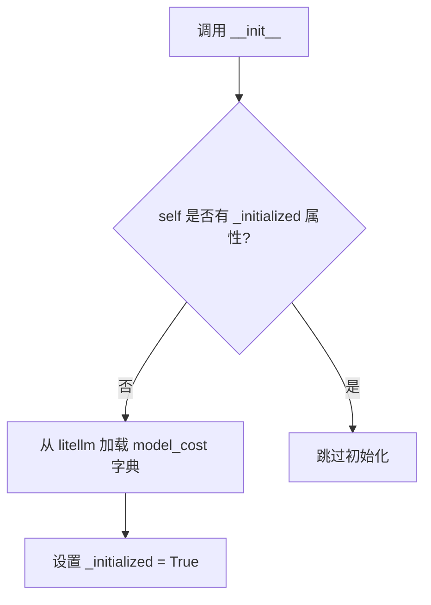
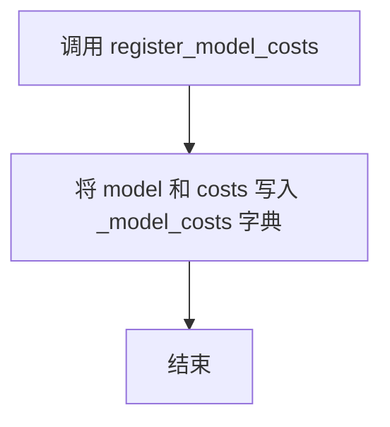
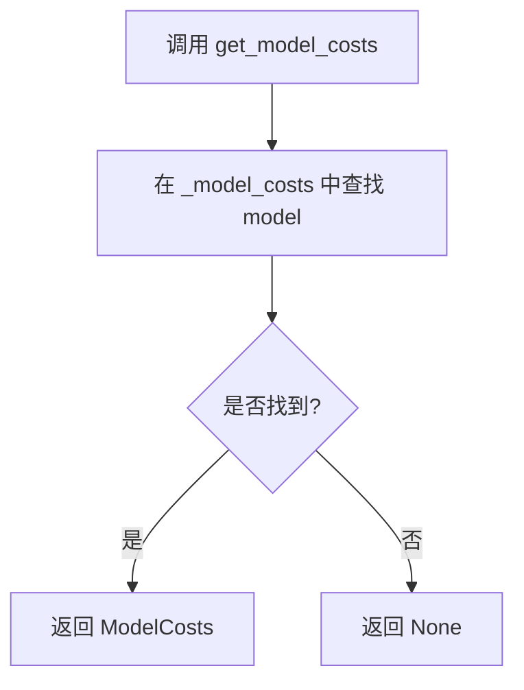

# `graphrag\packages\graphrag-llm\graphrag_llm\model_cost_registry\model_cost_registry.py` 详细设计文档

这是一个模型成本注册表模块，通过单例模式管理AI模型的token使用成本，提供模型成本的注册和查询功能，基于litellm库的model_cost数据源。

## 整体流程



## 类结构

```
ModelCostRegistry (单例注册表类)
├── _instance: ClassVar[Self | None] - 类变量，单例实例
├── _model_costs: dict[str, ModelCosts] - 模型成本字典
├── _initialized: bool - 初始化标志
├── __new__() - 单例模式实现
├── __init__() - 初始化加载数据
├── register_model_costs() - 注册模型成本
└── get_model_costs() - 查询模型成本
```

## 全局变量及字段


### `model_cost_registry`
    
单例模型成本注册表实例，用于全局访问模型成本信息

类型：`ModelCostRegistry`
    


### `ModelCosts.input_cost_per_token`
    
每token输入成本

类型：`float`
    


### `ModelCosts.output_cost_per_token`
    
每token输出成本

类型：`float`
    


### `ModelCostRegistry._instance`
    
类变量，存储单例实例引用

类型：`ClassVar[Self | None]`
    


### `ModelCostRegistry._model_costs`
    
实例变量，存储模型名称到成本的映射字典

类型：`dict[str, ModelCosts]`
    


### `ModelCostRegistry._initialized`
    
实例变量，标记注册表是否已初始化

类型：`bool`
    
    

## 全局函数及方法


### `ModelCostRegistry.__new__`

创建或返回 ModelCostRegistry 单例实例，确保全局只有一个注册表实例。

参数：

- `cls`：类型为 `type[ModelCostRegistry]`，表示当前类本身
- `*args`：类型为 `tuple[Any, ...]`，可变位置参数，用于传递给父类构造函数
- `**kwargs`：类型为 `dict[str, Any]`，可变关键字参数，用于传递给父类构造函数

返回值：`Self`，返回单例实例（新建或已存在的实例）

#### 流程图



#### 带注释源码

```python
def __new__(cls, *args: Any, **kwargs: Any) -> Self:
    """Create a new instance of ModelCostRegistry if it does not exist."""
    # 检查类属性 _instance 是否为 None（单例模式的首次初始化）
    if cls._instance is None:
        # 调用父类 object 的 __new__ 方法创建新实例
        # 传递类本身和可变参数
        cls._instance = super().__new__(cls, *args, **kwargs)
    # 返回单例实例（新建或已存在的）
    return cls._instance
```


### `ModelCostRegistry.__init__`

初始化 ModelCostRegistry 实例，从 litellm 库加载模型成本数据字典，并标记为已初始化以防止重复初始化。

参数：

- `self`：无显式参数，代表类的实例本身

返回值：`None`，无返回值

#### 流程图



#### 带注释源码

```python
def __init__(self):
    """初始化 ModelCostRegistry 实例."""
    # 检查是否已经初始化过（单例模式的一部分）
    # 防止重复初始化已创建的实例
    if not hasattr(self, "_initialized"):
        # 从 litellm 库获取预定义的模型成本字典
        # 包含各种模型的 input_cost_per_token 和 output_cost_per_token
        self._model_costs = model_cost
        # 标记为已初始化，防止后续调用时重复设置
        self._initialized = True
```


### `ModelCostRegistry.register_model_costs`

将指定模型的计费成本信息注册到全局模型成本注册表中，支持动态添加或更新模型计费参数。

参数：

- `model`：`str`，模型标识符，例如 "openai/gpt-4o"
- `costs`：`ModelCosts`，包含 input_cost_per_token 和 output_cost_per_token 的成本字典

返回值：`None`，无返回值，仅执行注册操作

#### 流程图



#### 带注释源码

```python
def register_model_costs(self, model: str, costs: ModelCosts) -> None:
    """Register the cost per unit for a given model.
    
    此方法用于向 ModelCostRegistry 实例中注册或更新特定模型的计费成本。
    由于 ModelCostRegistry 采用单例模式，此操作会影响全局唯一的注册表实例。
    
    Args
    ----
        model: str
            模型标识符，格式通常为 "provider/model-name"，例如 "openai/gpt-4o"。
            该字符串将作为字典的键进行存储。
        costs: ModelCosts
            包含 input_cost_per_token 和 output_cost_per_token 的成本字典。
            用于定义该模型输入和输出token的单价。
    
    Returns
    -------
        None
            此方法不返回任何值，仅修改内部字典状态。
    
    Note
    ----
        - 如果 model 已存在，此操作会覆盖原有的成本信息
        - 底层数据结构直接引用 litellm.model_cost 字典，因此修改会影响到外部对 model_cost 的引用
    """
    # 将传入的 model 标识符作为键，将 costs 成本字典作为值
    # 存入 _model_costs 字典中，完成模型成本的注册或更新
    self._model_costs[model] = costs
```


### `ModelCostRegistry.get_model_costs`

该方法用于检索指定模型的成本信息，通过模型ID查询内部维护的模型成本字典，如果找到对应模型则返回包含输入和输出token成本的 `ModelCosts` 字典，否则返回 `None`。

参数：

- `model`：`str`，模型标识符，如 "openai/gpt-4o"

返回值：`ModelCosts | None`，返回与模型关联的成本字典，包含 `input_cost_per_token` 和 `output_cost_per_token`，如果模型未注册则返回 `None`

#### 流程图



#### 带注释源码

```python
def get_model_costs(self, model: str) -> ModelCosts | None:
    """Retrieve the cost per unit for a given model.

    Args
    ----
        model: str
            The model id, e.g., "openai/gpt-4o".

    Returns
    -------
        ModelCosts | None
            The costs associated with the model, or None if not found.

    """
    # 调用字典的 get 方法查询模型成本
    # 如果模型存在则返回 ModelCosts 字典，否则返回 None
    return self._model_costs.get(model)
```

---

## 完整类设计文档

### 一段话描述

`ModelCostRegistry` 是一个单例模式的模型成本注册中心，用于管理和查询各种大语言模型的 token 计价信息，通过封装 `litellm` 库的 `model_cost` 字典提供统一的模型成本查询接口。

### 文件的整体运行流程

1. 模块导入时，`ModelCosts` TypedDict 定义了成本数据结构
2. `ModelCostRegistry` 类实现单例模式，首次实例化时加载 `litellm` 的模型成本字典
3. 应用程序可通过 `register_model_costs` 方法添加自定义模型成本
4. 通过 `get_model_costs` 方法查询特定模型的计价信息

### 类的详细信息

#### 类字段

- `_instance`：`ClassVar[Self | None]` - 类变量，存储单例实例
- `_model_costs`：`dict[str, ModelCosts]` - 实例变量，存储模型成本映射字典
- `_initialized`：`bool` - 实例变量，标记是否已初始化

#### 类方法

| 方法名 | 功能描述 |
|--------|----------|
| `__new__` | 实现单例模式，确保全局只有一个 `ModelCostRegistry` 实例 |
| `__init__` | 初始化实例，加载 `litellm` 的模型成本字典 |
| `register_model_costs` | 注册自定义模型的计价信息 |
| `get_model_costs` | 查询指定模型的计价信息 |

### 关键组件信息

| 组件名称 | 一句话描述 |
|----------|------------|
| `ModelCosts` TypedDict | 定义模型成本的数据结构，包含输入和输出 token 单价 |
| `model_cost` | 来自 `litellm` 库的预定义模型成本字典 |
| `model_cost_registry` | 模块级单例实例，对外提供全局访问点 |

### 潜在的技术债务或优化空间

1. **缓存机制缺失**：每次调用 `get_model_costs` 都直接访问字典，可考虑添加内存缓存以优化高频查询场景
2. **错误处理不足**：未对空字符串或非法模型ID进行校验
3. **类型安全**：返回 `None` 时调用方需进行空值检查，可考虑抛出自定义异常或使用 Optional 类型增强类型安全

### 其它项目

#### 设计目标与约束

- **设计目标**：提供统一的模型成本查询接口，支持内置模型和自定义模型的成本管理
- **设计约束**：依赖 `litellm` 库的 `model_cost` 字典作为数据源

#### 错误处理与异常设计

- 当前实现未进行显式错误处理，依赖 Python 字典的 `get` 方法自然返回 `None`
- 建议调用方在使用返回值前进行空值检查

#### 数据流与状态机

- 数据流：外部调用 → `get_model_costs` 方法 → 查询 `_model_costs` 字典 → 返回结果
- 状态机：实例化后进入就绪状态，可同时处理多个查询请求

#### 外部依赖与接口契约

- **依赖**：`litellm` 库（提供 `model_cost` 字典）
- **接口契约**：传入有效的模型ID字符串，返回对应的成本字典或 `None`

## 关键组件


### 一段话描述

该代码实现了一个模型成本注册表（ModelCostRegistry），采用单例模式管理各类大语言模型的输入/输出成本信息，支持动态注册新模型成本并提供查询功能，底层数据存储依赖于 litellm 库的 model_cost 字典。

### 文件的整体运行流程

该模块采用单例模式运行，首次导入时创建全局单例实例 `model_cost_registry`。当外部模块需要注册新模型成本时，调用 `register_model_costs()` 方法将模型标识和对应成本写入内部字典；当需要查询模型成本时，调用 `get_model_costs()` 方法从字典中检索对应记录，若不存在则返回 None。初始化时从 litellm 库加载默认的模型成本映射表。

### 类的详细信息

#### ModelCostRegistry 类

**类字段：**

| 名称 | 类型 | 描述 |
|------|------|------|
| _instance | ClassVar[Self \| None] | 类变量，存储单例实例引用 |
| _model_costs | dict[str, ModelCosts] | 实例变量，存储模型成本映射字典 |
| _initialized | bool | 标记是否已初始化，防止重复初始化 |

**类方法：**

##### __new__ 方法

| 项目 | 详情 |
|------|------|
| 名称 | __new__ |
| 参数名称 | cls, *args, **kwargs |
| 参数类型 | cls: Type[Self], args: tuple[Any], kwargs: dict[str, Any] |
| 参数描述 | cls 为类本身，args 和 kwargs 为传递给父类构造器的可选参数 |
| 返回值类型 | Self |
| 返回值描述 | 返回单例实例，若实例不存在则创建新实例 |

**mermaid 流程图：**



**带注释源码：**

```python
def __new__(cls, *args: Any, **kwargs: Any) -> Self:
    """Create a new instance of ModelCostRegistry if it does not exist."""
    # 检查类变量 _instance 是否为空
    if cls._instance is None:
        # 使用父类构造方法创建新实例
        cls._instance = super().__new__(cls, *args, **kwargs)
    # 返回单例实例
    return cls._instance
```

---

##### __init__ 方法

| 项目 | 详情 |
|------|------|
| 名称 | __init__ |
| 参数名称 | self |
| 参数类型 | Self |
| 参数描述 | 单例实例本身 |
| 返回值类型 | None |
| 返回值描述 | 无返回值，仅初始化实例属性 |

**mermaid 流程图：**



**带注释源码：**

```python
def __init__(self):
    # 检查是否已初始化，防止重复初始化
    if not hasattr(self, "_initialized"):
        # 从 litellm 库加载默认模型成本字典
        self._model_costs = model_cost
        # 标记已初始化
        self._initialized = True
```

---

##### register_model_costs 方法

| 项目 | 详情 |
|------|------|
| 名称 | register_model_costs |
| 参数名称 | model, costs |
| 参数类型 | model: str, costs: ModelCosts |
| 参数描述 | model 为模型标识符（如 "openai/gpt-4o"），costs 为包含 input_cost_per_token 和 output_cost_per_token 的成本字典 |
| 返回值类型 | None |
| 返回值描述 | 无返回值，直接修改内部字典 |

**mermaid 流程图：**



**带注释源码：**

```python
def register_model_costs(self, model: str, costs: ModelCosts) -> None:
    """Register the cost per unit for a given model.

    Args
    ----
        model: str
            The model id, e.g., "openai/gpt-4o".
        costs: ModelCosts
            The costs associated with the model.
    """
    # 将模型标识和成本信息存入字典
    self._model_costs[model] = costs
```

---

##### get_model_costs 方法

| 项目 | 详情 |
|------|------|
| 名称 | get_model_costs |
| 参数名称 | model |
| 参数类型 | model: str |
| 参数描述 | 要查询的模型标识符 |
| 返回值类型 | ModelCosts \| None |
| 返回值描述 | 返回模型成本信息，若不存在则返回 None |

**mermaid 流程图：**



**带注释源码：**

```python
def get_model_costs(self, model: str) -> ModelCosts | None:
    """Retrieve the cost per unit for a given model.

    Args
    ----
        model: str
            The model id, e.g., "openai/gpt-4o".

    Returns
    -------
        ModelCosts | None
            The costs associated with the model, or None if not found.

    """
    # 使用字典的 get 方法查询，返回 None 如果键不存在
    return self._model_costs.get(model)
```

---

### 全局变量和全局函数

#### 全局变量

| 名称 | 类型 | 描述 |
|------|------|------|
| model_cost_registry | ModelCostRegistry | 模块级单例实例，提供全局访问点 |

### 关键组件信息

#### ModelCosts TypedDict

定义了模型成本的数据结构，包含 input_cost_per_token（每令牌输入成本）和 output_cost_per_token（每令牌输出成本）两个浮点数字段。

#### ModelCostRegistry 单例

采用单例模式确保全局只有一个成本注册表实例，避免多实例导致的数据不一致问题。

#### litellm.model_cost 集成

底层数据存储依赖于 litellm 库的 model_cost 字典，提供了大量预定义的模型成本数据。

### 潜在的技术债务或优化空间

1. **缺乏线程安全保护**：单例实现未使用锁机制，在多线程环境下可能存在竞态条件风险
2. **无持久化机制**：注册的模型成本仅存在于内存中，程序重启后数据丢失
3. **错误处理不足**：未对 costs 参数的数值有效性进行校验（如负数、NaN 等）
4. **缺少批量操作接口**：只能逐个注册模型成本，批量注册效率较低
5. **类型注解不完整**：__new__ 方法的参数类型注解可优化为更精确的形式

### 其它项目

#### 设计目标与约束

- **目标**：提供统一的模型成本管理入口，支持动态注册和查询
- **约束**：依赖 litellm 库作为默认数据源，必须保持兼容

#### 错误处理与异常设计

- 当前实现未引入自定义异常，查询不存在模型时返回 None 而非抛出异常
- 建议：为无效输入（如空字符串模型名、非法成本值）添加显式异常

#### 数据流与状态机

- 数据流为单向：外部模块 → register_model_costs → 内部字典，或 外部模块 → get_model_costs → 内部字典
- 状态机简单：初始化态 → 可用态，仅包含加载和就绪两种状态

#### 外部依赖与接口契约

- 依赖 `litellm` 库的 `model_cost` 字典
- 依赖 `typing_extensions` 的 `Self` 类型注解（Python 3.11+ 可用内置类型）
- 公开接口：`register_model_costs(model: str, costs: ModelCosts)` 和 `get_model_costs(model: str) -> ModelCosts | None`


## 问题及建议


### 已知问题

-   **线程安全问题**：单例模式的实现使用 `cls._instance` 类变量但未加锁，在多线程环境下可能导致创建多个实例，违反单例设计原则
-   **初始化竞态条件**：`hasattr(self, "_initialized")` 检查在多线程并发时可能产生竞态条件，导致初始化逻辑执行多次
-   **直接暴露内部字典**：`_model_costs` 直接引用 `litellm.model_cost` 字典，缺乏对外部操作的隔离和保护
-   **错误处理不完善**：`get_model_costs` 方法返回 `None` 表示未找到，缺乏统一的错误处理策略，下游调用方需要额外判断
-   **功能不完整**：缺少删除模型成本、更新模型成本、批量操作等常用功能方法
-   **类型注解不够精确**：`model_cost` 从外部库导入，其实际类型可能与声明的 `dict[str, ModelCosts]` 存在偏差
-   **缺少输入验证**：`register_model_costs` 方法未对 `model` 和 `costs` 参数进行有效性校验（如空字符串、负数成本等）

### 优化建议

-   **实现线程安全的单例**：使用 `threading.Lock` 保护单例创建过程，确保在多线程环境下只创建一个实例
-   **添加线程安全锁**：在修改 `_model_costs` 字典的读写操作中添加锁机制，防止并发访问冲突
-   **增加参数校验**：在 `register_model_costs` 中验证 `model` 非空、`costs` 值有效（如非负数）
-   **优化错误处理**：考虑抛出自定义异常或使用 Optional 返回值并提供明确的文档说明
-   **提供完整 CRUD 操作**：增加 `remove_model_costs`、`update_model_costs`、`list_all_models` 等方法
-   **深拷贝保护**：考虑使用深拷贝隔离外部 `model_cost` 字典，避免意外修改影响原始数据
-   **完善类型注解**：使用 `TypeVar` 增强泛型支持，或添加 `type: ignore` 注释说明外部库类型


## 其它


### 设计目标与约束

设计目标：为AI模型调用成本追踪提供一个全局统一的注册中心，支持动态注册模型成本信息，支持成本查询功能。采用单例模式确保全局唯一实例，避免重复创建造成的资源浪费和数据不一致问题。

设计约束：依赖litellm库的model_cost字典作为默认数据源，不提供持久化存储，成本信息存储在内存中，应用程序重启后注册的自定义成本信息会丢失。

### 错误处理与异常设计

代码本身未定义自定义异常，错误处理主要依赖Python内置机制。get_model_costs方法返回None表示未找到对应模型的成本信息，这是一种隐式的错误处理方式。register_model_costs方法未对重复注册进行校验，后注册的同名模型成本会覆盖已存在的成本信息。建议未来版本添加异常类如ModelNotFoundException、DuplicateRegistrationException等，以提高错误处理的可预测性。

### 数据流与状态机

数据流：外部调用方通过model_cost_registry单例调用register_model_costs方法将模型成本写入_model_costs字典，或通过get_model_costs方法从字典中读取模型成本。初始化时从litellm.model_cost加载默认成本数据。

状态机：ModelCostRegistry实例存在两种状态——未初始化状态和已初始化状态。未初始化时_initialized属性不存在，__init__方法会执行初始化逻辑并设置_initialized=True；已初始化状态下__init__方法不再执行任何操作，确保单例实例只初始化一次。

### 外部依赖与接口契约

外部依赖：依赖litellm库的model_cost模块，该模块提供默认的模型成本字典。依赖typing_extensions库的Self类型注解，用于类型提示。依赖typing库的TypedDict、ClassVar、Any类型。

接口契约：register_model_costs方法接受model字符串和costs ModelCosts字典，costs必须包含input_cost_per_token和output_cost_per_token两个float类型的键。get_model_costs方法接受model字符串参数，返回ModelCosts字典或None。ModelCosts类型定义为包含input_cost_per_token和output_cost_per_token两个float字段的TypedDict。

### 性能考虑

采用单例模式避免重复创建实例，减少内存开销。使用dict的get方法查询模型成本，时间复杂度为O(1)。_model_costs字典在初始化时从litellm库加载大量默认模型成本数据，首次实例化可能存在一定的启动开销。注册和查询操作均无锁机制，在多线程环境下可能存在竞态条件。

### 线程安全性

当前实现非线程安全。_instance类变量和_model_costs字典在多线程并发访问时可能导致竞态条件。__new__方法中的if cls._instance is None判断和__init__方法中的hasattr检查都不是原子操作。建议在多线程环境下使用 threading.Lock 保护共享状态的读写操作，或明确文档说明该类非线程安全。

### 使用示例

```python
# 获取默认的gpt-4o成本
costs = model_cost_registry.get_model_costs("openai/gpt-4o")
if costs:
    print(f"Input cost: {costs['input_cost_per_token']}")

# 注册自定义模型成本
model_cost_registry.register_model_costs("custom/model-v1", {
    "input_cost_per_token": 0.001,
    "output_cost_per_token": 0.002
})
```

### 扩展性设计

当前仅支持按模型ID查询成本信息，未来可扩展支持按模型供应商、模型系列等维度查询。ModelCosts类型目前仅包含input_cost_per_token和output_cost_per_token两个字段，可根据业务需求扩展支持缓存成本、批量处理成本等字段。可以通过继承或组合模式扩展成本计算逻辑，如支持按时间段的动态定价。

### 版本兼容性

代码使用Python 3.11+的Self类型注解，需要Python 3.11及以上版本。TypedDict的使用方式兼容Python 3.8+。依赖的litellm库版本需与model_cost模块的API兼容，建议在项目依赖管理中明确litellm的版本约束。

    