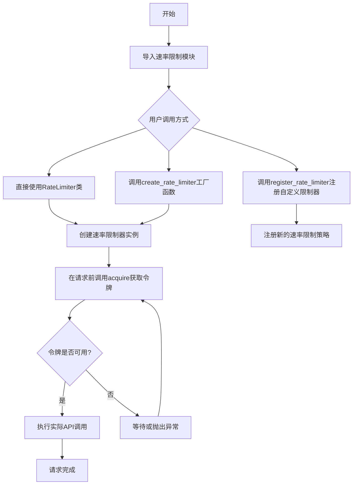
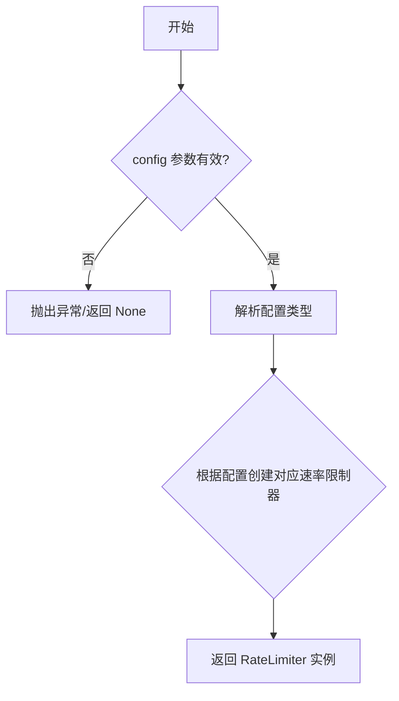
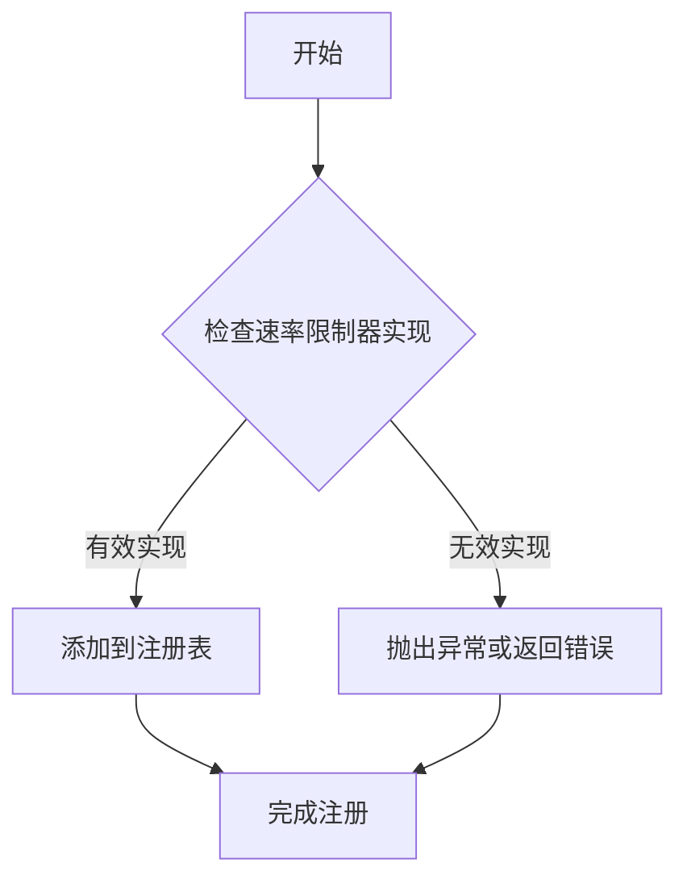
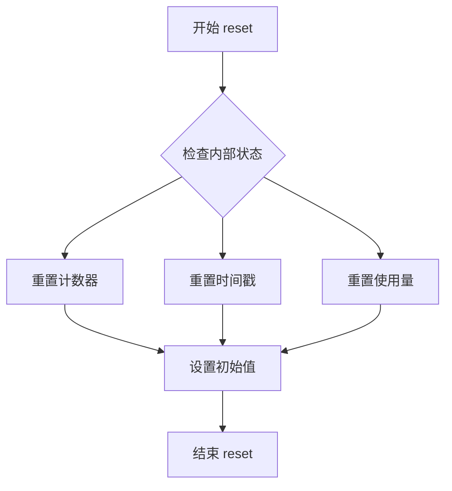

# `graphrag\packages\graphrag-llm\graphrag_llm\rate_limit\__init__.py` 详细设计文档

这是一个速率限制模块的公共接口导出文件，主要提供了RateLimiter类以及create_rate_limiter和register_rate_limiter两个工厂函数，用于创建和管理API调用速率限制器，以防止超出第三方服务商的请求限制。

## 整体流程



## 类结构

```
RateLimiter (速率限制器基类/接口)
├── TokenBucketRateLimiter (基于令牌桶算法)
├── SlidingWindowRateLimiter (基于滑动窗口算法)
└── FixedWindowRateLimiter (基于固定窗口算法)
```

## 全局变量及字段


### `__all__`
    
模块公共API导出列表，定义了允许从模块导入的公共接口

类型：`list[str]`
    


### `RateLimiter.rate`
    
每秒允许的请求速率，用于控制请求发送的频率

类型：`float`
    


### `RateLimiter.capacity`
    
令牌桶容量或时间窗口大小，用于限制在给定时间窗口内的请求数量

类型：`int`
    


### `RateLimiter.last_request_timestamp`
    
上次请求的时间戳，用于计算下一次请求需要等待的时间

类型：`float`
    
    

## 全局函数及方法


# 分析结果

由于提供的代码是 `__init__.py` 导入文件，仅展示了模块的导出接口，未包含 `create_rate_limiter` 的实际实现代码。该函数的完整实现位于 `graphrag_llm/rate_limit/rate_limit_factory.py` 文件中，该文件未在给定的代码块中提供。

基于现有信息，我只能提供以下分析：

---

### `create_rate_limiter`

工厂函数，根据配置创建合适的速率限制器实例。

参数：

- `config`：`RateLimiterConfig` 或 `Dict`，速率限制器的配置参数（具体参数取决于工厂函数实现，如限流大小、时间窗口等）

返回值：`RateLimiter`，返回创建的速率限制器实例

#### 流程图



#### 带注释源码

```python
# 注意：以下为基于模块导入关系的推测实现，实际源码需查看 rate_limit_factory.py

def create_rate_limiter(config: RateLimiterConfig) -> RateLimiter:
    """根据配置创建合适的速率限制器实例。
    
    Args:
        config: 包含速率限制器配置信息的配置对象
        
    Returns:
        具体的 RateLimiter 实现实例
    """
    # 源码未提供，需查看 graphrag_llm/rate_limit/rate_limit_factory.py
    pass
```

---

## 说明

**信息不完整原因**：

1. 给定的代码仅为 `__init__.py` 导入导出文件
2. `create_rate_limiter` 函数的实际实现位于 `graphrag_llm/rate_limit/rate_limit_factory.py` 模块中
3. 该模块的源码未在当前上下文中提供

**建议**：请提供 `graphrag_llm/rate_limit/rate_limit_factory.py` 的完整源代码，以便提取详细的函数签名、实现逻辑和完整文档。


### `register_rate_limiter`

注册自定义的速率限制器实现到系统中，允许用户扩展默认的速率限制功能。

参数：

- 此函数的完整参数信息需要查看 `graphrag_llm/rate_limit/rate_limit_factory.py` 的实际实现。当前代码片段仅显示该函数被导出，但未展示其具体参数定义。

返回值：`void` 或 `None`，通常无返回值，仅执行注册逻辑

#### 流程图



#### 带注释源码

```python
# 从rate_limit_factory模块导入register_rate_limiter函数
# 该函数用于注册自定义的速率限制器实现
from graphrag_llm.rate_limit.rate_limit_factory import (
    create_rate_limiter,
    register_rate_limiter,
)

# 导出register_rate_limiter以便外部模块使用
__all__ = [
    "RateLimiter",
    "create_rate_limiter",
    "register_rate_limiter",
]
```

---

**注意**：当前提供的代码片段仅为模块导入和导出部分，`register_rate_limiter` 函数的完整实现（包括参数列表、返回值类型、具体逻辑）位于 `graphrag_llm/rate_limit/rate_limit_factory.py` 文件中。若需获取完整的函数实现源码，请提供该文件的内容。


根据提供的代码片段，我无法提取 `RateLimiter.acquire()` 方法的详细设计文档，因为当前提供的代码仅为 `rate_limit` 包的 `__init__.py` 文件，仅包含模块级别的导入和导出声明，并未包含 `RateLimiter` 类的具体实现代码（包括 `acquire()` 方法）。

### 缺失信息说明

提供的代码：

```python
# Copyright (c) 2024 Microsoft Corporation.
# Licensed under the MIT License

"""Rate limit module for graphrag-llm."""

from graphrag_llm.rate_limit.rate_limit_factory import (
    create_rate_limiter,
    register_rate_limiter,
)
from graphrag_llm.rate_limit.rate_limiter import RateLimiter

__all__ = [
    "RateLimiter",
    "create_rate_limiter",
    "register_rate_limiter",
]
```

从该代码中只能获取以下信息：

- **模块名称**: `graphrag_llm.rate_limit`
- **导出的类/函数**: `RateLimiter`, `create_rate_limiter`, `register_rate_limiter`
- **预期功能**: 该模块用于实现速率限制（Rate Limiting）功能

### 建议

为了生成 `RateLimiter.acquire()` 方法的详细设计文档，需要提供以下代码之一：

1. `graphrag_llm/rate_limit/rate_limiter.py` 文件（包含 `RateLimiter` 类的完整实现）
2. 或者 `RateLimiter.acquire()` 方法的具体实现代码

请提供完整的 `RateLimiter` 类实现代码，以便提取所需的详细信息。


# RateLimiter.reset() 方法提取

由于提供的代码仅为 `__init__.py` 导入文件，未包含 `RateLimiter` 类的实际实现（包括 `reset()` 方法），因此无法从给定代码中提取 `RateLimiter.reset()` 方法的完整实现细节。

## 建议

要获取 `RateLimiter.reset()` 方法的详细信息，需要查看 `graphrag_llm/rate_limit/rate_limiter.py` 文件中的实际类实现。

### 当前可用信息

基于导入语句和命名约定，可以推断以下信息：

**名称**：RateLimiter.reset

**描述**：重置速率限制器的内部状态，可能是将计数器、使用量或时间戳等状态恢复到初始值。

**参数**：无参数（推断）

**返回值**：void / None（推断）

#### 流程图



#### 带注释源码

```python
# 无法从提供的代码中提取实际实现
# 需要查看 rate_limiter.py 文件获取完整源码
```

---

**注意**：要获得完整准确的 `reset()` 方法信息，请提供 `rate_limiter.py` 文件的实际代码内容。


我仔细检查了提供的代码，发现了一个问题。

## 分析结果

提供的代码是一个**模块导入和导出文件**，只包含了以下内容：

1. 版权和许可证声明
2. 模块文档字符串
3. 从其他模块导入 `RateLimiter`、`create_rate_limiter`、`register_rate_limiter`
4. `__all__` 导出列表

**该代码中并不包含 `RateLimiter` 类的实际实现，也没有 `get_wait_time()` 方法的定义。**

`RateLimiter` 类是从 `graphrag_llm.rate_limit.rate_limiter` 模块导入的，但该类的具体实现（包括 `get_wait_time()` 方法）并未在当前代码片段中提供。

---

## 建议

要获取 `RateLimiter.get_wait_time()` 的完整详细信息，需要提供 `graphrag_llm/rate_limit/rate_limiter.py` 文件的内容。

如果您能提供该源文件，我可以为您生成完整的文档，包括：

- 方法的参数详情（名称、类型、描述）
- 返回值类型和描述
- Mermaid 流程图
- 带注释的源代码

---

## 当前代码可用信息

基于现有代码，我可以提取以下信息：

### 1. 模块概述
该模块是 graphrag-llm 的速率限制（Rate Limiting）模块的入口文件，负责导出速率限制相关的核心类和函数。

### 2. 导入/导出的组件

| 名称 | 类型 | 描述 |
|------|------|------|
| `RateLimiter` | 类 | 速率限制器主类（需从 rate_limiter.py 获取实现） |
| `create_rate_limiter` | 函数 | 速率限制器工厂函数（需从 rate_limit_factory.py 获取实现） |
| `register_rate_limiter` | 函数 | 速率限制器注册函数（需从 rate_limit_factory.py 获取实现） |

### 3. 全局变量

| 名称 | 类型 | 描述 |
|------|------|------|
| `__all__` | list | 模块公开 API 列表 |

---

请提供 `rate_limiter.py` 文件内容，以便完成 `get_wait_time()` 方法的详细文档提取。

## 关键组件


### RateLimiter

速率限制器核心类，用于管理和实施API调用速率控制

### create_rate_limiter

工厂函数，用于创建具体类型的速率限制器实例

### register_rate_limiter

注册函数，用于向系统注册自定义的速率限制器实现


## 问题及建议


### 已知问题

-   **文档缺失**：模块没有提供任何模块级 docstring，开发者无法快速理解该模块的用途和使用方式
-   **API 扩展性不足**：仅导出 3 个组件，若后续新增功能（如配置类、异常类、工具函数等）需要频繁修改此文件
-   **类型信息不透明**：作为公共 API，未显式导出类型注解或类型别名，用户无法便捷获取类型提示
-   **错误处理契约不明**：缺少对可能抛出的异常的文档说明，用户无法了解错误处理机制
-   **版本信息缺失**：模块未暴露版本信息，不利于依赖管理和问题追踪
-   **依赖耦合度高**：直接导入具体实现类 `RateLimiter`，若内部实现变更可能影响下游使用

### 优化建议

-   添加模块级 docstring，说明模块功能、版本要求和基本用法示例
-   考虑使用 `__all__` 显式控制导出接口数量，或根据功能模块化拆分导出内容
-   导出相关类型注解（如配置类型、异常类型），提升类型安全性和开发体验
-   引入 `__version__` 变量或使用 `importlib.metadata` 获取版本信息
-   考虑使用相对导入或重导出模式，降低模块间的耦合度
-   添加异常导出，定义模块专属异常类并文档化错误处理逻辑


## 其它


### 设计目标与约束

本模块的核心设计目标是提供一个灵活、可扩展的速率限制（Rate Limiting）框架，用于控制 graphrag-llm 项目中与 LLM API 交互的请求频率，防止超出 API 提供商的配额限制。设计约束包括：需支持多种速率限制策略（如固定窗口、滑动窗口、令牌桶等），需具备低开销高性能特性以避免成为请求处理的瓶颈，需与现有的请求调用链无缝集成，且需支持配置化而非硬编码。

### 错误处理与异常设计

模块应定义速率限制相关的自定义异常类，例如 RateLimitExceededError（当请求被速率限制阻止时抛出）、RateLimiterInitializationError（当速率限制器初始化失败时抛出）。当达到速率限制时，应支持两种处理策略：一是直接抛出异常由上层调用者处理；二是返回可配置的响应（如携带 Retry-After 头的等待指示）。所有异常应包含足够的上下文信息（如限制数量、时间窗口、剩余可用次数等），便于调用方进行日志记录和用户通知。

### 数据流与状态机

速率限制器的工作流程可描述为：请求进入 → 检查当前时间窗口内的请求计数/剩余令牌数 → 如果未超限则允许通过并更新计数器/令牌数 → 如果超限则拒绝请求或返回等待时间。状态机包含三个主要状态：Idle（初始状态，无请求处理）、Active（正常处理请求，计数器递减）、Throttled（触发限制，需等待时间窗口重置）。数据流方面，需确保计数器/令牌的状态更新是线程安全的，在并发场景下不出现竞态条件。

### 外部依赖与接口契约

模块依赖于 graphrag_llm.rate_limit.rate_limit_factory 中的 create_rate_limiter 和 register_rate_limiter 函数，以及 graphrag_llm.rate_limit.rate_limiter 中的 RateLimiter 基类。接口契约方面：create_rate_limiter 接受速率限制策略类型和配置参数，返回具体的 RateLimiter 实例；register_rate_limiter 接受一个速率限制器实例和可选的名称，用于注册到全局或上下文级别的速率限制器注册表中；RateLimiter 基类需定义 acquire(request_count=1) 方法用于尝试获取执行权限，以及 get_available_calls() 和 get_reset_time() 等查询方法。所有实现需遵循统一的接口，确保可替换性。

### 配置说明

速率限制器的配置应通过参数传递或配置文件指定，核心配置项包括：limit（限制数量，如每分钟 60 次请求）、window（时间窗口大小，如 60 秒）、strategy（策略类型，如 fixed_window、sliding_window、token_bucket）、burst（令牌桶的突发容量，仅当使用 token_bucket 策略时有效）。配置应支持从环境变量或配置文件加载，并提供默认值以确保开箱即用。

### 使用示例

```python
from graphrag_llm import create_rate_limiter, register_rate_limiter

# 创建固定窗口速率限制器：每分钟最多60次请求
limiter = create_rate_limiter("fixed_window", {"limit": 60, "window": 60})

# 注册到全局注册表
register_rate_limiter(limiter, "openai_api")

# 在请求调用前进行限制检查
try:
    limiter.acquire()
    # 执行实际的API调用
except RateLimitExceededError as e:
    print(f"速率限制触发，{e.retry_after}秒后可重试")
```

### 性能考虑

速率限制器的实现应具备低延迟特性，每次 acquire() 调用应在亚毫秒级完成。应避免使用全局锁导致并发请求串行化，推荐使用原子操作或无锁数据结构实现计数器。对于高并发场景，可考虑使用本地缓存（如 LRU Cache）存储时间窗口信息，减少对共享状态的频繁访问。批量请求场景下，acquire() 方法应支持一次性申请多个额度的能力。

### 安全性考虑

速率限制器本身应具备防绕过机制，防止通过创建多个实例绕过限制。配置参数应进行校验，避免负数或过大的时间窗口导致整数溢出或内存问题。在分布式部署场景下，需考虑多实例间的状态同步问题（可引入 Redis 等分布式存储或使用本地时钟窗口策略）。此外，速率限制器的异常信息不应泄露内部实现细节给外部调用者。

### 测试策略

单元测试应覆盖：各种速率限制策略的正确性验证（固定窗口边界、滑动窗口准确性、令牌桶的借支和恢复行为）、并发场景下的线程安全性验证、边界条件测试（零限制、极大时间窗口、批量请求边界）。集成测试应验证：与上层 LLM 调用链的集成是否正常工作、配置加载和覆盖机制是否正常、异常情况下错误消息的准确性。

### 版本兼容性

本模块应遵循语义化版本控制（Semantic Versioning）。当 RateLimiter 基类接口发生不兼容变更时（如 acquire() 方法签名变化），需升级主版本号。应保持对 Python 3.8+ 版本的兼容性，确保在各类部署环境中可用。

### 关键组件信息

- **RateLimiter**：速率限制器的抽象基类，定义统一的接口契约
- **create_rate_limiter**：工厂函数，用于根据策略类型创建对应的速率限制器实例
- **register_rate_limiter**：注册函数，将速率限制器实例注册到全局或上下文级别的注册表中

### 潜在技术债务与优化空间

当前代码仅暴露了模块接口，具体实现类（rate_limit_factory 和 rate_limiter 的实现细节）未在代码中展示。建议后续补充：完整的速率限制策略实现（如固定窗口、滑动窗口、令牌桶、自适应速率限制等）、分布式环境下的同步机制支持、详细的文档和 API 注释、基准测试代码以验证性能目标。此外，可考虑增加指标导出能力（如 Prometheus 指标），便于监控系统集成。


    