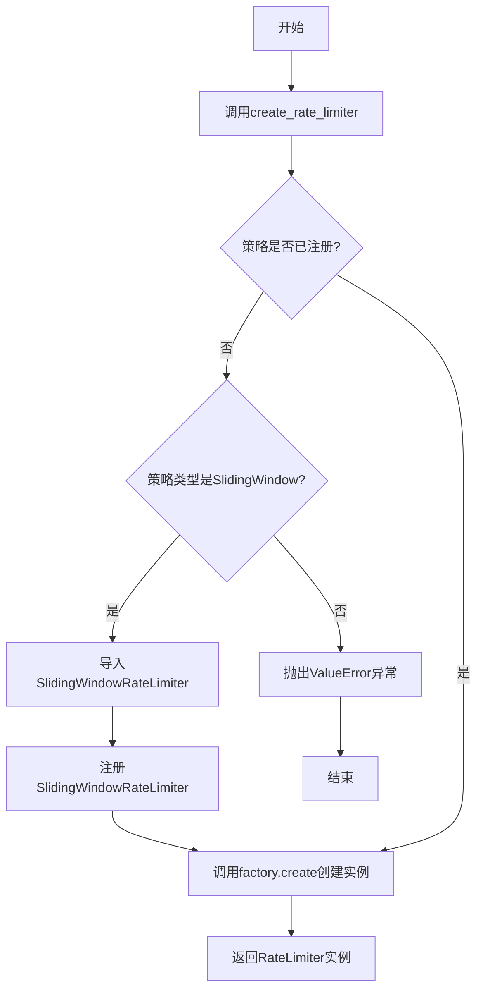
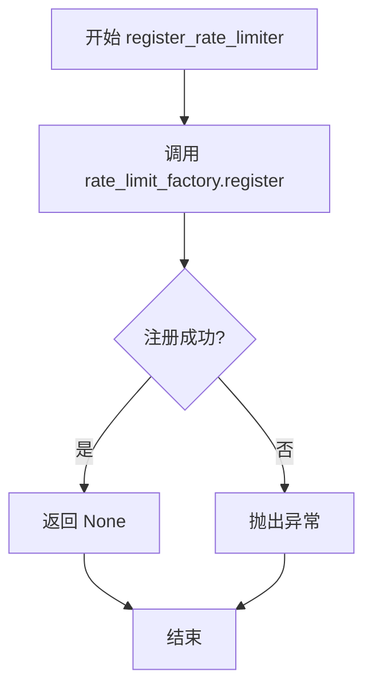
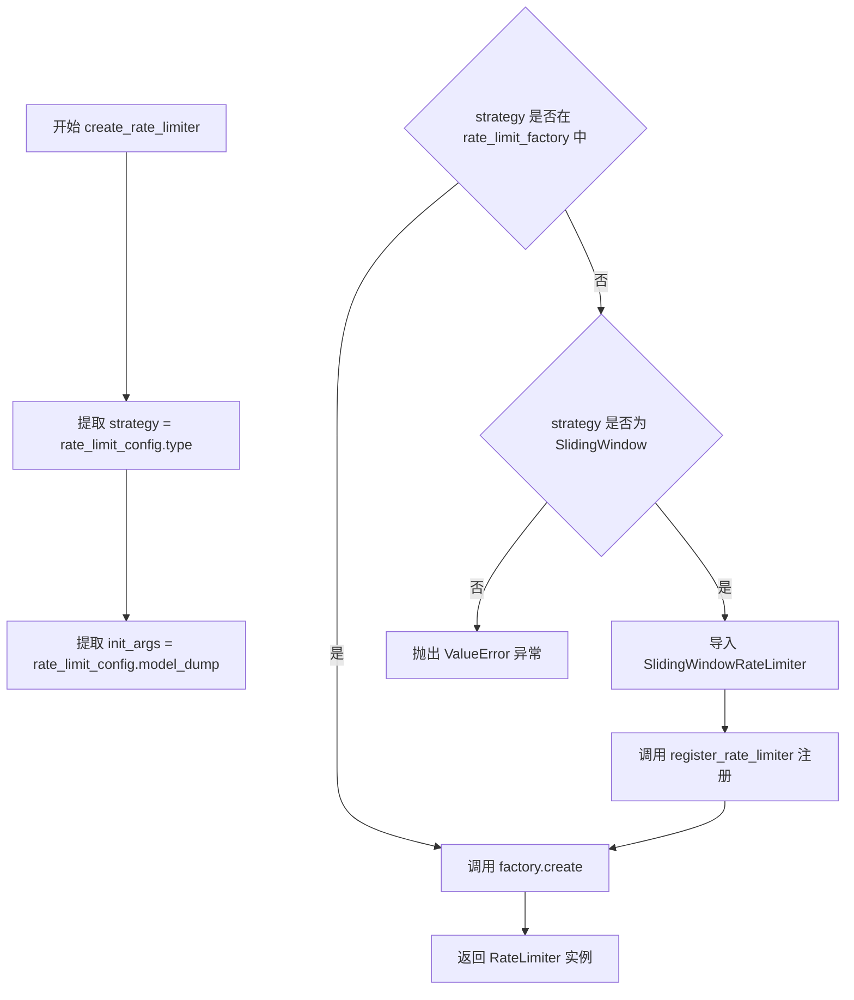
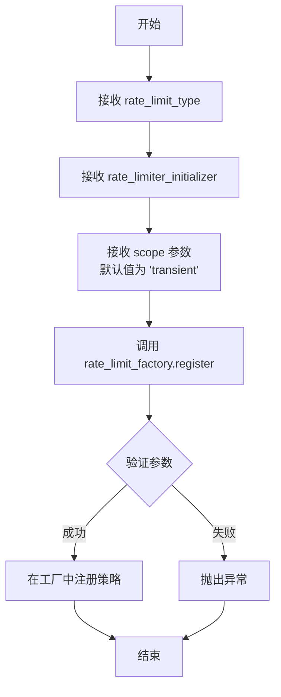
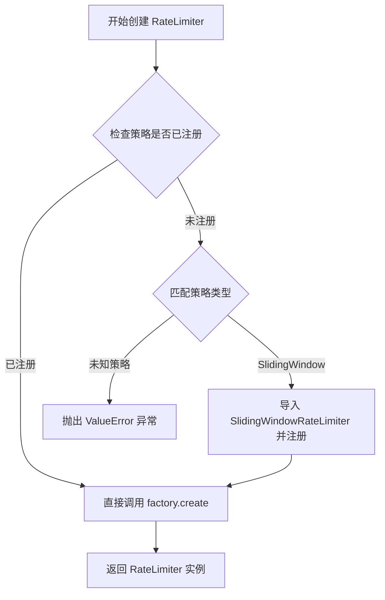
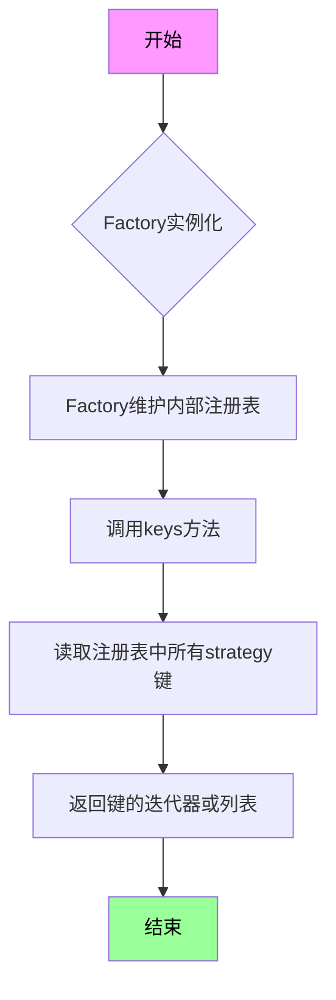
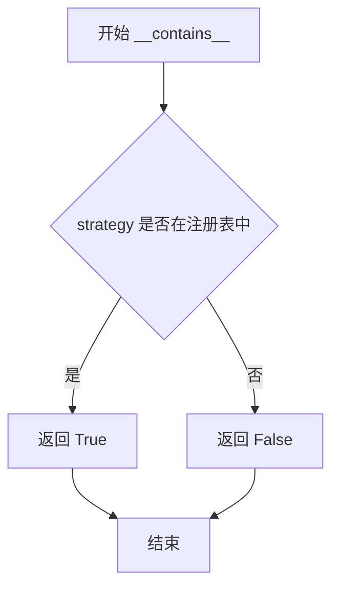

# `graphrag\packages\graphrag-llm\graphrag_llm\rate_limit\rate_limit_factory.py` 详细设计文档

这是一个速率限制工厂模块，通过工厂模式提供速率限制器(RateLimiter)的创建和注册功能，支持动态注册自定义速率限制器实现，并根据配置自动选择合适的速率限制策略。

## 整体流程



## 类结构

```
Factory (抽象基类, graphrag_common)
└── RateLimitFactory (速率限制器工厂类)
```

## 全局变量及字段


### `rate_limit_factory`
    
RateLimitFactory 类的全局单例实例，用于注册和创建不同类型的 RateLimiter

类型：`RateLimitFactory`
    


    

## 全局函数及方法


### `register_rate_limiter`

该函数用于将自定义的 RateLimiter 实现注册到速率限制工厂中，以便通过工厂模式动态创建不同类型的速率限制器实例。

参数：

- `rate_limit_type`：`str`，速率限制器的类型标识符，用于在工厂中唯一标识该速率限制器实现
- `rate_limiter_initializer`：`Callable[..., RateLimiter]`，速率限制器的初始化函数/类，用于创建 RateLimiter 实例
- `scope`：`ServiceScope`（默认值为 "transient"），速率限制器实例的服务作用域，默认为瞬态作用域

返回值：`None`，该函数无返回值，仅执行注册操作

#### 流程图



#### 带注释源码

```python
def register_rate_limiter(
    rate_limit_type: str,
    rate_limiter_initializer: Callable[..., RateLimiter],
    scope: "ServiceScope" = "transient",
) -> None:
    """Register a custom RateLimiter implementation.

    Args
    ----
        rate_limit_type: str
            The rate limit id to register.
        rate_limiter_initializer: Callable[..., RateLimiter]
            The rate limiter initializer to register.
        scope: ServiceScope (default: "transient")
            The service scope for the rate limiter instance.
    """
    # 调用工厂实例的 register 方法，将速率限制器注册到工厂中
    # 参数 strategy: 速率限制器的唯一标识符
    # 参数 initializer: 用于创建 RateLimiter 实例的可调用对象
    # 参数 scope: 服务作用域，控制实例的生命周期
    rate_limit_factory.register(
        strategy=rate_limit_type,
        initializer=rate_limiter_initializer,
        scope=scope,
    )
```


### `create_rate_limiter`

该函数是一个工厂方法，用于根据提供的速率限制配置创建相应的 RateLimiter 实例。它首先从配置中提取速率限制策略类型和初始化参数，然后检查该策略是否已在工厂中注册，若未注册且为已知的 SlidingWindow 类型则自动导入并注册，最后通过工厂模式创建并返回对应的速率限制器实例。

参数：

- `rate_limit_config`：`RateLimitConfig`，速率限制配置对象，包含速率限制策略类型和相关的初始化参数

返回值：`RateLimiter`，返回创建的速率限制器实例，具体类型取决于配置中指定的策略类型

#### 流程图



#### 带注释源码

```python
def create_rate_limiter(
    rate_limit_config: "RateLimitConfig",
) -> RateLimiter:
    """Create a RateLimiter instance.

    Args
    ----
        rate_limit_config: RateLimitConfig
            The configuration for the rate limit strategy.

    Returns
    -------
        RateLimiter:
            An instance of a RateLimiter subclass.
    """
    # 从配置对象中提取速率限制策略类型
    strategy = rate_limit_config.type
    
    # 将配置对象序列化为字典，作为速率限制器的初始化参数
    init_args = rate_limit_config.model_dump()

    # 检查指定的策略是否已经在工厂中注册
    if strategy not in rate_limit_factory:
        # 如果未注册，根据策略类型进行匹配处理
        match strategy:
            case RateLimitType.SlidingWindow:
                # 动态导入滑动窗口速率限制器实现类
                from graphrag_llm.rate_limit.sliding_window_rate_limiter import (
                    SlidingWindowRateLimiter,
                )

                # 注册滑动窗口速率限制器到工厂
                register_rate_limiter(
                    rate_limit_type=RateLimitType.SlidingWindow,
                    rate_limiter_initializer=SlidingWindowRateLimiter,
                )

            case _:
                # 对于未知的策略类型，抛出详细的错误信息
                msg = f"RateLimitConfig.type '{strategy}' is not registered in the RateLimitFactory. Registered strategies: {', '.join(rate_limit_factory.keys())}"
                raise ValueError(msg)

    # 通过工厂模式创建速率限制器实例并返回
    return rate_limit_factory.create(strategy=strategy, init_args=init_args)
```


### `register_rate_limiter`

该函数是注册速率限制器实现的公共接口，通过调用底层的 `RateLimitFactory.register` 方法将自定义的速率限制器初始化器注册到工厂中，支持指定服务作用域（scope）。

**注意**：由于 `RateLimitFactory` 继承自 `Factory` 基类，其 `register` 方法未在此代码文件中显示。以下信息基于对 `register_rate_limiter` 函数及其对 `rate_limit_factory.register` 调用的分析。

参数：

- `rate_limit_type`：`str`，要注册的速率限制器类型标识符（如 "SlidingWindow"）
- `rate_limiter_initializer`：`Callable[..., RateLimiter]`，用于创建 RateLimiter 实例的可调用对象（初始化器）
- `scope`：`ServiceScope`，服务作用域，默认为 "transient"（瞬态）

返回值：`None`，无返回值

#### 流程图



#### 带注释源码

```python
def register_rate_limiter(
    rate_limit_type: str,
    rate_limiter_initializer: Callable[..., RateLimiter],
    scope: "ServiceScope" = "transient",
) -> None:
    """Register a custom RateLimiter implementation.

    Args
    ----
        rate_limit_type: str
            The rate limit id to register.
        rate_limiter_initializer: Callable[..., RateLimiter]
            The rate limiter initializer to register.
        scope: ServiceScope (default: "transient")
            The service scope for the rate limiter instance.
    """
    # 调用工厂实例的 register 方法，将速率限制器注册到工厂中
    rate_limit_factory.register(
        strategy=rate_limit_type,      # 注册策略类型
        initializer=rate_limiter_initializer,  # 初始化器
        scope=scope,                   # 服务作用域
    )
```


### `RateLimitFactory.create`（或 `rate_limit_factory.create`）

该方法是工厂模式的核心实现，继承自 `graphrag_common.factory.Factory` 基类，用于根据策略类型创建相应的 `RateLimiter` 实例。在代码中通过 `create_rate_limiter` 函数间接调用。

参数：

- `strategy`：`str`，速率限制策略的类型标识符（如 "sliding_window"）
- `init_args`：`dict`，用于初始化速率限制器的配置参数

返回值：`RateLimiter`，根据指定策略创建的速率限制器实例

#### 流程图



#### 带注释源码

```python
# 在 create_rate_limiter 函数中调用
# 参数：rate_limit_config - RateLimitConfig 配置对象
# 返回：RateLimiter 实例
def create_rate_limiter(
    rate_limit_config: "RateLimitConfig",
) -> RateLimiter:
    """Create a RateLimiter instance.

    Args
    ----
        rate_limit_config: RateLimitConfig
            The configuration for the rate limit strategy.

    Returns
    -------
        RateLimiter:
            An instance of a RateLimiter subclass.
    """
    # 从配置中提取策略类型
    strategy = rate_limit_config.type
    
    # 将配置转换为字典，作为初始化参数
    init_args = rate_limit_config.model_dump()

    # 检查该策略是否已在工厂中注册
    if strategy not in rate_limit_factory:
        # 动态注册内置策略
        match strategy:
            case RateLimitType.SlidingWindow:
                # 延迟导入滑动窗口限流器实现
                from graphrag_llm.rate_limit.sliding_window_rate_limiter import (
                    SlidingWindowRateLimiter,
                )
                # 注册该限流器实现
                register_rate_limiter(
                    rate_limit_type=RateLimitType.SlidingWindow,
                    rate_limiter_initializer=SlidingWindowRateLimiter,
                )
            case _:
                # 策略未注册，抛出详细错误信息
                msg = f"RateLimitConfig.type '{strategy}' is not registered in the RateLimitFactory. Registered strategies: {', '.join(rate_limit_factory.keys())}"
                raise ValueError(msg)

    # 调用工厂基类的 create 方法创建实例
    return rate_limit_factory.create(strategy=strategy, init_args=init_args)
```


### `RateLimitFactory.keys`

获取当前已注册的所有速率限制器策略键（Key）

参数：

- 无

返回值：`Iterable[str]`，返回已注册的所有速率限制器策略标识符集合

#### 流程图



#### 带注释源码

```python
# 获取已注册的速率限制器策略键
# 此方法继承自基类 Factory<T>
# 源码位置：graphrag_common/factory.py (推断)

class RateLimitFactory(Factory[RateLimiter]):
    """Factory to create RateLimiter instances."""
    
    # rate_limit_factory 是 RateLimitFactory 的单例实例
    # 继承自 Factory 基类，包含以下方法：
    
    def keys(self) -> Iterable[str]:
        """返回所有已注册的策略键
        
        Returns:
            Iterable[str]: 已注册的战略标识符集合
                         例如：['SlidingWindow', 'TokenBucket', ...]
        """
        # 内部维护一个注册表字典 {strategy_key: initializer}
        # keys() 方法返回该字典的所有键
        pass
    
    def __contains__(self, strategy: str) -> bool:
        """检查策略是否已注册"""
        pass
    
    def register(self, strategy: str, initializer, scope) -> None:
        """注册新的策略"""
        pass
    
    def create(self, strategy: str, init_args) -> RateLimiter:
        """创建速率限制器实例"""
        pass


# 在 create_rate_limiter 函数中的使用示例
# 用于错误信息中列出所有已注册的策略
', '.join(rate_limit_factory.keys())
# 输出示例: "SlidingWindow"
```

---

**补充说明**：

- `keys()` 方法是继承自 `graphrag_common.factory.Factory` 基类
- 在代码中第 82 行被调用，用于在抛出异常时显示所有已注册的策略
- 该方法支持 `in` 运算符（`strategy not in rate_limit_factory`）的实现


### RateLimitFactory.__contains__

检查指定的速率限制策略是否已注册在工厂中。

参数：

- `strategy`：`str`，要检查的速率限制策略标识符

返回值：`bool`，如果策略已在工厂中注册返回 `True`，否则返回 `False`

#### 流程图



#### 带注释源码

```
def __contains__(self, strategy: str) -> bool:
    """Check if a rate limit strategy is registered.
    
    Args
    ----
        strategy: str
            The rate limit strategy identifier to check.
            
    Returns
    -------
        bool:
            True if the strategy is registered, False otherwise.
    """
    # 检查 strategy 是否存在于工厂的注册表中
    # 基类 Factory 维护了一个内部注册表，存储已注册的策略
    return strategy in self._registry
```

## 关键组件


### RateLimitFactory

工厂类，继承自Generic Factory，用于创建RateLimiter实例的工厂模式实现，提供速率限制器的注册和创建功能。

### register_rate_limiter

全局注册函数，用于向工厂注册自定义的RateLimiter实现，支持指定服务作用域（transient/singleton）。

### create_rate_limiter

全局创建函数，根据RateLimitConfig配置动态创建RateLimiter实例，支持延迟加载和自动注册策略（如SlidingWindow）。

### rate_limit_factory

全局工厂单例，存储已注册的速率限制器策略及其初始化器。

### 关键组件信息

- **张量索引与惰性加载**: 代码中通过动态导入和延迟注册机制实现惰性加载，当使用SlidingWindow策略时才会导入对应的模块
- **反量化支持**: 不适用
- **量化策略**: 不适用

### 潜在技术债务

- 使用model_dump()获取初始化参数可能存在序列化开销
- 策略注册后的类型检查可以更严格
- 缺少单元测试覆盖

### 其它

- 设计目标: 提供可扩展的速率限制器工厂模式，支持多种速率限制策略
- 约束: 依赖graphrag_common的Factory基类
- 错误处理: 未注册的策略抛出ValueError并列出已注册的策略
- 外部依赖: graphrag_common.factory.Factory, graphrag_llm.config.RateLimitType, graphrag_llm.rate_limit.rate_limiter


## 问题及建议


### 已知问题

-   **动态注册逻辑重复执行**：每次调用`create_rate_limiter`时，如果策略不在工厂中，都会执行注册检查逻辑，导致相同代码重复执行多次，性能开销不必要。
-   **硬编码的策略处理**：在`create_rate_limiter`中通过match-case硬编码处理`SlidingWindow`策略，新策略的添加需要修改此函数，违反开闭原则。
-   **全局可变状态缺乏线程安全**：`rate_limit_factory`作为全局变量，其`register()`和`create()`方法在多线程环境下可能产生竞态条件，导致状态不一致。
-   **类型注解使用字符串形式**：`scope: "ServiceScope" = "transient"`使用字符串形式的类型提示，虽为避免循环导入，但降低了类型检查的可靠性。
-   **参数过滤依赖隐式约定**：`rate_limit_config.model_dump()`返回所有字段作为初始化参数，可能包含工厂不需要的字段，依赖于`RateLimiter`构造函数的参数约定，缺乏显式过滤。

### 优化建议

-   **实现启动时预注册机制**：在模块初始化或应用启动阶段预先注册所有支持的速率限制器，避免运行时重复注册检查。
-   **采用插件式架构**：将策略注册逻辑从`create_rate_limiter`中移除，改为通过配置文件或插件机制自动发现和注册策略。
-   **添加线程锁保护**：在`RateLimitFactory`类中实现线程安全的注册和创建方法，使用`threading.Lock`或`asyncio.Lock`保护共享状态。
-   **使用TYPE_CHECKING优化导入**：在类型检查时导入`ServiceScope`，运行时使用`Literal`类型约束替代字符串形式。
-   **显式参数映射**：在创建实例前显式提取和过滤所需的参数，而非依赖`model_dump()`的全量输出，提高代码清晰度和健壮性。

## 其它


### 设计目标与约束

本模块的设计目标是提供一个可扩展的速率限制器工厂系统，支持动态注册和创建不同类型的速率限制器实例。约束条件包括：必须继承自Factory基类、速率限制器类型必须在RateLimitType枚举中定义、注册时需要指定服务作用域（scope）。

### 错误处理与异常设计

当尝试创建未注册的速率限制器类型时，系统会抛出ValueError异常，异常消息包含当前策略名称和已注册的策略列表。工厂类本身通过字典管理策略映射，键不存在时返回False，支持动态注册机制。

### 数据流与状态机

数据流如下：客户端调用create_rate_limiter函数传入RateLimitConfig配置对象 → 提取type字段作为策略标识 → 检查该策略是否已注册 → 如未注册则根据type自动导入并注册对应的速率限制器类 → 调用factory.create方法创建实例并传入配置参数作为初始化参数。状态机涉及：未注册 → 已注册 → 已创建实例。

### 外部依赖与接口契约

外部依赖包括：graphrag_common.factory.Factory基类、graphrag_llm.config.RateLimitType枚举、graphrag_llm.rate_limit.rate_limiter.RateLimiter抽象基类、SlidingWindowRateLimiter具体实现类。接口契约要求：register_rate_limiter接受字符串类型的rate_limit_type、可调用对象rate_limiter_initializer和scope参数；create_rate_limiter接受RateLimitConfig配置对象并返回RateLimiter实例。

### 配置说明

RateLimitConfig配置对象通过model_dump()方法转换为字典传递给速率限制器初始化器。关键配置字段包括：type（速率限制类型）、以及其他由具体RateLimiter实现决定的参数。

### 使用示例

```python
# 注册自定义速率限制器
register_rate_limiter("custom", CustomRateLimiter, scope="singleton")

# 创建速率限制器实例
config = RateLimitConfig(type="sliding_window", max_requests=100, window_seconds=60)
limiter = create_rate_limiter(config)
```

### 性能考虑

工厂采用延迟注册策略，只有当请求创建未注册的速率限制器时才进行导入和注册，避免启动时的过度开销。已注册的策略会被缓存，后续创建无需重复查找。

### 安全性考虑

当前实现未对rate_limit_type进行白名单校验，理论上可以注册任意字符串类型的速率限制器。建议在生产环境中对type字段进行验证，防止注入攻击。

### 测试策略

建议测试场景包括：注册新速率限制器类型、创建已注册和未注册的速率限制器、自动注册机制、重复注册行为、配置参数传递、异常消息准确性。

    