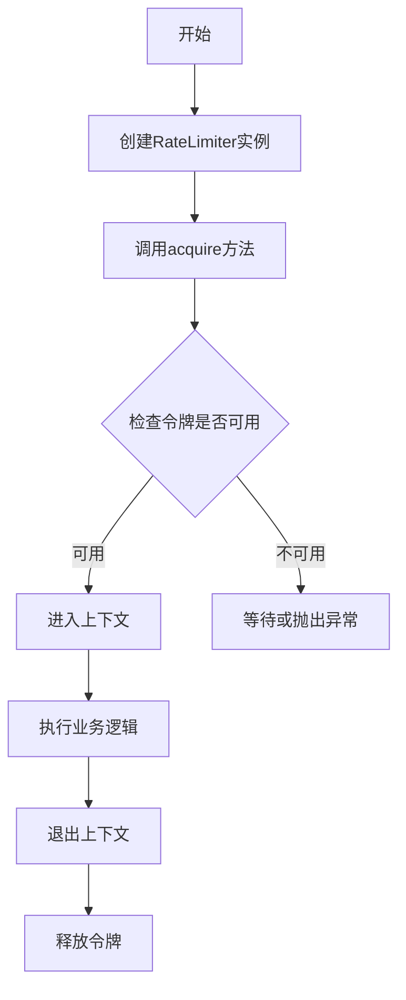
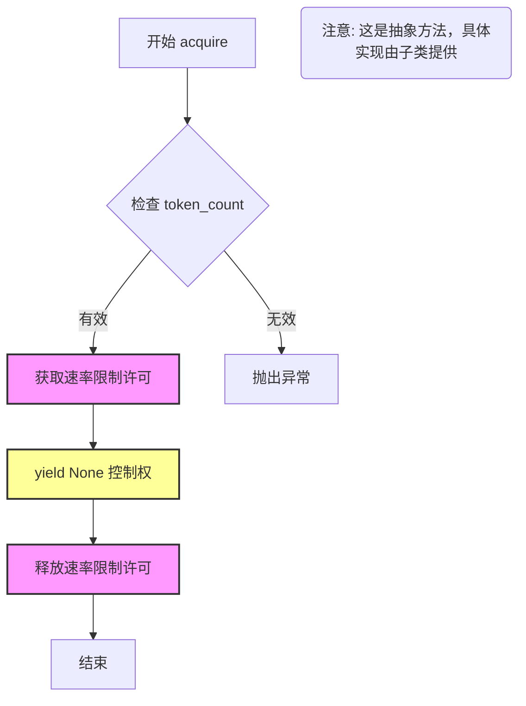

# `graphrag\packages\graphrag-llm\graphrag_llm\rate_limit\rate_limiter.py` 详细设计文档

这是一个抽象的速率限制器基类，定义了获取速率限制的接口，通过上下文管理器方式控制对资源的访问，支持根据令牌数量进行限流。

## 整体流程



## 类结构

```
RateLimiter (抽象基类)
└── 具体实现类 (待实现)
```

## 全局变量及字段


### `ABC`
    
Python内置抽象基类，用于定义抽象方法

类型：`abc.ABC`
    


### `abstractmethod`
    
装饰器，用于标记抽象方法

类型：`abc.abstractmethod`
    


### `Iterator`
    
迭代器类型提示

类型：`collections.abc.Iterator`
    


### `contextmanager`
    
上下文管理器装饰器

类型：`contextlib.contextmanager`
    


### `Any`
    
任意类型提示

类型：`typing.Any`
    


    

## 全局函数及方法


### `RateLimiter.__init__`

这是抽象基类 `RateLimiter` 的初始化方法，定义了一个接口规范，用于实现具体的限流器。所有继承该类的子类必须实现此方法以完成限流器的初始化配置。

参数：

- `**kwargs`：`Any`，可变关键字参数，用于接收子类实现时所需的任意配置参数，如速率限制阈值、时间窗口等。

返回值：`None`，构造函数不返回值。

#### 流程图

```mermaid
flowchart TD
    A[开始 __init__] --> B{子类调用 super().__init__}
    B --> C[调用 RateLimiter.__init__]
    C --> D[执行基类初始化逻辑]
    D --> E[结束]
    
    F[子类重写 __init__] --> G[接收 kwargs 参数]
    G --> H[执行子类特定初始化]
    H --> I[返回 NotImplementedError 提示需重写]
    
    style F fill:#f9f,stroke:#333
    style I fill:#ff9,stroke:#333
```

#### 带注释源码

```python
@abstractmethod
def __init__(
    self,
    **kwargs: Any,
) -> None:
    """
    Initialize the Rate Limiter.
    
    这是抽象基类的初始化方法，使用 @abstractmethod 装饰器标记为抽象方法。
    任何继承 RateLimiter 的子类都必须实现此方法。
    
    参数说明：
        **kwargs: 可变关键字参数，用于传递子类所需的任意配置选项。
                  子类可以定义自己的参数，如：
                  - max_requests: 最大请求数
                  - time_window: 时间窗口大小
                  - token_limit: token 限制数
    
    返回值：
        None: __init__ 方法不返回值，初始化逻辑直接在对象属性中完成。
    
    注意：
        由于使用了 @abstractmethod，基类本身不能直接实例化。
        子类实现时不应调用 super().__init__()，而是定义自己的初始化逻辑。
    """
    raise NotImplementedError
```


### `RateLimiter.acquire`

获取速率限制器的抽象方法，用于限制请求速率。子类必须实现此方法以提供具体的限流逻辑。

参数：

- `self`：RateLimiter，抽象基类的实例
- `token_count`：`int`，当前请求的估计prompt和响应token数量

返回值：`Iterator[None]`，这是一个上下文管理器，不返回任何值

#### 流程图



#### 带注释源码

```python
@abstractmethod
@contextmanager
def acquire(self, token_count: int) -> Iterator[None]:
    """
    Acquire Rate Limiter.
    获取速率限制器许可

    Args
    ----
        token_count: int
            The estimated number of prompt and response tokens for the current request.
            当前请求的估计prompt和响应token数量

    Yields
    ------
        None: This context manager does not return any value.
        None: 此上下文管理器不返回任何值
    """
    raise NotImplementedError
```

## 关键组件


### RateLimiter 类

抽象基类，定义了速率限制器的接口规范，提供了初始化和获取许可的抽象方法，供具体实现类继承和扩展。

### __init__ 抽象方法

初始化方法，接受任意关键字参数，用于配置速率限制器的各项参数。子类需要实现此方法以完成具体初始化逻辑。

### acquire 抽象方法

上下文管理器方法，接受 token_count 参数表示当前请求的估算 token 数量，用于获取速率限制许可。返回一个 Iterator[None]，不返回具体值。子类需要实现此方法以提供具体的限流逻辑。


## 问题及建议


### 已知问题

- **抽象方法实现不当**：`__init__` 方法使用 `raise NotImplementedError` 是错误的设计模式。抽象方法不应通过抛出异常来实现，而应使用 `pass` 或 `...` 作为方法体，或者提供默认实现。当前实现无法真正阻止实例化，且语义不正确。
- **缺少异常定义**：作为基础类，未定义任何自定义异常（如 `RateLimitExceededError`），子类需要自行定义，增加了不一致性风险。
- **无参数验证**：未对 `token_count` 参数进行有效性验证（如必须为正整数），子类实现时可能忽略这些边界检查。
- **上下文管理器返回类型不明确**：使用 `Iterator[None]` 作为上下文管理器的返回类型不够直观，应使用 `ContextManager[None]` 或 `Generator[None, None, None]` 以提高代码可读性。
- **缺少速率限制策略接口**：未定义速率限制策略的抽象接口（如令牌桶、滑动窗口、固定窗口等），子类实现缺乏统一约束。

### 优化建议

- **修复抽象方法**：将 `__init__` 方法体中的 `raise NotImplementedError` 替换为 `pass`，或者直接省略方法体（仅保留方法签名），使其成为真正的抽象方法。
- **添加自定义异常**：在模块级别定义 `RateLimitExceededException` 等异常类，提供标准化的错误处理接口。
- **增强参数验证**：在 `acquire` 方法中添加参数验证逻辑，确保 `token_count` 为正整数。
- **优化类型注解**：将 `Iterator[None]` 改为 `ContextManager[None]`，并从 `contextlib` 导入 `ContextManager`。
- **扩展抽象接口**：考虑添加 `reset()`、`get_wait_time()` 等方法，以支持更丰富的速率限制策略。

## 其它


### 设计目标与约束

该速率限制器抽象基类的设计目标是为LiteLLM提供统一的速率限制接口，支持基于令牌计数的请求控制。设计约束包括：1) token_count参数必须准确反映当前请求的prompt和response tokens总和；2) 实现类需保证线程安全；3) acquire方法必须作为上下文管理器使用，以确保资源正确释放；4) 不限制具体的速率限制算法实现（如令牌桶、漏桶、固定窗口等）。

### 错误处理与异常设计

由于该类为抽象基类，具体的错误处理由实现类决定。但基类设计暗示以下异常场景：1) Token计数无效（负数或非整数）时应抛出ValueError；2) 速率超限导致无法获取令牌时，实现类可选择抛出RateLimitExceeded异常或阻塞等待；3) 资源获取失败时应确保异常向上传播；4) 上下文管理器退出时应确保锁/资源被正确释放，即使发生异常。基类本身通过raise NotImplementedError强制子类实现具体逻辑。

### 数据流与状态机

速率限制器的基本数据流为：调用方传入token_count → 检查当前可用令牌是否充足 → 若充足则扣除令牌并yield进入临界区 → 临界区执行完成后退出。状态机包含三个状态：1) 就绪状态（Ready）- 初始状态，允许获取令牌；2) 获取状态（Acquired）- 上下文管理器持有中，临界区执行；3) 释放状态（Released）- 上下文管理器退出，令牌已归还/消耗。状态转换由acquire方法的enter和exit触发。

### 外部依赖与接口契约

该模块依赖以下外部契约：1) Python标准库abc.ABC用于定义抽象基类；2) typing.Any用于泛型参数；3) collections.abc.Iterator用于类型提示；4) contextlib.contextmanager用于上下文管理器装饰器。调用方契约：必须正确传入token_count整数值为正数；acquire必须作为async with或with语句使用；不应在上下文外调用release。实现方契约：必须实现__init__和acquire方法；acquire必须为上下文管理器且yield None；必须处理token_count的合法性检查；必须保证线程安全。

### 并发与线程安全考量

该抽象基类本身不涉及并发控制，但实现类必须考虑线程安全。具体要求包括：1) 多线程环境下同时调用acquire应正确同步；2) 令牌状态的修改必须是原子操作或被锁保护；3) 考虑使用threading.Lock或asyncio.Lock实现同步；4) 分布式场景下可能需要分布式锁或外部存储（如Redis）来实现跨进程速率限制。设计文档应建议实现类明确标注线程安全性。

### 资源管理与生命周期

速率限制器实例的生命周期管理：1) 实例通常在应用启动时创建并长期存活；2) __init__可能接受速率限制参数（如每分钟令牌数、突发容量等）；3) acquire方法不应创建昂贵资源，应设计为轻量级调用；4) 实现类应提供close/release方法用于清理（如释放底层连接）。上下文管理器的资源管理：enter时获取令牌或锁，exit时释放资源，即使异常发生也应保证清理。

### 配置与扩展性设计

该抽象基类为扩展提供了良好基础。配置方面：实现类可在__init__中接受速率限制策略相关参数（如rate、capacity、window_size等）。扩展性方面：1) 可通过子类实现不同的速率限制算法（令牌桶、滑动窗口、漏桶等）；2) 可添加监控/日志功能的混入类；3) 可支持持久化状态（如基于Redis的分布式速率限制）；4) 可添加预热期、冷却期等高级特性。设计文档应包含常见实现模式的说明。

### 性能考量与优化空间

性能要求：1) acquire方法调用应低延迟（建议<1ms）；2) 令牌扣减操作应为O(1)复杂度；3) 避免在临界区进行阻塞IO操作。优化建议：1) 使用无锁数据结构（如原子操作）替代锁；2) 对于固定窗口算法可使用原子计数器；3) 对于高精度需求可考虑使用time.perf_counter()替代time.time()；4) 批量操作可预分配令牌减少竞争。基类设计简洁，性能取决于具体实现。

### 使用示例与集成指南

该抽象基类的典型使用模式：
```python
# 调用方示例
limiter = ConcreteRateLimiter(rate=100, capacity=50)
with limiter.acquire(token_count=10):
    # 执行受速率限制的API调用
    response = call_api()
```
集成注意事项：1) 需根据实际API响应中的tokens使用量动态调整token_count；2) 应在应用初始化时创建limiter实例并复用；3) 多实例场景需考虑共享状态（如Redis）；4) 与重试机制配合时需考虑速率限制导致的失败。

### 常见实现模式参考

虽然基类未指定算法，但设计文档可提供常见实现参考：1) 令牌桶（Token Bucket）- 支持突发流量，适合API调用；2) 漏桶（Leaky Bucket）- 流量平滑，适合严格限流；3) 固定窗口（Fixed Window）- 实现简单但可能产生边界尖峰；4) 滑动窗口（Sliding Window）- 精度高但实现复杂。每种模式在__init__中接受不同参数（如rate、capacity、window等），acquire逻辑相应变化。


    