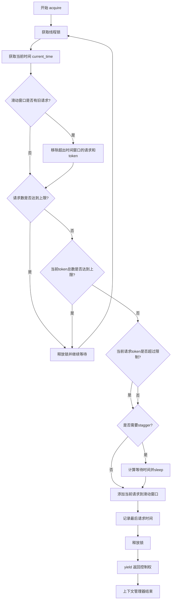
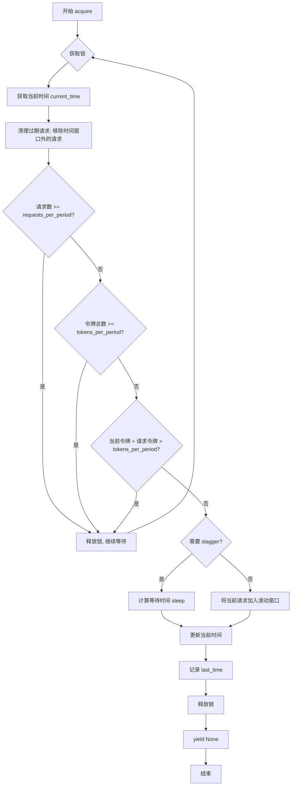

# `graphrag\packages\graphrag-llm\graphrag_llm\rate_limit\sliding_window_rate_limiter.py` 详细设计文档

这是一个滑动窗口速率限制器实现，继承自RateLimiter基类，通过维护请求时间队列和token计数队列来控制API调用频率，支持requests_per_period和tokens_per_period两种限制策略，使用线程锁确保多线程环境下的线程安全。

## 整体流程



## 类结构

```
RateLimiter (抽象基类/接口)
└── SlidingWindowRateLimiter (滑动窗口速率限制器实现)
```

## 全局变量及字段


### `SlidingWindowRateLimiter._rpp`
    
每周期最大请求数限制

类型：`int | None`
    


### `SlidingWindowRateLimiter._tpp`
    
每周期最大token数限制

类型：`int | None`
    


### `SlidingWindowRateLimiter._lock`
    
线程锁，保证线程安全

类型：`threading.Lock`
    


### `SlidingWindowRateLimiter._rate_queue`
    
存储请求时间戳的滑动窗口

类型：`deque[float]`
    


### `SlidingWindowRateLimiter._token_queue`
    
存储每个请求token数的队列

类型：`deque[int]`
    


### `SlidingWindowRateLimiter._period_in_seconds`
    
时间周期长度（秒）

类型：`int`
    


### `SlidingWindowRateLimiter._last_time`
    
上一次请求的时间戳

类型：`float | None`
    


### `SlidingWindowRateLimiter._stagger`
    
请求间最小时间间隔

类型：`float`
    
    

## 全局函数及方法


### `SlidingWindowRateLimiter.__init__`

初始化滑动窗口速率限制器，配置时间周期、请求数限制和令牌数限制等参数。

参数：

- `period_in_seconds`：`int`，时间限制周期，默认为 60 秒，用于定义速率限制的时间窗口大小
- `requests_per_period`：`int | None`，每个时间周期内允许的最大请求数，默认为 None（禁用请求数限制）
- `tokens_per_period`：`int | None`，每个时间周期内允许的最大令牌数，默认为 None（禁用令牌数限制）
- `**kwargs`：`Any`，额外的关键字参数，用于扩展或传递额外配置

返回值：`None`，构造函数不返回值

#### 流程图

```mermaid
flowchart TD
    A[开始 __init__] --> B[接收参数: period_in_seconds, requests_per_period, tokens_per_period, **kwargs]
    B --> C[设置实例变量 _rpp = requests_per_period]
    C --> D[设置实例变量 _tpp = tokens_per_period]
    D --> E[创建 threading.Lock 赋值给 _lock]
    E --> F[初始化空 deque[float] 赋值给 _rate_queue]
    F --> G[初始化空 deque[int] 赋值给 _token_queue]
    G --> H[设置 _period_in_seconds = period_in_seconds]
    H --> I[设置 _last_time = None]
    I --> J{_rpp 不为 None 且 _rpp > 0?}
    J -->|是| K[计算 stagger = _period_in_seconds / _rpp]
    J -->|否| L[结束]
    K --> L
```

#### 带注释源码

```python
def __init__(
    self,
    *,
    period_in_seconds: int = 60,
    requests_per_period: int | None = None,
    tokens_per_period: int | None = None,
    **kwargs: Any,
):
    """Initialize the Sliding Window Rate Limiter.

    Args
    ----
        period_in_seconds: int
            The time period in seconds for rate limiting.
        requests_per_period: int | None
            The maximum number of requests allowed per time period. If None, request limiting is disabled.
        tokens_per_period: int | None
            The maximum number of tokens allowed per time period. If None, token limiting is disabled.

    Raises
    ------
        ValueError
            If period_in_seconds is not a positive integer.
            If requests_per_period or tokens_per_period are not positive integers.
    """
    # 存储每个时间周期允许的最大请求数
    self._rpp = requests_per_period
    # 存储每个时间周期允许的最大令牌数
    self._tpp = tokens_per_period
    # 创建线程锁，用于保证并发访问时的线程安全
    self._lock = threading.Lock()
    # 滑动窗口队列：记录每个请求的时间戳，用于判断请求是否在时间窗口内
    self._rate_queue: deque[float] = deque()
    # 滑动窗口队列：记录每个请求消耗的令牌数，与 _rate_queue 配合使用
    self._token_queue: deque[int] = deque()
    # 时间窗口大小（秒）
    self._period_in_seconds = period_in_seconds
    # 记录上一次请求的时间戳，用于计算 stagger 间隔
    self._last_time: float | None = None

    # 如果配置了请求数限制，则计算请求之间的最小时间间隔（stagger）
    # stagger 用于将请求均匀分布在整个时间窗口内，避免突发流量
    if self._rpp is not None and self._rpp > 0:
        self._stagger = self._period_in_seconds / self._rpp
```


### `SlidingWindowRateLimiter.acquire`

获取速率限制许可的上下文管理器，通过滑动窗口算法控制请求频率和令牌使用量。

参数：

- `token_count`：`int`，当前请求的预计令牌数

返回值：`Iterator[None]`，上下文管理器，不返回具体值

#### 流程图



#### 带注释源码

```python
@contextmanager
def acquire(self, token_count: int) -> Iterator[None]:
    """
    Acquire Rate Limiter.

    Args
    ----
        token_count: The estimated number of tokens for the current request.

    Yields
    ------
        None: This context manager does not return any value.
    """
    # 使用无限循环持续检查直到获得许可
    while True:
        # 获取线程锁，确保线程安全
        with self._lock:
            # 获取当前时间戳
            current_time = time.time()

            # 使用两个滑动窗口跟踪周期内的请求和令牌
            # 将超出滑动窗口的旧请求和令牌丢弃
            # 清理过期请求：移除时间窗口之外的请求记录
            while (
                len(self._rate_queue) > 0
                and self._rate_queue[0] < current_time - self._period_in_seconds
            ):
                self._rate_queue.popleft()
                self._token_queue.popleft()

            # 如果滑动窗口仍超过请求限制，继续等待
            # 等待需要重新获取锁，允许其他线程查看它们的请求是否符合速率限制窗口
            # 对令牌限制比请求限制更有意义
            if (
                self._rpp is not None
                and self._rpp > 0
                and len(self._rate_queue) >= self._rpp
            ):
                continue  # 释放锁并继续等待

            # 检查当前令牌窗口是否超过令牌限制
            # 如果超过，继续等待
            # 这不考虑当前请求的令牌
            # 这是故意的，因为我们希望允许处理大于 tpm 但小于上下文窗口的请求
            # tpm 是速率/软限制，而不是上下文窗口限制的硬限制
            if (
                self._tpp is not None
                and self._tpp > 0
                and sum(self._token_queue) >= self._tpp
            ):
                continue  # 释放锁并继续等待

            # 此检查考虑当前请求的令牌使用量是否在令牌限制范围内
            # 如果当前请求的令牌超过令牌限制，则允许处理
            if (
                self._tpp is not None
                and self._tpp > 0
                and token_count <= self._tpp
                and sum(self._token_queue) + token_count > self._tpp
            ):
                continue  # 释放锁并继续等待

            # 如果有之前的调用，检查是否需要错开等待
            if (
                self._stagger > 0
                and (
                    self._last_time  # 如果这是第一次访问速率限制器，则为 None
                    and current_time - self._last_time
                    < self._stagger  # 如果经过的时间超过错开时间，则继续
                )
            ):
                # 计算并等待错开时间
                time.sleep(self._stagger - (current_time - self._last_time))
                # 重新获取当前时间
                current_time = time.time()

            # 将当前请求添加到滑动窗口
            self._rate_queue.append(current_time)
            self._token_queue.append(token_count)
            self._last_time = current_time
            break  # 成功获取许可，退出循环
    yield  # 返回控制权给调用者
```

## 关键组件


### 滑动窗口速率限制器 (SlidingWindowRateLimiter)

该组件实现了基于滑动窗口算法的速率限制器，支持按请求数和Token数两种维度的限流，通过维护两个独立的时间窗口队列实现精确的流量控制，适用于高并发API调用的限流场景。

### 核心属性

#### _rpp: int | None
最大请求数限制，标识每时间段允许的最大请求次数。

#### _tpp: int | None
最大Token数限制，标识每时间段允许的最大Token数量。

#### _lock: threading.Lock
线程锁，用于保证在多线程环境下对共享资源的安全访问。

#### _rate_queue: deque[float]
时间戳队列，记录每个请求的到达时间点，用于判断请求是否在当前滑动窗口内。

#### _token_queue: deque[int]
Token数队列，记录每个请求消耗的Token数量，与时间戳队列配合实现Token限流。

#### _period_in_seconds: int
限流时间窗口长度，以秒为单位，默认为60秒。

#### _last_time: float | None
上一次请求的时间戳，用于计算请求间的时间间隔以实现stagger机制。

#### _stagger: float
请求间最小时间间隔，通过period_in_seconds / requests_per_period计算得出，用于平滑请求分发。

### 核心方法

#### __init__(period_in_seconds, requests_per_period, tokens_per_period, **kwargs)
初始化方法，设置限流参数并创建必要的内部数据结构。

#### acquire(token_count) -> Iterator[None]
上下文管理器，获取限流许可。内部通过while循环持续检查是否满足所有限流条件，包括请求数限制、Token数限制和时间间隔限制，不满足条件时持续等待。

### 关键设计决策

#### 双重滑动窗口
同时维护请求数窗口和Token数窗口，允许请求在任一维度超过限制时等待，实现更精细的流量控制。

#### 软限制策略
当请求Token数超过tpp但小于上下文窗口大小时，仍然允许请求通过，体现tpp为软限制的设计理念。

#### Stagger机制
通过_last_time记录上一次请求时间，确保相邻请求之间至少间隔_stagger时间，避免突发流量。

### 潜在优化空间

1. **性能优化**：每次acquire都调用sum(self._token_queue)遍历整个队列计算Token总数，时间复杂度为O(n)，可考虑使用滑动和（sliding sum）维护当前窗口Token总数，将复杂度降为O(1)。

2. **精度改进**：stagger计算使用除法可能产生浮点数精度问题，且sleep精度受系统调度影响，可考虑使用整数时间戳或更精确的定时机制。

3. **可观测性**：缺少限流事件的日志记录和指标暴露，建议添加请求被限流次数、等待时间等监控指标。

4. **超时支持**：acquire方法为无限等待模式，缺乏超时机制，在某些场景下可能导致线程永久阻塞。

### 外部依赖

继承自graphrag_llm.rate_limit.rate_limiter.RateLimiter基类，依赖标准库threading、time、collections.deque和contextlib.contextmanager。


## 问题及建议


### 已知问题

-   **死锁/活锁风险**：`acquire`方法中的`while True`循环在所有`continue`分支中都未释放锁。当请求或token超过限制时，代码会持续持有锁进行无限循环，导致其他线程饥饿（starvation）。注释提到"Waiting requires reacquiring the lock"，但实际代码并未实现锁的释放和重新获取。
-   **Stagger逻辑缺陷**：stagger检查条件`self._last_time and current_time - self._last_time < self._stagger`在首次调用时（`_last_time`为None）会被短路，导致首次请求完全跳过stagger检查，不符合预期的速率控制行为。
-   **Token限制检查不准确**：代码有两层token检查，但注释明确说明"This does not account for the tokens from the current request"，这可能导致实际token使用量超过配置的`tpp`限制。
-   **性能低效**：每次循环都调用`sum(self._token_queue)`重新计算队列总和，时间复杂度为O(n)，在高频调用场景下性能较差。
-   **输入验证缺失**：未对`token_count`参数进行有效性验证（如负数、零值、非整数），可能导致不可预期行为。
-   **Spurious Wakeups风险**：使用`time.sleep()`进行等待时没有使用条件变量或额外的退出机制，可能受到系统中断影响。

### 优化建议

-   **修复锁管理**：在需要等待时应释放锁，使用`threading.Condition`或`threading.Event`实现真正的等待和唤醒机制，避免线程饥饿。
-   **修正Stagger逻辑**：调整条件判断确保首次请求也能正确应用stagger限制，或者在`_last_time`为None时设置初始值。
-   **优化Token计算**：考虑使用滑动窗口前缀和或定期清理历史数据的方式，减少重复计算开销。
-   **添加输入验证**：在`acquire`方法开始时添加参数有效性检查，确保`token_count`为正整数。
-   **增强错误处理**：添加对异常输入的明确错误抛出，提高API的健壮性。
-   **添加超时机制**：为`acquire`方法提供可选的超时参数，避免无限等待。

## 其它


### 设计目标与约束

**设计目标**：实现一个滑动窗口速率限制器（Sliding Window Rate Limiter），用于在多线程环境下控制API请求频率，支持请求数量限制（requests_per_period）和Token数量限制（tokens_per_period）两种限流模式。

**设计约束**：
- 必须继承自RateLimiter基类
- 必须线程安全，支持高并发场景
- 必须使用滑动窗口算法而非固定窗口
- token限制为软限制（soft limit），允许当前请求token超出限制

### 错误处理与异常设计

**初始化参数验证**：
- `period_in_seconds`：必须是正整数，否则抛出ValueError
- `requests_per_period`：如果提供，必须是正整数，否则抛出ValueError
- `tokens_per_period`：如果提供，必须是正整数，否则抛出ValueError

**异常类型**：
- ValueError：参数验证失败时抛出

**容错机制**：
- 当请求token数量超过tpp时，仍然允许请求通过（设计决策：tpm为软限制/速率限制，非硬性的上下文窗口限制）
- 无限流配置时（rpp和tpp都为None），acquire方法直接放行

### 数据流与状态机

**数据结构**：
- `_rate_queue`：存储请求时间戳的滑动窗口
- `_token_queue`：存储请求token数量的滑动窗口
- 两个队列一一对应，通过下标关联

**状态转换**：
1. **获取锁**：进入临界区
2. **清理过期数据**：移除超出时间窗口的旧请求
3. **检查请求限制**：如果rpp有限制且当前窗口已满，返回步骤1重试
4. **检查token限制**：如果tpp有限制且当前窗口token已满，返回步骤1重试
5. **检查当前请求token**：如果当前请求token加上窗口token超过限制，返回步骤1重试
6. **检查stagger**：如果配置了stagger且距离上次请求时间不足，等待
7. **添加请求**：将当前请求添加到滑动窗口
8. **释放锁**：退出临界区，允许其他线程进入

### 外部依赖与接口契约

**依赖项**：
- `threading`：提供线程锁（threading.Lock）实现线程安全
- `time`：提供time.time()获取当前时间戳
- `collections.deque`：提供高效的双端队列，用于存储滑动窗口数据
- `contextlib.contextmanager`：提供上下文管理器装饰器
- `graphrag_llm.rate_limit.rate_limiter.RateLimiter`：基类接口

**接口契约**：
- `acquire(token_count: int) -> Iterator[None]`：上下文管理器，接收预估token数量，无返回值
- 基类RateLimiter必须提供acquire方法签名

### 线程安全性分析

**线程安全机制**：
- 使用`threading.Lock`保护所有共享状态的修改
- 在锁内完成所有检查和更新操作
- 使用`deque`的原子操作（popleft、append）保证队列操作的线程安全

**潜在竞态条件**：
- `time.sleep()`在锁外执行，避免长时间占用锁导致其他线程阻塞
- 锁释放后到sleep完成期间，其他线程可能插入，需在重新获取锁后重新检查条件

### 性能考虑

**时间复杂度**：
- 每次acquire调用最坏情况O(n)，n为滑动窗口内的请求数量
- 使用deque的popleft()为O(1)操作

**空间复杂度**：
- O(n)，n为_requests_per_period（请求限制数量）

**优化建议**：
- 当rpp很大时，可以考虑使用时间戳索引替代线性扫描
- stagger等待逻辑可以优化，减少多次唤醒开销

### 使用示例

```python
# 创建限流器：60秒内最多100次请求，每分钟最多100000 tokens
limiter = SlidingWindowRateLimiter(
    period_in_seconds=60,
    requests_per_period=100,
    tokens_per_period=100000
)

# 使用限流器
with limiter.acquire(token_count=1000):
    # 执行API请求
    pass
```

### 配置说明

| 参数 | 类型 | 默认值 | 描述 |
|------|------|--------|------|
| period_in_seconds | int | 60 | 时间窗口大小（秒） |
| requests_per_period | int \| None | None | 每时间窗口最大请求数，None表示不限流 |
| tokens_per_period | int \| None | None | 每时间窗口最大token数，None表示不限流 |
| **kwargs | Any | - | 传递给父类的额外参数 |

### 关键组件职责

| 组件 | 职责 |
|------|------|
| _lock | 保护共享状态的线程锁 |
| _rate_queue | 存储请求时间戳的滑动窗口 |
| _token_queue | 存储请求token数量的滑动窗口 |
| _period_in_seconds | 滑动窗口的时间长度 |
| _rpp | 请求数限制阈值 |
| _tpp | token数限制阈值 |
| _stagger | 请求间最小时间间隔 |
| _last_time | 上次请求的时间戳 |

    