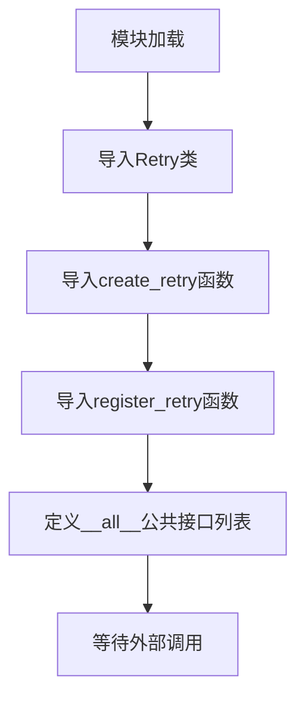
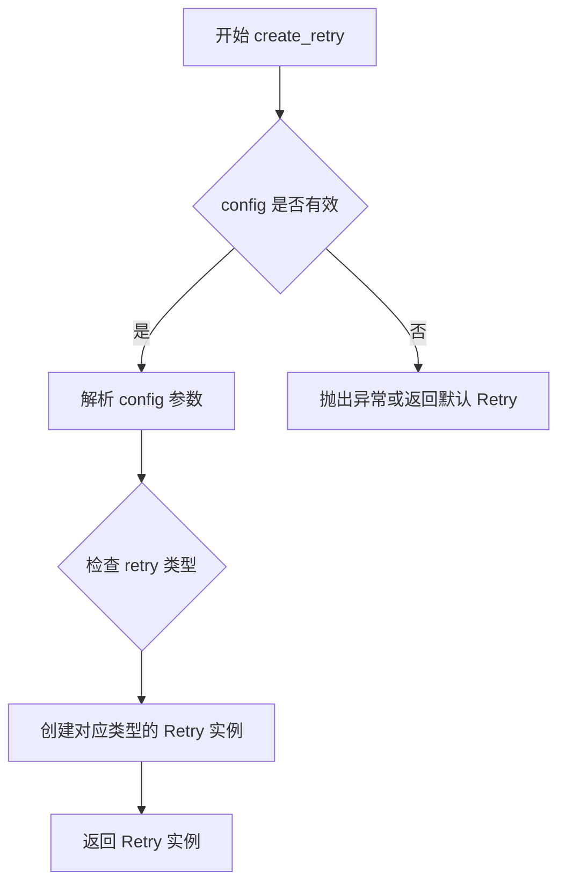
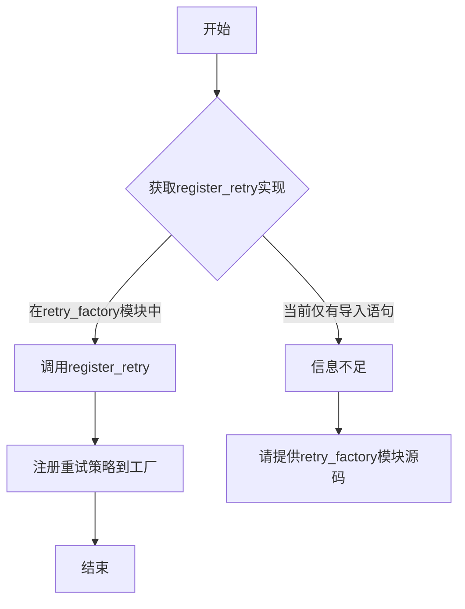

# `graphrag\packages\graphrag-llm\graphrag_llm\retry\__init__.py` 详细设计文档

这是graphrag-llm项目的重试模块入口文件，通过统一导出Retry类、create_retry和register_retry函数，为外部调用者提供重试机制的统一公共API接口。

## 整体流程



## 类结构

```
retry (包)
├── __init__.py (包入口)
├── retry.py (Retry类实现)
└── retry_factory.py (工厂函数实现)
```

## 全局变量及字段


### `__all__`
    
定义模块的公共接口，列出允许外部导入的符号，包括Retry类、create_retry和register_retry函数

类型：`list[str]`
    


    

## 全局函数及方法


### `create_retry`

该函数是一个工厂函数，用于根据配置参数创建并返回一个 `Retry` 实例，支持动态注册和创建不同的重试策略。

参数：

- `config`：`dict`，重试配置字典，包含重试次数、延迟时间等参数

返回值：`Retry`，返回创建的重试实例对象

#### 流程图



#### 带注释源码

```
# 从 retry_factory 模块导入 create_retry 函数
# 该函数在 graphrag_llm/retry/retry_factory.py 中定义
from graphrag_llm.retry.retry_factory import create_retry

# 函数签名（基于工厂函数模式推断）
# def create_retry(config: dict) -> Retry:
#     """
#     根据配置创建重试实例
#     
#     参数:
#         config: 包含 retry_type, max_attempts, base_delay 等配置
#     返回:
#         Retry: 重试策略实例
#     """
#     ...
```

---

**注意**：提供的代码片段仅为 `graphrag_llm/retry/__init__.py`，其中仅包含 `create_retry` 函数的**导入语句**，未包含该函数的具体实现源码。该函数的实际实现位于 `graphrag_llm/retry/retry_factory.py` 文件中。如需完整的函数实现源码，请提供该文件的内容。


### register_retry

该函数用于注册自定义的重试策略到重试工厂，使得系统能够通过名称动态创建相应的重试实例。

参数：

-  `{参数名称}`：`{参数类型}`，{参数描述}
- （注：提供的代码中仅包含该函数的导入语句，未包含其实际实现代码，无法确定具体参数）

返回值：`{返回值类型}`，{返回值描述}

（注：无法确定返回值类型和描述，因为未获取到实际实现代码）

#### 流程图



#### 带注释源码

```
# 这是一个模块初始化文件 (包级别)
# 位于: graphrag_llm/retry/__init__.py

# 导入Retry类 - 具体实现位于retry模块中
from graphrag_llm.retry.retry import Retry

# 导入create_retry和register_retry函数
# 这些函数的具体实现位于retry_factory模块中
from graphrag_llm.retry.retry_factory import create_retry, register_retry

# 定义模块的公共接口
__all__ = [
    "Retry",
    "create_retry",
    "register_retry",
]

# 注意：register_retry函数的具体实现需要在
# graphrag_llm/retry/retry_factory.py 文件中查看
# 当前提供的代码片段中不包含该函数的实际实现代码
```

---

**注意**：当前提供的代码仅为模块的`__init__.py`文件，其中仅包含对`register_retry`函数的导入语句。要获取完整的函数实现（包括参数、返回值、流程图和注释源码），需要查看`graphrag_llm/retry/retry_factory.py`源文件。


## 关键组件


### Retry 模块核心功能

该代码是graphrag-llm项目的重试机制模块的入口文件，通过统一的API接口暴露重试功能，支持创建和注册不同类型的重试策略，用于处理LLM调用失败时的自动重试逻辑。

### 文件运行流程

该__init__.py文件在模块导入时首先执行，主要完成两个任务：1) 从子模块retry.py和retry_factory.py导入核心类和函数；2) 通过__all__定义公共API接口，使外部可以通过from graphrag_llm.retry import Retry, create_retry, register_retry方式使用重试功能。

### 关键组件信息

#### Retry 类
重试策略的核心抽象类，封装重试逻辑的具体实现，包括重试次数、退避策略、异常处理等机制。

#### create_retry 函数
工厂函数，用于根据配置创建相应类型的Retry实例，支持灵活的重试策略配置。

#### register_retry 函数
注册函数，用于将自定义的重试策略类型注册到工厂系统中，使系统能够识别和使用新的重试策略。

### 潜在技术债务与优化空间

1. **缺少类型注解** - 当前代码未提供详细的类型注解，建议添加完整的类型提示以提升代码可维护性
2. **文档不完整** - __init__.py缺少模块级文档字符串，建议补充模块功能说明
3. **配置外部化** - 重试策略的关键参数（如最大重试次数、超时时间）建议支持运行时配置
4. **日志能力** - 建议增强重试过程的日志记录，便于问题排查和监控
5. **测试覆盖** - 需要确保重试逻辑的充分测试覆盖，特别是边界条件和异常场景


## 问题及建议


### 已知问题

-   模块级文档字符串缺失，未说明该模块的用途和设计意图
-   缺少类型注解（如 `from __future__ import annotations`），不利于静态类型检查和 IDE 自动补全
-   直接导入子模块未做异常处理，若 `retry` 或 `retry_factory` 子模块不存在会导致隐式的 `ModuleNotFoundError`
-   `__all__` 列表未按字母顺序排列，不符合 PEP 8 导入规范
-   未声明 `__version__` 或 `__author__` 等模块元信息

### 优化建议

-   为模块添加文档字符串，说明其为 retry 模块的公共 API 入口点
-   考虑添加 `from __future__ import annotations` 以支持前瞻性类型注解
-   使用 `try-except` 包装导入或添加明确的依赖说明，提高错误信息的可读性
-   将 `__all__` 列表按字母顺序排列：`["Retry", "create_retry", "register_retry"]`
-   考虑添加版本信息，例如 `__version__ = "0.1.0"`，便于版本追踪和兼容性管理


## 其它


### 设计目标与约束

本模块旨在为 graphrag-llm 提供统一的通用重试机制，支持多种重试策略的可插拔式注册与创建，降低业务层处理临时性故障的复杂度。约束包括：必须保持与现有重试策略的兼容性，重试逻辑应遵循幂等性原则，模块需轻量级且无外部运行时依赖（仅依赖 Python 标准库或项目内部模块）。

### 错误处理与异常设计

模块主要处理两类错误：一是重试过程中的临时性异常（如网络超时、服务不可用），由 Retry 类内部捕获并根据策略决定是否继续；二是配置或注册阶段的合法性异常（如无效的重试参数、重复的策略名称），通过 ValueError 或 TypeError 向上传递。所有重试相关的异常应保留原始堆栈信息以便于调试。

### 外部依赖与接口契约

本模块依赖 graphrag_llm.retry.retry 模块中的 Retry 类和 graphrag_llm.retry.retry_factory 模块中的工厂函数。接口契约如下：Retry 类提供 execute 方法接收可调用对象和参数，执行失败时依据策略进行重试；create_retry 函数接收策略名称和配置参数返回对应 Retry 实例；register_retry 函数接收策略名称和策略类用于注册新的重试策略。所有公开接口均需保证线程安全性。

### 配置说明

模块通过 create_retry 函数的参数进行配置，典型配置项包括：max_attempts（最大重试次数，默认为3）、initial_delay（初始重试延迟秒数）、max_delay（最大延迟上限）、exponential_base（指数退避基数）、jitter（是否添加随机抖动）。配置可通过环境变量或配置文件覆盖，具体方式由调用方业务层决定。

### 使用示例

```python
from graphrag_llm import create_retry

# 创建指数退避重试策略
retry = create_retry("exponential", max_attempts=3, initial_delay=1.0)

# 对不稳定操作进行重试
result = retry.execute(unstable_api_call, arg1, kwarg1=value)
```

### 性能考虑

重试模块本身应保持低开销，避免在重试间隔期间占用大量计算资源。建议使用指数退避策略时设置最大延迟上限以防止长时间阻塞。对于高频调用的场景，可考虑添加重试结果缓存或熔断器模式。

### 安全性考虑

重试模块不直接涉及敏感数据处理，但需注意：重试过程中不应记录敏感请求参数（如密码、Token）；对于包含重试逻辑的 API 调用，需确保上游服务具备幂等性以避免重复操作风险。

### 测试策略

建议采用分层测试策略：单元测试覆盖 Retry 类核心逻辑（成功、单次失败、多次失败达到上限）和工厂函数的注册/创建功能；集成测试验证重试策略在实际 API 调用场景中的行为；混沌测试模拟各类临时故障以验证重试机制的鲁棒性。


    