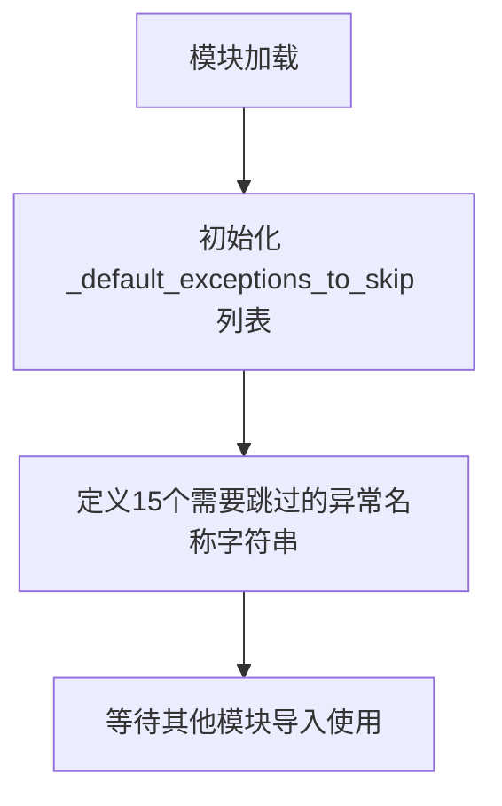

# `graphrag\packages\graphrag-llm\graphrag_llm\retry\exceptions_to_skip.py` 详细设计文档

该代码定义了一个全局列表变量 _default_exceptions_to_skip，包含了在重试机制中需要跳过的API异常名称，用于实现API调用时的错误处理和重试策略。

## 整体流程



## 类结构

```
模块级全局变量
└── _default_exceptions_to_skip (列表)
```

## 全局变量及字段


### `_default_exceptions_to_skip`
    
一个包含异常类名的列表，用于指定在重试机制中需要跳过的异常类型

类型：`List[str]`
    


    

## 全局函数及方法


## 关键组件


### _default_exceptions_to_skip

一个字符串列表，定义了重试机制中需要跳过的异常类型名称，用于避免对特定客户端错误进行不必要的重试。

### 全局变量

#### _default_exceptions_to_skip
- **类型**: List[str]
- **描述**: 存储需要跳过重试的异常类名字符串列表，包含 15 种常见的客户端错误类型，如认证失败、权限拒绝、请求参数错误等。

### 关键组件信息

#### 异常过滤列表
该列表定义了重试策略的白名单机制，确保以下类型的错误不会触发重试：认证错误 (AuthenticationError)、权限错误 (PermissionDeniedError)、无效请求 (InvalidRequestError)、上下文窗口超出 (ContextWindowExceededError) 等客户端侧错误，以及服务不可用 (ServiceUnavailableError) 等服务端临时错误。

### 潜在的技术债务或优化空间

1. **硬编码列表**: 异常列表被硬编码在模块级别，缺乏灵活性，建议考虑是否可通过配置或参数动态传入
2. **字符串依赖**: 使用字符串名称而非实际的异常类对象，增加了运行时出错的风险
3. **文档缺失**: 缺少对该列表用途和使用场景的文档说明

### 设计目标与约束

- **设计目标**: 为重试机制提供异常过滤能力，避免对不可恢复的错误进行无效重试
- **约束**: 仅包含字符串形式的异常名称，需要与实际的异常类名匹配才能生效

### 错误处理与异常设计

该列表用于重试拦截器中，在捕获异常后通过异常名称判断是否需要跳过重试。如果抛出的异常类名存在于此列表中，则终止重试流程；否则继续执行重试逻辑。


## 问题及建议


### 已知问题

-   **硬编码异常名称字符串**：使用字符串列表而非异常类或类型，存在拼写错误风险，IDE无法提供类型检查和自动补全
-   **缺乏类型注解**：全局变量`_default_exceptions_to_skip`没有类型提示，降低代码可读性和静态分析能力
-   **命名约定不符**：私有变量命名（下划线开头）但实际作为默认配置可能被外部引用，应考虑使用大写常量命名
-   **缺少上下文文档**：未说明这些异常应从哪个模块导入、具体来源以及为何这些异常需要跳过重试
-   **维护性差**：若实际异常类名称变更，需要手动同步更新此列表，容易遗漏导致逻辑错误

### 优化建议

-   **使用异常类而非字符串**：考虑定义实际的异常类集合或使用`type`类型，例如`_default_exceptions_to_skip: tuple[type[Exception], ...]`
-   **添加类型注解**：明确标注列表类型，如`_default_exceptions_to_skip: tuple[str, ...]`
-   **补充文档注释**：为每个异常添加说明，解释其被排除在重试之外的原因
-   **考虑配置化**：提供配置文件或参数机制，使该列表可被外部覆盖，而非硬编码
-   **使用枚举或常量类**：如异常来源稳定，可考虑使用`Enum`或`frozenset`提高不可变性
-   **添加验证机制**：在模块初始化时验证列表中的异常名称是否与实际存在的异常类匹配

## 其它


### 设计目标与约束

该模块的设计目标是提供一个可配置的异常名称列表，用于在重试机制中明确指定哪些异常类型不应该被重试。设计约束包括：列表中的元素必须为字符串类型，且异常名称应与实际抛出的异常类名保持一致，以确保重试跳过逻辑能够正确匹配。

### 错误处理与异常设计

该代码本身不涉及异常处理逻辑，其作为异常配置数据供外部重试机制使用。错误场景包括：如果列表中的异常名称与实际运行时抛出的异常类名不匹配，将导致重试跳过逻辑失效。因此需要确保异常名称的准确性，建议与实际异常类定义保持同步更新。

### 外部依赖与接口契约

该模块无外部依赖，仅作为配置数据提供者。接口契约方面：该列表供重试框架读取和使用，调用方应保证只读访问，不应直接修改该全局变量。如需自定义，应通过参数传递或继承方式实现。

### 安全性考虑

该代码不涉及敏感数据处理，安全性风险较低。但需注意异常名称列表不应包含可能导致信息泄露的自定义异常名称，保持与官方异常类命名一致即可。

### 兼容性考虑

该模块设计为通用配置，适用于不同的重试场景。兼容性考虑包括：异常名称列表应与使用的AI框架版本保持同步，当框架新增或废弃某些异常类时，需要相应更新该列表。

### 使用示例

```python
# 导入异常列表
from exceptions_to_skip import _default_exceptions_to_skip

# 在重试逻辑中使用
def should_skip_retry(exception):
    exception_name = type(exception).__name__
    return exception_name in _default_exceptions_to_skip
```

### 配置管理说明

该全局变量设计为默认值，可通过以下方式进行配置覆盖：
1. 在调用重试函数时传入自定义的异常列表参数
2. 在子类中重写该变量
3. 通过环境变量或配置文件动态加载


    