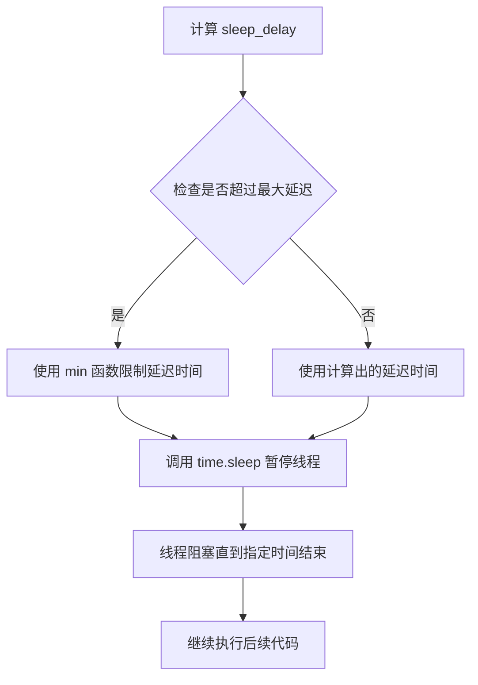
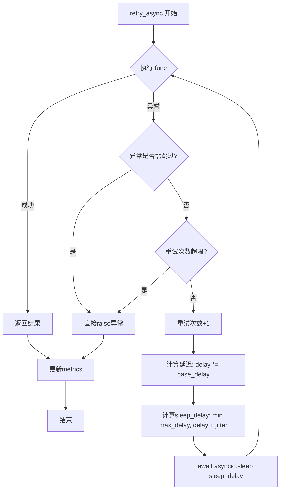
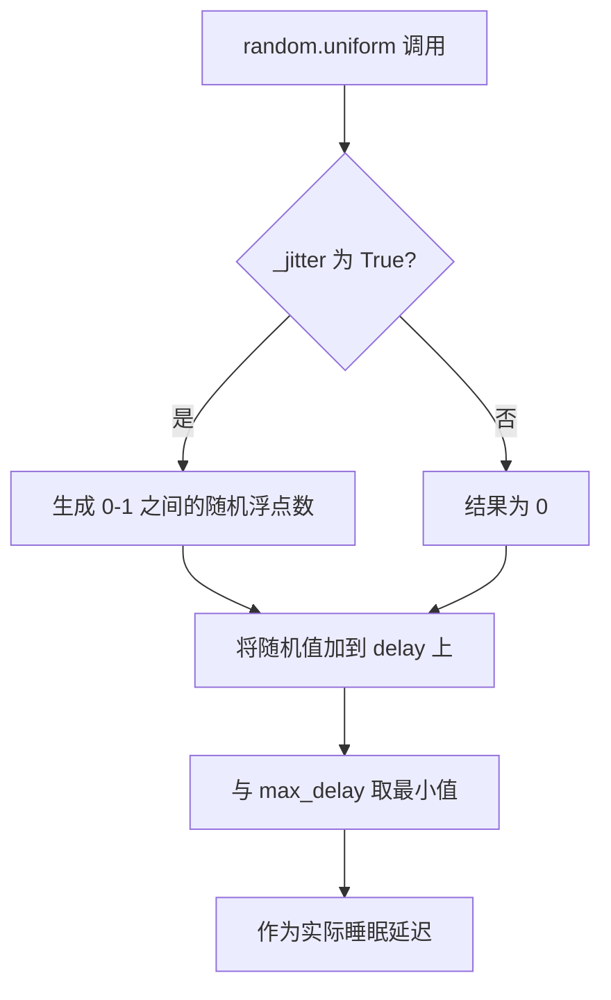
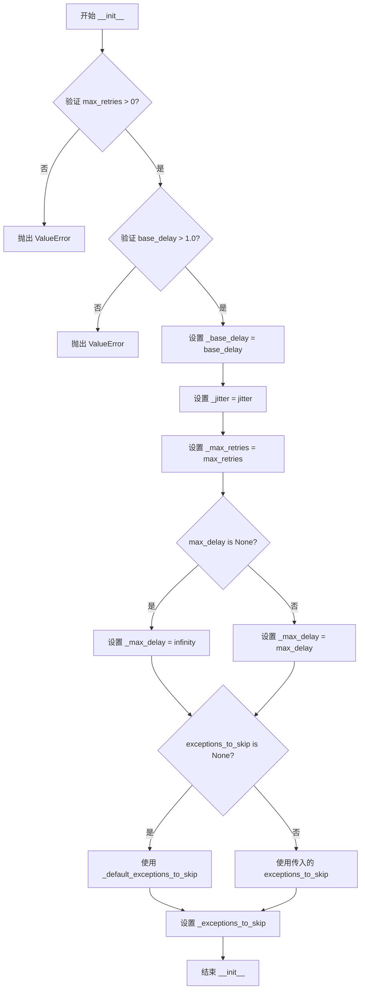

# `graphrag\packages\graphrag-llm\graphrag_llm\retry\exponential_retry.py` 详细设计文档

实现指数退避重试机制的类，支持同步和异步函数的重试，通过指数增长的延迟间隔和可选的抖动来避免重试风暴，继承自Retry抽象基类。

## 整体流程

```mermaid
graph TD
    A[开始重试] --> B{执行函数}
B --> C{是否成功?}
C -- 是 --> D[返回结果]
C -- 否 --> E{异常类是否需跳过?}
E -- 是 --> F[立即抛出异常]
E -- 否 --> G{重试次数超限?}
G -- 是 --> H[抛出异常]
G -- 否 --> I[计算延迟时间]
I --> J[延迟 = min(最大延迟, 基础延迟 * 2^重试次数 + 抖动)]
J --> K[执行sleep]
K --> B
```

## 类结构

```
Retry (抽象基类)
└── ExponentialRetry
```

## 全局变量及字段


### `_default_exceptions_to_skip`
    
默认需要跳过的异常类名列表

类型：`list[str]`
    


### `ExponentialRetry._base_delay`
    
基础延迟乘数，用于指数退避计算

类型：`float`
    


### `ExponentialRetry._jitter`
    
是否启用延迟抖动

类型：`bool`
    


### `ExponentialRetry._max_retries`
    
最大重试次数

类型：`int`
    


### `ExponentialRetry._max_delay`
    
最大延迟时间

类型：`float`
    


### `ExponentialRetry._exceptions_to_skip`
    
需要跳过重试的异常类名列表

类型：`list[str]`
    
    

## 全局函数及方法


### `time.sleep`

这是 Python 标准库中的同步延迟函数，用于阻塞当前线程指定的时间。

参数：

- `seconds`：`float`，延迟的秒数，表示线程需要暂停执行的时间长度

返回值：`None`，该函数不返回任何值

#### 流程图



#### 带注释源码

```python
# 计算下一次重试的延迟时间
delay *= self._base_delay  # 将延迟乘以基础延迟倍数，实现指数增长
sleep_delay = min(
    self._max_delay,  # 最大延迟上限
    delay + (self._jitter * random.uniform(0, 1)),  # 加上随机抖动以避免雷群效应
)

# 调用 time.sleep 进行同步阻塞延迟
# 参数: sleep_delay - 延迟的秒数（float 类型）
# 返回值: None（无返回值，线程在此暂停指定时间）
time.sleep(sleep_delay)
```

---

### `ExponentialRetry.retry` 中的 `time.sleep` 调用上下文

参数：

- `sleep_delay`：`float`，计算后的延迟时间，包含指数退避和随机抖动

返回值：`None`，`time.sleep` 本身不返回值，但方法会继续执行重试逻辑

#### 带注释源码

```python
def retry(self, *, func: Callable[..., Any], input_args: dict[str, Any]) -> Any:
    """Retry a synchronous function."""
    retries: int = 0
    delay = 1.0
    metrics: Metrics | None = input_args.get("metrics")
    while True:
        try:
            return func(**input_args)
        except Exception as e:
            # 检查异常是否在需要跳过的列表中
            if e.__class__.__name__ in self._exceptions_to_skip:
                raise

            # 检查是否已达最大重试次数
            if retries >= self._max_retries:
                raise
            
            retries += 1
            delay *= self._base_delay  # 指数增长延迟
            
            # 计算实际睡眠延迟：取最大延迟和(延迟+抖动)的最小值
            sleep_delay = min(
                self._max_delay,
                delay + (self._jitter * random.uniform(0, 1)),
            )

            # 同步阻塞：当前线程暂停执行 sleep_delay 秒
            time.sleep(sleep_delay)
        finally:
            # 无论成功还是失败，都更新指标
            if metrics is not None:
                metrics["retries"] = retries
                metrics["requests_with_retries"] = 1 if retries > 0 else 0
```


### `asyncio.sleep`

异步延迟函数，用于在异步上下文中暂停协程执行一段指定时间。在 `ExponentialRetry.retry_async` 方法中用于实现指数退避重试策略的延迟等待。

参数：

- `delay` / `sleep_delay`：`float`，延迟时间（秒），表示暂停执行的时长

返回值：`Coroutine[Any, Any, None]`（协程对象），一个可等待的协程，暂停当前协程指定时间后恢复执行

#### 流程图



#### 带注释源码

```python
# 在 ExponentialRetry.retry_async 方法中使用 asyncio.sleep
async def retry_async(
    self,
    *,
    func: Callable[..., Awaitable[Any]],
    input_args: dict[str, Any],
) -> Any:
    """重试异步函数."""
    retries: int = 0
    delay = 1.0
    metrics: Metrics | None = input_args.get("metrics")
    while True:
        try:
            return await func(**input_args)
        except Exception as e:
            # 检查异常是否在需跳过的列表中
            if e.__class__.__name__ in self._exceptions_to_skip:
                raise
            
            # 检查是否已达最大重试次数
            if retries >= self._max_retries:
                raise
            
            # 递增重试计数
            retries += 1
            
            # 计算指数退避延迟：delay = delay * base_delay
            delay *= self._base_delay
            
            # 计算最终睡眠延迟：取最大值限制，并添加随机抖动
            sleep_delay = min(
                self._max_delay,
                delay + (self._jitter * random.uniform(0, 1)),  # noqa: S311
            )

            # ============================================
            # asyncio.sleep - 异步延迟函数调用点
            # ============================================
            # 暂停当前协程执行 sleep_delay 秒
            # 期间让出控制权，允许其他协程运行
            # 这是一个非阻塞的异步等待，不同于 time.sleep
            await asyncio.sleep(sleep_delay)
        finally:
            # 更新重试指标
            if metrics is not None:
                metrics["retries"] = retries
                metrics["requests_with_retries"] = 1 if retries > 0 else 0
```


### `random.uniform`

生成一个 0 到 1 之间的随机浮点数，用于在指数退避重试策略中增加随机抖动（Jitter），以避免雷鸣羊群效应（Thundering Herd Problem）。

参数：

- `a`： `float`，随机范围的下界（包含），此处为 `0`
- `b`： `float`，随机范围的上界（不包含），此处为 `1`

返回值： `float`，返回 `[0, 1)` 范围内的随机浮点数

#### 流程图



#### 带注释源码

```python
# 在 ExponentialRetry.retry 方法中：
sleep_delay = min(
    self._max_delay,
    delay + (self._jitter * random.uniform(0, 1)),  # noqa: S311
)
# 解释：
# - self._jitter 是布尔值，控制是否启用抖动
# - random.uniform(0, 1) 生成 [0, 1) 范围内的随机浮点数
# - 当 _jitter=True 时，添加 0-1 秒的随机抖动
# - 当 _jitter=False 时，不添加抖动（False * uniform = 0）
# - 最终延迟 = min(最大延迟限制, 基础延迟 + 随机抖动)

# 在 ExponentialRetry.retry_async 方法中：
sleep_delay = min(
    self._max_delay,
    delay + (self._jitter * random.uniform(0, 1)),  # noqa: S311
)
# 异步版本中用法完全相同，用于异步睡眠前的延迟计算
```


### `ExponentialRetry.__init__`

初始化 ExponentialRetry 类的重试配置参数，包括最大重试次数、基础延迟、抖动开关、最大延迟和需要跳过的异常列表。

参数：

- `max_retries`：`int`，最大重试次数，默认为 7（2^7 = 128 秒最大延迟）
- `base_delay`：`float`，指数退避的基础延迟倍数，默认为 2.0
- `jitter`：`bool`，是否在延迟中应用随机抖动，默认为 True
- `max_delay`：`float | None`，重试之间的最大延迟上限，默认为 None（无上限）
- `exceptions_to_skip`：`list[str] | None`，需要跳过重试的异常类名列表，默认为 None（使用默认列表）
- `**kwargs`：`dict`，其他关键字参数（继承自 Retry 基类）

返回值：`None`，__init__ 方法不返回任何值

#### 流程图



#### 带注释源码

```python
def __init__(
    self,
    *,
    max_retries: int = 7,  # 2^7 = 128 second max delay with default settings
    base_delay: float = 2.0,
    jitter: bool = True,
    max_delay: float | None = None,
    exceptions_to_skip: list[str] | None = None,
    **kwargs: dict,
) -> None:
    """Initialize ExponentialRetry.

    Args
    ----
        max_retries: int (default=7, 2^7 = 128 second max delay with default settings)
            The maximum number of retries to attempt.
        base_delay: float
            The base delay multiplier for exponential backoff.
        jitter: bool
            Whether to apply jitter to the delay intervals.
        max_delay: float | None
            The maximum delay between retries. If None, there is no limit.

    Raises
    ------
        ValueError
            If max_retries is less than or equal to 0.
            If base_delay is less than or equal to 1.0.
    """
    # 设置指数退避的基础延迟倍数
    self._base_delay = base_delay
    # 设置是否启用随机抖动以避免雷鸣羊群问题
    self._jitter = jitter
    # 设置最大重试次数
    self._max_retries = max_retries
    # 如果未指定最大延迟，则设置为无穷大；否则使用传入的值
    self._max_delay = max_delay or float("inf")
    # 如果未指定要跳过的异常列表，则使用默认列表
    self._exceptions_to_skip = exceptions_to_skip or _default_exceptions_to_skip
```


### `ExponentialRetry.retry`

重试同步函数，使用指数退避算法在失败时自动重试，直到成功或达到最大重试次数。

参数：

- `func`：`Callable[..., Any]`，要重试的同步函数
- `input_args`：`dict[str, Any]`，要传递给函数的参数字典

返回值：`Any`，函数执行成功时返回其结果

#### 流程图

```mermaid
flowchart TD
    A[Start retry] --> B[Initialize retries=0, delay=1.0]
    B --> C[Extract metrics from input_args]
    C --> D{Try: func(**input_args)}
    D -->|Success| E[Return result]
    D -->|Exception| F{Exception class name in _exceptions_to_skip?}
    F -->|Yes| G[Raise exception]
    F -->|No| H{retries >= _max_retries?}
    H -->|Yes| G
    H -->|No| I[retries += 1]
    I --> J[delay *= _base_delay]
    J --> K[Calculate sleep_delay = min(_max_delay, delay + jitter * random)]
    K --> L[time.sleep(sleep_delay)]
    L --> D
    G --> M[Finally: Update metrics if exists]
    M --> N[End]
    E --> M
```

#### 带注释源码

```python
def retry(self, *, func: Callable[..., Any], input_args: dict[str, Any]) -> Any:
    """Retry a synchronous function."""
    # 初始化重试计数器和初始延迟
    retries: int = 0
    delay = 1.0
    # 从输入参数中提取指标对象（用于监控重试行为）
    metrics: Metrics | None = input_args.get("metrics")
    # 无限循环，直到成功或达到最大重试次数
    while True:
        try:
            # 尝试执行函数并返回结果
            return func(**input_args)
        except Exception as e:
            # 检查异常类型是否在跳过列表中，若是则直接抛出
            if e.__class__.__name__ in self._exceptions_to_skip:
                raise

            # 检查是否已达到最大重试次数
            if retries >= self._max_retries:
                raise
            
            # 增加重试计数
            retries += 1
            # 指数增长延迟时间
            delay *= self._base_delay
            # 计算实际睡眠延迟：取max_delay和带随机抖动的延迟中的最小值
            sleep_delay = min(
                self._max_delay,
                delay + (self._jitter * random.uniform(0, 1)),  # noqa: S311
            )

            # 同步阻塞等待
            time.sleep(sleep_delay)
        finally:
            # 不论成功还是失败，都更新指标
            if metrics is not None:
                metrics["retries"] = retries
                metrics["requests_with_retries"] = 1 if retries > 0 else 0
```


### ExponentialRetry.retry_async

重试一个可能失败的异步函数，使用指数退避策略配合可选的随机抖动来避免雷鸣羊群问题，并支持跳过特定异常类型。

参数：

- `func`：`Callable[..., Awaitable[Any]]`，要重试的异步函数
- `input_args`：`dict[str, Any]`，传递给函数的参数字典，包含关键字参数

返回值：`Any`，返回成功执行后的异步函数结果

#### 流程图

```mermaid
flowchart TD
    A[开始 retry_async] --> B[初始化 retries = 0, delay = 1.0]
    B --> C{尝试执行 func(**input_args)}
    C -->|成功| D[返回函数结果]
    C -->|失败 e| E{e.__class__.__name__ 在 _exceptions_to_skip 中?}
    E -->|是| F[重新抛出异常 e]
    E -->|否| G{retries >= _max_retries?}
    G -->|是| F
    G -->|否| H[retries += 1]
    H --> I[delay *= _base_delay]
    I --> J[计算 sleep_delay = min(_max_delay, delay + jitter*random)]
    J --> K[await asyncio.sleep(sleep_delay)]
    K --> L{metrics 是否存在?}
    L -->|是| M[更新 metrics: retries 和 requests_with_retries]
    L -->|否| C
    M --> C
    D --> N[结束]
    F --> N
```

#### 带注释源码

```python
async def retry_async(
    self,
    *,
    func: Callable[..., Awaitable[Any]],
    input_args: dict[str, Any],
) -> Any:
    """Retry an asynchronous function."""
    # 初始化重试计数器为 0
    retries: int = 0
    # 初始化延迟基础值为 1.0秒，后续会与 base_delay 相乘
    delay = 1.0
    # 从 input_args 中提取 metrics 对象（用于记录重试指标），可能为 None
    metrics: Metrics | None = input_args.get("metrics")
    # 进入重试循环，持续尝试直到成功或达到最大重试次数
    while True:
        try:
            # 尝试执行异步函数，传入关键字参数
            return await func(**input_args)
        except Exception as e:
            # 捕获执行过程中的异常
            # 检查异常类型是否在需要跳过的异常列表中
            if e.__class__.__name__ in self._exceptions_to_skip:
                # 如果是需要跳过的异常类型，立即重新抛出，不进行重试
                raise

            # 检查是否已达到最大重试次数
            if retries >= self._max_retries:
                # 达到最大重试次数，重新抛出异常
                raise
            
            # 增加重试计数
            retries += 1
            # 计算下一次延迟：指数增长 (delay = delay * base_delay)
            delay *= self._base_delay
            # 计算最终睡眠时间：取最大延迟和 (延迟 + 抖动) 中的较小值
            # 抖动通过 random.uniform(0,1) 生成 0-1 之间的随机数
            sleep_delay = min(
                self._max_delay,
                delay + (self._jitter * random.uniform(0, 1)),  # noqa: S311
            )

            # 异步睡眠指定的延迟时间
            await asyncio.sleep(sleep_delay)
        finally:
            # finally 块在每次循环迭代后执行（无论成功或失败）
            # 更新指标数据
            if metrics is not None:
                # 记录当前重试次数
                metrics["retries"] = retries
                # 记录是否发生了重试（如果重试次数大于0则设为1）
                metrics["requests_with_retries"] = 1 if retries > 0 else 0
```

## 关键组件


### ExponentialRetry 类

指数退避重试策略的实现类，继承自 Retry 基类，提供同步和异步函数的重试功能，支持可配置的退避延迟、抖动和异常跳过机制。

### 指数退避算法

使用 base_delay 的指数倍增计算延迟时间，每次重试后 delay *= _base_delay，配合可选的随机抖动避免雷鸣羊群效应。

### 抖动机制 (Jitter)

通过 random.uniform(0, 1) 生成 0-1 之间的随机值添加到延迟中，防止多个客户端同时重试造成服务端压力峰值。

### 异常跳过列表

通过 _exceptions_to_skip 列表控制哪些异常类型应该立即抛出而不进行重试，默认使用 _default_exceptions_to_skip。

### 同步重试方法 (retry)

使用 while True 循环配合 try-except 捕获异常，实现同步函数的重试逻辑，包含指数延迟计算和时间休眠。

### 异步重试方法 (retry_async)

与 retry 方法逻辑相同，但使用 await asyncio.sleep() 实现异步休眠，支持异步协程函数的重试场景。

### Metrics 指标收集

在重试完成后通过 finally 块记录 retries（重试次数）和 requests_with_retries（是否发生重试）指标到传入的 metrics 字典中。

### 延迟上界控制

通过 _max_delay 参数限制最大延迟时间，使用 min(self._max_delay, calculated_delay) 确保延迟不会超过配置的最大值。

### 参数校验

在 __init__ 方法中通过文档字符串说明校验规则：max_retries 必须大于 0，base_delay 必须大于 1.0，但实际代码中未实现显式的参数校验逻辑。


## 问题及建议


### 已知问题

-   **延迟计算逻辑错误**：初始化 `delay = 1.0`，首次重试时 `delay *= self._base_delay` 得到的是 `base_delay`，而非标准的 `base_delay^1`，导致指数退避计算不符合预期
-   **异常过滤方式脆弱**：使用 `e.__class__.__name__` 字符串比较过滤异常，若类名被重命名或在不同模块中同名会导致过滤失效，应直接比较异常类型
-   **jitter 实现不完整**：当 `jitter=True` 时始终添加随机抖动，但未提供抖动范围配置，无法满足不同场景需求
-   **metrics 更新逻辑冗余**：在 `finally` 块中更新 metrics，无论函数成功或失败都会执行，虽然有 `retries > 0` 判断，但增加了不必要的条件判断开销
-   **未处理取消异常**：`asyncio.CancelledError` 会被普通 `Exception` 捕获并重试，可能导致已取消的任务继续执行
-   **缺少超时机制**：重试过程中没有总超时限制，可能导致长时间阻塞
-   **重试次数计算时机**：在判断 `retries >= self._max_retries` 后才执行 `retries += 1`，这意味着实际重试次数会比预期少一次

### 优化建议

-   **修复延迟计算**：将初始 `delay` 改为 `self._base_delay`，使首次重试延迟为 `base_delay^1`，符合标准的指数退避公式
-   **改进异常过滤**：接收异常类型元组或列表而非字符串名称，使用 `isinstance()` 或异常类型比较
-   **增强 jitter 配置**：支持配置 jitter 范围参数，如 jitter_factor 或 jitter_max
-   **分离 metrics 更新**：仅在发生异常重试时更新 metrics，使用条件判断而非 finally 块
-   **添加取消异常处理**：在 `except` 中先判断 `asyncio.CancelledError`，优先传播取消信号
-   **添加总超时参数**：支持 `total_timeout` 参数，在重试循环开始时记录起始时间
-   **统一重试计数逻辑**：调整重试次数判断顺序，确保实际重试次数等于配置值

## 其它


### 设计目标与约束

本模块实现指数退避（Exponential Backoff）重试机制，旨在提高分布式系统和网络请求的可靠性。通过智能重试策略，减少瞬时故障对系统稳定性的影响，同时避免对目标系统造成过大压力。设计约束包括：仅支持同步和异步函数调用，不支持生成器函数；最大重试次数默认7次；最大延迟上限默认无限制（可配置）；仅跳过预定义的异常类型。

### 错误处理与异常设计

异常处理采用白名单机制，仅跳过`_exceptions_to_skip`列表中预定义的异常类型，其他所有异常都会触发重试逻辑。重试耗尽后，原始异常会被重新抛出，允许调用方进行进一步处理。metrics字典在finally块中更新，确保即使发生异常也能记录重试统计信息。关键设计点：重试时使用`e.__class__.__name__`进行异常类型匹配，支持字符串形式的异常名称配置。

### 数据流与状态机

重试流程状态机包含三个状态：初始状态（retries=0）→ 执行状态（调用目标函数）→ 等待状态（计算延迟并休眠）→ 重试或终止。当函数执行成功时立即返回；当捕获到可重试异常且未超过最大重试次数时进入等待状态；当初次执行或重试时均失败且达到最大重试次数时终止并抛出异常。metrics数据流：重试次数（retries）和重试请求标记（requests_with_retries）作为副作用写入metrics字典，供调用方收集监控信息。

### 外部依赖与接口契约

依赖项包括：Python标准库asyncio、random、time；项目内部模块graphrag_llm.retry.exceptions_to_skip（提供默认跳过异常列表）和graphrag_llm.retry.Retry（基类）。接口契约要求：func参数必须是可调用对象（同步函数或异步协程）；input_args必须为字典类型，其内容将作为关键字参数传递给func；metrics参数为可选，若提供必须是字典类型以便写入重试统计信息。返回值类型由被调用函数决定，Any类型。

### 性能考虑

指数退避算法的时间复杂度为O(max_retries)，空间复杂度为O(1)。最大延迟计算使用min函数防止无限增长，jitter随机化避免雷鸣羊群效应（Thundering Herd）。同步版本使用阻塞的time.sleep，异步版本使用非阻塞的asyncio.sleep。random.uniform调用在S311规则下被标记，但在此场景下jitter的收益超过潜在的可预测性风险。

### 线程安全性

当前实现未包含显式的线程同步机制。time.sleep和asyncio.sleep在多线程环境下的行为取决于Python的GIL和底层实现。对于异步版本，asyncio.sleep是协程安全的。metrics字典的写入操作在多线程场景下可能存在竞态条件，建议调用方在传入metrics前进行适当的同步或使用线程安全的数据结构。

### 配置参数说明

max_retries: 整型，默认7，表示最大重试次数，对应默认最大延迟2^7=128秒。base_delay: 浮点型，默认2.0，作为指数底数控制延迟增长速率。jitter: 布尔型，默认True，启用随机化以避免同步重试。max_delay: 浮点型或None，默认None无上限，用于限制最大单次延迟。exceptions_to_skip: 字符串列表或None，默认使用_default_exceptions_to_skip，指定不触发重试的异常类型。

### 使用示例

```python
# 同步函数重试示例
retry_obj = ExponentialRetry(max_retries=5, base_delay=2.0)
result = retry_obj.retry(func=my_function, input_args={"arg1": value})

# 异步函数重试示例
async def call_api():
    retry_obj = ExponentialRetry(max_retries=3, max_delay=30.0)
    return await retry_obj.retry_async(func=async_fetch, input_args={"url": "..."})

# 带metrics监控示例
metrics = {}
retry_obj = ExponentialRetry()
retry_obj.retry(func=call_service, input_args={"data": payload, "metrics": metrics})
print(f"Retries: {metrics['retries']}")
```

### 相关文档和参考

本实现参考了AWS架构博客中推荐的指数退避加随机抖动（Exponential Backoff And Jitter）策略。相关模块：Retry基类定义在graphrag_llm.retry.retry；默认跳过异常列表定义在graphrag_llm.retry.exceptions_to_skip；类型定义参考graphrag_llm.types中的Metrics接口。

    