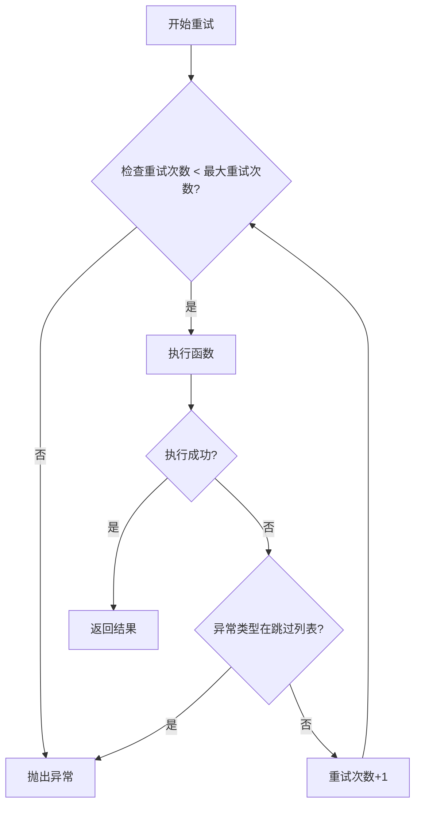
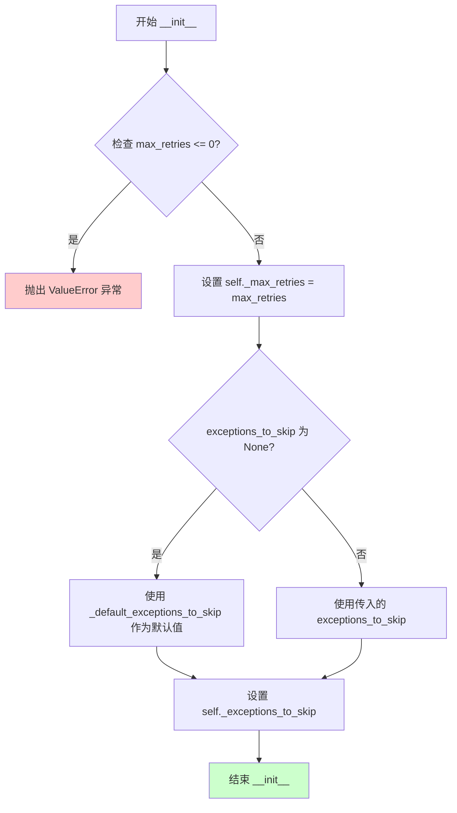

# `graphrag\packages\graphrag-llm\graphrag_llm\retry\immediate_retry.py` 详细设计文档

实现立即重试（Immediate Retry）机制，继承自 Retry 基类，提供同步和异步函数的自动重试功能，支持配置最大重试次数和需要跳过的异常类型，并记录重试指标。

## 整体流程



## 类结构

```
Retry (抽象基类)
└── ImmediateRetry (立即重试实现类)
```

## 全局变量及字段


### `_default_exceptions_to_skip`
    
默认需要跳过的异常类名列表

类型：`list[str]`
    


### `ImmediateRetry.retries`
    
当前重试次数计数器

类型：`int`
    


### `ImmediateRetry.metrics`
    
重试指标字典，用于记录重试次数和带重试请求数

类型：`Metrics | None`
    


### `ImmediateRetry._max_retries`
    
最大重试次数

类型：`int`
    


### `ImmediateRetry._exceptions_to_skip`
    
需要跳过的异常列表

类型：`list[str]`
    
    

## 全局函数及方法


### `ImmediateRetry.retry`

重试机制的核心实现，用于同步函数的重试逻辑。通过循环尝试执行传入的同步函数，并在发生异常时根据配置的重试策略决定是否继续重试。

参数：

- `func`：`Callable[..., Any]`，要重试的同步函数
- `input_args`：`dict[str, Any]`，传递给函数的参数字典，包含函数执行所需的所有参数以及可选的 metrics 字典

返回值：`Any`，函数的返回值

#### 流程图

```mermaid
flowchart TD
    A[开始 retry] --> B[初始化 retries = 0]
    B --> C{循环执行}
    C --> D[执行 func(**input_args)]
    D --> E{是否成功?}
    E -->|是| F[返回函数结果]
    E -->|否| G{异常类型在 exceptions_to_skip 中?}
    G -->|是| H[直接抛出异常]
    G -->|否| I{retries >= max_retries?}
    I -->|是| H
    I -->|否| J[retries += 1]
    J --> K[执行 finally 块更新 metrics]
    K --> C
    F --> L[结束]
    H --> L
```

#### 带注释源码

```python
def retry(self, *, func: Callable[..., Any], input_args: dict[str, Any]) -> Any:
    """Retry a synchronous function."""
    retries: int = 0  # 初始化重试计数器
    # 从 input_args 中提取 metrics（如果存在）
    metrics: Metrics | None = input_args.get("metrics")
    while True:  # 无限循环，直到成功或抛出异常
        try:
            # 尝试执行传入的同步函数
            return func(**input_args)
        except Exception as e:
            # 获取异常类名
            exception_name = e.__class__.__name__
            # 如果异常类型在跳过列表中，直接抛出
            if exception_name in self._exceptions_to_skip:
                raise
            
            # 检查是否达到最大重试次数
            if retries >= self._max_retries:
                raise
            # 增加重试计数器
            retries += 1
        finally:
            # 无论成功还是失败，都更新 metrics
            if metrics is not None:
                metrics["retries"] = retries
                # 如果有重试发生，则标记 requests_with_retries
                metrics["requests_with_retries"] = 1 if retries > 0 else 0
```

---

### `ImmediateRetry.retry_async`

用于异步函数的重试机制实现，与 `retry` 方法类似，但支持异步函数的执行和等待。

参数：

- `func`：`Callable[..., Awaitable[Any]]`，要重试的异步函数
- `input_args`：`dict[str, Any]`，传递给函数的参数字典，包含函数执行所需的所有参数以及可选的 metrics 字典

返回值：`Any`，异步函数的返回值

#### 流程图

```mermaid
flowchart TD
    A[开始 retry_async] --> B[初始化 retries = 0]
    B --> C{循环执行}
    C --> D[执行 await func(**input_args)]
    D --> E{是否成功?}
    E -->|是| F[返回函数结果]
    E -->|否| G{异常类型在 exceptions_to_skip 中?}
    G -->|是| H[直接抛出异常]
    G -->|否| I{retries >= max_retries?}
    I -->|是| H
    I -->|否| J[retries += 1]
    J --> K[执行 finally 块更新 metrics]
    K --> C
    F --> L[结束]
    H --> L
```

#### 带注释源码

```python
async def retry_async(
    self,
    *,
    func: Callable[..., Awaitable[Any]],
    input_args: dict[str, Any],
) -> Any:
    """Retry an asynchronous function."""
    retries: int = 0  # 初始化重试计数器
    # 从 input_args 中提取 metrics（如果存在）
    metrics: Metrics | None = input_args.get("metrics")
    while True:  # 无限循环，直到成功或抛出异常
        try:
            # 尝试执行并等待传入的异步函数
            return await func(**input_args)
        except Exception as e:
            # 获取异常类名
            exception_name = e.__class__.__name__
            # 如果异常类型在跳过列表中，直接抛出
            if exception_name in self._exceptions_to_skip:
                raise
            
            # 检查是否达到最大重试次数
            if retries >= self._max_retries:
                raise
            # 增加重试计数器
            retries += 1
        finally:
            # 无论成功还是失败，都更新 metrics
            if metrics is not None:
                metrics["retries"] = retries
                # 如果有重试发生，则标记 requests_with_retries
                metrics["requests_with_retries"] = 1 if retries > 0 else 0
```


### ImmediateRetry.retry_async

异步重试方法，用于重试异步函数调用。该方法通过捕获异常并根据配置的重试策略和异常跳过列表来决定是否需要重试，同时记录重试相关的指标。

参数：

- `func`：`Callable[..., Awaitable[Any]]`，要重试的异步函数
- `input_args`：`dict[str, Any]`，传递给异步函数的参数字典

返回值：`Any`，被重试函数成功执行后的返回值

#### 流程图

```mermaid
flowchart TD
    A[开始 retry_async] --> B[初始化 retries = 0]
    B --> C[从 input_args 获取 metrics]
    C --> D{循环执行}
    
    D --> E[尝试执行 await func(**input_args)]
    E --> F{是否成功?}
    F -->|是| G[更新 metrics: retries, requests_with_retries]
    G --> H[返回函数结果]
    
    F -->|否| I{异常类型是否在跳过列表?}
    I -->|是| J[重新抛出异常]
    I -->|否| K{重试次数 >= 最大重试次数?}
    
    K -->|是| J
    K -->|否| L[retries += 1]
    L --> M[更新 metrics: retries, requests_with_retries]
    M --> D
```

#### 带注释源码

```python
async def retry_async(
    self,
    *,
    func: Callable[..., Awaitable[Any]],
    input_args: dict[str, Any],
) -> Any:
    """Retry an asynchronous function."""
    # 初始化重试计数器
    retries: int = 0
    # 从输入参数中获取指标对象，用于跟踪重试状态
    metrics: Metrics | None = input_args.get("metrics")
    
    # 无限循环，直到成功或抛出异常
    while True:
        try:
            # 尝试执行异步函数并返回结果
            return await func(**input_args)
        except Exception as e:
            # 获取异常类名，用于判断是否需要跳过
            if e.__class__.__name__ in self._exceptions_to_skip:
                # 如果异常在跳过列表中，立即重新抛出
                raise

            # 检查重试次数是否已达到上限
            if retries >= self._max_retries:
                # 达到最大重试次数，抛出异常
                raise
            # 未达到上限，增加重试计数
            retries += 1
        finally:
            # finally 块确保无论成功或失败都会更新指标
            if metrics is not None:
                # 记录当前重试次数
                metrics["retries"] = retries
                # 记录是否发生了重试（用于统计）
                metrics["requests_with_retries"] = 1 if retries > 0 else 0
```


### `ImmediateRetry.__init__`

初始化 ImmediateRetry 类的实例，配置最大重试次数和需要跳过的异常列表，用于实现立即重试机制。

参数：

- `max_retries`：`int`，最大重试次数，默认为 7
- `exceptions_to_skip`：`list[str] | None`，需要跳过的异常类名列表，默认为 None（使用系统默认值）
- `**kwargs`：`dict`，额外参数，用于接收父类参数（当前未被使用）

返回值：`None`，无返回值（`__init__` 方法）

#### 流程图



#### 带注释源码

```python
def __init__(
    self,
    *,
    max_retries: int = 7,                    # 最大重试次数，默认7次
    exceptions_to_skip: list[str] | None = None,  # 需要跳过的异常列表
    **kwargs: dict,                          # 额外参数，用于父类兼容性
) -> None:
    """Initialize ImmediateRetry.

    Args
    ----
        max_retries: int (default=7)
            The maximum number of retries to attempt.

    Raises
    ----
        ValueError
            If max_retries is less than or equal to 0.
    """
    # 设置最大重试次数属性
    self._max_retries = max_retries
    
    # 如果未提供异常列表，则使用系统默认的异常列表
    # _default_exceptions_to_skip 是预定义的异常类名列表
    self._exceptions_to_skip = exceptions_to_skip or _default_exceptions_to_skip
```


### `ImmediateRetry.retry`

同步函数重试方法，通过无限循环和异常捕获机制实现立即重试功能，在达到最大重试次数前持续尝试执行失败的操作，同时记录重试指标。

参数：

- `func`：`Callable[..., Any]`，要执行的可调用对象（同步函数）
- `input_args`：`dict[str, Any]`，传递给函数的参数字典，包含函数所需的参数和可选的 metrics 指标对象

返回值：`Any`，返回被调用函数的执行结果

#### 流程图

```mermaid
flowchart TD
    A[开始重试] --> B[初始化 retries = 0]
    B --> C{无限循环}
    C --> D[尝试执行 func(**input_args)]
    D --> E{是否成功?}
    E -->|是| F[返回函数结果]
    E -->|否| G{异常类型在跳过列表中?}
    G -->|是| H[重新抛出异常]
    G -->|否| I{retries >= max_retries?}
    I -->|是| H
    I -->|否| J[retries += 1]
    J --> K{finally 块}
    K --> L{metrics 不为 None?}
    L -->|是| M[更新 metrics]
    L -->|否| C
    M --> C
    H --> Z[结束]
    F --> Z
```

#### 带注释源码

```python
def retry(self, *, func: Callable[..., Any], input_args: dict[str, Any]) -> Any:
    """Retry a synchronous function.
    
    同步重试方法的实现，通过无限循环持续尝试执行函数，
    直到成功或达到最大重试次数。
    
    Args:
        func: 要执行的可调用对象（同步函数）
        input_args: 传递给函数的参数字典，可包含 metrics 键用于记录重试指标
    
    Returns:
        Any: 返回 func 的执行结果
    
    Raises:
        Exception: 如果达到最大重试次数或遇到需要跳过的异常，则重新抛出原始异常
    """
    # 初始化重试计数器
    retries: int = 0
    
    # 从输入参数中提取 metrics（如果存在）
    # metrics 是一个可选的字典，用于记录重试相关的指标数据
    metrics: Metrics | None = input_args.get("metrics")
    
    # 无限循环，持续重试直到成功或达到最大重试次数
    while True:
        try:
            # 使用关键字参数调用函数并返回结果
            # 如果成功执行，直接返回结果并退出循环
            return func(**input_args)
        except Exception as e:
            # 捕获所有异常（这是重试机制的核心）
            
            # 检查异常类型是否在需要跳过的异常列表中
            # 如果是，则立即重新抛出异常，不进行重试
            if e.__class__.__name__ in self._exceptions_to_skip:
                raise
            
            # 检查是否已达到最大重试次数
            # 如果是，则不再重试，重新抛出异常
            if retries >= self._max_retries:
                raise
            
            # 未达到最大重试次数，增加重试计数器
            retries += 1
        finally:
            # finally 块确保无论成功还是失败都会执行指标更新
            if metrics is not None:
                # 记录当前重试次数
                metrics["retries"] = retries
                # 记录是否发生了重试（用于统计重试请求的比例）
                metrics["requests_with_retries"] = 1 if retries > 0 else 0
```


### `ImmediateRetry.retry_async`

异步函数重试方法，用于在异步函数执行失败时根据配置的重试策略进行自动重试，直到成功或达到最大重试次数。

参数：

- `func`：`Callable[..., Awaitable[Any]]`，要重试的异步函数
- `input_args`：`dict[str, Any]]`，传递给异步函数的参数字典

返回值：`Any`，异步函数成功执行后的返回值

#### 流程图

```mermaid
flowchart TD
    A[开始 retry_async] --> B[初始化 retries = 0]
    B --> C{无限循环}
    C --> D[执行 await func(**input_args)]
    D --> E{执行成功?}
    E -->|是| F[返回函数结果]
    E -->|否| G[捕获异常 e]
    G --> H{e.__class__.__name__ 在 exceptions_to_skip 中?}
    H -->|是| I[重新抛出异常, 终止重试]
    H -->|否| J{retries >= max_retries?}
    J -->|是| I
    J -->|否| K[retries += 1]
    K --> L{更新 metrics}
    L -->|是| M[设置 retries 和 requests_with_retries]
    M --> C
    L -->|否| C
    F --> Z[结束]
    I --> Z
```

#### 带注释源码

```python
async def retry_async(
    self,
    *,
    func: Callable[..., Awaitable[Any]],
    input_args: dict[str, Any],
) -> Any:
    """Retry an asynchronous function.
    
    异步函数重试的核心实现，通过无限循环实现即时重试机制。
    
    Args:
        func: 要重试的异步函数，必须是可等待的Callable
        input_args: 传递给函数的参数字典，可包含metrics用于跟踪重试状态
    
    Returns:
        Any: 函数成功执行后的返回值
    
    Raises:
        Exception: 当达到最大重试次数或遇到需要跳过的异常时
    """
    # 初始化重试计数器
    retries: int = 0
    # 从输入参数中提取可选的metrics对象用于监控
    metrics: Metrics | None = input_args.get("metrics")
    
    # 无限循环实现即时重试
    while True:
        try:
            # 执行异步函数并返回结果
            # 如果成功则跳出循环
            return await func(**input_args)
        except Exception as e:
            # 捕获所有异常进行重试判断
            # 检查异常类型是否在需要跳过的列表中
            if e.__class__.__name__ in self._exceptions_to_skip:
                # 如果是需要跳过的异常类型，立即重新抛出
                raise

            # 检查是否已达最大重试次数
            if retries >= self._max_retries:
                # 达到最大重试次数，停止重试并抛出异常
                raise
            # 未达最大重试次数，增加计数器
            retries += 1
        finally:
            # finally块确保metrics总是被更新，无论成功或失败
            if metrics is not None:
                # 记录本次操作的重试次数
                metrics["retries"] = retries
                # 标记本次请求是否发生了重试
                metrics["requests_with_retries"] = 1 if retries > 0 else 0
```

## 关键组件


### ImmediateRetry 类

立即重试策略的实现类，继承自 Retry 基类，提供同步和异步函数的立即重试功能，支持最大重试次数配置和异常过滤。

### retry 方法

同步函数重试方法，通过无限循环持续尝试执行函数，直到成功或达到最大重试次数，每次失败时检查异常是否需要跳过。

### retry_async 方法

异步函数重试方法，与 retry 方法逻辑相同，但支持 await 异步函数调用，提供异步操作的重试能力。

### _max_retries 字段

最大重试次数配置，类型为 int，默认值为 7，控制重试策略的最多尝试次数。

### _exceptions_to_skip 字段

异常跳过列表，类型为 list[str]，包含需要直接抛出而不进行重试的异常类名。

### 异常过滤机制

根据异常类名判断是否需要跳过重试，如果异常在 _exceptions_to_skip 列表中则立即重新抛出，否则继续重试流程。

### Metrics 指标收集

通过 input_args 获取 metrics 字典，在重试完成后记录 retries 重试次数和 requests_with_retries 是否发生重试的指标。


## 问题及建议


### 已知问题

-   **指标更新逻辑错误**：在 `finally` 块中更新指标，导致即使第一次执行成功也会设置 `retries` 值，逻辑不够严谨
-   **异常匹配方式脆弱**：使用异常类名（字符串）进行匹配 (`e.__class__.__name__`)，无法区分来自不同模块的同名异常类
-   **未调用父类构造函数**：虽然继承自 `Retry` 类，但未调用 `super().__init__()`，可能导致父类初始化逻辑丢失
-   **异常处理过于宽泛**：捕获所有 `Exception` 而非允许配置特定可重试异常列表，违背了开闭原则
-   **无重试间隔**：完全无延迟的重试机制可能导致被拒绝的请求继续失败，缺乏退避策略
-   **未使用 `**kwargs`**：构造函数接收 `**kwargs` 但未使用，可能是未完成的实现或遗留代码
-   **缺少日志记录**：重试发生时无任何日志输出，难以调试和监控重试行为
-   **指标直接原地修改**：直接修改传入的 metrics 字典，可能产生副作用

### 优化建议

-   将指标更新逻辑移至成功或重试发生时，而非放在 `finally` 块中执行
-   使用异常类型而非字符串进行比较，或提供基于异常类型的白名单/黑名单机制
-   调用父类构造函数或明确文档说明为何不调用
-   允许配置可重试的异常类型列表，而非固定使用全局默认列表
-   提供可选的重试延迟（可配置为立即重试或带延迟）
-   添加日志记录以追踪重试次数、异常类型等信息
-   使用不可变方式或副本方式处理指标，避免副作用
-   添加重试总耗时、最后异常信息等额外指标字段

## 其它


### 设计目标与约束

本模块的设计目标是提供一种轻量级的即时重试机制，用于在操作失败时自动进行重试，同时避免对可预知异常进行无限重试。核心约束包括：最大重试次数限制（默认7次）、可配置的异常跳过列表、保持与 Retry 基类的接口一致性、同步和异步函数的重试支持。

### 错误处理与异常设计

错误处理采用白名单机制，仅对 `_exceptions_to_skip` 列表中指定的异常类型进行立即传播，不进行重试。对于其他异常，当重试次数未达到 `_max_retries` 时继续重试，达到上限后立即抛出最新捕获的异常。设计上未实现指数退避（exponential backoff），而是采用立即重试策略，这对瞬时故障场景较为适用，但可能不适合需要等待资源恢复的场景。异常信息通过 `e.__class__.__name__` 进行字符串匹配来识别类型，这种方式依赖于异常类名的稳定性。

### 数据流与状态机

重试逻辑的状态机包含三个状态：初始态（retries=0）、重试中（retries < max_retries 且发生可重试异常）、终止态（成功返回或达到最大重试次数）。同步和异步重试流程的数据流一致：接收待执行函数和输入参数字典 → 进入重试循环 → 执行函数 → 捕获异常判断是否可跳过 → 更新重试计数 → 记录指标 → 成功则返回结果或达到上限则抛出异常。Metrics 数据的更新发生在 finally 块中，确保即使发生异常也能记录重试统计信息。

### 外部依赖与接口契约

本类继承自 `Retry` 基类，实现了 `retry` 和 `retry_async` 两个核心方法。外部依赖包括：`Retry` 基类（来自 graphrag_llm.retry.retry）、`_default_exceptions_to_skip` 列表（来自 graphrag_llm.retry.exceptions_to_skip）、`Metrics` 类型（来自 graphrag_llm.types，仅在 TYPE_CHECKING 下导入）。调用方需提供符合契约的输入参数：func 应为可调用对象，input_args 应为包含 "metrics" 键（可选）的字典，返回值为 func 的执行结果或最终抛出的异常。

### 性能考虑

即时重试实现无额外延迟机制，每次重试立即执行。重试循环中使用 while True 配合异常控制流，finally 块在每次迭代都执行指标更新操作，可能带来轻微性能开销。对于高频调用场景，建议评估是否需要引入重试间隔配置。异常类型检查使用字符串匹配而非 isinstance，在大量异常类型场景下可能存在优化空间。

### 线程安全性

当前实现未包含任何线程同步机制（无锁、无原子操作）。在多线程环境下共享同一 ImmediateRetry 实例时，metrics 字典的并发写入可能导致数据竞争问题。如果在多线程环境中使用，建议每个线程创建独立实例或使用线程安全的 metrics 收集机制。

### 使用示例

```python
# 同步重试示例
retry = ImmediateRetry(max_retries=3)
result = retry.retry(func=some_function, input_args={"param1": value, "metrics": {}})

# 异步重试示例
async def call_with_retry():
    retry = ImmediateRetry(max_retries=5)
    result = await retry.retry_async(func=async_function, input_args={"data": info})
    return result
```

### 配置说明

主要配置参数包括：max_retries（int，默认7）控制最大重试次数，设为小于等于0的值会触发 ValueError；exceptions_to_skip（list[str] | None）指定需要立即跳过的异常类名列表，默认为 _default_exceptions_to_skip。input_args 中的 metrics 字典为可选参数，用于收集重试统计信息，字典会被直接修改并添加 "retries" 和 "requests_with_retries" 两个键。

### 测试策略建议

建议测试覆盖场景包括：成功执行单次成功无重试、达到最大重试次数后抛出异常、可跳过异常立即传播、异常跳过列表为空时全部重试、metrics 正确记录重试次数、异步函数重试正常工作、max_retries 为边界值（0和1）时的行为、以及异常参数校验。

### 版本与变更日志

当前版本为初始实现，基于 MIT License 发布。作为 graphrag_llm 重试模块的一部分，该实现专注于即时重试场景，后续可考虑添加指数退避、抖动、熔断器等高级重试策略。


    