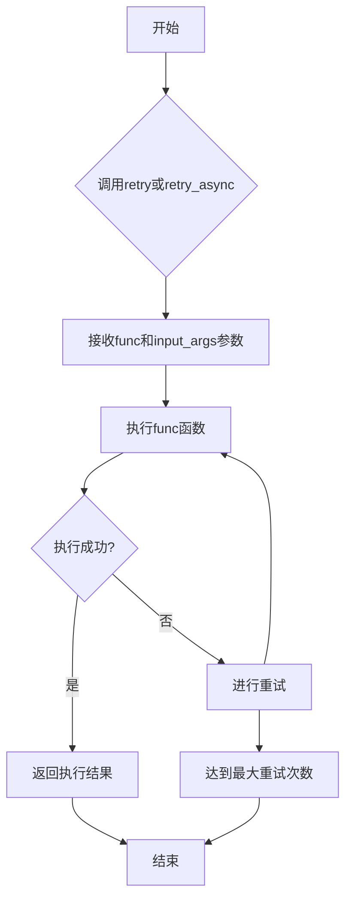
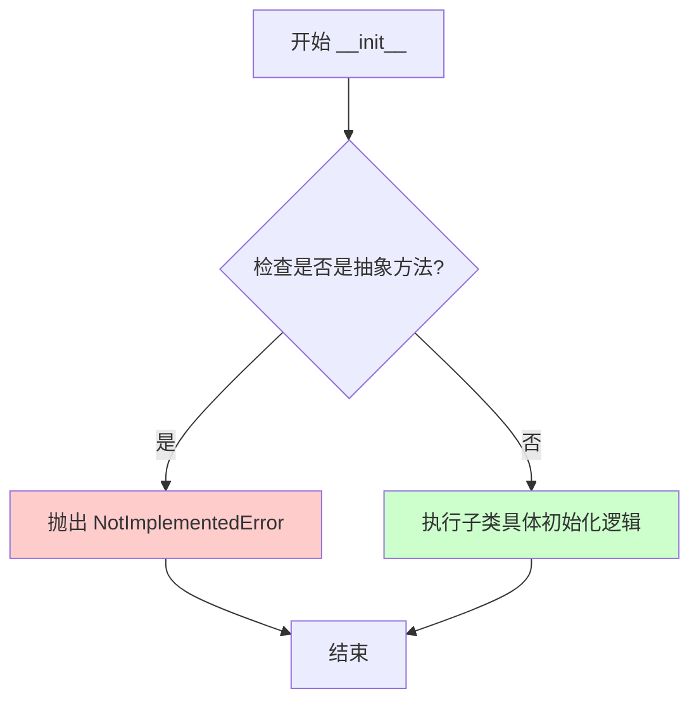
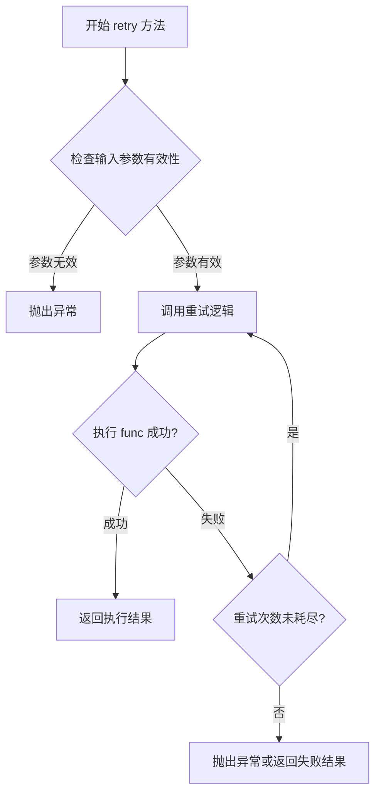
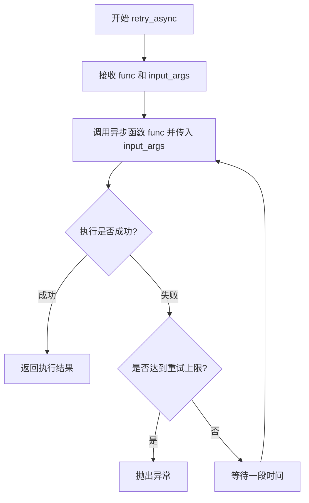
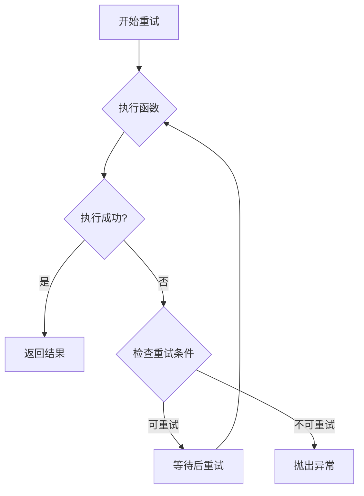
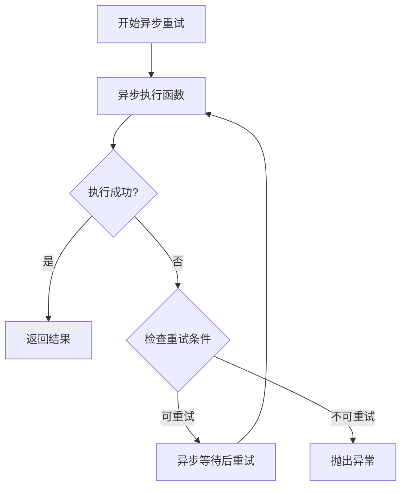

# `graphrag\packages\graphrag-llm\graphrag_llm\retry\retry.py` 详细设计文档

定义了一个重试机制的抽象基类（Retry），提供了同步和异步函数的重试接口规范。

## 整体流程



## 类结构

```
Retry (抽象基类)
  └── (具体实现类待扩展)
```

## 全局变量及字段


### `ABC`
    
Python抽象基类元类，用于创建抽象基类

类型：`abc.ABC`
    


### `abstractmethod`
    
装饰器，用于标记抽象方法

类型：`abc.abstractmethod`
    


### `Awaitable`
    
表示异步可等待对象的类型

类型：`collections.abc.Awaitable`
    


### `Callable`
    
表示可调用对象的类型

类型：`collections.abc.Callable`
    


### `Any`
    
表示任意类型的类型提示

类型：`typing.Any`
    


### `Retry.kwargs`
    
用于重试配置的动态关键字参数

类型：`dict[str, Any]`
    
    

## 全局函数及方法


### `Retry.__init__`

初始化 Retry 抽象类，作为所有重试策略实现类的基类接口。

参数：

- `kwargs`：`Any`，可变关键字参数，用于子类接收特定的配置参数（如最大重试次数、间隔时间等）

返回值：`None`，无返回值

#### 流程图



#### 带注释源码

```python
@abstractmethod
def __init__(self, /, **kwargs: Any):
    """Initialize Retry.
    
    抽象方法，由子类实现具体的初始化逻辑。
    
    参数:
        kwargs: 可变关键字参数，用于传递重试策略的配置选项，
                如 max_attempts、delay、backoff 等参数。
    
    返回值:
        None: 初始化方法不返回值。
    
    注意:
        - 使用 ABC 的 @abstractmethod 装饰器强制子类实现此方法
        - 使用位置参数 / 强制 kwargs 必须以关键字参数形式传递
        - 此方法在子类中必须被重写，否则无法实例化子类
    """
    raise NotImplementedError
```


### `Retry.retry`

重试同步函数的抽象方法，接收要执行的函数及其参数字典，通过重试机制执行并返回结果。

参数：

- `func`：`Callable[..., Any]`，要重试的同步函数
- `input_args`：`dict[str, Any]`，函数的输入参数字典

返回值：`Any`，重试同步函数并返回结果

#### 流程图



#### 带注释源码

```python
@abstractmethod
def retry(self, *, func: Callable[..., Any], input_args: dict[str, Any]) -> Any:
    """Retry a synchronous function.
    
    抽象方法，由子类实现具体的重试逻辑。
    该方法接收一个同步函数及其参数字典，执行重试机制并返回结果。
    
    参数:
        func: 要重试的同步函数，可以是任意接受参数的Callable
        input_args: 函数的输入参数字典，键为参数名，值为参数值
    
    返回:
        Any: 函数执行成功后的返回值
    
    注意:
        - 此方法为抽象方法，子类必须实现
        - 具体重试策略（次数、间隔、异常处理）由实现类定义
        - raise NotImplementedError 表示子类必须实现此方法
    """
    raise NotImplementedError
```


### Retry.retry_async

重试异步函数并返回结果的抽象方法，定义了异步重试机制的接口规范。

参数：

- `func`：`Callable[..., Awaitable[Any]]`，要重试的异步函数
- `input_args`：`dict[str, Any]`，函数的输入参数字典

返回值：`Any`，重试执行后的结果（任意类型）

#### 流程图



#### 带注释源码

```python
@abstractmethod
async def retry_async(
    self,
    *,
    func: Callable[..., Awaitable[Any]],
    input_args: dict[str, Any],
) -> Any:
    """Retry an asynchronous function."""
    raise NotImplementedError
```

## 关键组件


# 重试机制抽象基类设计文档

## 概述

该代码定义了一个名为 `Retry` 的抽象基类（ABC），用于提供重试机制的标准接口。它要求子类实现同步重试（`retry`）和异步重试（`retry_async`）两种方法，以支持在函数执行失败时根据特定策略进行重复调用，适用于网络请求、文件操作等可能因临时性故障导致失败的场景。

## 文件整体运行流程

1. 开发者定义一个继承自 `Retry` 的具体子类
2. 子类实现 `__init__` 方法初始化重试策略（如最大重试次数、间隔时间等）
3. 子类实现 `retry` 方法处理同步函数的重试逻辑
4. 子类实现 `retry_async` 方法处理异步函数的重试逻辑
5. 调用方通过创建子类实例，调用 `retry` 或 `retry_async` 方法执行带重试功能的函数调用

## 类详细信息

### Retry 类

**类描述**：重试机制的抽象基类，定义了重试功能的标准接口。

#### 类字段

| 字段名称 | 类型 | 描述 |
|---------|------|------|
| 无 | - | 本类为抽象基类，不存储实例状态 |

#### 类方法

##### __init__

```python
@abstractmethod
def __init__(self, /, **kwargs: Any):
    """Initialize Retry."""
    raise NotImplementedError
```

| 属性 | 详情 |
|------|------|
| 方法名 | __init__ |
| 参数名称 | self（隐式） |
| 参数类型 | Retry |
| 参数描述 | 抽象方法的 self 参数 |
| 其他参数 | /, **kwargs: Any |
| 参数描述 | 使用位置参数分隔符和关键字参数，允许子类接受任意配置参数 |
| 返回值类型 | None |
| 返回值描述 | 初始化方法不返回值 |

##### retry

```python
@abstractmethod
def retry(self, *, func: Callable[..., Any], input_args: dict[str, Any]) -> Any:
    """Retry a synchronous function."""
    raise NotImplementedError
```

| 属性 | 详情 |
|------|------|
| 方法名 | retry |
| 参数名称 | self（隐式）, func, input_args |
| 参数类型 | Retry, Callable[..., Any], dict[str, Any] |
| 参数描述 | self：实例本身；func：要执行的同步函数；input_args：传递给函数的参数字典 |
| 返回值类型 | Any |
| 返回值描述 | 返回被重试函数的结果 |



##### retry_async

```python
@abstractmethod
async def retry_async(
    self,
    *,
    func: Callable[..., Awaitable[Any]],
    input_args: dict[str, Any],
) -> Any:
    """Retry an asynchronous function."""
    raise NotImplementedError
```

| 属性 | 详情 |
|------|------|
| 方法名 | retry_async |
| 参数名称 | self（隐式）, func, input_args |
| 参数类型 | Retry, Callable[..., Awaitable[Any]], dict[str, Any] |
| 参数描述 | self：实例本身；func：要执行的异步函数；input_args：传递给函数的参数字典 |
| 返回值类型 | Any |
| 返回值描述 | 返回被重试异步函数的结果 |



## 关键组件信息

### Retry 抽象基类

重试机制的核心抽象接口，定义了同步和异步重试的标准契约。

### 同步重试方法 (retry)

处理同步函数的重试逻辑，接受待执行函数和参数字典作为输入。

### 异步重试方法 (retry_async)

处理异步函数的重试逻辑，使用 async/await 模式支持异步操作的重试。

### 初始化方法 (__init__)

使用 `/` 强制位置参数和 `**kwargs` 关键字参数的灵活性设计，允许子类自定义配置选项。

## 潜在技术债务与优化空间

1. **缺乏默认重试策略**：未定义默认的重试次数、退避策略（指数退避、固定间隔）等，建议在基类中提供合理的默认实现
2. **异常处理缺失**：未定义重试过程中的异常处理机制，如最大重试次数后的异常传播
3. **日志记录缺失**：重试过程中缺少日志记录，难以追踪重试行为和调试问题
4. **类型提示可以更精确**：返回值类型为 `Any` 可以更具体化，如指定可能的异常类型
5. **缺少重试条件过滤**：没有提供基于异常类型或返回值的重试条件判断机制

## 其他项目

### 设计目标与约束

- **目标**：提供统一的重试机制接口，支持同步和异步函数
- **约束**：子类必须实现所有抽象方法

### 错误处理与异常设计

- 未定义具体的异常类型，建议在具体实现中定义重试失败异常（如 `RetryExhaustedError`）
- 应区分可重试异常（如网络超时）和不可重试异常（如参数错误）

### 数据流与状态机

- 输入：待执行函数 + 参数字典
- 处理流程：执行 → 成功判断 → 重试决策 → 等待/返回
- 输出：函数执行结果或抛出异常

### 外部依赖与接口契约

- 依赖 `abc` 模块实现抽象基类
- 依赖 `typing` 模块进行类型注解
- 依赖 `collections.abc` 的 `Awaitable` 和 `Callable` 类型
- 调用方需提供符合签名的函数和参数


## 问题及建议


### 已知问题

-   **抽象方法实现不规范**：在抽象方法 `__init__` 中使用 `raise NotImplementedError` 是不标准的做法。抽象方法应该只定义方法签名，不应有实现代码。如果需要阻止直接实例化，应该依赖 `@abstractmethod` 装饰器的默认行为。
-   **类型提示过于宽泛**：使用 `Any` 类型过多，缺乏具体性。`input_args: dict[str, Any]` 应考虑使用 `Mapping[str, Any]` 或定义具体的数据类，以提高类型安全和可读性。
-   **缺少重试策略配置接口**：作为重试抽象基类，未定义重试次数、最大延迟、退避策略、异常过滤等常见重试配置的统一接口，导致子类实现时缺乏一致性标准。
-   **返回值类型不精确**：`retry` 和 `retry_async` 方法的返回值都是 `Any`，未指定具体的异常类型或结果类型，无法为调用者提供明确的契约。
-   **缺乏异常处理机制**：未定义可重试的异常类型过滤机制（如只重试特定异常），也无法区分最终失败和重试耗尽的情况。
-   **文档不完整**：类级别的文档字符串过于简单，未说明设计意图和子类的通用职责。参数描述也较为简略。

### 优化建议

-   移除 `__init__` 方法中的 `raise NotImplementedError`，仅保留方法签名，或完全移除 `__init__` 的抽象方法定义（ABC 可以有非抽象的 `__init__`）。
-   引入 `RetryConfig` 数据类或协议，定义重试次数、间隔、退避策略等配置项，并在抽象类中添加相关属性或方法。
-   使用泛型优化返回值类型，例如 `retry(...) -> Any` 可改为 `retry(...) -> R`，并添加类型变量 `R = TypeVar('R')`。
-   添加异常过滤机制，如 `retryable_exceptions` 参数或在配置中指定可重试的异常类型元组。
-   完善文档字符串，为每个方法添加详细的参数说明、返回值描述和使用示例。


## 其它


### 设计目标与约束

定义一个通用的重试机制抽象基类，为同步和异步函数提供统一的重试接口。约束：子类必须实现所有抽象方法，重试逻辑由具体实现类决定，支持任意可调用对象。

### 错误处理与异常设计

由于是抽象基类，具体错误处理由实现类决定。基类本身不捕获异常，允许多种重试策略（如指数退避、固定间隔等）的灵活实现。

### 数据流与状态机

无状态设计。数据流：调用方传入func和input_args -> 实现类执行重试逻辑 -> 返回结果或抛出异常。

### 外部依赖与接口契约

接口契约：
- retry方法：接受func（可调用对象）和input_args（参数字典），返回Any
- retry_async方法：接受func（异步可调用对象）和input_args（参数字典），返回Any（实际为Awaitable）
- __init__方法：接受任意关键字参数

无外部依赖，仅使用标准库abc和typing。

### 扩展性考虑

可通过继承实现各种重试策略：
- 固定次数重试
- 指数退避重试
- 超时重试
- 带条件判断的重试（如仅对特定异常重试）

### 线程安全/并发考虑

具体实现类需自行考虑线程安全性，基类无相关约束。

### 使用示例

```python
# 客户端代码示例
class FixedRetry(Retry):
    def __init__(self, /, max_attempts: int = 3, **kwargs):
        self.max_attempts = max_attempts
        
    def retry(self, *, func, input_args):
        # 实现同步重试
        pass
        
    async def retry_async(self, *, func, input_args):
        # 实现异步重试
        pass

# 使用
retry_strategy = FixedRetry(max_attempts=5)
result = retry_strategy.retry(func=my_function, input_args={"arg1": "value1"})
```

### 继承实现要求

子类必须：
1. 实现__init__方法（接受/和**kwargs）
2. 实现retry方法（同步重试逻辑）
3. 实现retry_async方法（异步重试逻辑）
4. 处理input_args如何传递给func的细节

    