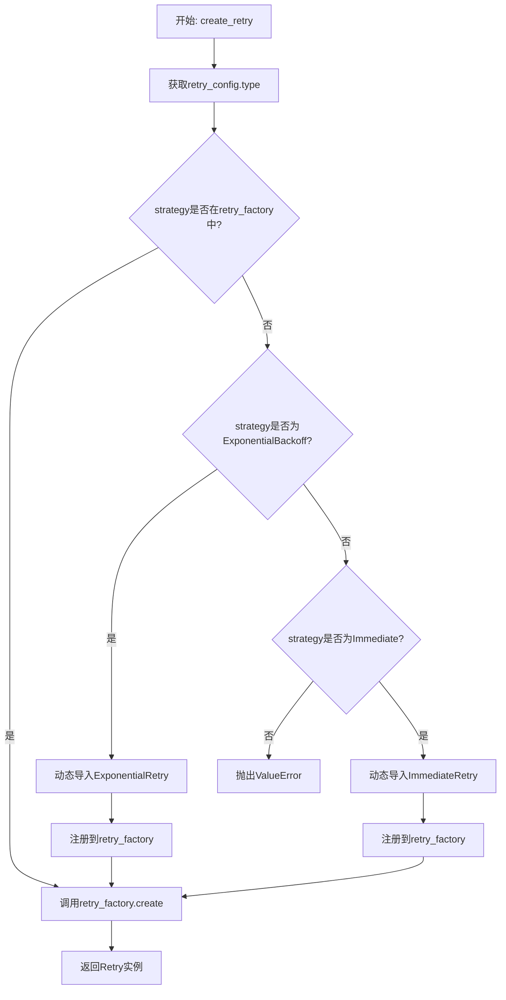
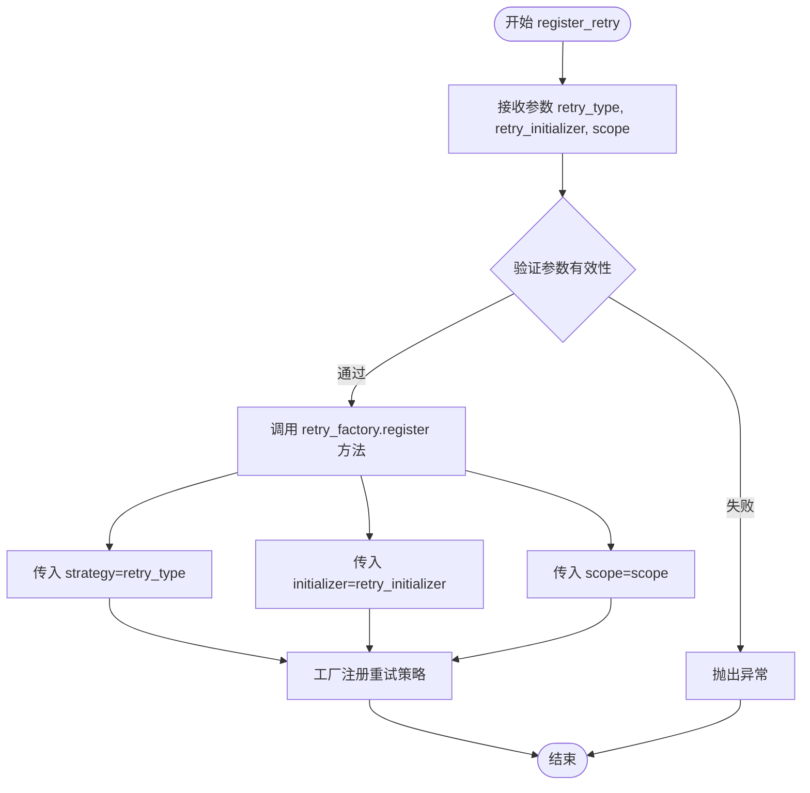
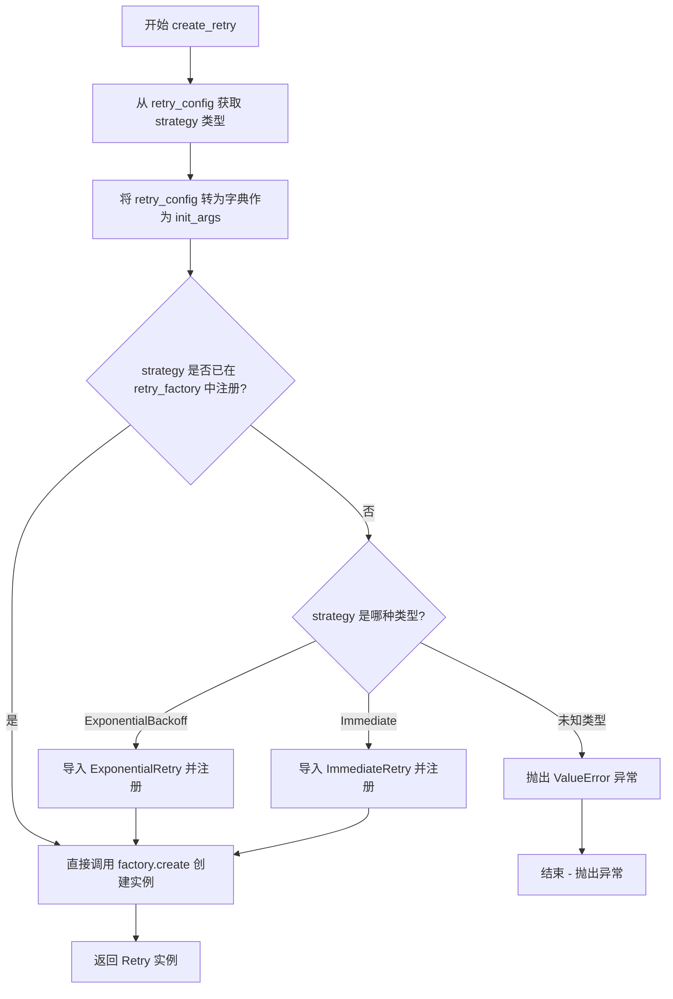
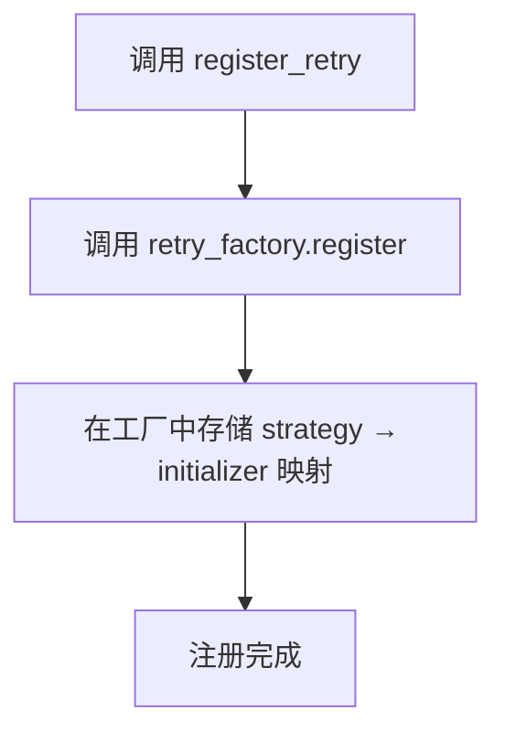
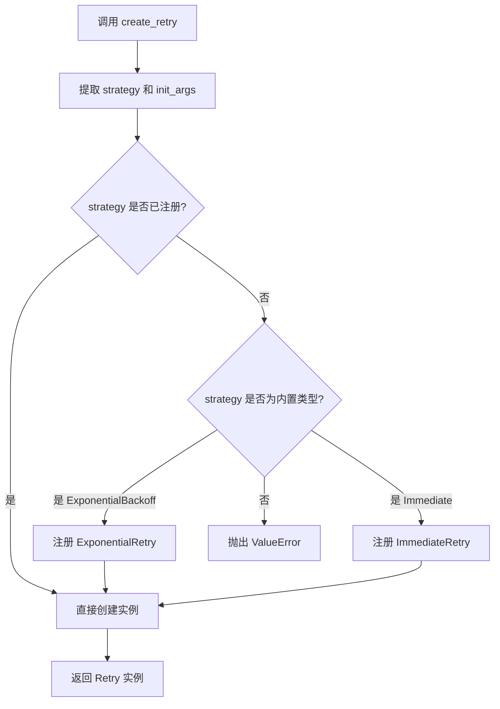

# `graphrag\packages\graphrag-llm\graphrag_llm\retry\retry_factory.py` 详细设计文档

这是一个重试策略工厂模块，通过工厂模式动态注册和创建不同类型的重试实现（Retry），支持指数退避（ExponentialBackoff）和立即重试（Immediate）两种策略，并允许在运行时扩展自定义重试机制。

## 整体流程



## 类结构

```
RetryFactory (工厂类)
└── register_retry (全局函数)
└── create_retry (全局函数)
└── retry_factory (全局变量)
```

## 全局变量及字段


### `retry_factory`
    
全局 Retry 工厂实例，用于注册和创建不同类型的 Retry 实现

类型：`RetryFactory`
    


    

## 全局函数及方法


### `register_retry`

注册一个自定义的 Retry 实现到重试工厂中，允许通过指定的 `retry_type` 标识符来创建对应的重试策略实例。

参数：

- `retry_type`：`str`，要注册的重试策略标识符，用于后续通过 `create_retry` 创建实例时指定重试类型
- `retry_initializer`：`Callable[..., Retry]`，重试初始化器函数或类，用于创建 Retry 实例的可调用对象
- `scope`：`ServiceScope`，服务作用域，默认为 `"transient"`，指定注册的重试策略的生命周期范围

返回值：`None`，该函数仅执行注册操作，不返回任何值

#### 流程图



#### 带注释源码

```python
def register_retry(
    retry_type: str,                          # 重试策略的唯一标识符
    retry_initializer: Callable[..., Retry],  # 创建 Retry 实例的可调用对象
    scope: "ServiceScope" = "transient",      # 服务作用域，默认临时作用域
) -> None:
    """Register a custom Retry implementation.

    Args
    ----
        retry_type: str
            The retry id to register.
        retry_initializer: Callable[..., Retry]
            The retry initializer to register.
    """
    # 调用全局 retry_factory 实例的 register 方法
    # 将自定义重试策略注册到工厂中
    # strategy 参数存储 retry_type 作为键
    # initializer 参数存储用于创建 Retry 实例的可调用对象
    # scope 参数控制注册策略的生命周期范围
    retry_factory.register(
        strategy=retry_type,
        initializer=retry_initializer,
        scope=scope,
    )
```


### `create_retry`

该函数是 Retry 工厂的核心方法，负责根据配置创建相应的重试策略实例。它首先从配置中获取重试策略类型，然后检查该策略是否已在工厂中注册，若未注册则根据策略类型动态导入并注册对应的重试实现，最后通过工厂创建并返回具体的 Retry 实例。

参数：

- `retry_config`：`RetryConfig`，重试策略的配置对象，包含重试类型及其他相关参数

返回值：`Retry`，重试策略的具体实例

#### 流程图



#### 带注释源码

```python
def create_retry(
    retry_config: "RetryConfig",
) -> Retry:
    """Create a Retry instance.

    Args
    ----
        retry_config: RetryConfig
            The configuration for the retry strategy.

    Returns
    -------
        Retry:
            An instance of a Retry subclass.
    """
    # 从配置对象中提取重试策略类型
    strategy = retry_config.type
    
    # 将配置对象序列化为字典，作为初始化参数传递给 Retry 实例
    init_args = retry_config.model_dump()

    # 检查指定的重试策略是否已在工厂中注册
    if strategy not in retry_factory:
        # 根据策略类型进行模式匹配，动态导入并注册对应的 Retry 实现
        match strategy:
            case RetryType.ExponentialBackoff:
                # 导入指数退避重试策略实现类
                from graphrag_llm.retry.exponential_retry import ExponentialRetry

                # 将指数退避重试策略注册到工厂
                retry_factory.register(
                    strategy=RetryType.ExponentialBackoff,
                    initializer=ExponentialRetry,
                )
            case RetryType.Immediate:
                # 导入立即重试策略实现类
                from graphrag_llm.retry.immediate_retry import ImmediateRetry

                # 将立即重试策略注册到工厂
                retry_factory.register(
                    strategy=RetryType.Immediate,
                    initializer=ImmediateRetry,
                )
            case _:
                # 策略类型未匹配任何已知类型，抛出详细的错误信息
                msg = f"RetryConfig.type '{strategy}' is not registered in the RetryFactory. Registered strategies: {', '.join(retry_factory.keys())}"
                raise ValueError(msg)

    # 使用工厂方法创建重试策略实例，传入策略名称和初始化参数
    return retry_factory.create(strategy=strategy, init_args=init_args)
```

## 关键组件


### 一段话描述

该代码实现了一个重试策略工厂模式（Factory Pattern），用于根据配置动态创建不同类型的重试机制（如指数退避和立即重试），支持自定义重试策略的注册，并通过依赖注入的方式提供灵活的重试策略选择。

### 文件的整体运行流程

1. 模块初始化时创建全局 `retry_factory` 单例
2. 应用程序通过调用 `register_retry()` 注册自定义重试实现
3. 调用 `create_retry()` 时传入 `RetryConfig` 配置对象
4. 工厂检查策略是否已注册，未注册时自动注册内置策略
5. 工厂使用 `model_dump()` 提取配置参数并实例化对应的重试类
6. 返回具体 Retry 子类实例供调用方使用

### 类的详细信息

#### RetryFactory 类

**类说明**：继承自通用 Factory 基类的重试策略工厂，负责管理重试实现的注册和创建。

**类字段**：
| 字段名 | 类型 | 描述 |
|--------|------|------|
| 无公开字段 | - | 继承自 Factory 基类 |

**类方法**：
| 方法名 | 参数 | 返回值 | 描述 |
|--------|------|--------|------|
| register | strategy: str, initializer: Callable[..., Retry], scope: ServiceScope | None | 注册重试策略及其初始化器 |
| create | strategy: str, init_args: dict | Retry | 根据策略名称和初始化参数创建实例 |
| keys | - | list[str] | 获取所有已注册的策略名称 |

### 全局变量和全局函数详细信息

#### retry_factory

**类型**：RetryFactory

**描述**：全局单例实例，用于管理所有重试策略的注册和创建。

#### register_retry 函数

```python
def register_retry(
    retry_type: str,
    retry_initializer: Callable[..., Retry],
    scope: "ServiceScope" = "transient",
) -> None:
```

**参数**：
| 参数名 | 参数类型 | 描述 |
|--------|----------|------|
| retry_type | str | 重试策略的唯一标识符 |
| retry_initializer | Callable[..., Retry] | 可调用对象，用于初始化重试实例 |
| scope | ServiceScope | 服务作用域，默认为 "transient" |

**返回值类型**：None

**返回值描述**：无返回值，仅执行注册逻辑。

**Mermaid 流程图**：


**带注释源码**：
```python
def register_retry(
    retry_type: str,
    retry_initializer: Callable[..., Retry],
    scope: "ServiceScope" = "transient",
) -> None:
    """Register a custom Retry implementation.

    Args
    ----
        retry_type: str
            The retry id to register.
        retry_initializer: Callable[..., Retry]
            The retry initializer to register.
    """
    # 委托给工厂实例的 register 方法完成注册
    retry_factory.register(
        strategy=retry_type,
        initializer=retry_initializer,
        scope=scope,
    )
```

#### create_retry 函数

```python
def create_retry(
    retry_config: "RetryConfig",
) -> Retry:
```

**参数**：
| 参数名 | 参数类型 | 描述 |
|--------|----------|------|
| retry_config | RetryConfig | 包含重试策略类型和配置参数的配置对象 |

**返回值类型**：Retry

**返回值描述**：返回 Retry 子类实例，具体类型由配置决定。

**Mermaid 流程图**：


**带注释源码**：
```python
def create_retry(
    retry_config: "RetryConfig",
) -> Retry:
    """Create a Retry instance.

    Args
    ----
        retry_config: RetryConfig
            The configuration for the retry strategy.

    Returns
    -------
        Retry:
            An instance of a Retry subclass.
    """
    # 从配置对象中提取策略类型
    strategy = retry_config.type
    # 将配置序列化为字典作为初始化参数
    init_args = retry_config.model_dump()

    # 检查策略是否已注册
    if strategy not in retry_factory:
        # 动态注册内置策略
        match strategy:
            case RetryType.ExponentialBackoff:
                from graphrag_llm.retry.exponential_retry import ExponentialRetry

                retry_factory.register(
                    strategy=RetryType.ExponentialBackoff,
                    initializer=ExponentialRetry,
                )
            case RetryType.Immediate:
                from graphrag_llm.retry.immediate_retry import ImmediateRetry

                retry_factory.register(
                    strategy=RetryType.Immediate,
                    initializer=ImmediateRetry,
                )
            case _:
                # 策略未注册且非内置类型，抛出异常
                msg = f"RetryConfig.type '{strategy}' is not registered in the RetryFactory. Registered strategies: {', '.join(retry_factory.keys())}"
                raise ValueError(msg)

    # 使用工厂创建重试实例
    return retry_factory.create(strategy=strategy, init_args=init_args)
```

### 关键组件信息

#### RetryType 枚举

重试策略类型枚举，定义支持的策略类型。

#### Retry 基类

所有重试策略的基类，定义了重试行为的接口。

#### ExponentialRetry

指数退避重试策略实现，根据配置执行指数增长的延迟重试。

#### ImmediateRetry

立即重试策略实现，立即执行重试而不等待。

#### RetryConfig

重试配置数据类，包含策略类型和相关的配置参数。

### 潜在的技术债务或优化空间

1. **缺少缓存机制**：每次调用 `create_retry` 都会检查注册状态并可能执行注册逻辑，可以添加实例缓存避免重复创建。

2. **硬编码的内置策略**：内置策略的注册逻辑使用 match-case 硬编码，未来新增策略需要修改此函数，违背开闭原则。

3. **缺少异步支持**：当前仅支持同步重试，未提供异步重试策略的实现接口。

4. **配置验证不足**：未对 `RetryConfig` 的参数进行运行时验证，可能导致实例化失败。

5. **错误信息不够详细**：异常信息中仅列出已注册的策略名称，未提供可用的内置策略列表。

### 其它项目

#### 设计目标与约束

- **设计目标**：提供灵活的可扩展的重试策略创建机制，支持运行时注册自定义策略。
- **约束**：依赖 `graphrag_common.factory.Factory` 基类，需遵循其接口约定。

#### 错误处理与异常设计

- 当传入未注册的非内置策略时，抛出 `ValueError` 异常，异常信息包含已注册的策略列表供开发者排查。
- 内置策略的注册失败（如导入模块失败）会导致异常向上传播。

#### 数据流与状态机

- 配置对象 `RetryConfig` 作为输入，包含 `type` 字段决定策略类型，其他字段作为初始化参数。
- 工厂内部维护 `strategy → initializer` 的映射关系。
- 状态转换：未注册 → 已注册（首次调用时自动完成）→ 已创建实例。

#### 外部依赖与接口契约

- **graphrag_common.factory.Factory**：提供工厂模式的基础实现。
- **graphrag_llm.config.types.RetryType**：定义重试策略类型枚举。
- **graphrag_llm.retry.Retry**：重试策略基类接口。
- **graphrag_llm.config.retry_config.RetryConfig**：配置数据类。


## 问题及建议


### 已知问题

- **注册逻辑硬编码**：在 `create_retry` 函数中，新策略的注册逻辑被硬编码在 match-case 语句中。每添加一个新的重试类型，都需要修改该函数，违反了开闭原则（Open-Closed Principle），增加维护成本。
- **动态导入位置不当**：在 `create_retry` 函数内部进行动态导入（import），虽然这可能是为了避免循环依赖，但会影响代码可读性，且每次调用都会执行导入操作，带来轻微的性能开销。
- **缺乏参数校验**：`create_retry` 函数直接将 `retry_config.model_dump()` 的结果作为初始化参数传递给工厂，没有对参数进行校验（如必填字段、类型验证等），可能导致隐藏的运行时错误。
- **错误信息包含内部实现细节**：错误消息中包含了 `', '.join(retry_factory.keys())`，在生产环境中可能泄露已注册策略的内部实现信息，存在安全隐患。
- **工厂实例暴露为全局变量**：`retry_factory` 作为模块级全局变量暴露，缺乏访问控制，可能被外部代码意外修改或误用，且在多线程环境下可能存在并发访问问题。
- **缺少日志记录**：整个工厂模块没有任何日志记录语句，在创建失败或注册冲突时难以进行问题排查和审计。
- **类型注解不一致**：`scope` 参数使用了字符串字面量 `"ServiceScope"` 作为默认值，而非 `Literal["transient", ...]`，限制了类型检查的有效性。

### 优化建议

- **策略注册自动化**：考虑在模块初始化时扫描并自动注册所有已知的 Retry 子类，或使用装饰器模式（如 `@register_retry`）实现声明式注册，消除硬编码的注册逻辑。
- **提取动态导入至模块顶部**：评估循环依赖问题，如果可以解决，将动态导入移至模块顶部；如果必须使用延迟导入，可以考虑使用缓存机制避免重复导入开销。
- **添加参数校验层**：在调用工厂创建实例前，增加参数校验逻辑，或在 `RetryConfig` 类中定义必填字段和类型约束，确保传入参数的有效性。
- **优化错误消息**：在非调试模式下，移除错误消息中可能泄露内部实现细节的策略列表信息。
- **封装工厂实例**：将 `retry_factory` 封装为私有变量，提供受控的访问方法（如 `get_factory()`），或在需要时使用依赖注入模式，提高可测试性和线程安全性。
- **引入日志记录**：在关键路径（注册、创建失败、策略切换等）添加适当的日志记录，便于运维监控和问题排查。
- **完善类型注解**：使用 `typing.Literal` 或枚举类型明确 `scope` 参数的合法取值，提升类型安全性和代码可读性。

## 其它


### 设计目标与约束

本模块的设计目标是提供一个可扩展的、重试策略的工厂模式实现，支持动态注册和创建不同类型的重试策略实例。核心约束包括：1）必须继承自`Factory`基类以保持一致性；2）支持瞬态（transient）作用域的生命周期管理；3）配置驱动，通过`RetryConfig`动态决定使用哪种重试策略；4）支持自定义重试策略的扩展注册。

### 错误处理与异常设计

主要异常场景包括：1）当传入的`strategy`（即`retry_config.type`）未在工厂中注册且不是内置的`ExponentialBackoff`或`Immediate`类型时，抛出`ValueError`异常，错误信息包含当前已注册的策略列表；2）工厂注册时的重复注册会覆盖已有策略；3）`create_retry`方法依赖`retry_config.model_dump()`生成的字典作为初始化参数，需确保`RetryConfig`配置正确。

### 外部依赖与接口契约

核心依赖包括：1）`graphrag_common.factory.Factory` - 工厂基类，提供了`register`、`create`、`keys`等方法；2）`graphrag_llm.config.types.RetryType` - 枚举类型，定义了内置的重试策略类型；3）`graphrag_llm.config.retry_config.RetryConfig` - 配置类，需提供`type`字段和`model_dump()`方法；4）`graphrag_llm.retry.retry.Retry` - 重试策略基类。`register_retry`函数接受`retry_type`字符串、`retry_initializer`可调用对象和`scope`作用域参数；`create_retry`函数接受`RetryConfig`对象并返回`Retry`实例。

### 配置管理

配置通过`RetryConfig`类集中管理，主要配置项为`type`字段（字符串类型，对应`RetryType`枚举值）。`model_dump()`方法将配置序列化为字典，传递给具体重试策略的构造函数。配置支持运行时动态注册新的重试策略类型。

### 线程安全性

`RetryFactory`实例`retry_factory`是模块级单例，工厂的注册和创建操作需考虑线程安全性。根据`Factory`基类实现，可能需要确保`register`和`create`方法在多线程环境下的互斥访问。具体线程安全性依赖于`graphrag_common.factory.Factory`的实现。

### 扩展性设计

扩展点主要包括：1）通过`register_retry`函数动态注册自定义重试策略；2）内置支持`ExponentialBackoff`和`Immediate`两种策略的按需导入和自动注册；3）通过继承`Retry`基类实现新的重试策略类。扩展时需保持策略类型字符串与注册时的一致性。

### 使用示例

```python
# 注册自定义重试策略
from graphrag_llm.retry.retry import Retry

class CustomRetry(Retry):
    def __init__(self, max_retries: int = 3, **kwargs):
        super().__init__(max_retries=max_retries, **kwargs)
    
    def execute(self, func, *args, **kwargs):
        # 自定义重试逻辑
        pass

register_retry("custom", CustomRetry)

# 创建重试实例
from graphrag_llm.config.retry_config import RetryConfig
config = RetryConfig(type="custom", max_retries=5)
retry = create_retry(config)
```

### 性能考量

性能要点包括：1）按需导入（lazy import）内置重试策略类，避免启动时加载所有依赖；2）工厂注册表使用字典结构，查找和创建操作时间复杂度为O(1)；3）`create_retry`方法每次调用都会执行`model_dump()`，对于高频调用场景可考虑缓存已创建的重试实例；4）策略实例的创建开销取决于具体重试策略的初始化复杂度。


    