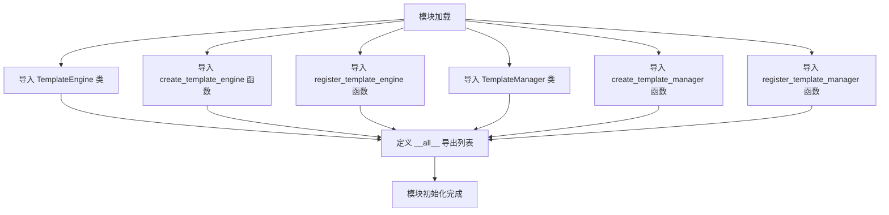
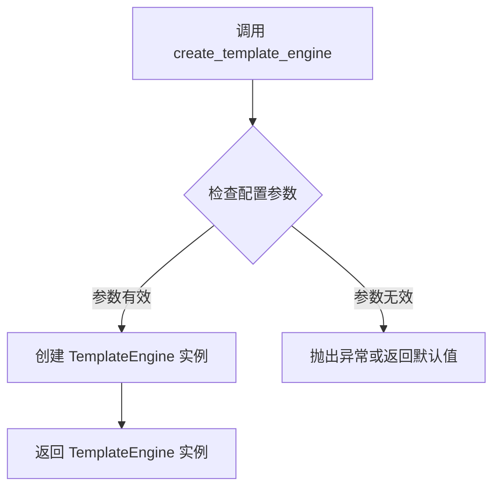
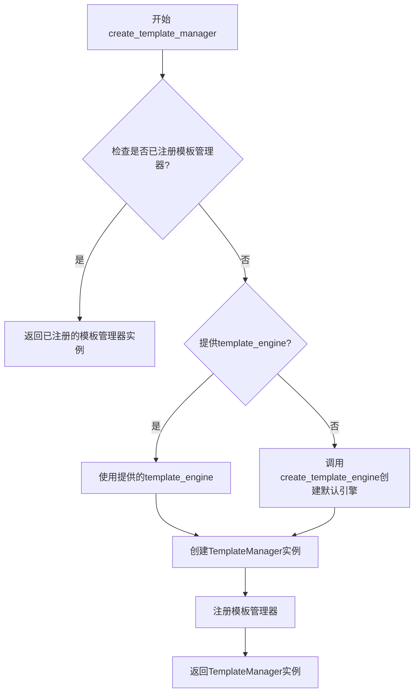
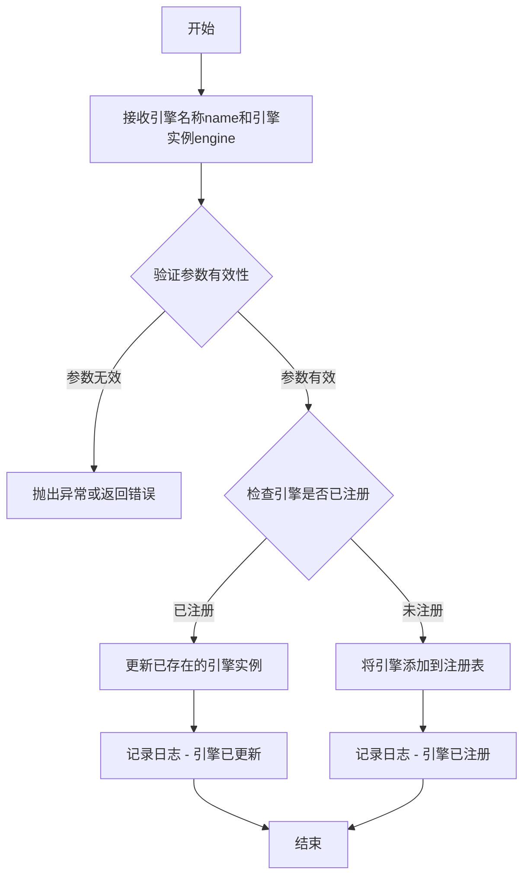
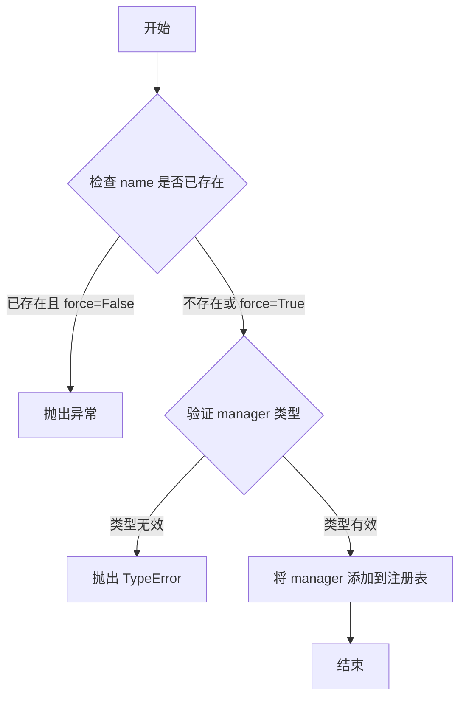

# `graphrag\packages\graphrag-llm\graphrag_llm\templating\__init__.py` 详细设计文档

该模块是 graphrag_llm 包中 templating 子模块的入口文件，通过重新导出（re-export）方式将 TemplateEngine、TemplateManager 等核心类以及相关的工厂函数统一对外提供，形成清晰的公共API接口。

## 整体流程



## 类结构

```
TemplateEngine (抽象基类)
├── [具体模板引擎实现]
TemplateManager (管理类)
└── [具体模板管理实现]
```

## 全局变量及字段


### `__all__`
    
模块公开接口列表，定义了外部可直接导入的符号名称

类型：`List[str]`
    


    

## 全局函数及方法


### create_template_engine

根据提供的代码，`create_template_engine` 是从 `graphrag_llm.templating.template_engine_factory` 模块导入的工厂函数，用于创建 TemplateEngine 实例。

参数：

- 由于源代码未提供详细参数信息，需要查看 `graphrag_llm.templating.template_engine_factory` 模块的实现

返回值：`TemplateEngine`，返回模板引擎实例

#### 流程图



#### 带注释源码

```python
# 从 template_engine_factory 模块导入 create_template_engine 函数
# 该函数用于创建和初始化 TemplateEngine 实例
from graphrag_llm.templating.template_engine_factory import (
    create_template_engine,
    register_template_engine,
)

# 导出 create_template_engine 以供外部模块使用
__all__ = [
    # ... 其他导出
    "create_template_engine",
    # ...
]
```

**注意**：由于提供的代码仅为 `__init__.py` 导入文件，未包含 `create_template_engine` 函数的具体实现。要获取完整的参数信息、返回值描述和详细源码，需要查看 `graphrag_llm/templating/template_engine_factory.py` 文件。


### `create_template_manager`

`create_template_manager` 是一个工厂函数，用于创建并返回一个 `TemplateManager` 实例。该函数是模板管理器工厂模块的核心导出函数，负责实例化模板管理器对象，使其能够管理模板的注册、加载和渲染等操作。

参数：

- `template_engine`：`TemplateEngine`（可选），模板引擎实例，用于处理模板的编译和渲染。如果未提供，可能需要根据配置创建默认引擎
- `template_dir`：`str`（可选），模板目录路径，指定模板文件的存储位置
- `**kwargs`：其他可选配置参数

返回值：`TemplateManager`，返回创建的模板管理器实例，用于执行模板相关操作

#### 流程图



#### 带注释源码

```python
# 从模板管理器工厂模块导入create_template_manager函数
from graphrag_llm.templating.template_manager_factory import (
    create_template_manager,
    register_template_manager,
)

# 注意：以下为基于代码结构的推断实现
# 实际实现需要查看 graphrag_llm/templating/template_manager_factory.py 源文件

# def create_template_manager(
#     template_engine: Optional[TemplateEngine] = None,
#     template_dir: Optional[str] = None,
#     **kwargs
# ) -> TemplateManager:
#     """
#     创建并返回一个TemplateManager实例
#     
#     参数:
#         template_engine: TemplateEngine实例，用于模板处理
#         template_dir: 模板目录路径
#         **kwargs: 其他配置参数
#     
#     返回:
#         TemplateManager: 模板管理器实例
#     """
#     # 如果未提供template_engine，则创建默认引擎
#     if template_engine is None:
#         template_engine = create_template_engine()
#     
#     # 创建TemplateManager实例
#     manager = TemplateManager(
#         template_engine=template_engine,
#         template_dir=template_dir,
#         **kwargs
#     )
#     
#     # 注册管理器以便后续复用
#     register_template_manager(manager)
#     
#     return manager
```


### register_template_engine

该函数是模板引擎工厂模块的注册函数，用于将模板引擎实例注册到全局的模板引擎注册表中，使得系统可以通过名称或其他标识符来获取已注册的模板引擎实例。

参数：

- `name`：`str`，模板引擎的名称或标识符，用于后续从注册表中检索模板引擎
- `engine`：`TemplateEngine`，要注册的模板引擎实例

返回值：`None`，该函数通常无返回值，仅执行注册操作

#### 流程图



#### 带注释源码

```
# 该函数定义在 graphrag_llm/templating/template_engine_factory.py 模块中
# 从提供的 __init__.py 可以看出这是从 template_engine_factory 导入的函数之一

def register_template_engine(name: str, engine: TemplateEngine) -> None:
    """
    注册模板引擎到全局注册表
    
    Args:
        name: 模板引擎的唯一标识名称
        engine: TemplateEngine 实例，要注册的模板引擎对象
        
    Returns:
        None: 注册操作不返回任何值
        
    Note:
        如果相同名称的引擎已存在，通常会覆盖旧实例
    """
    # 具体实现需要查看 template_engine_factory.py 源文件
    # 根据工厂模式的常见实现：
    # 1. 可能维护一个全局字典来存储引擎实例
    # 2. 可能是调用内部函数将引擎添加到某个注册表中
    pass
```

> **注意**：提供的代码片段是 `__init__.py` 文件，仅包含导入语句和模块导出。要获取 `register_template_engine` 函数的完整实现源码，需要查看 `graphrag_llm/templating/template_engine_factory.py` 文件的实际内容。上述参数和实现细节是基于工厂模式注册函数的常见约定进行的合理推断。


### `register_template_manager`

注册模板管理器到全局注册表中，使其可以通过名称被后续调用获取。

参数：

-  `name`：`str`，模板管理器的唯一标识名称
-  `manager`：`TemplateManager`，要注册的模板管理器实例
-  `force`：`bool`，可选，是否强制覆盖已存在的同名管理器，默认为 False

返回值：`None`，该函数无返回值，直接修改全局注册表

#### 流程图



#### 带注释源码

```python
# 从 template_manager_factory 模块导入的 register_template_manager 函数
# 该函数用于将 TemplateManager 实例注册到全局注册表中
from graphrag_llm.templating.template_manager_factory import (
    create_template_manager,
    register_template_manager,
)

# 注意：由于提供的代码片段仅包含导入语句，
# 未包含 register_template_manager 的实际实现代码
# 建议查看 graphrag_llm/templating/template_manager_factory.py 文件获取完整实现
```

---

## 补充说明

### 设计目标与约束

- **设计目标**：提供一种全局模板管理器的注册机制，使不同组件可以通过名称共享和复用模板管理器实例
- **约束**：模板管理器名称必须唯一，除非显式设置 force=True

### 潜在的技术债务或优化空间

1. **信息不完整**：当前代码片段仅包含导入语句，未提供 `register_template_manager` 的实际实现源码，建议补充完整实现以便分析
2. **缺乏错误处理细节**：从导入声明无法判断函数的异常处理机制
3. **模块职责**：建议确认该函数是否同时负责创建和管理模板管理器，可能存在职责过多的问题


## 关键组件


### TemplateEngine

模板引擎核心类，负责模板的处理和渲染功能。

### TemplateManager

模板管理器类，负责模板的创建、存储和检索等管理功能。

### create_template_engine

工厂函数，用于创建TemplateEngine实例的工厂方法。

### create_template_manager

工厂函数，用于创建TemplateManager实例的工厂方法。

### register_template_engine

工厂函数，用于注册TemplateEngine实例的工厂方法。

### register_template_manager

工厂函数，用于注册TemplateManager实例的工厂方法。


## 问题及建议


### 已知问题

- 模块本身缺少文档字符串（docstring），无法直接获取该模块的用途说明和使用方式
- 所有导出项均无类型注解（type hints），降低了代码的可读性和静态分析工具的效能
- `__all__` 列表中暴露了工厂函数和注册函数，但未明确区分公开 API 与内部实现细节，可能导致过度暴露内部接口
- 缺少版本信息定义（如 `__version__`），不利于版本管理和依赖兼容性检查
- 未包含任何异常处理或错误提示机制，当依赖模块导入失败时，用户只会收到 Python 原生的 ModuleNotFoundError，缺乏上下文信息
- 无类型检查、运行时验证或配置验证逻辑，传入错误依赖时难以定位问题

### 优化建议

- 为模块添加模块级文档字符串，说明该模块的核心职责、典型使用场景以及与其他模块的依赖关系
- 为所有导出项添加类型注解（PEP 484），包括函数参数类型和返回值类型，提升 IDE 智能提示和静态检查能力
- 考虑将内部使用的工厂函数和注册函数移至私有命名空间（如 `_factory` 子模块），仅暴露核心抽象类或接口
- 引入 `__version__` 变量，遵循行业标准版本管理实践
- 在模块初始化时添加可选的依赖验证逻辑，使用 `try-except` 捕获导入错误并提供友好的错误信息（如提示是否未安装完整依赖）
- 考虑导出异常类（如 `TemplateError`），便于调用方进行统一的错误处理
- 若存在配置需求，可添加默认配置或配置验证逻辑，提升模块的健壮性

## 其它


### 设计目标与约束

本模块作为 graphrag_llm 系统的模板管理核心组件，旨在提供统一的模板引擎和模板管理器创建、注册、使用机制。设计约束包括：遵循 MIT 开源许可证；依赖 graphrag_llm.templating 包内的其他模块；仅暴露必要的公共接口（TemplateEngine、TemplateManager 及相关工厂函数）。

### 错误处理与异常设计

模块本身未定义异常类，异常处理依赖底层模块（template_engine.py、template_manager.py）抛出相应异常。导入失败时抛出 ImportError；工厂函数调用失败时传播底层模块异常。建议在调用 create_* 和 register_* 函数时进行异常捕获。

### 数据流与状态机

本模块为入口模块，不涉及核心数据处理逻辑。数据流为：导入本模块 → 调用工厂函数创建实例 → 使用 TemplateEngine/TemplateManager 进行模板操作。无复杂状态机设计。

### 外部依赖与接口契约

直接依赖：graphrag_llm.templating.template_engine（TemplateEngine 类）、graphrag_llm.templating.template_engine_factory（create_template_engine、register_template_engine 函数）、graphrag_llm.templating.template_manager（TemplateManager 类）、graphrag_llm.templating.template_manager_factory（create_template_manager、register_template_manager 函数）。间接依赖 Python 标准库。

### 配置与初始化

本模块无独立配置，通过导入底层模块实现初始化。使用 __all__ 定义公共 API 导出列表，确保只暴露必要的接口。

### 使用示例

```python
from graphrag_llm.templating import (
    TemplateEngine,
    TemplateManager,
    create_template_engine,
    create_template_manager,
)

# 创建模板引擎
engine = create_template_engine()

# 创建模板管理器
manager = create_template_manager()

# 使用
template = engine.render("template_name", context={})
```

### 版本兼容性

依赖 Python 3.8+（基于类型注解和导入语法推断）。具体 Python 版本要求需参考 pyproject.toml 或 requirements.txt。

### 安全性考虑

本模块仅做接口转发，无直接安全风险。但使用模板渲染时应确保模板来源可信，避免模板注入攻击。

### 测试策略

本模块为纯接口转发模块，测试重点在于验证导入正确性和 __all__ 列表完整性。核心测试应针对底层模块（template_engine、template_manager）展开。

### 性能考虑

本模块无性能瓶颈。性能取决于底层 TemplateEngine 和 TemplateManager 的实现。

### 扩展性设计

通过工厂模式（factory pattern）实现模板引擎和管理器的可插拔扩展。新增模板引擎类型只需在 template_engine_factory 中注册，无需修改本模块。


    